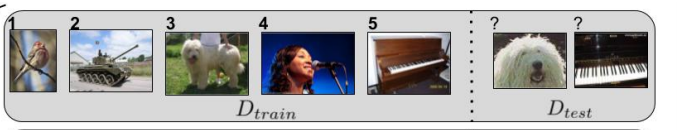

# Few-shot learning（少样本学习）和 Meta-learning（元学习）概述

⌚️: 2020年8月9日

📚参考

- https://blog.csdn.net/weixin_37589575/article/details/92801610

---

# 一、Few-shot learning（少样本学习）

## 1. 问题定义

众所周知，现在的主流的传统深度学习技术需要大量的数据来训练一个好的模型。例如典型的 MNIST 分类问题，一共有 10 个类，训练集一共有 6000 个样本，平均下来每个类大约 600 个样本，但是我们想一下我们人类自己，我们区分 0 到 9 的数字图片的时候需要看 6000 张图片才知道怎么区分吗？很显然，不需要！这表明当前的深度学习技术和我们人类智能差距还是很大的，要想弥补这一差距，少样本学习是一个很关键的问题。另外还有一个重要原因是如果想要构建新的数据集，还是举分类数据集为例，我们需要标记大量的数据，但是有的时候标记数据集需要某些领域的专家（例如医学图像的标记），这费时又费力，因此如果我们可以解决少样本学习问题，只需要每个类标记几张图片就可以高准确率的给剩余大量图片自动标记。这两方面的原因都让少样本学习问题很吸引人。

在 few-shot learning 中有一个术语叫做 N-way K-shot 问题，简单的说就是我们需要分类的样本属于 N 个类中一种，但是我们每个类训练集中的样本只有 K个，即一共只有 N ∗ K个样本的类别是已知的。

图片来自论文《Optimization as a Model for Few-Shot Learning.》，这是一个 5-way 1-shot 的图示，左边是训练集一共 5 张图片来自 5 个类，每个类只有一张图片。右边是测试集，理论上可以有任意多个图片用于测试，图中只给出了两张实例。

Few-shot learning 问题的关键是解决过拟合 (overfitting) 的问题，因为训练的样本太少了，训练出的模型可能在训练集上效果还行，但是在测试集上面会遭遇灾难性的崩塌。

## 2. 解决方法

### 2.1 数据增强和正则化

这一类方法想法很直接简单，既然训练数据不够那我就增加训练样本，既然过拟合那我就使用正则化技术。

1. 数据加强：最常见的例子就是有时对 Omniglot 数据集的预处理，会将图片旋转 90 、180 、270 度，这样就可以使样本数量变为原来的 4 倍。
2. 正则化：在训练的时候加入一个正则项，这个正则项的构建选择是关键。比如 《Few-shot Classification on Graphs with Structural Regularized GCNs》。该论文讨论 Graph 中节点分类的 few-shot 问题，常见的节点分类是使用 GCN 从节点的特征向量 feature 学习一个 embedding 然后用 embedding 来做分类，如果是 few-shot 问题，性能会大大下降（准确率大约从 70% 到了 40%），作者在训练的时候给损失函数加了一个正则项。作者将 feature 到 embedding 的过程看成编码器 encoder，然后额外加了几层网络作为 decoder，将 embedding 重构为 feature ，然后重构误差作为正则项（准确率从 40% 提升了 50%，大约 10 个百分点）。（更多内容可以参考这篇论文和别的使用正则化技术的论文）

### 2.2 Meta-learning（元学习）

元学习的核心想法是先学习一个先验知识（prior），这个先验知识对解决 few-shot learning 问题特别有帮助。Meta-learning 中有 task 的概念，比如上面图片讲的 5-way 1-shot 问题就是一个 task，我们需要先学习很多很多这样的 task，然后再来解决这个新的 task 。最最最重要的一点，这是一个新的 task。分类问题中，这个新的 task 中的类别是之前我们学习过的 task 中没有见过的！ 在 Meta-learning 中之前学习的 task 我们称为 meta-training task，我们遇到的新的 task 称为 meta-testing task。因为每一个 task 都有自己的训练集和测试集，因此为了不引起混淆，我们把 task 内部的训练集和测试集一般称为 support set 和 query set

简单画了一个示意图，前面三个是三个 meta-training task （当然实际需要很多这样的 meta-training task 才能学到我们需要的先验知识)，最后一个就是 meta-testing task。我们最后评价我们的 meta-learning 方法的好坏就是在红色标记部分上的 performance。

方法 2.1 和方法 2.2 之间有个明显的差异就是 meta-learning 需要一些类来构建 meta-training task。由于 meta-testing 的类别要和 meta-training 完全不同，因此如果我们只有 MNIST 数据集，没法使用 meat-learning 来解决 MNIST 上的 10-way few-shot learning 问题，但是方法 2.1 可以。不过我们可以使用 meta-learning 解决 MNIST 上的 N-way (N < 6) 的 few-shot learning 问题。那么如果我们非要解决 MNIST 上的 10-way few-shot learning 问题怎么办呢，可以在另外一个数据集，例如 Omniglot ，上面进行 meta-training，然后学到的先验知识用来解决这个问题。《Siamese neural networks for one-shot image recognition.》 和 《Matching networks for one shot learning.》都在论文中做过这样子实验（这一种情况和迁移学习（transfer learning）有相似的地方）。

# 二、Meta-learning（元学习）

Meta-learning 方法的分类标准有很多，个人喜欢按照如下标准分为三类。参考文章《Learning to Compare: Relation Network for Few-Shot Learning》

1. 学习微调 (Learning to Fine-Tune)
2. 基于 RNN 的记忆 (RNN Memory Based)
3. 度量学习 (Metric Learning)

Meta-learning 中 task 的概念是和 meta-learning 的本质有关的。Meta-learning 其实还有一个名字叫做“学会学习” (Learn to learn)，这来自于对人类智能的基本认知：我们人类学习一个东西的时候不是从头开始学的，都是基于之前学习的知识来进行学习的。比如如果你会玩英雄联盟，那你学习玩王者荣耀会快很多。但是我们的深度学习模型呢，学习新的东西（可以看成新的类，新的 task）需要从头开始学习（ 当然需要大量的样本 ），即使你之前学过特别类似的东西。因此 Meta-learning 就像让深度学习学会学习，利用之前学过的知识在面对新的问题可以学习得又快又好，如何体现又快又好呢？ – few-shot learning 呗~ 因此 meta-learning 和 few-shot learning 现在的研究基本都是在一起的。接下来介绍如何从之前的 task 来学习我们想要的先验知识。

## 1. 学习微调 (Learning to Fine-Tune)

MAML（《Model-Agnostic Meta-Learning for Fast Adaptation of Deep Networks》） 是这类方法的范例之一。MAML 的思想是学习一个 初始化参数 (initialization parameter)，这个初始化参数在遇到新的问题时，只需要使用少量的样本 (few-shot learning) 进行几步梯度下降就可以取得很好地效果（ 参见后续博客 ）。另一个典型是《Optimization as a Model for Few-Shot Learning》，他不仅关注于初始化，还训练了一个基于 LSTM 的优化器 (optimizer) 来帮助微调（ 参见后续博客 ）。

## 2. 基于 RNN 的记忆 (RNN Memory Based)

最直观的方法，使用基于 RNN 的技术记忆先前 task 中的表示等，这种表示将有助于学习新的 task。可参考《Meta networks》和 《Meta-learning with memory-augmented neural networks.》

## 3.度量学习 (Metric Learning)

主要可以参考《Learning a Similarity Metric Discriminatively, with Application to Face Verification.》，《Siamese neural networks for one-shot image recognition》，《Siamese neural networks for one-shot image recognition》，《Matching networks for one shot learning》，《Prototypical Networks for Few-shot Learning》，《Learning to Compare: Relation Network for Few-Shot Learning》。
核心思想：学习一个 embedding 函数，将输入空间（例如图片）映射到一个新的嵌入空间，在嵌入空间中有一个相似性度量来区分不同类。我们的先验知识就是这个 embedding 函数，在遇到新的 task 的时候，只将需要分类的样本点用这个 embedding 函数映射到嵌入空间里面，使用相似性度量比较进行分类。

## 4.方法简单比较

三种方法会在后续博客中继续介绍，这里简单比较一下三种方法：

1. 基于 RNN 的记忆 (RNN Memory Based) 有两个关键问题，一个是这种方法经常会加一个外部存储来记忆，另一个是对模型进行了限制 (RNN)，这可能会在一定程度上阻碍其发展和应用。
2. 学习微调 (Learning to Fine-Tune) 的方法需要在新的 task 上面进行微调，也正是由于需要新的 task 中 support set 中有样本来进行微调，目前我个人还没看到这种方法用于 zero-shot learning（参考 few-shot learning 问题的定义，可以得到 zero-shot learning的定义）的问题上，但是在《Model-Agnostic Meta-Learning for Fast Adaptation of Deep Networks》的作者 Chelsea Finn 的博士论文《Learning to Learn with Gradients》中给出了 MAML 的理论证明，并且获得了 2018 ACM 最佳博士论文奖，还有一点就是 MAML 可以用于强化学习，另外两种方法多用于分类问题。链接：https://mp.weixin.qq.com/s/AdlwI-nbVlDWCj0o5LR7Sw
3. 度量学习 (Metric Learning)，和学习微调 (Learning to Fine-Tune) 的方法一样不对模型进行任何限制，并且可以用于 zero-shot learning 问题。虽然效果比较理想但是现在好像多用于分类任务并且可能缺乏一些理论上的证明，比如相似性度量是基于余弦距离还是欧式距离亦或是其他？为什么是这个距离？（因为 embedding 函数是一个神经网络，可解释性差，导致无法很好解释新的 embedding 空间），虽然《Learning to Compare: Relation Network for Few-Shot Learning》中的 Relation Network 将两个需要比较的 embedding 又送到一个神经网络（而不是人为手动选择相似性度量）来计算相似性得分，但是同样缺乏很好地理论证明。

## 5.未来方向

### 5.1 更好的 meta-learning 方法

现有方法都有各自的优缺点，提出一个新的更好的 meta-learning 方法是目前的主流研究方向。实验结果还有很大的提升空间。例如，如果想从基于度量学习方向出发，那么是否可以从理论入手推导出相似性度量应该怎么选择（图片分类和文本分类问题，CNN 和 RNN 作为 embedding 函数都有可能使度量选择不同）。

### 5.2 meta-learning 的应用

现在的主流还是算法的研究，一般研究问题都是理论上的问题，例如图片的 5-way 1-shot 问题。实际应用问题研究还很少，这也是一个未来的方向。

# 三、论文链接

《Optimization as a Model for Few-Shot Learning》：https://openreview.net/pdf?id=rJY0-Kcll.
《Few-shot Classification on Graphs with Structural Regularized GCNs 》： https://openreview.net/pdf?id=r1znKiAcY7.
《Siamese neural networks for one-shot image recognition》：http://www.cs.toronto.edu/~gkoch/files/msc-thesis.pdf.
《Matching networks for one shot learning》： http://papers.nips.cc/paper/6385-matching-networks-for-one-shot-learning.pdf.
《Learning to Compare: Relation Network for Few-Shot Learning》：http://openaccess.thecvf.com/content_cvpr_2018/papers/Sung_Learning_to_Compare_CVPR_2018_paper.pdf.
《Model-Agnostic Meta-Learning for Fast Adaptation of Deep Networks》：https://www.cs.utexas.edu/~sniekum/classes/RL-F17/papers/Meta.pdf
《Meta networks》：https://pdfs.semanticscholar.org/3ecc/71263d5dd8a51438e351f0a27fba5a6e7592.pdf
《Meta-learning with memory-augmented neural networks.》：http://proceedings.mlr.press/v48/santoro16.pdf
《Prototypical Networks for Few-shot Learning》：http://papers.nips.cc/paper/6996-prototypical-networks-for-few-shot-learning.pdf
《Learning a Similarity Metric Discriminatively, with Application to Face Verification.》：http://yann.lecun.com/exdb/publis/pdf/chopra-05.pdf.

