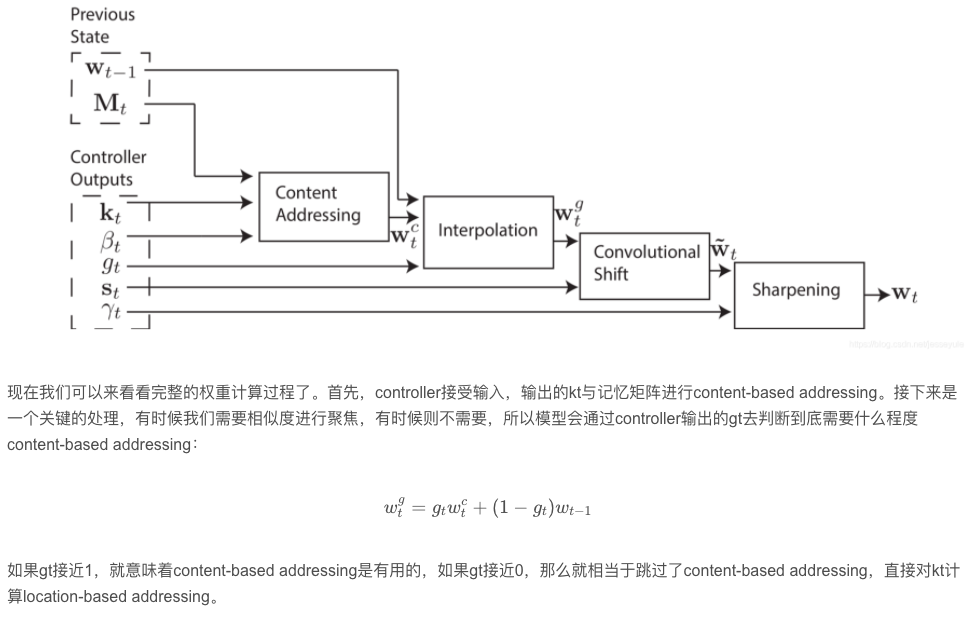

# Few-shot learning（少样本学习）和 Meta-learning（元学习）概述

⌚️: 2021年8月9日

📚参考

- https://blog.csdn.net/Snoopy_S/article/details/88257054
- https://blog.csdn.net/jesseyule/article/details/103824321

---

## 一、元学习概述

自深度学习发展起来之后， 智能化的各种设备也慢慢变多，但是对于智能化的程序来说，需要数以万计甚至百万千万的数据行进训练，以近年来最为出名的AlphaGo为例，虽然下棋的是一台电脑，但其后台需要庞大的数据支持训练才能达到这样的效果。所以这也是深度学习的一个短板，训练数据需要太多，但有时一些训练任务并不能找到这么多的训练数据。这种情况下，如果训练数据较少时给深度学习器加以训练，会出现过拟合的现象，这是不利于应用的，所以对于此随之而来的便是小样本学习问题，即针对样本量较少的任务，需要有一个学习器能够成功应用少量的数据进行好的训练，达到学习器所需的功能。

其实小样本学习问题的产生在另一方面也是因为人的原因，对于人来说，初识一个新的物品，你可以通过探索很快地了解并熟悉它，而这种学习能力，是目前机器所没有的。所以人们思考，如果机器也能拥有这种学习能力的话，面对样本量较少的问题时，便可以快速地学习，这便是元学习（meta learning），也可以称为元学习。

说起小样本学习的发展，在2015年Science杂志封面刊登过一篇文章《Human-level concept learning through probabilistic program induction》，该文章提出了贝叶斯规划学习（BPL）框架，实现One-shot learning，数据集采用了世界各地字母表的手写字符（该文章这里就不具体介绍，有兴趣可以百度搜索一下）。这篇文章也是我接触小样本学习看的第一篇论文，第一次接触小样本学习的同学可以仔细阅读一下。

最近几周一直在看meta learning的模型，从最初的小样本学习模型开始看到最近的MAML各种改进版本，算是有了一点初步的了解，这次就主要介绍一下，什么是小样本学习，什么是元学习，以及在这个领域有哪些经典的值得学习的模型。

首先是小样本学习，按照字面意思，可以理解成在样本量较少的情况下的深度学习。以前也多次提到，其实在样本量较少的时候，往往深度学习模型会过拟合，所以一般不使用深度学习的模型，而小样本学习就是研究如何克服或者缓解这个问题而提出的。

样本量少的话，还用深层神经网络的话，就会导致参数量比训练数据还要多，那还训练什么，这就是以前我们认为样本量少的时候神经网络失效的一个原因。但是有人提出，对人类来说，如果你教一个小孩子什么是斑马，给他看几张照片，他下次就很可能辨认出斑马了，既然人能做到，计算机也应该能做到，那么到底计算机缺少了什么呢，答案就是**先验知识**。

小孩子能快速学会什么是斑马，是因为他知道什么是马，什么是斑马线，所以他一下子就能把这两者结合起来，认为如果一只马身上有斑马线那样的纹路，它就是斑马，可是普通的深度学习模型的算法中并没有体验出这种对先验知识的利用，只是通过大量的数据进行学习什么是斑马，所以小样本学习就从对先验知识的利用出发，构建全新的神经网络。

说完了小样本学习，再说说元学习，网上有些资料说元学习可以理解成学会学习，可以经过少数几次梯度下降，模型就达到较好的效果，我们从另一个角度来看，只经过少数几次梯度下降，和没有什么训练数据，只能在有限的训练次数中达到较好的效果是不是一个意思，所以我更偏向于认为这两者说的都是一个东西，当然一般来说元学习说的是MAML那些模型，但是为了方便理解，还是把这两者看成同一个东西吧。

然后我们来看看具体的模型，对先验知识的利用我认为可以看成有**三个方向**，第一个方向是把训练数据看成先验知识进行利用，第二个方向是构建外部记忆，在记忆中引入先验知识，第三个方向是在模型的初始化参数引入先验知识。（也有一说是base-model和model agnostic，前两者我认为是base-model，最后是model agnostic）

接下来我们用分类任务作为例子，看看模型是如何应用的。首先是把训练数据看成先验知识，最初的模型是**孪生网络**，主要思路就是把测试数据和训练数据一个个对比，看和谁最接近就完成分类，这样效率就很低了，所以就有了原型网络，找出训练数据不同类别的特征向量中心，称为原型，把测试数据和原型对比分析分类。

除此之外，还有匹配网络和关系网络，都是从不同的角度基于训练数据对测试数据进行分析。在这里你可能会想，难道我们以前就没有利用训练数据吗，我的理解是以前我们用训练数据来训练模型，所以先验知识融入到模型的参数中，而现在我们在模型的输入（孪生网络需要输入两个数据）和分析过程中引入了训练数据，就更直接地利用了训练数据辅助判断分析。

第二种思路是构建外部记忆，其实就是最经典的LSTM、GRU、神经图灵机这些模型，虽然一开始我们构建这些模型是为了改善RNN的长期依赖问题，后来发现引入的记忆矩阵有点像人类的记忆机制，所以就在小样本学习这里派上用场了。

最后一种思路就是最经典的从初始化参数入手，最经典的模型就是MAML，个人认为这是元学习最最经典的模型，值得深入学习，大概思路是什么呢，就是训练模型，使得它在各种任务都能取得较好的效果，然后再针对我们特定的任务进行fine tuning，比如我们现在希望训练一个识别海豚的分类器，然后刚好我们的海豚数据又很少，我们就可以把其他差不多样子的鱼的数据，比如三文鱼、鲸鱼等等，让分类器每次训练都进行不同的任务，比如这次训练如何识别三文鱼，下次识别鲸鱼，有时候也学习识别一下海豚，加强它的泛化能力，最后再集中学习如何识别海豚，这个算法的思路有点复杂，详情可看本人的另一篇文章。

总的来说，小样本学习和元学习也算比较新的方向，目前发展前景不错，可以和很多方向结合起来，研究还不算很多，也是一个水论文的新方向。

不知道这样说能不能大概介绍清楚这个方向的内容，如果各位有了解的地方也欢迎交流。

在此之后，人们发现通过元学习能够很好地实现小样本分类任务，因此越来越多的人将目光投在了元学习上。总体来说，通过元学习的方法实现小样本分类大体上有三种：

- **基于度量的元学习**
- **基于模型的元学习**
- **基于优化的元学习**

每一类中都有较多的论文与一些较新的研究成果，下面将简单介绍一下。

### 基于度量的元学习

所谓度量（metric），即通过某种方式来表达两个样本的相关性，比如欧几里得距离，可以认为在某一个投影空间中（嵌入空间，一般使用含参数的神经网络来完成嵌入过程），距离越近的样本越为相似，即认为可以将其分为同一类别。当然，度量方法有很多，但是近几年中运用较多的是余弦距离和欧几里得距离。在此推荐两篇论文，都是基于度量的方法实现小样本学习，我也会在后续的博客中对这些论文进行总结阐述。

  2016-NIPS-《Matching Networks for One Shot Learning》
  2017-NIPS-《Prototypical Networks for Few-shot Learning》

两篇论文方法差不太多，但思想挺好，同时后续的挺多小样本学习方面的研究及论文也是基于这两篇论文完成的。

 当然，这种方法有好也有坏，好处便是通过度量可以很简单的用距离来表达相似性，将距离较近的样本归为一类。但与此同时，个人认为度量学习的一个关键点在于怎么将样本投影至一个空间，同时在这个空间中距离近的样本为同一类别。也许在挺多实验和一些数据集上确实实现了，但是针对不同类型的样本，使用同一套投影方法是否可行呢？面对不同类型的样本是否需要重新训练神经网络的参数呢？这一点也是目前需要解决的问题，即面对不同的分类任务，同一小样本分类器依旧可以较好的使用。

其二简单地使用距离来表达相似性是否可行？在Omniglot数据集上（手写字符），使用距离来表达相似性可行的原因是因为通过将图片的特征矩阵投影到一空间后，得到的矩阵是该手写字符的形状（即可以在矩阵中看出图形形状），这种情况下，就类似于KNN实现手写数字识别，使用距离来说明相似性是好使的。但对于一般的图片来说，得到的特征矩阵和投影后得到的矩阵，这些数字我们看不出任何意义（虽说计算机领域里都说神经网络里训练的数字我们是不能理解的，这些数字就是有用但我们不知道是什么意义），那么这种情况下使用距离来度量相似性是否可行呢？

###  基于模型的元学习

近年来，小样本学习分类发展迅速，面对众多的分类任务，都可以通过训练一个模型来达到任务要求。其中元学习的方法较多，为了最大的适用性，元学习的机制应该是任务的通用性，即面对不同的任务，不需要构建不同的模型，用同样的一套学习算法即可解决多种不同的任务。定义一个模型的可学习参数θ，面对不同的任务，可以通过改变参数θ的值来解决相应的任务。而参数θ的值可以通过元学习器去学习，在面对不同任务的时候，根据损失函数通过梯度下降的方法不断地更新θ值，使这个模型不断向能解决这个任务的模型靠近，当θ值最终收敛时，我们认为元学习器学习到了一个较好的参数θ，让模型自适应地解决相应任务。这个算法是十分高效地，因为它没有为学习器引入其他的参数，并且训练学习器的策略使用的是已知的优化过程（如梯度下降等）而不是从头开始构建一个。

在此推荐两篇有关论文：

  2017-《Model-Agnostic Meta-Learning for Fast Adaptation of Deep Networks》
  2018 - arXiv - 《Task-Agnostic Meta-Learning for Few-shotLearning》

后一篇是在前一篇的基础上进行的相关扩展。

###  基于优化的元学习

在样本量较少的任务中，通常的一些学习器会因为样本较少出现过拟合的现象，同时在训练过程中，为了达到一个较好的效果，学习器通常会训练迭代百万甚至千万次才能够收敛。这些问题不仅影响了学习器的性能，也影响了效率。所以在本项目中，我们考虑一种优化方案，能够在只有少量样本的情况下又能高效地学习，使模型能够通过几个例子很好的学习。我们在元学习器中采用了LSTM网络，使用任务中少量的已标记样本，通过元学习器来优化更新学习器的初始化参数，让学习器在面对相应任务的时候，能够仅用少量的样本，同时较快收敛，达到快速学习解决任务的目的。

 在此推荐一篇论文

2017-ICLR-《Optimization as a model for few-shot learning》

 虽说小样本学习和元学习的目的是快速学习，且近几年来所有研究采用的训练样本量都是少量的，但是个人认为，要实现机器能够自主学习，还是需要大样本做支撑的。就如人一样，其实刚出生的小孩也算是大量样本训练之后的产物，因为人的基因就好比模型的超参数，是经历的很长时间的演化得来的，所以，机器应该也是这样，需要不断学习，不断输入样本集，不断训练，才能达到最后具有学习能力的目的。

## 二、元学习发展

### 1. Siamese Network（孪生网络）

目前有一种说法认为，深度学习模型在数据量较大的情况下才能取得较好的效果，当数据量较少，更偏向于使用传统的机器学习模型。想办法从深度学习的方向构建模型，使得模型在数据量较小的情况下也能取得较好效果，就是meta learning的目标。

那么如何才能实现这个目标呢，从人类学习分类物体的角度来说，人类认识新的物体并不需要太多的样本，这是因为人类拥有更多的先验知识，比如现在叫一个没见过碟子的人，从一堆文具数据中区分出唯一一个碟子，他可能很容易做到，因为他已经在脑海中抽象出文具的概念，即使可能难以描述文具和碟子具体的定义是什么，仍然可以找出那个不属于文具的碟子，这就是人类强大的能力。但是现在的机器做不到，如果想要解决这个问题，模型就需要大量的文具和碟子数据，学习文具和碟子的抽象概念，再进行对比分类。

所以问题可以更具体地表示为，在碟子数据较少的情况下，如何充分利用其他数据作为先验知识构建网络，使得网络能较好地对碟子进行分类，这就是目前主要研究的问题。这里先来介绍一个模型，Siamese Networks孪生网络。

我们可以看看模型的结构，其实思路很简单，就是输入两个样本到两个同样的网络（参数结构相同），最后计算两个网络输出的距离，如果距离较近就认为是同一类，较远就认为是不同的类别，在这里，我们可以使用两个同样参数的CNN，利用CNN从图像中提取特征。注意这里必须是同样的CNN，不然两个不同的CNN，即使输入相同，输出也可能认为两者不同。

现在我们来分析一下孪生网络为什么可以有效地区分碟子，即使数据集中只有一个碟子样本。比如我们有99个文具样本和1个碟子样本，在训练的时候，最多可以用1个碟子和99个文具进行99次训练，这样即使模型依然无法抽象出碟子的概念，但是起码它也可以知道，碟子和文具之间的区别是什么，只要在测试的时候不要加入新的数据（比如突然加入一个杯子，模型就有可能认为他是碟子了，毕竟它都完全没见过杯子），那么模型就很大概率能成功进行分类。顺带一提，模型的测试可以理解成对比测试数据和训练数据中的哪个样本最接近，就认为测试数据是什么类别。

深度学习模型参数一般比较多，而样本数量不足必然就会导致过拟合，而上述的孪生网络，通过对比两个输入进行分类，大量增加了模型的训练数据，这样就相对缓解了模型过拟合的问题。

除此之外，其实也可以看出，对孪生网络来说，先验知识就是训练集的数据，在测试的过程中，把测试数据和训练数据进行一一对比，就是一个利用先验知识的过程，虽然这个过程效率比较低下，所以才有了后续的改进模型。

### 2. Prototypical Networks（原型网络）

https://blog.csdn.net/jesseyule/article/details/103808568

之前我们了解了孪生网络以及他是如何处理one-shot learning的例子，现在我们再来看看另一个模型，原型网络Prototypical Networks。

之前说过，孪生网络的缺点就是要对比目标和过去每个样本之间的相似度，从而分析目标的类别，而原型网络就提出，先把样本投影到一个空间，计算每个样本类别的中心，在分类的时候，通过对比目标到每个中心的距离，从而分析出目标的类别：

大致思路很简单，具体实现也不难，首先是把输入投影到新的特征空间，这个和nlp中的word embedding比较相似，也是通过神经网络，把输入（比如图像）转化为一个新的特征向量，使得同一类的向量之间的距离比较接近，不同类的向量距离比较远。同时，计算每个类别的均值表示该类的原型prototype。

但是原型网络也有一些细节需要注意，先来看看具体过程，首先我们有训练集：

假设我们一共有K个类别，那么我们就从D中为每个类别分出K个子集，每一次迭代，就对一个子集随机抽样得到support set支持集和query set查询集（注意支持集和查询集不能有重复），利用支持集计算原型：

得到每个类的原型之后，再用查询集计算每个样本对应每个类的概率：

假设样本对应的真实类别为k’，那么就可以定义损失函数：

我们希望最小化损失，所以相当于最大化log，也就是最大化x正确分类的概率。通过最小化损失函数，从而优化最初的embedding网络。

整个模型比较特别的地方是训练过程中把数据划分成支持集和查询集，这个很容易理解，毕竟我们必须要通过一部分数据去确定出prototype的位置，在测试过程中我们可以利用训练集确定prototype，但在训练过程中，我们只能划分出两部分，一部分用来确定prototype，另一部分用来训练模型。最后，值得一提的是，通过训练集确定prototype，其实本质上就是模型利用训练集作为先验知识的过程。

### 3. Relation Network（关系网络）

https://www.pianshen.com/article/7250801328/

对小样本学习，一开始介绍了孪生网络，它主要输入数据的任意两幅图像，学习计算他们的匹配程度，从而在测试集中计算测试样本和训练样本的哪个样本匹配程度最高。

孪生网络需要计算任意两两样本的匹配程度，而原型网络则进一步改进，提出对样本进行适当的embedding，然后计算样本每一类的样本中心，称为原型prototype，通过模型学习出prototype的位置，对测试样本计算到每个原型的距离，从而进行分类。

不论是孪生网络还是原型网络，在分析两个样本的时候都是通过embedding后的特征向量距离（比如欧氏距离）来反映，而关系网络则是通过构建神经网络来计算两个样本之间的距离从而分析匹配程度，和孪生网络、原型网络相比，关系网络可以看成提供了一个可学习的非线性分类器用于判断关系，而孪生网络、原型网络的距离只是一种线性的关系分类器。

我们以few-shot learning中的分类问题作为例子讨论一下关系网络的应用，首先查询集和样本集随机抽取样本交给embedding层处理得到feature map，然后把两个feature map拼接在一起，再交给关系网络处理，并计算出关系得分，假如这是一个5-way 1-shot问题，那么我们就可以得到5个得分，每个得分对应查询集样本属于每个分类的得分（概率），用公式可表示为：

其中f表示embedding网络，C表示拼接操作，g表示关系网络。所以实际上，就是把各个类别的样本和测试样本的特征向量拼接起来，输入到神经网络中，通过神经网络分析他们之间的匹配度。

以上是few-way 1-shot的情况，如果是k-shot呢。论文提出把k个样本embedding后的向量相（按位)，形成单个feature map，然后再继续上述的操作。

关于模型的训练，主要目的还是希望模型的关系网络对于正确分类的得分能更高，错误分类得分更低，损失函数形式为：

其中1表示当yi等于yj就输出1，负责输出0。

所以简单来说，关系网络的创新点就是提出用神经网络，而不是欧氏距离去计算两个特征变量之间的匹配程度。

### 4. Matching Network（匹配网络）

https://blog.csdn.net/jesseyule/article/details/103808774

对一个小孩子来说，只要你展示了一次斑马的样子，以后他就能指出什么是斑马了，整个学习的过程只有一个样本，但是对深度学习算法来说还远远达不到这种学习程度，所以研究如何通过小样本甚至一个样本进行学习，就成为了few-shot、 one-shot learning的目的。

当然这里的小样本指的是某一类的样本比较小，比如要分辨猫狗鸡，可能鸡的样本只有几个，但是猫狗比较多，在这种情况下模型如何学习才能更好地分辨出鸡，就是小样本学习了。

关系网络其实就是引入注意力机制，通过对embedding后的特征计算注意力，利用注意力得分进行分析：

首先也是对支持集和查询集进行embedding，然后用查询集样本对每个支持集样本计算注意力：

其中x hat是查询集，xi是支持集，c是余弦距离。

计算了注意力之后，就分析查询集的样本：

yi是每个类别的标签，其实就是把每个类别根据注意力得分进行线性加权。

总的来说，我觉得匹配网络把整个分析的过程都简化到注意力计算的过程中，如果某个类别的注意力得分比较高，其实就意味着测试样本属于这个类别的可能性比较大，所以模型的训练重点就回到最初的embedding了。

### 5. GRU模型

https://blog.csdn.net/jesseyule/article/details/103808825

之前提到的孪生网络那类模型，简单来说他们都是把训练集作为先验知识进行建模，而像LSTM、GRU、神经图灵机这一类模型则提供了另一个新思路，那就是引入外部记忆，在训练过程中通过训练集对外部记忆进行修改，从而在测试的时候利用外部记忆作为先验知识。

LSTM和RNN相比，引入了长期记忆和门结构，缓解了长期依赖问题。所谓的门结构，就是sigmoid函数，通过sigmoid函数分析应该遗忘什么、记忆什么和输入什么。在GRU中，则进一步简化了LSTM，只保留了更新门和重置门两种门操作:

从GRU经过简化也能得到较好的效果可以看出，或许对这类模型而言，选择什么作为输出、具体的遗忘记忆机制是什么或许并不重要，真正重要的是这类模型中具有记忆这个结构，同时模型能够根据当前输入对记忆进行修改，并最终结合记忆和当前输入进行输出，这些才是LSTM和GRU能够取得成功的根本所在。

### 6. 神经图灵机详细分析

https://blog.csdn.net/jesseyule/article/details/103808868

神经图灵机是LSTM、GRU的改进版本，本质上依然包含一个外部记忆结构、可对记忆进行读写操作，主要针对读写操作进行了改进，或者说提出了一种新的读写操作思路。

神经图灵机之所以叫这个名字是因为它通过深度学习模型模拟了图灵机，但是我觉得如果先去介绍图灵机的概念，就会搞得很混乱，所以这里主要从神经图灵机改进了LSTM的哪些方面入手进行讲解，同时，由于模型的结构比较复杂，为了让思路更清晰，这次也会分开几个部分进行讲解。

#### 概述

首先我们来看一下神经图灵机是怎么运作的：

神经图灵机和LSTM一样，在每个时刻接受输入并返回输出，输入首先会通过controller处理，controller把处理过的输入以及一系列参数传给读写头，读写头会根据这些东西，计算权重，并对记忆矩阵memory进行消除、写入、读取操作，最后读头返回读取的记忆给controller，controller就可以根据这个记忆计算该时刻的输出，然后就可以等待下一时刻的输入了。

#### 记忆权重

个人觉得神经图灵机主要改进了LSTM的门结构，以前，我们通过对上一时刻的输出和当前时刻的输入分别进行线性变换并相加，再用sigmoid函数进行处理，得到一个用于记忆或者遗忘的权重向量，再和长期记忆按位相乘。这种权重的计算机制是通过神经网络基于数据进行学习，当然可行。而神经图灵机则从注意力的角度，用更接近人的思维，提出分别从content-based和location-based的角度进行注意力计算。

事实上，神经图灵机比起lstm取得更好的效果，主要是因为他其中的location-based的注意力计算，这个location-based的注意力计算有什么用呢，举个例子来说，以前的lstm，你给他一杯奶茶，他可能不能一下子回忆起奶茶是什么，只能勉强回忆起这东西有点像茶、有点像牛奶，然后通过神经网络计算出奶茶或许就是0.5的茶加0.5的奶，换句话说，lstm只能通过相似性或相关性进行模糊匹配访问信息，并不能做到精准的检索信息。

而现在神经图灵机则改进了这种回忆能力，使得模型能够快速回忆起指定内容，而不仅仅是相似的内容，所以如果你给神经图灵机一杯奶茶，他可能一下子就回忆起这个奶茶就是三天前喝过的那个饮料，三天前这个时间就是通过location-based的注意力计算得出的。

#### content-based addressing

#### location-based addressing

content-based addressing可以帮助模型实现基于相似性的回忆能力，但如果希望模型能够回忆起特定的内容，还需要location-based addressing，也就是准确回忆起某一时刻（位置）的记忆的能力。

我们看看location-based addressing的公式

#### 权重计算完整过程

#### 读写操作

计算了权重之后，就相当于模型知道每次处理输入的时候，应该把注意力放在哪些地方，所以接下来就可以结合这个权重进行读写操作了。

最后再总结一下，整个神经图灵机结构包括四部分：controller、读写头和记忆矩阵，controller的作用最重要，包括对输入的处理以及输出各种参数辅助权重的计算，读头则主要负责根据controller的输出从记忆矩阵中读取关注的部分记忆，写头则基于controller的输出，产生擦除向量和写入向量，对记忆矩阵进行消除和写入，经过这一轮的读写操作后，controller再基于读头返回的信息分析模型在该时刻的最终输出。

### 7. MAML与Meta-SGD

https://blog.csdn.net/jesseyule/article/details/103808965

meta learning的一个**重点在于如何在模型中引入先验知识**，在孪生网络、原型网络等模型中，他们**利用训练集作为先验知识**，通过对比测试样本和训练样本进行分析，在神经图灵机等记忆增强神经网络中，模型引入了外部记忆，在训练过程中通过优化外部记忆，从而在训练新任务时，能通过外部记忆更快更准确地学习，而接下来要介绍的MAML，则从模型的参数初始化入手。

重新再说一次，小样本学习或者元学习的目的就是对于一个新任务，比如关于新类别的分类任务，模型在原来的基础上，只需要学习几个样本，经过几次迭代，就能达到很好的效果。

MAML算是给予了元学习一个新方向，像这种开拓性的模型，理解起来比其他改进性的模型要困难，所以我打算先详细讲一下如何通俗地理解MAML的思想。

首先我们来看一个例子，现在有四个洞打地鼠，之前地鼠每个洞都出现过，而下一次地鼠出现的地点是随机的，那么你要站在哪里才能在一分钟内打到地鼠。

如果我们用传统的机器学习或者深度学习模型去分析，模型可能会根据上几次地鼠出现的地点去预测下一次它出现的地点，然后结合不同地点的距离分析出你应该站的位置，比如说上几次地鼠都出现在1号洞，那么模型就很有可能建议你站在1号洞附近等待。

可是这样做可能有一个问题，就是你站在一号洞附近，就有可能离4号洞比较远，万一地鼠下一次出现在4号洞，你就赶不及了，所以，在这种要求下，最好的方法还是选一个距离四个洞都比较近的地点等待。

**MAML的思想就是这样，找到一个模型的初始化参数，使得模型能够在短时间内通过少量样本进行学习，就能达到满意的效果**，或者说这些初始化的参数，经过几次梯度下降，就能使模型达到较好的效果，MAML要找的就是这些参数。

这就是MAML和其他深度学习模型的不同之处，它要找的不是最优的参数，而是能够最快使模型达到最优的参数，为什么要这样呢，个人理解，还是和过拟合这个问题有关，对于小样本问题，深度学习模型因为层数较深，很容易就会过拟合，我觉得这可以表现在模型对于数量小的样本效果较差，特别在样本中同时存在数量较大和数量较小的不同类别的样本的时候，如果要做一个分类问题，模型肯定就会偏向于数量较大的类别。

所以MAML就提出，不如找一个平衡点，使得模型既不会偏向数量较大的类别，也不会偏向数量较小的类别，而是处于刚刚好的位置，使得在测试的时候，见到样本能够恰当地作出决策。

上图就挺经典的，假设这是一个参数关于模型的损失的图像，可以看到MAML找到的初始化参数会使得模型的损失非常大，效果非常差，但是要记住，MAML的目的不是找到最优参数使得模型效果最优，而是找到最合适的参数使得模型最快达到最优，而从这个角度来说，这个位置距离附近的最低点都是比较近的一个选择。

继续以小样本分类作为例子，以前的话，在样本充足的情况下，我们一直都希望模型能够对每个类别都能够有很好的分类效果。但是在部分类别样本不足的情况下，如果我们还是强行希望模型对他们能达到较好的分类效果，就会导致过拟合的问题，也就是，当我们在测试的时候，如果遇到了这些类别的样本，模型就很可能作出错误的分类，所以其实小样本学习，或者说元学习，虽然一开始说我们有一个目的是希望模型能够学会学习，听着很高深，但是**实质上我们也只是在想办法解决小样本学习中的过拟合问题**，如果模型能够在小样本的情况下也能达到较好的分类效果，那到底它学习能力强不强，根本就不重要，毕竟我们说到底只是希望利用模型做一些应用罢了。

啰嗦了那么久应该能够说清楚MAML的目的和思想了，接下来就讨论一下MAML的具体算法过程。

再说一次，**MAML的目的是寻找一组最好的初始化参数，使得它能够在任意一个新任务上更新少数几次梯度就能达到比较好的效果，之后，再针对具体的任务进行微调，使得模型在小样本上也能达到较好的效果。**

目标提到任意一个新任务，实际意思就是，在MAML的训练过程中，会针对多个任务进行训练，还是以分类作为例子，训练集包含多个task，但不同的task包含的类别不同，比如第一次训练模型需要分类猫狗人钢琴文具，第二次训练模型需要分类车人灯楼猫，反正每次训练的内容都不同：

具体来说，模型的训练数据可以分成两部分，**一部分是为了找出最好的初始化参数，另一部分是关于具体任务用于模型的fine tuning，前者包含meta-train class和meta-test class，后者包含support set（有标签，用于调优）和query set（没有标签，用于预测）。其实也可以看成一个meta class和一个目标class，class里面再分成两部分是模型训练的需要**。

接下来全部以分类任务作为例子介绍，假设现在我们一共有十个类别，我们从中随机抽5个样本构成一个task的train class，重复这个过程得到多个task，在这个过程中，可能train class或者test class中包含了重复的样本，但是影响不大，因为我们的目的是希望模型在面对大量的task中学习到足够强的泛化能力，所以重点在于不同task之间有一定区分度，而模型依然能准确做判断。

然后我们就可以开始训练我们的元模型，每一次的训练，模型会针对每个task做分类，然后计算梯度，更新参数，但是要注意，这个更新是相互独立的，比如现在一个batch有四个task，那么我们分别计算出四个不同的新参数：

把新的参数代进模型，就能得到四个新的模型，然后就可以用新模型分别计算每个task的meta-test class，得到四个损失函数，再加起来，作为一个batch的总损失：

为什么我们需要这个loss，还记得一开始，我们希望能够求出一个初始化参数，使得模型经过少数几次梯度下降就能得到较好的性能，而这里其实就是把梯度下降后的模型性能作为训练的损失函数，既然希望梯度下降之后模型的性能较好，那当然就是最小化梯度下降之后的模型的损失函数：

以上过程就展示了元模型的学习过程，经过学习，模型就能找到最优的初始点，接下来的任务就是针对具体的情况进行fine tuning。

首先当然就是把之前求出来的最有初始参数代进模型，然后就可以利用test class的support set进行训练，这个训练过程就是常规的训练过程了，不需要两次梯度更新，只是常规的利用support set进行梯度下降优化参数，最后再用query set测试模型。

可以看到，上述过程调整的主要是参数，能不能进一步通过模型学习优化的方向和学习率呢，这就是Meta-SGD针对MAML作出的一点改进：

和原式相比，主要改进是学习率不再是常数，而是需要学习的变量，同时a变成了一组和theta同样尺寸的向量，再和微分的损失函数按位相乘，为什么这里要这么做，我说一下我自己的理解。

比如现在模型一共有10个参数要学习，那么theta就是一个长度为10的向量，a也是一个长度为10的向量，现在模型训练了一个task，得到了损失函数，损失函数对这10个不同的参数求导，求出不同的参数在梯度下降时要减去的量，它们也构成了一个长度为10的向量。之前，我们用一个固定的常数a去乘它，现在，我们的a也不是固定的了，是可以通过模型学习的了，在这种情况下，我觉得模型就更加灵活，可以通过学习调整不同参数的学习率，比如对第一个参数，可以乘一个较大的学习率，对第二个参数，乘一个较小的学习率。个人觉得，这样求出来的theta，会比MAML更优。

至于a怎么学习，其实还是和普通的参数一样通过梯度下降学习：

还记得MAML的损失函数是通过两次梯度下降求出来的，而a其实包含在第一次梯度下降后的公式中，所以a虽然作为学习率但其实也是模型损失函数的一部分，并不像平时我们进行一次梯度下降，对损失函数求导后再乘学习率。

### 8. Reptile

