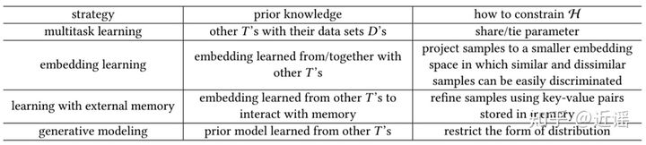
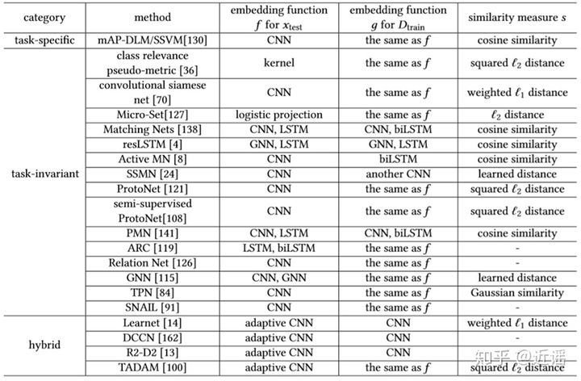

# Few-Shot Learning 综述论文研读

⌚️: 2021年5月31日

📚参考

- https://blog.csdn.net/ld326/article/details/112534524

- https://www.cnblogs.com/jiangxinyang/p/12163215.html

- https://zhuanlan.zhihu.com/p/151806009

- https://www.linkresearcher.com/theses/d7005639-dfac-4ca0-a992-9cc88ca8cc5b
- [【小样本学习】什么是小样本学习？这篇综述文章用166篇参考文献告诉你答案..._机器学习算法那些事-CSDN博客_第四范式 小样本学习](https://link.zhihu.com/?target=https%3A//blog.csdn.net/algorithmPro/article/details/106184414)
- [【文献阅读】小样本学习综述：A Survey on Few-Shot Learning（Y. Wang, 等人，ArXiv，201904）](https://link.zhihu.com/?target=https%3A//blog.csdn.net/z704630835/article/details/103959490)
- [FSL（小样本学习）综述--Generalizing from a Few Examples: A Survey on Few-Shot Learning](https://link.zhihu.com/?target=https%3A//www.cnblogs.com/jiangxinyang/p/12163215.html)
- [综述论文“Generalizing from a Few Examples: A Survey on Few-Shot Learning”_yorkhunter的博客-CSDN博客_generalizing from a few examples: a survey on few-](https://link.zhihu.com/?target=https%3A//blog.csdn.net/yorkhunter/article/details/103966951)

---

> 基于各个方法利用先验知识处理核心问题的方式，该研究将 FSL 方法分为三大类：
>
> 数据：利用先验知识增强监督信号；
>
> 模型：利用先验知识缩小假设空间的大小；
>
> 算法：利用先验知识更改给定假设空间中对最优假设的搜索。

----

近期看了一篇few-shot learning的综述论文，论文题目是《**Generalizing from a Few Examples: A Survey on Few-Shot Learning》(**[https://arxiv.org/pdf/1904.05046.pdf](https://link.zhihu.com/?target=https%3A//arxiv.org/pdf/1904.05046.pdf))，这篇论文已经被ACM Computing Surveys接收，作者还建立了 GitHub repo([https://github.com/tata1661/FewShotPapers](https://link.zhihu.com/?target=https%3A//github.com/tata1661/FewShotPapers))，用于更新该领域的发展。

这篇知乎是记录一下自己对这篇文章的理解，我看了一下其他帖子或者是博客对于这篇论文的解读，都不是很全面，正好自己读完了这篇论文，就趁热打铁，从一个初学者的角度跟大家一起研读一下这篇论文，其中如果有理解不对的地方也希望读者可以指出来，大家一起讨论学习。

下面就开始了。

## 1. FSL概述

### 1.1 FSL定义

首先说一下**为什么要做小样本学习**（few-shot learning,FSL），是因为机器学习在**数据密集型**应用中取得了很大成功，但在面临**小数据集**的情况下往往捉襟见肘。比如说有**数据集收集不到**的情况，例如药物发现（drug discovery），因为分子的毒性和其他性质导致药物的数据收集不到；还有**数据不足**的情况，例如小样本翻译（FSL translation）和冷启动项目推荐（Cold-start item recommendation），小样本翻译比如说一些小语种没有那么多平型语料，冷启动项目推荐比如一个社区软件针对一个新用户的内容推荐，这些数据都是不足以训练一个优秀的模型的；还有一种情况是**为了减轻收集大规模监督数据的负担**，例如image classification, image retrieval, object tracking, gesture recognition, image captioning, visual question answering, video event detection, language modeling, and neural architecture search等等。FSL方法就要解决这个问题，它**利用先验知识**，**能够快速泛化至仅包含少量具备监督信息的样本的新任务**中。一些与FSL相关的机器学习方法有Meta-learning; embedding learning; generative modeling等。

在介绍FSL之前，先说明一下论文的符号和意义。

论文的第一部分从跟machine learning的定义相比介绍了FSL的定义，machine learning的定义是**从经验E中学习到的，性能P可以来衡量任务T的一个计算机程序**。论文还举了两个机器学习的例子来解释具体的T、E、P，一个是图像分类任务（T），E是每个类大规模带标签的图像，性能度量P是分类准度，另一个是围棋任务（T），E是一个包含大约3000万的人的移动表现和自己推演的表现，性能度量P是获胜率。

两个机器学习的T、E、P的例子

Few-Shot Learning（FSL）的定义是**一类机器学习任务（由T、E、P任务指定），其中E只包含一小部分带监督的信息**。也举了三个FSL的例子，分别是字符生成任务、药物毒性发现、图像识别。与machine learning不同的是，每个任务的E都包含两部分内容，一部分是**少量的监督信息**，另一部分是**先验知识**。

特殊的，当E中的监督信息只包含一个例子的时候称为**One-Shot Learning**，当没有例子的时候称为**Zero-Shot Learning(ZSL)**，这里ZSL要求E包含来自其他模式的信息（例如稀有对象识别任务中使用的属性、WordNet、word embedding）。

### 1.2 FSL使用场景

FSL有三种典型的使用情景：一种是作为像人类一样学习的试验台（**Acting as a test bed for learning like human**），例如只利用少量的例子生成一些新的字符的样本，这种情景一般使用先验知识学习预训练的概念，例如部件、关系等；一种是罕见案例学习（**Learning for rare cases**），例如Drug discovery（正确分配有毒或无毒分子的百分比），这种情景的经验E是由新分子的有限实验和许多类似分子的实验作为先验知识获得；一种是减少数据收集工作和计算成本（**Reducing data gathering effort and computational cost**），例如few-shot image classification，这种情景通过每一类标记的图像和联合训练原始图像获得先验知识，这样训练生成的模型的通用性要更高。

### 1.3 相关机器学习问题

然后论文介绍了FSL与其他相关机器学习方法的关联和差异。

- **Weakly supervised learning（弱监督学习）**，这种机器学习方法**从仅包含弱监督（例如不完整、不精确、不准确或有噪声的监督信息）的经验E学习**。弱监督学习又可分为两类：一类是Semi-supervised learning（半监督学习），在有标签和没有标签的混合数据中学习最优假设。例如Positive-unlabeled learning（社交网络中的好友推荐）；另一类是Active learning（主动学习），在标记数据开销很大的情况下选择信息丰富的未标记数据，例如pedestrian detection（行人检测）。而FSL与弱监督学习的区别是，弱监督学习只包括分类和回归，而FSL也包括强化学习问题；不完全监督的弱监督学习主要使用未标记数据作为E中的附加信息，而FSL利用了各种先验知识，如预训练的模型、来自其他领域或模式的监督数据，并且不限制使用未标记数据；因此，只有当先验知识是未标记的数据且任务是分类或回归时，FSL才成为弱监督学习问题。
- **Imbalanced learning（不平衡学习）**，这种机器学习方法**从数据集中学习y的偏态分布（severely skewed distribution）**，例如fraud detection（欺诈检测）、catastrophe anticipation（灾难预测）。相比之下，FSL对y的训练和测试只是使用了几个样本。
- **Transfer learning（迁移学习）**，这种机器学习方法**从有大量训练数据的源域和源任务学到的知识转移到训练数据有限的目标域和目标任务**。典型的两种迁移学习有Domain adaptation（领域适应）和zero-shot learning（零样本学习）。例如sentiment analysis（情绪分析），源域数据包含对电影的客户评论，而目标域数据包含对日常用品的客户评论。FSL问题中先验知识从源任务转移到FSL任务，就变成了转移学习问题。
- **Meta-learning（元学习）**，这种机器学习方法通过提供的数据集和元学习者（meta-learner）跨任务提取的元知识来改进新任务的P。许多FSL方法是元学习方法，使用元学习者（meta-learner）作为先验知识。

### 1.4 FSL的核心问题—经验风险最小化

下面论文详细分析了FSL的核心问题，即不可靠的经验风险最小化（Unreliable Empirical Risk Minimizer）。

首先我们来看一下经验风险最小化（Empirical Risk Minimization），给定一个假设h，我们想最小化它的预期风险（expected risk）R，即相对于p(x,y)的损失度量

因为p(x,y)是未知的，因此我们一般用经验风险（empirical risk）来作为R(h)的proxy，即有I个样本的训练集 ![[公式]](https://www.zhihu.com/equation?tex=D_%7Btrain%7D) 的样本损失的平均值

由此，转化为经验风险最小化（empirical risk minimization），其中可能用到一些正则化的方法。

我们让

总误差可分解为

第一部分是approximation error，第二部分是estimation error。

为了直观得表达三者之间的关系，作者用图来表示

与前面的说明一致，图中的其中H是假设空间， ![[公式]](https://www.zhihu.com/equation?tex=h_%7BI%7D) 是在![[公式]](https://www.zhihu.com/equation?tex=D_%7Btrain%7D)中经验风险最小的假设， ![[公式]](https://www.zhihu.com/equation?tex=h%5E%7B%2A%7D) 是假设空间H中的预期风险最小的假设，h_hat是预期风险最小的假设。整个机器学习的过程就是从出发点开始在假设空间H中找到预期风险最小值的过程。

说完了经验风险最小值，我们来说FSL中不可靠的经验风险最小化（Unreliable Empirical Risk Minimizer），还是用图来说明

左边是大规模数据集的总误差示意图，可以看到 ![[公式]](https://www.zhihu.com/equation?tex=%5Cvarepsilon_%7Best%7D) 很小，但是当数据集是小规模的时候，如图（b）所示，![[公式]](https://www.zhihu.com/equation?tex=%5Cvarepsilon_%7Best%7D)很大，这个经验风险最小化就不再可靠。

### 1.5 FSL方法分类

为了解决减小总误差的问题，可以从三方面入手：

1. data，可以解决FSL训练样本不足的问题
2. model，可以缩小假设空间H的大小
3. algorithm，可以优化适应![[公式]](https://www.zhihu.com/equation?tex=D_%7Btrain%7D)的![[公式]](https://www.zhihu.com/equation?tex=h_%7BI%7D)的搜索方法

论文对这三类解决办法进行了详细的分析，示意图如上图所示，看图应该很好理解这三种做法的意图。文章也对FSL的研究按上面三种解决思路进行了分类，如下图所示

## 2. 数据

然后我们一个一个的来说这三中FSL的方法。

首先是**DATA**，此类 FSL 方法**利用先验知识增强数据** ![[公式]](https://www.zhihu.com/equation?tex=+D_%7Btrain%7D) ，从而扩充监督信息，利用充足数据来实现可靠的经验风险最小化。根据**增强数据的来源**，这类 FSL 方法可分为以下三个类别

用数据增强的方法来解决FSL问题

- Transforming Samples from ![[公式]](https://www.zhihu.com/equation?tex=+D_%7Btrain%7D)：把每个（xi,yi）转换成多个样例以此来扩充数据集
- Transforming Samples from a Weakly Labeled or Unlabeled Data Set：通过从弱标记或未标记的大数据中选择带有目标标签的样本来增强![[公式]](https://www.zhihu.com/equation?tex=+D_%7Btrain%7D)；训练一个分类器将预测为目标标签的数据提取出来加入到![[公式]](https://www.zhihu.com/equation?tex=+D_%7Btrain%7D)中去
- Transforming Samples from Similar Data Sets：此策略通过聚合和调整来自相似但较大数据集的input-output pair来增强![[公式]](https://www.zhihu.com/equation?tex=+D_%7Btrain%7D)

DATA这类方法的缺点对于新的数据集，DATA类方法往往需要新的数据增强的策略，因此它的扩充策略泛化能力差，特别是针对跨域数据。

## 3. 模型

下面我们说第二种FSL方法——**MODEL，**这种方法利用E中的先验知识将假设空间H缩小至较小的 ![[公式]](https://www.zhihu.com/equation?tex=%5Ctilde%7BH%7D) 来学习。基于所用先验知识的类型，这类方法可分为如下四个类别

### 3.1Multitask Learning（多任务学习)

在存在多个相关任务的情况下，多任务学习通过利用任务通用信息和任务特定信息同时学习这些任务。因此，它们可以自然地用于FSL。把few-shot任务作为目标任务，其他的作为源任务，所以Few-shot任务会受其他任务的约束，这种约束有两种方式，一种是Parameter Sharing，另一种是Parameter Tying。

- **Parameter Sharing（参数共享）**，这种约束的NLP例子是charge prediction（费用预测）和legal attribute prediction（法律属性预测），一般做法是首先使用一个简单的embedding function对案件描述进行编码，然后输入特定任务的embedding functions和分类器。参数共享解决FSL问题如下图所示

- - **Parameter Tying（参数绑定）**是鼓励不同任务的参数相似，一个常用的方法是在参数之间使用正则化惩罚。参数绑定解决FSL问题如下图所示
    

### 3.2 Embedding Learning（嵌入学习）

嵌入学习将一个样本x嵌入到低维空间z中，在这个空间中，相似和不相似的数据对就能够很容易识别。嵌入函数主要由先验知识所学得，这类模型通常用于分类问题。嵌入学习有以下几个关键部分：函数f()用于将测试样本嵌入到嵌入空间，函数g()用于将训练样本嵌入到嵌入空间，函数s()用于计算嵌入空间中两个嵌入之间的相似度。函数f和函数g尽管可以相同，但是一般设计的时候尽量设计为不同，这是因为嵌入的测试样本可以根据训练集中的信息显式嵌入，以便于调整比较感兴趣部分。目前所有的模型包括

嵌入学习模型的示意图

- - **Task-Specific Embedding Model（特定任务嵌入模型）**：只用任务信息学习一个嵌入函数。

  - **Task-Invariant Embedding Model（任务不变嵌入模型）**：从外部的一个很大的数据集（不包括实验数据集D）中学习一个嵌入函数，不需要重新训练即可用在 ![[公式]](https://www.zhihu.com/equation?tex=D_%7Btrain%7D) 上。这种方法基于一种假设，如果一个模型可以在嵌入空间中成功区分不同数据，那么它就能够在不需要训练的情况下，很好的作用在数据集D中。有很多工作在训练时模拟few-shot learning的场景，用N个类中的U个类用于训练，N-U个类用于测试，一些通过meta-learning的方法得到更复杂的Task-Invariant Embedding Model的工作如下：

  - - (1) Learnet。是孪生网络的一种改进。
    - (2) Matching Nets。标记在嵌入空间中和测试样本最相似的样本，两者的嵌入函数不同。
    - (3) ProtoNet。对测试样本和训练集原型只比较一次。
    - (4) Relative representations。进一步将测试样本的嵌入与从![[公式]](https://www.zhihu.com/equation?tex=D_%7Btrain%7D)中计算出的每个类在Z中联合嵌入，然后将其直接映射到分类等相似度评分。
    - (5) Relation graph。是保持样本间所有成对关系的图。
    - (6) SNAIL。设计的嵌入网络是由交错的时域卷积（temporal convolution）层和注意力层集成的。

  - **Hybrid Embedding Model（混合嵌入模型）**：上两种模型都有优缺点，一个具有较好的特殊性，一个不需要重新训练，因此就有一种趋势，即将两种模型结合起来。混合嵌入模型通过![[公式]](https://www.zhihu.com/equation?tex=D_%7Btrain%7D)中的任务特定信息来调整从先验知识中学习到的通用任务不变嵌入模型这是通过学习一个函数来完成的，该函数将从![[公式]](https://www.zhihu.com/equation?tex=D_%7Btrain%7D)中提取的信息作为输入，并返回一个作为f()参数的嵌入。模型结构如下图所示
    

### 3.3 Learning with External Memory（外部记忆学习）

这种方法使用external memory学习从![[公式]](https://www.zhihu.com/equation?tex=D_%7Btrain%7D)中提取知识，并将其存储在external memory中。然后，每个新的示例 ![[公式]](https://www.zhihu.com/equation?tex=x_%7Btest%7D) 由从内存中提取的内容的加权平均值表示。这就限制了![[公式]](https://www.zhihu.com/equation?tex=x_%7Btest%7D)由内存中的内容表示，从而从本质上减少了H的大小。这种方法常用的external memory是key-value memory。其中原![[公式]](https://www.zhihu.com/equation?tex=x_%7Btest%7D)表示为 f(![[公式]](https://www.zhihu.com/equation?tex=x_%7Btest%7D))，而现![[公式]](https://www.zhihu.com/equation?tex=x_%7Btest%7D)表示为 f(![[公式]](https://www.zhihu.com/equation?tex=x_%7Btest%7D))与 ![[公式]](https://www.zhihu.com/equation?tex=M_%7Bvalue%7D%28i%29) 的加权和。根据内存的功能，这一类中的FSL方法可以细分为两种类型，如下图所示，其中f是一个通常由CNN或LSTM预先训练的嵌入函数。

用Learning with External Memory解决FSL问题示意图

- - **Refining Representations（优化表示）**：![[公式]](https://www.zhihu.com/equation?tex=M_%7Bvalue%7D%28i%29)存的是表示。而映射规则和memory更新规则有很多，例如

  - - MANN将同一类的样本映射到相同的value。
    - The surprise-based memory module 当M不能很好的表示xi的时候更新。
    - Abstract memory用两块memory，一块用大规模数据训练的固定的M，另一块用few-shot任务中信息最丰富的数据训练。
    - Life long memory为解决样本中稀有样本数据被信息丰富的样本替换掉而提出，终身记忆在任务中清除内存内容，当内存满时清除“最旧”的内存值。然后，所有内存插槽的年龄都重置为零。对于一个新的样本，当返回的![[公式]](https://www.zhihu.com/equation?tex=M_%7Bvalue%7D%28i%29)值与其基本事实相匹配时，与当前![[公式]](https://www.zhihu.com/equation?tex=M_%7Bkey%7D%28i%29)合并，而不是写入新的内存插槽。（仍无法解决稀有样本被替换掉的问题）

  - **Refining Parameters（优化参数）**：Mvalue(i)存的是参数

### 3.4 Generative Modeling（生成模型）

- - 生成模型借助先验知识来估计参数的分布。在生成模型中假设观测到的x服从p(x; θ)分布，通常存在一个隐变量z服从 ![[公式]](https://www.zhihu.com/equation?tex=p%28z%3B%5Cgamma%29) 分布，使得x服从 ![[公式]](https://www.zhihu.com/equation?tex=%5Cint_%7B+%7D%5E%7B+%7Dp%28x%7Cz%3B%5Ctheta%29p%28z%3B%5Cgamma%29dz) 分布。先验分布![[公式]](https://www.zhihu.com/equation?tex=p%28z%3B%5Cgamma%29)是从其他数据集学到的。通过将提供的 ![[公式]](https://www.zhihu.com/equation?tex=D_%7Btrain%7D) 数据集与![[公式]](https://www.zhihu.com/equation?tex=p%28z%3B%5Cgamma%29)结合，从而使得后验分布受到约束。根据潜在变量z的表示，将这些FSL生成建模方法分为三类

用生成模型解决FSL问题的示意图

- - **Decomposable Components：**尽管具有监督信息的样本在FSL问题中是稀缺的，但它们可能与来自其他任务的样本共享一些较小的可分解成分。例如：只使用少数提供的面部照片识别一个人的任务。尽管相似的脸可能很难找到，但可以很容易地找到眼睛、鼻子或嘴巴相似的照片。通过大量的样本，可以很容易地学习这些可分解组件的模型。然后只需要找到这些可分解组件的正确组合，并确定此组合属于哪个目标类。由于可分解的组件是由人类选择的，所以这种策略更具解释性。
  - **Groupwise Shared Prior：**相似的任务具有相似的先验概率，这可以在FSL中使用。例如，以“橙色猫科动物”、“豹子”、“孟加拉虎”三类为例，这三种动物是相似的，但孟加拉虎濒临灭绝，而橙色猫科动物和豹子却非常丰富。因此，我们可以从“橙色猫科动物”和豹子身上学习先验概率，并将其作为few-shot类“孟加拉虎”的先验概率。一组数据集（Dc）通过每组中的无监督学习数据集被分组到一个层次结构中，一起学习一个新的few-shot类的类先验概率，首先找到这个新类所属的组，然后通过从组共享先验概率中提取的类先验对其建模。
  - **Parameters of Inference Networks：**为找到最佳的θ，一个方法是最大化后验 ![[公式]](https://www.zhihu.com/equation?tex=p%28z%7Cx%3B%5Ctheta%2C%5Cgamma%29%3D%5Cfrac%7Bp%28x%2Cz%3B%5Ctheta%2C%5Cgamma%29%7D%7Bp%28x%3B%5Cgamma%29%7D%3D%5Cfrac%7Bp%28x%7Cz%3B%5Ctheta%29p%28z%3B%5Cgamma%29%7D%7B%5Cint_%7B%7D%5E%7B%7Dp%28x%7Cz%3B%5Ctheta%29p%28z%3B%5Cgamma%29dz%7D) ，但是分母积分不好求解，转而用变分分布 ![[公式]](https://www.zhihu.com/equation?tex=q%28z%3B%5Cdelta%29) 来估计 ![[公式]](https://www.zhihu.com/equation?tex=p%28z%7Cx%3B%5Ctheta%2C%5Cgamma%29) 。最近， ![[公式]](https://www.zhihu.com/equation?tex=q%28z%3B%5Cdelta%29) 通常用amortized variational inference with the inference network求得。这个方法有很多例子，例如the variational auto-encoder(VAE)，autoregressive model，generative adversarial networks(GAN)，a combination of VAE and GAN等。

## 4. 算法

现在我们说第三种方法——**ALGORITHM**。算法是为了在假设空间H中，找寻最优假设h下的参数θ，一种常见的策略就是使用SGD（随机梯度下降）。按照查找策略是如何受先验知识影响，方法分为3种，如下图所示

### 4.1 Refining Existing Parameters

从相关任务中学习预训练模型的参数`θ_0`，假设是`θ_0`捕获了大规模数据中的一般结构，通过一定次数的迭代来适应D（few-shot learning）。根据方法不同，有三种具体的fine-tuning参数的方法：

- - 1、Fine-Tuning Existing Parameter by Regularization：用正则化fine-tuning预训练的θ_0，这种方法存在的问题是过拟合，解决办法有四种：

  - - (1) Early-stopping
    - (2) Selectively updating `θ0`(选择性更新)
    - (3) Updating related parts of `θ0` together（一起更新相关θ0 ）
    - (4) Using a model regression network（Model regression network捕获了任务不可知的转换，该转换将通过几个示例的训练获得的参数值映射到将通过大量示例的训练获得的参数值。 ）
      
      Fine-Tuning Existing Parameter by Regularization

- - 2、Aggregating a Set of Parameters：在没有合适初始化参数的时候，聚合多个其他模型的参数是一种选择。例如眼睛、鼻子、耳朵识别模型的参数用来聚合形成人脸识别模型的参数。针对如何有效的适应新任务问题，有两个解决办法：

  - - (1) Unlabeled data set（通过预训练函数聚合和分离样本）
    - (2) Similar data sets（旧特征转化为新特征）
      
      Aggregating a Set of Parameters

- - 3、Fine-Tuning Existing Parameter with New Parameters：•在预训练`θ_0`不足以很好的编码FSL任务的时候，加入一个新参数δ来考虑 Dtrain的特性，通过学习δ来fine-tuning` θ_0`。例如底层通过预训练的CNN捕获特征嵌入，并在![[公式]](https://www.zhihu.com/equation?tex=D_%7Btrain%7D)上的嵌入特征学习一个线性分类器.

    

### 4.2 **Refining Meta-Learned Parameter**

用meta-learning细化meta-learned 参数`θ_0`（调整步长和搜索方向）代表模型为Model Agnostic Meta-Learning(MAML)。Φs是特定任务的参数，通过梯度下降算法得到 ![[公式]](https://www.zhihu.com/equation?tex=%5Cphi_%7Bs%7D%3D%5Ctheta_%7B0%7D-%5Calpha%5CDelta_%7B%5Ctheta_%7B0%7D%7DL_%7Btrain%7D%5E%7Bs%7D%28%5Ctheta_%7B0%7D%29) ， ![[公式]](https://www.zhihu.com/equation?tex=%5Ctheta_%7B0%7D%5Cleftarrow%5Ctheta_%7B0%7D-%5Cbeta%5CDelta_%7B%5Ctheta_%7B0%7D%7D%5Csum_%7B%7D%5E%7B%7D%7B_%7BT_%7Bs%7D-P%28T%29%7D%7DL_%7Btest%7D%5E%7Bs%7D%28%5Ctheta_%7B0%7D%29) 。针对MAML提出了三方面改进：

- - (1) Incorporating task-specific information（结合具体任务信息，针对新任务取初始化参数的子集）
  - (2) Modeling the uncertainty of using a meta-learned θ0（对不确定性进行建模）
  - (3) Improving the refining procedure.（改进细化方法）

Refining Meta-Learned Parameter

### 4.3 **Learning the Optimizer（学习优化器）**

不使用梯度下降，而是学习一个优化器，它可以直接输出θ的更新。这样就无需调整步长α或查找搜索方向，因为学习算法会自动做这些事。（meta-learning）

Learning the Optimizer

## 5. 未来工作

FSL的未来研究方向论文分了四个部分，分别是**Problem setups**、**Techniques**、**Applications**和**Theories**。

在FSL的**Problem setups**方面：

- 现有的FSL方法通常使用来自单一模态（如图像、文本或视频）的先验知识，然而，尽管![[公式]](https://www.zhihu.com/equation?tex=D_%7Btrain%7D)对于当前使用的模态有一些示例，但是可能存在另一种有监督样本丰富的模态。例如对外来动物的研究。虽然这种动物可能只有有限数量的视觉例子，但在文本领域（如教科书或网页）可能有很多关于它的信息，因为人们往往特别注意这一罕见的类。因此，来自多模态的先验知识可以为互补视图提供先验知识。在zero-shot learning（ZSL）中，多模态数据被频繁使用。示例先验信息包括属性、WordNet、单词嵌入、共现统计和知识图谱。
- 最近，有人尝试将技术从ZSL方法借用到FSL问题。例如，可以使用少量的 ![[公式]](https://www.zhihu.com/equation?tex=D_%7Btrain%7D) 来微调由ZSL方法学习的参数。但是，使用少量样本进行微调可能会导致过度拟合。另一种可能性是强迫通过多模态学习的嵌入在共享空间中匹配。最近的一项工作利用了标签之间的结构化关系，并利用GNN来对齐FSL的嵌入。由于不同的模式可能包含不同的结构，应该小心处理。例如，文本需要服从句法结构，而图像不需要。未来一个有希望的方向是在设计FSL方法的时候使用多模态信息。

在FSL的**Techniques**方面：

- 根据如何使用FSL中的先验知识，从data、model、algorithm三个方面对FSL方法进行分类，每个组件都可以改进。
- 跨任务学习、meta-learning值得继续研究。现实中有大量的任务，但关联性未知，故不能直接迁移
- FSL方法分为静态和动态，在流应用中新任务不断出现，如何避免旧任务被遗忘是个问题。
- 假设空间和搜索策略依赖人的设计， Automated machine learning (AutoML)通过构造任务感知的机器学习模型，在许多应用中取得了最新的进展。最近AutoML已用于数据增强。

在FSL的**Applications**方面：

- Computer Vision：

- - Character recognition
  - image classification
  - object recognition
  - font style transfer
  - phrase grounding
  - Imagere trieval
  - Object tracking
  - Specific object counting in images
  - 。。。

- Robotics

- - 例如机器人手臂运动的学习，从单个示例中模仿学习 或者 在纠正错误动作的老师的帮助下，从一些演示中学习操作动作。
  - 除了模仿用户之外，机器人还可以通过与用户的交互来改善他们的行为。最近，一些辅助策略是通过FSL强化学习从少量交互中学习的。
  - multi-armed bandits
  - Visual navigation
  - Continuous control

- Natural Language Processing

- - Parsing

  - Translation

  - Sentence completion

  - Sentiment classification from short reviews

  - User intent classification for dialog systems

  - Criminal charge prediction

  - word similarity tasks

  - - nonce definition
    - multi-label text classification

  - A new relation classification dataset called FewRel

在FSL的**Theories**方面：

- 目前仍有许多理论问题有待探索，对FSL算法的收敛性还没有完全了解。特别是，元学习方法在任务分布上优化θ，而不是在单个任务上。

------

这篇论文篇幅很长，也看了很长时间，觉得meta-learning在FSL中扮演着重要的角色，或许我下一步会去对meta-learning进行进一步的了解。这篇论文有什么理解上的错误，还希望各位读者能够指出，我们一起在学习中进步，不胜感激！

