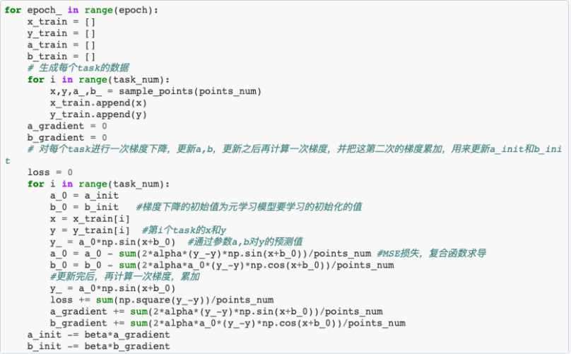

# Model-Agnostic Meta-Learning （MAML）算法简介

⌚️: 2021年5月31日

📚参考

- https://cloud.tencent.com/developer/article/1678123
- TODO：https://github.com/dragen1860/MAML-Pytorch

---

今天的文章为你带来对Model-Agnostic Meta-Learning （MAML）算法的一些理解！

## 1. **背景**

人类可以通过极少的数量来识别新的物体。比如，我们在看到一只萌萌哒猫咪以后，再见到第二只，我们也可以清楚地知道这是一只萌萌哒猫咪，其他物体也是如此。研究人员希望机器可以具有人的这种学习能力，以便在有限的样本中，也可以获得强大能力，这就是小样本学习（Few-shot Learning，FSL）。

小样本学习，顾名思义，就是在小数据量的基础上进行训练，并获得效果不错的模型。根据香港科技大学王雅晴博士最新发表的文章**Generalizing from a Few Examples: A Survey on Few-Shot Learning** ，我们可以将小样本的研究思路分为：模型、数据以及算法。而实现这些思路的主要方法包括：模型优化、度量学、元学习等等。这其中，元学习是很重要的一种实现方法。（网上有资料显示，小样本即元学习（Meta Learning）在监督学习领域的应用，笔者无法赞同。在调查了2015年-2019年这5年中各大顶会关于小样本的工作后，笔者发现，**元学习只是小样本中很重要的一个方法，并不是唯一一个方法**）。

元学习，即学习如何去学习的能力。通过在训练阶段将数据集分解为不同的task，去学习类别变化情况下模型的泛化能力；在测试阶段，尽管面对全新的类别，不需要改变已有的模型，就可以完成分类任务。

元学习的算法有很多。例如AutoML，这种算法可以针对不同的训练任务，输出不同的神经网络结构和超参数。但是这类算法相当复杂，不易实现。而另外一些元学习算法，不改变神经网络的结构，只改变网络的初始参数，这种方法相较于前一种更易于实现，例如本文将要介绍的MAML。

## 2. **MAML**

Model-Agnostic Meta-Learning for Fast Adaptation of Deep Networks是发表在2017年ICML的一篇文章。文中提出的MAML算法是一种模型无关的方法，可兼容于任何一种采用梯度下降算法的模型。该方法可以用于回归、分类以及强化学习。

论文地址：https://arxiv.org/pdf/1703.03400.pdf

该方法的核心思想在于：通过少量的数据寻找一个合适的初始值范围，使得模型能够在有限的数据集上快速拟合，并获得一个不错的效果。这个方法的优点在于，无论是什么样的损失函数，无论是什么样的网络结构，都可以轻松实现适配。比如文中给出的例子里，在做图像分类时，损失函数使用的是交叉熵，而在做回归问题时，损失函数使用的是均方误差。

### （一）算法概述

初始参数对于深度学习模型训练非常重要。好的初始参数能够提高模型收敛速度，并且更加接近最优解；而不好的初始参数会导致梯度传播异常，降低训练速度，影响训练效果。作者希望可以通过改变梯度下降的方向，找到对任务更加敏感的初始参数。这样，即便很小的数据量也可以使loss值更快地降低，也能得到一个效果不错的模型。

图一 MAML原理图，出自论文Model-Agnostic Meta-Learning for Fast Adaptation of Deep Networks

表一 MAML算法伪代码，出自论文Model-Agnostic Meta-Learning for Fast Adaptation of Deep Networks

步骤一：随机初始化参数；

步骤二：开始循环；

步骤三：导入图片，随即对几个task进行采样，形成一个batch；

步骤四---七：声明一下，这里每次迭代涉及到两次参数更新，由于个人习惯，笔者将第一次称之为外循环，第二次称之为内循环。外循环模型是我们最终获取的模型，而内循环可以当做是外循环的复制品，本身过程一致。首先，在外循环中针对给定的初始参数做训练，通过这个循环得到新参数，将新参数带到内循环中，再次计算，并第二次获取新的参数。

步骤八：将参数更新外循环参数，开始下一个epoch。

### （二）实际效果

以下用一个y = ax + b的回归过程来展现这个算法的过程。

参考代码：

https://github.com/TD-4/fuxian/blob/master/MAML_y%3Dasin(x%2Bb).ipynb

图二展示了上述参考代码的主体部分。整个过程基于MSE损失函数，学习a_init和b_init的值是多少。同时，需要注意的是内外循环更新参数使用的学习率并不一样。

图二

为了验证其效果，我们将对比使用MAML训练得到的初参和直接使用随机给定初参训练结果的差异。

以下为使用MAML更新的a_init、b_init的结果（图三）：

图三

下图为经过100次迭代后，的结果，可以发现，已基本拟合（图四）。

图四

同时，我们给出随机给定的的a_init、b_init（图五）：

图五

同样，经过100轮迭代后的结果如下（图六）：

图六

经过对比使用前后两组结果我们发现，使用了MAML优化过的初始参数后，拟合速度要远远超过未使用的。

## 3. **结束语**

总之，MAML在学术界已经是非常重要的模型了，依靠其简单的思想与其不俗的表现，MAML在小样本领域风行了起来。该论文自2017年发表至今已经收获了1500+的引用。在其后，有很多工作以其为基础进行了进一步的研究，例如，牛津大学的Harkirat Singh Behl发表的论文Alpha MAML: Adaptive Model-Agnostic Meta-Learning在MAML的基础上融合了进行了升级，使其学习率也可以随着loss的改变进行改变，进一步提升了训练效率；华盛顿大学的Aravind Rajeswaran发表的论文Meta-Learning with Implicit Gradients提出新的损失函数，用以解决MAML可能出现的梯度消失问题。本文旨在分享笔者对于MAML的一些理解，希望对大家有所帮助，欢迎大家来探讨。 

