# PANet学习笔记

⌚️: 2021年5月31日

📚参考

- 论文:[🔗](papers/PANet.pdf)
- 代码:[🔗](https://github.com/FelixFu520/PANet)

---

## 一、数据处理部分

### v2

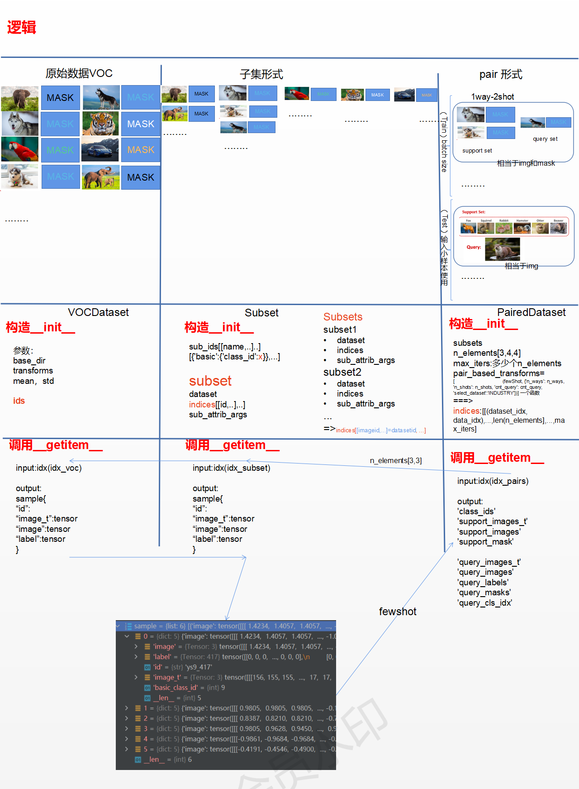

### v1

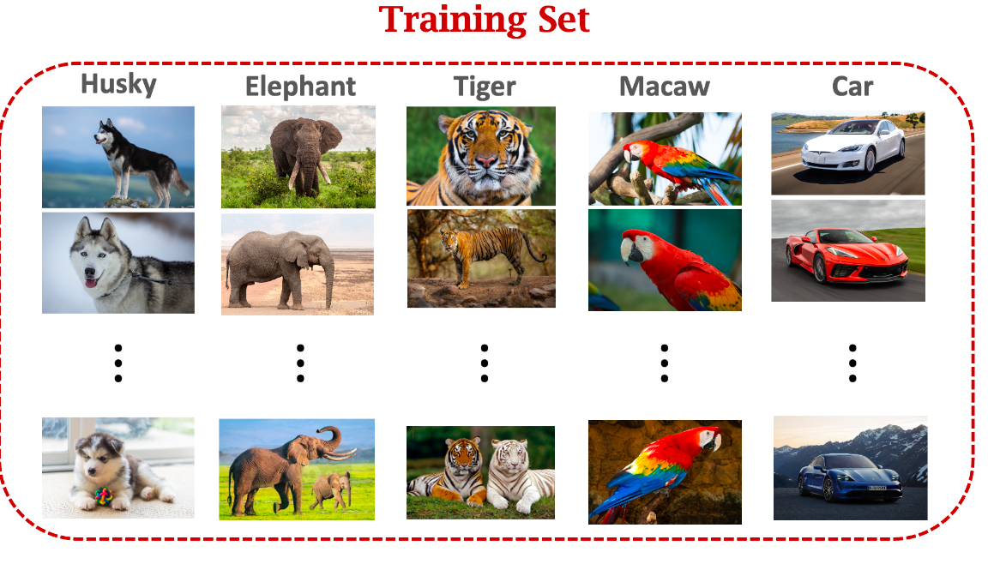

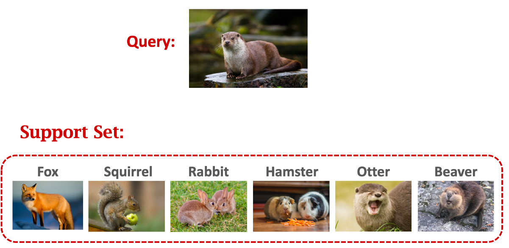

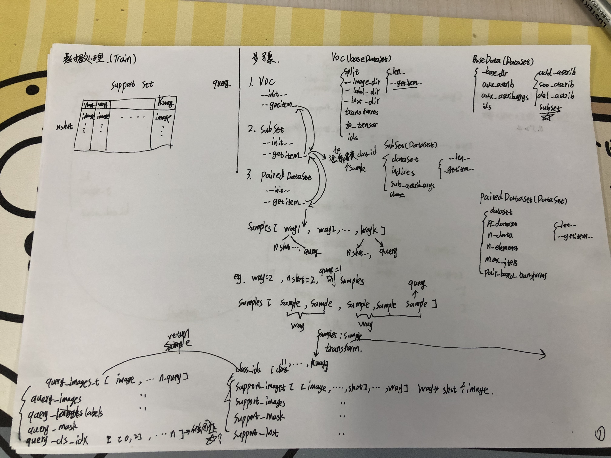

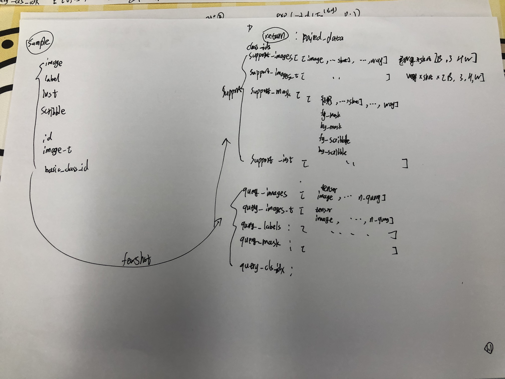

## 二、模型

[参考 1](https://www.pianshen.com/article/32251578497/)|[2](http://www.cxyzjd.com/article/Emma_Love/112543903)|[3](https://blog.waynehfut.com/2020/11/12/panet/)

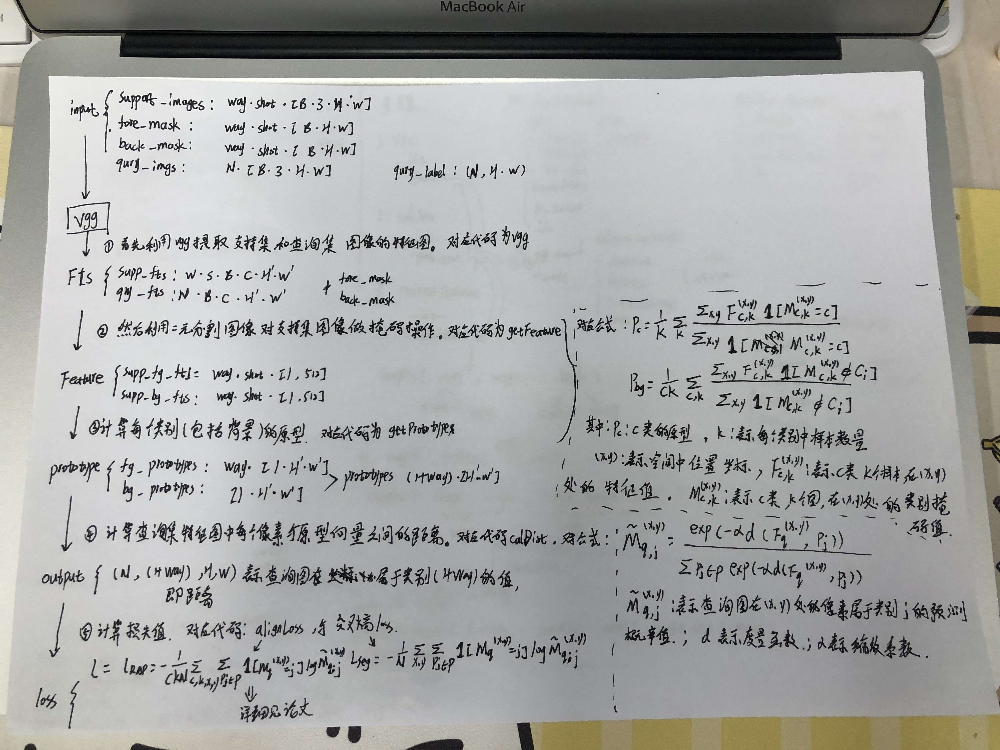

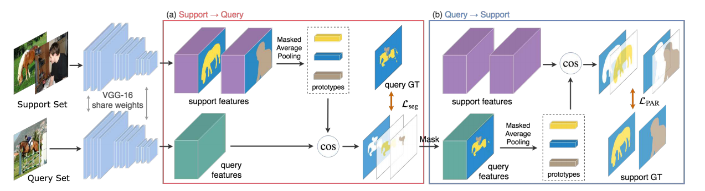

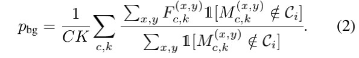

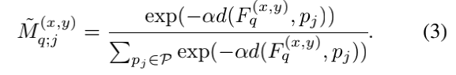

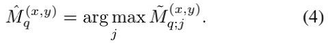

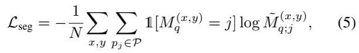

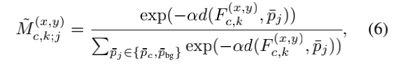

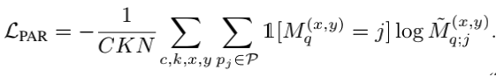