# CGAN

⌚️: 2021年8月30日

📚参考

- [GAN、CGAN、ACGAN](https://www.bilibili.com/video/BV1n54115773?from=search&seid=11723640036137669478)

----

## 一、CGAN

### 1、网络结构

#### 1.1 GAN的弊端

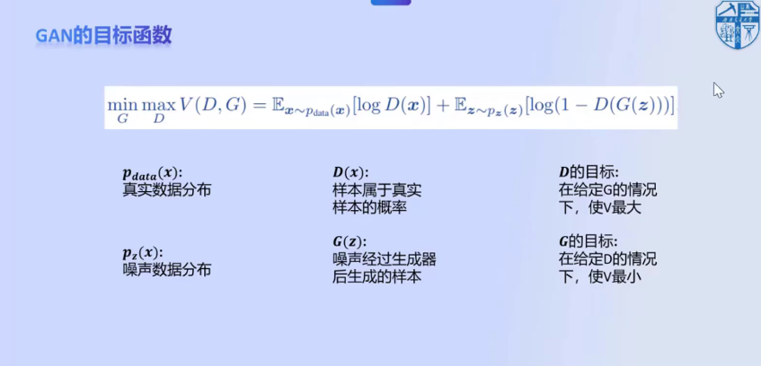

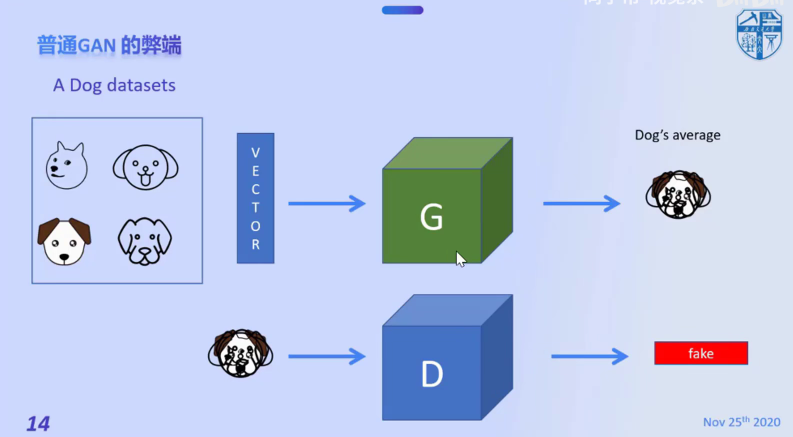

G网络无关注点，把所有特征进行融合。

#### 1.2 CGAN(Conditional Generative Adversarial Nets)

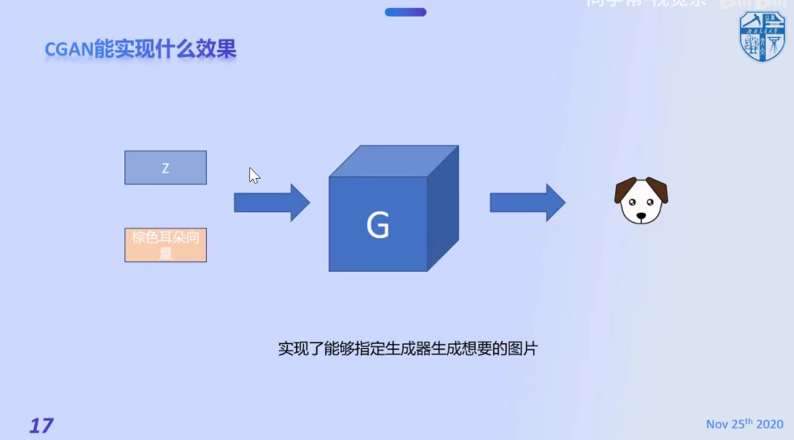

### 2、损失函数

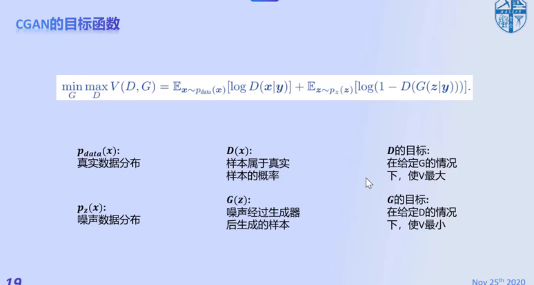

## 二、 InfoGAN

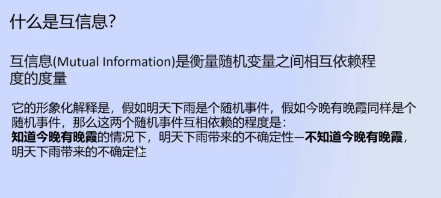

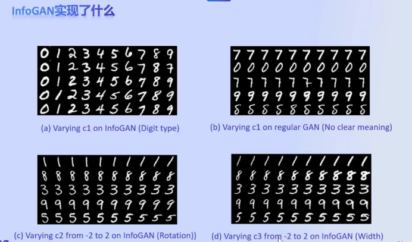

C向量，每个数值表示一个特征

InfoGAN可以从原始数据中分离出特征。

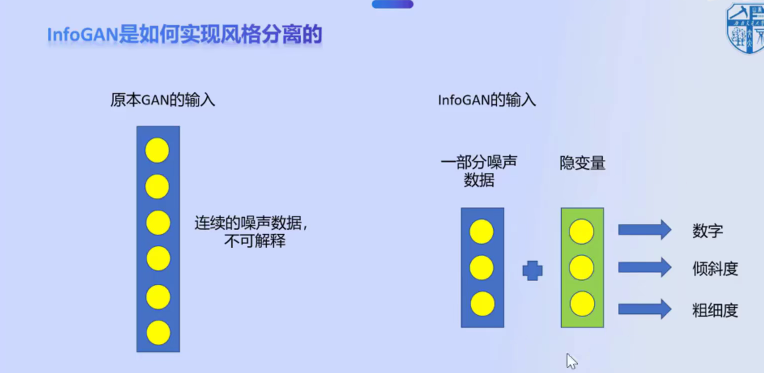

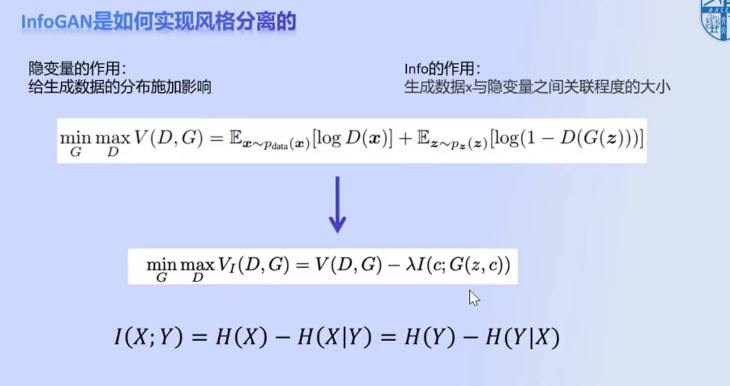

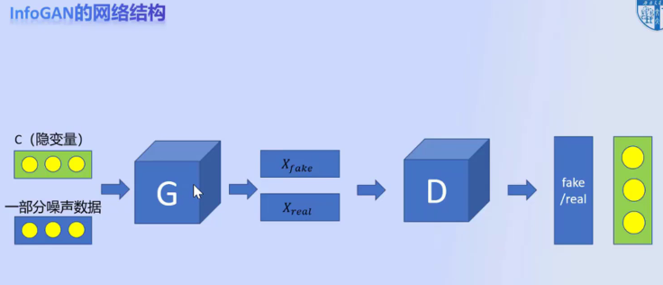

## 三、ACGAN

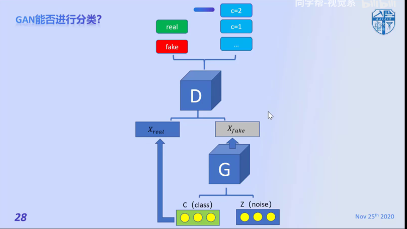

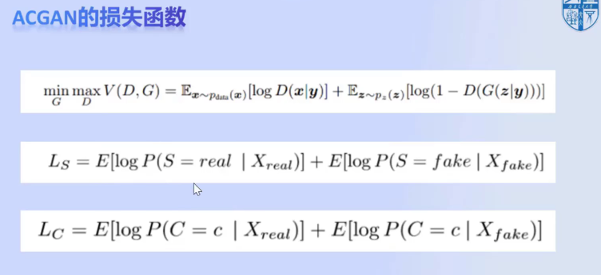