# 生成对抗网络 – Generative Adversarial Networks | GAN

⌚️: 2021年8月30日

📚参考

- [龙良曲 入门视频](https://www.bilibili.com/video/BV1RU4y1h74n?p=1)
-  [GAN原理](https://www.bilibili.com/video/BV16a4y157sC?from=search&seid=11723640036137669478) 

----

## 1、 GAN网络组成

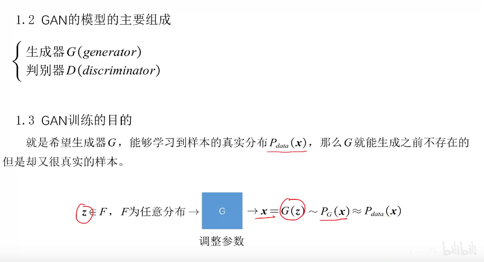

一个例子🌰

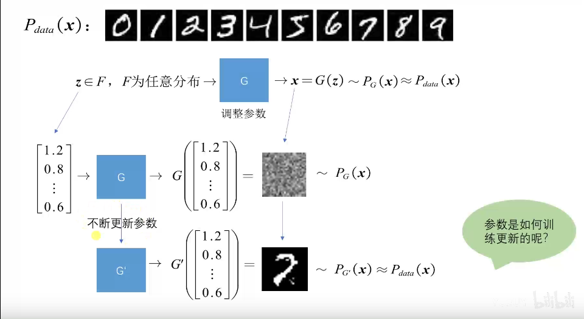

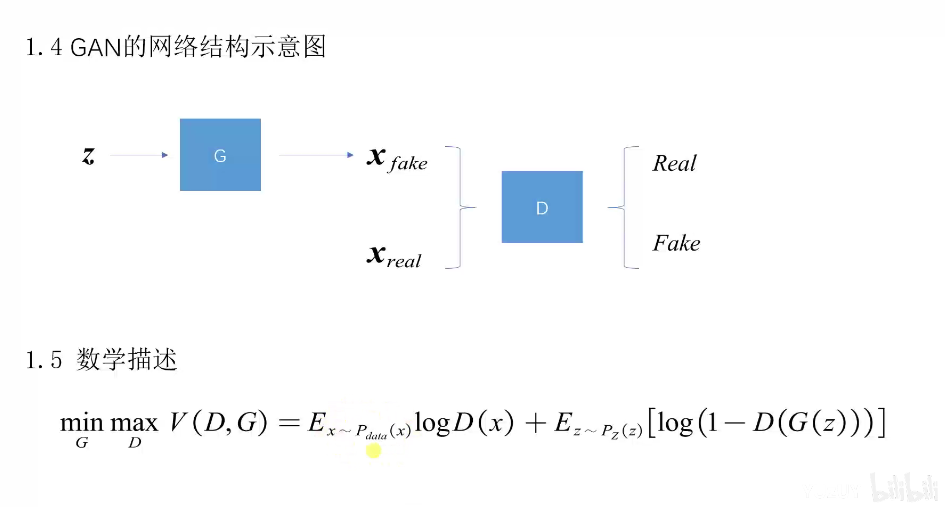

## 2. 损失函数 & 优化过程

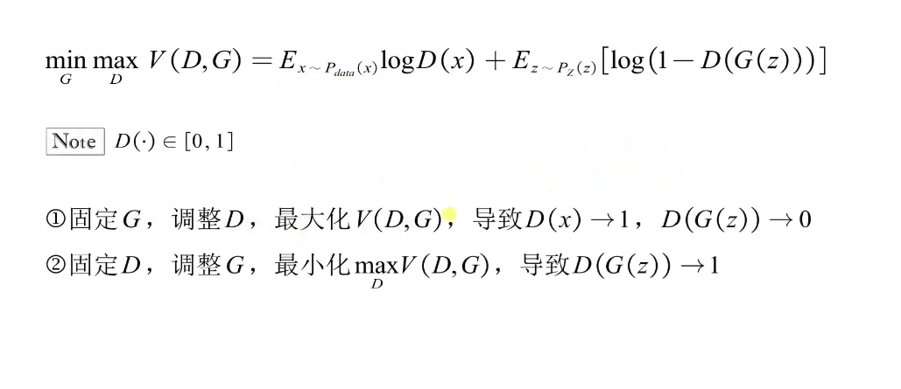

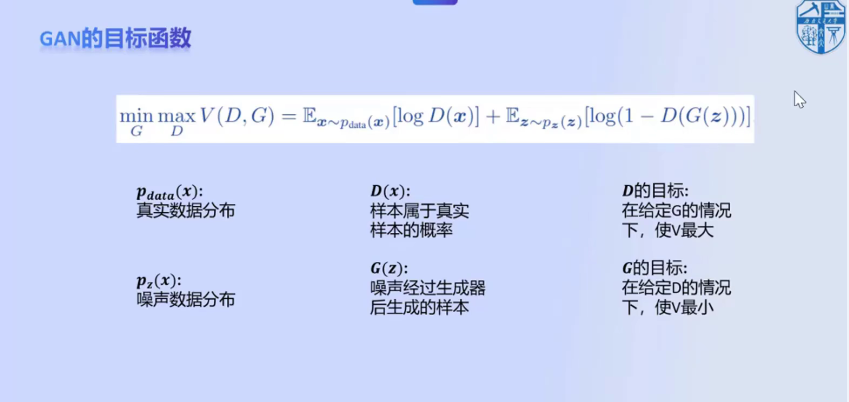

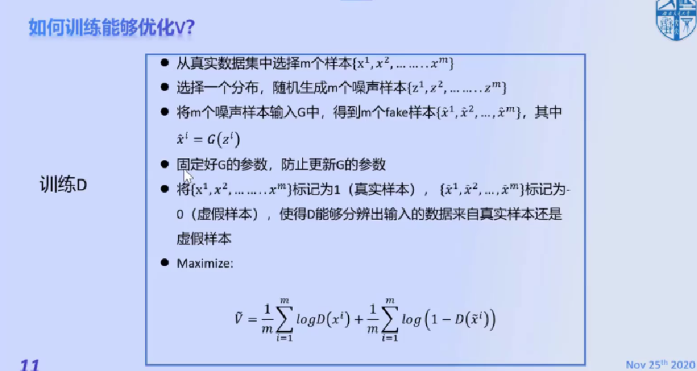

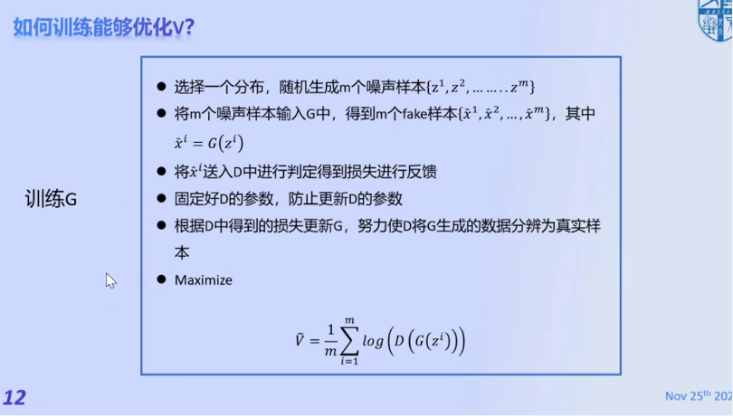

## 3. 为什么优化V(G,D)可以Pg分布与Pdata分类接近？

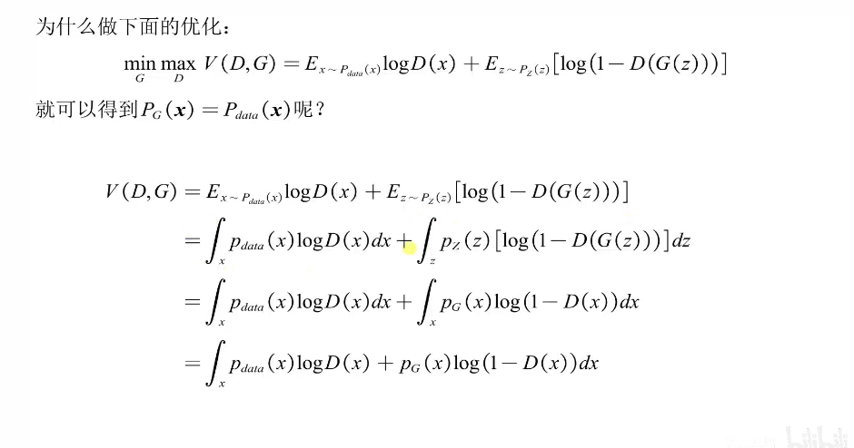

> 解释第2步到第3步：
>
> 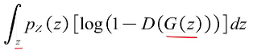（1) 与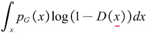（2)变换，表示看待数据的角度不同，（1)是z变量服从Pz分布，而（2)是对（1)进行了G（生成器)得到，Pg分布。
>
> 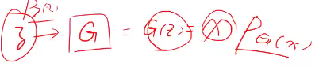

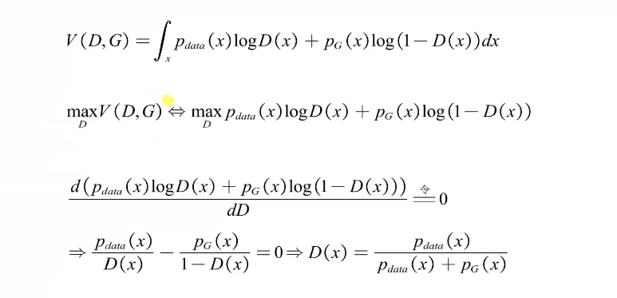

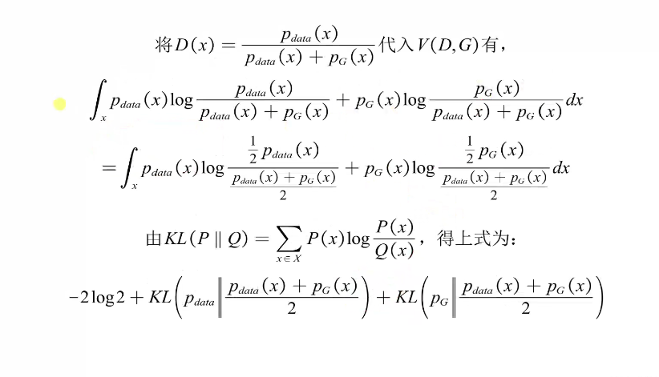

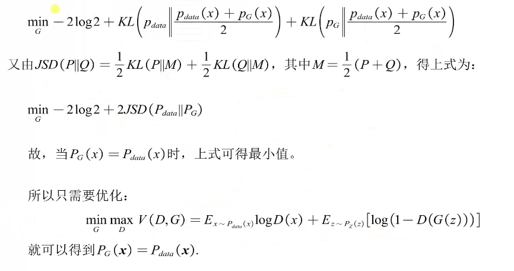