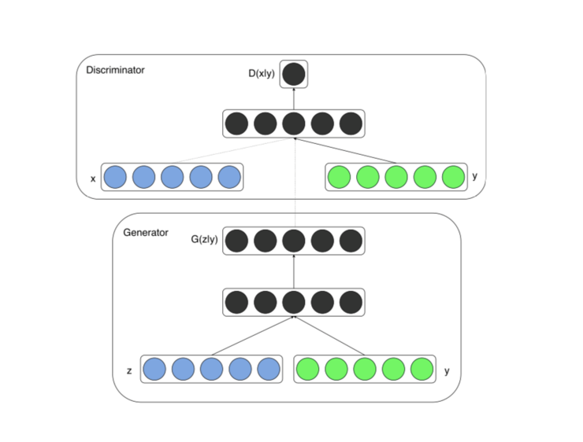
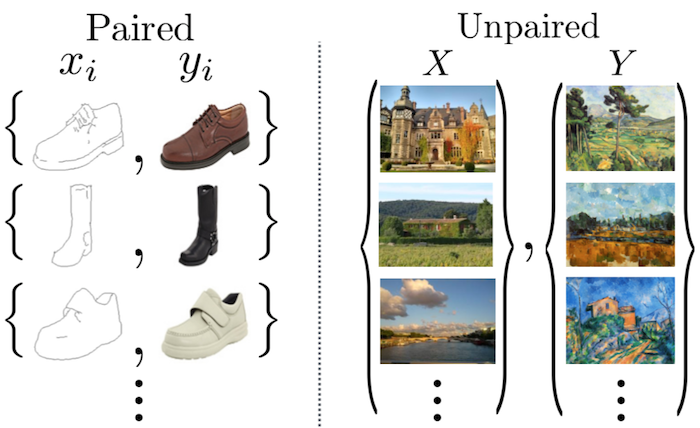

# GAN学习路线

⌚️: 2021年8月27日

📚参考

- https://www.leiphone.com/category/yanxishe/Sv3AtCsT4w2W6roc.html

---

当 Ian Goodfellow 在 2014 年喝了一杯啤酒之后，在梦中产生了「生成对抗网络」（GANs）的想法时，他可能没想到这一领域进展如此之快：

你可能不知道我要表达什么意思——其实你刚才看到的图片完全、不可否认、100%…是假的。

此外，我并不是说，这些图片都是 photoshop、CGI 或用 Nvidia 目前的高级新技术填补空白产生的。

我的意思是，这些图像完全是通过加法、乘法在花费了大量 GPU 计算之后生成的。

实现这些玩意儿的算法被称为生成性对抗网络，在过去几年中，Facebook 致力于生成对抗网络的研究和创新比在隐私保护问题上更多。

2019 年 1 月 15 日，Ian Goodfellow 在 twitter 中表示，过去 4 年半，GAN 在人脸生成方面的进展可以查看下面的资料：

- https://t.co/kiQkuYULMC
- https://t.co/S4aBsU536b
- https://t.co/8di6K6BxVC
- https://t.co/UEFhewds2M
- https://t.co/s6hKQz9gLz
- https://t.co/F9Dkcfrq8l

总结 2014 年 vanilla GAN 的每一个进步，就和观看第 8 季《权力的游戏》一样困难。因此，我将回顾几年来 GAN 研究中最酷结果背后的关键思想。

我不打算详细解释转置卷积和 Wasserstein 距离等概念。相反，我将提供一些最好的资源的链接，你可以使用这些资源快速了解这些概念，这样你就会了解它们是如何融入大局的。

如果你还在阅读，我假设你知道深度学习的基础知识，你知道卷积神经网络是如何工作的。
带着这些前提，下面先看看 GAN 的发展路线图：

**GAN 的发展路线图**

我们将按照下面的顺序，一步一步学习它：

1. GAN：生成对抗网络
2. DCGAN：深度卷积生成对抗网络
3. CGAN：条件生成对抗网络
4. CycleGAN
5. CoGAN：耦合生成对抗网络
6. ProGAN：生成对抗网络的渐进式增长
7. WGAN：Wasserstein 生成对抗网络
8. SAGAN：自注意力生成对抗网络
9. BigGAN：大生成对抗性网络
10. StyleGAN：基于风格的生成对抗网络

接下来让我们开始吧！

## 1. GAN：生成对抗网络

****

图片来自于这篇论文：https://arxiv.org/pdf/1406.2661.pdf

相关资源：

- [论文](https://arxiv.org/abs/1406.2661)
- [代码](https://github.com/goodfeli/adversarial)
- [其他重要资源：Ian Goodfellow 的 NIPS 2016 教程](https://arxiv.org/abs/1701.00160)

现在，我知道你在想什么了——天啊，那张令人毛骨悚然的、模糊的图像看起来像是一个数学迷从 Excel 表格中制作图片后放大的结果。

好吧，其实你猜的多多少少是对的（除去 excel 部分）。

早在 2014 年，Ian Goodfellow 就提出了一个革命性的想法——让两个神经网络相互竞争（或合作，这是一个观点问题）。

一个神经网络试图生成接近真实的数据（注意，GANs 可以用来模拟任何数据分布，但目前主要用于图像），另一个网络试图区分真实的数据和由生成网络生成的数据。

生成器网络使用判别器作为损耗函数，并更新其参数以生成看起来更真实的数据。

另一方面，判别器网络更新其参数，以便更好地从真实数据中识别出假数据。所以它的性能也变得更好了。

这个猫鼠游戏继续进行，直到系统达到所谓的「平衡」。达到平衡以后，生成器创建的数据看起来足够真实，因此判别器能做的只是是随机猜测。

希望到目前为止，如果你正确地缩进了代码，并且 Amazon 决定不停止你的 SPOT 实例（顺便说一句，这不会发生在 FloydHub 上，因为它们提供了专用的 GPU 机器），那么你现在就有了一个生成器，可以**精确地创建和你的训练数据集相同的新数据**。

现在，这是公认的 GANs 的一个非常简单的观点。你需要从这里学到的思想是，通过使用两个神经网络——一个神经网络生成数据，另一个神经网络从假数据中分类出真实数据。从理论上来说，你可以同时训练它们，收敛到一个点，在这个点上，生成器可以生成全新的、真实的数据。

## **2. DCGAN：深卷积生成对抗网络**

**
**

图片来源：https://arxiv.org/pdf/1511.06434.pdf

相关资源：

- [论文](https://arxiv.org/abs/1511.06434)
- [代码](https://github.com/floydhub/dcgan)
- 其他资源: [媒体文章](https://towardsdatascience.com/up-sampling-with-transposed-convolution-9ae4f2df52d0)

卷积=对于图像处理来说很有用

**GANs=适合生成一些东西**

**卷积+GANs=适合生成图像**

事后看来，正如 Ian Goodfellow 在与 Lex Fridman 在一次广播节目中所指出的那样，他们将这种模型称为 DCGAN（即「深层卷积生成对抗网络」）似乎很愚蠢，因为现在几乎所有与深度学习和图像相关的东西都是深度的、卷积的。

另外，当大多数人了解到 GANs 时，他们或多或少都会知道它们是「深度而卷积」的。

然而，曾经有一段时间，GANs 并不一定使用基于卷积的操作，而是依赖于标准的多层感知器架构。
DCGAN 改变了这一点，使用了一种被称为转置卷积运算的方法，它还有一个「不幸的」名称，即反卷积层。

转置卷积可以进行向上缩放操作。它们帮助我们将低分辨率图像转换为高分辨率图像。

但是，严肃地说，你需要通过上面介绍的论文、低吗和媒体资源来更好地理解转置卷积，因为它们是所有现代 GAN 架构的基础。

不过，如果你的时间有点短，那么你可以通过观看一个简单的动画，来大概了解转置卷积是如何工作的：

在 vanilla 卷积中，你应用一系列卷积（连同其他操作）来将图像映射到更低维的向量。

同样，按顺序应用多个转置卷积可以使我们将一个低分辨率的单阵列演化为一个色彩明艳的全彩图像。
现在，在继续之前，我们先来探索一下使用 GAN 的一些独特方法。

你现在处在第二个红色的「X」的位置

## **3.CGAN：条件生成对抗网络**

****

图片来源于论文：https://arxiv.org/pdf/1411.1784.pdf

相关资源：

- [论文](https://arxiv.org/abs/1411.1784)
- [代码](https://github.com/PacktPublishing/Advanced-Deep-Learning-with-Keras)
- 其他重要资源：[博客](https://wiseodd.github.io/techblog/2016/12/24/conditional-gan-tensorflow/)

原始的 GAN 从随机噪声中生成数据。这意味着你可以训练它，以小狗图像为例，它会产生更多的小狗图像。

你还可以在小猫图像上训练它，在这种情况下，它将生成小猫的图像。

你也可以在演员 Nicholas Cage 的照片图像上训练它，在这种情况下，它将生成 Nicholas Cage 图像。

你也可以在很多别的图像上训练它。明白了吗？在什么图像上训练 GAN，它就能生成更多的类似图像。

然而，如果你同时尝试在狗和猫的图像上训练它，它会生成模糊的半品种，就和下图一样。

图片由 Anusha Barwa 拍摄于 Unsplash

CGAN（代表「条件生成对抗网络」）旨在通过告诉生成器只生成一个特定类的图像来解决这个问题，例如猫、狗或 Nicholas Cage。

具体来说，CGAN 将一个 one-hot 向量 y 连接到随机噪声矢量 z，得到如下结构：

现在，我们就可以利用同一个 GAN 生成猫和狗。

## **4.CycleGAN**

相关资源：

- [论文](https://arxiv.org/abs/1703.10593v6)：
- [代码](https://github.com/junyanz/CycleGAN)
- 其他重要资源：[Cyclegan 项目](https://junyanz.github.io/CycleGAN/)
- [媒体文章](https://towardsdatascience.com/turning-fortnite-into-pubg-with-deep-learning-cyclegan-2f9d339dcdb0)

GANs 不仅仅用于生成图像。他们还可以创造外表上同时具有马和斑马特点的生物，如上图所示。

为了创建这些图像，CycleGAN 致力于解决**一个被称为图像到图像翻译的问题**。

CycleGAN 不是一种新的 GAN 架构，虽然它推动了最先进的图像合成技术。相反，它是一种使用 GANs 的聪明方法。所以你可以自由地在任何你喜欢的架构中使用这种技术。

这里有一篇文章，我建议你读一下。它写得非常好，甚至对初学者来说也很容易理解。文章地址：https://arxiv.org/abs/1703.10593v6。

这里的任务是训练网络 G（X），将图像从源域 X 映射到目标域 Y

但是，等等，你可能会问，「这和常规的深度学习或风格转换有什么不同」。

好吧，下面的图片很好地总结了这一点。CycleGAN 进行未配对的图像到图像的转换。这意味着我们正在训练的图像不必代表相同的东西。

如果我们有大量的图像（DaVinci-ify 的图像绘画）对收藏的话，DaVinci-ify 将（相对地）很容易识别图像。

不幸的是，这家伙没来得及完成太多的画。

然而，CycleGAN 使用未配对的数据进行训练。所以我们不需要相同事物的两个图像。

另一方面，我们可以使用样式转换。但这只会提取一个特定图像的样式，并将其转换为另一个图像，这意味着我们无法从马转换为斑马。

然而，CycleGAN 学习从一个图像域到另一个图像域的映射。所以我们可以在所有 Monet 绘画的集合上对它进行训练。

他们使用的方法相当优雅。CycleGAN 由两个生成器 G 和 F 以及两个判别器 Dx 和 Dy 组成。

G 从 X 中获取图像，并试图将其映射到 Y 中的某个图像。判别器 Dy 判断图像是由 G 生成的，还是实际上是在 Y 中生成的。

同样地，F 从 Y 中获取一个图像，并试图将其映射到 X 中的某个图像，判别器 Dx 预测图像是由 F 生成的还是实际存在于 X 中的。

所有四个网络都是以普通的 GAN 的方式训练的，直到得到强大的生成器 G 和 F，它们可以很好地执行图像到图像的翻译任务，骗过判别器。

这种对抗性的损失听起来是个好主意，但还不够。为了进一步提高性能，CycleGAN 使用另一个度量，即循环一致性损失。

一般来说，想想好的翻译人员的特点。其中之一是，当你来回翻译时，你应该得到同样的东西。

CycleGAN 巧妙地实现了这个想法，它强制网络遵守这些限制条件：

- F（G（x））≈x，x∈X
- G（F（y））≈y，y∈Y

从视觉上看，循环一致性如下：

总损耗函数的构造方式是，惩罚不符合上述特性的网络。我不打算在这里写出损失函数，因为这会破坏它在论文里面的组合方式。

好吧，在越聊越偏之前，让我们回到寻找更好的 GAN 架构的主要任务。

## **5.CoGAN：耦合生成对抗网络**

**
**

图片来源于论文：https://arxiv.org/pdf/1606.07536.pdf

相关资源：

- [论文](https://arxiv.org/abs/1606.07536)：
- [代码](https://github.com/mingyuliutw/CoGAN)：
- 其他重要资源：[博客论文](https://wiseodd.github.io/techblog/2017/02/18/coupled_gan/)

你知道什么比一个 GAN 更好吗？两个 GAN！

CoGAN 就是这样做的（CoGAN 代表「耦合生成对抗网络」，不要与 CGAN 混淆，CGAN 代表条件生成对抗网络）。它训练的是「两个」GAN 而不是一个。

当然，GAN 的研究人员也无法停止将 GAN 类比成警察和伪造者的言论。因此，GAN 背后的思想，用作者自己的话说就是：

在比赛中，有两个队，每个队有两名队员。生成模型组成一个团队，共同在两个不同的域中合成一对图像，以混淆区分模型。判别模型试图将从各自领域的训练数据分布中提取的图像与从各自生成模型中提取的图像区分开来。同一队的队员之间的协作是从权重分担机制中建立起来的。

好吧，有一个由多个 GAN 组成的局域网络听起来不错，但你如何使它工作？

结果证明这并不太复杂，你只需要让网络对某些层使用完全相同的权重。

在我看来，CoGAN 最酷的地方不在于它能提高图像生成质量，也不在于它可以在多个图像域上训练。

事实上，你只需要花费 1.5 张图片的代价来得到 2 张图片。

因为共享了一些权重，所以与两个单独的 GAN 相比，CoGAN 的参数更少（因此可以节省更多的内存、计算和存储空间）。

这是一种「过时」的微妙技巧，而且我们今天看到的一些 GAN 的新方法是不使用它们的。

但总有一天，我想我们会再次用到它们的。

## **6.ProGAN：渐进式增长的生成对抗网络**

图片来源于论文：https://arxiv.org/pdf/1710.10196.pdf

相关资源推荐：

- [论文](https://arxiv.org/abs/1710.10196)：
- [代码](https://github.com/tkarras/progressive_growing_of_gans)
- 其他优秀资源：[媒体文章](https://towardsdatascience.com/progan-how-nvidia-generated-images-of-unprecedented-quality-51c98ec2cbd2) 、[ 演示视频](https://www.youtube.com/watch?v=G06dEcZ-QTg)

在训练 GANs 的时候会有很多问题，其中最重要的是训练的不稳定性。

有时，GAN 的损耗会波动，因为生成器和判别器会相互破坏另一方的学习。其他时候，在网络聚合后损耗可能会爆炸，图像开始变得看起来可怕。

ProGAN（代表了生成对抗网络的逐步增长）**是一种通过增加生成图像的分辨率来帮助稳定 GAN 训练的技术**。

这里我们会有一种直觉，那就是生成 4x4 图像比生成 1024x1024 图像更容易。此外，将 16x16 图像映射到 32x32 图像比将 2x2 图像映射到 32x32 图像更容易。

因此，ProGAN 首先训练一个 4x4 生成器和一个 4x4 判别器，然后在训练过程中添加对应于更高分辨率的层。这个动画总结了我所描述的：

## **7.WGAN: Wasserstein 生成对抗网络**

****

图片来源于论文：https://arxiv.org/pdf/1701.07875.pdf

相关资源推荐：

- [论文](https://arxiv.org/abs/1701.07875v3)
- [代码](https://github.com/eriklindernoren/Keras-GAN)
- 其他优秀资源：[DFL 课程](http://www.depthfirstlearning.com/2019/WassersteinGAN)、 [博客文章](https://lilianweng.github.io/lil-log/2017/08/20/from-GAN-to-WGAN.htm)、 [其它博客](https://www.alexirpan.com/2017/02/22/wasserstein-gan.html)、 [媒体文章](https://medium.com/@jonathan_hui/gan-wasserstein-gan-wgan-gp-6a1a2aa1b490)

这一部分也许是这篇文章中最偏理论和数学的一部分。作者把大量的证明、推论和一些数学术语塞进其中。所以如果积分概率度量和 Lipschitz 连续性不是你关心的事情，我不会在这件事上花太多时间。

简而言之，WGAN（W 代表 Wasserstein）提出了一种新的成本函数，这种函数有一些非常好的性质，使得它在数学家和统计学家中非常流行。

这是旧版的 GANGAN minimax 优化公式：

这里是 WGAN 使用的新方法：

在大多数情况下，这就是在实践中使用 WGAN 所需要知道的全部内容。

只需剔除旧的成本函数，它近似一个称为 Jensen-Shannon 散度的统计量。然后加入新的成本函数，它近似一个称为 1-Wasserstein 距离的统计量。

原因如下：

图片来源于论文：https://arxiv.org/pdf/1701.07875.pdf

然而，如果你感兴趣，下面是对它的数学原理的快速回顾，而且这也正是 WGAN 论文如此受欢迎的原因。

原始的 GAN 论文表明，当判别器为最优时，生成器被更新，以使 Jensen-Shannon 散度最小化。

如果你不熟悉 Jensen-Shannon，我来解释一下。Jensen-Shannon 散度是一种测量两种不同的概率是如何分布的方法。JSD 越大，两个分布越「不同」，反之亦然。计算方法如下：

然而，最小化 JSD 是最好的方法吗？

WGAN 论文的作者认为这可能不是，这是出于一个特殊的原因——当两个分布完全不重叠时，你可以发现，JSD 的值保持为 2log2 的常量值。

当一个函数值为一个常量值时，它的梯度等于零，而零梯度是不好的，因为这意味着生成器什么也学不到。

WGAN 作者提出的替代距离度量的是 1-Wasserstein 距离，有时称为地球移动距离。

图片来源于论文：https://arxiv.org/pdf/1701.07875.pdf

地球移动距离这个名称是类比得来的。你可以想象，假设两个分布中的一个是一堆土，另一个是一个坑。地球移动距离是指将土堆运至坑内的成本，其前提是要尽可能高效地运输泥土、沙子、灰尘等。在这里，「成本」被认为是点之间的距离×移动的土方量。

具体来说（没有双关语），两个分布之间的地球移动距离可写为：

其中 inf 是中位数（最小值），x 和 y 是两个分布上的点，γ是最佳的运输方法。

不幸的是，它的计算非常复杂，难以解决。因此，我们计算的是完全不同的东西：

这两个方程之间的联系一开始似乎并不明显，但通过一个叫做 Kantorovich-Rubenstein 对偶的奇特数学公式，你可以证明这些 Wasserstein/地球移动器距离的公式正试图计算相同的事情。

如果你不能在我给出的论文和博客文章中学到一些重要的数学知识，不要担心太多。关于 WGAN 的大部分工作，其实都只是为公认的简单想法提供一个复杂的（严格的）理由。

## **8.SAGAN：自注意力生成对抗网络**

****

图片来源于论文：https://arxiv.org/pdf/1805.08318v1.pdf

相关资源推荐：

- [论文](https://arxiv.org/abs/1805.08318v1)
- [代码](https://github.com/heykeetae/Self-Attention-GAN)
- 其他重要资源：[博客文章](https://lilianweng.github.io/lil-log/2018/06/24/attention-attention.html)、[媒体文章](https://towardsdatascience.com/not-just-another-gan-paper-sagan-96e649f01a6b)

由于 GANs 使用转置卷积来「扫描」特征图，因此它们只能访问附近的信息。

单独使用转置卷积就像在绘制图片的时候，只查看画笔小半径范围内的画布区域。

即使是可以完美地完成最特殊、最复杂的细节的最伟大的艺术家们，也需要后退一步，观察全局。

SAGAN 使用自注意力机制，由于其转换架构，近年来它已非常流行。

自注意力让生成器后退一步，看看「大局」。

## **9.BigGAN**

****

相关资源推荐：

- [论文](https://arxiv.org/abs/1809.11096v2)：
- [代码](https://github.com/huggingface/pytorch-pretrained-BigGAN)：
- 其他重要资源：[两分钟的论文视频](https://www.youtube.com/watch?v=ZKQp28OqwNQ)、[梯度 pub 论文 ](https://thegradient.pub/bigganex-a-dive-into-the-latent-space-of-biggan/)、[媒体文章](https://medium.com/syncedreview/biggan-a-new-state-of-the-art-in-image-synthesis-cf2ec5694024)

四年之后，DeepMind 决定使用 GANs 做以前没人做过的事。他们使用了一种神秘的深度学习技术，这种技术非常强大，使得当前最先进的模型在恐惧中颤抖，因为它远远超越了当时最先进的排行榜上的所有技术。

我向你介绍了 BigGAN，它是一个完全不做任何事情的 GAN（但是它运行着一组 TPU 集群，不知为何我觉得它应该在这个列表中）。

看起来像开玩笑的是，DeepMind 团队的确利用 BigGAN 完成了很多工作。除了用真实的图像吸引了所有的目光之外，BigGAN 还向我们展示了一些非常详细的大规模训练的结果。

BigGAN 背后的团队引入了各种技术，以克服跨多台机器大批量训练 GAN 的不稳定性。

首先，DeepMind 使用 SAGAN 作为基线，并附加了一个称为谱归一化的特征。他们将 batch 的大小缩放了 50%，宽度（通道数）缩放了 20%。最初，增加层的数量似乎没有帮助。

在尝试了很多其他方法之后，作者使用「截断技巧」来提高采样图像的质量。

在训练过程中，如果潜在向量在生成图像时落在给定范围之外，则对其重新采样。给定范围是一个超参数，用ψ表示。较小的ψ缩小了范围，牺牲多样性以增加样品保真度。

那么，所有这些复杂的调优工作都会产生什么结果呢？好吧，有人称之为 dogball：

BigGAN 还表明，大规模的训练会有自己的一系列问题。值得注意的是，通过增加 batch 大小和宽度等参数，训练似乎可以很好地扩展，但出于某种原因，训练最终会崩溃。

如果你觉得分析奇异常值来理解这种不稳定性听起来很有趣，请看这篇论文，在论文中，你会发现很多不稳定性。

最后，作者还训练了一个 BigGAN 的新数据集，叫做 JFT-300，它是一个类似于 ImageNet 的数据集，大概有 3 亿张图片。BigGAN 在这个数据集上的表现更好，这表明更大规模的数据集可能是 GANs 的发展方向。

在论文的第一版发表后，过了几个月，作者重新尝试了 BigGAN。还记得我说过增加层数不起作用吗？后面发现这是由于糟糕的架构。

该团队没有将更多的层塞进模型中，而是进行了实验，发现使用深度残差网络 bottleneck 是解决问题的方法。

通过上述所有的调整、缩放和仔细的实验，BigGAN 以最高 152.8 分的表现完全超越了先前的最先进的起步分数 52.52。

如果这都不是进步，那么我不知道什么才是进步。

## **10.StyleGAN：基于风格的生成对抗性网络**

****

图片来源于论文：https://arxiv.org/abs/1812.04948

相关资源推荐：

- [论文](https://arxiv.org/abs/1812.04948)：
- [代码](https://github.com/NVlabs/stylegan)：
- 其他优质资源：[thispersondoesnotexist](https://thispersondoesnotexist.com/)、[ 博文](https://blog.nanonets.com/stylegan-got/)、[ 另外一篇博文](https://www.gwern.net/Faces)、[技术总结文](https://www.lyrn.ai/2018/12/26/a-style-based-generator-architecture-for-generative-adversarial-networks/)

StyleGAN（style generative adversarial network）是 NVIDIA 研究院的成果，它与传统的 GAN 的研究背道而驰，后者侧重于损失函数、稳定性、体系结构等。

如果你想生成汽车的图像，那么拥有一个世界级的、可以愚弄地球上大多数人的人脸图像生成器是毫无意义的。

因此，StyleGAN 没有专注于创建更真实的图像，而是改进了 GANs 对生成的图像进行精细控制的能力。

正如我提到的，StyleGAN 不专注于架构和损失函数。相反，它是一套技术，可以与任何 GAN 一起使用，允许你执行各种酷的事情，如混合图像、在多个级别上改变细节以及执行更高级的样式转换。

换言之，StyleGAN 就像一个 photoshop 插件，而大多数 GAN 的进展都像是 photoshop 的新版本。

为了实现这一级别的图像样式控制，StyleGAN 使用了现有的技术，如自适应实例规范化、潜在的矢量映射网络和持续的学习输入。

很难在不了解细节的情况下进一步描述 StyleGAN，因此如果你感兴趣，请查看我的文章，我在其中演示了如何使用 StyleGAN 生成权力游戏里面的人物。我对其中所有的技术都有详细的解释，这里面有很多很酷的结果。

## **结论**

哇，你做到了，祝贺你！你现在知道了这个领域里面的所有最新突破，包括制作虚假的个人资料图片。
但是，在你躺在沙发上开始无休止的浏览推特之前，花点时间看看你已经走了多远：

接下来是什么？！未勘探区域！

在攀登了 ProGAN 和 StyleGAN 的山脉，穿越计算的海洋到达了 BigGAN 的广阔领域之后，你很容易在这些地方迷路。

但是，请放大地图仔细看看。你看到那片绿色的土地了吗？看到北部的红色三角洲了吗？

这些是未经探索的区域，还有待取得突破。如果你坚持信仰一直努力，他们都可以是你的。

再见，我的朋友，还有更大的海洋需要去航行。

**结语：一些有趣的现代研究**

到目前为止，如果你已经阅读了我共享的所有资源，那么你应该对 GAN 技术的一些最重要的突破有了扎实的理解。

但毫无疑问，还会有更多的技术。跟上研究是困难的，但这并非不可能。我建议你尽量坚持阅读最新的论文，因为它们可能会帮助你的项目产生最好的结果。

为了帮助你开始，以下是一些前沿研究项目（截至 2019 年 5 月）：

- 你现在可能已经听说了「DeOldify」。如果没有，跳到[这里](https://blog.floydhub.com/colorizing-and-restoring-old-images-with-deep-learning/)！但它最近有一个更新，它引入了一种新的训练技术 NoGAN。你可以在他们的[博客](https://www.fast.ai/2019/05/03/decrappify/)和[代码](https://github.com/jantic/DeOldify)中查看详细信息。
- 如果你没有 Google 级的数据量，那么从头再现 BigGAN 的结果是很有挑战性的。这里有一篇 [ICML2019 论文](https://arxiv.org/pdf/1903.02271.pdf)，它提议用更少的标签来训练 BigGAN 模型。
- 当然，GANs 并不是唯一一种基于深度学习的图像生成技术。最近，OpenAI 推出了一个全新的模型，叫做稀疏 transformer，它利用 transformer 架构来生成图像。和往常一样，他们发布了[论文](https://arxiv.org/abs/1904.10509)、[博客](https://openai.com/blog/sparse-transformer/)和[代码](https://github.com/openai/sparse_attention)。
- 虽然，这不是什么新的研究，但你应该听听 GANs 的起源故事：

- Nvidia 有一个非常酷的项目，叫做 GauGAN，它可以把随手乱描的涂鸦变成现实主义的杰作。这确实是你需要经历才能理解的事情。所以先看看[演示视频](https://www.nvidia.com/en-us/research/ai-playground/?ncid=so-twi-nz-92489)，然后读他们的[博客](https://blogs.nvidia.com/blog/2019/03/18/gaugan-photorealistic-landscapes-nvidia-research/)和[论文](https://arxiv.org/abs/1903.07291)。
- 你有没有想过如何「调试」一个 GAN？现在有一篇[ ICLR 2019 论文](https://openreview.net/pdf?id=Syx_Ss05tm)提出了一个有希望的解决方案。
- 尽管我让 GAN 看起来很酷，但接下来还有很多工作要做。有一篇优秀的总结文总结了[一些尚未解决的问题](https://distill.pub/2019/gan-open-problems/)。
- 看起来，有人找到了另一种在真实世界中用 GAN 的方法。

