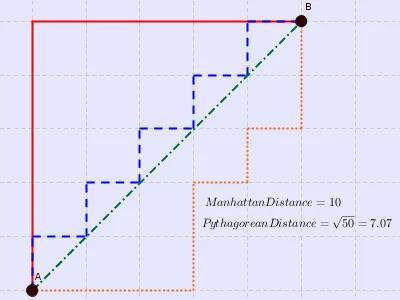

# 距离计算方法总结

⌚️: 2022年1月6日

📚参考

- https://www.plob.org/article/10653.html
- https://my.oschina.net/hunglish/blog/787596
- https://cloud.tencent.com/developer/article/1761930

----

在做分类等深度学习任务时常常需要估算不同样本之间的相似性度量(Similarity Measurement)，这时通常采用的方法就是计算样本间的“距离”(Distance)。采用什么样的方法计算距离是很讲究，甚至关系到分类的正确与否。

本文的目的就是对常用的相似性度量作一个总结。

本文目录：

- [1. 欧氏距离](##1. 欧氏距离(Euclidean Distance))
- 曼哈顿距离
- \3. 切比雪夫距离
- \4. 闵可夫斯基距离
- \5. 标准化欧氏距离
- \6. 马氏距离
- \7. 夹角余弦
- \8. 汉明距离
- \9. 杰卡德距离 & 杰卡德相似系数
- \10. 相关系数 & 相关距离
- \11. 信息熵

## 1. 欧氏距离(Euclidean Distance)

欧氏距离是最容易直观理解的距离度量方法，我们小学、初中和高中接触到的两个点在空间中的距离一般都是指欧氏距离。


- 二维平面上点a(x1,y1)与b(x2,y2)间的欧氏距离:


- 三维空间点a(x1,y1,z1)与b(x2,y2,z2)间的欧氏距离:


- n维空间点a(x11,x12,…,x1n)与b(x21,x22,…,x2n)间的欧氏距离（两个n维向量）：


## **2.** 曼哈顿距离(Manhattan Distance)



上图中红线代表曼哈顿距离，绿色代表欧氏距离，也就是直线距离，而蓝色和橙色代表等价的曼哈顿距离。通俗来讲，想象你在曼哈顿要从一个十字路口开车到另外一个十字路口实际驾驶距离就是这个“曼哈顿距离”，此即曼哈顿距离名称的来源，同时，曼哈顿距离也称为城市街区距离(City Block distance)。

- 二维平面两点a(x1,y1)与b(x2,y2)间的曼哈顿距离：


- n维空间点a(x11,x12,…,x1n)与b(x21,x22,…,x2n)的曼哈顿距离：


## 3. 切比雪夫距离 (Chebyshev Distance)

国际象棋中，国王可以直行、横行、斜行，所以国王走一步可以移动到相邻8个方格中的任意一个。国王从格子(x1,y1)走到格子(x2,y2)最少需要多少步？这个距离就叫切比雪夫距离。


- 二维平面两点a(x1,y1)与b(x2,y2)间的切比雪夫距离：


- n维空间点a(x11,x12,…,x1n)与b(x21,x22,…,x2n)的切比雪夫距离：


## 4. 闵可夫斯基距离(Minkowski Distance)

闵氏距离不是一种距离，而是一组距离的定义，是对多个距离度量公式的概括性的表述。

- 闵氏距离定义：
- 两个n维变量a(x11,x12,…,x1n)与b(x21,x22,…,x2n)间的闵可夫斯基距离定义为：


其中p是一个变参数：

当p=1时，就是曼哈顿距离；

当p=2时，就是欧氏距离；

当p→∞时，就是切比雪夫距离。

因此，根据变参数的不同，闵氏距离可以表示某一类/种的距离。

- 闵氏距离，包括曼哈顿距离、欧氏距离和切比雪夫距离都存在明显的缺点。
- e.g. 二维样本(身高[单位:cm],体重[单位:kg]),现有三个样本：a(180,50)，b(190,50)，c(180,60)。那么a与b的闵氏距离（无论是曼哈顿距离、欧氏距离或切比雪夫距离）等于a与c的闵氏距离。但实际上身高的10cm并不能和体重的10kg划等号。
- 闵氏距离的缺点：
- (1)将各个分量的量纲(scale)，也就是“单位”相同的看待了;
- (2)未考虑各个分量的分布（期望，方差等）可能是不同的。

## 5. 标准化欧氏距离 (Standardized Euclidean Distance)

 定义： 标准化欧氏距离是针对欧氏距离的缺点而作的一种改进。标准欧氏距离的思路：既然数据各维分量的分布不一样，那先将各个分量都“标准化”到均值、方差相等。假设样本集X的均值(mean)为m，标准差(standard deviation)为s，X的“标准化变量”表示为：


- 标准化欧氏距离公式：


如果将方差的倒数看成一个权重，也可称之为加权欧氏距离(Weighted Euclidean distance)。

## 6. 马氏距离(Mahalanobis Distance)

 马氏距离的引出：


上图有两个正态分布的总体，它们的均值分别为a和b，但方差不一样，则图中的A点离哪个总体更近？或者说A有更大的概率属于谁？显然，A离左边的更近，A属于左边总体的概率更大，尽管A与a的欧式距离远一些。这就是马氏距离的直观解释。


- 概念：马氏距离是基于样本分布的一种距离。物理意义就是在规范化的主成分空间中的欧氏距离。所谓规范化的主成分空间就是利用主成分分析对一些数据进行主成分分解。再对所有主成分分解轴做归一化，形成新的坐标轴。由这些坐标轴张成的空间就是规范化的主成分空间。


- 定义：有M个样本向量X1~Xm，协方差矩阵记为S，均值记为向量μ，则其中样本向量X到μ的马氏距离表示为：


向量Xi与Xj之间的马氏距离定义为：


若协方差矩阵是单位矩阵（各个样本向量之间独立同分布），则Xi与Xj之间的马氏距离等于他们的欧氏距离：


若协方差矩阵是对角矩阵，则就是标准化欧氏距离。

- 欧式距离&马氏距离：


- 马氏距离的特点：
- 量纲无关，排除变量之间的相关性的干扰；
- 马氏距离的计算是建立在总体样本的基础上的，如果拿同样的两个样本，放入两个不同的总体中，最后计算得出的两个样本间的马氏距离通常是不相同的，除非这两个总体的协方差矩阵碰巧相同；
- 计算马氏距离过程中，要求总体样本数大于样本的维数，否则得到的总体样本协方差矩阵逆矩阵不存在，这种情况下，用欧式距离计算即可。


## 7. 余弦距离(Cosine Distance)

几何中，夹角余弦可用来衡量两个向量方向的差异；机器学习中，借用这一概念来衡量样本向量之间的差异。

- 二维空间中向量A(x1,y1)与向量B(x2,y2)的夹角余弦公式：


- 两个n维样本点a(x11,x12,…,x1n)和b(x21,x22,…,x2n)的夹角余弦为：


即：


夹角余弦取值范围为[-1,1]。余弦越大表示两个向量的夹角越小，余弦越小表示两向量的夹角越大。当两个向量的方向重合时余弦取最大值1，当两个向量的方向完全相反余弦取最小值-1。

## 8. 汉明距离(Hamming Distance)


- 定义：两个等长字符串s1与s2的汉明距离为：将其中一个变为另外一个所需要作的最小字符替换次数。例如:

  ```
    The Hamming distance between "1011101" and "1001001" is 2. 
    The Hamming distance between "2143896" and "2233796" is 3. 
    The Hamming distance between "toned" and "roses" is 3.
  ```

- 汉明重量：是字符串相对于同样长度的零字符串的汉明距离，也就是说，它是字符串中非零的元素个数：对于二进制字符串来说，就是 1 的个数，所以 11101 的汉明重量是 4。因此，如果向量空间中的元素a和b之间的汉明距离等于它们汉明重量的差a-b。

- 应用：汉明重量分析在包括信息论、编码理论、密码学等领域都有应用。比如在信息编码过程中，为了增强容错性，应使得编码间的最小汉明距离尽可能大。但是，如果要比较两个不同长度的字符串，不仅要进行替换，而且要进行插入与删除的运算，在这种场合下，通常使用更加复杂的编辑距离等算法。

## 9. 杰卡德距离(Jaccard Distance)

杰卡德相似系数(Jaccard similarity coefficient)：两个集合A和B的交集元素在A，B的并集中所占的比例，称为两个集合的杰卡德相似系数，用符号J(A,B)表示：


- 杰卡德距离(Jaccard Distance)：与杰卡德相似系数相反，用两个集合中不同元素占所有元素的比例来衡量两个集合的区分度：


## 10. 相关距离(Correlation distance)


- 相关系数：是衡量随机变量X与Y相关程度的一种方法，相关系数的取值范围是[-1,1]。相关系数的绝对值越大，则表明X与Y相关度越高。当X与Y线性相关时，相关系数取值为1（正线性相关）或-1（负线性相关）：


- 相关距离：


