# Pytorch中的损失函数

⌚️: 2020年8月2日

📚参考

- [Pytorch-损失函数](https://www.jianshu.com/p/7dbb9667e9e5)

---

在深度学习中要用到各种各样的损失函数（loss function），这些损失函数可看作是一种特殊的 layer ，PyTorch也将这些损失函数实现为 nn.Module 的子类。然而在实际使用中通常将这些 loss function 专门提取出来，和主模型互相独立。

我们所说的优化，即优化网络权值使得损失函数值变小。但是，损失函数值变小是否能代表模型的分类/回归精度变高呢？那么多种损失函数，应该如何选择呢？要解答这些就首先要了解Pytorch中的损失函数都有哪些和他们的机制，来看一下吧。

> 1.L1loss
>
> 2.MSELoss
>
> 3.CrossEntropyLoss
>
> 4.NLLLoss
>
> 5.PoissonNLLLoss
>
> 6.KLDivLoss
>
> 7.BCELoss
>
> 8.BCEWithLogitsLoss
>
> 9.MarginRankingLoss
>
> 10.HingeEmbeddingLoss
>
> 11.MultiLabelMarginLoss
>
> 12.SmoothL1Loss
>
> 13.SoftMarginLoss
>
> 14.MultiLabelSoftMarginLoss
>
> 15.CosineEmbeddingLoss
>
> 16.MultiMarginLoss
>
> 17.TripletMarginLoss
>
> 18.CTCLoss

**值得注意的是**，很多的 loss 函数都有 size_average 和 reduce 两个布尔类型的参数，需要解释一下。因为一般损失函数都是直接计算 batch 的数据，**因此返回的 loss 结果都是维度为 (batch_size, ) 的张量**。

- 如果 reduce = False，那么 size_average 参数失效，直接返回张量形式的 loss；（与下文中的`size_average=None, reduce=None, reduction='none'`一致）
- 如果 reduce = True，那么 loss 返回的是标量;
  1)如果 size_average = True，返回 loss.mean(); （与下文中的`size_average=None, reduce=None, reduction='mean'`一致）
  2)如果 size_average = False，返回 loss.sum();（与下文中的`size_average=None, reduce=None, reduction='sum'`一致）

## 1、L1范数损失 L1Loss


```java
class torch.nn.L1Loss(size_average=None, reduce=None, reduction='mean')
```

- `reduction`有三个取值，分别为`'none'`、`'mean'`、`'sum'`；
  `reduction`取`'none'`，则返回 与预测值或者真实值形状一致的 张量；
  `reduction`不取`'mean'`或者`'sum'`，则返回 一个标量值。
- `size_average`和`reduce`都取`None`，不作更改，这是推荐的方式；
  `size_average`和`reduce`两者中有一个不为`None`，则会重写`reduction`。
- **总之，推荐的方式是：1）`size_average`和`reduce`都取`None`；2）同时，更改`reduction`的值以达到不同的目标**

### 1.1 功能

计算预测值 `x` and 真实值 `y`之间的**平均绝对值误差(MAE)**(mean absolute error).

### 1.2 公式

1）当`reduction = 'none'`:

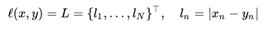

其中，为批量大小batch size。


2）当`reduction = 'mean'`或者`reduction = 'sum'`：

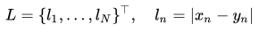

%20%3D%20%5Cbegin%7Bcases%7D%20%5Coperatorname%7Bmean%7D(L)%2C%20%26%20%5Ctext%7Bif%20reduction%7D%20%3D%20%5Ctext%7B%27mean%27%3B%7D%5C%5C%20%5Coperatorname%7Bsum%7D(L)%2C%20%26%20%5Ctext%7Bif%20reduction%7D%20%3D%20%5Ctext%7B%27sum%27.%7D%20%5Cend%7Bcases%7D)

3）默认情况（即`reduction='mean'`）:

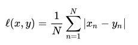


### 1.3 代码


```python
input_ = torch.empty(2, 3, dtype=torch.float).random_(0, 4)
target = torch.empty(2, 3, dtype=torch.float).random_(0, 4)
print(input_); print(target);
print(input_.size(), target.size())

print('=== mean ===')
loss_fn = torch.nn.L1Loss(reduce=None, size_average=None, reduction='mean')
loss = loss_fn(input_, target)
print(loss)
print(loss.size())

print('=== sum ===')
loss_fn = torch.nn.L1Loss(reduce=None, size_average=None, reduction='sum')
loss = loss_fn(input_, target)
print(loss)
print(loss.size())

print('=== none ===')
loss_fn = torch.nn.L1Loss(reduce=None, size_average=None, reduction='none')
loss = loss_fn(input_, target)
print(loss)
print(loss.size())
```

输出结果如下：

```csharp
tensor([[3., 0., 3.],
        [3., 0., 3.]])
tensor([[2., 0., 3.],
        [2., 0., 0.]])
torch.Size([2, 3]) torch.Size([2, 3])
=== mean ===
tensor(0.8333)
torch.Size([])
=== sum ===
tensor(5.)
torch.Size([])
=== none ===
tensor([[1., 0., 0.],
        [1., 0., 3.]])
torch.Size([2, 3])
```

- mean和sum方式下，loss值为一个标量；
- none方式下，loss值为张量，形状与input_或者target一致；
- 以mean为例计算，(|3-2| + |0-0| + |3-3| + |3-2| + |0-0| + |3-0|) / 6 = 5 / 6 = 0.8333


总结：L1loss要求input和target形状一致。

## 2、均方误差损失 MSELoss

```java
class torch.nn.MSELoss(size_average=None, reduce=None, reduction='mean')
```

- `reduction`有三个取值，分别为`'none'`、`'mean'`、`'sum'`；
  `reduction`取`'none'`，则返回 与预测值或者真实值形状一致的 张量；
  `reduction`不取`'mean'`或者`'sum'`，则返回 一个标量值。
- `size_average`和`reduce`都取`None`，不作更改，这是推荐的方式；
  `size_average`和`reduce`两者中有一个不为`None`，则会重写`reduction`。
- **总之，推荐的方式是：1）`size_average`和`reduce`都取`None`；2）同时，更改`reduction`的值以达到不同的目标**

### 2.1 功能

计算预测值 `x` and 真实值 `y`之间的**均方误差(MSE)**(mean squared error (squared L2 norm)).

### 2.2 公式

1）当`reduction = 'none'`:

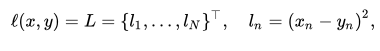

其中，为批量大小batch size。


2）当`reduction = 'mean'`或者`reduction = 'sum'`：

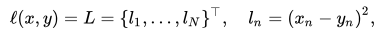

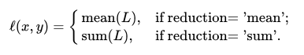


3）默认情况（即`reduction='mean'`）:

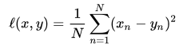


### 2.3 代码


```python
input_ = torch.empty(2, 3, dtype=torch.float).random_(0, 4)
target = torch.empty(2, 3, dtype=torch.float).random_(0, 4)
print(input_); print(target);
print(input_.size(), target.size())

print('=== mean ===')
loss_fn = torch.nn.MSELoss(reduce=None, size_average=None, reduction='mean')
loss = loss_fn(input_, target)
print(loss)
print(loss.size())

print('=== sum ===')
loss_fn = torch.nn.MSELoss(reduce=None, size_average=None, reduction='sum')
loss = loss_fn(input_, target)
print(loss)
print(loss.size())

print('=== none ===')
loss_fn = torch.nn.MSELoss(reduce=None, size_average=None, reduction='none')
loss = loss_fn(input_, target)
print(loss)
print(loss.size())
```

输出结果如下：


```csharp
tensor([[2., 0., 3.],
        [3., 0., 1.]])
tensor([[2., 0., 0.],
        [0., 3., 0.]])
torch.Size([2, 3]) torch.Size([2, 3])
=== mean ===
tensor(4.6667)
torch.Size([])
=== sum ===
tensor(28.)
torch.Size([])
=== none ===
tensor([[0., 0., 9.],
        [9., 9., 1.]])
torch.Size([2, 3])
```

- mean和sum方式下，loss值为一个标量；
- none方式下，loss值为张量，形状与input_或者target一致；


总结：input与target形状一致

## 3、交叉熵损失 CrossEntropyLoss


```python
class torch.nn.CrossEntropyLoss(weight=None, size_average=None, ignore_index=-100, reduce=None, reduction='mean')
```

### 3.1 功能

该方法将`nn.LogSoftmax()`和`nn.NLLLoss()`进行了结合。严格意义上的交叉熵损失函数应该是nn.NLLLoss()。**在类别分布不平衡的数据集中尤其有用**。

其中，`nn.LogSoftmax()`公式如下：

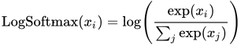

`nn.NLLLoss()`公式:

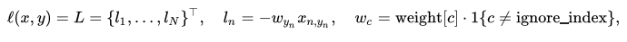

详细见下文👇。


### 3.2 公式

1）当不指明权重时：

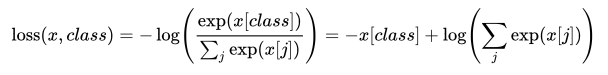


2）当指明权重时：

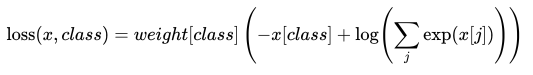


### 3.3 代码

```python
import torch
import torch.nn as nn
import numpy as np
import math

print('\n\n--------------------------------------------------- CrossEntropy loss: base')
loss_f = nn.CrossEntropyLoss(weight=None, size_average=True, reduce=False)

# 生成网络输出 以及 目标输出
output = torch.ones(2, 3, requires_grad=True) * 0.5		# 假设一个三分类任务，batchsize=2，假设每个神经元输出都为0.5
target = torch.from_numpy(np.array([0, 1])).type(torch.LongTensor)

print("---output---")
print(output)
print("---target---")
print(target)

loss = loss_f(output, target)
print('loss: ', loss)
print('由于reduce=False，所以可以看到每一个样本的loss，输出为[1.0986, 1.0986]')


print('\n\n---------------------------------------------------  手动计算')
# 熟悉计算公式，手动计算第一个样本
output = output[0].detach().numpy() # [0.5 0.5 0.5]
output_1 = output[0]              # 0.5 		第一个样本的输出值
target_1 = target[0].numpy()			# 0

# 第一项
x_class = output[target_1]
# 第二项
exp = math.e
sigma_exp_x = pow(exp, output[0]) + pow(exp, output[1]) + pow(exp, output[2])
log_sigma_exp_x = math.log(sigma_exp_x)
# 两项相加
loss_1 = -x_class + log_sigma_exp_x

print('第一个样本的loss：', loss_1)


print('\n\n--------------------------------------------------- CrossEntropy loss: weight')
weight = torch.from_numpy(np.array([0.6, 0.2, 0.2])).float()
loss_f = nn.CrossEntropyLoss(weight=weight, size_average=True, reduce=False)
output = torch.ones(2, 3, requires_grad=True) * 0.5  # 假设一个三分类任务，batchsize为2个，假设每个神经元输出都为0.5
target = torch.from_numpy(np.array([0, 1])).type(torch.LongTensor)
loss = loss_f(output, target)

print('loss: ', loss)  #
print('原始loss值为1.0986, 第一个样本是第0类，weight=0.6,所以输出为1.0986*0.6 =', 1.0986*0.6)


print('\n\n--------------------------------------------------- CrossEntropy loss: ignore_index')
loss_f_1 = nn.CrossEntropyLoss(weight=None, size_average=False, reduce=False, ignore_index=1)
loss_f_2 = nn.CrossEntropyLoss(weight=None, size_average=False, reduce=False, ignore_index=2)
output = torch.ones(3, 3, requires_grad=True) * 0.5  # 假设一个三分类任务，batchsize为2个，假设每个神经元输出都为0.5
target = torch.from_numpy(np.array([0, 1, 2])).type(torch.LongTensor)

loss_1 = loss_f_1(output, target)
loss_2 = loss_f_2(output, target)


print('ignore_index = 1: ', loss_1)     # 类别为1的样本的loss为0
print('ignore_index = 2: ', loss_2)     # 类别为2的样本的loss为0
```

输出结果：

```xml
--------------------------------------------------- CrossEntropy loss: base---output---tensor([[0.5000, 0.5000, 0.5000],        [0.5000, 0.5000, 0.5000]], grad_fn=<MulBackward0>)---target---tensor([0, 1])loss:  tensor([1.0986, 1.0986], grad_fn=<NllLossBackward>)由于reduce=False，所以可以看到每一个样本的loss，输出为[1.0986, 1.0986]---------------------------------------------------  手动计算第一个样本的loss： 1.0986122886681098--------------------------------------------------- CrossEntropy loss: weightloss:  tensor([0.6592, 0.2197], grad_fn=<NllLossBackward>)原始loss值为1.0986, 第一个样本是第0类，weight=0.6,所以输出为1.0986*0.6 = 0.65916--------------------------------------------------- CrossEntropy loss: ignore_indexignore_index = 1:  tensor([1.0986, 0.0000, 1.0986], grad_fn=<NllLossBackward>)ignore_index = 2:  tensor([1.0986, 1.0986, 0.0000], grad_fn=<NllLossBackward>)
```

### 3.4 其他

交叉熵损失(cross-entropy Loss) 又称为对数似然损失(Log-likelihood Loss)、对数损失；二分类时还可称之为逻辑斯谛回归损失(Logistic Loss)。pytroch这里不是严格意义上的交叉熵损失函数，而是先将input经过softmax激活函数，将向量“归一化”成概率形式，然后再与target计算严格意义上交叉熵损失。 **在多分类任务中，经常采用softmax激活函数+交叉熵损失函数，因为交叉熵描述了两个概率分布的差异，然而神经网络输出的是向量，并不是概率分布的形式。所以需要softmax激活函数将一个向量进行“归一化”成概率分布的形式，再采用交叉熵损失函数计算loss。** 再回顾PyTorch的CrossEntropyLoss()，官方文档中提到时将nn.LogSoftmax()和 nn.NLLLoss()进行了结合，nn.LogSoftmax() 相当于激活函数 ， nn.NLLLoss()是损失函数，将其结合，完整的是否可以叫做softmax+交叉熵损失函数呢？

总结：input （N，C），target（N），output（N），

## 4、负对数似然损失 NLLLoss

NLLLoss的全称是Negative Log Likelihood Loss,中文名称是最大似然或者log似然代价函数。 CrossEntropyLoss是交叉熵代价函数。

```python
class torch.nn.NLLLoss(weight=None, size_average=None, ignore_index=-100, reduce=None, reduction='mean')
```

- `size_average`、`reduce`、`reduction`这个三个参数不再赘述，与L1Loss、MSELoss一致；
- `weight`: 如果提供，则应该是 由每个类别的权重组成的一维张量，例如有三个类别，则weight可为weight=[0.6, 0.3, 0.1]，其中weight的长度与类别数相等；如果没有提供，所有权重置为1；
- `ignore_index`：忽略某一类别，不计算其loss，其loss会为0，并且，在采用size_average时，不会计算那一类的loss，除的时候的分母也不会统计那一类的样本；
- NLLLoss的输入是**每一类别的log-probabilities，该log-probabilities可以通过`LogSoftmax`网络层获得**，如果不想让网络的最后一层是 log_softmax 层的话，就可以采用 CrossEntropyLoss 完全代替此函数，**因为CrossEntropyLoss 中就有这些步骤**。

### 4.1 功能

在**类别分布不平衡的数据集**中尤其有用。

### 4.2 公式

1）当`reduction = 'none'`:


其中，为批量大小batch size；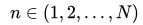表示一个批量中的第$n$个样本；$l_n$表示第$n$个样本的损失值；$y_n$表示第$n$个样本的真实标签（例如是类别2，则$y_n=2$；$w_{y_n}$表示类别$y_n$的权重。    

2）当`reduction = 'mean'`或者`reduction = 'sum'`：


### 4.3 shape

- Input: `(N, C)` where `C = number of classes` or `(N, C, d_1, d_2, ..., d_K)` with $K \geq 1$in the case of `K`- dimensional loss.

- Target: `(N)` where each value is $0 \leq \text{targets}[i] \leq C-1$  or  `(N, d_1, d_2, ..., d_K)` with $K \geq 1$in the case of `K`- dimensional loss.

- Output: scalar.

  If `reduction` is `'none'`, then the same size as the target: `(N)` or `(N, d_1, d_2, ..., d_K)` with$ K \geq 1$in the case of `K`- dimensional loss.

- **会发现Target 与 Output的形状一致，但Input要比前两者多一个类别通道`(C)`**

#### 4.4 理解$f(x, class) = -x[class]$

以三分类任务为例，类别标号为0、1、2。NLLLoss 的输入input=[-1.233, 2.657, 0.534]， 真实标签为2（class=2），则$loss = f(x, class) = -x[class] = -input[2]$= -0.534（有点列表切片的意思）。

### 4.5 举例

1） 当`reduction = 'none'`，

- 理论计算

使用如下公式：

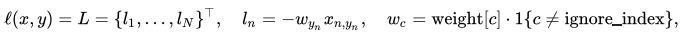


以三分类任务为例，类别标号为0、1、2。NLLLoss 的输入input为[[0.6, 0.2, 0.2], [0.4, 1.2, 0.4]]（即两个样本分别在三个类别的预测概率值），真实标签target= [0, 1]，**不指定权重（则权重全为1）**。

这个批量有两个样本（），所以$L = \{l_1, l_2\}^\top$；

真实标签列表为target= [0, 1]，即第一个样本的真实标签为类别0，第二个样本的真实标签为类别1，所以$y_1 = 0$、；

权重没有指定（则weight = [1, 1, 1]），所以![w_{y_1} = w_0 = \text {weight}[0] = 1](https://math.jianshu.com/math?formula=w_%7By_1%7D%20%3D%20w_0%20%3D%20%5Ctext%20%7Bweight%7D%5B0%5D%20%3D%201)，同理，![w_{y_2} = w_1 = \text {weight}[1] = 1](https://math.jianshu.com/math?formula=w_%7By_2%7D%20%3D%20w_1%20%3D%20%5Ctext%20%7Bweight%7D%5B1%5D%20%3D%201)；

 表示第一个样本中对应的值，即![x_{1, y_1}= [0.6, 0.2, 0.2][y_1]=[0.6, 0.2, 0.2][0]=0.6](https://math.jianshu.com/math?formula=x_%7B1%2C%20y_1%7D%3D%20%5B0.6%2C%200.2%2C%200.2%5D%5By_1%5D%3D%5B0.6%2C%200.2%2C%200.2%5D%5B0%5D%3D0.6)，同理，;

所以 ，同理，

因此，%20%3D%20L%20%3D%20%5C%7B-0.6%2C%20-1.2%5C%7D%20%5E%5Ctop)。

- 代码实现：


```python
import torch
import torch.nn as nn
import numpy as np

# ----------------------------------- log likelihood loss
# 生成网络输出 以及 目标输出
output = torch.from_numpy(np.array([[0.6, 0.2, 0.2], [0.4, 1.2, 0.4]])).float()  
output.requires_grad = True
target = torch.from_numpy(np.array([0, 1])).type(torch.LongTensor)

loss_f = nn.NLLLoss(weight=None, size_average=None, reduce=None, reduction='none')
loss = loss_f(output, target)

print('\nloss: \n', loss)
print('\n第一个样本是0类，loss = -(1*0.6)={}'.format(loss[0]))
print('\n第二个样本是1类，loss = -(1*1.2)={}'.format(loss[1]))
```

输出结果：


```jsx
loss: 
 tensor([-0.6000, -1.2000], grad_fn=<NllLossBackward>)
第一个样本是0类，loss = -(1*0.6)=-0.6000000238418579
第二个样本是1类，loss = -(1*1.2)=-1.2000000476837158
```

2）当`reduction = 'mean'`，且带上权重

- 理论计算

![l_n = - w_{y_n} x_{n,y_n}, \quad w_{c} = \text{weight}[c] \cdot \mathbb{1}\{c \not= \text{ignore_index}\},](https://math.jianshu.com/math?formula=l_n%20%3D%20-%20w_%7By_n%7D%20x_%7Bn%2Cy_n%7D%2C%20%5Cquad%20w_%7Bc%7D%20%3D%20%5Ctext%7Bweight%7D%5Bc%5D%20%5Ccdot%20%5Cmathbb%7B1%7D%5C%7Bc%20%5Cnot%3D%20%5Ctext%7Bignore_index%7D%5C%7D%2C)

%20%3D%20%5Cbegin%7Bcases%7D%20%5Csum_%7Bn%3D1%7D%5EN%20%5Cfrac%7B1%7D%7B%5Csum_%7Bn%3D1%7D%5EN%20w_%7By_n%7D%7D%20l_n%2C%20%26%20%5Ctext%7Bif%20reduction%7D%20%3D%20%5Ctext%7B%27mean%27%3B%7D%5C%5C%20%5Csum_%7Bn%3D1%7D%5EN%20l_n%2C%20%26%20%5Ctext%7Bif%20reduction%7D%20%3D%20%5Ctext%7B%27sum%27.%7D%20%5Cend%7Bcases%7D)

以三分类任务为例，类别标号为0、1、2。NLLLoss 的输入input为[[0.6, 0.2, 0.2], [0.4, 1.2, 0.4]]（即两个样本分别在三个类别的预测概率值），真实标签target= [0, 1]，**指定权值weight = [0.6, 0.2, 0.2]**。

则有，

；

因为`reduction = 'mean'`，所以%3D%5Cfrac%7B1%7D%7B0.6%20%2B%200.2%7D%20*%20(-0.36)%20%2B%20%5Cfrac%7B1%7D%7B0.6%20%2B%200.2%7D%20*%20(-0.24)%20%3D%20-0.75)。

- 代码实现

```python
import torch
import torch.nn as nn
import numpy as np

# ----------------------------------- log likelihood loss
# 各类别权重
weight = torch.from_numpy(np.array([0.6, 0.2, 0.2])).float()

# 生成网络输出 以及 目标输出
output = torch.from_numpy(np.array([[0.6, 0.2, 0.2], [0.4, 1.2, 0.4]])).float()  
output.requires_grad = True
target = torch.from_numpy(np.array([0, 1])).type(torch.LongTensor)

loss_f = nn.NLLLoss(weight=weight, size_average=None, reduce=None, reduction='mean')
loss = loss_f(output, target)

print('\nloss: \n', loss)
```

输出结果：

```jsx
loss:  tensor(-0.7500, grad_fn=<NllLossBackward>)
```

## 5、目标值为泊松分布的负对数似然损失PoissonNLLLoss


```java
class torch.nn.PoissonNLLLoss(log_input=True, full=False, size_average=None, eps=1e-08, reduce=None, reduction='mean')
```

- `log_input (bool, optional):` 如果为True，使用%20-%20%5Ctext%7Btarget%7D*%5Ctext%7Binput%7D)；如果为False，使用)
- `full (bool, optional):` 是否计算全部的loss。例如，当采用斯特林公式近似阶乘项时，阶乘项近似为%20-%20%5Ctext%7Btarget%7D%20%2B%200.5%20*%20%5Clog(2%5Cpi%5Ctext%7Btarget%7D))

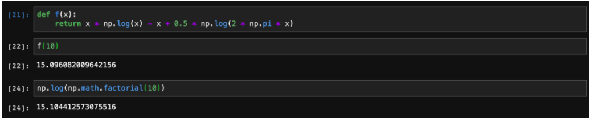

- `eps(float)`： 当log_input = False时，用来防止计算log(0)，而增加的一个修正项，即 loss(input,target)=input - target * log(input+eps)。默认为

### 5.1 功能

目标值为泊松分布的负对数似然损失

### 5.2 公式

)

%3D%20%5Ctext%7Binput%7D%20-%20%5Ctext%7Btarget%7D%20*%20%5Clog(%5Ctext%7Binput%7D)%2B%20%5Clog(%5Ctext%7Btarget!%7D))

其中，上式的最后一项能被省略或者使用Stirling formula近似。当target的值大于1时，使用该近似；当小于或等于1时，将该最后一项加到损失中，不近似。
%20-%20%5Ctext%7Btarget%7D%20%2B%200.5%20*%20%5Clog(2%5Cpi%5Ctext%7Btarget%7D))

### 5.3 代码


```python
import torch
import torch.nn as nn
import numpy as np
# ----------------------------------- Poisson NLLLoss# 生成网络输出 以及 目标输出
log_input = torch.randn(5, 2, requires_grad=True)
target = torch.randn(5, 2)
loss_f = nn.PoissonNLLLoss()
loss = loss_f(log_input, target)
print('\nloss: \n', loss)
```

输出结果：


```jsx
loss:  tensor(1.1533, grad_fn=<MeanBackward0>)
```

## 6、KL 散度损失 KLDivLoss


```java
class torch.nn.KLDivLoss(size_average=None, reduce=None, reduction='mean')
```

注意：

- `reduction`的选项增加了`batchmean`；
- `reduction` = `'mean'` doesn't return the true kl divergence value；除 loss总个数；
- `reduction` = `'batchmean'` which aligns with KL math definition.（目前是这样的，后续版本可能会改进）；除 batch size 。

### 6.1 功能

计算input和target之间的KL散度( Kullback–Leibler divergence) 。 KL 散度，又叫做相对熵，算的是两个分布之间的距离，越相似则越接近零。KL散度是连续分布的有用距离度量，在对连续输出分布的空间进行直接回归时通常很有用。

### 6.2 公式

1）当`reduction = 'none'`
%20%3D%20L%20%3D%20%5C%7B%20l_1%2C%5Cdots%2Cl_N%20%5C%7D%2C%20%5Cquad%20l_n%20%3D%20y_n%20%5Ccdot%20%5Cleft(%20%5Clog%20y_n%20-%20x_n%20%5Cright))

2）当`reduction`不为 `'none'`，默认为`'mean'`

)

%20%3D%20%5Cbegin%7Bcases%7D%20%5Coperatorname%7Bmean%7D(L)%2C%20%26%20%5Ctext%7Bif%20reduction%7D%20%3D%20%5Ctext%7B%27mean%27%3B%7D%20%5C%5C%20%5Coperatorname%7Bsum%7D(L)%2C%20%26%20%5Ctext%7Bif%20reduction%7D%20%3D%20%5Ctext%7B%27sum%27%7D.%20%5C%5C%20%5Cend%7Bcases%7D)

### 6.3 代码


```python
import torch
import torch.nn as nn
import numpy as np

# -----------------------------------  KLDiv loss
loss_f = nn.KLDivLoss(size_average=False, reduce=False)
loss_f_mean = nn.KLDivLoss(size_average=True, reduce=True)
loss_f_mean_1 = nn.KLDivLoss(reduction='mean')
loss_f_mean_2 = nn.KLDivLoss(reduction='batchmean')

# 生成网络输出 以及 目标输出
output = torch.from_numpy(np.array([[0.1132, 0.5477, 0.3390], [0.1132, 0.5477, 0.3390]])).float()
output.requires_grad = True
target = torch.from_numpy(np.array([[0.8541, 0.0511, 0.0947], [0.1132, 0.5477, 0.3390]])).float()

loss_1 = loss_f(output, target)
loss_mean = loss_f_mean(output, target)
loss_mean_1 = loss_f_mean_1(output, target)
loss_mean_2 = loss_f_mean_2(output, target)

print('\nloss: ', loss_1)
print('\nloss_mean: ', loss_mean)
print('\nloss_mean_1: ', loss_mean_1)  # 除 总损失个数
print('\nloss_mean_2: ', loss_mean_2)  # 这是真正数学上KL散度的定义，除 batch size
print(torch.sum(loss_1) / 6)  # 所以 与 loss_mean_1相等
print(torch.sum(loss_1) / 2)  # 所以 与 loss_mean_2相等

# 熟悉计算公式，手动计算样本的第一个元素的loss，注意这里只有一个样本，是 element-wise计算的

output = output[0].detach().numpy()
output_1 = output[0]           # 第一个样本的第一个元素
target_1 = target[0][0].numpy()

loss_1 = target_1 * (np.log(target_1) - output_1)

print('\n第一个样本第一个元素的loss：', loss_1)
```

输出结果：


```xml
loss:  tensor([[-0.2314, -0.1800, -0.2553],
        [-0.2594, -0.6297, -0.4816]], grad_fn=<KlDivBackward>)
loss_mean:  tensor(-0.3396, grad_fn=<KlDivBackward>)
loss_mean_1:  tensor(-0.3396, grad_fn=<KlDivBackward>)
loss_mean_2:  tensor(-1.0187, grad_fn=<DivBackward0>)
tensor(-0.3396, grad_fn=<DivBackward0>)
tensor(-1.0187, grad_fn=<DivBackward0>)
第一个样本第一个元素的loss： -0.23138165
```

## 7、二进制交叉熵损失 BCELoss


```rust
class torch.nn.BCELoss(weight=None, size_average=None, reduce=None, reduction='mean')
```

### 7.1 功能

二分类任务时的交叉熵计算函数。此函数可以认为是 `nn.CrossEntropyLoss` 函数的特例。**其分类限定为二分类**，必须是{0,1}。还需要注意的是，input 应该为概率分布的形式，这样才符合交叉熵的应用。所以在 BCELoss 之前，input一般为 sigmoid 激活层的输出，官方例子也是这样给的。**该损失函数在自编码器中常用**。

### 7.2 公式

1）当`reduction = 'none'`
![\ell(x, y) = L = \{l_1,\dots,l_N\}^\top, \quad l_n = - w_n \left[ y_n \cdot \log x_n + (1 - y_n) \cdot \log (1 - x_n) \right],](https://math.jianshu.com/math?formula=%5Cell(x%2C%20y)%20%3D%20L%20%3D%20%5C%7Bl_1%2C%5Cdots%2Cl_N%5C%7D%5E%5Ctop%2C%20%5Cquad%20l_n%20%3D%20-%20w_n%20%5Cleft%5B%20y_n%20%5Ccdot%20%5Clog%20x_n%20%2B%20(1%20-%20y_n)%20%5Ccdot%20%5Clog%20(1%20-%20x_n)%20%5Cright%5D%2C)
2）当`reduction` 不为 `'none'`，默认为`'mean'`
![L = \{l_1,\dots,l_N\}^\top, \quad l_n = - w_n \left[ y_n \cdot \log x_n + (1 - y_n) \cdot \log (1 - x_n) \right],](https://math.jianshu.com/math?formula=L%20%3D%20%5C%7Bl_1%2C%5Cdots%2Cl_N%5C%7D%5E%5Ctop%2C%20%5Cquad%20l_n%20%3D%20-%20w_n%20%5Cleft%5B%20y_n%20%5Ccdot%20%5Clog%20x_n%20%2B%20(1%20-%20y_n)%20%5Ccdot%20%5Clog%20(1%20-%20x_n)%20%5Cright%5D%2C)

%20%3D%20%5Cbegin%7Bcases%7D%20%5Coperatorname%7Bmean%7D(L)%2C%20%26%20%5Ctext%7Bif%20reduction%7D%20%3D%20%5Ctext%7B%27mean%27%3B%7D%5C%5C%20%5Coperatorname%7Bsum%7D(L)%2C%20%26%20%5Ctext%7Bif%20reduction%7D%20%3D%20%5Ctext%7B%27sum%27.%7D%20%5Cend%7Bcases%7D)

### 7.3 代码


```python
import torch.nn.functional as F
loss_fn = torch.nn.BCELoss(reduce=False, size_average=False)
input = torch.autograd.Variable(torch.randn(3, 4))
target = torch.autograd.Variable(torch.FloatTensor(3, 4).random_(2))
loss = loss_fn(F.sigmoid(input), target)
print(input); print(target); print(loss)
```

输出结果


```css
tensor([[-1.8626, -0.1685,  1.3190,  0.4265],
        [ 0.3094, -1.2203, -0.4972, -0.4424],
        [-0.1279,  0.4547,  0.7306,  0.0625]])
tensor([[0., 0., 1., 1.],
        [0., 0., 1., 0.],
        [1., 0., 1., 1.]])
tensor([[0.1443, 0.6125, 0.2370, 0.5025],
        [0.8597, 0.2586, 0.9723, 0.4962],
        [0.7591, 0.9461, 0.3931, 0.6624]])
```

## 8、BCEWithLogitsLoss


```rust
class torch.nn.BCEWithLogitsLoss(weight=None, size_average=None, reduce=None, reduction='mean', pos_weight=None)
```

### 8.1 功能

- 将`Sigmoid`层和`BCELoss`组合成一个层；
- This version is **more numerically stable** than using a plain `Sigmoid`
  followed by a `BCELoss`；
- 将两个操作组合成一个层， we take advantage of the **log-sum-exp trick for numerical stability.**。

### 8.2 公式

1）当`reduction = 'none'`

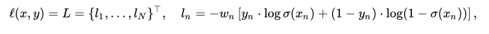


2）当`reduction` 不为 `'none'`，默认为`'mean'`


### 8.3 代码


```php
loss = nn.BCEWithLogitsLoss(reduction='none')
input = torch.randn(3, requires_grad=True)
target = torch.empty(3).random_(2)

output = loss(input, target)
print(input); print(target); print(output)
```

输出结果：


```jsx
tensor([ 0.1099,  1.3278, -0.2820], requires_grad=True)
tensor([0., 0., 0.])
tensor([0.7496, 1.5629, 0.5620],
       grad_fn=<BinaryCrossEntropyWithLogitsBackward>)
```

## 9、MarginRankingLoss


```java
class torch.nn.MarginRankingLoss(margin=0.0, size_average=None, reduce=None, reduction='mean')
```

计算两个向量之间的相似度，当两个向量之间的距离大于margin，则loss为正，小于margin，loss为0

### 9.1 公式

%20%3D%20%5Cmax(0%2C%20-y%20*%20(x1%20-%20x2)%20%2B%20%5Ctext%7Bmargin%7D))

- inputs :`x1`, `x2`, two 1D mini-batch `Tensors`；
- `y`: a label 1D mini-batch tensor (containing 1 or -1)；
- `margin`：默认为0；
- 当时，要比大，且，才不会有损失；
- 当时，要比大，且，才不会有损失。

### 9.2 代码


```php
loss = nn.MarginRankingLoss(reduction='none')
input1 = torch.randn(3, requires_grad=True)
input2 = torch.randn(3, requires_grad=True) + 0.5
target = torch.empty(3).random_(2)

output = loss(input1, input2, target)
print(input1); print(input2); print(target); print(output)
```

输出结果：


```xml
tensor([ 0.2112, -0.0281,  0.5583], requires_grad=True)
tensor([ 1.8994, -0.6425,  0.9355], grad_fn=<AddBackward0>)
tensor([1., 0., 1.])
tensor([1.6882, 0.0000, 0.3772], grad_fn=<ClampMinBackward>)
```

## 10、MultiMarginLoss

多分类（multi-class）的 Hinge 损失，

![loss(\text{x}, y) = \frac{1}{N} \sum_{i=0, i \neq y}^{n} [\text{max}(0, (\text{margin} - (\text{x}_{y} - \text{x}_i))^{p})]](https://math.jianshu.com/math?formula=loss(%5Ctext%7Bx%7D%2C%20y)%20%3D%20%5Cfrac%7B1%7D%7BN%7D%20%5Csum_%7Bi%3D0%2C%20i%20%5Cneq%20y%7D%5E%7Bn%7D%20%5B%5Ctext%7Bmax%7D(0%2C%20(%5Ctext%7Bmargin%7D%20-%20(%5Ctext%7Bx%7D_%7By%7D%20-%20%5Ctext%7Bx%7D_i))%5E%7Bp%7D)%5D)
其中，表示标签，默认取1，margin默认取1，也可以取别的值。

注意：

- 为向量，为标量值。

代码：


```bash
loss = nn.MultiMarginLoss()
x = torch.FloatTensor([[0.1, 0.2, 0.4, 0.8]])
y = torch.LongTensor([3])
# 0.25 * ((1 - 0.8 + 0.1) + (1 - 0.8 + 0.2) + (1 - 0.8 + 0.4)) = 0.325
loss(x, y)
```

## 11、MultiLabelMarginLoss


```java
class torch.nn.MultiLabelMarginLoss(size_average=None, reduce=None, reduction='mean')
```

多类别（multi-class）多分类（multi-classification）的 Hinge 损失，是上面 MultiMarginLoss 在多类别上的拓展。同时限定 p = 1，margin = 1.

这个接口有点坑，是直接从 Torch 那里抄过来的，见 [MultiLabelMarginCriterion](https://links.jianshu.com/go?to=https%3A%2F%2Fgithub.com%2Ftorch%2Fnn%2Fblob%2Fmaster%2Fdoc%2Fcriterion.md%23nn.MultiLabelMarginCriterion) 的描述。而 Lua 的下标和 Python 不一样，前者的数组下标是从 1 开始的，所以用 0 表示占位符。有几个坑需要注意:
![loss(\text{x}, \text{y}) = \frac{1}{N} \sum_{i=1, i \neq \text{y}_i}^{n} \sum_{j=1}^{\text{y}_j \neq 0}[\text{max}(0, 1 - (\text{x}_{\text{y}_j} - \text{x}_i))]](https://math.jianshu.com/math?formula=loss(%5Ctext%7Bx%7D%2C%20%5Ctext%7By%7D)%20%3D%20%5Cfrac%7B1%7D%7BN%7D%20%5Csum_%7Bi%3D1%2C%20i%20%5Cneq%20%5Ctext%7By%7D_i%7D%5E%7Bn%7D%20%5Csum_%7Bj%3D1%7D%5E%7B%5Ctext%7By%7D_j%20%5Cneq%200%7D%5B%5Ctext%7Bmax%7D(0%2C%201%20-%20(%5Ctext%7Bx%7D_%7B%5Ctext%7By%7D_j%7D%20-%20%5Ctext%7Bx%7D_i))%5D)

- 这里的  都是大小为 N 的向量，如果  不是向量而是标量，后面的 就没有了，因此就退化成上面的MultiMarginLoss；
- 限制的大小为 N，是为了处理多标签中标签个数不同的情况，用 0 表示占位，该位置和后面的数字都会被认为不是正确的类。如![\text{y}=[5,3,0,0,4]](https://math.jianshu.com/math?formula=%5Ctext%7By%7D%3D%5B5%2C3%2C0%2C0%2C4%5D) 那么就会被认为是属于类别 5 和 3，而 4 因为在零后面，因此会被忽略。
- 上面的公式和说明只是为了和文档保持一致，其实在调用接口的时候，用的是 -1 做占位符，而 0 是第一个类别。

### 11.1 公式解析

![loss(\text{x}, \text{y}) = \frac{1}{N} \sum_{i=0, i \neq \text{y}_{i}}^{n-1} \sum_{j=0}^{\text{y}_j \neq -1}[\text{max}(0, 1 - (\text{x}_{\text{y}_j} - \text{x}_i))]](https://math.jianshu.com/math?formula=loss(%5Ctext%7Bx%7D%2C%20%5Ctext%7By%7D)%20%3D%20%5Cfrac%7B1%7D%7BN%7D%20%5Csum_%7Bi%3D0%2C%20i%20%5Cneq%20%5Ctext%7By%7D_%7Bi%7D%7D%5E%7Bn-1%7D%20%5Csum_%7Bj%3D0%7D%5E%7B%5Ctext%7By%7D_j%20%5Cneq%20-1%7D%5B%5Ctext%7Bmax%7D(0%2C%201%20-%20(%5Ctext%7Bx%7D_%7B%5Ctext%7By%7D_j%7D%20-%20%5Ctext%7Bx%7D_i))%5D)

- **形状相同的向量**，为了维持一致，使用-1填充；
- 对于真实标签，不考虑中-1之后的值；
- 是的索引，从0开始直到，也就是取中-1之前的值。例如![\text{y} = [3,0,-1,1]](https://math.jianshu.com/math?formula=%5Ctext%7By%7D%20%3D%20%5B3%2C0%2C-1%2C1%5D)，则可取0、1；可取3、0;
- 是的索引，的取值为{0, 1, ..., n-1}中不等于的值。

代码：


```bash
loss = nn.MultiLabelMarginLoss()
x = torch.FloatTensor([[0.1, 0.2, 0.4, 0.8]])
# for target y, only consider labels 3 and 0, not after label -1
y = torch.LongTensor([[3, 0, -1, 1]])
# 0.25 * ((1-(0.1-0.2)) + (1-(0.1-0.4)) + (1-(0.8-0.2)) + (1-(0.8-0.4)))
loss(x, y)
```

代码中公式：

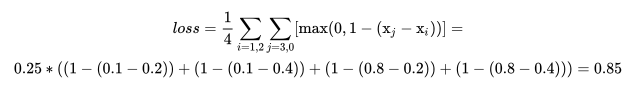


## 12、SoftMarginLoss


```java
class nn.SoftMarginLoss(size_average=None, reduce=None, reduction='mean')
```

多标签二分类问题，这 N 项都是二分类问题，其实就是把 N 个二分类的 loss 加起来，化简一下。其中  只能取 1,−1 两种，代表正类和负类。和下面的其实是等价的，只是  的形式不同。

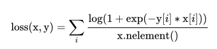


## 13、MultiLabelSoftMarginLoss


```rust
class nn.MultiLabelSoftMarginLoss(    weight=None,    size_average=None,    reduce=None,    reduction='mean',)
```

根据最大熵的多标签 one-versue-all 损失。


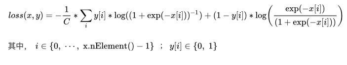


## 14、CosineEmbeddingLoss


```java
class nn.CosineEmbeddingLoss(    margin=0.0,    size_average=None,    reduce=None,    reduction='mean',)
```

余弦相似度的损失，目的是让两个向量尽量相近。注意这两个向量都是有梯度的。

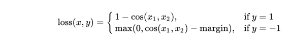

margin 可以取 [−1,1]，但是比较建议取 0-0.5 较好。

## 15、HingeEmbeddingLoss


```java
class nn.HingeEmbeddingLoss(    margin=1.0,    size_average=None,    reduce=None,    reduction='mean',)
```

This is usually used for measuring whether two inputs are similar or
dissimilar, e.g. using the L1 pairwise distance as `x`, and is typically
used for learning nonlinear embeddings or semi-supervised learning.


%20%3D%20%5Cbegin%7Bcases%7D%20%5Coperatorname%7Bmean%7D(L)%2C%20%26%20%5Ctext%7Bif%20reduction%7D%20%3D%20%5Ctext%7B%27mean%27%3B%7D%5C%5C%20%5Coperatorname%7Bsum%7D(L)%2C%20%26%20%5Ctext%7Bif%20reduction%7D%20%3D%20%5Ctext%7B%27sum%27.%7D%20%5Cend%7Bcases%7D)

## 16、TripleMarginLoss


```java
class nn.TripletMarginLoss(
    margin=1.0,
    p=2.0,
    eps=1e-06,
    swap=False,
    size_average=None,
    reduce=None,
    reduction='mean',
)
```

%20%3D%20%5Cmax%20%5C%7Bd(a_i%2C%20p_i)%20-%20d(a_i%2C%20n_i)%20%2B%20%7B%5Crm%20margin%7D%2C%200%5C%7D)

%20%3D%20%5Cleft%5ClVert%20%7B%5Cbf%20x%7D_i%20-%20%7B%5Cbf%20y%7D_i%20%5Cright%5CrVert_p)


```php
triplet_loss = nn.TripletMarginLoss(margin=1.0, p=2)
anchor = torch.randn(100, 128, requires_grad=True)
positive = torch.randn(100, 128, requires_grad=True)
negative = torch.randn(100, 128, requires_grad=True)
output = triplet_loss(anchor, positive, negative)
output
```

## 17、SmoothL1Loss


```java
class nn.SmoothL1Loss(size_average=None, reduce=None, reduction='mean')
```

%20%3D%20%5Cfrac%7B1%7D%7Bn%7D%20%5Csum_%7Bi%7D%20z_%7Bi%7D%3D%20%5Cbegin%7Bcases%7D%200.5%20(x_i%20-%20y_i)%5E2%2C%20%26%20%5Ctext%7Bif%20%7D%20%7Cx_i%20-%20y_i%7C%20%3C%201%20%5C%5C%20%7Cx_i%20-%20y_i%7C%20-%200.5%2C%20%26%20%5Ctext%7Botherwise%20%7D%20%5C%5C%20%5Cend%7Bcases%7D)

## 18、CTCLoss


```java
class nn.CTCLoss(blank=0, reduction='mean', zero_infinity=False)
```

还不要清楚。。。


```csharp
T = 50      # Input sequence length
C = 20      # Number of classes (including blank)
N = 16      # Batch size
S = 30      # Target sequence length of longest target in batch
S_min = 10  # Minimum target length, for demonstration purposes

# Initialize random batch of input vectors, for *size = (T,N,C)
input = torch.randn(T, N, C).log_softmax(2).detach().requires_grad_()

# Initialize random batch of targets (0 = blank, 1:C = classes)
target = torch.randint(low=1, high=C, size=(N, S), dtype=torch.long)

input_lengths = torch.full(size=(N,), fill_value=T, dtype=torch.long)
target_lengths = torch.randint(low=S_min, high=S, size=(N,), dtype=torch.long)
ctc_loss = nn.CTCLoss()
loss = ctc_loss(input, target, input_lengths, target_lengths)
loss.backward()
```

