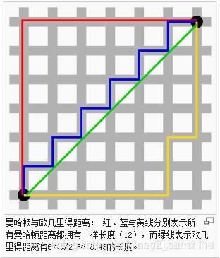
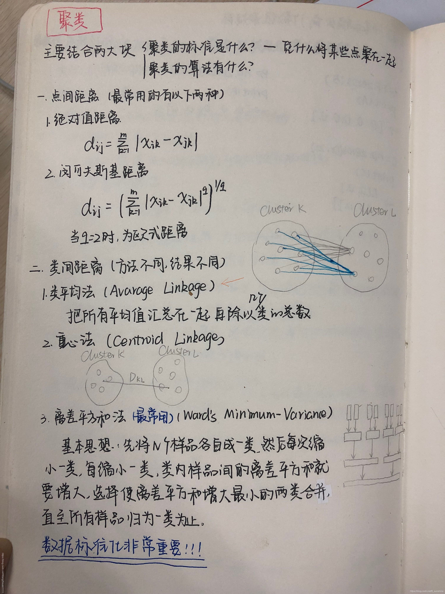
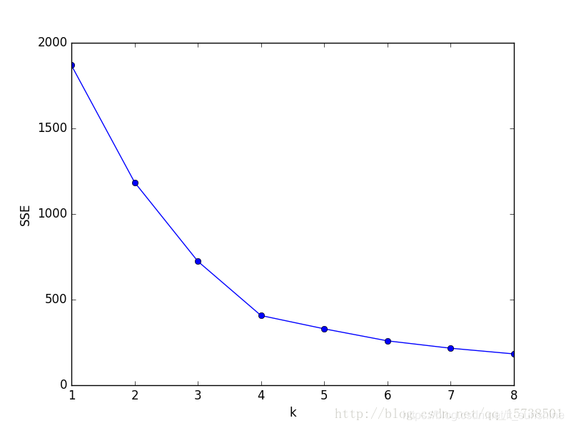
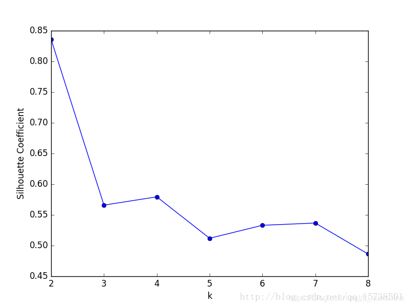

# Kmeans算法详解及实现

⌚️: 2021年4月1日

📚参考

- [1](https://blog.csdn.net/WangZixuan1111/article/details/98970139)
- [2](https://blog.csdn.net/WangZixuan1111/article/details/98947683)
- [3](https://blog.csdn.net/orangefly0214/article/details/86538865)
- [4](https://mp.weixin.qq.com/s?__biz=Mzg2MjI5Mzk0MA==&mid=2247484061&idx=1&sn=2f9d5def9ec4615a9f4234c931124b92&chksm=ce0b5846f97cd150a479c37ee24f497ae864065415f23ca7f28f67206d949c718430f607919f&scene=21#wechat_redirect)

---

> 主要的KMeans算法的原理和应用，在学习典过程中，我们要带着以下几个问题去学习
> 以下问题摘自于https://blog.csdn.net/qq_33011855/article/details/81482511
> 1、简述一下K-means算法的原理和工作流程
> 2、K-means中常用的到中心距离的度量有哪些？
> 3、K-means中的k值如何选取?
> 4、K-means算法中初始点的选择对最终结果有影响吗？
> 5、K-means聚类中每个类别中心的初始点如何选择？
> 6、K-means中空聚类的处理
> 7、K-means是否会一直陷入选择质心的循环停不下来？
> 8、如何快速收敛数据量超大的K-means？
> 9、K-means算法的优点和缺点是什么？

## 一、原理和流程

### 1、原理

对给定的**无标记**的样本数据集，事先确定**聚类簇数K**，让簇内的样本尽可能紧密分布在一起，使簇间的距离尽可能大。K-Means作为**无监督**的聚类算法，其类似于全自动分类，簇内越相似，聚类效果越好，实现较简单，聚类效果好，因此被广泛使用。用以下的效果图更能直观地看出其过程：


### 2、流程

（1）随即确定K个初始点作为质心（这里如何确定k将在下面给出解释）
（2）将数据集中的每个点分配到一个簇中，即为每个点找距离其最近的质心，并将其分配给质心所对应的簇
（3）簇分好后，计算每个簇所有点的平均值，将平均值作为对应簇新的质心
（4）循环2、3步骤，直到质心不变

```cpp
Step1：从数据集D中随机选择k个样本作为初始的k个质心向量
Step2：计算数据集中样本Xi分别到k个质心的欧几里得距离d1, d2……dk. 于是我们得到与Xi距离最小的质心并且把Xi划分到和这个质心同一cluster中。
Step3：对数据集中所有样本进行Step2操作
Step4：重新计算k个簇里面的向量均值（就是把k个质心在新的簇下刷新一遍），然后重复Step2- Step4。直到所有的k个质心向量都没有发生变化。
```

伪代码是：（要会写）

```cpp
创建k个点作为起始质心（经常是随机选择）
当任意一个点的簇分配结果发生改变时
	对数据集中的每个数据点
		对每个质心
			计算质心和数据点之间的距离
		将数据点分配到距离其最近的簇
	对每一个簇，计算簇中所有点的均值并将均值作为新的质心
```

上面“最近”质心，意味着需要进行**某种距离**的计算，即下文要介绍的K-means中常用的到中心距离的度量有哪些？

## 二、K-means中常用的到中心距离的度量有哪些

这里最常用的有以下两种（我们这里只简单介绍下二维的）

1. **曼哈顿距离**
   $ d _ { 12 } = \left| x _ { 1 } - x _ { 2 } \right| + \left| y _ { 1 } - y _ { 2 } \right|$

2. **欧几里得距离**（别称“欧式距离”）

   $d _ { 12 } = \sqrt { \left( x _ { 1 } - x _ { 2 } \right) ^ { 2 } + \left( y _ { 1 } - y _ { 2 } \right) ^ { 2 } } $

```cpp
假设两个点坐标是（1，1），（4，5）
则曼哈顿距离是7，欧式距离是5
```




补充：（[图片来源](https://blog.csdn.net/WangZixuan1111/article/details/98947683)）


[聚类分析的类间距离度量方法](https://zhuanlan.zhihu.com/p/106527475)


## 三、K-means中的k值如何选取

以下博文转自：https://blog.csdn.net/qq_15738501/article/details/79036255
通常我们会采用**手肘法**来确定k的值

### 1、手肘法

手肘法的核心指标是**SSE**(sum of the squared errors，误差平方和)，

$S S E = \sum _ { i = 1 } ^ { k } \sum _ { p \in C _ { i } } \left| p - m _ { i } \right| ^ { 2 } $

其中，$ C_i$是第i个簇, p是$ C_i$中的样本点，$m_i$是$C_i$的质心（$C_i$中所有样本的均值），**SSE是所有样本的聚类误差，代表了聚类效果的好坏。**


手肘法的核心思想是：随着聚类数k的增大，样本划分会更加精细，每个簇的聚合程度会逐渐提高，那么误差平方和SSE自然会逐渐变小。并且，当k小于真实聚类数时，由于k的增大会大幅增加每个簇的聚合程度，故**SSE的下降幅度**会很大，而当k到达真实聚类数时，再增加k所得到的聚合程度回报会迅速变小，所以**SSE的下降幅度**会骤减，然后随着k值的继续增大而趋于平缓，也就是说**SSE和k的关系图是一个手肘的形状，而这个肘部对应的k值就是数据的真实聚类数**。当然，这也是该方法被称为手肘法的原因。

实践：我们对 *预处理后数据.csv* 中的数据利用手肘法选取最佳聚类数k。具体做法是让k从1开始取值直到取到你认为合适的上限(一般来说这个上限不会太大，这里我们选取上限为8)，对每一个k值进行聚类并且记下对于的SSE，然后画出k和SSE的关系图（毫无疑问是手肘形），最后**选取肘部对应的k作为我们的最佳聚类数**。python实现如下：

```python
import pandas as pd
from sklearn.cluster import KMeans
import matplotlib.pyplot as plt
 
df_features = pd.read_csv(r'C:\预处理后数据.csv',encoding='gbk') # 读入数据
'利用SSE选择k'
SSE = []  # 存放每次结果的误差平方和
for k in range(1,9):
    estimator = KMeans(n_clusters=k)  # 构造聚类器
    estimator.fit(df_features[['R','F','M']])
    SSE.append(estimator.inertia_)
X = range(1,9)
plt.xlabel('k')
plt.ylabel('SSE')
plt.plot(X,SSE,'o-')
plt.show()
```

画出的k与SSE的关系图如下：

显然，肘部对于的k值为4，故对于这个数据集的聚类而言，最佳聚类数应该选4

### 2、轮廓系数法

该方法的核心指标是[轮廓系数](https://baike.baidu.com/item/轮廓系数/17361607#1)**（Silhouette Coefficient），某个样本点$X_i$轮廓系数定义如下**：

$S = \frac { b - a } { \max ( a , b ) } $

其中，a是$X_i$与**同簇**的其他样本的平均距离，称为**凝聚度**（将a称为样本$ X_i$的**簇内不相似度**），$b$是$ X_i$与**最近簇**中所有样本的平均距离，称为**分离度**（将 b称为样本$ X_i$的**簇间不相似度的最小值**）。

而**最近簇**的定义是：
$C _ { j } = \arg \min _ { C _ { k } } \frac { 1 } { n } \sum _ { p \in C _ { k } } \left| p - X _ { i } \right| ^ { 2 } $

其中p是某个簇$ C_k$中的样本。事实上，简单点讲，就是用$ X_i$到某个簇所有样本的平均距离作为衡量该点到该簇的距离后，选择离$X_i$最近的一个簇作为最近簇。

**求出所有样本的轮廓系数后再求平均值就得到了平均轮廓系数**。平均轮廓系数的取值范围为[-1,1]，且簇内样本的距离越近，簇间样本距离越远，**平均轮廓系数越大，聚类效果越好**。那么，很自然地，**平均轮廓系数最大的k便是最佳聚类数**。

实践：我们同样使用上面的数据集，同样考虑k等于1到8的情况，对于每个 k值进行聚类并且求出相应的轮廓系数，然后**做出k和轮廓系数的关系图**，选取轮廓系数取值最大的k作为我们最佳聚类系数，python实现如下：

```python
import pandas as pd
from sklearn.cluster import KMeans
from sklearn.metrics import silhouette_score
import matplotlib.pyplot as plt
 
df_features = pd.read_csv(r'C:\Users\61087\Desktop\项目\爬虫数据\预处理后数据.csv',encoding='gbk')
Scores = []  # 存放轮廓系数
for k in range(2,9):
    estimator = KMeans(n_clusters=k)  # 构造聚类器
    estimator.fit(df_features[['R','F','M']])
    Scores.append(silhouette_score(df_features[['R','F','M']],estimator.labels_,metric='euclidean'))
X = range(2,9)
plt.xlabel('k')
plt.ylabel('轮廓系数')
plt.plot(X,Scores,'o-')
plt.show()
```

得到聚类数k与轮廓系数的关系图：

可以看到，轮廓系数最大的k值是2，这表示我们的最佳聚类数为2。但是，值得注意的是，从k和SSE的手肘图可以看出，当k取2时，SSE还非常大，所以这是一个不太合理的聚类数，我们退而求其次，考虑轮廓系数第二大的k值4，这时候SSE已经处于一个较低的水平，因此最佳聚类系数应该取4而不是2。

但是，讲道理，k=2时轮廓系数最大，聚类效果应该非常好，那为什么SSE会这么大呢？在我看来，原因在于轮廓系数考虑了分离度b，也就是样本与最近簇中所有样本的平均距离。为什么这么说，因为从定义上看，轮廓系数大，不一定是凝聚度a（样本与同簇的其他样本的平均距离）小，而可能是b和a都很大的情况下b相对a大得多，这么一来，a是有可能取得比较大的。a一大，样本与同簇的其他样本的平均距离就大，簇的紧凑程度就弱，那么簇内样本离质心的距离也大，从而导致SSE较大。所以，**虽然轮廓系数引入了分离度b而限制了聚类划分的程度，但是同样会引来最优结果的SSE比较大的问题，这一点也是值得注意的**。

### 3、总结

从以上两个例子可以看出，轮廓系数法确定出的最优k值不一定是最优的，有时候还需要根据SSE去辅助选取，这样一来相对手肘法就显得有点累赘。因此，如果没有特殊情况的话，我还是建议首先考虑用**手肘法**。

## 四、代码实现

```python
def kmeans(k):
    m, n = 100, 20  # 构造样本：100行、20列（100个样本，每个样本20维特征）
    x = 10 * np.random.random((m, n))  # 0-1   x是训练集，无标签

    # 创建k个点作为初始中心点/质心（经常是随机选择）
    init_cent_sample = set()  # 用set的原因是为了去重
    while len(init_cent_sample) < k:
        init_cent_sample.add(np.random.randint(0, m))  # [low, high)  # 中心点/质心 在这里仅用其idx表示，后面还会处理

    # 保存簇中心点（聚类中心点），k个聚类中心点（每个中心点都是一个n维的向量）
    cent_pos = x[list(init_cent_sample)]  # 第i个质心的坐标为：cent_pos[i]

    # 记录每个样本的类归属和（距离其所属簇质心的）距离    [每个样本所归属的簇中心点idx， 该样本距离此簇中心点的距离]
    sample_belong_to = np.zeros((m, 2))  # np.array([min_idx, min_dist])

    # 记录每个类的中心点在本次迭代后是否有过改变
    cent_changed = True
    # 当任意一个点的簇分配结果发生改变时
    while cent_changed:
        cent_changed = False

        # 对数据集中的每个样本点
        for i in range(m):
            # 记录每个样本距离最近的类
            min_idx = -1
            # 记录每个样本的最小类距
            min_dist = math.inf

            # 对数据集中的每个数据点，计算其与k个质心的距离
            for j in range(k):
                d = distance(x[i], cent_pos[j])
                if d < min_dist:
                    min_idx = j
                    min_dist = d

            # 记录此样本（即第i个样本）所对应的中心点是否发生变化（只有所有样本所归属的簇类中心点都不变时，才停止迭代）
            if min_idx != sample_belong_to[i][0]:
                sample_belong_to[i] = np.array([min_idx, min_dist])  # [每个样本所归属的簇中心点idx， 该样本距离此簇中心点的距离]
                cent_changed = True

        print(sample_belong_to)

        # 更新每个类/簇的中心点：均值
        for i in range(k):
            samples_of_curr_cluster = np.where(sample_belong_to[:, 0] == i)  # 只有条件(condition)，没有x和y，则输出满足条件（即非0）元素的坐标（等价于numpy.nonzero）。
            if len(samples_of_curr_cluster) > 0:
                print(samples_of_curr_cluster)
                cent_pos[i] = np.mean(x[samples_of_curr_cluster], axis = 0)


# 计算距离
def distance(a, b):
    return math.sqrt(sum(pow(a - b, 2)))

```

## 五、其他问题的解答

- K-means算法中初始点的选择对最终结果有影响吗？
  会有影响的，不同的初始值结果可能不一样（选不好可能会得到局部最优）

------

- K-means聚类中每个类别中心的初始点如何选择？

   

  - 随机法：最简单的确定初始类簇中心点的方法是随机选择K个点作为初始的类簇中心点。
  - 这k个点的距离尽可能远：首先随机选择一个点作为第一个初始类簇中心点，然后选择距离该点最远的那个点作为第二个初始类簇中心点，然后再选择距离前两个点的最近距离最大的点作为第三个初始类簇的中心点，以此类推，直到选出k个初始类簇中心。
  - 可以对数据先进行**层次聚类**（博客后期会更新这类聚类算法），得到K个簇之后，从每个类簇中选择一个点，该点可以是该类簇的中心点，或者是距离类簇中心点最近的那个点。

------

- K-means中空聚类的处理

   

  - 选择一个距离当前任何质心最远的点。这将消除当前对总平方误差影响最大的点。
  - 从具有最大SSE的簇中选择一个替补的质心，这将分裂簇并降低聚类的总SSE。如果有多个空簇，则该过程重复多次。
  - 如果噪点或者孤立点过多，考虑更换算法，如密度聚类（博客后期会更新这类聚类算法）

------

- K-means是否会一直陷入选择质心的循环停不下来？

  不会，有数学证明Kmeans一定会收敛，大概思路是利用SSE的概念（也就是误差平方和），即每 个点到自身所归属质心的距离的平方和，这个平方和是一个凸函数，通过迭代一定可以到达它的局部最优解。

  -  迭代次数设置


  - 设定收敛判断距离

------

- 如何快速收敛数据量超大的K-means？
  相关解释可以去这个博客稍做了解https://blog.csdn.net/sunnyxidian/article/details/89630815

------

- K-means算法的优点和缺点是什么？

  K-Means的**主要优点**：
  （1）原理简单，容易实现
  （2）可解释度较强

  K-Means的**主要缺点**：（对应改进和优化暂时还没补充）
  （1）K值很难确定
  （2）局部最优
  （3）对噪音和异常点敏感
  （4）需样本存在均值（限定数据种类）
  （5）聚类效果依赖于聚类中心的初始化
  （6）对于非凸数据集或类别规模差异太大的数据效果不好

------

- K-Means与KNN有什么区别
  1）KNN是分类算法，K-means是聚类算法；
  2）KNN是监督学习，K-means是非监督学习

------

- 如何对K-means聚类效果进行评估？
  轮廓系数（Silhouette Coefficient），是聚类效果好坏的一种评价方式。最早由 Peter J. Rousseeuw 在 1986 提出。它结合**凝聚度**和**分离度**两种因素。可以用来在相同原始数据的基础上用来评价不同算法、或者算法不同运行方式对聚类结果所产生的影响。

------

- em算法与k-means的关系，用em算法推导解释k means

------

- 用hadoop实现看k means

------

- 如何判断自己实现的 LR、Kmeans 算法是否正确？

