# 如何理解最小二乘法？

⌚️: 2021年4月1日

📚参考

- [参考](https://zhuanlan.zhihu.com/p/38128785)

---

> 最小平方法是十九世纪统计学的主题曲。 从许多方面来看, 它之于统计学就相当于十八世纪的微积分之于数学。
>
> ----乔治·斯蒂格勒的《The History of Statistics》

## 初步了解

### **1. 日用而不知**

来看一个生活中的例子。比如说，有五把尺子：


用它们来分别测量一线段的长度，得到的数值分别为（颜色指不同的尺子）：

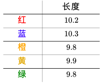

之所以出现不同的值可能因为：

- 不同厂家的尺子的生产精度不同
- 尺子材质不同，热胀冷缩不一样
- 测量的时候心情起伏不定
- ......

总之就是有误差，这种情况下，一般取平均值来作为线段的长度：


日常中就是这么使用的。可是作为很事'er的数学爱好者，自然要想下：

- 这样做有道理吗？
- 用调和平均数行不行？
- 用中位数行不行？
- 用几何平均数行不行？

### **2 最小二乘法**

换一种思路来思考刚才的问题。

首先，把测试得到的值画在笛卡尔坐标系中，分别记作 ：

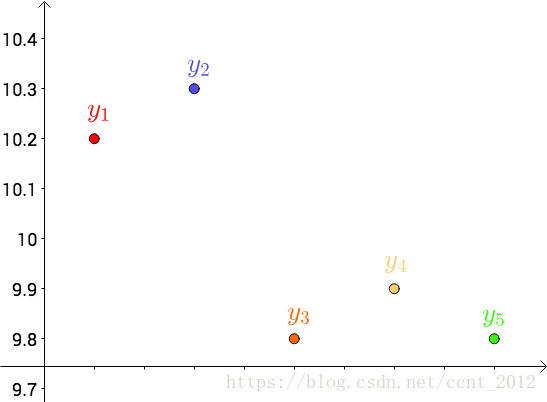

其次，把要猜测的线段长度的真实值用平行于横轴的直线来表示（因为是猜测的，所以用虚线来画），记作 ：

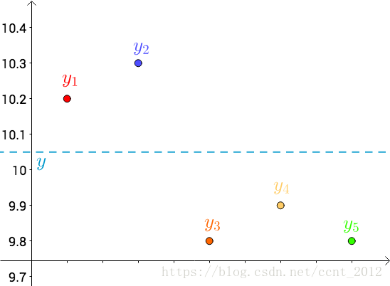

每个点都向 做垂线，垂线的长度就是 ，也可以理解为测量值和真实值之间的误差：

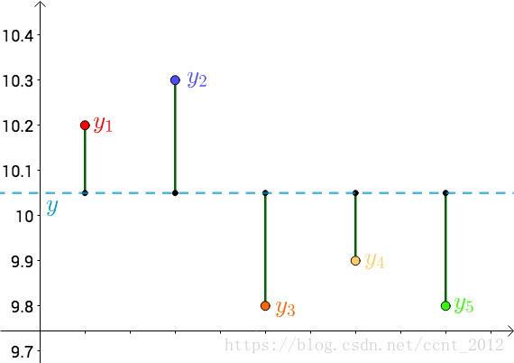

因为误差是长度，还要取绝对值，计算起来麻烦，就干脆用平方来代表误差：


总的误差的平方就是：


因为 是猜测的，所以可以不断变换：

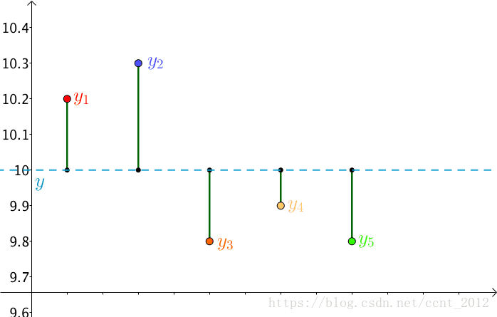

自然，总的误差 也是在不断变化的。


法国数学家，阿德里安-馬里·勒讓德（1752－1833，这个头像有点抽象）提出让总的误差的平方最小的 就是真值，这是基于，如果误差是随机的，应该围绕真值上下波动（关于这点可以看下“[如何理解无偏估计？](https://www.matongxue.com/madocs/808.html)”）。

这就是**最小二乘法**，即：


这个猜想也蛮符合直觉的，来算一下。

这是一个二次函数，对其求导，导数为0的时候取得最小值：


进而：


正好是算术平均数。

原来算术平均数可以让误差最小啊，这下看来选用它显得讲道理了。

以下这种方法：


就是最小二乘法，所谓“二乘”就是平方的意思，台湾直接翻译为最小平方法。

### **3 推广**

算术平均数只是最小二乘法的特例，适用范围比较狭窄。而最小二乘法用途就广泛。

比如温度与冰淇淋的销量：


看上去像是某种线性关系：

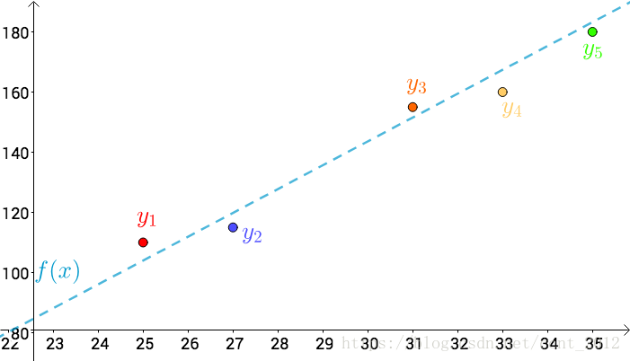

可以假设这种线性关系为：


通过最小二乘法的思想：

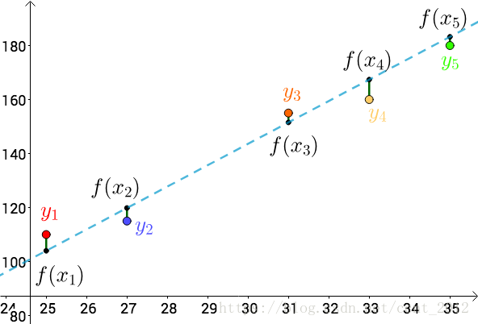

上图的 分别为：


总误差的平方为：


不同的 会导致不同的 ，根据多元微积分的知识，当：


这个时候 取最小值。

对于 而言，上述方程组为线性方程组，用之前的数据解出来：


也就是这根直线：

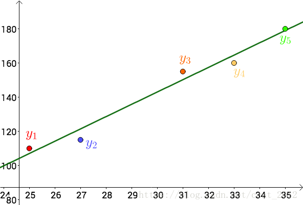

其实，还可以假设：


在这个假设下，可以根据最小二乘法，算出 ，得到下面这根红色的二次曲线：

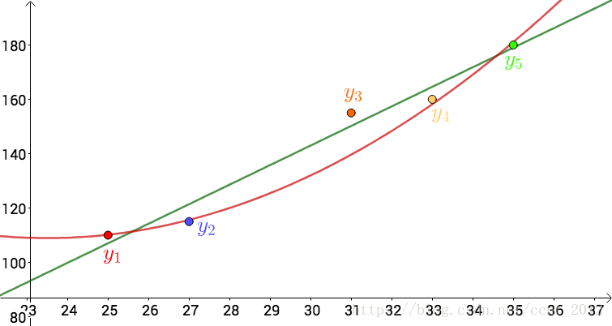

同一组数据，选择不同的 ，通过最小二乘法可以得到不一样的拟合曲线（[出处](https://de.wikipedia.org/wiki/Methode_der_kleinsten_Quadrate)）：

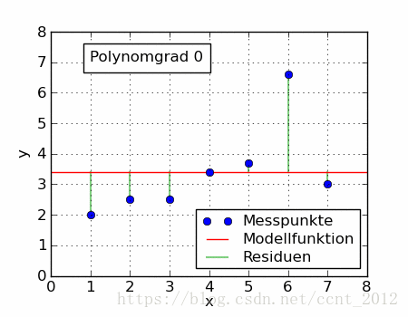

不同的数据，更可以选择不同的 ，通过最小二乘法可以得到不一样的拟合曲线：

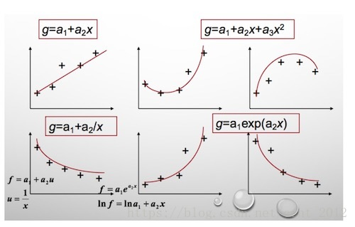

 也不能选择任意的函数，还是有一些讲究的，这里就不介绍了。

### **4 最小二乘法与正态分布**

我们对勒让德的猜测，即最小二乘法，仍然抱有怀疑，万一这个猜测是错误的怎么办？

数学王子高斯（1777－1855）也像我们一样心存怀疑。

高斯换了一个思考框架，通过概率统计那一套来思考。

让我们回到最初测量线段长度的问题。高斯想，通过测量得到了这些值：


每次的测量值 都和线段长度的真值 之间存在一个误差：


这些误差最终会形成一个概率分布，只是现在不知道误差的概率分布是什么。假设概率密度函数为：


再假设一个联合概率密度函数，这样方便把所有的测量数据利用起来：


讲到这里，有些同学可能已经看出来了上面似然函数了（关于似然函数以及马上要讲到的极大似然估计，可以参考“[如何理解极大似然估计法？](https://www.matongxue.com/madocs/447.html)”）。

因为 是关于 的函数，并且也是一个概率密度函数（下面分布图形是随便画的）：

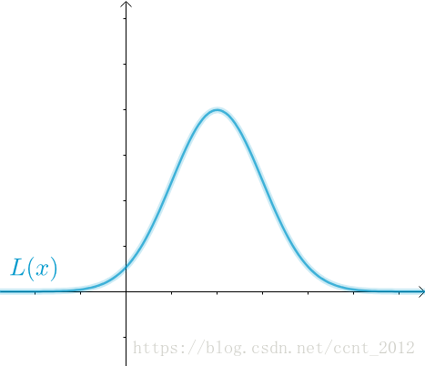

根据极大似然估计的思想，概率最大的最应该出现（既然都出现了，而我又不是“天选之才”，那么自然不会是发生了小概率事件），也就是应该取到下面这点：

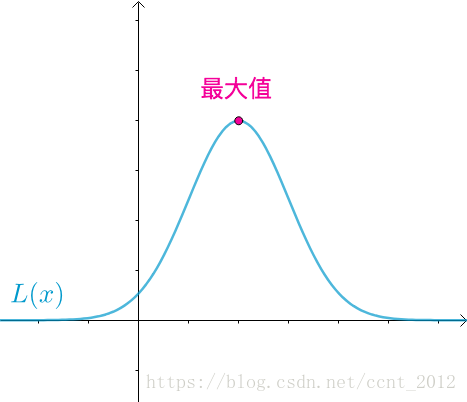

当下面这个式子成立时，取得最大值：


然后高斯想，最小二乘法给出的答案是：


如果最小二乘法是对的，那么 时应该取得最大值，即：


好，现在可以来解这个微分方程了。最终得到：


这是什么？这就是正态分布啊。

并且这还是一个充要条件：


也就是说，如果误差的分布是正态分布，那么最小二乘法得到的就是最有可能的值。

那么误差的分布是正态分布吗？

我们相信，误差是由于随机的、无数的、独立的、多个因素造成的，比如之前提到的：

- 不同厂家的尺子的生产精度不同
- 尺子材质不同，热胀冷缩不一样
- 测量的时候心情起伏不定
- ......

那么根据中心极限定理（参考“[为什么正态分布如此常见？](https://www.matongxue.com/madocs/589.html)”），误差的分布就应该是正态分布。

因为高斯的努力，才真正奠定了最小二乘法的重要地位。

文章最新版本在（有可能会有后续更新）：[如何理解最小二乘法？](https://www.matongxue.com/madocs/818.html)


## 进一步了解

文章结构如下：

1： 最小二乘法的原理与要解决的问题　

2 ：最小二乘法的矩阵法解法

3：最小二乘法的几何解释

4：最小二乘法的局限性和适用场景　

5： 案例python实现

6：参考文献

------

### **1： 最小二乘法的原理与要解决的问题**

最小二乘法是由勒让德在19世纪发现的，形式如下式：

![[公式]](https://www.zhihu.com/equation?tex=%E6%A0%87%E5%87%BD%E6%95%B0+%3D+%5Csum%EF%BC%88%E8%A7%82%E6%B5%8B%E5%80%BC-%E7%90%86%E8%AE%BA%E5%80%BC%EF%BC%89%5E2%5C%5C) 
观测值就是我们的多组样本，理论值就是我们的假设拟合函数。目标函数也就是在机器学习中常说的损失函数，我们的目标是得到使目标函数最小化时候的拟合函数的模型。举一个最简单的线性回归的简单例子，比如我们有 ![[公式]](https://www.zhihu.com/equation?tex=m) 个只有一个特征的样本： ![[公式]](https://www.zhihu.com/equation?tex=%28x_i%2C+y_i%29%28i%3D1%2C+2%2C+3...%2Cm%29)

样本采用一般的 ![[公式]](https://www.zhihu.com/equation?tex=h_%7B%5Ctheta%7D%28x%29) 为 ![[公式]](https://www.zhihu.com/equation?tex=n) 次的多项式拟合， ![[公式]](https://www.zhihu.com/equation?tex=h_%7B%5Ctheta%7D%28x%29%3D%5Ctheta_0%2B%5Ctheta_1x%2B%5Ctheta_2x%5E2%2B...%5Ctheta_nx%5En%2C%5Ctheta%28%5Ctheta_0%2C%5Ctheta_1%2C%5Ctheta_2%2C...%2C%5Ctheta_n%29) 为参数

最小二乘法就是要找到一组 ![[公式]](https://www.zhihu.com/equation?tex=%5Ctheta%28%5Ctheta_0%2C%5Ctheta_1%2C%5Ctheta_2%2C...%2C%5Ctheta_n%29) 使得 ![[公式]](https://www.zhihu.com/equation?tex=%5Csum_%7Bi%3D1%7D%5En%28h_%7B%5Ctheta%7D%28x_i%29-y_i%29%5E2) (残差平方和) 最小，即，求 ![[公式]](https://www.zhihu.com/equation?tex=min%5Csum_%7Bi%3D1%7D%5En%28h_%7B%5Ctheta%7D%28x_i%29-y_i%29%5E2)

------

### **2 ：最小二乘法的矩阵法解法**

最小二乘法的代数法解法就是对 ![[公式]](https://www.zhihu.com/equation?tex=%5Ctheta_i) 求偏导数，令偏导数为0，再解方程组，得到 ![[公式]](https://www.zhihu.com/equation?tex=%5Ctheta_i) 。矩阵法比代数法要简洁，下面主要讲解下矩阵法解法，这里用多元线性回归例子来描：

假设函数 ![[公式]](https://www.zhihu.com/equation?tex=h_%7B%5Ctheta%7D%28x_1%2Cx_2%2C...x_n%29%3D%5Ctheta_0%2B%5Ctheta_1x_1%2B...%2B%5Ctheta_nx_n) 的矩阵表达方式为：

![[公式]](https://www.zhihu.com/equation?tex=h_%7B%5Ctheta%7D%28%5Cmathbf%7Bx%7D%29%3D%5Cmathbf%7BX%7D%5Ctheta%5C%5C) 
其中， 假设函数 ![[公式]](https://www.zhihu.com/equation?tex=h_%7B%5Ctheta%7D%28%5Cmathbf%7Bx%7D%29%3D%5Cmathbf%7BX%7D%5Ctheta) 为 ![[公式]](https://www.zhihu.com/equation?tex=m%5Ctimes1) 的向量, ![[公式]](https://www.zhihu.com/equation?tex=%5Ctheta) 为 ![[公式]](https://www.zhihu.com/equation?tex=n%5Ctimes1) 的向量，里面有 ![[公式]](https://www.zhihu.com/equation?tex=n) 个代数法的模型参数。 ![[公式]](https://www.zhihu.com/equation?tex=X) 为 ![[公式]](https://www.zhihu.com/equation?tex=m%5Ctimes+n) 维的矩阵。 ![[公式]](https://www.zhihu.com/equation?tex=m) 代表样本的个数， ![[公式]](https://www.zhihu.com/equation?tex=n) 代表样本的特征数。

损失函数定义为 ![[公式]](https://www.zhihu.com/equation?tex=J%28%5Ctheta%29%3D%5Cfrac%7B1%7D%7B2%7D%28%5Cmathbf%7BX%7D%5Ctheta-%5Cmathbf%7BY%7D%29%5ET%28%5Cmathbf%7BX%7D%5Ctheta-%5Cmathbf%7BY%7D%29) ，其中 ![[公式]](https://www.zhihu.com/equation?tex=%5Cmathbf%7BY%7D) 是样本的输出向量，维度为 ![[公式]](https://www.zhihu.com/equation?tex=m%5Ctimes+1) 。 ![[公式]](https://www.zhihu.com/equation?tex=%5Cfrac%7B1%7D%7B2%7D) 在这主要是为了求导后系数为1，方便计算。

根据最小二乘法的原理，我们要对这个损失函数对 ![[公式]](https://www.zhihu.com/equation?tex=%5Ctheta) 向量求导取0。结果如下式：

![[公式]](https://www.zhihu.com/equation?tex=%5Cfrac%7B%5Cpartial+%7D%7B%5Cpartial+%5Ctheta%7DJ%28%5Ctheta%29%3D%5Cmathbf%7BX%7D%5ET%28%5Cmathbf%7BX%7D%5Ctheta-%5Cmathbf%7BY%7D%29%3D0%5C%5C) 
对上述求导等式整理后可得：

![[公式]](https://www.zhihu.com/equation?tex=%5Ctheta%3D%28%5Cmathbf%7BX%7D%5ET%5Cmathbf%7BX%7D%29%5E%7B-1%7D%5Cmathbf%7BX%7D%5ET%5Cmathbf%7BY%7D%5C%5C)

------

### **3：最小二乘法的几何解释**

先说结论：**最小二乘法的几何意义是高维空间中的一个向量在低维子空间的投影**。

考虑这样一个简单的问题，求解二元一次方程组：

![[公式]](https://www.zhihu.com/equation?tex=%5Cleft%5C%7B%5Cbegin%7Bmatrix%7D+x_1%2Bx_2%3D3%5Cleftarrow+a%5C%5C+-x_1%2Bx_2%3D1%5Cleftarrow+b+%5Cend%7Bmatrix%7D%5Cright.%5C%5C) 
方程组的解也就是直线$a$与$b$的交点，并且很容易算出 ![[公式]](https://www.zhihu.com/equation?tex=x_1%3D1%EF%BC%8Cx_2%3D2) .它的矩形形式：

![[公式]](https://www.zhihu.com/equation?tex=%5Cbegin%7Bbmatrix%7D1%5C%5C+-1%5Cend%7Bbmatrix%7D%5Ctimes+x_1%2B%5Cbegin%7Bbmatrix%7D1%5C%5C+1%5Cend%7Bbmatrix%7D%5Ctimes+x_2%3Db%5CLeftrightarrow+a_1%5Ctimes+x_1%2Ba_2%5Ctimes+x_2%3Db%5C%5C) 
表示 ![[公式]](https://www.zhihu.com/equation?tex=x_1) 倍的向量 ![[公式]](https://www.zhihu.com/equation?tex=a_1) 加上 ![[公式]](https://www.zhihu.com/equation?tex=x_2) 倍的向量 ![[公式]](https://www.zhihu.com/equation?tex=a_2) 等于向量 ![[公式]](https://www.zhihu.com/equation?tex=b) 。或者说， ![[公式]](https://www.zhihu.com/equation?tex=b) 是向量 ![[公式]](https://www.zhihu.com/equation?tex=a_1) 与 ![[公式]](https://www.zhihu.com/equation?tex=a_2) 的线性组合。

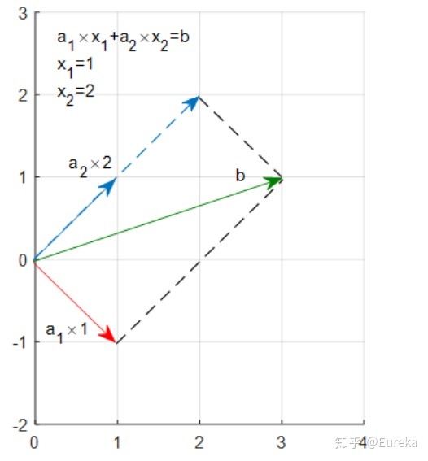

可以看到，1倍的 ![[公式]](https://www.zhihu.com/equation?tex=a_1) 加上2倍的 ![[公式]](https://www.zhihu.com/equation?tex=a_2) 既是 ![[公式]](https://www.zhihu.com/equation?tex=b) ，而1和2正是我们的解。而最小二乘所面临的问题远不止两个点，拿三个点来说吧。（0,2）,（1,2）,（2,3）

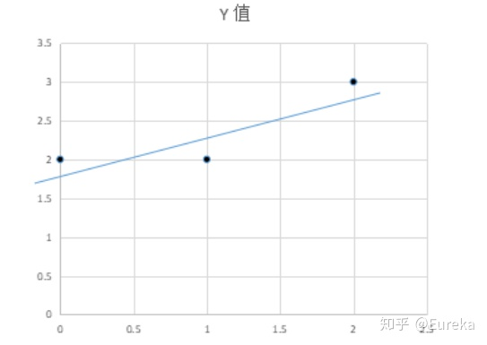

假设我们要找到一条直线 ![[公式]](https://www.zhihu.com/equation?tex=y%3Dkx%2Bb) 穿过这三个点（虽然不可能），为表述方便，用 ![[公式]](https://www.zhihu.com/equation?tex=x_1) 代替 ![[公式]](https://www.zhihu.com/equation?tex=k) ， ![[公式]](https://www.zhihu.com/equation?tex=x_2) 代替 ![[公式]](https://www.zhihu.com/equation?tex=b) ：

![[公式]](https://www.zhihu.com/equation?tex=%5Cleft%5C%7B%5Cbegin%7Bmatrix%7D1%5Ctimes+k+%2Bb%3D2%5C%5C+0%5Ctimes+k+%2Bb%3D2%5C%5C+2%5Ctimes+k+%2Bb%3D3%5Cend%7Bmatrix%7D%5Cright.%5CLeftrightarrow+%5Cleft%5C%7B%5Cbegin%7Bmatrix%7D1%5Ctimes+x_1+%2Bx_2%3D2%5C%5C+0%5Ctimes+x_1+%2Bx_2%3D2%5C%5C+2%5Ctimes+x_1+%2Bx_2%3D3%5Cend%7Bmatrix%7D%5Cright.%5CLeftrightarrow+%5Cbegin%7Bbmatrix%7D1+%261+%5C%5C+0+%261+%5C%5C+2+%261+%5Cend%7Bbmatrix%7D%5Cbegin%7Bbmatrix%7D+x_1%5C%5C+x_2%5Cend%7Bbmatrix%7D%3D%5Cbegin%7Bbmatrix%7D2%5C%5C+2%5C%5C+3%5Cend%7Bbmatrix%7D%5CLeftrightarrow+A%5Ctimes+x%3Db%5C%5C) 
进一步的：

![[公式]](https://www.zhihu.com/equation?tex=%5Cbegin%7Bbmatrix%7D1%5C%5C+0%5C%5C+2%5Cend%7Bbmatrix%7D%5Ctimes+x_1%2B%5Cbegin%7Bbmatrix%7D1%5C%5C+1%5C%5C+1+%5Cend%7Bbmatrix%7D%5Ctimes+x_2%3D%5Cbegin%7Bbmatrix%7D2%5C%5C2%5C%5C3%5Cend%7Bbmatrix%7D%5CLeftrightarrow+a_1%5Ctimes+x_1+%2B+a_2%5Ctimes+x_2%3Db%5C%5C) 
向量 ![[公式]](https://www.zhihu.com/equation?tex=b) 是向量 ![[公式]](https://www.zhihu.com/equation?tex=a_1) 与 ![[公式]](https://www.zhihu.com/equation?tex=a_2) 的线性表示。用图形表示：

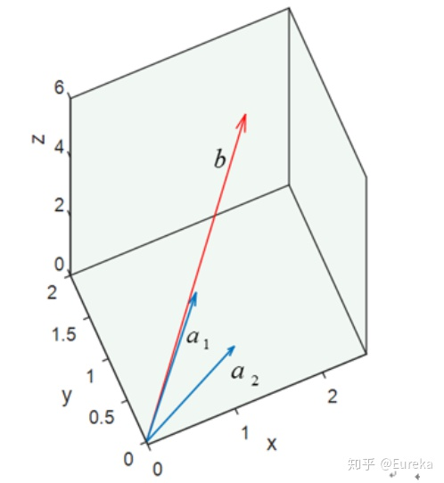

作图之后，我们惊讶的发现，无论我们怎样更改 ![[公式]](https://www.zhihu.com/equation?tex=a_1) 和 ![[公式]](https://www.zhihu.com/equation?tex=a_2) 的系数都不可能得到b，因为 ![[公式]](https://www.zhihu.com/equation?tex=a_1) 与 ![[公式]](https://www.zhihu.com/equation?tex=a_2) 的线性组合成的向量只能落在它们组成的子空间S里面，也就是说，向量 ![[公式]](https://www.zhihu.com/equation?tex=b) 不在平面 ![[公式]](https://www.zhihu.com/equation?tex=S) 上，虽然我们找不到这样的向量，但在 ![[公式]](https://www.zhihu.com/equation?tex=S) 上找一个比较接近的可以吧。很自然的想法就是将向量 ![[公式]](https://www.zhihu.com/equation?tex=b)投影在平面 ![[公式]](https://www.zhihu.com/equation?tex=S) 上，投影在 ![[公式]](https://www.zhihu.com/equation?tex=S) 上的向量 ![[公式]](https://www.zhihu.com/equation?tex=P) 就是 ![[公式]](https://www.zhihu.com/equation?tex=b) 的近似向量，并且方程 ![[公式]](https://www.zhihu.com/equation?tex=A%5Chat%7Bx%7D%3DP) $是有解的。

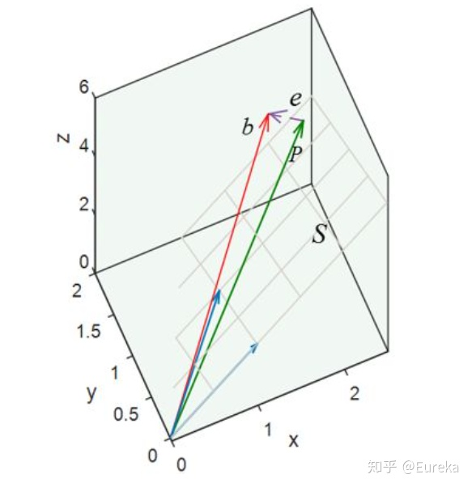

这个误差最小的时候就是 ![[公式]](https://www.zhihu.com/equation?tex=e) 正交与平面 ![[公式]](https://www.zhihu.com/equation?tex=S) ，也正交与 ![[公式]](https://www.zhihu.com/equation?tex=S) 中的向量 ![[公式]](https://www.zhihu.com/equation?tex=a_1%EF%BC%8Ca_2) （矩阵 ![[公式]](https://www.zhihu.com/equation?tex=A) 的列向量），即点乘为0， ![[公式]](https://www.zhihu.com/equation?tex=a_1%5ETe%3D0) ， ![[公式]](https://www.zhihu.com/equation?tex=a_2%5ETe%3D0) 矩阵表示：

![[公式]](https://www.zhihu.com/equation?tex=A%5ETe%3D0%5C%5C) 
![[公式]](https://www.zhihu.com/equation?tex=A%5ET%28b-A%5Chat%7Bx%7D%29%3D0%5C%5C) 
![[公式]](https://www.zhihu.com/equation?tex=A%5ETA%5Chat%7Bx%7D%3DA%5ETb%5C%5C) 
所以，我们可以得出，它的几何意义就是高维空间中的一个向量在低维子空间上的投影。

------

### **4：最小二乘法的局限性和适用场景**

从上面可以看出，最小二乘法适用简洁高效，比梯度下降这样的迭代法似乎方便很多。但是这里我们就聊聊最小二乘法的局限性。

首先，最小二乘法需要计算 ![[公式]](https://www.zhihu.com/equation?tex=X%5ETX) 的逆矩阵，有可能它的逆矩阵不存在，这样就没有办法直接用最小二乘法了，此时梯度下降法仍然可以使用。当然，我们可以通过对样本数据进行整理，去掉冗余特征。让 ![[公式]](https://www.zhihu.com/equation?tex=X%5ETX) 的行列式不为0，然后继续使用最小二乘法。

第二，当样本特征 ![[公式]](https://www.zhihu.com/equation?tex=n) 非常的大的时候，计算 ![[公式]](https://www.zhihu.com/equation?tex=X%5ETX) 的逆矩阵是一个非常耗时的工作（ ![[公式]](https://www.zhihu.com/equation?tex=n%5Ctimes+n) 的矩阵求逆），甚至不可行。此时以梯度下降为代表的迭代法仍然可以使用。那这个 ![[公式]](https://www.zhihu.com/equation?tex=n) 到底多大就不适合最小二乘法呢？如果你没有很多的分布式大数据计算资源，建议超过10000个特征就用迭代法吧。或者通过主成分分析降低特征的维度后再用最小二乘法。

第三，如果拟合函数不是线性的，这时无法使用最小二乘法，需要通过一些技巧转化为线性才能使用，此时梯度下降仍然可以用。

------

### **5： 案例python实现**

举例：我们用目标函数 ![[公式]](https://www.zhihu.com/equation?tex=y%3Dsin2%7B%5Cpi%7Dx) , 加上一个正太分布的噪音干扰，用多项式去拟合【《统计学习方法》例1.1 11页】

```python
import numpy as np
import scipy as sp
from scipy.optimize import leastsq
import matplotlib.pyplot as plt
%matplotlib inline
```


```python
# 目标函数
def real_func(x):
    return np.sin(2*np.pi*x)

# 多项式
# ps: numpy.poly1d([1,2,3])  生成  $1x^2+2x^1+3x^0$*
def fit_func(p, x):
    f = np.poly1d(p)
    return f(x)

# 残差
def residuals_func(p, x, y):
    ret = fit_func(p, x) - y
    return ret
```


```python
# 十个点
x = np.linspace(0, 1, 10)
x_points = np.linspace(0, 1, 1000)
# 加上正态分布噪音的目标函数的值
y_ = real_func(x)
y = [np.random.normal(0, 0.1)+y1 for y1 in y_]

def fitting(M=0):
    """
    n 为 多项式的次数
    """    
    # 随机初始化多项式参数
    p_init = np.random.rand(M+1)
    # 最小二乘法
    p_lsq = leastsq(residuals_func, p_init, args=(x, y))
    print('Fitting Parameters:', p_lsq[0])

    # 可视化
    plt.plot(x_points, real_func(x_points), label='real')
    plt.plot(x_points, fit_func(p_lsq[0], x_points), label='fitted curve')
    plt.plot(x, y, 'bo', label='noise')
    plt.legend()
    return p_lsq
```


```python
# M=0
p_lsq_0 = fitting(M=0)
```

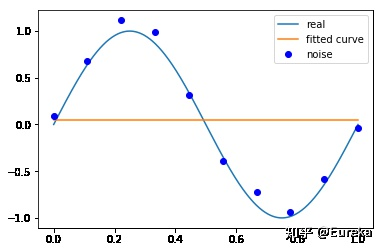

```python
# M=1
p_lsq_1 = fitting(M=1)
```

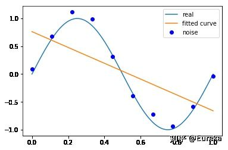

```python
# M=3
p_lsq_3 = fitting(M=3)
```


```python
# M=9
p_lsq_9 = fitting(M=9)
```

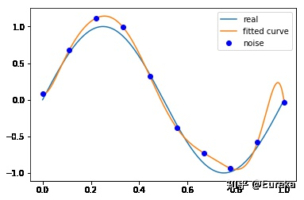

当M=9时，多项式曲线通过了每个数据点，但是造成了过拟合


**正则化**

结果显示过拟合， 引入正则化项(regularizer)，降低过拟合

![[公式]](https://www.zhihu.com/equation?tex=Q%28x%29%3D%5Csum_%7Bi%3D1%7D%5En%28h%28x_i%29-y_i%29%5E2%2B%5Clambda%7C%7Cw%7C%7C%5E2%5C%5C)

回归问题中，损失函数是平方损失，正则化可以是参数向量的L2范数,也可以是L1范数。

> L1: regularization*abs(p)
> L2: 0.5 * regularization * np.square(p)

```python
regularization = 0.0001

def residuals_func_regularization(p, x, y):
    ret = fit_func(p, x) - y
    ret = np.append(ret, np.sqrt(0.5*regularization*np.square(p))) # L2范数作为正则化项
    return ret
```


```python
# 最小二乘法,加正则化项
p_init = np.random.rand(9+1)
p_lsq_regularization = leastsq(residuals_func_regularization, p_init, args=(x, y))
```


```python
plt.plot(x_points, real_func(x_points), label='real')
plt.plot(x_points, fit_func(p_lsq_9[0], x_points), label='fitted curve')
plt.plot(x_points, fit_func(p_lsq_regularization[0], x_points), label='regularization')
plt.plot(x, y, 'bo', label='noise')
plt.legend()
```

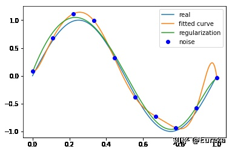

