# 神经网络的诞生

⌚️: 2021年4月1日

📚参考

- [1](https://zhuanlan.zhihu.com/p/51875202)

---

这是一个静态模型到动态模型的发展过程。 在开始描述前， 需要说明一点， 一个模型， 有了结构， 基本成为一个静态模型， 但是一个静态模型要变成动态模型， 背后要强大的转换学习机制。

举个计算机的例子， 大多人都知道第一台通用计算机， 叫埃尼阿克ENIAC。
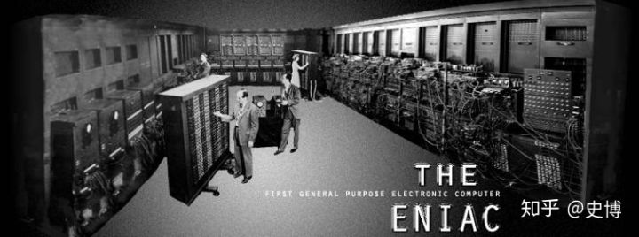   
但是硬件意义上的第一台电子管计算机，并不是ENIAC，在他之前有个叫ABC的计算机， 就已经是硬件上的电子管计算机了。
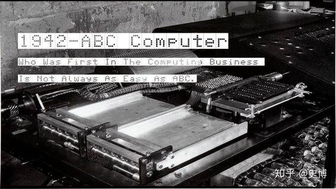   
那么差在哪里？主要是可不可以编程， 而可以编程就是一个动态模型。 这是这种差异， 使得冯诺依曼和图灵在发明计算机上享有了声誉。 而不是单单硬件的发明。

如果你能体会到静态模型和动态模型的差异， 那么就可以更好的读懂神经网络的诞生了。

## 1、谁发明了第一个神经网络的静态模型？

第一个发明神经网络模型的两个人叫**McClloch**和**Pitts**， 这两个人受到**罗素**与控制论创始人**维纳**的深刻影响，Pitts勇敢的给罗素写了他著作的读后感， 然后受罗素邀请，才从流浪汉变成牛人。McClloch直接就是维纳实验室员工。 背后故事大把大把，就不展开了。
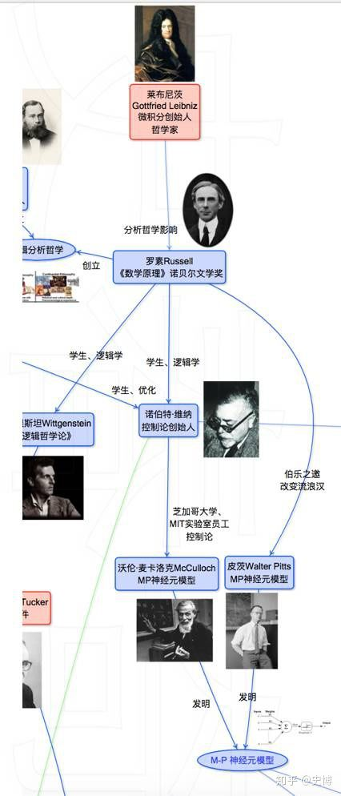   
所以大家看到控制论对人工智能的产生有着深刻影响。其中之一，就是**McCarthy**怕受到**维纳**控制论的过强影响， 而命名了人工智能。命名很重要。 冯诺依曼就为香农命名了信息熵。 他告诉香农说，熵， 信息领域懂的人不多，可进可退。 看来McCarthy也深懂此道。 人工智能，控制论领域的人懂得不多， 可进可退。

其实**维纳**也来到中国过， 对中国人工智能发展也有影响。 **华罗庚**先生早年就有受到维纳的培训，在维纳在中国呆了两年期间， 培训了很多信号处理，最优化方面内容。 后来华先生，关注美国计算数学发展，创立计算所。 而计算所是国内最早研究人工智能的研究所之一。

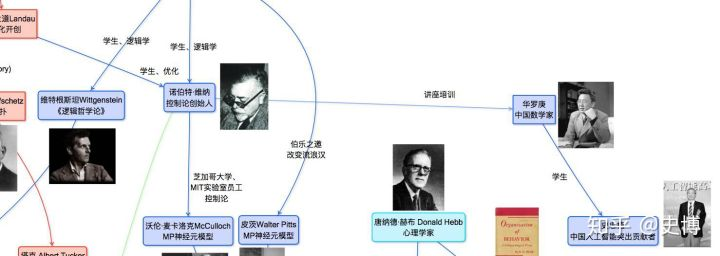   

## 2、谁发明了第一神经网络的动态模型？

但是MP模型是一个静态模型， 就是你手动变化收入， 输出信号会变化。 没有学习能力。 刚好**Hebb**的心理学家发明了Hebb学习规则。 然后有个叫**Rosenblatt**的年轻人，就把这两个模型组合起来， 建立实验， 生成了感知机模型。

所以你从图上可以看到感知机模型和MP模型的差异，就是有个反向误差学习。 这一下不得了。 开启了神经网络的大春天。 全世界在庆祝模拟了人脑， 拼命砸钱。 有一个叫Widrow的年轻人，也用了一个学习规则， 叫Delta学习和MP模型结合， 搞出了ADALINE的电子线路回归模型。
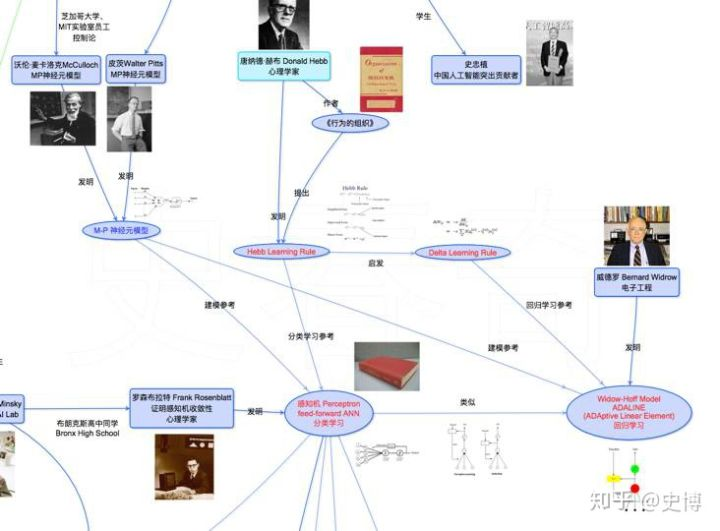   
大家看到Delta学习就是回归学习， 而Hebb 学习就是分类学习。 由于是线性的， 这里的学习用了最小二乘法。 一下子又回到高斯去了。

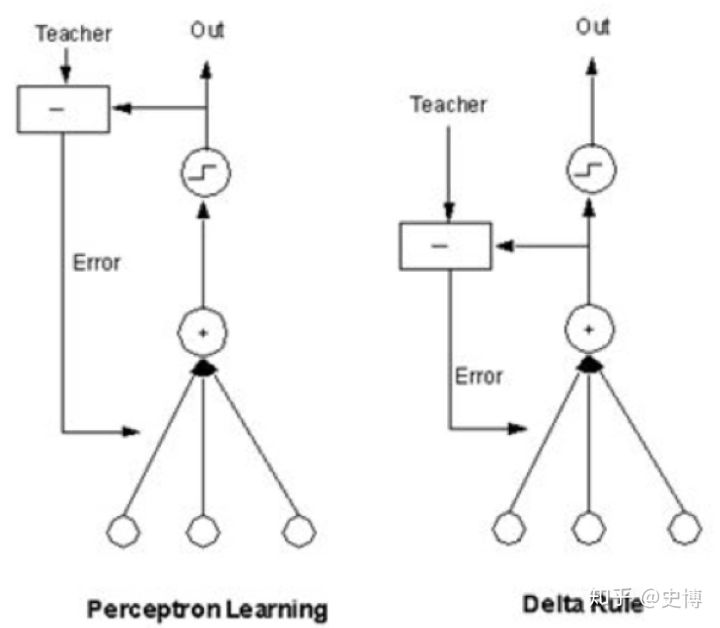   
这个Widrow工作的影响巨大， 尤其是感知机在人工智能领域被打入冷宫后，一波搞电子电路，物理学方向的人坚持在做神经网络。 到了一定程度， 又回到了人工智能领域。而Widrow的工作，就是开启物理领域研究神经网络的那个人。

## 3、谁把感知机打入冷宫？

感知机太火了， Rossenblatt的高中学长Minsky也研究了一把， 发现了它的问题， 于是出了书。 书上写感知机言过其实了。 这个Minsky就是那个发起人功智能的大佬。 一下子， 神经网络研究进入冷宫。 后来随然有个叫Werbos的人研究了反向传播算法。   

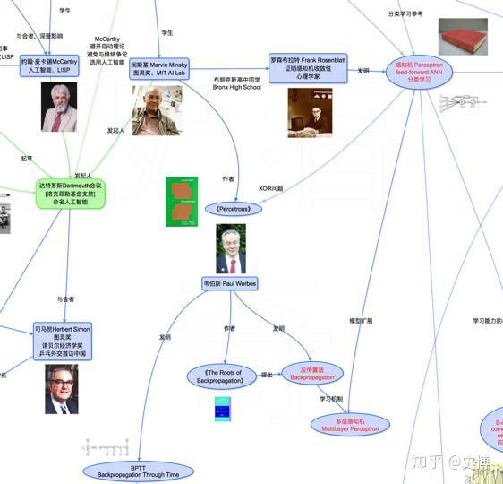   

这个Werbos还写了书，但是影响力还是不够，冷宫之冷，MLP多层感知机发展缓慢。 另外Werbos，他还发明了BPTT算法，就会涉及到搞物理的人搞的神经网络模型了。

## 4、CNN前生

产生了MP静态模型， 然后Hebb学习后有了Perceptron动态模型， 然后XOR问题被打入冷宫， 再后来， 有了BP算法，产生了多层感知机MLP。 于是发展潜行。 但是这时候， 神经网络已经冷下来了， 多层感知机也没有火起来。 但是却深刻影响着后来的网络。

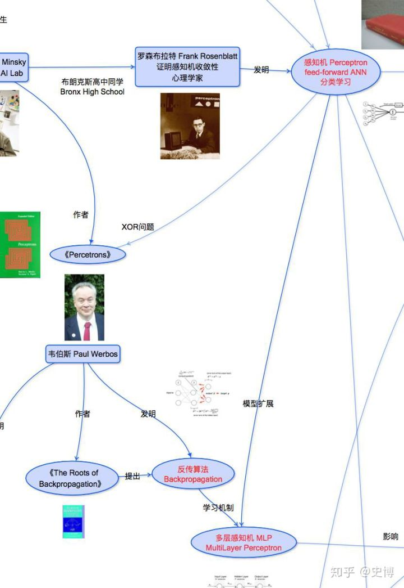   
这其中就有现在深度学习很火的网络模型的前生。 现在,深度学习神经网络里面最火的里面有二个最大的类别CNN卷积神经网络， 和RNN递归神经网络。 其中， CNN的前生叫Neocognitron， 而RNN的前生叫Elman Network或者Simple Recurrent Network SRN。 这次先说明下CNN前生， Neocognitron是如何做到的？

## 5、Neocognitron的诞生

来自日本教授福岛邦彦， 受到感知机的影响， 走上了神经网络的道路。 但是一路走来并不容易。 正是这个Fukushima教授， 发明了Neocognitron网络。 这个网络的发明， 首先，是受到当时视觉神经系统的Hubel-Wiesel模型的影响。

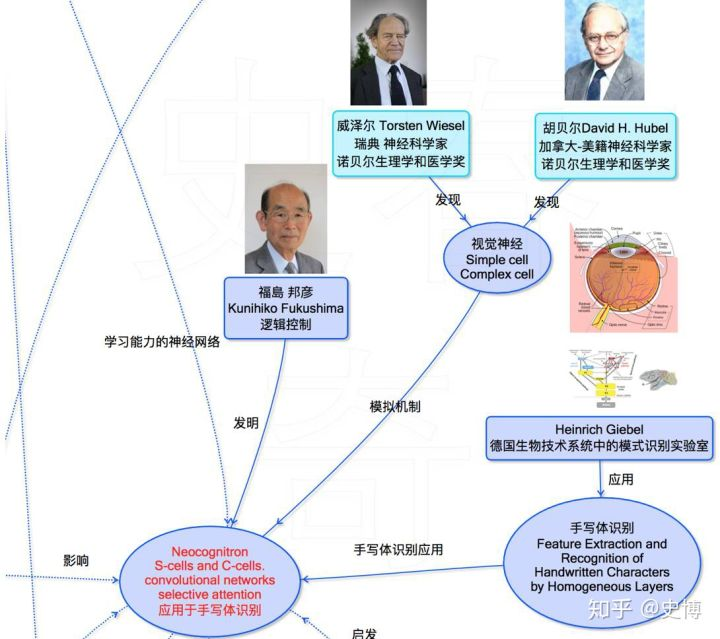   
在Hubel-Wiesel模型里面， 通过动物的视觉刺激， 来观察了脑部接受的电信号来提出假设模型。

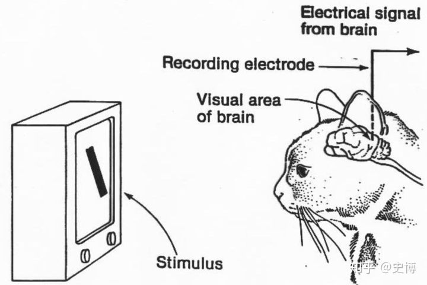   

这是一个特征的分层模型， 从简单单元Simple Cell SC到复杂单元Complex Cell CC，然后到超级复杂单元，并且通过交叉映射来实现。

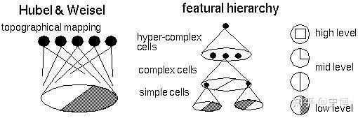   
而福岛提出了类似的神经网络模型用来做模式识别的进程。先识别边， 然后识别特征， 然后模式识别。 这不就是我们介绍深度学习里面用的最多的东东？

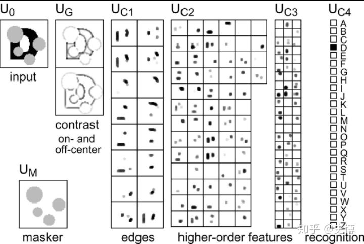   
并且为此构建了网络模型， 是个多层网络模型， 并且命名了简单单元和复杂单元的映射， 作为每个层次识别的层结构。

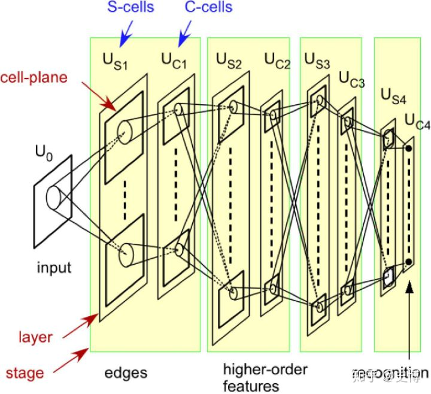   
并且， 还采用了手写数字识别的实验来验证模型！ 如果你了解CNN的话， 这是不是就是一个CNN的结构了？那么它受到哪些影响？

## 6、多层模型的参考

Neocognitron模型是个多层模型， 这个多层模型就是参考了MLP的多层模型的。 正是福岛意识到多层模型的重要性， 所以才有了Neocognitron的成果！  
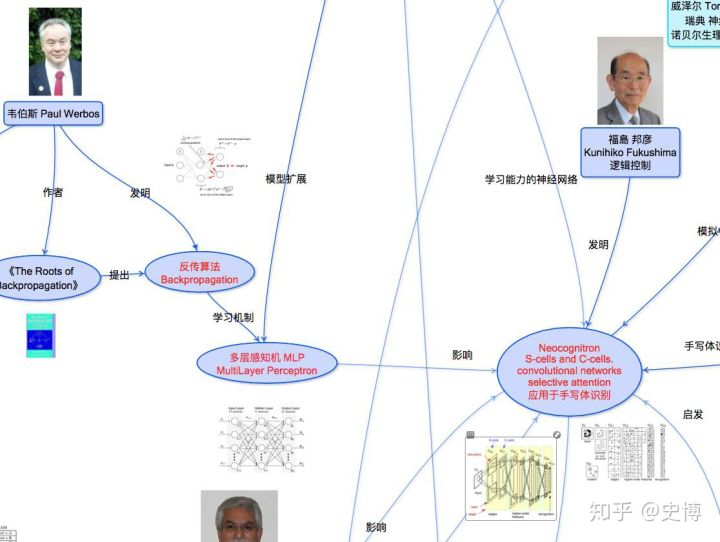   

## 7、为什么采用手写体？

其实手写体的应用是德国的Heinrich Giebel最早应用的， 也正是因为Giebel应用里面他提出了特征提取和识别和神经网络的关系，而受到福岛的关注。   
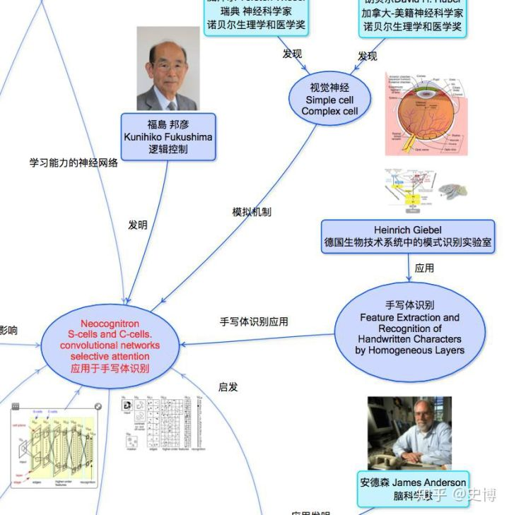 

## 8.如何做到交叉映射的？

其实这个不是单纯的从生物学直接跳到物理实现的， 而是福岛之前受到两个大的方面的影响， 一个方面是来自Kohonen的关于associate memory发明的熏陶。 学过神经网络的知道， Kohonen最经典的是提出过SOM自组织映射网络。 其实这也是他对associative memory理论深入研究后的成果。 Kohonen早期一直研究发表， 并且出书了Content-Addressable Momories CAM， 这就是一种associate memory。 其实，这是对Estrin的CAM模型的一种带学习的扩展。 而这个Estrin就是冯诺依曼工作小组的员工， 对于内容寻址方面提出了CAM模型。 但是如何自学习这个CAM模型呢？Kohonen做了很多早期的研究和发表， 并且影响力蛮大的。

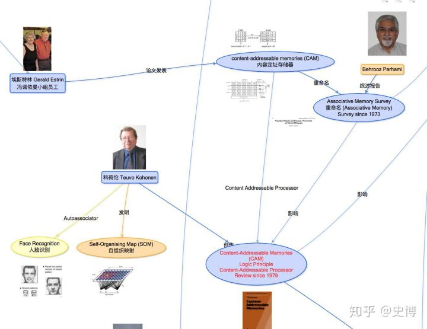   
另外一个方面，就是有个叫Anderson的脑科学家， 发明了Cross Correlation的方法， 提出脑功能模型， 也对Neocognitron产生了影响。 而这个Cross Correlation几乎就是卷积的另外一种表达。   
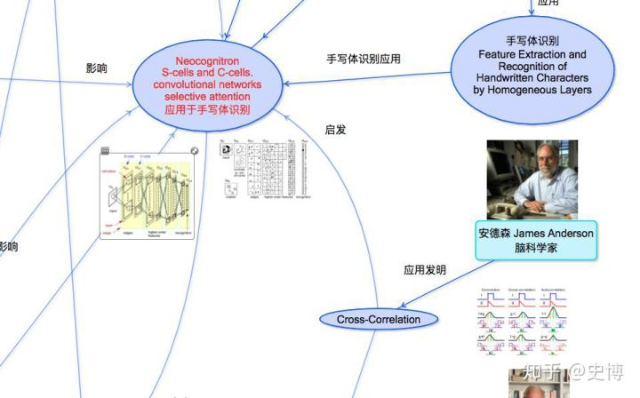   
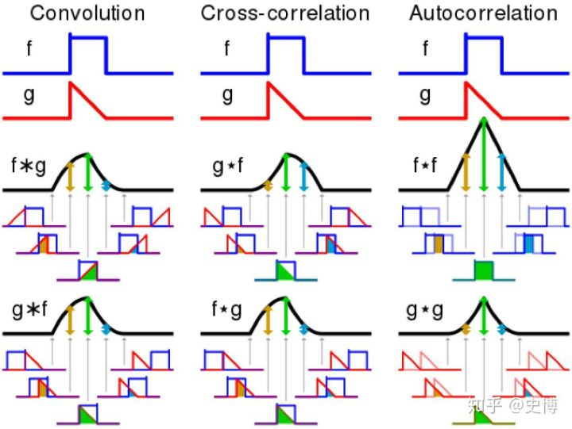    
并且， Neocognitron的工作影响力巨大， 除了作为CNN的前生， 还对Malsburg的脑功能的相关性理论，和后面记忆模型影响深远 。    
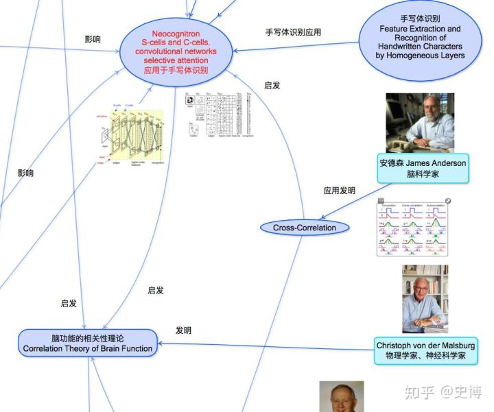    

## 9.RNN前生

这里描述RNN的前生, 叫SRN，简单递归网络的诞生， 这个Simple Recurrent Network又名叫Elman Network。 在前面我们谈到Kohonen的CAM理论，是源于对冯诺依曼工作小组的Estrin的寻址内存的模型扩展而来的。

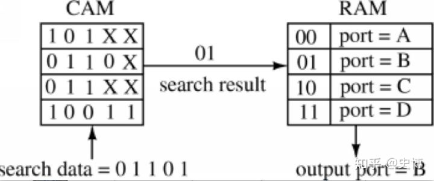   
而Kohonen的这个CAM理论影响超级大， 不仅仅影响了Neocognitron福岛， 还影响了另外个人， 这个人对后来神经网络恢复元气作用巨大。 他就是物理学家Hopfield。 他提出了Hopfield模型， 而SRN或者Elman网络几乎就是对Hopfield网络的一个变形。    
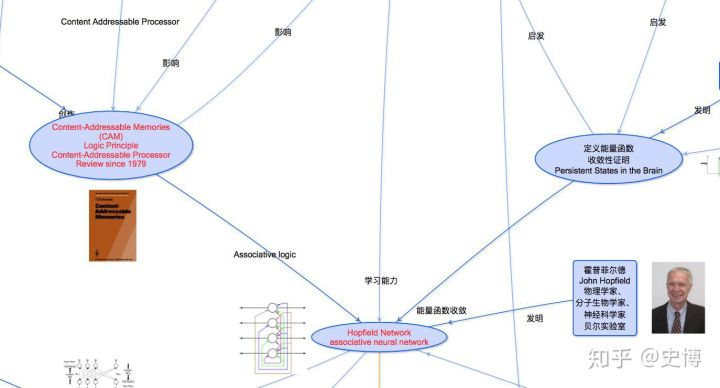   

## 10.Elman Network是Hopfield网络的变形

SRN其实就是给Hopfield网络加了一个输入层和输出层， 把整个Hopfield网络变成了隐藏层。 这种变化其实也可以说是受到MLP三层模型的影响。    
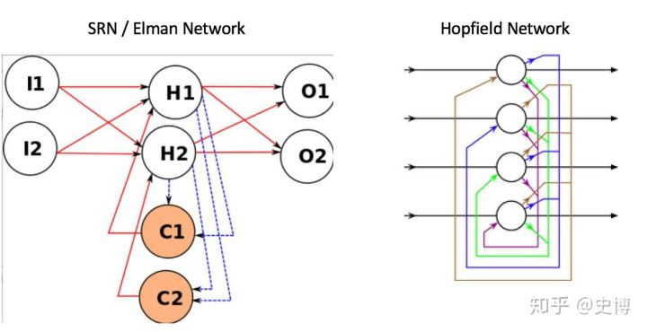   

## 11.Hopfiled网络有没有其它知名变形

其实， 除了SRN模型， Hopfield网络还有另外一个变种叫BAM （参考 ”神经网络之双向关联记忆网络(BAM)“）BAM相当于把Hopfield网络进行了一次展开， 然后一层称为输入， 另外一层称为输出。 无论是SRN还是BAM， 都继承了Hopfield关于能量函数， 和收敛性证明方面的结论。 而这个BAM某种意义上是深度中RBM模块的前生BM boltzmann machine的前生。
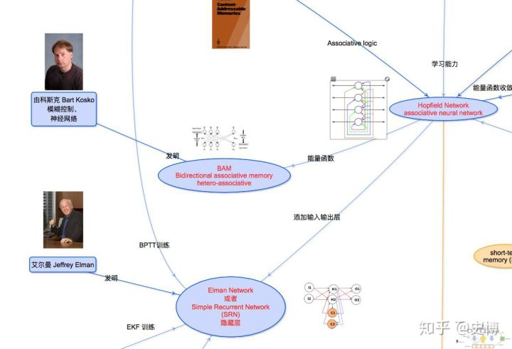   

## 12.Hopfield网络是如何炼成的？

Hopfield网络的横空出世得益于三大方面， 首先，受到了Kohonen的CAM的启发， 着眼于相关性的方向的神经网络。 其次， 采用了另外一个物理生物学家Little定义的能量函数。 并且Little还根据李雅普诺夫的不动点理论， 证明了收敛性。   
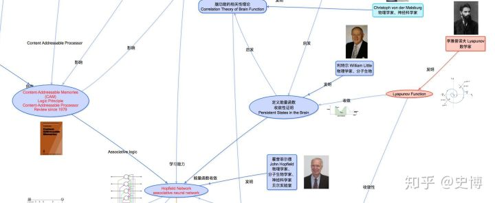   
再次，就是吸收了物理学家Widow的ADALINE模型的学习机制。 这样， 有了三合一， Hopfield网络理论就诞生了。    
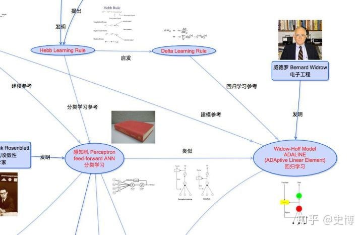   

## 13.Hopfield网络的影响

其实后来有个叫Grossberg的神经科学家， 对Hopfield的工作和福岛的工作进行了深刻讨论， 提出了记忆模型 和 ART模型自回声网络。类似记忆模型的工作对后来RNN的变种LSTM的影响很大。 Grossberg本人对Sigmoid函数的鼓吹， 也对后来BP算法的流行有深刻影响。   
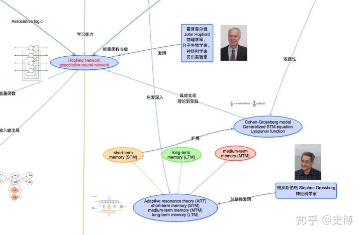   

## 14.SRN的三大学习算法

除了SRN网络结构的完善， 学习能力也不能落下， 三大学习算法BPTT，EKF和RTRL训练，也多在受到Hopfield网络模型成功影响力下， 发明出来了。 而后来深度学习里面LSTM的发明， 也是一个硕士对这三个算法的深入理解， 总结缺点后的突破。 以后深度学习的部分会讲到。

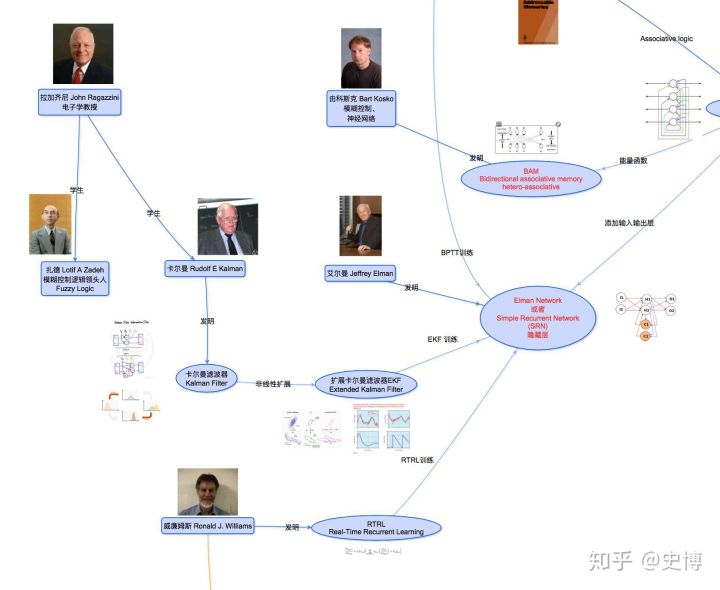   
其实BPTT就是最早发明BP的那个Werbos发明的。 而RTRL也和以后再发明应用BP算法， 并且引起轰动的Rumelhart有关系。 而Rumelhart是连接主义的代表人物， 以后也会谈谈他。    

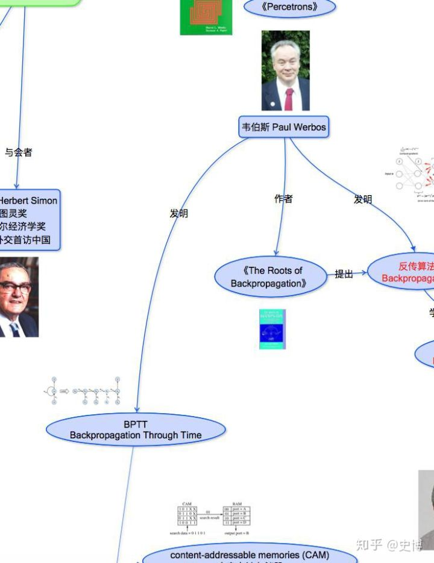    
透过Hopfield网络的成功和变形， SRN横空出世， 伴随着神经网络记忆学习理论的总结， 和三大学习算法的出现。 RNN的前生就这么铺垫好了。    

## 15.连接主义的诞生

认知科学的大佬们开始注意神经网络，从而开启了连接主义。

Twitter上有个图片对连接主义和符号主义很形象的刻画，如下， 看上去符号主义站稳了脚跟， 但是链接主义开始挥舞起拳头。      
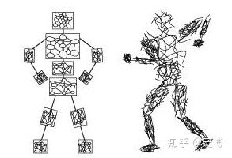   
以基于规则的系统为代表的符号主义， 正向以神经网络，统计学习为代表的链接主义转变， 同时以符号表示的表象主义向嵌入、进化、生成论方向发展。   
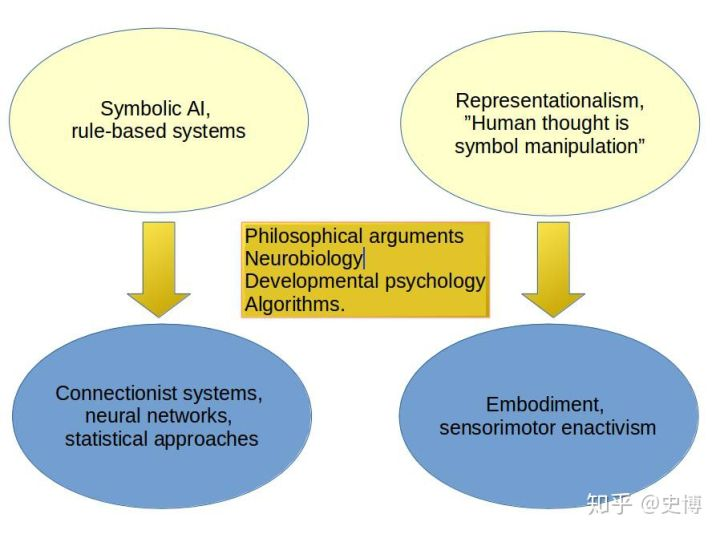    
当然， 讨论起这些主义，本身就是已经被认知科学影响了。由此可见认知科学发展所带来的变化。   
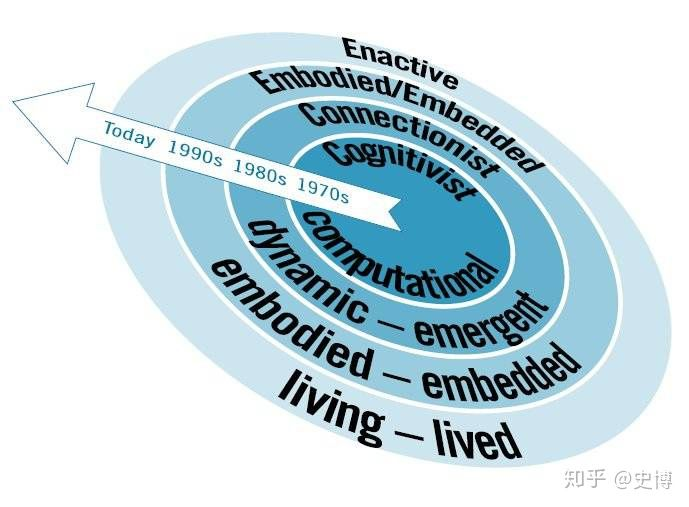   
连接主义的代表是Rumelhart， 他和MIT的教授McClelland， 两人搞了一个PDP的杂志， 并行分布处理的杂志。 虽然是并行分布的杂志， 但却是连接主义的桥头堡。 Rumelhart很不简单， 他是美国排名超前的心理学大师Estes的学生。 他所在的实验室CBC实验室更不简单，算得上是认知主义的一个源头点。   
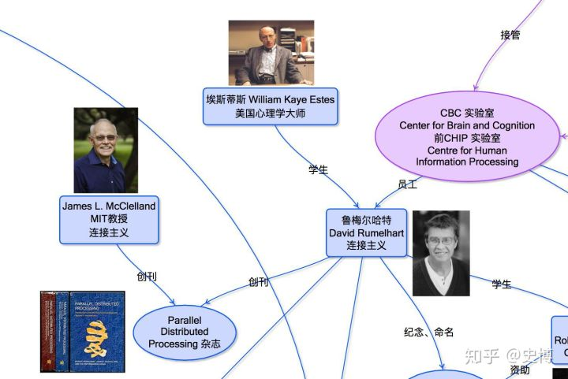   
说到CBC实验室， 首先它的创立者是美国另外一个排名很前的心理学家Mandler。 接着，它后来的一把手是因发现DNA双螺旋结构而获得诺贝尔奖的Crick。 Crick受到了Hopfield网络的影响，为了这个实验室， 甚至在Natural撰文鼓吹神经网络。 当然因DNA双螺旋结构获得诺贝尔奖的Watson也不得了， Watson的老板Luria也是诺贝尔获得者，研究噬菌体。

辅助Crick的是认知学的另外一个大佬Norman， Norman后来开创了User-Centered Design， 他做到苹果的高级技术部门的VP， 对苹果公司的发展影响巨大。   
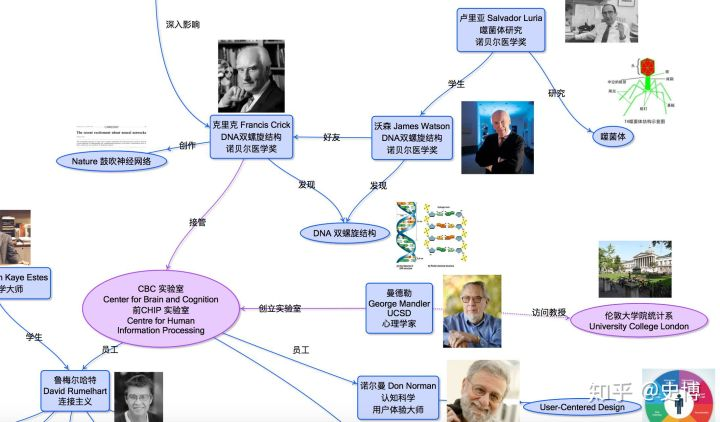   
如果你对Rumelhart还是不熟悉， 那么我再说几点， 他是机器学习大牛Jordan的导师（参考"乔丹上海行")。另外，他是领头再创造BP算法的三个人的领袖。 另外一个是CBC实验室的Hinton，还有一个是发明RTRL算法的Williams。 某种意义上正是Rumelhart对BP算法的新的总结发表。 才让连接主义开始重新成为人工智能的主流。

Rumelhart 培养的学生都很赞， 他另外一个学生Glushko， 成立了好几个XML相关的公司。卖了几个后有钱了便和老婆成立了个基金会。 这个基金会在Rumelhart去世后建立了Rumelhart 大奖来奖励对连接主义有贡献的人。 第一次就奖励给了Hinton   
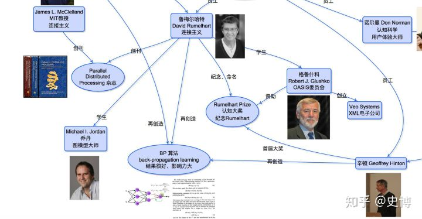   
我们知道Hinton本人就是认知科学家Christopher的学生。 所以总得来说，连接主义兴起，是受到了认知科学， 生物学发展， Hopfield网络的影响下的一次重新冲击。 这样，以Rumelhart为代表的连接主义，重新在人工智能的舞台上绽放光芒！当然离不开Crick的英明的领导！   

## 16.深度神经网络的诞生

以心理学大师Estes的学生，Rumelhart为代表的连接主义的早期工作慢慢成为基础， 以认知科学大佬Christopher的学生Hinton为代表的深度学习登上历史舞台。 深度学习的影响力不是仅仅通过文章来传播的！而是掀起了应用的狂潮~ 因为跨越式效果提示。 前面讲过Rumelhart重新发表了BP backpropagation算法， 从此掀起了连接主义的新时代。 Hinton是其中的重要参与者。    
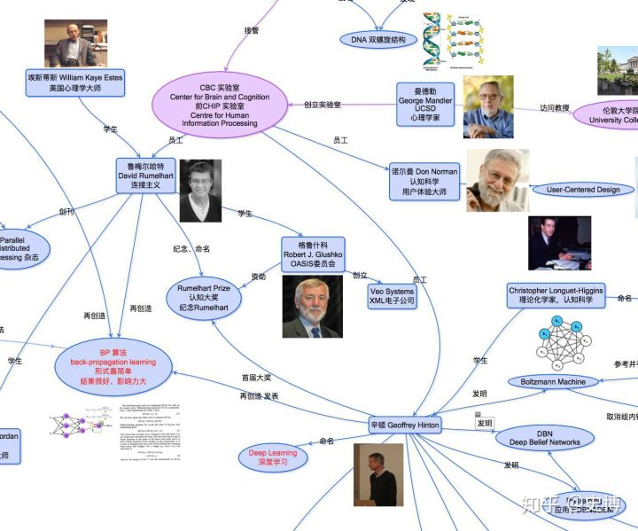    

## 17.为什么是Rumelhart发明的BP算法？

早早的BP算法被Werbos发明了，多层感知机MLP就可用了， 甚至在Rumelhart之前， Hinton的学生Yann Lecun也号称重新发明了BP算法， 为啥不是他们？

最重要的是Rumelhart受到Grossberg的影响（这个Grossberg就是ART的发明人， 他对Hopfield网络时代的成果进行了广泛的总结）， 默认激活函数就应该是sigmoid函数。 如果默认是Sigmoid函数之后， 利用Sigmoid函数导数的良好性质。 Rumelhart的BP算法的形式极其极其的简单！ 易经告诉我们， 简而易从， 易从则有功， 有功乃大！ 这就是为什么是Rumelhart！   
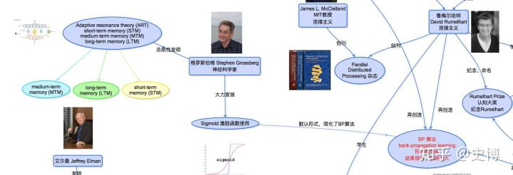   
Sigmoid函数就是标准logistic函数， 它的导数的形式真是简单。   
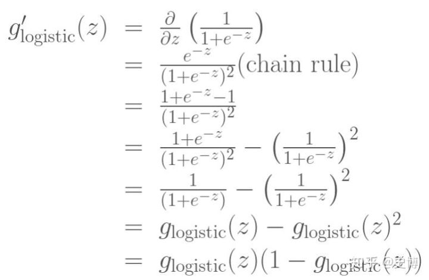    
再回到Lecun的贡献， Lecun给出了BP算法详细的梯度下降的分析， 所以Lecun这种对性能追求的态度也是一种很大的贡献。

再回到Werbos的贡献，他给出了导数递归求解的形式，但是相对比较复杂， 也没有相关性能分析解释， 只是一堆自己很理解的公式。

这样， 我们开始回顾BP盛行后带来什么问题导致了深度学习的爆发？

前面讲过在Hopfield网络发展出来的Elman网络就是SRN，简单递归网络。 出现了BPTT，EKF和RTRL三大算法。 但是实际应用的效果却非常不好！有个做语音识别的叫Schmidhuber的家伙，带着他的硕士学生Hchreiter，就开始认知的生成图片分析到底什么问题！结果这个叫Hchreiter的硕士很给力， 画除了各种效果图， 在硕士论文中把问题写清楚了， 是梯度消失或者爆炸。
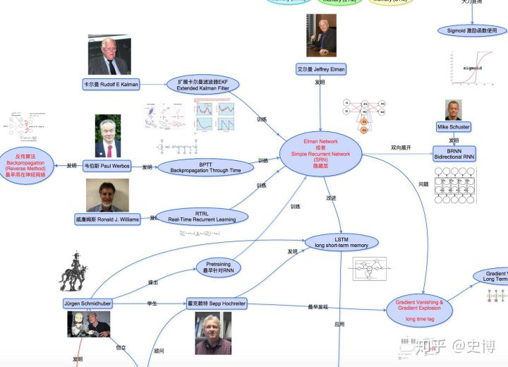   
前面不是讲到新的Rumelhart的BP算法时代， 默认的激活函数是Sigmoid函数， 这样就会连续多次求导之后乘积就会带来要么指数消失，要么指数爆炸的情况。 为了解决这个问题， 这个硕士生Hchreiter很给力， 利用记忆学习的思路， 搞出了LSTM的模型， 一应用，效果很好！从此Schmidhuber他开启了各种应用。 后来还开了公司Nnaisense搞自动驾驶，聘请了他的学生来做顾问。 另外他的类似堂吉柯德的自画像和他按照Godel的思想搞得Godel Machine也很有意思。并且他还最早提出了Pretraining的思想， 不过是应用到RNN上面的 。
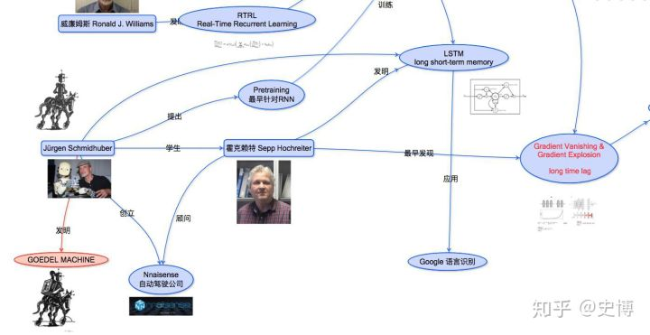   
虽然Hochreiter发现并且发表了这个梯度消失的问题， 但是却是德文的， 影响力大打折扣。 并且也没有太混连接主义的圈子。 真正开启影响的是Bengio。 Bengio是利用神经网络做自然语言处理的大师， 他在利用RNN做Long Term Dependency的问题也发现了梯度消失了。 而这个Bengio就是Rumerhart学生Jordan的博士后。 这一下子就接触了连接主义的核心圈子了。 那时候， 这些核心圈的人Jordan还有Hinton在做贝叶斯网络图模型的（参考"给能量以自由吧！“ 系列）。   
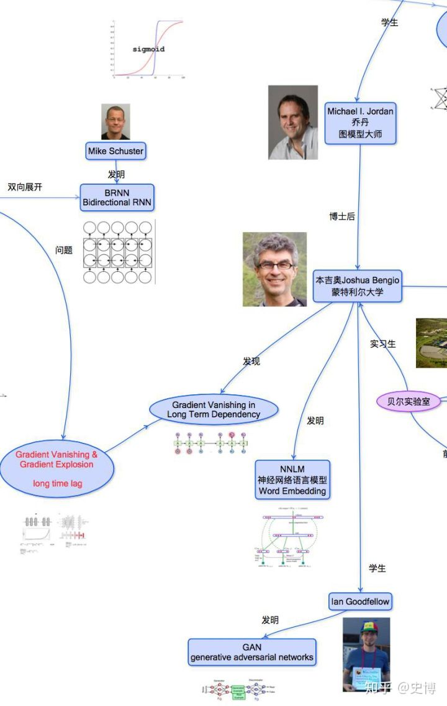    
但是Hinton很快就扬弃了图模型， 开始转到神经网络，他基于Hopfield网络的一个变形叫BAM模型， 引入了Boltzmann概率分布函数（参考"信息熵的由来")， 变成了概率模型。 并且提出了一系列的训练方法。 Hinton非常实干， 他搞东西，不局限在发表，他会发展很多技术去改进优化。 另外一个认知科学家家叫Smolensky的简化了Hinton的Boltzmann Machine模型， 生成了Restricted Boltzmann模型RBM模型。 刚好Hinton之前搞过基于Sigmoid的递归模型叫DBN Deep Belief Network， Hinton把这两个一嫁接， 搞错了DBM模型。 然后又利用了Pretrain训练， 就有了这个模型完整的学习， 他一个学生在微软实习的时候， 发现在语音识别方面效果很好。 Hinton就把基于这种复杂模型的学习命名为深度学习， 从此开启了深度学习的时代。    

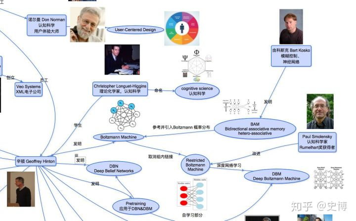   
通过对以Hopfield网络时代，神经网络学习效果不好的情况的分析， 找到了梯度消失的问题，同时Hinton发现效果好的复杂模型， 定义了深度学习。

前面提到Hinton和微软语言识别小组的合作，让他意识到深度学习的重要应用意义，这个合作是他的学生通过实习带来的。 而另外， 深度学习的爆发性效应， 也是他的两个学生Alex和IIya带来的。 他们参加了 ImageNet Large Scale Visual Recognition Competition (ILSVRC) 2012图像识别竞赛， 大获全胜， 并且远超过第二名。 他们提出AlexNet网络， 这个网络是基于他们师兄Lecun的LeNet 5层模型， 加上他们老板Hinton基于梯度消失问题研究的RELU激活函数， 和Dropout正则化修正过拟合的方法。 当然， 他们自己为了加速运算，还用了GPU来做实验， 结果效果意外的好。 一下子引起全球轰动。

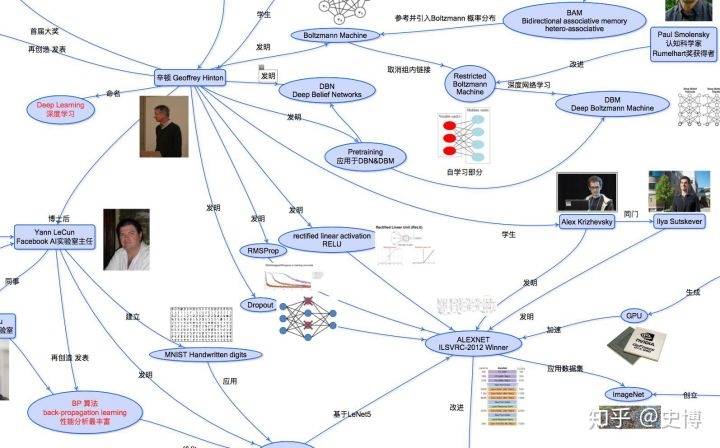   
那么这个AlexNet是怎么做到的呢？为什么LeNet没有做到呢？首先说一下Lecun， 他受到导师Hinton的影响一直是神经网络的坚实研究者，他和Bengio还有导师Hinton是深度学习三巨头。 （参考"燕乐存上海行"）   
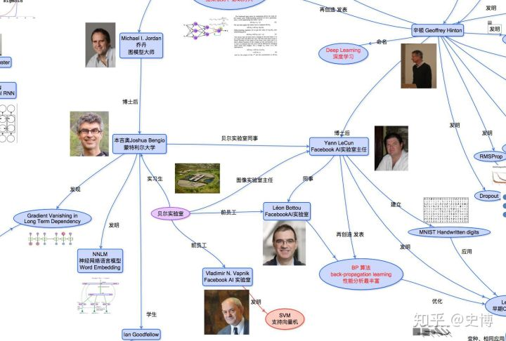   

Lecun继承了Fukushima的Neognitron卷积模型， 并且设计出了5层， 并应用到手写体的识别上面。 但是效果一直难以超过他同事研究的SVM。 虽然他和Bengio一起公事了很多图像方面的工作，但他并没有意识到梯度消失的影响。

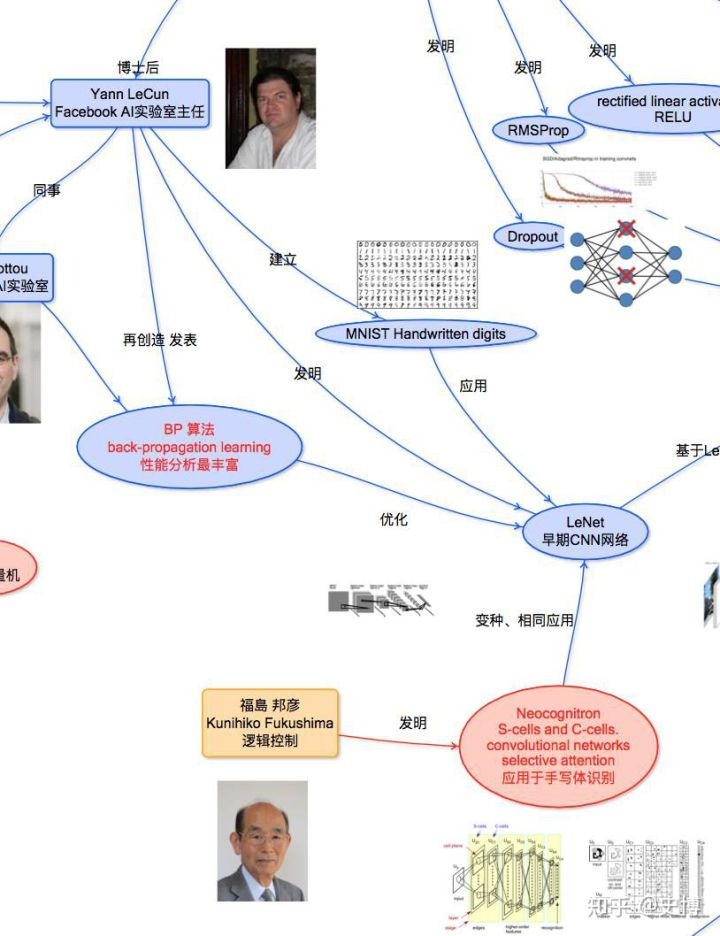   
但是Hinton发明的一系列深度学习的技巧集成到LeNet之后， 并且利用了GPU加速就带来了意想不到的效果。 从此开启了深度学习的刷新模式。 以后在每年的ILSVRC，这个基于李飞飞的ImageNet数据集的图像识别任务一直刷新到超越人！当然从此GPU也成了深度学习的标配。 让Nvidia的股价飙升！   
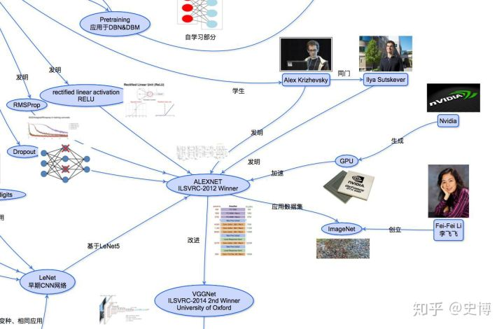   
2012至2014， 深度网络变得更加强大。Google设计出模块化工作， 做成基于Inception模块的网中网结构， 再后来ResNet研发的残差模块的深栈结构刷新了人们对深度学习的认知。 最近Google又提出Multimodel来统一语音的LSTM，图像的CNN的应用。

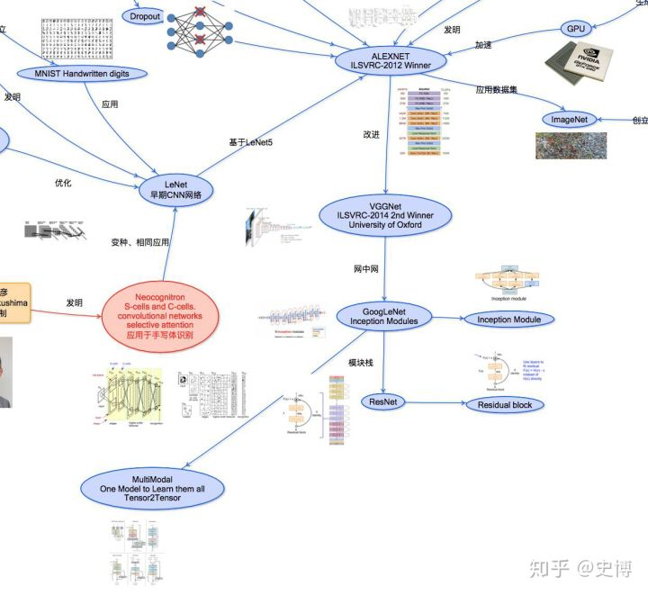   
至此， 语音识别的LSTM，图像识别的CNN，还有自然语言处理的NNLM模型都发力了。 深度学习在非结构化数据方面大放异彩！   
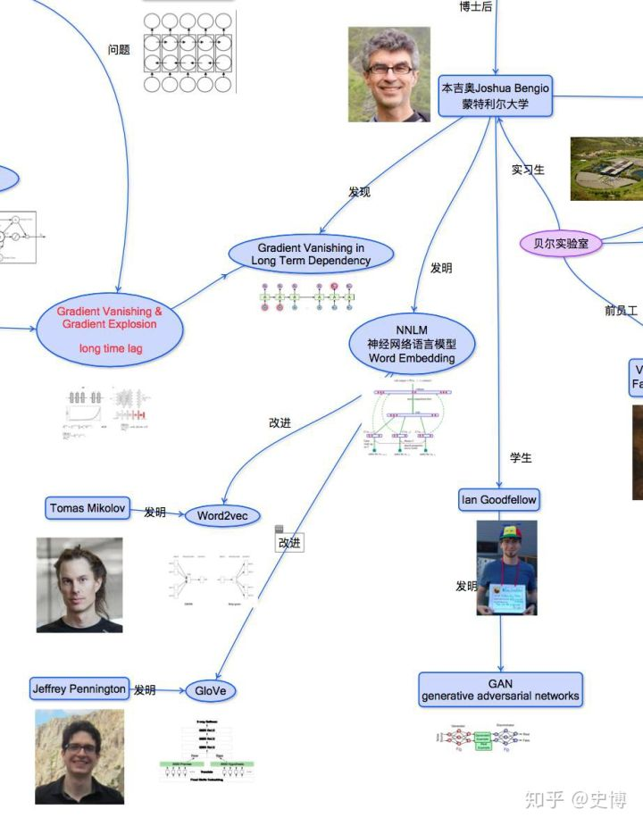   

## 小结

有了深度神经， 深度学习在非结构化数据学习（图像，音频，视频， 文本）方面的大放异彩！   
