# BP算法讲解

⌚️: 2021年4月1日

📚参考

- [神经网络之BP算法(图说神经网络+BP算法理论推导+例子运用+代码)](https://blog.csdn.net/weixin_39441762/article/details/80446692)

---

## 1.    5字诀搞定BP反向传播算法推导

> [哔哩哔哩视频](https://www.bilibili.com/video/BV13J41157Wq?p=4)
>
> 鸡鸡踢连长

### 1.1 计算图

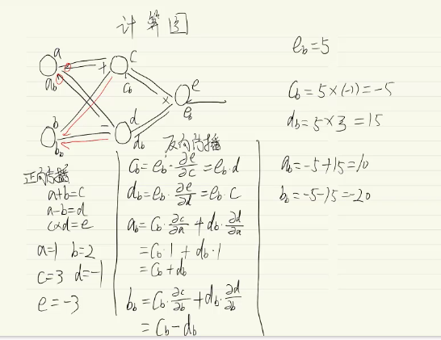

### 1.2 激活函数

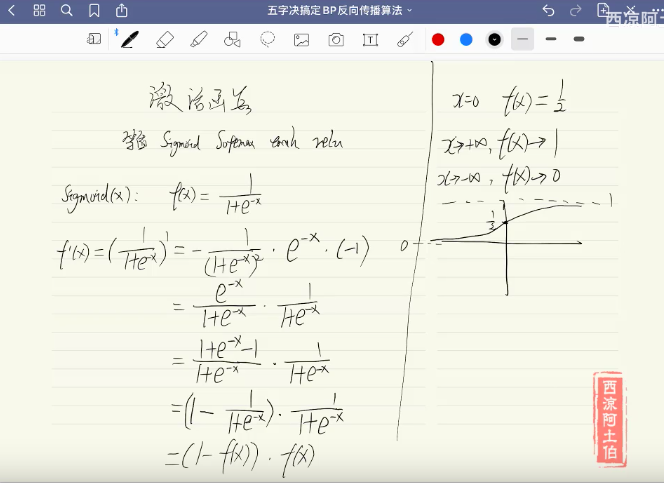

### 1.3 梯度求导

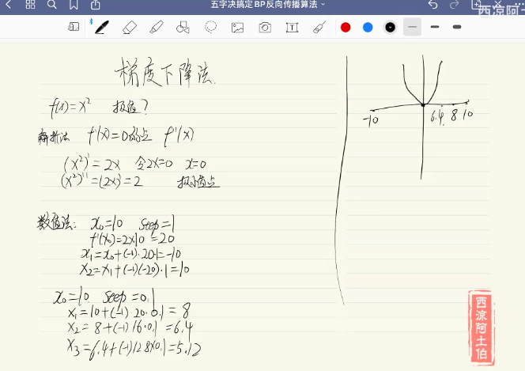

### 1.4 链式求导

略，见视频

### 1.5 张量求导

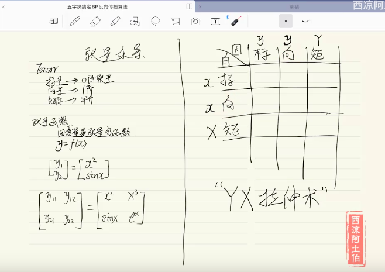

“YX拉伸术”是Y垂直拉开，X水平拉开。


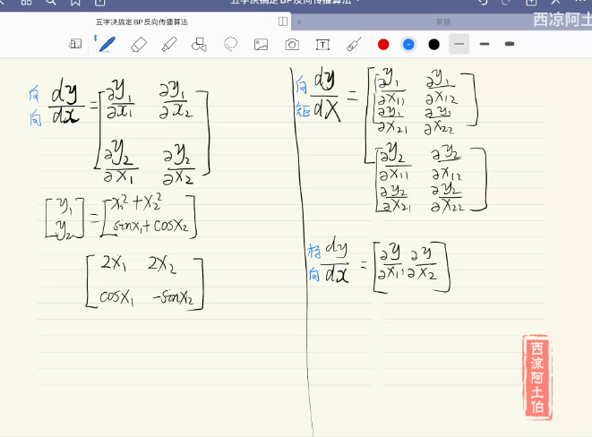

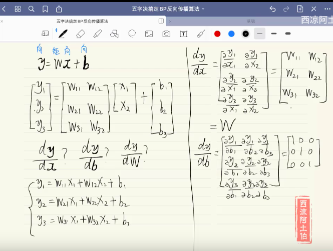

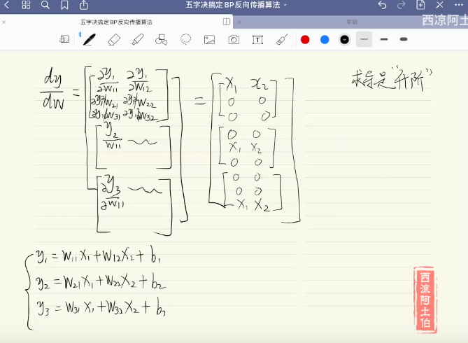

"求导升阶"，1阶张量对2阶矩阵求导，结果是3阶张量。

### 1.6 BP推导

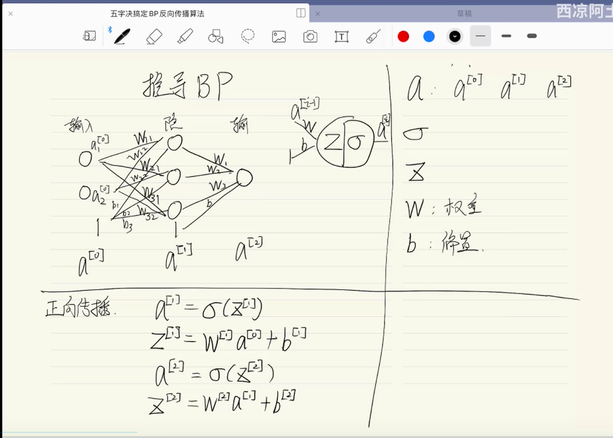

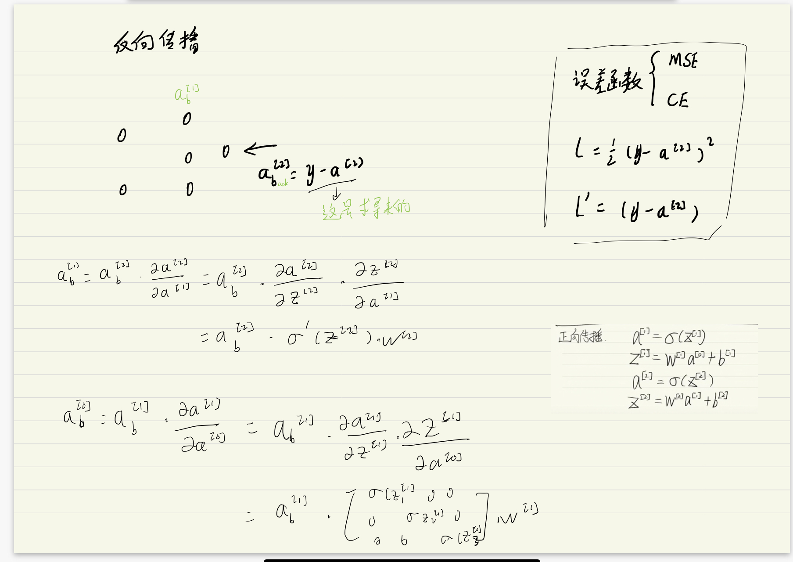

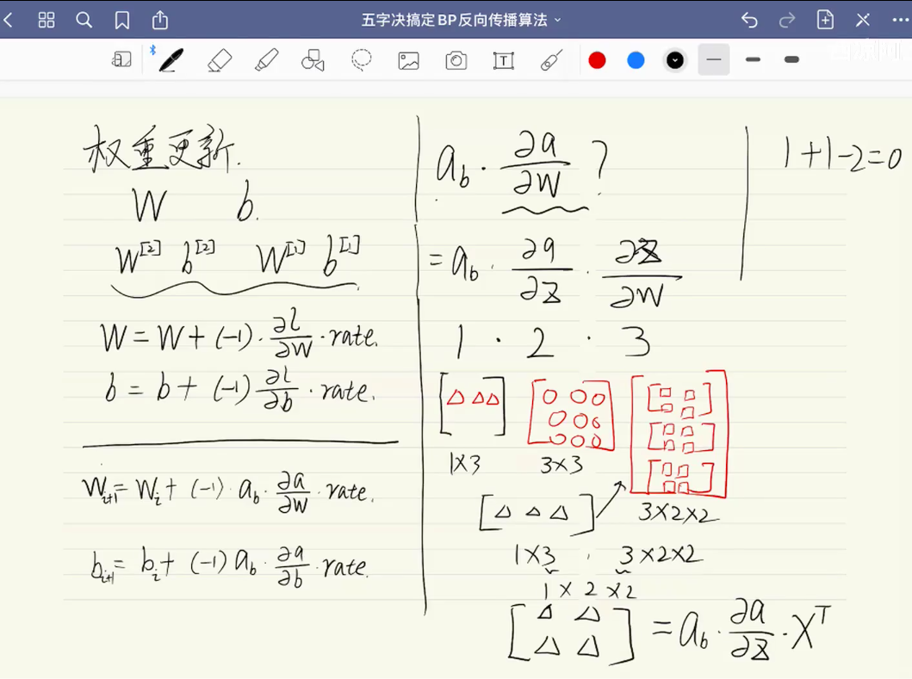


## 2. 神经网络之BP算法

原文地址见末尾。   

原文写于2018年5月。修改于2019年11月17。 

最近在学习《Deep Learning》这本书，书中在前馈神经网络、全连接神经网络以及卷积神经网络等内容中，都有提到反向传播算法，这一算法可以说是神经网络中**求解参数**比较核心的部分了。为了更好地理解神经网络工作的原理，认识反向传播在神经网络中的运算机制，在综合《Deep Learning》书中的有关部分并且学习了b站讲解神经网络的相关视频及一些有关于BP算法的博客文章之后，笔者将自己的理解写下来，希望能为初学者理解反向传播算法起到一定的帮助。在此，对已为BP算法提供了学习思路的各位前辈表示敬意，特别是帮助我思考和理解BP算法的三位博主。

关于反向传播算法，我们首先需要清楚它的应用途径；其次,做一些神经网络知识的前期储备；之后，学习BP算法的工作原理；最后，认识到BP算法的局限性,了解改进方法。因此，本文从这4个点来讲解，划分为6部分：

### **2.1  反向传播算法应用领域**

 反向传播算法应用较为广泛，从字面意思理解，与前向传播相互对应。在简单的神经网络中，反向传播算法，可以理解为最优化损失函数过程，求解每个参与运算的参数的梯度的方法。在前馈神经网络中，反向传播从求解损失函数偏导过程中，步步向前求解每一层的参数梯度。在卷积神经网络中，反向传播可以求解全连接层的参数梯度。在循环神经网络中，反向传播算法可以求解每一个时刻t或者状态t的参数梯度（在RNN\LSTM\GRU中，反向传播更多是BPTT）。笔者如今对于BP的理解，认为是在优化损失函数或者目标函数过程中，求解参与运算的参数的梯度方法，是一种比较普遍的说法。

### **2.2 准备知识--**反向传播(BP)算法应用于神经网络

反向传播(BP)算法在深度学习中，应用广泛。这里仅以前馈神经网络中的BP算法作为介绍。神经网络是一个由输入层、隐藏层、输出层三部分组成的网络：数据从输入层，经过权重值和偏置项的线性变换处理，再通过激活层，得到隐藏层的输出，也即下一层的输入；隐藏层到输出层之间是，经过权重值和偏置项的线性变换，之后通过激活层，得到输出层。

​    

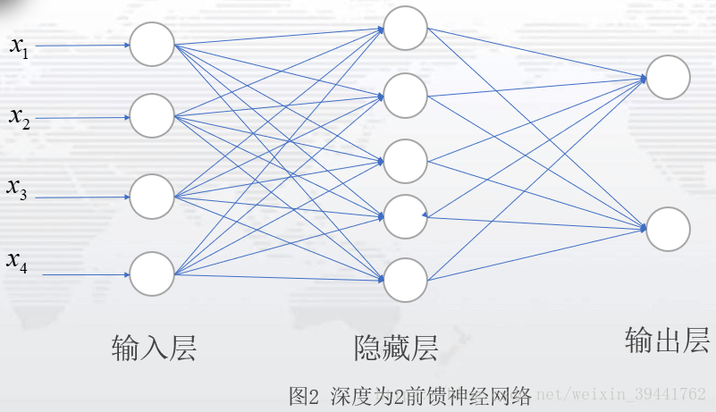

图2表示一个网络层为2的前馈神经网络：一个隐藏层，一个输出层；隐藏单元为5，记输入层到隐藏层的权重值为W，偏置项为b1,激活函数为g1，隐藏层到输出层的权重值为V,偏置项为b2，激活函数为g2，则图2的模型即为：

  

图2是一个比较简单的神经网络，通常，我们见到的神经网络，是具有多个隐藏层的网络，如图3：这是一个隐藏层个数为N个，每层隐藏单元数为5的神经网络。（PS：隐藏层设计，可以考虑层数设计和隐藏单元设计，可根据自己的需要自行设计。)

   

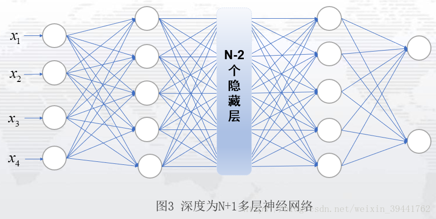

从输入层到隐藏层再到输出层，这一向前传递的过程，我们称之为前向传播。前向传播过程，往往是我们设定模型的过程，也可以理解为设定数学表达式或者列方程的过程。


### **2.3 BP算法原理及其实施步骤**

BP算法的核心思想：使用梯度下降来搜索可能的权向量的假设空间，以找到最佳的拟合样例的权向量。具体而言，即利用损失函数，每次向损失函数负梯度方向移动，直到损失函数取得最小值。

或者说，反向传播算法，是根据损失函数，求出损失函数关于每一层的权值及偏置项的偏导数，也称为梯度，用该值更新初始的权值和偏置项，一直更新到损失函数取得最小值或是设置的迭代次数完成为止。以此来计算神经网络中的最佳的参数。

由此，正式介绍BP算法前，我们需要知道前向传播过程，确定网络的设计。为此先设定一个只有一层的神经网络，作为讲解，如图4.

​                                      

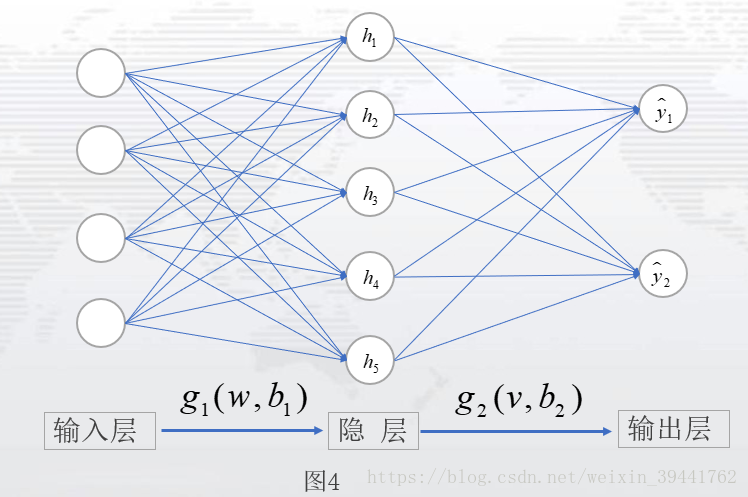

设定：从输入层数据为X，输入层到隐藏层参数为w,b1，隐藏层到输出层参数为v,b2，激活函数用为g1,g2。于是模型设定为：

​                                                       （3-1）

隐藏层到输出层：

​                                                        （3-2）

模型：

​                           （3-3）

损失函数：

​                                                              （3-4）

其中：

​               

​                   

​                                       

以上述的模型设定为例，下面介绍BP算法步骤，通过BP算法的步骤，了解反向传播，是如何实现模型的参数更新。


#### 2.3.1 **实施步骤：**

  **1）**初始化网络中的权值和偏置项，分别记为

  ****                             （3-5）


  **2）**激活前向传播，得到各层输出和损失函数的期望值

****                          （3-6）

  其中，****表示参数集合，表示真实值**，**表示预测值，表示对总的误差值取平均，所以一般情况下，输出单元多少维，误差值求平均就除以多少；本模型设定中，输出值为2维列数据，故用误差值除以2。**一般情况下，损失函数的期望值表示为：**

​                                 ****                         （3-6-1）

​    这是一组n维数据的输出，若是有m组这样的数据，损失函数的期望值为：

​                               ****                   （3-6-2）

​    若真实值与输出值表示为，上式可表示为：

​                                                     （3-6-3）

​    一般情况下，输出数据为1维或是2维，输出的数据有多组。

  

**3）**根据损失函数，计算输出单元的误差项和隐藏单元的误差项

输出单元的误差项，即计算损失函数关于输出单元的梯度值或偏导数，根据链式法则有：

​                              ****    

​                                                 （3-7）

隐藏单元的误差项，即计算损失函数关于隐藏单元的梯度值或偏导数，根据链式法则有：

​                          ****            

​                          ****            （3-8）

 **PS:** 对于复合函数中的向量或矩阵求偏导，复合函数内部函数的偏导总是左乘；对于复合函数中的标量求偏导，复合函数内部函数的偏导左乘或者右乘都可以。


 **4）** 更新神经网路中的权值和偏置项

 输出单元参数更新：                    （3-9）

 隐藏单元参数更新：                   （3-10）   

 其中，表示学习率**，**k=1,2,...,n表示更新次数或迭代次数，k=1表示第一次更新，以此类推。此处可能和别处博客不太一样，但实质是一样的，此处的'+'或者'-'主要取决于损失函数.

如何定义损失函数或者定义参数更新均可，但参数的更新一定是向参数的负梯度方向。

 

**5）** 重复步骤2-4，直到损失函数小于事先给定的阈值或迭代次数用完为止，输出此时的参数即为目前最佳参数。


#### 2.3.2 详细步骤

**这便是BP算法的一个具体步骤，下面我们详细介绍BP算法步骤中的每一步**：


#####  **步骤1）**

初始化参数值(输出单元权值、偏置项和隐藏单元权值、偏置项均为模型的参数)，是为激活前向传播，得到每一层元素的输出值，进而得到损失函数的值。参数初始化，可以自己设定，也可以选择随机生成；一般情况下，自己写代码或者调用tensorflow或keras时，都是随机生成参数。因为初始参数对最终的参数影响不大，只会影响迭代的次数。


##### **步骤2）**

在步骤1的基础上，激活前向传播，得到的值，进而得到的值；其中的计算，根据前面模型设定中的公式计算。计算这些值是为计算步骤3中的误差项。


#####  **步骤3）**

计算各项误差，即计算参数关于损失函数的梯度或偏导数，之所以称之为误差，是因为损失函数本身为真实值与预测值之间的差异。计算参数的偏导数，根据的是微积分中的链式法则。具体推导如下：

###### **输出单元的误差项**

**输出单元的误差项**：输出单元v与损失函数E，不是直接相关，而是通过复合函数的形式关联，以设定的模型为例：

     

​                                        （3-11）

其中表示损失函数化为与参数v，b2相关的表达式。

根据链式法则，输出单元v与损失函数E的误差项为：                

​                              ****

​                                                   （3-12）

求出上式中每一个偏导：

​                    

​                                                      （3-13）

​                                                               （3-14）

​                                                         （3-15）

​                                                      (3-16)

其中，关于激活函数求偏导，需要根据具体的激活函数而定，每一层的激活函数可以选择不同的函数，一般情况下，为简单化模型设计和求导方便，会设定为同一个函数。此处假设选择激活函数为sigmoid函数，那么有： 

​         

​                 (3-17)

**PS：因为sigmoid(z)中z是标量，对z求偏导，有：**

​        

​                       


**本文定义了z为向量，对于向量就有了式(3-17)的逐元素相乘的式子。**

于是，为简化后面的计算，记

​                                            (3-18)

其中，表示第k次求损失函数关于的偏导；表示逐元素相乘，即两个向量或两个矩阵对应的元素相乘，例如：   

​                          

于是，**输出单元的误差项**为：

​                                                         (3-19)

​                                                (3-20)

**此处说明**：若遇式(3-15)的偏导(对权值求偏导)，链式法则处理方式均如式(3-19)；若遇式(3-16)的偏导(对偏置项求偏导)，链式法则处理方式均如式(3-20)。


###### 隐藏单元的误差项

**隐藏单元的误差项：**隐藏单元w与损失函数E，通过复合函数的形式关联，以设定的模型整理为：

​     ****

​             **** （3-21）

根据链式法则，隐藏单元w与损失函数E的误差项为：

​                        ****

​                       ****            （3-22）

同样的求导法则，得到**隐藏单元的误差项**为：

​                                  （3-23）

​          （3-24）

   其中：

​                                                    （3-25）

​                                       (3-26)

​                                                     (3-27)

​                                                 (3-28)

 **说明**：若遇式(3-25)(对隐藏单元求偏导)，链式法则处理如式(3-23)；式(3-15)和(3-26)同，故有相同的处理方式；式(3-16)和(3-27)同，故有相同的处理方式。

 **补充**：若有多个隐藏层时，逐步计算隐藏层的权值和偏置项误差，推导的规则同上。例如：一个隐藏层为2，隐藏单元为5的神经网络：

​                        

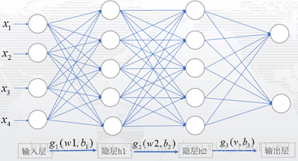

输出层到隐藏层2的误差项同式(3-19)

隐藏层2到隐藏层1的误差项为：

​                                      (3-29)

记：              

​                                                      (3-30)

隐藏层1到输入层的误差项为：

​                                    (3-31)

从上述中，容易看出，无论多少层隐藏层，其误差项都是同样的结构。

##### 步骤4）

 更新神经网路中的权值和偏置项。学习率自己设定，学习率太大，容易跳过最佳的参数；学习率太小，容易陷入局部极小值。

##### 步骤5） 

设定阈值e或者设定迭代次数，当损失函数值小于阈值e时，或当迭代次数用完时，输出最终参数。


### **2.4 实例运用**

 为能更好理解BP算法和知道如何运用BP算法，下面以一个实际的例子来说明运用BP算法的具体操作。

有一组数据，目的是训练这两组数据，找到输入X计算得到Y的预测值尽可能接近于真实值的参数。设定模型：设计一个隐藏层为1，隐藏单元数为2，激活函数为sigmod函数的模型，运用反向传播算法，得到参数。网络如图5：

​                        

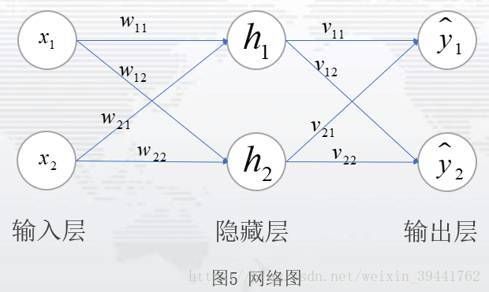

于是有：

​                          

​                             

​                            

​                                                (4-1)

根据BP算法步骤：

 1）初始化网络中的所有参数并给出学习率：

​                    

  2）激活前向传播，将参数带入式(4-1)，并计算损失函数：

​    输入层-->隐藏层：

​                                     (4-2)

​                                        (4-3)

​     隐藏层-->输出层：

​                              (4-4)

​                                   (4-5)

​     损失函数：

​                                         (4-6)

 3）计算输出单元的误差项和隐藏单元的误差项

​    **输出单元的误差项：**根据公式(3-19)，将带入其中，得到需更新的梯度误差：

​                         

​                                    

​                   

   如果对v中每一个元素求偏导，有：

​                          

​                          

​                          

​                          

​                               

  用公式(3-19)和对v中每一个元素求偏导，得到的结果一致。

  **隐藏单元的误差项**：根据公式(3-23)，将带入其中，得到需更新的梯度误差

​                

​                    

​                    

​                    

​    若对w中每一个元素求偏导，有：

​                   

​                   

​                   

​                   

​                      

​    用公式(3-23)和对v中每一个元素求偏导，得到的结果一致。

 **注意：**一般情况下，不会对偏置项更新

 4）更新神经网络中的权值

​             

​                 

​            

​                  

   于是，得到第一次更新的参数值w,v。

 5）重复步骤2-4，直到损失值达到了预先设定的阈值或迭代次数用完，得到最终的权值。

​    以上即为BP算法的更新权值的过程，下面将上述实例的推导过程用代码实现：

### **2.5 实例编程实现(运行环境python3)**

   根据BP算法的步骤，将上述例子对应的代码写出如下：

```python
# encoding:utf-8
# ********* 导入相应的模块***********
import math
import numpy as np
from numpy import *
 
#**********设定模型所需的激活函数，运行此代码时，带'*'部分请删除*********
# 激活函数
def sigmoids(z):
    a = []
    for each in z:
        b = 1/(1+math.exp(-each[0]))
        a.append(b)
    return a
 
**********设定前向传播过程，即模型的设定部分，此处均根据模型第3部分的模型设定部分的公式编写对应的代码*********
 
# 前向传播,返回预测值
def forwordmd(X,W,V,B1,B2):
    net1 = W.T*X+B1
    H = matrix(sigmoids(np.array(net1))).T # 隐藏层单元
    net2 = V.T*H+B2
    pred_y = matrix(sigmoids(np.array(net2))).T # 预测值
    return pred_y,H,net1,net2
 
#**********设定模型反向传播，按照步骤4的公式编辑*********
# 反向传播,更新权重
def Bpaugorith(Y,pred_y,H,V,aph,W):
    Errorterm = 0.5*(Y-pred_y).T*(Y-pred_y)# 给出误差公式
    # 计算输出单元的误差项
    a1 = multiply(pred_y-Y,pred_y) # 矩阵对应元素相乘,即逐元素相乘
    a2 = multiply(a1,1-pred_y)
    Verror = H*a2.T
    # 计算隐藏单元的误差项
    Werror = X*(multiply(multiply(H,1-H),(V*a2))).T
    # 更新权重
    Vupdate = V - aph*Verror
    Wupdate = W - aph*Werror
    return Vupdate,Wupdate,Errorter
 
#**********主程序部分，此处设定了步骤1中的参数初始化和输入值及输出值的真实值，及步骤5中设置迭代次数和设置阈值停止迭代的代码*********
 
if __name__ =='__main__':
    X = matrix([0.05,0.10]).T
    Y = matrix([0.01,0.99]).T
    # 给出初始权重
    W = matrix([[0.15,0.20],[0.25,0.30]])
    B1 = matrix([0.1,0.1]).T
    V = matrix([[0.40,0.45],[0.50,0.55]])
    B2 = matrix([0.2,0.2]).T
 
    #***********初始权重亦可随机生成***********
    # 随机生成参数
    # np.random.seed(0)
    # W = matrix(np.random.normal(0,1,[2,2]))
    # B1 = matrix(np.random.normal(0, 1, [1, 2]))
    # V = matrix(np.random.normal(0, 1, [2, 2]))
    # B2 = matrix(np.random.normal(0, 1, [1, 2]))
    #***********随机生成参数部分，若有自己设定，将此部分注释*********
    aph = 0.5 # 学习率
    #*********从此处为迭代次数设置部分***********
    # 迭代10次
    n = 10 # 迭代次数
    for i in range(n):
        # 激活前向算法
        pred_y, H,net1,net2 = forwordmd(X,W,V,B1,B2)  # 得到预测值和隐藏层值
        # 更新权重
        Vupdate, Wupdate,Errorvalue = Bpaugorith(Y,pred_y,H,V,net1,net2,aph,W)  # 得到更新的权重
        W,V = Wupdate,Vupdate
    print ('损失函数e：%.2f'%e)
    print ('预测值：')
    print (pred_y)
    print ('更新的权重V：')
    print (Vupdate)
    print ('更新的权重W:')
    print (Wupdate)
    print ('损失值：')
    print (Errorvalue)
 
    # 阈值E，可根据需要自行更改，若需要运行此部分，请将迭代次数部分注释后运行
    # 阈值E
    # e,m = 0.19,1
    # pred_y, H, net1, net2 = forwordmd(X,W,V,B1,B2)  # 得到预测值和隐藏层值
    # 更新权重
    # Vupdate, Wupdate, Errorvalue = Bpaugorith(Y,pred_y,H,V,net1,net2,aph,W)  # 得到更新的权重
    # W,V = Wupdate,Vupdate
    # while Errorvalue>e:
        # 激活前向算法
        # pred_y, H, net1, net2 = forwordmd(X,W,V,B1,B2)  # 得到预测值和隐藏层值
        # 更新权重
        # Vupdate, Wupdate, Errorvalue = Bpaugorith(Y,pred_y,H,V,net1,net2,aph,W)  # 得到更新的权重
        # W, V = Wupdate, Vupdate
        # m = m+1
    # print ('迭代次数：%d'%n)
    # print ('更新权重:%d次'% m)
    # print ('预测值：')
    # print (pred_y)
    # print ('更新的权重V：')
    # print (Vupdate)
    # print ('更新的权重W:')
    # print (Wupdate)
    # print ('损失值：')
    # print (Errorvalue)
​
 
    #*********阈值设置部分结束***********
 
​


```


以上部分为本例中的代码部分。设定了激活函数，前向传播(即模型的设定)及反向传播过程，步骤5中有阈值设定和迭代步数，这一部分的程序如主程序中。前向传播部分和反向传播部分，以上内容均根据推导的公式一句句编写出来的。感兴趣的朋友可以自己尝试编写这部分程序。

[代码链接](https://gitee.com/someone317/backpropagation_algorithm_test/blob/master/BPtest1.py)

### **2.6 BP算法缺陷与改进**

#### 2.6.1  **BP算法缺陷：**

1）局部极小值

对于多层网络，误差曲面可能含有多个不同的局部极小值，梯度下降可能导致陷入局部极小值。

2）权值过多

当隐藏节点过多，层数越多时，权值成倍增长。权值的增长意味着对应的空间维数的增加，过高的维数易导致训练后期的过拟合。

3）容易过拟合

训练的次数过多、空间维数过高均容易过拟合。

#### 2.6.2 **BP算法改进：**

 1）利用动量法改进BP算法

动量法权值调整算法的具体做法是：将上一次权值调整量的一部分迭加到按本次误差计算所得的权值调整量上，作为本次的实际权值调整量，即：

​                               

其中，表示动量系数，表示学习率。

 

2）自适应调整学习率

 **调整的基本指导思想**是：在学习收敛的情况下，增大以缩短学习时间；当偏大致使不能收敛时，要及时减小它的值，知道收敛为止。此方法适用于设置阈值的情况下。

 

3）动量-自适应学习速率调整算法

 采用动量法，BP算法可以找到更优的解；采用自适应学习速率法时，BP算法可以缩短训练时间。将以上两种方法结合起来，就得到动量-自适应学习率调整算法。

上述2）和3）都适应于设置阈值来停止程序的方法。
