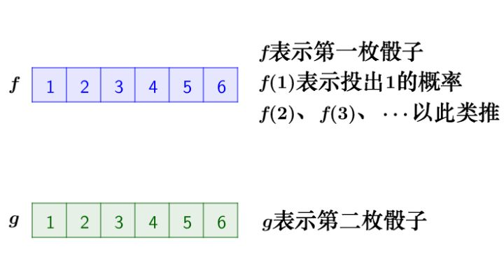

# 卷积思想理解

⌚️: 2020年4月1日

📚参考

- [卷积思想理解、Convolutional Neural Network（CNN）卷积神经网络初探](https://www.cnblogs.com/LittleHann/p/6792511.html)

----

## 1. 如何理解卷积

CNN卷积神经网络的核心是卷积，当然CNN不仅仅只有卷积，还有池化等其他技术，我们第一章先来一起讨论和理解下卷积的定义。

卷积是一个数学上的运算方法，在通信、机器学习、图像处理等领域都有广泛的应用。我们来一起从不同角度来看卷积，以求获得一个全面的认知。

### 1.1  从信号处理角度理解卷积

卷积是通信领域的一个很常用的概念和计算方法，以离散信号为例，连续信号同理。

已知一组离散冲击信号，![x[0] = a, x[1] = b, x[2]=c](https://www.zhihu.com/equation?tex=x%5B0%5D+%3D+a%2C+x%5B1%5D+%3D+b%2C+x%5B2%5D%3Dc)，它们代表了一段时序上的3次采样信号，如下图


另一组冲击响应信号，![y[0] = i, y[1] = j, y[2]=k](https://www.zhihu.com/equation?tex=y%5B0%5D+%3D+i%2C+y%5B1%5D+%3D+j%2C+y%5B2%5D%3Dk)，如图


下面通过演示求![x[n] * y[n]](https://www.zhihu.com/equation?tex=x%5Bn%5D+%2A+y%5Bn%5D)的过程，揭示卷积的物理意义。

#### 1. 第一步

![x[n]](https://www.zhihu.com/equation?tex=x%5Bn%5D)乘以![y[0]](https://www.zhihu.com/equation?tex=y%5B0%5D)并平移到位置0(注意这里随时间平移很重要)


这一步可以简单理解为x的当前状态值乘上了一个加权值y[0]，接着移动到下一个时间响应点。

#### 2. 第二步

![x[n]](https://www.zhihu.com/equation?tex=x%5Bn%5D)乘以![y[1]](https://www.zhihu.com/equation?tex=y%5B1%5D)并平移到位置1


#### 3. 第三步

![x[n]](https://www.zhihu.com/equation?tex=x%5Bn%5D)乘以![y[2]](https://www.zhihu.com/equation?tex=y%5B2%5D)并平移到位置2


#### 4. 第四步 - 累加 

把上面三个图叠加，就得到了![x[n] * y[n]](https://www.zhihu.com/equation?tex=x%5Bn%5D+%2A+y%5Bn%5D)


直观上理解，一定是中间的时域的权重累乘和最多，而开始和结束阶段的累积和较小。卷积的重要的物理意义是：

```
一个函数（如单位响应）在另一个函数（如输入信号）上的加权叠加
```

这就是卷积的意义：**加权叠加！

**

对于线性时不变系统，如果知道该系统的单位响应，那么将单位响应和输入信号求卷积，就相当于把输入信号的各个时间点的单位响应加权叠加，就直接得到了输出信号。
注意！这里特别注意的一个概念是每个时间点输入信号只能输入一次，相当于给当前系统一次激励(加权乘)，而这次激励的响应在之后的整个时间周期中逐渐消减。

通俗的说：**在输入信号的每个位置，叠加一个单位响应，就得到了输出信号。

**

### 1.2 用卷积核感知野的视角来理解输入信号输出响应卷积问题

还是上面的例子，我们将Y信号看做是卷积核感知野，卷积核的size为3。卷积核从从坐标[0]开始滑动（x[0]左边一格），到坐标[3]停止（x[3]的位置）

卷积核滑动过程中，将感知野内的输入信号作为输入，和卷积核进行卷积运算。总共滑动5次，得到5个数值结果，得到的结果和第一小节推导的是一样的：

```
x[0] = ai;
x[1] = bi + aj;
x[2] = ci + bj + ak;
x[3] = cj + bk;
x[4] = ck;
```

笔者提醒：在图像卷积中，大多数情况下，卷积核感知野的起止位置是以输入像素矩阵为边界的，也即卷积后的特征图和输入矩阵同尺寸。

另外，这种卷积计算方式隐含了padding处理，是full pad的一种，具体细节我们后面会讨论。

### 1.3 从数学符号定义理解卷积

我们称  为  的卷积

其连续的定义为：


其离散的定义为：


从公式上看，这两个式子有一个共同的特征：


这个特征有什么意义？

我们令  ，那么  就是下面这些直线：


如果遍历这些直线，就好比，把毛巾沿着角卷起来：


我们可以把这个毛巾想象成 f 和 g 在区间[a,b]的张量积，即：U(x,y)=f(x)g(y)

把它整张地毯卷起来以后，它变成了一个一维的函数，而且每点的函数值等于原本函数空间中所有函数卷起来后重合的点函数值之和，即**累积和**。

### 1.4 从一个离散卷积的例子：丢骰子来理解卷积

假设我们有两枚骰子：


把这两枚骰子都抛出去，然后求：**两粒骰子加起来等于4的概率是多少**？

两个骰子加起来要等于4，这本质上就是求卷积的问题。

我们先抛开数学公式的讨论，把骰子各个点数出现的情况逐一枚举出来：



那么，两枚骰子点数加起来为4的情况有：


因此，两枚骰子点数加起来为4的概率为：


符合卷积的定义，把它写成标准的形式就是：


读者朋友可以理解一下，这里的”骰子加和等于4“，本质上就是最后的卷积和函数上的4这个点，上面求解的过程，就是在求解4这个点的卷积，即累加和。

### 1.5 从一个**连续卷积的例子：做馒头来理解卷积**

楼下早点铺子生意很好，供不应求，老板买了一台机器，不断的生产馒头。

假设馒头的生产速度是  ，那么一天后生产出来的馒头总量为（积分结果）：


每个馒头生产出来之后，就会慢慢腐败，假设腐败函数为  ，比如，10个馒头，24小时会腐败：


但是需要注意的是，馒头的生产和馒头的腐败是同时进行的。很容易理解，第一个小时生产出来的馒头，一天后会经历24小时的腐败，第二个小时生产出来的馒头，一天后会经历23小时的腐败。

如此，我们可以知道，一天后，馒头总共腐败了：


这就是连续的卷积，同样也符合上面讨论的卷积数学公式。

由此也可以再次理解到：卷积本质上体现了两种信号的**时移累加**。

### 1.6 从函数映射（变换）角度理解卷积

从函数（或者说映射、变换）的角度理解。 卷积过程是在图像每个位置进行线性变换映射成新值的过程，将卷积核看成权重，若拉成向量记为w，图像对应位置的像素拉成向量记为x，则该位置卷积结果为y=w′x+b，即向量内积+偏置，将x变换为y。

从这个角度看，多层卷积是在进行逐层映射，整体构成一个复杂函数，训练过程是在学习每个局部映射所需的权重，训练过程可以看成是函数拟合的过程。

### 1.7 从图像处理中的像素平滑问题理解卷积

#### 1.7.1  像素平滑原理

有这么一副图像，可以看到，图像上有很多噪点：


高频信号，就好像平地耸立的山峰，看起来很显眼：


平滑这座山峰的办法之一就是，把山峰刨掉一些土，填到山峰周围的山谷里去。

用数学的方式来说，就是把山峰和周围的高度进行一下平均。

平滑后得到：


那具体如何能实现上图的平滑效果的呢？实际上，图像平滑的技术和理论非常多，我们本文的主题是卷积，所以我们接下来讨论下如何使用卷积的方法实现图像平滑以及它的原理。

#### 1.7.2  基于卷积实现图像平滑的原理

##### 1）利用卷积核实现邻域像素平均化

我们可以将上面那张有噪点的图片，转化为数值型的像素矩阵：


接下来的问题是，我们可以把原始图像像素点看成是输入信号，但是卷积运算还需要一个“响应信号”，这个响应信号如何定义？

这里就需要引入一个概念，即**卷积核（convolutional filter）**或者叫做**感知野（Sensing field）**。

我们将下面这个平均矩阵，设定为原始像素输入信号的相应信号。


为什么要设置这种全部由平均数组成的矩阵呢？我们可以直观地这么理解：**这个响应信号矩阵充当了一个很“迟钝、中庸、打哈哈”性格的响应者，不管你输入的信号如何充满高频变化，它永远从每个信号的周围各取8个信号，大家一起取一个平均，然后将结果返回给你，这样，最终的累加结果从整体上就会比较倾向于“平均主义”**。

##### 2）像素矩阵卷积运算过程 - 卷积运算与相关运算

我们来看一下计算过程，这个知识点是笔者在初次接触CNN卷积概念时比较容易混淆的概念，这里重点讨论下，希望能帮助到读者朋友。

输入矩阵和卷积核的运算是一一对应的内积运算，还是按照卷积定义的倒序运算呢？其实从计算机工程上来说，例如在tensorflow内部，会先将卷积核进行倒序翻转，即旋转180°，然后将翻转后的卷积核和输入矩阵进行一一对应的内积运算，这样可以大大提高运算效率并且有利于分布式计算。只是我们在写代码的时候要明白，卷积核(或者叫滤波器模版)和输入矩阵本质上是在做卷积运算。

图像**卷积运算**与**相关运算（内积）**的关系如下图所示，其中F为滤波器，X为图像，O为结果。


相关是将滤波器在图像上滑动，对应位置相乘求和；

卷积则先将滤波器旋转180度（行列均对称翻转），然后使用旋转后的滤波器进行相关运算。

这也是为什么卷积核也被称为滤波器模版的原因之一，从效果上来讲，即使将卷积核翻转了180°，其本质也可以理解为一种模版。

比如我要平滑原始图像中的  点，就在原始图像像素矩阵中，取出  点附近的点组成矩阵  ，和  进行卷积计算后，再将计算结果填回去：


读者朋友可能会注意到，对于原始图像边缘的点，是无法完整圈出一个”附近矩阵“的，这个时候需要由我们人工指定插值方法，例如填0，或者填入均值等等。具体设置方式在TensorFlow/keras的API调用中通过参数指定。

对应关系如下动图


写成卷积公式就是：


这样相当于实现了  这个矩阵在原来图像上的**滑动扫描**，这其实也就是CNN神经网络的卷积核“扫描”原始上一层输入矩阵的原理。

笔者插入：**这里要注意区分单个感知野内部的卷积运算和卷积核的滑动strip size的区别，它们是不同的概念，理论上说，卷积核可以和输入矩阵一样大，即不滑动，而卷积核感知野内部的卷积运算可以照常进行。有可以一次跳跃多个step size，这取决于我们希望的扫描精度**。

笔者思考：**CNN强大的创新之处就在于将非常质朴的卷积原理，巧妙应用在了深度神经网络的特征抽象和特征空间转换上。从这里可以感受到CNN创始者对数学规律理解的深刻程度，令人敬佩。**

### 1.8 从不同图像处理方式的区别角度理解卷积核以及不同卷积核参数背后代表的含义

上一个小节我们简单讨论了利用”均值卷积“实现图像平滑的目的，实际上卷积核的种类有非常多种，我们经常能看到的，平滑，模糊，去燥，锐化，边缘提取等等工作，其实都可以通过卷积操作来完成，我们这个小节列举几种传统机器学习和图像处理中常用的卷积核。

1.**一个没有任何作用的卷积核**


将原像素中间像素值乘1，其余全部乘0，显然像素值不会发生任何变化。


**2.平滑均值滤波**


该卷积核的作用在于取九个值的平均值代替中间像素值，所以起到的平滑的效果。


**3. 高斯平滑**


高斯平滑水平和垂直方向呈现高斯分布，在平滑的同时，更突出了中心点在像素平滑后的权重，相比于均值滤波而言，有着更好的平滑效果。

**4. 图像锐化**


该卷积利用的其实是图像中的边缘信息有着比周围像素更高的对比度，而经过卷积之后进一步增强了这种对比度，从而使图像显得棱角分明、画面清晰，起到锐化图像的效果。

除了上述卷积核，边缘锐化还可以选择下面的卷积核，其本质思想是一样的：


**5. 梯度Prewitt**

水平梯度卷积核：


垂直梯度卷积核：


梯度Prewitt卷积核与Soble卷积核的选定是类似的，都是对水平边缘或垂直边缘有比较好的检测效果。

**6. Soble边缘检测**

Soble与上述卷积核不同之处在于，Soble更强调了和边缘相邻的像素点对边缘的影响。 
水平梯度：


垂直梯度：


**7. 梯度Laplacian**

卷积核：


Laplacian也是一种锐化方法，同时也可以做边缘检测，而且边缘检测的应用中并不局限于水平方向或垂直方向，这是Laplacian与soble的区别。下面这张图可以很好的表征出二者的区别：


更本质上来说，不同的卷积核的区别在于内内部的权重参数，不同的权重参数赋予了卷积核不同的特征提取能力。

在CNN神经网络出现之前，工程师和研究员们需要根据具体的研究对象和项目情况，人工设计特定的卷积核参数，或者逐个实验传统的知名卷积核（例如高斯卷积等），通过大量的实验结果来选择一个最合适的卷积核或者卷积核组合。但是神经网络的强大之处在于其不是专家经验驱动的，而是数据驱动的，通过向神经网络输入训练样本，网络不断调整直到得到最能表达（拟合）训练样本中规律的卷积核权重特征。

如果读者朋友有兴趣print出CNN卷积核的权重参数（需要稍微改动一些TensorFlow的内核代码），可以看到在Minist手写识别中，第一层卷积核的参数非常类似Soble边缘检测，当然不完全一样，这也从一个侧面体现了，卷积神经网络是逐层抽象的，第一层往往侧重提取图像的边缘特征。

笔者插入：讨论这一小节的目的是希望向读者朋友展示卷积擅长在图像处理领域发挥作用。但是CNN现在不仅仅在图像处理领域被频繁使用，在非图像领域，例如NLP领域也在被大量使用。在笔者所从事的网络安全领域，CNN被用来对日志文本进行特征提取和检测，这种迁移是否具备合理性呢？目前似乎还没有明确的理论证明说CNN只能被用于某几个或者某些领域，至少从结果上看，CNN在文本检测领域表现还是很不错的。但是有一点需要注意，我们在设计CNN网络结构的时候，需要特别关注卷积核size、卷积核形状（不一定是 N * N 的方阵），很多时候，文本检测需要条带状的卷积核（ width * 1），我们需要根据项目的实际情况，并且结合专家领域经验设计合理的卷积核，并且通过实验获得效果的验证。

### 1.9 从模版匹配的角度理解卷积 - 卷积核被称为滤波器的原因

我们知道，卷积与相关在计算上可以等价（虽然他们的概念是不同的），而相关运算常被用于模板匹配。
即我们可以认为卷积核定义了某种模式，卷积（相关）运算是在计算每个位置与该模式的相似程度，或者说每个位置具有该模式的分量有多少，当前位置与该模式越像，响应越强。

### 1.10 卷积可以提取图像特征

假设一个业务场景，我们需要识别图像中的”老鼠“这个目标，我们该怎么利用卷积帮助我们完成任务呢？

现在我有一个老鼠的图像（只考虑灰度，所以只有一层）


现在我们设计一个滤波器对这只老鼠的图像进行过滤，滤波器的大小为 7 * 7，我们这里先不讨论卷积核翻转180°的问题，其实在工程上是等价的，所以这个小节我们对滤波器和卷积核这2个词汇不做区分：


依次将过滤器滑过原始图像的某一个区域，并与该区域原始像素值进行点乘。现在假设我们将滤波器滑到了老鼠图像的左上角，如下图所示：


过滤器会与该原始图像对应区域进行点乘后求和，结果如下图所示：


我们发现，该区域本身存在一个弧度，且弯曲程度和过滤器的弯曲程度很相似，所以图像的该区域像素与过滤器矩阵点乘求和后得到的数值很高。这个过程很形象地展示了”滤波“的这个概念。

接下来，我们继续将过滤器移动到另外一个地方，靠近老鼠耳朵的地方，这时候我们发现该老鼠耳朵区域与该滤波器用来检测的弧度很不相似，我们看看将用滤波器过滤该区域会发生什么，如下图所示：


我们发现，检测弧度的滤波器在与老鼠耳朵这个区域的像素进行点乘后求和所得到的值为0。也就是说该区域与滤波器没有对应关系。

卷积原理在CNN中发挥重要作用的核心原因，笔者认为可以总结为一句话：**取其精华，去其糟粕。卷积通过滤波机制将不关注的部分滤波，而保留卷积核“关注”的图谱特征，这也体现了神经网络训练的本质是信息压缩，即去除冗余信息，保留核心模式特征**。

我们对整个原图进行一次卷积，得到的结果中，在那个特定曲线和周边区域，值就很高，在其他区域，值相对低。这就是一张激活图。对应的高值区域就是我们所要检测曲线的位置。

问题来了，我们如果需要完整地检测老鼠这个物体概念，就需要设计多个不同的卷积核滤波器，可能分别是屁股，耳朵，胡子，嘴巴，身体等等，这个人工设计的过程就是**基于专家经验的特征工程**。

但是新的问题马上就来了，要是检测的目标非常复杂怎么办？复杂多超出人能设计范畴或者工程量巨大，我们就不可能再使用专家经验进行卷积核设计了，这个时候我们使用深度学习，进行数据驱动的模型训练，建立一个包含非常多卷积核，甚至非常多层的卷积神经网络，训练的过程就是在调整各个卷积核对应的内部权重向量。


> ***\**\*\*\*\*\*\*\*\*\*\*\*\*\*\*\*\*\*Relevant Link:\*\*\*\*\*\*\*\*\*\*\*\*\*\*\*\*\*\**\***
>
> https://www.zhihu.com/question/22298352
> https://www.zhihu.com/question/54677157/answer/14124529
> https://www.zhihu.com/question/22298352
> https://baijiahao.baidu.com/s?id=1613041733799043592&wfr=spider&for=p
> https://blog.csdn.net/chaipp0607/article/details/72236892


##  2. CNN简介

卷积网络(convolutional network)，也叫做卷积神经网络(con- volutional neural network, CNN)，是一种专门用来处理具有**类似网格结构**的数据的神经网络。例如时间序列数据(可以认为是在时间轴上有规律地采样形成的一维网格)、和图像数据(可以看作是二维的像素网格)。

卷积网络在诸多应用领域都表现优异。“卷积神经网络’’ 一词表明该网络使用了卷积(convolution)这种数学运算。

卷积是一种特殊的**线性运算**。**卷积网络是指那些至少在网络的一层中使用卷积运算来替代一般的矩阵乘法运算的神经网络**。

### 2.1 卷积运算

我们已经在第一章花了一些篇幅讨论了卷积的定义以及其运算过程，但是为了这章的完整性，我们针对卷积在卷积神经网络中的运算再讨论一次。

在通常形式中，卷积是对两个实变函数的一种数学运算，下式展示了卷积的数学公式：


这种运算就叫做卷积(convolution)。卷积运算通常用星号表示:


在卷积网络的术语中，卷积的第一个参数(在这个例子中，函数 x)通常叫做**输入(input)**，第二个参数(函数 w)叫做**核函数(kernel function)**或者**卷积核（filter）**。输出被称作**特征映射(feature map)**。

在图像处理领域，我们经常一次在多个维度上进行卷积运算，卷积运算可以很容易扩展到多维格式。例如，如果把一张二维的图像 I 作为输入，我们也许也想要使用一个二维的核 K:


一个 2 维卷积的例子：


### 2.2 卷积网络的典型结构

卷积网络中一个典型层包含三级，如下图所示)：


在第一级中，这一层并行地计算多个卷积产生一组线性激活响应；

在第二级中，每一个线性激活响应将会通过一个非线性的激活函数，例如整流线性激活函数。这一级有时也被称为探测级(detector stage)；

在第三级中，我们使用池化函数(pooling function)来进一步调整这一层的输出；

之所以称上图为CNN卷积网络的典型结构，在绝大多数数现有比较成功的项目中（包括resNet、googleNet等），都遵循了上述基本结构。

**在一般情况下，卷积神经网络真正使用时，还需要配合池化、激活函数等，以获得更强的表达能力。**

**但是需要明白的是，模式蕴含在卷积核中，如果没有非线性激活函数、没有池化技术，网络仍能学到模式，但表达能力会下降**，由论文[《Systematic evaluation of CNN advances on the ImageNet》](https://arxiv.org/abs/1606.02228)，在ImageNet上，使用调整后的caffenet，不使用非线性激活函数相比使用ReLU的性能会下降约8个百分点，如下图所示。通过池化和激活函数的配合，可以看到复现出的每层学到的特征是非常单纯的，狗、人、物体是清晰的，少有其他其他元素的干扰，可见网络学到了待检测对象区别于其他对象的模式。


笔者认为，可能你的项目并不一定需要例如池化这种技术，但在设计网络结构的时候，需要明白，池化、dropout这种技术是用来增强卷积神经网络对数据中隐藏的规律进行提取和捕获的，同时池化可以让网络对输入图像中的特征具备一定的平移不变性，在很多时候，使用它们并不会带来坏处。

### 2.3 卷积神经网络的核心思想 - 使用卷积的动机

卷积神经网络通过下面几个重要的思想来帮助改进机器学习系统。

#### 2.3.1  稀疏交互（sparse interactions）- **局部感受野(local receptive fields)** 

传统的神经网络使用矩阵乘法来建立输入与输出的连接关系。其中，参数矩阵中每一个单独的参数都描述了一个输入单元与一个输出单元间的交互。这意味着每一个输出单元与每一个输入单元都产生交互。

然而，卷积网络具有**稀疏交互(sparse interactions)**(也叫做稀疏连接(sparse connectivity)或者**稀疏权重****(sparse weights)**)的特征。这里的稀疏是相对full connected NN网络而言的。

这是通过使核的大小远小于输入的大小来达到的。

举个例子， 当处理一张图像时，输入的图像可能包含成千上万个像素点，但是我们可以通过只占用几十到上百个像素点的核来检测一些小的有意义的特征，例如图像的边缘。

这意味着我们需要存储的参数更少，不仅减少了模型的存储需求，而且提高了它的统计效率。这也意味着为了得到输出我们只需要更少的计算量。

这些效率上的提高往往是很显著的。如果有 m 个输入和 n 个输出，那么传统DNN网络矩阵乘法需要 m × n 个参数并且相应算法的时间复杂度为 O(m × n)(对于每一个例子)。如果我们限制每一个输 出拥有的连接数为 k，那么稀疏的连接方法只需要 k × n 个参数以及 O(k × n) 的运行时间。在很多实际应用中，只需保持 k 比 m 小几个数量级，就能在机器学习的任务中取得好的表现。

下图展示了CNN稀疏交互和DNN全连接交互的区别：


上面的CNN稀疏连接架构，当 s 是由核宽度为 3 的卷积产生时，只有三个输出受到 x 的影响2；下面的DNN全连接架构，当 s 是由矩阵乘法产生时，连接不再是稀疏的，所以所有的输出都会受到 x3 的影响。

另外一方面，在深度卷积网络中，处在网络深层的单元可能与绝大部分输入是**间接交互**的，CNN的稀疏连接架构允许网络可以通过只描述稀疏交互的基石来高效地描述多个变量的复杂交互。这体现了一种层层递进，逐层抽象的思想。


处于卷积网络更深的层中的单元，它们的接受域要比处在浅层的单元的接受域更大。如果网络还包含类似步幅卷积或者池化之类的结构特征，这种效应会加强。这意味着在卷积网络中尽管直接连接都是很稀疏的，但处在更深的层中的单元可以间接地连接到全部或者大部分输入图像。

**1）稀疏交互如何减少了神经网络参数运算次数的原理说明**

稀疏交互还有另外一种称呼，叫局部感知野。

回想一下传统的全连接(full-connected) DNN，每一层的神经元都和上一层以及下一层的所有神经元建立了连接。

但是CNN不这样做，我们以图像为例，CNN只会将隐藏层(CNN的hidden layer就是一层滤波器层/卷积层)和图像上相同大小的一个区域进行连接。

这个输入图像的区域被称为**隐藏神经元的局部感受野**，它是输入像素上的一个小窗口。局部感受野中的每个神经元（个数由感受野大小而定），单独学习一个权重w，同时整个卷积核也学习一个总的偏置b。

下图展示了DNN网络和CNN网络在参数个数上的对比：


局部感受野像一台扫描仪一样，每次按照一定的跨距(可以是1、2..)从左到右，从上到下移动。

上图左：全连接网络。如果我们有1000 * 1000像素的图像，有1百万个隐层神经元，每个隐层神经元都连接图像的每一个像素点，就有1000x1000x1000000=10^12 个连接，也就是10^12个权值参数
上图右：局部连接网络，每一个节点与上层节点同位置附件10x10的窗口相连接，步距为1，则1百万个隐层神经元就只有((100w - 10) / 1 + 1) * (10 * 10)，即10^8个参数。其权值连接个数比原来减少了四个数量级

笔者思考：**CNN使用参数共享机制，这决定了CNN中每层中的一个卷积核只能捕获一种或者一类特征（因为卷积模版是固定的），所以一般情况下，CNN网络的每层都需要设置多个卷积Filter。**

#### 2.3.2 参数共享(parameter sharing) - **共享权重和偏置(shared weight)** 

我们把深度神经网络看成是由大量简单线性函数和非线性函数组合而成的复合函数，则**参数共享(parameter sharing)是指在一个模型的多个函数中使用相同的参数**。

在传统的神经网络中，当计算一层的输出时，权重矩阵的每一个元素只使用一次，当它乘以输入的一个元素后就再也不会用到了。作为参数共享的同义词，我们可以说一个网络含有绑定的权重(tied weights)，因为用于一个输入的权重也会被绑定在其他的权重上。

**在卷积神经网络中，核的每一个元素都作用在输入的每一位置上(是否考虑边界像素取决于对边界决策的设计)。卷积运算中的参数共享保证了我们只需要学习一个参数集合，而不是对于每一位置都需要学习一个单独的参数集合**。

这虽 然没有改变前向传播的运行时间(仍然是 O(k × n))，但它显著地把模型的存储需求降低至 k 个参数，并且 k 通常要比 m 小很多个数量级。因为 m 和 n 通常有着大致相同的大小（例如图像方阵），k 在实际中相对于 m × n 是很小的。因此，卷积在存储需求和统计效率方面极大地优于稠密矩阵的乘法运算。

共享权重和偏置指的是图像的所有局部感受野都使用同一份权重和偏置。

例如对一张 28 * 28 的图像，使用 5 * 5 的局部感受野，步距1，且该CNN隐层只设置一个卷积核Filter。

则该CNN隐藏层总共由 （28 - 5 + 1）* (28 - 5 + 1) = 576 个感知野隐藏神经元组成（不考虑边缘padding，在实际项目中往往会加上边缘padding，这样卷积后张量维度不变），这很好理解，因为卷积核是逐行从左到右扫描过去的，当然。每个神经元都共享同一份w向量（5 * 5个像素点）和偏置b。

在不考虑边缘padding的情况下，经过这样的卷积后，原本 28 * 28 维度的输入，就会得到 24 * 24 维度的输出。我们接下来来看看每个元素的计算过程，也即每个感知野神经元的计算公式。

**1）单个感知野隐藏神经元计算公式**

以 5 * 5 感受野为例，对第（k，j）个感知野隐藏神经元，输出为


这里σ是神经元的激活函数（例如可以是sigmoid或者ReLU）；b是偏置的共享值；Wl,m是5*5的权重数组；a是和这个感知野相同大小的输入矩阵(对于第一层来说，就是像素强度值本身，如果不是第一层就是上一层激活函数的输出)。

从公式中可以看到几点：

```
1. 对于同一个卷积核Filter来说，所有（k，j）感知野隐藏神经元都共享同一份参数w和偏置b；
2. 如果将卷积核的感知野看成是”响应信号“，则每个感知野神经元的计算累加公式可以看成是整个”输入激发信号（这里就是感知野大小的输入矩阵）“和”响应信号（卷积感知野）“的累加结果，和信号里的卷积概念上是一致的。
```

在我们这个例子中，上面的公式，重复 576 次（（28 - 5 + 1）* (28 - 5 + 1) = 576），就得到一个特征图谱，即一个卷积核。

**2）一个卷积滤波器就是一个特征映射**

在CNN卷积网络中，我们把从输入层到隐藏层的映射称为一个**特征映射**，每个卷积核可以生产一个特征映射。

我们把定义特征映射的权重称为**共享权重**，把定义特征映射的偏置称为**共享偏置**。共享权重和偏置合称为**卷积核**或**滤波器。**

值得注意的是，一个特征映射代表了一种"视角"或者一种”模式“，为了完成图像细节识别和提取需要多个特征映射：


在上图中，有3个特征映射，每个特征映射定义为一个5*5共享权重和单个共享偏置的集合，其结果是网络能够检测3种不同的特征。

笔者思考：**由于采用了参数共享机制，CNN具备处理可变大小输入的能力。这点上和RNN是类似的。但是所不同的是，RNN通过改进后的LSTM遗忘门来实现记忆模式的更新和丢弃，所以RNN更擅长处理序列数据，CNN则需要在每层网络中使用多个卷积Filter来实现多模式的同时捕获，所有CNN更擅长处理局部区块特征模式**。

#### 2.3.3 多卷积核组合

对于图像识别来说，用一个卷积核操作只能得到一部分特征，无法获取全部特征。所以为了能够得到图像更多的特征信息我们引入了**多核卷积**。

用多个卷积核来学习图像更多的不同的特征（每个卷积核学习到不同的权重），一般来说在实际项目中，一层CNN卷积层会有多个卷积核，同时CNN网络会有多个卷积层stacking，我们这个小节讨论一下CNN卷积层和多个卷积核之间的关系。

**1）单个卷积层中使用多个卷积核**

描述CNN网络模型中某层的厚度，通常用名词通道channel数或者特征图feature map数。

我们通常把作为数据输入的前层的厚度称之为**通道数**（比如RGB三色图层称为输入通道数为3），把作为卷积输出的后层的厚度称之为**特征图数**。

卷积核(filter)一般是3D多层的，除了面积参数（比如3x3）之外, 还有厚度参数H（2D的视为厚度1)。

**卷积核的厚度H, 一般等于前层厚度M(输入通道数或feature map数)，这是由于矩阵乘法的形式决定的；卷积核的个数N, 一般等于后层厚度(后层feature maps数)。因为每个卷积核就产生一个特征图（feature map）**。

从这个角度看，卷积核通常从属于后层，为后层提供了各种查看前层特征的视角：

```
1. 卷积核厚度等于1时为2D卷积，对应平面点相乘然后把结果加起来，相当于点积运算；
2. 卷积核厚度大于1时为3D卷积，每片分别平面点求卷积，然后把每片结果加起来，作为3D卷积结果；
```

归纳之，卷积的意思就是**把一个区域，不管是一维线段，二维方阵，还是三维长方块，全部按照卷积核的维度形状，对应逐点相乘再求和，浓缩成一个标量值也就是降到零维度，作为下一层的一个feature map的一个点的值**！**不同的卷积核权重参数决定了点乘后的结果**。

可以把单层卷积层的一个卷积核的计算过程比喻一群渔夫坐一个渔船撒网打鱼，鱼塘是多层水域，每层鱼儿不同。
船每次移位一个stride到一个地方，每个渔夫撒一网，得到收获，然后换一个距离stride再撒，如此重复直到遍历鱼塘。

```
1. A渔夫盯着鱼的品种特征，遍历鱼塘后该渔夫描绘了鱼塘的鱼品种分布；
2. B渔夫盯着鱼的重量特征，遍历鱼塘后该渔夫描绘了鱼塘的鱼重量分布；
3. 还有N-2个渔夫，各自兴趣各干各的；
4. 最后得到N个特征图，描述了鱼塘的一切！
```

2D卷积表示渔夫的网就是带一圈浮标的渔网，只打上面一层水体的鱼；3D卷积表示渔夫的网是多层嵌套的渔网，上中下层水体的鱼儿都跑不掉；1x1卷积可以视为每次移位stride，甩钩钓鱼代替了撒网； 

注意，如果CNN网络中一层包含多个卷积核，这些卷积核经过卷积运算后得到的特征图都是等尺寸的，然后会被叠加起来，得到一个最终的输出。

**2）多卷积核卷积结果叠加一起呢？**

直接理解隐层中的卷积核卷积结果叠加可能不是那么直观，我们从输入层这里切入来理解。

我们知道，对于一副彩色图像来说，是由RGB三个通道的像素矩阵叠加组成的。RGB像素的叠加最终组成了我们肉眼可见的色彩。


回到输入层，RGB像素矩阵，我们可以理解为上一层（原始色彩像素矩阵层）的特征图数为3，所以输入层的卷积核厚度也需要为3。

将这个概念推广到隐层中，在隐藏中，多个卷积核的卷积结果，我们也同样将最后的结果累加起来，得到一个最终的数值矩阵，它代表的物理意义已经十分抽象，但其本质没有改变，即代表了对上一层输入的特征抽象。

**3）多个卷积层stacking组合**

为了直观表述问题，我们先上图，图片出自论文《Visualizing and Understanding Convolutional Networks》，作者可视化了卷积神经网络每层学到的特征，当输入给定图片时，每层学到的特征如下图所示，注意，我们上面提到过每层得到的特征图直接观察是看不出什么的，因为其中每个位置都代表了某种模式，需要在这个位置将模式复现出来才能形成人能够理解的图像，作者在文中将这个复现过程称之为deconvolution，详细查看论文，其本质其实就是一个反向激活的过程，不难理解。


从上图中可知，浅层layer学到的特征为简单的边缘、角点、纹理、几何形状、表面等，到深层layer学到的特征则更为复杂抽象，为狗、人脸、键盘等等，有几点需要注意：

```
1. 卷积神经网络每层的卷积核权重是由数据驱动学习得来，不是人工设计的，人工只能胜任简单卷积核的设计，像边缘，但描述复杂模式的卷积核则十分困难。

2. 数据驱动卷积神经网络逐层学到由简单到复杂的特征（模式），复杂模式是由简单模式组合而成，比如Layer4的狗脸是由Layer3的几何图形组合而成，Layer3的几何图形是由Layer2的纹理组合而成，Layer2的纹理是由Layer1的边缘组合而成，从特征图上看的话，Layer4特征图上一个点代表Layer3某种几何图形或表面的组合，Layer3特征图上一个点代表Layer2某种纹理的组合，Layer2特征图上一个点代表Layer1某种边缘的组合。

3. 多层卷积层的多卷积核的这种组合是一种相对灵活的方式在进行，不同的边缘->不同纹理->不同几何图形和表->不同的狗脸->不同的物体...，浅层模式的组合可以多种多样，使深层可以描述的模式也可以多种多样，所以具有很强的表达能力，不是“死板”的模板，而是“灵活”的模板，泛化能力更强。
```

#### 2.3.4  平移等变表示

对于卷积，参数共享的特殊形式使得卷积神经网络层具有对**平移等变(equivariance)** 的性质。

**如果一个函数满足输入改变，输出也以同样的方式改变这一性质，我们就说它是等变(equivariant) 的**。

特别地，如果函数 f(x) 与 g(x) 满足 f(g(x)) = g(f(x))， 我们就说 f(x) 对于变换 g 具有等变性。

对于卷积来说，如果令 g 是输入的任意平移函数，那么卷积函数对于 g 具有等变性。为什么这么说？我们可以直观地想象一下，卷积像一个扫描器逐步扫描整个输入空间，并且是参数共享的，所以对于平移来说，平移的距离并不改变最后卷积计算的结果。说的更具体一点就是，如果我们要检测图片上的一只猫，这只猫不管在图片中取景在哪个位置都不影响卷积网络提取它的图像特征。

当处理时间序列数据时，这意味着通过卷积可以得到一个由输入中出现不同特征的时刻所组成的时间轴。如果我们把输入中的一个事件向后延时，在输出中仍然会有完全相同的表示，只是时间延后了。

图像与之类似，卷积产生了一个 2 维映射来表明某些特征在输入中出现的位置。如果我们移动输入中的对象，它的表示也会在输出中移动同样的量。

当处理多个输入位置时，一些作用在邻居像素的函数是很有用的。例如在处理图像时，在卷积网络的第一层进行图像的边缘检测是很有用的。相同的边缘或多或少地散落在图像的各处，所以应当对整个图像进行参数共享。

但在某些情况下，我们并不希望对整幅图进行参数共享。例如，在处理已经通过剪裁而使其居中的人脸图像时，我们可能想要提取不同位置上的不同特征（处理人脸上部的部分网络需要去搜寻眉毛，处理人脸下部的部分网络就需要去搜寻下巴了）。 

需要注意的是，卷积只对平移变换具备等变的特征，对其他的一些变换并不是天然等变的，例如对于图像的放缩或者旋转变换。

#### 2.3.5**  池化层（pooling）**

**1）什么是池化**

池化是一种非线性变换，池化函数和卷积核一样，也有一个感知野，在感知野内，池化函数使用某一位置的相邻输出的总体**统计特征**来代替网络在该位置的输出。

卷积神经网络通常会包含池化层(polling layer)，混合层通常紧跟在卷积层之后使用，它要做的是简化从卷积层输出的信息。一个池化层取得了从卷积层输出的每一个特征映射并且产生一个"凝缩映射"。

**2）池化的种类**

池化本质上是一种通过统计特征代替原始特征向量的数学变换，它有很多种变换形式，我们这里列举几种常见的：

```
1. 最大池化(max pooling)函数: 给出相邻矩形区域内的最大值;
2. 平均池化(average pooling): 给出相邻矩形区域内的平均值;
3. L2范数池化(l2 pooling)：取区域中激活值的平方和的平方根，而不是最大激活值;
4. 基于据中心像素距离的加权平均函数;
```

**3）池化的核心思想**

**1. 提高网络对输入的平移不变性**

不管采用什么样的池化函数，当输入作出**少量平移**时，池化能够帮助输入的表示**近似不变(invariant)**。

对于平移的不变性是指当我们对输入进行少量平移时，经过池化函数后的大多数输出并不会发生改变。下图用了一个例子来说明这是如何实现的：


上面一幅图中。下面一行显示非线性的输出。上面一行显示最大池化的输出，每个池的宽度为三个像素并且池化区域的步幅为一个像素。
下面一副图中，对输入右移了一个像素。下面一行的所有值都发生了改变，但上面一行只有一半的值发生了改变，这是因为最大池化单元只对周围的最大值比较敏感，而不是对精确的位置。

使用池化可以看作是增加了一个无限强的先验：这一层学得的函数必须具有对少量平移的不变性。当这个假设成立时，池化可以极大地提高卷积网络的统计效率。

**局部平移不变性**是一个很有用的性质，尤其是当我们关心某个特征是否出现而不关心它出现的具体位置时。例如，当判定一张图像中是否包含人脸时，我们并不需要知道眼睛的精确像素位置，我们只需要知道有一只眼睛在脸的左边，有一只在右边就行了。

**2. 信息压缩 - 保留图像的整体结构信息**

以最大值池化函数为例，池化时，对邻域内特征点取最大，这样能更多的保留纹理特征。就像全国夜晚灯光分布图，最大值，也就是最亮的地方，能够更加反应整个图像的全局结构信息。如果被平均了，就反应不出最大值的特点，也就同样不能反应整个图像的全局结构。

对邻域内特征点取平均，也有它的作用，主要是取最大值容易导致各个区域之间的偏差增大。所以取最大和取平均各有优势。

**3. 减少网络参数个数**

因为池化综合了全部邻居的反馈，这使得池化单元少于探测单元成为可能。

我们可以通过综合池化区域的 k 个像素的统计特征而不是单个像素来实现。这种方法提高了网络的计算效率，因为下一层少了约 k 倍的输入。 当下一层的参数数目是关于那一层输入大小的函数时(例如当下一层是全连接的基于矩阵乘法的网络层时)，这种对于输入规模的减小也可以提高统计效率并且减少对于参数的存储需求。

**4. 解决不同size输入图像的处理问题**

在很多任务中，池化对于处理不同大小的输入具有重要作用。例如我们想对不 同大小的图像进行分类时，分类层的输入必须是固定的大小，而这通常通过动态调整池 化区域的size大小来实现，这样分类层(通常是前馈网络)总是能接收到相同数量的统计特征而不管最 初的输入大小了。 

相关技术细节可以google，"SPP-Net"，这项技术最早被用于目标检测中。

***\**\*\*\*\*\*\*\*\*\*\*\*\*\*\*\*\*\*Relevant Link:\*\*\*\*\*\*\*\*\*\*\*\*\*\*\*\*\*\**\***

```
http://neuralnetworksanddeeplearning.com/chap6.html
https://yq.aliyun.com/articles/617314
https://www.julyedu.com/question/big/kp_id/26/ques_id/932
https://www.cnblogs.com/shine-lee/p/9932226.htm
https://www.zhihu.com/question/45873400
```

### 2.4 从概率分布的视角看卷积神经网络 - 卷积与池化作为一种无限强的先验

在学习概率统计机器学习过程中，我们认识到，神经网络的模型权重参数，可以看做是一种**模型参数的概率分布。**而卷积神经网络中的两个核心思想：卷积和池化，从泛函的角度理解本质上可以理解为一种**约束**，而从概率分布的角度来理解，本质上可以理解为一种**先验概率**，它刻画了在我们看到数据之前我们认为什么样的模型是合理的信念。

先验被认为是强或者弱取决于先验中概率密度的集中程度：

```
弱先验具有较高的熵值，例如方差很大的高斯分布。这样的先验允许数据对于参数的改变具有较大的自由性；强先验具有较低的熵值，例如方差很小的高斯分布。这样的先验在决定参数时，对最终取值时起着更大的决定性作用；
```

一个无限强的先验需要对一些参数的概率置零并且完全禁止对这些参数赋值， 无论数据对于这些参数的值给出了多大的支持。

我们可以把卷积网络类比成全连接网络，但对于这个全连接网络的权重有一个 无限强的先验。这个无限强的先验是说一个隐藏单元的权重必须和它邻居的权重相同，但可以在空间上移动。

这个先验也要求除了那些处在隐藏单元的小的空间连续的接受域内的权重以外，其余的权重都为零。

总之，**我们可以把卷积的使用当作是对网络中一层的参数引入了一个无限强的先验概率分布。这个先验说明了该层应该学得的函数只包含局部连接关系并且对平移具有等变性**。

类似的，**使用池化也是一 个无限强的先验：每一个单元都具有对少量平移的不变性**。

当然，把卷积神经网络当作一个具有无限强先验的全连接网络来实现会导致极大的计算浪费。但把卷积神经网络想成具有无限强先验的全连接网络可以帮助我们更好地洞察卷积神经网络是如何工作的。

```
1. 其中一个关键的洞察是卷积和池化可能导致欠拟合，这很容易理解，过多的先验会减少模型搜索的假设空间。与任何其他先验类似，卷积和池化只有当先验的假设合理且正确时才有用。如果一项任务依赖于保存精确的空间信息，那么在所有的特征上使用池化将会增大训练误差。2. 另一个关键洞察是当我们比较卷积模型的统计学习表现时，只能以基准中的其他卷积模型作为比较的对象。其他不使用卷积的模型即使我们把图像中的所有像素点都置换后依然有可能进行学习。
```

> ***\**\*\*\*\*\*\*\*\*\*\*\*\*\*\*\*\*\*Relevant Link:\*\*\*\*\*\*\*\*\*\*\*\*\*\*\*\*\*\**\***
>
> 《深度学习》 - 周志华


## 3. 基本卷积函数的变体 - 实际工程开发中对卷积函数的定制

当在卷积神经网络的上下文中讨论卷积时，我们通常不是特指数学文献中使用的那种标准的离散卷积运算。实际应用中的函数略有不同，这也很符合技术的应用原理，从数学原理到工程过程中，核心数学公式往往充当基石的作用，在基石之上进行各种定制和增加，得到符合工业场景的开发库（例如TensorFlow）。本章我们详细讨论一下这些差异，并且对神经网络中用到的函数的一些重要性质进行重点说明。

### 3.1 多卷积并行

当我们提到神经网络中的卷积时，我们通常是指由多个并行卷积组成的运算。这是因为具有单个核的卷积只能提取一种类型的特征，尽管它作用在多个空间位置上。

我们通常希望网络的每一层能够**在多个位置提取多种类型的特征**。

### 3.2 多通道卷积核（3D卷积核张量）

输入通常也不仅仅是实值的网格，而是由一系列观测数据的向量构成的网格。例如，一幅彩色图像在每一个像素点都会有红绿蓝三种颜色的亮度。RGB三种像素可以理解为3个输入通道。

在多层的卷积网络中，第二层的输入是第一层的输出，通常在每个位置包含多个不同卷积的**累加输出**。

当处理图像时，我们通常把卷积的输入输出都看作是 3 维的张量，其中一个索引用于标明不同的通道(例如红绿蓝)，另外两个索引标明在每个通道上的空间坐标。

### 3.3 全卷积函数输出的下采样 - 步幅（stride）

原始的离散信号卷积公式中，输入信号和响应信号是逐个遍历相乘的。工程师们为了提高整体运算效率，通过引入采样思想来降低计算的开销，即跳过卷积核扫描路径中的一些位置来，当然，相应的代价是提取特征的能力没有先前那么好了。这是由于采样本身的失真缺陷带来的。

我们可以把这一过程看作是对全卷积函数输出的下采样 (downsampling)。如果我们只想在输出的每个方向上每间隔 s 个像素进行采样，那么我们可以定义一个下采样卷积函数 c 使得：


我们把 s 称为下采样卷积的**步幅(stride)**。当然也可以对每个移动方向定义不同的步幅。 

### 3.4 奇数size卷积核

有几种原因导致我们普遍使用奇数size卷积核：

```
1. 奇数相对于偶数，有中心点，对边沿、对线条更加敏感，可以更有效的提取边沿信息;2. 如果卷积核size是奇数，就可以从图像的两边对称的padding;3. 奇数size的卷积核，有central pixel 可以方便的确定position;
```

### 3.5 对输入进行padding填充

在之前讨论CNN参数共享思想的时候已经提到一点，即卷积核在扫描输入矩阵的时候，对输入矩阵的边界处理问题。在实际的工程项目中，95%时候都会用“零值0”对输入 V 进行填充（pad），至于填充的方式我们接下来展开讨论。

对输入进行零填充（padding）允许我们对核的宽度和输出的大小进行独立的控制。如果没有零填充，我们就被迫面临二选一的局面，要么选择网络空间宽度的快速缩减，要么选择一个小型的核。

这两种情境都会极大得限制网络的表示能力。 

笔者插入：**使用零值进行填充是对原始输入矩阵影响最小的插值，对于卷积运算来说，即使边界处的padding部分为零，原始的输入部分仍然能产生一定影响。但是如果插入均值或者max值等，会对原始输入造成不可预期的影响**。

padding填充的方式主要有以下几类：

#### 3.5.1 有效(valid)卷积

valid是不使用零填充的极端情况，卷积核只允许访问那些图像中能够完全包含整个核的位置。这种方式的结果就是，表示的宽度在每一层就会缩减。

如果输入的图像宽度是 m，核的宽度是 k，那么输出的宽度就会变成 m − k + 1。如果卷积核非常大的话缩减率会非常显著。


因为每次卷积后都会导致尺寸缩减，这限制了网络中能够包含的卷积层的层数。当层数增加时，网络的空间维度最终会缩减到 1 × 1，这种情况下增加的层就不可能进行有意义的卷积了，因此在实际项目开发中，这种padding方式很少用到。

#### 3.5.2 相同(same)卷积

这种padding方式进行足够的零填充来保持输出和输入具有相同的大小，卷积核从输入矩阵的边界开始扫描。

在这种情况下，只要硬件支持，网络就能包含任意多的卷积层，这是因为卷积运算不改变下一层的结构。

然而，输入像素中靠近边界的部分相比于中间部分对于输出像素的影响更小。这可能会导致边界像素存在一定程度的欠表示。


#### 5.5.3  全(full)卷积


橙色部分为image, 蓝色部分为filter。full模式的意思是，从filter和image刚相交开始做卷积，白色部分为填0。filter的运动范围如图所示。

full pad 进行了足够多的零填充使得每个像素在每个方向上恰好被访问了 k 次，最终输出图像 的宽度为 m + k − 1。在这种情况下，输出像素中靠近边界的部分相比于中间部分是更少输入像素的函数。

### 3.6 LocallyConnect（局部连接）

在一些情况下，我们并不是真的想使用卷积，而是想用一些局部连接的网络层。

在这种情况下，我们的多层感知机（卷积神经网络）对应的邻接矩阵（网络结构）是相同的， 但每一个连接都有它自己的独立权重，用一个 6 维的张量 W 来表示。

W 的索引分别是: 输出的通道 i，输出的行 j 和列 k，输入的通道 l，输入的行偏置 m 和列偏置 n。局部连接层的线性部分可以表示为：


这有时也被称为**非共享卷积(unshared convolution)**，因为它和具有一个小核的离散卷积运算很像，但并不横跨位置来共享参数。

keras上的文档如下：

```
The LocallyConnected1D layer works similarly to the Conv1D layer, except that weights are unshared, that is, a different set of filters is applied at each different patch of the input.
```

下图比较了局部连接、卷积、和全连接的区别：


上图（局部连接）:
每一小片(接受域)有两个像素的局部连接层。每条边用唯一的字母标记，来显示每条边都有自身的权重参数。

中图（小size卷积核）:
核宽度为两个像素的卷积层。该模型与局部连接层具有完全相同的连接。区别不在于哪些单元相互交互，而在于如何共享参数。 局部连接层没有参数共享。正如用于标记每条边的字母重复出现所指示的，卷积层在整个输入上重复使用相同的两个权重。

下图（全连接）
全连接层类似于局部连接层，它的每条边都有其自身的参数。然而，它不具有局部连接层的连接受限（即在特定局部内输入仅和特定输入有关）的特征。

对少量通道间的连接进行建模允许网络使用更少的参数，这降低了存储的消耗以及提高了统计效率，并且减少了前向和反向传播所需要的计算量。但是这些目标的实现并没有减少隐藏单元的数目。 

从假设先验的角度来看这个问题：**全连接相当于无任何先验假设；局部连接相当于弱假设先验；卷积核是一种非常强的假设先验，它极大约束了网络中权重参数的概率分布**。

### 3.7 平铺卷积(tiled convolution)

平铺卷积可以理解为对卷积层和局部连接层进行了折衷。
平铺卷积学习一组核使得当我们在空间移动时它们可以循环利用。这意味着在近邻的位置上拥有不同的过滤器，就像局部连接层一样，但是对于这些参数的存储需求仅仅 会增长常数倍，这个常数就是核的集合的大小，而不是整个输出的特征映射的大小。

下图对局部连接层、平铺卷积、和标准卷积进行了比较。


上图（局部连接）:
局部连接层根本没有共享参数。我们对每个连接使用唯一的字母标记，来表明每个连接都有它自身的权重。

中图（平铺卷积）:
平铺卷积有 t 个不同的核。这里我们说明 t = 2 的情况。其中一个 核具有标记为 “a’’ 和 “b’’ 的边，而另一个具有标记为 “c’’ 和 “d’’的边。每当我们在输出中右移一 个像素后，我们使用一个不同的核。这意味着，与局部连接层类似，输出中的相邻单元具有不同的参数。与局部连接层不同的是，在我们遍历所有可用的 t 个核之后，我们循环回到了第一个核。如果两个输出单元间隔 t 个步长的倍数，则它们共享参数。

下图（标准卷积）:
传统卷积等效于 t = 1 的平铺卷积，它是一个特殊的平铺卷积。 它只有一个核，并且被应用到各个地方，我们在图中表示为在各处使用具有标记为 “a’’ 和 “b’’ 的 边的核。

对于局部连接层、平铺卷积和标准卷积这三种卷积方法来说。当使用相同大小的核时，这三种方法在单元之间具有相同的连接，三种方法之间的区别在于它们如何共享参数。或者说对标准卷积网络施加的先验假设有多强。从这个角度来看，卷积核的本质也是一种正则化惩罚技术。

笔者插入：局部连接层与平铺卷积层都和最大池化有一些有趣的关联，这些层的探测单元都是由不同的过滤器驱动的。如果这些过滤器能够学会探测相同隐含特征的不同变换形式，那么最大池化的单元对于学得的变换就具有不变性（例如对minist手写识别中不同方向的数字）。卷积层对于平移具有内置的不变性。

> ***\**\*\*\*\*\*\*\*\*\*\*\*\*\*\*\*\*\*Relevant Link:\*\*\*\*\*\*\*\*\*\*\*\*\*\*\*\*\*\**\***
>
> https://blog.csdn.net/leviopku/article/details/80327478 
> https://keras.io/layers/local/


## 4. CNN的训练运算过程

卷积网络在本质上是一种输入到输出的映射，它能够学习大量的输入与输出之间的映射关系，而不需要任何输入和输出之间的精确的数学表达式，只要用已知的模式对卷积网络加以训练，网络就具有输入输出对之间的映射能力。卷积网络执行的是有导师训练，所以其样本集是由形如: (输入向量，理想输出向量)的向量对构成的。所有这些向量对，都应该是来源于网络即将模拟的系统的实际"运行"结果。它们可以是从实际运行系统中采集来的。

我们在这个章节会针对卷积神经网络训练过程中，涉及到的技巧和计算公式展开讨论。

### 4.1 网络权重一定要随机初始化 - 打破网络结构对称性

其实不单限于卷积神经网络，所有深度神经网络都有一样的要求，即权重的初始化一定要随机化，不单是不能赋值为0，即使不是0，全相同也不行。

以一个三层网络为例，首先看下结构:


网络最终输出的激活函数表达式为：


#### 4.1.1  避免神经网络退化为单神经元网络

从公式中可以很清楚看到，如果神经网络的权值被初始化为同样，则在多层网络中，从第二层开始，每一层的输入值都是相同的。因为第二层的每个神经元都是基于第一层的输入和当前神经元的权重计算得到。再往后传递，之后的隐层的计算结果也是相同的。

直观上理解，整个神经网络退化成了一个“由单神经元感知机组成的层次网络”，这种网络的表达能力和逻辑回归相比并没有明显的优势。

#### 4.1.2  让不同神经元能朝不同梯度方向优化权重

可能有人会说，神经网络的训练过程会不断调整神经元的权重参数的！我们接下来看看将权重初始化为相同值，会对BP过程造成什么影响。

BP过程中，偏置项和权重项的迭代的偏导数计算公式如：


梯度的计算公式：


把后两个公式代入，可以看出所得到的梯度下降法的偏导相同，不停的迭代，不停的相同，不停的迭代，不停的相同，最后整个神经网络就得到了相同的值（权重和截距）。

正确的随机初始化形式应该是，np.random.randn((i,k))*0.01，后面乘以一个很小的数很重要。我们希望随机初始化的数字非常小，但绝不能为0，这样经过激活函数（例如tanh）后，会得到一个正常的值，如果w很大，那么z=wx+b这个形式，会落在函数的两端，这样产生的后果就是梯度非常小，如果层比较深，那么梯度下降就非常慢，这样就会导致学习收敛很慢。

#### 4.1.3 举一个生活化的例子

想象一下，有人把你从直升机上扔到一个未知的山顶，而你却被困在那里。到处都是雾。你唯一知道的就是你应该以某种方式降低到海平面。你应该走哪个方向才能到达最低的可能点？
如果你找不到一条通往海平面的路，直升机会再次带你去，然后把你送到同一个山顶。你将不得不再次采取同样的方向，因为你是在“初始化”自己到相同的位置。然而，每次直升机把你随机抛到山上的某个地方，你就会采取不同的方向和步骤。因此，你有更好的机会达到最低的可能点。
这就是**打破对称性**的意思。初始化是不对称的，因此您可以找到相同问题的不同解决方案。

 

笔者插入：**从某种程度上来说，权重随机初始化也是提高了卷积神经网络泛化能力的一个因素，随机化带来了对同一个对象不同感知视角，也驱动卷积网络具备平移不变性的的能力**。

> ***\**\*\*\*\*\*\*\*\*\*\*\*\*\*\*\*\*\*\*\*\*\*\*\*\*\*\*\*\*\*\*\*\*\*\*\*\*\*\*\*\*\*Relevant Link:\*\*\*\*\*\*\*\*\*\*\*\*\*\*\*\*\*\*\*\*\*\*\*\*\*\*\*\*\*\*\*\*\*\*\*\*\*\*\*\*\*\**\***
>
> https://www.jianshu.com/p/f2b7db6ca08f
> https://blog.csdn.net/ljp1919/article/details/79948742
> https://baijiahao.baidu.com/s?id=1619021789208371948&wfr=spider&for=pc
> https://blog.csdn.net/marsggbo/article/details/77771497
> https://www.zhihu.com/question/36068411?sort=created
> http://wemedia.ifeng.com/72622468/wemedia.shtml
> https://cloud.tencent.com/developer/ask/111843

### 4.2 CNN的反向传播BP计算

要将BP反向传播算法到CNN，有几个问题需要解决

```
1. 池化层没有激活函数，我们可以令池化层的激活函数为σ(z)=z，即激活后就是自己本身。这样池化层激活函数的导数为1；2. 池化层在前向传播的时候，对输入进行了压缩，那么我们现在需要向前反向推导δl−1，这个推导方法和DNN完全不同；3. 卷积层是通过张量卷积，或者说若干个矩阵(每个特征映射对应一个卷积矩阵)卷积求和而得的当前层的输出，这和DNN很不相同，DNN的全连接层是直接进行矩阵乘法得到当前层的输出。这样在卷积层反向传播的时候，上一层的δl−1递推计算方法肯定有所不同；4. 对于卷积层，由于W使用的运算是卷积，那么从δl推导出该层的所有卷积核的W，b的方式也不同；
```

在研究过程中，需要注意的是，由于卷积层可以有多个卷积核，各个卷积核的处理方法是完全相同且独立的，为了简化算法公式的复杂度，我们下面提到卷积核都是卷积层中若干卷积核中的一个。

#### 4.2.1 已知池化层的 δl，推导上一隐藏层的 δl−1

在前向传播算法时，池化层一般我们会用Max Pooling或者Average Poolig对输入进行池化，池化的区域大小已知。现在我们反过来，要从缩小后的误差δl，还原前一次较大区域对应的误差。

在反向传播时，我们首先会把δl的所有子矩阵矩阵大小还原成池化之前的大小：

```
1. 如果是Max Pooling，则把 δl 的所有子矩阵的各个池化局域的值放在之前做前向传播算法得到最大值的位置（前向传播时需要存储池化前位置信息）；2. 如果是Average Pooling，则把 δl 的所有子矩阵的各个池化局域的值取平均后放在还原后的子矩阵位置。这个过程一般叫做Upsample；3. 其他池化技术也是类似的情况，值得注意的是，池化是一种信息压缩技术，被压缩后的技术理论上是不可能100%还原回来的，所以针对池化的反向传播也必然存在信息丢失；
```

举一个实际的例子来说明池化的反向传播，假设我们的池化区域大小是2x2。δl 的第k个子矩阵为


由于池化区域为2x2，我们先讲δlk做还原，即变成：


如果是MAX Pooling，假设我们之前在前向传播时记录的最大值位置分别是左上，右下，右上，左下，则转换后的矩阵为


如果是Average，则进行平均：反推转换后的矩阵为


这样我们就得到了上一层的值(针对当前层的误差上采(误差反向传递)样到上一层的W和b对激活值a的影响)

，可以看到，从公式形式上，和普通DNN网络的梯度导数乘以神经元权重值的形式是一样的。

其中，upsample函数完成了**池化误差矩阵放大**与**误差重新分配**的逻辑（注意这里和DNN不同，DNN是直接全连接了，不存在误差重新分配的问题，DNN只有误差传递的问题）。

#### 4.2.2 已知卷积层的 δl，推导上一隐藏层的 δl−1（卷积核的反向传播）

卷积层的前向传播公式：

我们知道 δl−1 和 δl 的递推关系为：


因此要推导出δl−1和δl的递推关系，必须计算的梯度表达式。注意到 zl 和 zl−1 的关系为：


因此我们有：


这里的式子其实和DNN的类似(大体上都和激活函数的导数有关)，区别在于对于含有卷积的式子求导时，卷积核被旋转了180度。即式子中的rot180，翻转180度的意思是上下翻转一次，接着左右翻转一次。

我们从**卷积矩阵的视角**来解释一下这个公式的由来，假设我们 l−1 层的输出 al−1 是一个3x3矩阵，第 l 层的卷积核 Wl 是一个2x2矩阵，采用1像素的步幅，则输出zl是一个3x3的矩阵。我们简化bl都是0，则有


我们列出a,W,za,W,z的矩阵表达式如下：


利用卷积的定义，很容易得出：


接着我们模拟反向求导：


从上式可以看出，对于 al−1 的梯度误差 ∇al−1，等于第 l 层的梯度误差乘以 ∂zl，而 ∂zl 对应上面的例子中相关联的w的值。

假设我们的z矩阵对应的反向传播误差是【δ11，δ12，δ21，δ22】组成的2x2矩阵，则利用上面梯度的式子和4个等式，我们可以分别写出∇al−1的9个标量的梯度。

比如对于a11的梯度，由于在4个等式中a11只和z11有乘积关系，从而我们有：

对于a12的梯度，由于在4个等式中a12和z12，z11有乘积关系，从而我们有：

同样的道理我们得到：


这上面9个式子其实可以用一个矩阵卷积的形式表示，即：


为了符合梯度计算，我们在误差矩阵周围填充了一圈0，此时我们将卷积核翻转后和反向传播的梯度误差进行卷积，就得到了前一次的梯度误差。

这个例子直观的介绍了为什么对含有卷积的式子求导时，卷积核要翻转180度的原因。即卷积运算的BP计算也可以用卷积运算。

#### 4.2.3  已知卷积层的 δl，推导该层的 W，b 的梯度 

得到了每一层的梯度误差δl后，接下要需要求卷积核内部的权重 w，b 的权重梯度和误差。

注意到卷积层 z 和 W，b 的关系为：


因此我们有：


而对于b,则稍微有些特殊，因为 δl 是三维张量，而 b 只是一个向量，不能像DNN那样直接和 δl 相等。通常的做法是将 δl 的各个子矩阵的项分别求和，得到一个误差向量，即为b的梯度


### 4.3  CNN BP算法过程

输入：

```
1. m个图片样本；2. CNN模型的层数L和所有隐藏层的类型；3. 定义卷积核的大小K，卷积核子矩阵的维度F，填充大小P，步幅S；4. 定义激活函数（输出层除外）和各层的神经元个数；5. 定义梯度迭代参数迭代步长α,最大迭代次数MAX与停止迭代阈值ϵ；
```

输出：CNN模型各隐藏层与输出层的W，b：


> ***\**\*\*\*\*\*\*\*\*\*\*\*\*\*\*\*\*\*\*\*\*\*\*\*\*\*\*\*\*\*\*\*\*\*\*\*\*\*\*\*\*\*Relevant Link:\*\*\*\*\*\*\*\*\*\*\*\*\*\*\*\*\*\*\*\*\*\*\*\*\*\*\*\*\*\*\*\*\*\*\*\*\*\*\*\*\*\**\***
>
> http://cogprints.org/5869/1/cnn_tutorial.pdf
> http://www.cnblogs.com/nsnow/p/4562363.html
> http://www.cnblogs.com/tornadomeet/p/3468450.html
> http://www.cnblogs.com/pinard/p/6494810.html
> http://www.cnblogs.com/pinard/p/6494810.html


## 5. CNN结构化输出

卷积神经网络的输出可以是**预测分类任务的类标签**、**回归任务的实数值**、或者是**高维的结构化对象。这取决于网络的最后一层如何设计。**

### 5.1 输出预测分类任务的类标签或类概率

例如， 模型可以产生张量 S，其中 Si,j,k 是网络的输入像素 (j, k) 属于类 i 的概率。这允许模型标记图像中的每个像素，并绘制沿着单个对象轮廓的精确掩模。这可以通过sigmoid实现。

如果我们希望更进一步，直接让网络输出唯一的label判断结果，可以使用softmax作为最后一层的激活函数。

### 5.2 输出回归任务的实数值

### 5.3 输出高维结构化对象

所谓高维结构化对象，可以简单理解为传统CNN网络去掉最后的softmax/sigmoid层，直接输出中间的隐层的权重向量。通常这个对象只是一个张量，由标准卷积层产生。

## 6. 反卷积（deconvolution）

简答来说，逆卷积相对于卷积在神经网络结构的正向和反向传播中做相反的运算。

反卷积的应用非常广泛，涉及到visualization、pixel-wiseprediction、unsupervised learning、image generation、GAN中的Generative图片生成都会用到deconv的结构。

### 6.1 反卷积运算数学公式

假设4x4的输入，卷积Kernel为3x3, 没有Padding / Stride, 则输出为2x2。


输入矩阵可展开为16维向量，记作；
输出矩阵可展开为4维向量，记作；
卷积运算可表示为；

我们知道，卷积本质是一种线性运算，所以可以表示成矩阵乘法的形式，我们将卷积核的扫描过程展开为一个稀疏矩阵的形式，就可以借助矩阵的数学计算工具来计算卷积网络的前馈和BP过程。

神经网络中的正向传播转换成如下矩阵运算：


接下来讨论反卷积，即网络的损失对输入x的梯度：


可以看到，所谓逆卷积其实就是正向时左乘，而反向时左乘，即的运算。 

### 6.2 可视化卷积网络的滤波器权重参数

我们将利用Keras观察CNN到底在学些什么，它是如何理解我们送入的训练图片的。我们将使用Keras来对滤波器的激活值进行可视化。本文使用的神经网络是VGG-16，数据集为ImageNet

#### 6.2.1 在Keras中定义VGG网络的结构

```
from keras.models import Sequentialfrom keras.layers import Convolution2D, ZeroPadding2D, MaxPooling2Dimg_width, img_height = 128, 128# build the VGG16 networkmodel = Sequential()model.add(ZeroPadding2D((1, 1), batch_input_shape=(1, 3, img_width, img_height)))first_layer = model.layers[-1]# this is a placeholder tensor that will contain our generated imagesinput_img = first_layer.input# build the rest of the networkmodel.add(Convolution2D(64, 3, 3, activation='relu', name='conv1_1'))model.add(ZeroPadding2D((1, 1)))model.add(Convolution2D(64, 3, 3, activation='relu', name='conv1_2'))model.add(MaxPooling2D((2, 2), strides=(2, 2)))model.add(ZeroPadding2D((1, 1)))model.add(Convolution2D(128, 3, 3, activation='relu', name='conv2_1'))model.add(ZeroPadding2D((1, 1)))model.add(Convolution2D(128, 3, 3, activation='relu', name='conv2_2'))model.add(MaxPooling2D((2, 2), strides=(2, 2)))model.add(ZeroPadding2D((1, 1)))model.add(Convolution2D(256, 3, 3, activation='relu', name='conv3_1'))model.add(ZeroPadding2D((1, 1)))model.add(Convolution2D(256, 3, 3, activation='relu', name='conv3_2'))model.add(ZeroPadding2D((1, 1)))model.add(Convolution2D(256, 3, 3, activation='relu', name='conv3_3'))model.add(MaxPooling2D((2, 2), strides=(2, 2)))model.add(ZeroPadding2D((1, 1)))model.add(Convolution2D(512, 3, 3, activation='relu', name='conv4_1'))model.add(ZeroPadding2D((1, 1)))model.add(Convolution2D(512, 3, 3, activation='relu', name='conv4_2'))model.add(ZeroPadding2D((1, 1)))model.add(Convolution2D(512, 3, 3, activation='relu', name='conv4_3'))model.add(MaxPooling2D((2, 2), strides=(2, 2)))model.add(ZeroPadding2D((1, 1)))model.add(Convolution2D(512, 3, 3, activation='relu', name='conv5_1'))model.add(ZeroPadding2D((1, 1)))model.add(Convolution2D(512, 3, 3, activation='relu', name='conv5_2'))model.add(ZeroPadding2D((1, 1)))model.add(Convolution2D(512, 3, 3, activation='relu', name='conv5_3'))model.add(MaxPooling2D((2, 2), strides=(2, 2)))# get the symbolic outputs of each "key" layer (we gave them unique names).layer_dict = dict([(layer.name, layer) for layer in model.layers])
```

注意我们不需要全连接层，所以网络就定义到最后一个卷积层为止。

#### 6.2.2  将预训练好的权重载入模型

这么做的目的是让我们更直观地观察到卷积网络的模版，因为随着CNN的训练逐渐拟合，CNN各层的w和b会使得各层的神经元逐渐有意义，即表现出逐层提取图像特征的特性，跳过训练过程，直接观察一个已经训练好的模型，能够让我们从直观上更加理解CNN的卷积神经元究竟在学习什么。

```
# -*- coding: utf-8 -*-from __future__ import print_functionfrom scipy.misc import imsaveimport numpy as npimport timefrom keras.applications import vgg16from keras import backend as K# dimensions of the generated pictures for each filter.img_width = 128img_height = 128# the name of the layer we want to visualize# (see model definition at keras/applications/vgg16.py)layer_name = 'block5_conv1'# util function to convert a tensor into a valid imagedef deprocess_image(x):    # normalize tensor: center on 0., ensure std is 0.1    x -= x.mean()    x /= (x.std() + 1e-5)    x *= 0.1    # clip to [0, 1]    x += 0.5    x = np.clip(x, 0, 1)    # convert to RGB array    x *= 255    if K.image_data_format() == 'channels_first':        x = x.transpose((1, 2, 0))    x = np.clip(x, 0, 255).astype('uint8')    return x# build the VGG16 network with ImageNet weightsmodel = vgg16.VGG16(weights='imagenet', include_top=False)print('Model loaded.')model.summary()# this is the placeholder for the input imagesinput_img = model.input# get the symbolic outputs of each "key" layer (we gave them unique names).layer_dict = dict([(layer.name, layer) for layer in model.layers[1:]])def normalize(x):    # utility function to normalize a tensor by its L2 norm    return x / (K.sqrt(K.mean(K.square(x))) + 1e-5)kept_filters = []for filter_index in range(0, 200):    # we only scan through the first 200 filters,    # but there are actually 512 of them    print('Processing filter %d' % filter_index)    start_time = time.time()    # we build a loss function that maximizes the activation    # of the nth filter of the layer considered    # 定义一个损失函数，这个损失函数将用于最大化某个指定滤波器的激活值。以该函数为优化目标优化后，我们可以真正看一下使得这个滤波器激活的究竟是些什么东西    layer_output = layer_dict[layer_name].output    if K.image_data_format() == 'channels_first':        loss = K.mean(layer_output[:, filter_index, :, :])    else:        loss = K.mean(layer_output[:, :, :, filter_index])    # we compute the gradient of the input picture wrt this loss    grads = K.gradients(loss, input_img)[0]    # normalization trick: we normalize the gradient    # 计算出来的梯度进行了正规化，使得梯度不会过小或过大。这种正规化能够使梯度上升的过程平滑进行    grads = normalize(grads)    # this function returns the loss and grads given the input picture    iterate = K.function([input_img], [loss, grads])    # step size for gradient ascent    step = 1.    # we start from a gray image with some random noise    if K.image_data_format() == 'channels_first':        input_img_data = np.random.random((1, 3, img_width, img_height))    else:        input_img_data = np.random.random((1, img_width, img_height, 3))    input_img_data = (input_img_data - 0.5) * 20 + 128    # we run gradient ascent for 20 steps    # 根据刚刚定义的函数，现在可以对某个滤波器的激活值进行梯度上升，这里是梯度下降的逆向应用，即将当前图像像素点朝着梯度的方向去"增强"，让图像的像素点反过来和梯度方向去拟合    for i in range(20):        loss_value, grads_value = iterate([input_img_data])        input_img_data += grads_value * step        print('Current loss value:', loss_value)        if loss_value <= 0.:            # some filters get stuck to 0, we can skip them            break    # decode the resulting input image    if loss_value > 0:        img = deprocess_image(input_img_data[0])        kept_filters.append((img, loss_value))    end_time = time.time()    print('Filter %d processed in %ds' % (filter_index, end_time - start_time))# we will stich the best 64 filters on a 8 x 8 grid.n = 8# the filters that have the highest loss are assumed to be better-looking.# we will only keep the top 64 filters.kept_filters.sort(key=lambda x: x[1], reverse=True)kept_filters = kept_filters[:n * n]# build a black picture with enough space for# our 8 x 8 filters of size 128 x 128, with a 5px margin in betweenmargin = 5width = n * img_width + (n - 1) * marginheight = n * img_height + (n - 1) * marginstitched_filters = np.zeros((width, height, 3))# fill the picture with our saved filtersfor i in range(n):    for j in range(n):        img, loss = kept_filters[i * n + j]        stitched_filters[(img_width + margin) * i: (img_width + margin) * i + img_width,                         (img_height + margin) * j: (img_height + margin) * j + img_height, :] = img# save the result to diskimsave('stitched_filters_%dx%d.png' % (n, n), stitched_filters)
```


#### 6.2.3 可视化每一层的滤波器

下面我们可视化一下各个层的各个滤波器结果，看看CNN是如何对输入进行逐层分解的


```
1. 第一层的滤波器主要完成方向、颜色的编码，这些颜色和方向与基本的纹理组合，逐渐生成复杂的形状 2. 可以观察到，很多滤波器的内容其实是一样的，只不过旋转了一个随机的的角度(如90度)而已。这意味着我们可以通过使得卷积滤波器具有旋转不变性而显著减少滤波器的数目3. 这种旋转的性质在高层的滤波器中仍然可以被观察到。如Conv4_1
```

可以将每层的滤波器想为基向量，这些基向量一般是过完备的。基向量可以将层的输入紧凑的编码出来。滤波器随着其利用的空域信息的拓宽而更加精细和复杂，每一层的CNN隐藏层将上一层的输出进行整合，输出一种抽象度更高(更贴近实体图像的模版)，可以想象，越是后面的CNN层，越是能看到有具体意义的"模糊图像"

### 6.3 Network Visualization

下面展示的例子截图可以让我们更直观的理解，滤波器的”模版特性“。

#### 6.3.1 **1. 1-layer:**

**input (32x32x3)**


**conv (32x32x16)**


**pool (16x16x16)**


可以看到，第一层的卷积层(conv+relu)的激活函数输出值对图像生成了最抽象的一层"模版"，将船的大致轮廓勾勒了出来


#### **6.3.1 2. 2-layer**

**conv (16x16x20)**


**relu (16x16x20)**


**pool (8x8x20)**


可以看到如果不进行padding操作，conv越到后的层图形被缩放的越小，同时特化也越来越明显，卷积核开始更关注各自独立的特征模版

从这个例子中可以看出，神经网络理解了如何将输入空间解耦为**分层次的卷积滤波器组**，同时，神经网络理解了从一系列滤波器的组合到一系列**特定标签的概率映射**。

> **Relevant Link:**
>
> https://gist.github.com/baraldilorenzo/07d7802847aaad0a35d3
> http://cs.stanford.edu/people/karpathy/convnetjs/demo/cifar10.html
> https://github.com/fchollet/keras/blob/master/examples/conv_filter_visualization.py
> https://keras-cn.readthedocs.io/en/latest/blog/cnn_see_world/
> https://www.zhihu.com/question/43609045
