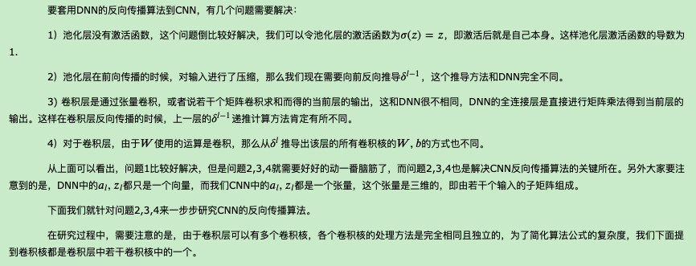

# CNN BP

⌚️: 2020年4月1日

📚参考

- [卷积神经网络(CNN)模型结构](https://www.cnblogs.com/pinard/p/6483207.html)
- [卷积神经网络(CNN)前向传播算法](https://www.cnblogs.com/pinard/p/6489633.html)
- [卷积神经网络(CNN)反向传播算法](https://www.cnblogs.com/pinard/p/6494810.html)

---

## 1. CNN的基本结构

## 2. 初识卷积

## 3. CNN中的卷积层

有了卷积的基本知识，我们现在来看看CNN中的卷积，假如是对图像卷积，回想我们的上一节的卷积公式，其实就是对输入的图像的不同局部的矩阵和卷积核矩阵各个位置的元素相乘，然后相加得到。

举个例子如下，图中的输入是一个二维的3x4的矩阵，而卷积核是一个2x2的矩阵。这里我们假设卷积是一次移动一个像素来卷积的，那么首先我们对输入的左上角2x2局部和卷积核卷积，即各个位置的元素相乘再相加，得到的输出矩阵S的$𝑆_{00}$的元素，值为𝑎𝑤+𝑏𝑥+𝑒𝑦+𝑓𝑧。接着我们将输入的局部向右平移一个像素，现在是(b,c,f,g)四个元素构成的矩阵和卷积核来卷积，这样我们得到了输出矩阵S的$𝑆_{01}$的元素，同样的方法，我们可以得到输出矩阵S的$𝑆_{02}，𝑆_{10}，𝑆_{11}，𝑆_{12}$的元素。

最终我们得到卷积输出的矩阵为一个2x3的矩阵S。

再举一个动态的卷积过程的例子如下：

我们有下面这个绿色的5x5输入矩阵，卷积核是一个下面这个黄色的3x3的矩阵。卷积的步幅是一个像素。则卷积的过程如下面的动图。卷积的结果是一个3x3的矩阵。

上面举的例子都是二维的输入，卷积的过程比较简单，那么如果输入是多维的呢？比如在前面一组卷积层+池化层的输出是3个矩阵，这3个矩阵作为输入呢，那么我们怎么去卷积呢？又比如输入的是对应RGB的彩色图像，即是三个分布对应R，G和B的矩阵呢？

 在斯坦福大学的cs231n的课程上，有一个动态的例子，[链接在这](http://cs231n.github.io/assets/conv-demo/index.html)。建议大家对照着例子中的动图看下面的讲解。

大家打开这个例子可以看到，这里面输入是3个7x7的矩阵。实际上原输入是3个5x5的矩阵。只是在原来的输入周围加上了1的padding，即将周围都填充一圈的0，变成了3个7x7的矩阵。

例子里面使用了两个卷积核，我们先关注于卷积核W0。和上面的例子相比，由于输入是3个7x7的矩阵，或者说是7x7x3的张量，则我们对应的卷积核W0也必须最后一维是3的张量，这里卷积核W0的单个子矩阵维度为3x3。那么卷积核W0实际上是一个3x3x3的张量。同时和上面的例子比，这里的步幅为2，也就是每次卷积后会移动2个像素的位置。

最终的卷积过程和上面的2维矩阵类似，上面是矩阵的卷积，即两个矩阵对应位置的元素相乘后相加。这里是张量的卷积，即两个张量的3个子矩阵卷积后，再把卷积的结果相加后再加上偏倚b。

7x7x3的张量和3x3x3的卷积核张量W0卷积的结果是一个3x3的矩阵。由于我们有两个卷积核W0和W1，因此最后卷积的结果是两个3x3的矩阵。或者说卷积的结果是一个3x3x2的张量。

仔细回味下卷积的过程，输入是7x7x3的张量，卷积核是两个3x3x3的张量。卷积步幅为2，最后得到了输出是3x3x2的张量。如果把上面的卷积过程用数学公式表达出来就是：

## 4. CNN中的池化层

相比卷积层的复杂，池化层则要简单的多，所谓的池化，个人理解就是对输入张量的各个子矩阵进行压缩。假如是2x2的池化，那么就将子矩阵的每2x2个元素变成一个元素，如果是3x3的池化，那么就将子矩阵的每3x3个元素变成一个元素，这样输入矩阵的维度就变小了。

要想将输入子矩阵的每nxn个元素变成一个元素，那么需要一个池化标准。常见的池化标准有2个，MAX或者是Average。即取对应区域的最大值或者平均值作为池化后的元素值。

下面这个例子采用取最大值的池化方法。同时采用的是2x2的池化。步幅为2。

首先对红色2x2区域进行池化，由于此2x2区域的最大值为6.那么对应的池化输出位置的值为6，由于步幅为2，此时移动到绿色的位置去进行池化，输出的最大值为8.同样的方法，可以得到黄色区域和蓝色区域的输出值。最终，我们的输入4x4的矩阵在池化后变成了2x2的矩阵。进行了压缩。

理解了CNN模型中的卷积层和池化层，就基本理解了CNN的基本原理，后面再去理解CNN模型的前向传播算法和反向传播算法就容易了。下一篇我们就来讨论CNN模型的前向传播算法。

## 5. CNN输入层前向传播到卷积层

输入层的前向传播是CNN前向传播算法的第一步。一般输入层对应的都是卷积层，因此我们标题是输入层前向传播到卷积层。

我们这里还是以图像识别为例。

先考虑最简单的，样本都是二维的黑白图片。这样输入层𝑋就是一个矩阵，矩阵的值等于图片的各个像素位置的值。这时和卷积层相连的卷积核𝑊就也是矩阵。

如果样本都是有RGB的彩色图片，这样输入𝑋就是3个矩阵，即分别对应R，G和B的矩阵，或者说是一个张量。这时和卷积层相连的卷积核𝑊就也是张量，对应的最后一维的维度为3.即每个卷积核都是3个子矩阵组成。

同样的方法，对于3D的彩色图片之类的样本，我们的输入𝑋可以是4维，5维的张量，那么对应的卷积核𝑊也是个高维的张量。

不管维度多高，对于我们的输入，前向传播的过程可以表示为：

其中，上标代表层数，星号代表卷积，而b代表我们的偏倚, 𝜎为激活函数，这里一般都是ReLU。

和DNN的前向传播比较一下，其实形式非常的像，只是我们这儿是张量的卷积，而不是矩阵的乘法。同时由于𝑊是张量，那么同样的位置，𝑊参数的个数就比DNN多很多了。

为了简化我们的描述，本文后面如果没有特殊说明，我们都默认输入是3维的张量，即用RBG可以表示的彩色图片。

这里需要我们自己定义的CNN模型参数是：

　　　　1） 一般我们的卷积核不止一个，比如有K个，那么我们输入层的输出，或者说第二层卷积层的对应的输入就K个。

　　　　2） 卷积核中每个子矩阵的的大小，一般我们都用子矩阵为方阵的卷积核，比如FxF的子矩阵。

　　　　3） 填充padding（以下简称P），我们卷积的时候，为了可以更好的识别边缘，一般都会在输入矩阵在周围加上若干圈的0再进行卷积，加多少圈则P为多少。

　　　　4） 步幅stride（以下简称S），即在卷积过程中每次移动的像素距离大小。

　　　　这些参数我们在上一篇都有讲述。

## 6. 隐藏层前向传播到卷积层

## 7. 隐藏层前向传播到池化层

## 8. 隐藏层前向传播到全连接层

##  9. CNN前向传播算法小结

## 10.回顾DNN的反向传播算法

## 11. CNN的反向传播算法思想

## 12. 已知池化层的$𝛿^𝑙$，推导上一隐藏层的$𝛿^{𝑙−1}$

## 13. 已知卷积层的$𝛿^𝑙$，推导上一隐藏层的$𝛿^{𝑙−1}$

## 14. 已知卷积层的$𝛿^𝑙$，推导该层的𝑊,𝑏的梯度

## 15. CNN反向传播算法总结

