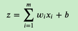
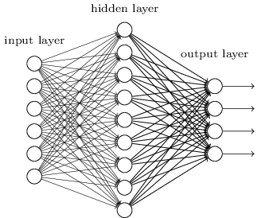

# 深度神经网络（DNN）模型

⌚️: 2021年4月1日

📚参考

- [深度神经网络（DNN）模型与前向传播算法](https://www.cnblogs.com/pinard/p/6418668.html)
- [深度神经网络（DNN）反向传播算法(BP)](https://www.cnblogs.com/pinard/p/6422831.html)

---

## 1. 从感知机到神经网络

在[感知机原理小结](http://www.cnblogs.com/pinard/p/6042320.html)中，我们介绍过感知机的模型，它是一个有若干输入和一个输出的模型，如下图:

输出和输入之间学习到一个线性关系，得到中间输出结果：

接着是一个神经元激活函数:

从而得到我们想要的输出结果1或者-1。

这个模型只能用于二元分类，且无法学习比较复杂的非线性模型，因此在工业界无法使用。

而神经网络则在感知机的模型上做了扩展，总结下主要有三点：

1）加入了隐藏层，隐藏层可以有多层，增强模型的表达能力，如下图实例，当然增加了这么多隐藏层模型的复杂度也增加了好多。

2）输出层的神经元也可以不止一个输出，可以有多个输出，这样模型可以灵活的应用于分类回归，以及其他的机器学习领域比如降维和聚类等。多个神经元输出的输出层对应的一个实例如下图，输出层现在有4个神经元了。

3） 对激活函数做扩展，感知机的激活函数是𝑠𝑖𝑔𝑛(𝑧),虽然简单但是处理能力有限，因此神经网络中一般使用的其他的激活函数，比如我们在逻辑回归里面使用过的Sigmoid函数，即：

还有后来出现的tanx, softmax,和ReLU等。通过使用不同的激活函数，神经网络的表达能力进一步增强。对于各种常用的激活函数，我们在后面再专门讲。

## 2. DNN的基本结构

上一节我们了解了神经网络基于感知机的扩展，而DNN可以理解为有很多隐藏层的神经网络。这个很多其实也没有什么度量标准, 多层神经网络和深度神经网络DNN其实也是指的一个东西，当然，DNN有时也叫做多层感知机（Multi-Layer perceptron,MLP）, 名字实在是多。后面我们讲到的神经网络都默认为DNN。

从DNN按不同层的位置划分，DNN内部的神经网络层可以分为三类，输入层，隐藏层和输出层,如下图示例，一般来说第一层是输入层，最后一层是输出层，而中间的层数都是隐藏层。

层与层之间是全连接的，也就是说，第i层的任意一个神经元一定与第i+1层的任意一个神经元相连。虽然DNN看起来很复杂，但是从小的局部模型来说，还是和感知机一样，即一个线性关系 
$$
𝑧=∑𝑤_𝑖𝑥_𝑖+𝑏
$$
 加上一个激活函数𝜎(𝑧)。

由于DNN层数多，则我们的线性关系系数𝑤和偏倚𝑏的数量也就是很多了。具体的参数在DNN是如何定义的呢？

首先我们来看看线性关系系数𝑤的定义。以下图一个三层的DNN为例，第二层的第4个神经元到第三层的第2个神经元的线性系数定义为$𝑤^3_{24}$。上标3代表线性系数𝑤所在的层数，而下标对应的是输出的第三层索引2和输入的第二层索引4。你也许会问，为什么不是$𝑤^3_{42}$, 而是$𝑤^3_{24}$呢？这主要是为了便于模型用于矩阵表示运算，如果是$𝑤^3_{42}$而每次进行矩阵运算是$𝑤^𝑇𝑥+𝑏$，需要进行转置。将输出的索引放在前面的话，则线性运算不用转置,即直接为𝑤𝑥+𝑏。总结下，第𝑙−1层的第k个神经元到第𝑙层的第j个神经元的线性系数定义为$𝑤^𝑙_{𝑗𝑘}$。注意，输入层是没有𝑤参数的。

 再来看看偏倚𝑏的定义。还是以这个三层的DNN为例，第二层的第三个神经元对应的偏倚定义为$𝑏^2_3$。其中，上标2代表所在的层数，下标3代表偏倚所在的神经元的索引。同样的道理，第三个的第一个神经元的偏倚应该表示为$𝑏^3_1$。同样的，输入层是没有偏倚参数𝑏的。

## 3. DNN前向传播算法数学原理

在上一节，我们已经介绍了DNN各层线性关系系数𝑤,偏倚𝑏的定义。假设我们选择的激活函数是𝜎(𝑧)，隐藏层和输出层的输出值为𝑎，则对于下图的三层DNN,利用和感知机一样的思路，我们可以利用上一层的输出计算下一层的输出，也就是所谓的DNN前向传播算法。

对于第二层的的输出$𝑎^2_1 , 𝑎^2_2 , 𝑎^2_3$，我们有：

对于第三层的的输出$𝑎^3_1$，我们有：

将上面的例子一般化，假设第𝑙−1层共有m个神经元，则对于第𝑙层的第j个神经元的输出$𝑎^𝑙_𝑗$，我们有：

其中，如果𝑙=2,则对于的$𝑎^1_𝑘$即为输入层的$𝑥_𝑘$。

　　　　

从上面可以看出，使用代数法一个个的表示输出比较复杂，而如果使用矩阵法则比较的简洁。假设第𝑙−1层共有m个神经元，而第𝑙层共有n个神经元，则第𝑙层的线性系数𝑤组成了一个𝑛×𝑚的矩阵$𝑊^𝑙$, 第𝑙层的偏倚𝑏组成了一个𝑛×1的向量$𝑏^𝑙$ , 第𝑙−1层的的输出𝑎组成了一个𝑚×1的向量$𝑎^{𝑙−1}$，第𝑙层的的未激活前线性输出𝑧组成了一个𝑛×1的向量$𝑧^𝑙$, 第𝑙层的的输出𝑎组成了一个𝑛×1的向量$𝑎^𝑙$。则用矩阵法表示，第l层的输出为：
$$
\alpha^l = 𝜎(z^l) = 𝜎 (W^l a^{l-1} + b^l)
$$

这个表示方法简洁漂亮，后面我们的讨论都会基于上面的这个矩阵法表示来。

## 4. DNN前向传播算法

有了上一节的数学推导，DNN的前向传播算法也就不难了。所谓的DNN的前向传播算法也就是利用我们的若干个权重系数矩阵𝑊,偏倚向量𝑏来和输入值向量𝑥进行一系列线性运算和激活运算，从输入层开始，一层层的向后计算，一直到运算到输出层，得到输出结果为值。

　　　　输入: 总层数L，所有隐藏层和输出层对应的矩阵𝑊,偏倚向量𝑏，输入值向量𝑥

　　　　输出：输出层的输出$𝑎^𝐿$

　　　　1） 初始化$𝑎^1=𝑥$

　　　　2)  for 𝑙=2 to 𝐿, 计算：
$$
\alpha^l = 𝜎(z^l) = 𝜎(W^l a^{l-1} + b^l)
$$

最后的结果即为输出$𝑎^𝐿$。

单独看DNN前向传播算法，似乎没有什么大用处，而且这一大堆的矩阵𝑊, 偏倚向量𝑏对应的参数怎么获得呢？怎么得到最优的矩阵𝑊,偏倚向量𝑏呢？这个我们在讲DNN的反向传播算法时再讲。而理解反向传播算法的前提就是理解DNN的模型与前向传播算法。这也是我们这一篇先讲的原因。

## 5. DNN反向传播算法要解决的问题

在了解DNN的反向传播算法前，我们先要知道DNN反向传播算法要解决的问题，也就是说，什么时候我们需要这个反向传播算法？　

回到我们监督学习的一般问题，假设我们有m个训练样本：${(𝑥_1 , 𝑦_1),(𝑥_2,𝑦_2),...,(𝑥_𝑚,𝑦_𝑚)}$,其中𝑥为输入向量，特征维度为$𝑛_{𝑖𝑛}$,而𝑦为输出向量，特征维度为$𝑛_{𝑜𝑢𝑡}$。我们需要利用这m个样本训练出一个模型，当有一个新的测试样本$(𝑥_{𝑡𝑒𝑠𝑡},?)$来到时, 我们可以预测$𝑦_{𝑡𝑒𝑠𝑡}$向量的输出。　

如果我们采用DNN的模型，即我们使输入层有$𝑛_{𝑖𝑛}$个神经元，而输出层有$𝑛_{𝑜𝑢𝑡}$个神经元。再加上一些含有若干神经元的隐藏层。此时我们需要找到合适的所有隐藏层和输出层对应的线性系数矩阵𝑊,偏倚向量𝑏,让所有的训练样本输入计算出的输出尽可能的等于或很接近样本输出。怎么找到合适的参数呢？

如果大家对传统的机器学习的算法优化过程熟悉的话，这里就很容易联想到我们可以用一个合适的损失函数来度量训练样本的输出损失，接着对这个损失函数进行优化求最小化的极值，对应的一系列线性系数矩阵𝑊,偏倚向量𝑏即为我们的最终结果。在DNN中，损失函数优化极值求解的过程最常见的一般是通过梯度下降法来一步步迭代完成的，当然也可以是其他的迭代方法比如牛顿法与拟牛顿法。如果大家对梯度下降法不熟悉，建议先阅读我之前写的[梯度下降（Gradient Descent）小结](http://www.cnblogs.com/pinard/p/5970503.html)。

对DNN的损失函数用梯度下降法进行迭代优化求极小值的过程即为我们的反向传播算法。

本篇使用了矩阵向量求导，如果你对这一块不熟悉，请先阅读下我写的[矩阵向量求导系列文章](https://www.cnblogs.com/pinard/p/10750718.html)。

## 6. DNN反向传播算法的基本思路

在进行DNN反向传播算法前，我们需要选择一个损失函数，来度量训练样本计算出的输出和真实的训练样本输出之间的损失。你也许会问：训练样本计算出的输出是怎么得来的？这 个输出是随机选择一系列𝑊,𝑏,用我们上一节的前向传播算法计算出来的。即通过一系列的计算：$𝑎^𝑙 =𝜎(𝑧^𝑙)=𝜎 (𝑊^𝑙 𝑎^{𝑙−1} +𝑏^𝑙)$。计算到输出层第𝐿层对应的$𝑎^𝐿$即为前向传播算法计算出来的输出。

回到损失函数，DNN可选择的损失函数有不少，为了专注算法，这里我们使用最常见的均方差来度量损失。即对于每个样本，我们期望最小化下式：

其中，$𝑎^𝐿$和𝑦为特征维度为$𝑛_{𝑜𝑢𝑡}$的向量,而$||𝑆||_2$为S的L2范数。

损失函数有了，现在我们开始用梯度下降法迭代求解每一层的𝑊,𝑏。

首先是输出层第𝐿层。注意到输出层的𝑊,𝑏满足下式：

这样对于输出层的参数，我们的损失函数变为：

这样求解𝑊,𝑏的梯度就简单了：

## 7. DNN反向传播算法过程

现在我们总结下DNN反向传播算法的过程。由于梯度下降法有批量（Batch），小批量(mini-Batch)，随机三个变种，为了简化描述，这里我们以最基本的批量梯度下降法为例来描述反向传播算法。实际上在业界使用最多的是mini-Batch的梯度下降法。不过区别仅仅在于迭代时训练样本的选择而已。

　　　　有了DNN反向传播算法，我们就可以很方便的用DNN的模型去解决第一节里面提到了各种监督学习的分类回归问题。当然DNN的参数众多，矩阵运算量也很大，直接使用会有各种各样的问题。有哪些问题以及如何尝试解决这些问题并优化DNN模型与算法，我们在下一篇讲。
