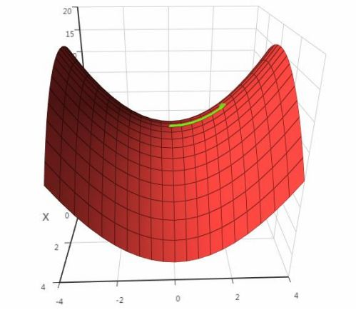
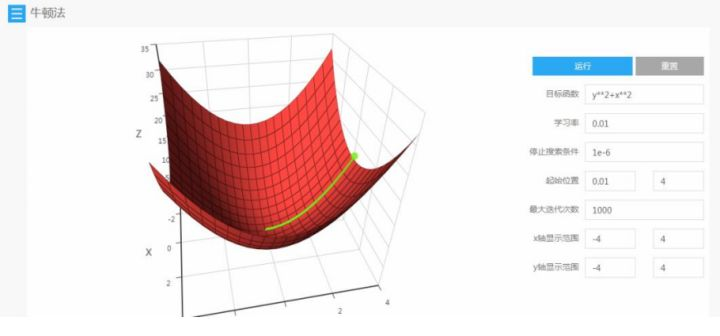
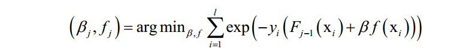

# 优化方法总结

⌚️: 2021年4月1日

📚参考

- [机器学习中的最优化算法总结](https://zhuanlan.zhihu.com/p/42689565)

---

对于几乎所有机器学习算法，无论是有监督学习、无监督学习，还是强化学习，最后一般都归结为**求解最优化问题**。因此，最优化方法在机器学习算法的推导与实现中占据中心地位。在这篇文章中，将对机器学习中所使用的优化算法做一个全面的总结，并理清它们直接的脉络关系，帮你从全局的高度来理解这一部分知识。

## **1. 机器学习要求解的数学模型**

**监督学习**

几乎所有的机器学习算法最后都归结为求一个目标函数的极值，即最优化问题，例如对于有监督学习，我们要找到一个最佳的映射函数f(x)，使得对训练样本的损失函数最小化（最小化经验风险或结构风险）：

在这里，N为训练样本数，L是对单个样本的损失函数，w是要求解的模型参数，是映射函数的参数， ![[x_i]](https://www.zhihu.com/equation?tex=x_%7Bi%7D) 为样本的特征向量，  为样本的标签值。

或是找到一个最优的概率密度函数p(x)，使得对训练样本的对数似然函数极大化（最大似然估计）：

在这里，  是要求解的模型参数，是概率密度函数的参数。

**无监督学习**

对于无监督学习，以聚类算法为例，算法要是的每个类的样本离类中心的距离之和最小化：

在这里k为类型数，x为样本向量，  为类中心向量，  为第i个类的样本集合。

**强化学习**

对于强化学习，我们要找到一个最优的策略，即状态s到动作a的映射函数（确定性策略，对于非确定性策略，是执行每个动作的概率）：

使得任意给定一个状态，执行这个策略函数所确定的动作a之后，得到的累计回报最大化：

这里使用的是状态价值函数。

**总结**

总体来看，机器学习的核心目标是给出一个模型（一般是映射函数），然后定义对这个模型好坏的评价函数（目标函数），求解目标函数的极大值或者极小值，以确定模型的参数，从而得到我们想要的模型。在这三个关键步骤中，前两个是机器学习要研究的问题，建立数学模型。第三个问题是纯数学问题，即最优化方法，为本文所讲述的核心。

- 确定模型（映射函数）
- 确定目标函数
- 根据目标函数优化模型

## **2. 最优化算法的分类**

对于形式和特点各异的机器学习算法优化目标函数，我们找到了适合它们的各种求解算法。除了极少数问题可以用暴力搜索来得到最优解之外，我们将机器学习中使用的优化算法分成两种类型（不考虑随机优化算法如模拟退火、遗传算法等，对于这些算法，我们后面会专门有文章进行介绍）：

1. 公式解
2. 数值优化

前者给出一个最优化问题精确的公式解，也称为解析解，一般是理论结果。后者是在要给出极值点的精确计算公式非常困难的情况下，用数值计算方法近似求解得到最优点。除此之外，还有其他一些求解思想，如分治法，动态规划等。我们在后面单独列出。一个好的优化算法需要满足：

> 能正确的找到各种情况下的极值点
> 速度快

下图给出了这些算法的分类与它们之间的关系：

接下来我们将按照这张图来展开进行讲解。

## **3. 费马定理**

对于一个可导函数，寻找其极值的统一做法是寻找导数为0的点，即费马定理。微积分中的这一定理指出，对于可导函数，在极值点处导数必定为0：

对于多元函数，则是梯度为0：

导数为0的点称为驻点。需要注意的是，导数为0只是函数取得极值的必要条件而不是充分条件，它只是疑似极值点。是不是极值，是极大值还是极小值，还需要看更高阶导数。对于一元函数，假设x是驻点：

1.如果 ![[公式]](https://www.zhihu.com/equation?tex=f%5E%7B%27%27%7D) (x)＞0，则在该点处去极小值

2.如果 ![[公式]](https://www.zhihu.com/equation?tex=f%5E%7B%27%27%7D) (x)＜0，则在该点处去极大值

3.如果 ![[公式]](https://www.zhihu.com/equation?tex=f%5E%7B%27%27%7D) (x)＝0，还要看更高阶导数

对于多元函数，假设x是驻点：

1.如果Hessian矩阵正定，函数在该点有极小值

2.如果Hessian矩阵负定，函数在该点有极大值

3.如果Hessian矩阵不定，则不是极值点

在导数为0的点处，函数可能不取极值，这称为鞍点，下图是鞍点的一个例子（来自SIGAI云端实验室）：

除鞍点外，最优化算法可能还会遇到另外一个问题：局部极值问题，即一个驻点是极值点，但不是全局极值。如果我们对最优化问题加以限定，可以有效的避免这两种问题。典型的是凸优化，它要求优化变量的可行域是凸集，目标函数是凸函数。

虽然驻点只是函数取得极值的必要条件而不是充分条件，但如果我们找到了驻点，再判断和筛选它们是不是极值点，比之前要容易多了。无论是理论结果，还是数值优化算法，一般都以找驻点作为找极值点的目标。对于一元函数，先求导数，然后解导数为0的方程即可找到所有驻点。对于多元函数，对各个自变量求偏导数，令它们为0，解方程组，即可达到所有驻点。这都是微积分中所讲授的基础方法。幸运的是，在机器学习中，很多目标函数都是可导的，因此我们可以使用这套方法。

## **4. 拉格朗日乘数法**

费马定理给出的不带约束条件下的函数极值的必要条件。对于一些实际应用问题，一般还带有等式或者不等式约束条件。对于带等式约束的极值问题，经典的解决方案是拉格朗日乘数法。

对于如下问题：

构造拉格朗日乘子函数：

在最优点处对x和乘子变量  的导数都必须为0：

解这个方程即可得到最优解。对拉格朗日乘数法更详细的讲解可以阅读任何一本高等数学教材。机器学习中用到拉格朗日乘数法的地方有：

> 主成分分析
> 线性判别分析
> 流形学习中的拉普拉斯特征映射
> 隐马尔可夫模型

## **5. KKT条件**

KKT条件是拉格朗日乘数法的推广，用于求解既带有等式约束，又带有不等式约束的函数极值。对于如下优化问题：

和拉格朗日对偶的做法类似，KKT条件构如下乘子函数：

 和  称为KKT乘子。在最优解处  应该满足如下条件：

等式约束  (  )=0和不等式约束  (  ) ![[公式]](https://www.zhihu.com/equation?tex=%5Cleq) 0是本身应该满足的约束， ![[公式]](https://www.zhihu.com/equation?tex=%E2%96%BD_%7Bx%7D) *L*( ![[公式]](https://www.zhihu.com/equation?tex=x%5E%7B%2A%7D) )=0和之前的拉格朗日乘数法一样。唯一多了关于 ![[公式]](https://www.zhihu.com/equation?tex=g_%7Bi%7D) (x)的条件：

KKT条件只是取得极值的必要条件而不是充分条件。在机器学习中用到KKT条件的地方有：

> 支持向量机（SVM）

## **6. 数值优化算法**

前面讲述的三种方法在理论推导、某些可以得到方程组的求根公式的情况（如线性函数，正态分布的最大似然估计）中可以使用，但对绝大多数函数来说，梯度等于0的方程组是没法直接解出来的，如方程里面含有指数函数、对数函数之类的超越函数。对于这种无法直接求解的方程组，我们只能采用近似的算法来求解，即**数值优化算法**。这些数值优化算法一般都利用了目标函数的导数信息，如一阶导数和二阶导数。如果采用一阶导数，则称为一阶优化算法。如果使用了二阶导数，则称为二阶优化算法。

工程上实现时通常采用的是迭代法，它从一个初始点  开始，反复使用某种规则从  移动到下一个点  ，构造这样一个数列，直到收敛到梯度为0的点处。即有下面的极限成立：

这些规则一般会利用一阶导数信息即梯度；或者二阶导数信息即Hessian矩阵。这样迭代法的核心是得到这样的由上一个点确定下一个点的迭代公式：

## **7. 梯度下降法**

梯度下降法沿着梯度的反方向进行搜索，利用了函数的一阶导数信息。梯度下降法的迭代公式为：

根据函数的一阶泰勒展开，在负梯度方向，函数值是下降的。只要学习率 ![[公式]](https://www.zhihu.com/equation?tex=%5Cgamma) 设置的足够小，并且没有到达梯度为0的点处，每次迭代时函数值一定会下降。需要设置学习率为一个非常小的正数的原因是要保证迭代之后的 ![[公式]](https://www.zhihu.com/equation?tex=x_%7Bk%2B1%7D) 位于迭代之前的值 ![[公式]](https://www.zhihu.com/equation?tex=x_%7Bk%7D) 的邻域内，从而可以忽略泰勒展开中的高次项，保证迭代时函数值下降。

梯度下降法及其变种在机器学习中应用广泛，尤其是在深度学习中。

## **8. 动量项**

为了加快梯度下降法的收敛速度，减少震荡，引入了动量项。动量项累积了之前迭代时的梯度值，加上此项之后的参数更新公式为：

其中 ![[公式]](https://www.zhihu.com/equation?tex=V_%7Bt%2B1%7D) 是动量项，它取代了之前的梯度项。动量项的计算公式为：

它是上一时刻的动量项与本次梯度值的加权平均值，其中 ![[公式]](https://www.zhihu.com/equation?tex=%5Calpha) 是学习率， ![[公式]](https://www.zhihu.com/equation?tex=%5Cmu) 是动量项系数。如果按照时间t进行展开，则第t次迭代时使用了从1到t次迭代时的所有梯度值，且老的梯度值安 ![[公式]](https://www.zhihu.com/equation?tex=%5Cmu%5E%7Bt%7D)的系数指数级衰减：

动量项累积了之前迭代时的梯度值，使得本次迭代时沿着之前的惯性方向向前走。

## **10. AdaGrad算法**

AdaGrad算法是梯度下降法最直接的改进。梯度下降法依赖于人工设定的学习率，如果设置过小，收敛太慢，而如果设置太大，可能导致算法那不收敛，为这个学习率设置一个合适的值非常困难。

AdaGrad算法根据前几轮迭代时的历史梯度值动态调整学习率，且优化变量向量x的每一个分量  都有自己的学习率。参数更新公式为：

其中 ![[公式]](https://www.zhihu.com/equation?tex=%5Calpha) 是学习因子， ![[公式]](https://www.zhihu.com/equation?tex=g_%7Bt%7D) 是第t次迭代时参数的梯度向量， ![[公式]](https://www.zhihu.com/equation?tex=%5Cxi) 是一个很小的正数，为了避免除0操作，下标i表示向量的分量。和标准梯度下降法唯一不同的是多了分母中的这一项，它累积了到本次迭代为止梯度的历史值信息用于生成梯度下降的系数值。根据上式，历史导数值的绝对值越大分量学习率越小，反之越大。虽然实现了自适应学习率，但这种算法还是存在问题：需要人工设置一个全局的学习率 ![[公式]](https://www.zhihu.com/equation?tex=%5Calpha) ，随着时间的累积，上式中的分母会越来越大，导致学习率趋向于0，参数无法有效更新。

## **11. RMSProp算法**

RMSProp算法是对AdaGrad的改进，避免了长期累积梯度值所导致的学习率趋向于0的问题。具体做法是由梯度值构造一个向量RMS，初始化为0，按照衰减系数累积了历史的梯度平方值。更新公式为：

AdaGrad直接累加所有历史梯度的平方和，而这里将历史梯度平方值按照 ![[公式]](https://www.zhihu.com/equation?tex=%5Cdelta%5E%7Bt%7D) 衰减之后再累加。参数更新公式为：

其中 ![[公式]](https://www.zhihu.com/equation?tex=%5Cdelta) 是人工设定的参数，与AdaGrad一样，这里也需要人工指定的全局学习率 ![[公式]](https://www.zhihu.com/equation?tex=%5Calpha) 。

## **12. AdaDelta算法**

AdaDelta算法也是对AdaGrad的改进，避免了长期累积梯度值所导致的学习率趋向于0的问题，另外，还去掉了对人工设置的全局学习率的依赖。假设要优化的参数为x，梯度下降法第t次迭代时计算出来的参数梯度值为 ![[公式]](https://www.zhihu.com/equation?tex=g_%7Bt%7D) 。算法首先初始化如下两个向量为0向量：

其中$E(g^2)$是梯度平方（对每个分量分别平分）的累计值，更新公式为：

在这里 ![[公式]](https://www.zhihu.com/equation?tex=g%5E%7B2%7D) 是向量每个元素分别计算平方，后面所有的计算公式都是对向量的每个分量进行。接下来计算如下RMS量：

这也是一个向量，计算时分别对向量的每个分量进行。然后计算参数的更新值：

RMS ![[公式]](https://www.zhihu.com/equation?tex=%5B%E2%96%B3x%5D_%7Bt-1%7D) 的计算公式和这个类似。这个更新值同样通过梯度来构造，只不过学习率是通过梯度的历史值确定的。更新公式为：

参数更新的迭代公式为：

## **13. Adam算法**

Adam算法整合了自适应学习率与动量项。算法用梯度构造了两个向量m和v，前者为动量项，后者累积了梯度的平方和，用于构造自适应学习率。它们的初始值为0，更新公式为：

其中 ![[公式]](https://www.zhihu.com/equation?tex=%5Cbeta_%7B1%7D) ， ![[公式]](https://www.zhihu.com/equation?tex=%5Cbeta_%7B2%7D) 是人工指定的参数，i为向量的分量下标。依靠这两个值构造参数的更新值，参数的更新公式为：

在这里，m类似于动量项，用v来构造学习率。

## **14. 随机梯度下降法**

假设训练样本集有N个样本，有监督学习算法训练时优化的目标是这个数据集上的平均损失函数：

其中L(w, ![[公式]](https://www.zhihu.com/equation?tex=x_%7Bi%7D) , ![[公式]](https://www.zhihu.com/equation?tex=y_%7Bi%7D) )是对单个训练样本( ![[公式]](https://www.zhihu.com/equation?tex=x_%7Bi%7D) , ![[公式]](https://www.zhihu.com/equation?tex=y_%7Bi%7D) )的损失函数，w是需要学习的参数，r(w)是正则化项， ![[公式]](https://www.zhihu.com/equation?tex=%5Clambda) 是正则化项的权重。在训练样本数很大时，如果训练时每次迭代都用所有样本，计算成本太高，作为改进可以在每次迭代时选取一批样本，将损失函数定义在这些样本上。

批量随机梯度下降法在每次迭代中使用上面目标函数的随机逼近值，即只使用M ![[公式]](https://www.zhihu.com/equation?tex=%5Cll) N个随机选择的样本来近似计算损失函数。在每次迭代时要优化的目标函数变为：

随机梯度下降法在概率意义下收敛。

## **15. 牛顿法**

牛顿法是二阶优化技术，利用了函数的一阶和二阶导数信息，直接寻找梯度为0的点。牛顿法的迭代公式为：

其中H为Hessian矩阵，g为梯度向量。牛顿法不能保证每次迭代时函数值下降，也不能保证收敛到极小值点。在实现时，也需要设置学习率，原因和梯度下降法相同，是为了能够忽略泰勒展开中的高阶项。学习率的设置通常采用直线搜索（line search）技术。

在实现时，一般不直接求Hessian矩阵的逆矩阵，而是求解下面的线性方程组：

其解d称为牛顿方向。迭代终止的判定依据是梯度值充分接近于0，或者达到最大指定迭代次数。

牛顿法比梯度下降法有更快的收敛速度，但每次迭代时需要计算Hessian矩阵，并求解一个线性方程组，运算量大。另外，如果Hessian矩阵不可逆，则这种方法失效。对牛顿法更全面的介绍可以阅读SIGAI之前的公众号文章“理解牛顿法”。

牛顿法在logistic回归，AdaBoost算法等机器学习算法中有实际应用。

## 16. **拟牛顿法**

牛顿法在每次迭代时需要计算出Hessian矩阵，并且求解一个以该矩阵为系数矩阵的线性方程组，Hessian矩阵可能不可逆。为此提出了一些改进的方法，典型的代表是拟牛顿法。拟牛顿法的思路是不计算目标函数的Hessian矩阵然后求逆矩阵，而是通过其他手段得到一个近似Hessian矩阵逆的矩阵。具体做法是构造一个近似Hessian矩阵或其逆矩阵的正定对称矩阵，用该矩阵进行牛顿法的迭代。

通过构造目标函数，指定优化算法的参数与初始化迭代值，可以可视化的显示出算法的运行过程，并对不同参数时的求解结果进行比较。

## 17. **可信域牛顿法**

标准牛顿法可能不会收敛到一个最优解，也不能保证函数值会按照迭代序列递减。解决这个问题可以通过调整牛顿方向的步长来实现，目前常用的方法有两种：直线搜索和可信区域法。可信域牛顿法是截断牛顿法的一个变种，用于求解带界限约束的最优化问题。在可信域牛顿法的每一步迭代中，有一个迭代序列 ![[公式]](https://www.zhihu.com/equation?tex=x%5E%7Bk%7D) ，一个可信域的大小 ![[公式]](https://www.zhihu.com/equation?tex=%5CDelta_%7Bk%7D) ，以及一个二次目标函数：

这个式子可以通过泰勒展开得到，忽略二次以上的项，这是对函数下降值：

的近似。算法寻找一个 ![[公式]](https://www.zhihu.com/equation?tex=s%5E%7Bk%7D) ，在满足约束条件丨丨s丨丨 ![[公式]](https://www.zhihu.com/equation?tex=%5Cleq) ![[公式]](https://www.zhihu.com/equation?tex=%5CDelta_%7Bk%7D) 下近似最小化 ![[公式]](https://www.zhihu.com/equation?tex=q_%7Bk%7D) (s)。接下来检查如下比值以更新 ![[公式]](https://www.zhihu.com/equation?tex=w%5E%7Bk%7D) 和 ![[公式]](https://www.zhihu.com/equation?tex=%5CDelta_%7Bk%7D) ：

是函数值的实际减少量和二次近似模型预测方向导致的函数减少量的比值。根据之前的计算结果，再动态调整可信域的大小。

可信域牛顿法在logistic回归，线性支持向量的求解时有实际的应用，具体可以阅读liblinear开源库。

## **18. 分治法**

分治法是一种算法设计思想，它将一个大的问题分解成子问题进行求解。根据子问题解构造出整个问题的解。在最优化方法中，具体做法是每次迭代时只调整优化向量x的一部分分量，其他的分量固定住不动。

## **19. 坐标下降法**

坐标下降法的基本思想是每次对一个变量进行优化，这是一种分治法。假设要求解的优化问题为;

坐标下降法求解流程为每次选择一个分量 ![[公式]](https://www.zhihu.com/equation?tex=x_%7Bi%7D) 进行优化，将其他分量固定住不动，这样将一个多元函数的极值问题转换为一元函数的极值问题。如果要求解的问题规模很大，这种做法能有效的加快速度。

坐标下降法在logistic回归，线性支持向量的求解时有实际的应用，具体可以阅读liblinear开源库。

## **20. SMO算法**

SMO算法也是一种分治法，用于求解支持向量机的对偶问题。加上松弛变量和核函数后的对偶问题为：

SMO算法的核心思想是每次在优化变量中挑出两个分量 ![[公式]](https://www.zhihu.com/equation?tex=%5Calpha_%7Bi%7D) 和 ![[公式]](https://www.zhihu.com/equation?tex=%5Calpha_%7Bj%7D) 进行优化，让其他分量固定，这样能保证满足等式约束条件。之所以要选择两个变量进行优化而不是选择一个变量，是因为这里有等式约束，如果只调整一个变量的值，将会破坏等式约束。

假设选取的两个分量为 ![[公式]](https://www.zhihu.com/equation?tex=%5Calpha_%7Bi%7D) 和 ![[公式]](https://www.zhihu.com/equation?tex=%5Calpha_%7Bj%7D) ，其他分量都固定即当成常数。对这两个变量的目标函数是一个二元二次函数。这个问题还带有等式和不等式约束条件。对这个子问题可以直接求得公式解，就是某一区间内的一元二次函数的极值。

## **21. 分阶段优化**

分阶段优化的做法是在每次迭代时，先固定住优化变量x一部分分量a不动，对另外一部分变量b进行优化；然后再固定住b不动，对b进行优化。如此反复，直至收敛到最优解处。

AdaBoost算法是这种方法的典型代表。AdaBoost算法在训练时采用了指数损失函数：

由于强分类器是多个弱分类器的加权和，代入上面的损失函数中，得到算法训练时要优化的目标函数为：

这里将指数损伤函数拆成了两部分，已有的强分类器 ![[公式]](https://www.zhihu.com/equation?tex=F_%7Bj-1%7D) ，以及当前弱分类器f对训练样本的损失函数，前者在之前的迭代中已经求出，因此可以看成常数。这样目标函数可以简化为：

其中：

这个问题可以分两步求解，首先将弱分类器权重 ![[公式]](https://www.zhihu.com/equation?tex=%5Cbeta) 看成常数，得到最优的弱分类器f。得到弱分类器之后，再优化它的权重系数 ![[公式]](https://www.zhihu.com/equation?tex=%5Cbeta) 。

## **22. 动态规划算法**

动态规划也是一种求解思想，它将一个问题分解成子问题求解，如果整个问题的某个解是最优的，则这个解的任意一部分也是子问题的最优解。这样通过求解子问题，得到最优解，逐步扩展，最后得到整个问题的最优解。

隐马尔可夫模型的解码算法（维特比算法），强化学习中的动态规划算法是这类方法的典型代表，此类算法一般是离散变量的优化，而且是组合优化问题。前面讲述的基于导数的优化算法都无法使用。动态规划算法能高效的求解此类问题，其基础是贝尔曼最优化原理。一旦写成了递归形式的最优化方程，就可以构造算法进行求解。
