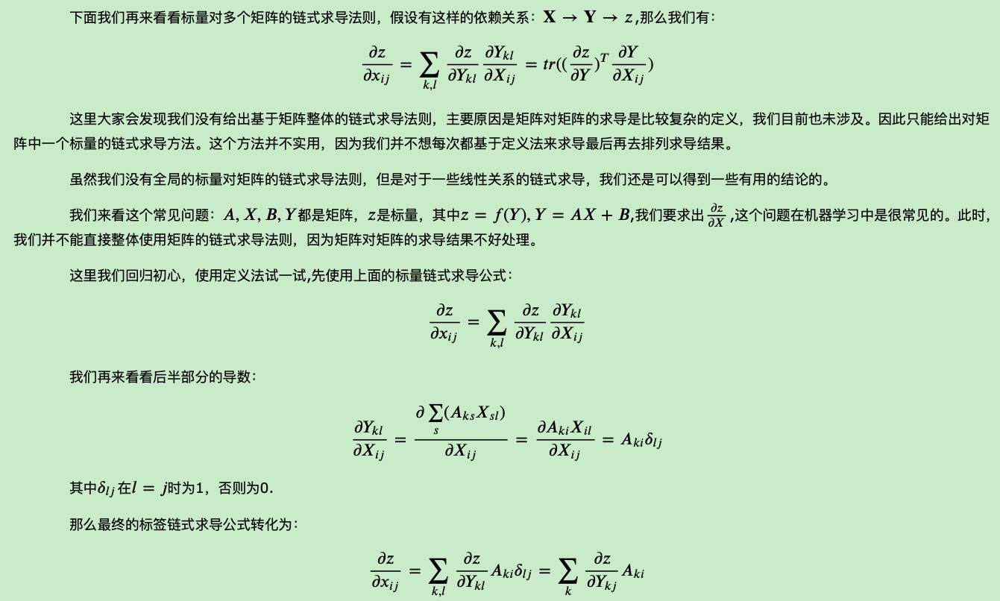

# 矩阵向量求导

⌚️: 2021年4月1日

📚参考

- [求导定义与求导布局](https://www.cnblogs.com/pinard/p/10750718.html)
- [矩阵向量求导之定义法](https://www.cnblogs.com/pinard/p/10773942.html)

- [矩阵向量求导之微分法](https://www.cnblogs.com/pinard/p/10791506.html)

- [矩阵向量求导链式法则](https://www.cnblogs.com/pinard/p/10825264.html)

- [矩阵对矩阵的求导](https://www.cnblogs.com/pinard/p/10930902.html)

---

矩阵求导的本质：矩阵A中的每一个元素对矩阵B中的每一个元素求导。

## 1.求导定义与求导布局

在之前写的上百篇机器学习博客中，不时会使用矩阵向量求导的方法来简化公式推演，但是并没有系统性的进行过讲解，因此让很多朋友迷惑矩阵向量求导的具体过程为什么会是这样的。这里准备用几篇博文来讨论下机器学习中的矩阵向量求导，今天是第一篇。

本系列主要参考文献为维基百科的[Matrix Caculas](https://en.wikipedia.org/wiki/Matrix_calculus)、张贤达的《矩阵分析与应用》、[The Martix cookbook](http://www2.imm.dtu.dk/pubdb/edoc/imm3274.pdf)。

### 1.1 矩阵向量求导引入

在高等数学里面，我们已经学过了标量对标量的求导，比如标量𝑦对标量𝑥的求导，可以表示为$\frac{∂𝑦}{∂𝑥}$。

有些时候，我们会有一组标量$𝑦_𝑖$, 𝑖=1,2,...,𝑚来对一个标量𝑥的求导,那么我们会得到一组标量求导的结果：

如果我们把这组标量写成向量的形式，即得到维度为m的一个向量**𝐲**对一个标量𝑥的求导，那么结果也是一个m维的向量：∂**𝐲**/∂𝑥.

可见，所谓向量对标量的求导，其实就是向量里的每个分量分别对标量求导，最后把求导的结果排列在一起，按一个向量表示而已。类似的结论也存在于标量对向量的求导，向量对向量的求导，向量对矩阵的求导，矩阵对向量的求导，以及矩阵对矩阵的求导等。

**总而言之，所谓的向量矩阵求导本质上就是多元函数求导，仅仅是把把函数的自变量，因变量以及标量求导的结果排列成了向量矩阵的形式，方便表达与计算，更加简洁而已**。

为了便于描述，后面如果没有指明，则求导的自变量用𝑥表示标量，**𝐱**表示n维向量，**𝐗**表示𝑚×𝑛维度的矩阵，求导的因变量用𝑦表示标量，**𝐲**表示m维向量，**𝐘**表示𝑝×𝑞维度的矩阵。

### 1.2 矩阵向量求导定义

根据求导的自变量和因变量是标量，向量还是矩阵，我们有9种可能的矩阵求导定义，如下：

| 自变量\因变量 | 标量𝑦     | 向量**𝐲**     | 矩阵**𝐘**     |
| ------------- | --------- | ------------- | ------------- |
| 标量𝑥         | ∂𝑦/∂𝑥     | ∂**𝐲**/∂𝑥     | ∂**𝐘**/∂𝑥     |
| 向量**𝐱**     | ∂𝑦/∂**𝐱** | ∂**𝐲**/∂**𝐱** | ∂**𝐘**/∂**𝐱** |
| 矩阵**𝐗**     | ∂𝑦∂**𝐗**  | ∂**𝐲**/∂**𝐗** | ∂**𝐘**/∂**𝐗** |

 

这9种里面，标量对标量的求导高数里面就有，不需要我们单独讨论，在剩下的8种情况里面，我们先讨论上图中标量对向量或矩阵求导，向量或矩阵对标量求导，以及向量对向量求导这5种情况。另外三种向量对矩阵的求导，矩阵对向量的求导，以及矩阵对矩阵的求导我们在后面再讲。

现在我们回看第一节讲到的例子，维度为m的一个向量**𝐲**对一个标量𝑥的求导，那么结果也是一个m维的向量：∂**𝐲**/∂𝑥。这是我们表格里面向量对标量求导的情况。这里有一个问题没有讲到，就是这个m维的求导结果排列成的m维向量到底应该是列向量还是行向量？

这个问题的答案是：行向量或者列向量皆可！毕竟我们求导的本质只是把标量求导的结果排列起来，至于是按行排列还是按列排列都是可以的。但是这样也有问题，在我们机器学习算法法优化过程中，如果行向量或者列向量随便写，那么结果就不唯一，乱套了。

为了解决这个问题，我们引入求导布局的概念。

### 1.3  矩阵向量求导布局

为了解决矩阵向量求导的结果不唯一，我们引入求导布局。最基本的求导布局有两个：分子布局(numerator layout)和分母布局(denominator layout )。

对于分子布局来说，我们求导结果的维度以分子为主，比如对于我们上面对标量求导的例子，结果的维度和分子的维度是一致的。也就是说，如果向量**𝐲**是一个m维的列向量，那么求导结果∂**𝐲**/∂𝑥也是一个m维列向量。如果如果向量**𝐲**是一个m维的行向量，那么求导结果∂**𝐲**/∂𝑥也是一个m维行向量。

对于分母布局来说，我们求导结果的维度以分母为主，比如对于我们上面对标量求导的例子，如果向量**𝐲**是一个m维的列向量，那么求导结果∂**𝐲**/∂𝑥是一个m维行向量。如果如果向量**𝐲**是一个m维的行向量，那么求导结果∂**𝐲**/∂𝑥是一个m维的列向量向量。

**可见，对于分子布局和分母布局的结果来说，两者相差一个转置**。

再举一个例子，标量𝑦对矩阵**𝐗**求导，那么如果按分母布局，则求导结果的维度和矩阵𝑋的维度𝑚×𝑛是一致的。如果是分子布局，则求导结果的维度为𝑛×𝑚。

这样，对于标量对向量或者矩阵求导，向量或者矩阵对标量求导这4种情况，对应的分子布局和分母布局的排列方式已经确定了。

稍微麻烦点的是向量对向量的求导，本文只讨论列向量对列向量的求导，其他的行向量求导只是差一个转置而已。比如m维列向量**𝐲**对n维列向量**𝐱**求导。它的求导结果在分子布局和分母布局各是什么呢？对于这2个向量求导，那么一共有𝑚𝑛个标量对标量的求导。求导的结果一般是排列为一个矩阵。如果是分子布局，则矩阵的第一个维度以分子为准，即结果是一个𝑚×𝑛的矩阵，如下：

上边这个按分子布局的向量对向量求导的结果矩阵，我们一般叫做雅克比 (Jacobian)矩阵。有的资料上会使用来定义雅克比矩阵，意义是一样的。

如果是按分母布局，则求导的结果矩阵的第一维度会以分母为准，即结果是一个𝑛×𝑚的矩阵，如下：

上边这个按分母布局的向量对向量求导的结果矩阵，我们一般叫做梯度矩阵。有的资料上会使用来定义梯度矩阵，意义是一样的。

有了布局的概念，我们对于上面5种求导类型，可以各选择一种布局来求导。但是对于某一种求导类型，不能同时使用分子布局和分母布局求导。

但是在机器学习算法原理的资料推导里，我们并没有看到说正在使用什么布局，也就是说布局被隐含了，这就需要自己去推演，比较麻烦。但是一般来说我们会使用一种叫混合布局的思路，即如果是向量或者矩阵对标量求导，则使用分子布局为准，如果是标量对向量或者矩阵求导，则以分母布局为准。对于向量对对向量求导，有些分歧，我的所有文章中会以分子布局的雅克比矩阵为主。

具体总结如下：

| 自变量\因变量  | 标量𝑦                                                        | 列向量**𝐲**(m)                                               | 矩阵**𝐘**(p*q)                                               |
| -------------- | :----------------------------------------------------------- | ------------------------------------------------------------ | ------------------------------------------------------------ |
| 标量𝑥          | /                                                            | ∂**𝐲**/∂𝑥 分子布局：m维列向量（默认布局） 分母布局：m维行向量 | ∂**𝐘**/∂𝑥 分子布局：𝑝×𝑞矩阵（默认布局） 分母布局：𝑞×𝑝矩阵 |
| 列向量**𝐱**(n) | ∂𝑦/∂**𝐱** 分子布局：n维行向量 分母布局：n维列向量（默认布局） | ∂**𝐲**/∂**𝐱** 分子布局：𝑚×𝑛雅克比矩阵（默认布局） 分母布局：𝑛×𝑚梯度矩阵 | /                                                            |
| 矩阵**𝐗**(m*n) | ∂𝑦/∂**𝐗** 分子布局：𝑛×𝑚矩阵 分母布局：𝑚×𝑛矩阵（默认布局） | /                                                            | /                                                            |

### 1.4  矩阵向量求导基础总结

有了矩阵向量求导的定义和默认布局，我们后续就可以对上表中的5种矩阵向量求导过程进行一些常见的求导推导总结求导方法，并讨论向量求导的链式法则。

## 2. 矩阵向量求导之定义法

在 求导定义与求导布局中，我们讨论了向量矩阵求导的9种定义与求导布局的概念。今天我们就讨论下其中的标量对向量求导，标量对矩阵求导, 以及向量对向量求导这三种场景的基本求解思路。

对于本文中的标量对向量或矩阵求导这两种情况，如前文所说，**以分母布局为默认布局**。向量对向量求导，**以分子布局为默认布局**。如遇到其他文章中的求导结果和本文不同，请先确认使用的求导布局是否一样。另外，由于机器学习中向量或矩阵对标量求导的场景很少见，本系列不会单独讨论这两种求导过程。

### 2.1 用定义法求解标量对向量求导

标量对向量求导，严格来说是实值函数对向量的求导。即定义实值函数𝑓:$𝑅^𝑛$→𝑅,自变量**𝐱**是n维向量，而输出𝑦是标量。对于一个给定的实值函数，如何求解∂𝑦/∂**𝐱**呢？

首先我们想到的是基于矩阵求导的定义来做，由于所谓标量对向量的求导，其实就是标量对向量里的每个分量分别求导，最后把求导的结果排列在一起，按一个向量表示而已。那么我们可以将实值函数对向量的每一个分量来求导，最后找到规律，得到求导的结果向量。

首先我们来看一个简单的例子：

根据定义，我们先对**𝐱**的第i个分量进行求导，这是一个标量对标量的求导，如下：

可见，对向量的第i个分量的求导结果就等于向量**𝐚**的第i个分量。由于我们是分母布局，最后所有求导结果的分量组成的是一个n维向量。那么其实就是向量**𝐚**。也就是说：

同样的思路，我们也可以直接得到：

给一个简单的测试，大家看看自己能不能按定义法推导出:

再来看一个复杂一点点的例子：

我们对**𝐱**的第k个分量进行求导如下：

这个第k个分量的求导结果稍微复杂些了，仔细观察一下，第一部分是矩阵**𝐀**的第k列转置后和𝑥相乘得到，第二部分是矩阵**𝐀**的第k行和𝑥相乘得到，排列好就是: 

从上面可以看出，定义法求导对于简单的实值函数是很容易的，但是复杂的实值函数就算求出了任意一个分量的导数，要排列出最终的求导结果还挺麻烦的，因此我们需要找到其他的简便一些的方法来整体求导，而不是每次都先去针对任意一个分量，再进行排列。

### 2.2  标量对向量求导的一些基本法则

在我们寻找一些简单的方法前，我们简单看下标量对向量求导的一些基本法则，这些法则和标量对标量求导的过程类似。

### 2.3  用定义法求解标量对矩阵求导

### 2.4 用定义法求解向量对向量求导

### 2.5 定义法矩阵向量求导的局限

使用定义法虽然已经求出一些简单的向量矩阵求导的结果，但是对于复杂的求导式子，则中间运算会很复杂，同时求导出的结果排列也是很头痛的。下一篇我们讨论使使用矩阵微分和迹函数的方法来求解矩阵向量求导。　

## 3. 矩阵向量求导之微分法

在矩阵向量求导之定义法中，我们讨论了定义法求解矩阵向量求导的方法，但是这个方法对于比较复杂的求导式子，中间运算会很复杂，同时排列求导出的结果也很麻烦。因此我们需要其他的一些求导方法。本文我们讨论使用微分法来求解标量对向量的求导，以及标量对矩阵的求导。

本文的标量对向量的求导，以及标量对矩阵的求导使用分母布局。如果遇到其他资料求导结果不同，请先确认布局是否一样。

### 3.1 矩阵微分

### 3.2 矩阵微分的性质

我们在讨论如何使用矩阵微分来求导前，先看看矩阵微分的性质：

有了这些性质，我们再来看看如何由矩阵微分来求导数。

### 3.3 使用微分法求解矩阵向量求导

由于第一节我们已经得到了矩阵微分和导数关系，现在我们就来使用微分法求解矩阵向量求导。

若标量函数𝑓是矩阵𝑋经加减乘法、逆、行列式、逐元素函数等运算构成，则使用相应的运算法则对𝑓求微分，再使用迹函数技巧给𝑑𝑓套上迹并将其它项交换至𝑑𝑋左侧,那么对于迹函数里面在𝑑𝑋左边的部分，我们只需要加一个转置就可以得到导数了。

这里需要用到的迹函数的技巧主要有这么几个：

以上就是微分法的基本流程，先求微分再做迹函数变换，最后得到求导结果。比起定义法，我们现在不需要去对矩阵中的单个标量进行求导了。

再来看看

以上就是微分法的基本思路。

### 3.4 迹函数对向量矩阵求导

由于微分法使用了迹函数的技巧，那么迹函数对对向量矩阵求导这一大类问题，使用微分法是最简单直接的。下面给出一些常见的迹函数的求导过程，也顺便给大家熟练掌握微分法的技巧。

### 3.5 微分法求导小结

使用矩阵微分，可以在不对向量或矩阵中的某一元素单独求导再拼接，因此会比较方便，当然熟练使用的前提是对上面矩阵微分的性质，以及迹函数的性质熟练运用。

还有一些场景，求导的自变量和因变量直接有复杂的多层链式求导的关系，此时微分法使用起来也有些麻烦。如果我们可以利用一些常用的简单求导结果，再使用链式求导法则，则会非常的方便。因此下一篇我们讨论向量矩阵求导的链式法则。

## 4. 矩阵向量求导链式法则

在矩阵向量求导之微分法中，我们讨论了使用微分法来求解矩阵向量求导的方法。但是很多时候，求导的自变量和因变量直接有复杂的多层链式求导的关系，此时微分法使用起来也有些麻烦。需要一些简洁的方法。

本文我们讨论矩阵向量求导链式法则，使用该法则很多时候可以帮我们快速求出导数结果。

本文的标量对向量的求导，标量对矩阵的求导使用分母布局， 向量对向量的求导使用分子布局。如果遇到其他资料求导结果不同，请先确认布局是否一样。

### 4.1  向量对向量求导的链式法则

### 4.2 标量对多个向量的链式求导法则

其中最后一步转换使用了如下求导公式：

这两个式子我们在前几篇里已有求解过，现在可以直接拿来使用了，非常方便。

当然上面的问题使用微分法求导数也是非常简单的，这里只是给出链式求导法的思路

### 4.3 标量对多个矩阵的链式求导法则

### 4.4  矩阵向量求导小结

矩阵向量求导在前面我们讨论三种方法，定义法，微分法和链式求导法。在同等情况下，优先考虑链式求导法，尤其是第三节的四个结论。其次选择微分法、在没有好的求导方法的时候使用定义法是最后的保底方案。

基本上大家看了系列里这四篇后对矩阵向量求导就已经很熟悉了，对于机器学习中出现的矩阵向量求导问题已足够。这里还没有讲到的是矩阵对矩阵的求导，还有矩阵对向量，向量对矩阵求导这三种形式，这个我们在系列的下一篇，也是最后一篇简单讨论一下，如果大家只是关注机器学习的优化问题，不涉及其他应用数学问题的，可以不关注。

## 5. 矩阵对矩阵的求导

在矩阵向量求导前4节文章中，我们主要讨论了标量对向量矩阵的求导，以及向量对向量的求导。本文我们就讨论下之前没有涉及到的矩阵对矩阵的求导，还有矩阵对向量，向量对矩阵求导这几种形式的求导方法。

本文所有求导布局以分母布局为准，为了适配矩阵对矩阵的求导，本文向量对向量的求导也以分母布局为准，这和前面的文章不同，需要注意。

本篇主要参考了张贤达的《矩阵分析与应用》和长躯鬼侠的[矩阵求导术](https://zhuanlan.zhihu.com/p/24863977)

### 5.1 矩阵对矩阵求导的定义

### 5.2 矩阵对矩阵求导的微分法

### 5.3 矩阵对矩阵求导实例

### 5.4 矩阵对矩阵求导小结

由于矩阵对矩阵求导的结果包含克罗内克积，因此和之前我们讲到的其他类型的矩阵求导很不同，在机器学习算法优化中中，我们一般不在推导的时候使用矩阵对矩阵的求导，除非只是做定性的分析。如果遇到矩阵对矩阵的求导不好绕过，一般可以使用[机器学习中的矩阵向量求导(四) 矩阵向量求导链式法则](https://www.cnblogs.com/pinard/p/10825264.html)中第三节最后的几个链式法则公式来避免。

到此机器学习中的矩阵向量求导系列就写完了，希望可以帮到对矩阵求导的推导过程感到迷茫的同学们。
