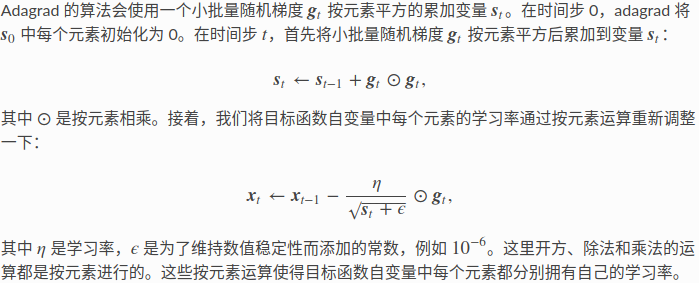

# 梯度下降算法

⌚️: 2021年4月1日

📚参考

- [神经网络优化方法总结：SGD，Momentum，AdaGrad，RMSProp，Adam](https://www.cnblogs.com/zongfa/p/9727073.html)

- [一文看懂各种神经网络优化算法：从梯度下降到Adam方法](https://zhuanlan.zhihu.com/p/27449596)

- [深度学习——优化器算法Optimizer详解（BGD、SGD、MBGD、Momentum、NAG、Adagrad、Adadelta、RMSprop、Adam](https://www.cnblogs.com/guoyaohua/p/8542554.html)

---

**什么是优化算法**？

优化算法的功能，是通过改善训练方式，来最小化(或最大化)损失函数E(x)。

**优化算法主要分为两大类**：

1. 一阶优化算法

这种算法使用各参数的梯度值来最小化或最大化损失函数E(x)。最常用的一阶优化算法是梯度下降。

函数梯度：导数dy/dx的多变量表达式，用来表示y相对于x的瞬时变化率。往往为了计算多变量函数的导数时，会用梯度取代导数，并使用偏导数来计算梯度。梯度和导数之间的一个主要区别是函数的梯度形成了一个向量场。因此，对单变量函数，使用导数来分析；而梯度是基于多变量函数而产生的。更多理论细节在这里不再进行详细解释。

2. 二阶优化算法

二阶优化算法使用了二阶导数(也叫做Hessian方法)来最小化或最大化损失函数。由于二阶导数的计算成本很高，所以这种方法并没有广泛使用。

## 1.  Gradient Descent

### 1.1 Batch Gradient Descent

在每一轮的训练过程中，Batch Gradient Descent算法用整个训练集的数据计算cost fuction的梯度，并用该梯度对模型参数进行更新：

或者

#### 1.1.1 **优点:**

- cost fuction若为凸函数，能够保证收敛到全局最优值；若为非凸函数，能够收敛到局部最优值

#### 1.1.2 **缺点:**

- 由于每轮迭代都需要在整个数据集上计算一次，所以批量梯度下降可能**非常慢**
- 训练数较多时，需要较**大内存**
- 批量梯度下降不允许在线更新模型，例如新增实例。

### **1.2 Stochastic Gradient Descent**

和批梯度下降算法相反，Stochastic gradient descent 算法每读入一个数据，便立刻计算cost fuction的梯度来更新参数：

or

频繁的更新使得参数间具有高方差，损失函数会以不同的强度波动。这实际上是一件好事，因为它有助于我们发现新的和可能更优的局部最小值，而标准梯度下降将只会收敛到某个局部最优值。但SGD的问题是，由于频繁的更新和波动，最终将收敛到最小限度，并会因波动频繁存在超调量。虽然已经表明，当缓慢降低学习率η时，标准梯度下降的收敛模式与SGD的模式相同。

#### 1.2.1 **优点:**

- 算法收敛速度快(在Batch Gradient Descent算法中, 每轮会计算很多相似样本的梯度, 这部分是冗余的)
- 可以在线更新
- 有几率跳出一个比较差的局部最优而收敛到一个更好的局部最优甚至是全局最优

#### **1.2.2 缺点:**

- 容易收敛到局部最优，并且容易被困在鞍点
- **SGD 因为更新比较频繁，会造成 cost function 有严重的震荡。**

### 1.3 **Mini-batch Gradient Descent**

mini-batch Gradient Descent的方法是在上述两个方法中取折衷, 每次从所有训练数据中取一个子集（mini-batch） 用于计算梯度：

or

Mini-batch Gradient Descent在每轮迭代中仅仅计算一个mini-batch的梯度，不仅计算效率高，而且收敛较为稳定。该方法是目前深度学训练中的主流方法

### 1.3.1 优点

- 1) 可以减少参数更新的波动，最终得到效果更好和更稳定的收敛。(**可以降低参数更新时的方差，收敛更稳定**)
- 2) 还可以使用最新的深层学习库中通用的矩阵优化方法，使计算小批量数据的梯度更加高效。
- 3) 通常来说，小批量样本的大小范围是从50到256，可以根据实际问题而有所不同。
- 4) 在训练神经网络时，通常都会选择小批量梯度下降算法。

### 1.4 挑战

上述三个方法面临的主要**挑战**如下：

- 选择适当的学习率α 较为困难。太小的学习率会导致收敛缓慢，而学习速度太块会造成较大波动，妨碍收敛。
- 目前可采用的方法是在训练过程中调整学习率大小，例如模拟退火算法：预先定义一个迭代次数m，每执行完m次训练便减小学习率，或者当cost function的值低于一个阈值时减小学习率。然而迭代次数和阈值必须事先定义，因此无法适应数据集的特点。
- 上述方法中, 每个参数的 learning rate 都是相同的，这种做法是不合理的：如果训练数据是稀疏的，并且不同特征的出现频率差异较大，那么比较合理的做法是对于出现频率低的特征设置较大的学习速率，对于出现频率较大的特征数据设置较小的学习速率。
- 近期的的研究表明，深层神经网络之所以比较难训练，并不是因为容易进入local minimum。相反，由于网络结构非常复杂，在绝大多数情况下即使是 local minimum 也可以得到非常好的结果。而之所以难训练是因为学习过程容易陷入到马鞍面中，即在坡面上，一部分点是上升的，一部分点是下降的。而这种情况比较容易出现在平坦区域，在这种区域中，所有方向的梯度值都几乎是 0。

## **2. Momentum**

SGD方法的一个缺点是其更新方向完全依赖于当前batch计算出的梯度，因而十分不稳定。Momentum算法借用了物理中的动量概念，它模拟的是物体运动时的惯性，即更新的时候在一定程度上保留之前更新的方向，同时利用当前batch的梯度微调最终的更新方向。这样一来，可以在一定程度上增加稳定性，从而学习地更快，并且还有一定摆脱局部最优的能力：

or

Momentum算法会观察历史梯度$v_{t−1}$。

这里的动量与经典物理学中的动量是一致的，就像从山上投出一个球，在下落过程中收集动量，小球的速度不断增加。

在参数更新过程中，其原理类似：

- 1) 使网络能更优和更稳定的收敛；
- 2) 减少振荡过程。

当其梯度指向实际移动方向时，动量项γ增大；当梯度与实际移动方向相反时，γ减小。这种方式意味着动量项只对相关样本进行参数更新，减少了不必要的参数更新，从而得到更快且稳定的收敛，也减少了振荡过程。

## **3. Nesterov Momentum**（**Nesterov Accelerated Gradient**）

一位名叫Yurii Nesterov研究员，认为动量方法存在一个问题：

如果一个滚下山坡的球，盲目沿着斜坡下滑，这是非常不合适的。一个更聪明的球应该要注意到它将要去哪，因此在上坡再次向上倾斜时小球应该进行减速。

实际上，当小球达到曲线上的最低点时，动量相当高。由于高动量可能会导致其完全地错过最小值，因此小球不知道何时进行减速，故继续向上移动。

Yurii Nesterov在1983年发表了一篇关于解决动量问题的论文，因此，我们把这种方法叫做Nestrov梯度加速法。

在该方法中，他提出先根据之前的动量进行大步跳跃，然后计算梯度进行校正，从而实现参数更新。这种预更新方法能防止大幅振荡，不会错过最小值，并对参数更新更加敏感。

Nesterov梯度加速法（NAG）是一种赋予了动量项预知能力的方法，通过使用动量项γV(t−1)来更改参数θ。通过计算θ−γV(t−1)，得到下一位置的参数近似值，这里的参数是一个粗略的概念。因此，我们不是通过计算当前参数θ的梯度值，而是通过相关参数的大致未来位置，来有效地预知未来。

在小球向下滚动的过程中，我们希望小球能够提前知道在哪些地方坡面会上升，这样在遇到上升坡面之前，小球就开始减速。这方法就是Nesterov Momentum，其在凸优化中有较强的理论保证收敛。并且，在实践中Nesterov Momentum也比单纯的 Momentum 的效果好：

or

**用 θ−γv_t−1 来近似当做参数下一步会变成的值，则在计算梯度时，不是在当前位置，而是未来的位置上**

其核心思想是：注意到 momentum 方法，如果只看 γ * v 项，那么当前的 θ经过 momentum 的作用会变成 θ+γ * v。因此可以把 θ+γ * v这个位置看做是当前优化的一个”展望”位置。所以，可以在 θ+γ * v求导, 而不是原始的θ。 

蓝色是 Momentum 的过程，会先计算当前的梯度，然后在更新后的累积梯度后会有一个大的跳跃。
而 NAG 会先在前一步的累积梯度上(brown vector)有一个大的跳跃，然后衡量一下梯度做一下修正(red vector)，这种预期的更新可以避免我们走的太快。

NAG 可以使 RNN 在很多任务上有更好的表现。

目前为止，我们可以做到，**在更新梯度时顺应 loss function 的梯度来调整速度，并且对 SGD 进行加速**。

**我们还希望可以根据参数的重要性而对不同的参数进行不同程度的更新。**

## **4. Adagrad**（Adaptive gradient algorithm）

上述方法中，对于每一个参数$θ_i$ 的训练都使用了相同的学习率α。Adagrad算法能够在训练中自动的对learning rate进行调整，对于出现频率较低参数采用较大的α更新；相反，对于出现频率较高的参数采用较小的α更新。因此，Adagrad非常适合处理稀疏数据。

Adagrad的缺点是在训练的中后期，分母上梯度平方的累加将会越来越大，从而梯度趋近于0，使得训练提前结束。

--**另一种说法**

## **5. RMSprop**

RMSprop是Geoff Hinton提出的一种自适应学习率方法。Adagrad会累加之前所有的梯度平方，而RMSprop仅仅是计算对应的平均值，因此可缓解Adagrad算法学习率下降较快的问题。

--**另一种说法**

## **6. Adadelta**

除了 RMSProp 以外，另一个常用优化算法 Adadelta 也针对 Adagrad 在迭代后期可能较难找到有用解的问题做了改进 [1]。有意思的是，**Adadelta 没有学习率这一超参数**。

--**另一种说法**

## **7. Adam**(Adaptive Moment Estimation)

Adam(Adaptive Moment Estimation)是另一种自适应学习率的方法。它利用梯度的一阶矩估计和二阶矩估计动态调整每个参数的学习率。Adam的优点主要在于经过偏置校正后，每一次迭代学习率都有个确定范围，使得参数比较平稳。公式如下： 

另外，在数据比较稀疏的时候，adaptive的方法能得到更好的效果，例如Adagrad，RMSprop, Adam 等。Adam 方法也会比 RMSprop方法收敛的结果要好一些, 所以在实际应用中 ，Adam为最常用的方法，可以比较快地得到一个预估结果。

--**另一种说法**

## 8. 对比图

最后两张动图从直观上展现了算法的优化过程。第一张图为不同算法在损失平面等高线上随时间的变化情况，第二张图为不同算法在鞍点处的行为比较。

　　　　　　　　

##  **9.如何选择优化算法**

**如果数据是稀疏的，就用自适用方法，即 Adagrad, Adadelta, RMSprop, Adam。**

**RMSprop, Adadelta, Adam 在很多情况下的效果是相似的。**

**Adam 就是在 RMSprop 的基础上加了 bias-correction 和 momentum，**

**随着梯度变的稀疏，Adam 比 RMSprop 效果会好。**

整体来讲，**Adam 是最好的选择**。

很多论文里都会用 SGD，没有 momentum 等。**SGD 虽然能达到极小值，但是比其它算法用的时间长，而且可能会被困在鞍点**。

如果需要更快的收敛，或者是训练更深更复杂的神经网络，需要用一种自适应的算法。

