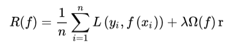
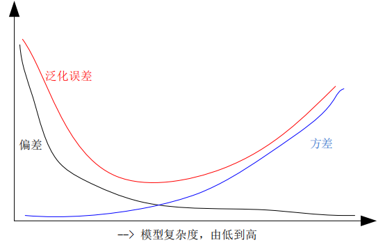
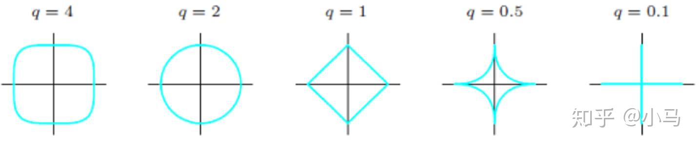
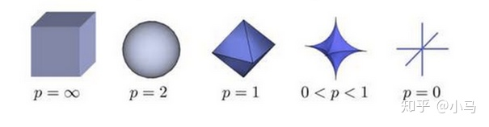
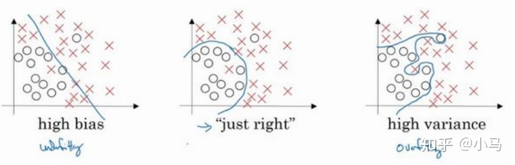
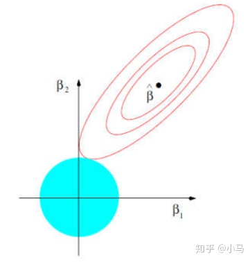
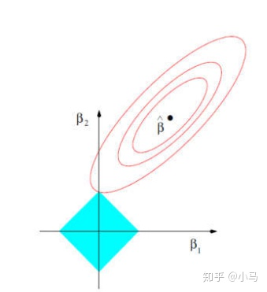
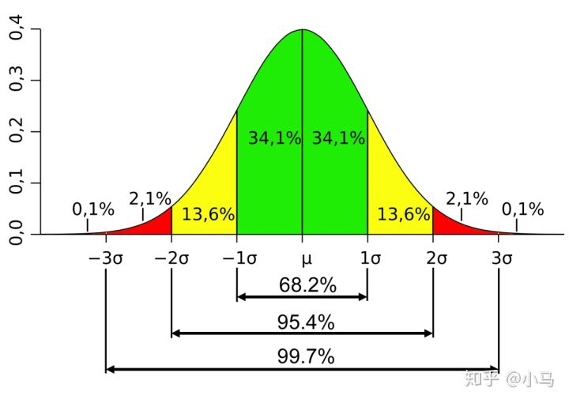
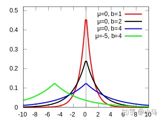
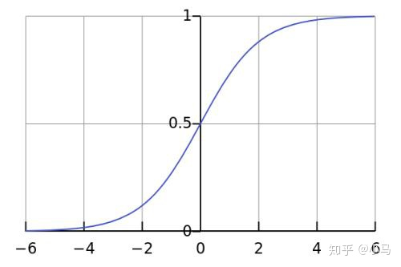

# **正则化**

⌚️: 2020年7月30日

📚参考

- [原文地址](https://zhuanlan.zhihu.com/p/97628712)

---

## **1.  正则化作用**

正则化技术广泛应用在机器学习和深度学习算法中，其本质作用是**防止过拟合、提高模型泛化能力**。过拟合简单理解就是训练的算法模型太过复杂了，过分考虑了当前样本结构。其是防止过拟合的其中一种技术手段。在早期的机器学习领域一般只是将范数惩罚叫做正则化技术，而在深度学习领域认为：能够显著减少方差，而不过度增加偏差的策略都可以认为是正则化技术，故推广的正则化技术还有：扩增样本集、早停止、Dropout、集成学习、多任务学习、对抗训练、参数共享等。对于机器学习领域的正则化技术可以从以下几个不同角度来理解：

### **1.1 正则化等价于结构风险最小化**

**正则化等价于结构风险最小化，其是通过在经验风险项后加上表示模型复杂度的正则化项或惩罚项，达到选择经验风险和模型复杂度都较小的模型目的**

**经验风险：** 机器学习中的风险是指模型与真实解之间的误差的积累，经验风险是指使用训练出来的模型进行预测或者分类，存在多大的误差，可以简单理解为训练误差，经验风险最小化即为训练误差最小

**结构风险：** 结构风险定义为经验风险与置信风险（置信是指可信程度）的和，置信风险越大，模型推广能力越差。可以简单认为结构风险是经验风险后面多加了一项表示模型复杂度的函数项，从而可以同时控制模型训练误差和测试误差，结构风险最小化即为在保证模型分类精度(经验风险)的同时，降低模型复杂度，提高泛化能力

其中，![[公式]](https://www.zhihu.com/equation?tex=R%28f%29)表示结构风险，![[公式]](https://www.zhihu.com/equation?tex=L%5Cleft%28y_%7Bi%7D%2C+f%5Cleft%28x_%7Bi%7D%5Cright%29%5Cright%29)表示第![[公式]](https://www.zhihu.com/equation?tex=i)个样本的经验风险，![[公式]](https://www.zhihu.com/equation?tex=%5COmega%28f%29)表征模型复杂度的正则项，![[公式]](https://www.zhihu.com/equation?tex=%5Clambda)是正则化参数。根据奥卡姆剃刀定律，“如无必要，勿增实体”，即认为相对简单的模型泛化能力更好。而模型泛化能力强、泛化误差小，即表示模型推广能力强，通俗理解就是在训练集中训练得到的优秀模型能够很好的适用于实际测试数据，而不仅仅是减少训练误差或者测试误差。泛化误差定义如下：

![[公式]](https://www.zhihu.com/equation?tex=E%3D%5Coperatorname%7BBias%7D%5E%7B2%7D%28X%29%2B%5Coperatorname%7BVar%7D%28X%29%2B%5Ctext+%7BNoise%7D+%5C%5C)

其中，![[公式]](https://www.zhihu.com/equation?tex=E)表示泛化误差，![[公式]](https://www.zhihu.com/equation?tex=B+i+a+s)代表偏差，![[公式]](https://www.zhihu.com/equation?tex=Var)代表方差，![[公式]](https://www.zhihu.com/equation?tex=Noise)代表噪声，如图所示为泛化误差与偏差和方差的关系：

从上图可以看出，随着训练程度加深，模型复杂度会增加，偏差减少，方差增大，而泛化误差呈现 U 型变化，对于一个“好的系统”通常要求误差小，正则化的作用即为适当的控制模型复杂度，从而使得泛化误差曲线取最小值

### **1.2 正则化等价于带约束的目标函数中的约束项**

以平方误差损失函数和![[公式]](https://www.zhihu.com/equation?tex=%5Cmathrm%7BL%7D+2)范数为例，优化问题的数学模型为：

![[公式]](https://www.zhihu.com/equation?tex=J%28%5Ctheta%29%3D%5Csum_%7Bi%3D1%7D%5E%7Bn%7D%5Cleft%28y_%7Bi%7D-%5Ctheta%5E%7BT%7D+x_%7Bi%7D%5Cright%29%5E%7B2%7D+%5C%5C)![[公式]](https://www.zhihu.com/equation?tex=%5Ctext+%7B+s.t.+%7D+%5Cquad%5C%7C%5Ctheta%5C%7C_%7B2%7D%5E%7B2%7D+%5Cleq+C+%5C%5C)

针对上述带约束条件的优化问题，采用拉格朗日乘积算子法可以转化为无约束优化问题，即：

![[公式]](https://www.zhihu.com/equation?tex=J%28%5Ctheta%29%3D%5Csum_%7Bi%3D1%7D%5E%7Bn%7D%5Cleft%28y_%7Bi%7D-w%5E%7BT%7D+x_%7Bi%7D%5Cright%29%5E%7B2%7D%2B%5Clambda%5Cleft%28%5C%7C%5Ctheta%5C%7C_%7B2%7D%5E%7B2%7D-C%5Cright%29+%5C%5C)

由于参数![[公式]](https://www.zhihu.com/equation?tex=C)为常数，可以忽略，故上述公式和标准的正则化公式完全一致

### **1.3 从贝叶斯角度考虑**

**从贝叶斯角度考虑，正则项等价于引入参数的模型先验概率，可以简单理解为对最大似然估计（MLE）引入先验概率，从而转化为最大后验估计（MAP），其中的先验概率即对于正则项**

## **2 正则化技术基本概念**

### **2.1 正则化**

正则化也可以称为规则化、权重衰减技术，不同的领域叫法不一样，数学上常称为范数，例如![[公式]](https://www.zhihu.com/equation?tex=L1)和![[公式]](https://www.zhihu.com/equation?tex=L2)范数，统计学领域叫做惩罚项、罚因子，以信号降噪为例：

![[公式]](https://www.zhihu.com/equation?tex=x%28i%29%5E%7B%2A%7D%3D%5Carg+%5Cmin+_%7Bx%28i%29%7D%5Cleft%5C%7BF%28x%28i%29%29%3D%5Cfrac%7B1%7D%7B2%7D%5C%7Cy%28i%29-x%28i%29%5C%7C_%7B2%7D%5E%7B2%7D%2B%5Clambda+R%28x%28i%29%29%5Cright%5C%7D+%5C%5C)

其中，![[公式]](https://www.zhihu.com/equation?tex=x%28i%29)既可以是原始信号，也可以是小波或者傅立叶变换等的系数，![[公式]](https://www.zhihu.com/equation?tex=R%28x%28i%29%29)是罚函数（范数罚），![[公式]](https://www.zhihu.com/equation?tex=%5Clambda)是正则化参数，![[公式]](https://www.zhihu.com/equation?tex=y%28i%29)是传感器采集到的含噪信号，![[公式]](https://www.zhihu.com/equation?tex=i%3D%5C%7B0%2C+%5Cldots%2C+N-1%5C%7D)，![[公式]](https://www.zhihu.com/equation?tex=N)为信号点数，![[公式]](https://www.zhihu.com/equation?tex=x%28i%29%5E%7B%2A%7D)为降噪后输出，上述公式中的正则化技术作用和机器学习中的完全一样

### **2.2 范数**

（1）![[公式]](https://www.zhihu.com/equation?tex=%5Cmathrm%7BP%7D)范数：

![[公式]](https://www.zhihu.com/equation?tex=L_p%3D%5Cleft%28%5Csum_%7Bi%3D1%7D%5E%7Bn%7D%5Cleft%7Cx_%7Bi%7D%5Cright%7C%5E%7Bp%7D%5Cright%29%5E%7B%5Cfrac%7B1%7D%7Bp%7D%7D+%5C%5C)

（2）![[公式]](https://www.zhihu.com/equation?tex=%5Cmathrm%7BL%7D+0)范数：0 范数表示向量中非零元素的个数（即为其稀疏度）

（3）![[公式]](https://www.zhihu.com/equation?tex=%5Cmathrm%7BL%7D+1)范数：即向量元素的绝对值之和，![[公式]](https://www.zhihu.com/equation?tex=p)范数取1则为1范数：

![[公式]](https://www.zhihu.com/equation?tex=%5C%7Cx%5C%7C_%7B1%7D%3D%5Csum_%7Bi%3D1%7D%5E%7Bn%7D%5Cleft%7Cx_%7Bi%7D%5Cright%7C+%5C%5C)

（4）![[公式]](https://www.zhihu.com/equation?tex=%5Cmathrm%7BL%7D+2)范数：即向量元素绝对值的平方和再开方，也称为欧几里得距离，![[公式]](https://www.zhihu.com/equation?tex=p)范数取2则为2范数：

![[公式]](https://www.zhihu.com/equation?tex=%5C%7Cx%5C%7C_%7B2%7D%3D%5Csqrt%7B%5Csum_%7Bi%3D1%7D%5E%7Bn%7D%5Cleft%7Cx_%7Bi%7D%5Cright%7C%5E%7B2%7D%7D+%5C%5C)

（5）![[公式]](https://www.zhihu.com/equation?tex=%5Cinfty)范数：即所有向量元素绝对值中的最大值，![[公式]](https://www.zhihu.com/equation?tex=p)范数取![[公式]](https://www.zhihu.com/equation?tex=%5Cinfty)则为![[公式]](https://www.zhihu.com/equation?tex=%5Cinfty)范数：

![[公式]](https://www.zhihu.com/equation?tex=%5C%7Cx%5C%7C_%7B%5Cinfty%7D%3D%5Cmax+_%7Bi%7D%5Cleft%7Cx_%7Bi%7D%5Cright%7C+%5C%5C)

（6）![[公式]](https://www.zhihu.com/equation?tex=-%5Cinfty)范数：即所有向量元素绝对值中的最小值，![[公式]](https://www.zhihu.com/equation?tex=p)范数取![[公式]](https://www.zhihu.com/equation?tex=-%5Cinfty)则为![[公式]](https://www.zhihu.com/equation?tex=-%5Cinfty)范数：

![[公式]](https://www.zhihu.com/equation?tex=%5C%7Cx%5C%7C_%7B-%5Cinfty%7D%3D%5Cmin+%5Cleft%7Cx_%7Bi%7D%5Cright%7C+%5C%5C)

假设向量的长度为2，则有如下图形：

假设向量的长度为3，则有如下图形：

从上述各图可以看出：

- ![[公式]](https://www.zhihu.com/equation?tex=q%2Fp)越小，曲线越贴近坐标轴
- ![[公式]](https://www.zhihu.com/equation?tex=q%2Fp)越大，曲线越远离坐标轴，并且棱角越明显
- 当![[公式]](https://www.zhihu.com/equation?tex=q%2Fp)取0时，完全和坐标轴贴合
- 当![[公式]](https://www.zhihu.com/equation?tex=q%2Fp)取![[公式]](https://www.zhihu.com/equation?tex=%5Cinfty)时，呈现正方体的形状

## **3 正则化技术的深度理解**

### **3.1 简单数值假设分析法**

如图所示：左边的曲线拟合是欠拟合，中间的曲线拟合是刚好合适，右边的曲线拟合是过拟合

对于右边的拟合曲线，有：

![[公式]](https://www.zhihu.com/equation?tex=h_%7B%5Ctheta%7D%28x%29%3D%5Ctheta_%7B0%7D%2B%5Ctheta_%7B1%7D+x_%7B1%7D%2B%5Ctheta_%7B2%7D+x_%7B2%7D%5E%7B2%7D%2B%5Ctheta_%7B3%7D+x_%7B3%7D%5E%7B3%7D%2B%5Ctheta_%7B4%7D+x_%7B4%7D%5E%7B4%7D+%5C%5C)

从上式可以看出，由于![[公式]](https://www.zhihu.com/equation?tex=%5Ctheta_%7B3%7D)和![[公式]](https://www.zhihu.com/equation?tex=%5Ctheta_%7B4%7D)对应高阶，导致拟合曲线是4阶曲线，出现了过拟合

正则化的目的是为了适当缩减![[公式]](https://www.zhihu.com/equation?tex=%5Ctheta_%7B3%7D)和![[公式]](https://www.zhihu.com/equation?tex=%5Ctheta_%7B4%7D)的值，对![[公式]](https://www.zhihu.com/equation?tex=%5Ctheta_%7B3%7D)和![[公式]](https://www.zhihu.com/equation?tex=%5Ctheta_%7B4%7D)增加![[公式]](https://www.zhihu.com/equation?tex=%5Cmathrm%7BL%7D+2)正则项后的代价函数表达式为：

![[公式]](https://www.zhihu.com/equation?tex=J%28%5Ctheta%29%3D%5Cmin+_%7B%5Ctheta%7D+%5Cfrac%7B1%7D%7Bn%7D+%5Csum_%7Bi%3D1%7D%5E%7Bn%7D%5Cleft%28%5Cleft%28h_%7B%5Ctheta%7D%5Cleft%28x%5E%7Bi%7D%5Cright%29-y%5E%7Bi%7D%5Cright%29%5E%7B2%7D%2B1000+%5Ctheta_%7B3%7D%5E%7B2%7D%2B%2B1000+%5Ctheta_%7B4%7D%5E%7B2%7D%5Cright%29+%5C%5C)

要使得![[公式]](https://www.zhihu.com/equation?tex=J%28%5Ctheta%29)最小，则会迫使模型学习到的![[公式]](https://www.zhihu.com/equation?tex=%5Ctheta_%7B3%7D)和![[公式]](https://www.zhihu.com/equation?tex=%5Ctheta_%7B4%7D)非常小，例如都为 0.0001，则中间的刚好合适的拟合曲线为：

![[公式]](https://www.zhihu.com/equation?tex=h_%7B%5Ctheta%7D%28x%29%3D%5Ctheta_%7B0%7D%2B%5Ctheta_%7B1%7D+x_%7B1%7D%2B%5Ctheta_%7B2%7D+x_%7B2%7D%5E%7B2%7D+%5C%5C)

在实际开发中，是对所有参数进行正则化，为了使代价函数尽可能的小，所有的参数![[公式]](https://www.zhihu.com/equation?tex=%5Ctheta)的值（不包括![[公式]](https://www.zhihu.com/equation?tex=%5Ctheta_0)）都会在一定程度上减小，但度上减小，但是减少程度会不一样，从而实现了权重衰减、简化模型复杂度的作用

### **3.2 图形分析法**

#### **3.2.1 L2范数正则**

![[公式]](https://www.zhihu.com/equation?tex=J%28%5Cbeta%29%3D%5Csum_%7Bi%3D1%7D%5E%7Bn%7D%5Cleft%28y_%7Bi%7D-%5Cbeta%5E%7BT%7D+x_%7Bi%7D%5Cright%29%5E%7B2%7D%2B%5Clambda%5C%7C%5Cbeta%5C%7C_%7B2%7D%5E%7B2%7D+%5C%5C)

蓝色的圆形空间表示![[公式]](https://www.zhihu.com/equation?tex=%5Cmathrm%7BL%7D+2)范数空间，设为![[公式]](https://www.zhihu.com/equation?tex=%5Cbeta_%7B1%7D%5E%7B2%7D%2B%5Cbeta_%7B2%7D%5E%7B2%7D%3Dr%5E%7B2%7D)，可以看出，当![[公式]](https://www.zhihu.com/equation?tex=r)从0逐渐增大的时候，该圆形也逐渐增大，红色的线表示原始代价函数解空间即![[公式]](https://www.zhihu.com/equation?tex=%5Csum_%7Bi%3D1%7D%5E%7Bn%7D%5Cleft%28y_%7Bi%7D-%5Cbeta%5E%7BT%7D+x_%7Bi%7D%5Cright%29%5E%7B2%7D)，此处为了便于画图，设参数为2维。红色圆环上的任何一点都表示一个可行解即代表一组![[公式]](https://www.zhihu.com/equation?tex=%5Cbeta_%7B1%7D%2C+%5Cbeta_%7B2%7D)，其中任何一个红色圆环上面的![[公式]](https://www.zhihu.com/equation?tex=%5Cbeta_%7B1%7D%2C+%5Cbeta_%7B2%7D)对应的代价函数值一样（可以理解为等值线），![[公式]](https://www.zhihu.com/equation?tex=%5Chat%7B%5Cbeta%7D)代表最佳解空间

当正则项![[公式]](https://www.zhihu.com/equation?tex=%5Cbeta_%7B1%7D%5E%7B2%7D%2B%5Cbeta_%7B2%7D%5E%7B2%7D%3Dr%5E%7B2%7D)与原代价函数![[公式]](https://www.zhihu.com/equation?tex=%5Csum_%7Bi%3D1%7D%5E%7Bn%7D%5Cleft%28y_%7Bi%7D-%5Cbeta%5E%7BT%7D+x_%7Bi%7D%5Cright%29%5E%7B2%7D)这两个空间有交集时，即代表一个![[公式]](https://www.zhihu.com/equation?tex=J%28%5Cbeta%29)的解。当增加了正则项![[公式]](https://www.zhihu.com/equation?tex=%5Clambda)后，空间会被不停的压缩，当选择合适的![[公式]](https://www.zhihu.com/equation?tex=%5Clambda)后，则可以将最优点压缩到![[公式]](https://www.zhihu.com/equation?tex=%5Chat%7B%5Cbeta%7D)处，从而获得合适的模型

#### **3.2.2 L1范数正则**

![[公式]](https://www.zhihu.com/equation?tex=J%28%5Cbeta%29%3D%5Csum_%7Bi%3D1%7D%5E%7Bn%7D%5Cleft%28y_%7Bi%7D-%5Cbeta%5E%7BT%7D+x_%7Bi%7D%5Cright%29%5E%7B2%7D%2B%5Clambda+%5Csum_%7Bj%3D1%7D%5E%7Bd%7D%5Cleft%7C%5Cbeta_%7Bj%7D%5Cright%7C+%5C%5C)

![[公式]](https://www.zhihu.com/equation?tex=%5Cmathrm%7BL%7D+1)范数对应的解空间为菱形，作用和![[公式]](https://www.zhihu.com/equation?tex=%5Cmathrm%7BL%7D+2)一致。![[公式]](https://www.zhihu.com/equation?tex=%5Cmathrm%7BL%7D+2)范数与原代价函数的交点所得到的参数![[公式]](https://www.zhihu.com/equation?tex=%5Cbeta)可以**无限缩小**，但是不一定会为0，然而![[公式]](https://www.zhihu.com/equation?tex=%5Cmathrm%7BL%7D+1)范数与代价函数的交点一般在坐标轴上，从而使某些![[公式]](https://www.zhihu.com/equation?tex=%5Cbeta_%7Bi%7D%3D0)，得到**稀疏解**（当然，并没有绝对保证一定交于坐标轴，但是通过实验发现，大部分都可以得到稀疏解）。同时，如果使用![[公式]](https://www.zhihu.com/equation?tex=%5Cmathrm%7BL%7D+0)范数，则可以保证**一定**得到稀疏解，但是由于![[公式]](https://www.zhihu.com/equation?tex=%5Cmathrm%7BL%7D+0)范数的实际求解是 NP 问题，难以计算，故在实际应用中一般都是采用![[公式]](https://www.zhihu.com/equation?tex=%5Cmathrm%7BL%7D+1)范数代替![[公式]](https://www.zhihu.com/equation?tex=%5Cmathrm%7BL%7D+0)范数得到稀疏解，可以简单认为![[公式]](https://www.zhihu.com/equation?tex=%5Cmathrm%7BL%7D+1)范数是![[公式]](https://www.zhihu.com/equation?tex=%5Cmathrm%7BL%7D+0)范数的**凸近似**

### **3.3 公式推导分析法**

#### **3.3.1 L2范数正则**

此处采用损失函数为误差平方和、正则项为![[公式]](https://www.zhihu.com/equation?tex=%5Cmathrm%7BL%7D+1)范数和![[公式]](https://www.zhihu.com/equation?tex=%5Cmathrm%7BL%7D+2)范数的线性回归为例，增加![[公式]](https://www.zhihu.com/equation?tex=%5Cmathrm%7BL%7D+2)正则项后，其代价函数为：

![[公式]](https://www.zhihu.com/equation?tex=J%28%5Ctheta%29%3D%5Cfrac%7B1%7D%7B2+m%7D%5Cleft%5B%5Csum_%7Bi%3D1%7D%5E%7Bm%7D%5Cleft%28y%5E%7Bi%7D-h_%7B%5Ctheta%7D%5Cleft%28x%5E%7Bi%7D%5Cright%29%5Cright%29%5E%7B2%7D%2B%5Clambda+%5Csum_%7Bj%3D1%7D%5E%7Bn%7D+%5Ctheta_%7Bj%7D%5E%7B2%7D%5Cright%5D+%5C%5C)

其中![[公式]](https://www.zhihu.com/equation?tex=m)为样本个数，![[公式]](https://www.zhihu.com/equation?tex=n)为特征个数，![[公式]](https://www.zhihu.com/equation?tex=%5Csum_%7Bi%3D1%7D%5E%7Bm%7D%5Cleft%28y_%7Bi%7D-h_%7B%5Ctheta%7D%5Cleft%28x%5E%7Bi%7D%5Cright%29%5Cright%29%5E%7B2%7D)为原代价函数，![[公式]](https://www.zhihu.com/equation?tex=%5Csum_%7Bj%3D1%7D%5E%7Bn%7D+%5Ctheta_%7Bj%7D%5E%7B2%7D)为![[公式]](https://www.zhihu.com/equation?tex=%5Cmathrm%7BL%7D+2)范数。为了最小化代价函数，直接对各![[公式]](https://www.zhihu.com/equation?tex=%5Ctheta_%7Bj%7D)进行求导然后等于0即可求得估计值，可得：

![[公式]](https://www.zhihu.com/equation?tex=%5Ctheta_%7Bj%2B1%7D%3D%5Ctheta_%7Bj%7D%5Cleft%281-%5Calpha+%5Cfrac%7B%5Clambda%7D%7Bm%7D%5Cright%29-%5Calpha+%5Cfrac%7B1%7D%7Bm%7D+%5Csum_%7Bi%3D1%7D%5E%7Bm%7D%5Cleft%28y%5E%7Bi%7D-h_%7B%5Ctheta%7D%5Cleft%28x%5E%7Bi%7D%5Cright%29%5Cright%29+x_%7Bj%7D%5E%7Bi%7D+%5C%5C)

从上式可以看出：![[公式]](https://www.zhihu.com/equation?tex=%5Calpha)为步长，![[公式]](https://www.zhihu.com/equation?tex=0%3C1-%5Calpha+%5Cfrac%7B%5Clambda%7D%7Bm%7D%3C1)，很明显![[公式]](https://www.zhihu.com/equation?tex=%5Cmathrm%7BL%7D+2)范数的作用就是对每一个![[公式]](https://www.zhihu.com/equation?tex=%5Ctheta_%7Bj%7D)进行一定程度的缩减，但一定不会缩减为0

#### **3.3.2 L1范数正则**

对于加入![[公式]](https://www.zhihu.com/equation?tex=%5Cmathrm%7BL%7D+1)正则项后其代价函数为：

![[公式]](https://www.zhihu.com/equation?tex=J%28%5Ctheta%29%3D%5Cfrac%7B1%7D%7B2+m%7D%5Cleft%5B%5Csum_%7Bi%3D1%7D%5E%7Bm%7D%5Cleft%28y%5E%7Bi%7D-h_%7B%5Ctheta%7D%5Cleft%28x%5E%7Bi%7D%5Cright%29%5Cright%29%5E%7B2%7D%2B%5Clambda+%5Csum_%7Bj%3D1%7D%5E%7Bn%7D%5Cleft%7C%5Ctheta_%7Bj%7D%5Cright%7C%5Cright%5D+%5C%5C)

直接对各![[公式]](https://www.zhihu.com/equation?tex=%5Ctheta_%7Bj%7D)进行求导然后等于0即可求得估计值，可得：

![[公式]](https://www.zhihu.com/equation?tex=%5Ctheta_%7Bj%2B1%7D%3D%5Ctheta_%7Bj%7D-%5Calpha+%5Cfrac%7B%5Clambda%7D%7Bm%7D+%5Coperatorname%7Bsgn%7D%5Cleft%28%5Ctheta_%7Bj%7D%5Cright%29-%5Calpha+%5Cfrac%7B1%7D%7Bm%7D+%5Csum_%7Bi%3D1%7D%5E%7Bm%7D%5Cleft%28y%5E%7Bi%7D-h_%7B%5Ctheta%7D%5Cleft%28x%5E%7Bi%7D%5Cright%29%5Cright%29+x_%7Bj%7D%5E%7Bi%7D+%5C%5C)![[公式]](https://www.zhihu.com/equation?tex=%5Coperatorname%7Bsgn%7D%5Cleft%28%5Ctheta_%7Bj%7D%5Cright%29%3D%5Cleft%5C%7B%5Cbegin%7Barray%7D%7Bcc%7D%7B1%7D+%26+%7B%5Ctheta_%7Bj%7D%3E0%7D+%5C%5C+%7B0%7D+%26+%7B%5Ctheta_%7Bj%7D%3D0%7D+%5C%5C+%7B-1%7D+%26+%7B%5Ctheta_%7Bj%7D%3C0%7D%5Cend%7Barray%7D%5Cright.+%5C%5C)

从上式可以看出：

- 当上一轮![[公式]](https://www.zhihu.com/equation?tex=%5Ctheta_%7Bj%7D)大于0时，下一次更新![[公式]](https://www.zhihu.com/equation?tex=%5Ctheta_%7Bj%7D)一定减小
- 当上一轮![[公式]](https://www.zhihu.com/equation?tex=%5Ctheta_%7Bj%7D)小于0时，下一次更新![[公式]](https://www.zhihu.com/equation?tex=%5Ctheta_%7Bj%7D)一定增加
- ![[公式]](https://www.zhihu.com/equation?tex=%5Ctheta_%7Bj%7D)都一定是往0方向靠近，最终得到近似的稀疏解

在![[公式]](https://www.zhihu.com/equation?tex=%5Cleft%7C%5Ctheta_%7Bj%7D%5Cright%7C%3C1)的情况下，由于![[公式]](https://www.zhihu.com/equation?tex=%5Cmathrm%7BL%7D+2)范数正则作用，每次![[公式]](https://www.zhihu.com/equation?tex=%5Ctheta_%7Bj%7D)都减小![[公式]](https://www.zhihu.com/equation?tex=%5Calpha+%5Cfrac%7B%5Clambda%7D%7Bm%7D+%5Ctheta_%7Bj%7D)；而在![[公式]](https://www.zhihu.com/equation?tex=%5Cmathrm%7BL%7D+1)范数正则作用下，每次![[公式]](https://www.zhihu.com/equation?tex=%5Ctheta_%7Bj%7D)都减小![[公式]](https://www.zhihu.com/equation?tex=%5Calpha+%5Cfrac%7B%5Clambda%7D%7Bm%7D+%5Coperatorname%7Bsgn%7D%5Cleft%28%5Ctheta_%7Bj%7D%5Cright%29)，很明显，参数优化速度![[公式]](https://www.zhihu.com/equation?tex=%5Cmathrm%7BL%7D+1)快于![[公式]](https://www.zhihu.com/equation?tex=%5Cmathrm%7BL%7D+2)

### **3.4 贝叶斯推断分析法**

首先需要知道：整个最优化问题从贝叶斯观点来看是一种贝叶斯最大后验估计，其中正则化项对应后验估计中的先验信息，损失函数对应后验估计中的似然函数，两者的乘积即对应贝叶斯最大后验估计的形式

针对![[公式]](https://www.zhihu.com/equation?tex=%5Cmathrm%7BL%7D+1)范数和![[公式]](https://www.zhihu.com/equation?tex=%5Cmathrm%7BL%7D+2)范数还有结论：

- **![[公式]](https://www.zhihu.com/equation?tex=%5Cmathrm%7BL%7D+2)范数相当于给模型参数![[公式]](https://www.zhihu.com/equation?tex=%5Ctheta)设置一个协方差为1/alpha的零均值高斯先验分布**
- **![[公式]](https://www.zhihu.com/equation?tex=%5Cmathrm%7BL%7D+1)范数相当于给模型参数![[公式]](https://www.zhihu.com/equation?tex=%5Ctheta)设置一个参数为1/alpha的零均值拉普拉斯先验分布**

#### **3.4.1 高斯分布和拉普拉斯分布**

**高斯分布的概率密度函数为：**

![[公式]](https://www.zhihu.com/equation?tex=f%5Cleft%28x+%7C+%5Cmu%2C+%5Csigma%5E%7B2%7D%5Cright%29%3D%5Cfrac%7B1%7D%7B%5Csqrt%7B2+%5Cpi+%5Csigma%5E%7B2%7D%7D%7D+e%5E%7B-%5Cfrac%7B%28x-%5Cmu%29%5E%7B2%7D%7D%7B2+%5Csigma%5E%7B2%7D%7D%7D+%5C%5C)

记作：

![[公式]](https://www.zhihu.com/equation?tex=X+%5Csim%5Cleft%28%5Cmu%2C+%5Csigma%5E%7B2%7D%5Cright%29+%5C%5C)

其中，![[公式]](https://www.zhihu.com/equation?tex=%5Cmu)为数学期望，尺度参数![[公式]](https://www.zhihu.com/equation?tex=%5Csigma)为标准差，![[公式]](https://www.zhihu.com/equation?tex=x)为随机变量，其图形为：

其中，![[公式]](https://www.zhihu.com/equation?tex=%5Cmu)控制曲线的左右移动，![[公式]](https://www.zhihu.com/equation?tex=%5Csigma)控制曲线的衰减快慢，![[公式]](https://www.zhihu.com/equation?tex=%5Csigma)越大，曲线越平缓，衰减越慢

**拉普拉斯分布的概率密度函数定义为：**

![[公式]](https://www.zhihu.com/equation?tex=f%28x+%7C+%5Cmu%2C+b%29%3D%5Cfrac%7B1%7D%7B2+b%7D+%5Cexp+%5Cleft%28-%5Cfrac%7B%7Cx-%5Cmu%7C%7D%7Bb%7D%5Cright%29+%5C%5C)

其中，![[公式]](https://www.zhihu.com/equation?tex=%5Cmu)为数学期望，![[公式]](https://www.zhihu.com/equation?tex=b)为尺度参数，![[公式]](https://www.zhihu.com/equation?tex=x)为随机变量，其图形为：

#### **3.4.2 最大似然估计**

**最大似然估计：** 在已知试验结果（即是样本）的情况下，用来估计满足这些样本分布的参数，把可能性最大的那个参数![[公式]](https://www.zhihu.com/equation?tex=%5Chat%7B%5Ctheta%7D)作为真实![[公式]](https://www.zhihu.com/equation?tex=%5Ctheta)的参数估计

通俗理解就是，该算法作用是找到一组参数![[公式]](https://www.zhihu.com/equation?tex=%5Chat%7B%5Ctheta%7D)来最大化复现或者拟合当前样本空间。可以发现如果样本空间不一样，则通过最大似然估计得到的![[公式]](https://www.zhihu.com/equation?tex=%5Chat%7B%5Ctheta%7D)也不一样，即最大似然估计永远都是基于当前样本，所以可以想象出很容易出现过拟合，即求得的参数![[公式]](https://www.zhihu.com/equation?tex=%5Chat%7B%5Ctheta%7D)只是能很好的拟合当前样本，然而推广和泛化能力很弱，是不是有点像没有加正则项的损失函数

若总体![[公式]](https://www.zhihu.com/equation?tex=%5Cmathrm%7BX%7D)属于离散型，其分布律![[公式]](https://www.zhihu.com/equation?tex=P%28X%3Dx%29%3Dp%28x+%3B+%5Ctheta%29)，![[公式]](https://www.zhihu.com/equation?tex=%5Ctheta)形式已知，是待估参数，设![[公式]](https://www.zhihu.com/equation?tex=X_%7B1%7D%2C+X_%7B2%7D%2C+%5Ccdots+X_%7Bn%7D)为来自总体![[公式]](https://www.zhihu.com/equation?tex=X)的样本，其![[公式]](https://www.zhihu.com/equation?tex=X_%7B1%7D%2C+X_%7B2%7D%2C+%5Ccdots+X_%7Bn%7D)的联合分布律为：

![[公式]](https://www.zhihu.com/equation?tex=%5Cprod_%7Bi%3D1%7D%5E%7Bn%7D+p%5Cleft%28x_%7Bi%7D+%3B+%5Ctheta%5Cright%29+%5C%5C)

设![[公式]](https://www.zhihu.com/equation?tex=x_%7B1%7D%2C+x_%7B2%7D%2C+%5Ccdots+x_%7Bn%7D)是来自![[公式]](https://www.zhihu.com/equation?tex=X_%7B1%7D%2C+X_%7B2%7D%2C+%5Ccdots+X_%7Bn%7D)对应的一个样本，易知事件![[公式]](https://www.zhihu.com/equation?tex=%5Cleft%5C%7BX_%7B1%7D%3Dx_%7B1%7D%2C+X_%7B2%7D%3Dx_%7B2%7D%2C+%5Ccdots+X_%7Bn%7D%3Dx_%7Bn%7D%5Cright%5C%7D)发生的概率为：

![[公式]](https://www.zhihu.com/equation?tex=L%28%5Ctheta%29%3DL%5Cleft%28x_%7B1%7D%2C+x_%7B2%7D%2C+%5Ccdots+x_%7Bn%7D+%3B+%5Ctheta%5Cright%29%3D%5Cprod_%7Bi%3D1%7D%5E%7Bn%7D+p%5Cleft%28x_%7Bi%7D+%3B+%5Ctheta%5Cright%29+%5C%5C)

![[公式]](https://www.zhihu.com/equation?tex=L%28%5Ctheta%29)为似然函数，最大化![[公式]](https://www.zhihu.com/equation?tex=L%28%5Ctheta%29)所得到的参数![[公式]](https://www.zhihu.com/equation?tex=%5Ctheta)即为最大似然估计法：

![[公式]](https://www.zhihu.com/equation?tex=%5Ctheta_%7BM+L+E%7D%3D%5Carg+%5Cmax+_%7B%5Ctheta%7D+%5Cprod_%7Bi%3D1%7D%5E%7Bn%7D+p%5Cleft%28x_%7Bi%7D+%3B+%5Ctheta%5Cright%29+%5C%5C)

由于上述式子不好计算，而且![[公式]](https://www.zhihu.com/equation?tex=L%28%5Ctheta%29)和![[公式]](https://www.zhihu.com/equation?tex=%5Cln+L%28%5Ctheta%29)在同一处取极值，故通常取对数即为对数似然函数

#### **3.4.3 最大后验估计**

**（1）最大后验估计和最大似然估计联系非常密切，对最大似然估计引入先验概率估计即转化为最大后验估计，最大后验概率估计可以看作是规则化的最大似然估计**

最大似然估计属于频率派的观点，其认为参数![[公式]](https://www.zhihu.com/equation?tex=%5Ctheta)是一个固定不变的常量，只是我们现在还不知道它的值，可以通过随机产生的样本去估计这个参数。最大后验估计属于贝叶斯学派推导而来，其认为一切皆变量，服从某一个分布，认为参数![[公式]](https://www.zhihu.com/equation?tex=%5Ctheta)是一个未知的随机变量，我们可以给出参数![[公式]](https://www.zhihu.com/equation?tex=%5Ctheta)分布情况的先验概率，然后基于贝叶斯定理估计模型

根据贝叶斯公式可得，后验概率计算公式为：

![[公式]](https://www.zhihu.com/equation?tex=p%28%5Ctheta+%7C+X%29%3D%5Cfrac%7Bp%28X+%7C+%5Ctheta%29+p%28%5Ctheta%29%7D%7Bp%28X%29%7D+%5C%5C)![[公式]](https://www.zhihu.com/equation?tex=%3D%5Cfrac%7B%5Cleft%28%5Cprod_%7Bi%3D1%7D%5E%7Bn%7D+p%5Cleft%28x_%7Bi%7D+%3B+%5Ctheta%5Cright%29%5Cright%29+p%28%5Ctheta%29%7D%7B%5Cint%5Cleft%28%5Cprod_%7Bi%3D1%7D%5E%7Bn%7D+p%5Cleft%28x_%7Bi%7D+%3B+%5Ctheta%5Cright%29%5Cright%29+p%28%5Ctheta%29+d+%5Ctheta%7D+%5C%5C)

由于分母计算非常困难，而我们的目的是求最大化后验概率，故分母不进行计算(我们在朴素贝叶斯算法中也是这样处理的)，只考虑分子：

![[公式]](https://www.zhihu.com/equation?tex=%5Ctheta_%7BM+A+P%7D%3D%5Carg+%5Cmax+_%7B%5Ctheta%7D%5Cleft%28%5Cprod_%7Bi%3D1%7D%5E%7Bn%7D+p%5Cleft%28x_%7Bi%7D+%3B+%5Ctheta%5Cright%29%5Cright%29+p%28%5Ctheta%29+%5C%5C)

观察![[公式]](https://www.zhihu.com/equation?tex=%5Ctheta_%7BM+L+E%7D)和![[公式]](https://www.zhihu.com/equation?tex=%5Ctheta_%7BM+A+P%7D)的形式，可以很容易看出：**最大后验估计就是在最大似然估计函数上面乘上了一项先验分布而已**

**（2）L2范数相当于给模型参数![[公式]](https://www.zhihu.com/equation?tex=%5Ctheta)设置一个零均值高斯先验分布**

以线性模型为例，结论可以推广到任意模型，线性模型方程可以表示为：

![[公式]](https://www.zhihu.com/equation?tex=Y%3D%5Ctheta%5E%7BT%7D+X%2B%5Cvarepsilon+%5C%5C)

其中，![[公式]](https://www.zhihu.com/equation?tex=%5Cvarepsilon)表示误差，假设![[公式]](https://www.zhihu.com/equation?tex=%5Cvarepsilon_%7Bi%7D+%5Csim+N%5Cleft%280%2C+%5Csigma%5E%7B2%7D%5Cright%29)，![[公式]](https://www.zhihu.com/equation?tex=%5Ctheta_%7Bi%7D+%5Csim+N%5Cleft%280%2C+%5Ctau%5E%7B2%7D%5Cright%29)，则有：

![[公式]](https://www.zhihu.com/equation?tex=p%5Cleft%28%5Cvarepsilon_%7Bi%7D%5Cright%29%3D%5Cfrac%7B1%7D%7B%5Csqrt%7B2+%5Cpi+%5Csigma%5E%7B2%7D%7D%7D+%5Cexp+%5Cleft%28-%5Cfrac%7B%5Cleft%28%5Cvarepsilon_%7Bi%7D%5Cright%29%5E%7B2%7D%7D%7B2+%5Csigma%5E%7B2%7D%7D%5Cright%29+%5C%5C)![[公式]](https://www.zhihu.com/equation?tex=p%5Cleft%28y_%7Bi%7D+%7C+x_%7Bi%7D+%3B+%5Ctheta%5Cright%29%3D%5Cfrac%7B1%7D%7B%5Csqrt%7B2+%5Cpi+%5Csigma%5E%7B2%7D%7D%7D+%5Cexp+%5Cleft%28-%5Cfrac%7B%5Cleft%28y_%7Bi%7D-%5Ctheta%5E%7BT%7D+x_%7Bi%7D%5Cright%29%5E%7B2%7D%7D%7B2+%5Csigma%5E%7B2%7D%7D%5Cright%29+%5C%5C)

通过上面的![[公式]](https://www.zhihu.com/equation?tex=%5Ctheta_%7BM+A+P%7D)可知最大后验估计方程形式，对其取对数：

![[公式]](https://www.zhihu.com/equation?tex=%5Carg+%5Cmax+_%7B%5Ctheta%7D+%5Cln+L%28%5Ctheta%29%3D%5Carg+%5Cmax+_%7B%5Ctheta%7D%5Cleft%28%5Cln+%5Cprod_%7Bi%3D1%7D%5E%7Bn%7D+p%5Cleft%28y_%7Bi%7D+%7C+x_%7Bi%7D+%3B+%5Ctheta%5Cright%29%2B%5Cln+p%28%5Ctheta%29%5Cright%29+%5C%5C)![[公式]](https://www.zhihu.com/equation?tex=%3D%5Cln+%5Cprod_%7Bi%3D1%7D%5E%7Bn%7D+%5Cfrac%7B1%7D%7B%5Csqrt%7B2+%5Cpi+%5Csigma%5E%7B2%7D%7D%7D+%5Cexp+%5Cleft%28-%5Cfrac%7B%5Cleft%28y_%7Bi%7D-%5Ctheta%5E%7BT%7D+x_%7Bi%7D%5Cright%29%5E%7B2%7D%7D%7B2+%5Csigma%5E%7B2%7D%7D%5Cright%29%2B%5Cln+%5Cprod_%7Bj%3D1%7D%5E%7Bd%7D+%5Cfrac%7B1%7D%7B%5Csqrt%7B2+%5Cpi+%5Ctau%5E%7B2%7D%7D%7D+%5Cexp+%5Cleft%28-%5Cfrac%7B%5Cleft%28%5Ctheta_%7Bj%7D%5Cright%29%5E%7B2%7D%7D%7B2+%5Ctau%5E%7B2%7D%7D%5Cright%29+%5C%5C)![[公式]](https://www.zhihu.com/equation?tex=%3D-%5Cfrac%7B1%7D%7B2+%5Csigma%5E%7B2%7D%7D+%5Csum_%7Bi%3D1%7D%5E%7Bn%7D%5Cleft%28y_%7Bi%7D-%5Ctheta%5E%7BT%7D+x_%7Bi%7D%5Cright%29%5E%7B2%7D-%5Cfrac%7B1%7D%7B2+%5Ctau%5E%7B2%7D%7D+%5Csum_%7Bj%3D1%7D%5E%7Bd%7D+%5Ctheta_%7Bj%7D%5E%7B2%7D-n+%5Cln+%5Csigma+%5Csqrt%7B2+%5Cpi%7D-d+%5Cln+%5Ctau+%5Csqrt%7B2+%5Cpi%7D+%5C%5C)

要求上式最大，去掉负号和统一处理前面的参数，故而可以转化为：

![[公式]](https://www.zhihu.com/equation?tex=%5Carg+%5Cmin+_%7B%5Ctheta%7D+%5Cln+L%28%5Ctheta%29%3D%5Csum_%7Bi%3D1%7D%5E%7Bn%7D%5Cleft%28y_%7Bi%7D-%5Ctheta%5E%7BT%7D+x_%7Bi%7D%5Cright%29%5E%7B2%7D%2B%5Clambda+%5Csum_%7Bj%3D1%7D%5E%7Bd%7D+%5Ctheta_%7Bj%7D%5E%7B2%7D+%5C%5C)

上式正好是线性回归问题在![[公式]](https://www.zhihu.com/equation?tex=%5Cmathrm%7BL%7D+2)范数的代价函数，故验证了结论

**（3）L1范数相当于给模型参数![[公式]](https://www.zhihu.com/equation?tex=%5Ctheta)设置一个拉普拉斯先验分布**

以线性模型为例，结论可以推广到任意模型，同样假设![[公式]](https://www.zhihu.com/equation?tex=%5Cvarepsilon_%7Bi%7D+%5Csim+N%5Cleft%280%2C+%5Csigma%5E%7B2%7D%5Cright%29)，而![[公式]](https://www.zhihu.com/equation?tex=%5Ctheta_%7Bi%7D+%5Csim+%5Coperatorname%7BLaplace%7D%280%2C+b%29)

![[公式]](https://www.zhihu.com/equation?tex=%5Carg+%5Cmax+_%7B%5Ctheta%7D+%5Cln+L%28%5Ctheta%29%3D%5Cln+%5Cprod_%7Bi%3D1%7D%5E%7Bn%7D+p%5Cleft%28y_%7Bi%7D+%7C+x_%7Bi%7D+%3B+%5Ctheta%5Cright%29%2B%5Cln+p%28%5Ctheta%29+%5C%5C)![[公式]](https://www.zhihu.com/equation?tex=%3D%5Cln+%5Cprod_%7Bi%3D1%7D%5E%7Bn%7D+%5Cfrac%7B1%7D%7B%5Csqrt%7B2+%5Cpi+%5Csigma%5E%7B2%7D%7D%7D+%5Cexp+%5Cleft%28-%5Cfrac%7B%5Cleft%28y_%7Bi%7D-%5Ctheta%5E%7BT%7D+x_%7Bi%7D%5Cright%29%5E%7B2%7D%7D%7B2+%5Csigma%5E%7B2%7D%7D%5Cright%29%2B%5Cln+%5Cprod_%7Bj%3D1%7D%5E%7Bd%7D+%5Cfrac%7B1%7D%7B2+b%7D+%5Cexp+%5Cleft%28-%5Cfrac%7B%5Cleft%7C%5Ctheta_%7Bj%7D%5Cright%7C%7D%7Bb%7D%5Cright%29+%5C%5C)![[公式]](https://www.zhihu.com/equation?tex=%3D-%5Cfrac%7B1%7D%7B2+%5Csigma%5E%7B2%7D%7D+%5Csum_%7Bi%3D1%7D%5E%7Bn%7D%5Cleft%28y_%7Bi%7D-%5Ctheta%5E%7BT%7D+x_%7Bi%7D%5Cright%29%5E%7B2%7D-%5Cfrac%7B1%7D%7Bb%7D+%5Csum_%7Bi%3D1%7D%5E%7Bn%7D%5Cleft%7C%5Ctheta_%7Bj%7D%5Cright%7C-n+%5Cln+%5Csigma+%5Csqrt%7B2+%5Cpi%7D-d+%5Cln+2+b+%5C%5C)

要求上式最大，去掉负号和统一处理前面的参数，故而可以转化为：

![[公式]](https://www.zhihu.com/equation?tex=%5Carg+%5Cmin+_%7B%5Ctheta%7D+%5Cln+L%28%5Ctheta%29%3D%5Csum_%7Bi%3D1%7D%5E%7Bn%7D%5Cleft%28y_%7Bi%7D-%5Ctheta%5E%7BT%7D+x_%7Bi%7D%5Cright%29%5E%7B2%7D%2B%5Clambda+%5Csum_%7Bj%3D1%7D%5E%7Bd%7D%5Cleft%7C%5Ctheta_%7Bj%7D%5Cright%7C+%5C%5C)

上式正好是线性回归问题在![[公式]](https://www.zhihu.com/equation?tex=%5Cmathrm%7BL%7D+1)范数正则下的代价函数，故验证了结论

如果误差符合0均值的高斯分布，那么最大似然估计法的结果就是最小二乘法，这也是为何误差定义经常使用![[公式]](https://www.zhihu.com/equation?tex=%5Csum_%7Bi%3D1%7D%5E%7Bn%7D%5Cleft%28y_%7Bi%7D-%5Ctheta%5E%7BT%7D+x_%7Bi%7D%5Cright%29%5E%7B2%7D)的原因，因为这个公式是基于概率推导出来的

## **4 正则化技术典型应用**

### **4.1 逻辑回归**

二分类逻辑回归使用Sigmoid作为决策函数进行分类，该函数可以将任意的输入映射到![[公式]](https://www.zhihu.com/equation?tex=%5B0%2C1%5D)区间，当预测结果小于0.5，表示负类，当预测结果大于0.5，表示正类，其模型本质是求最大似然估计，具体求解似然函数通常使用梯度下降法，而前面说过：最大似然估计法没有考虑训练集以外的因素，很容易造成过拟合，故而逻辑回归一般采用![[公式]](https://www.zhihu.com/equation?tex=%5Cmathrm%7BL%7D+2)范数进行正则化操作，Sigmoid函数定义和图形如下：

![[公式]](https://www.zhihu.com/equation?tex=h_%7B%5Ctheta%7D%28x%29%3D%5Cfrac%7B1%7D%7B1%2Be%5E%7B-%5Ctheta%5E%7BT%7D+X%7D%7D+%5C%5C)

其中似然方程和对数似然方程为：

![[公式]](https://www.zhihu.com/equation?tex=L%28%5Ctheta%29%3D%5Cprod_%7Bi%3D1%7D%5E%7Bn%7D+P%5Cleft%28y_%7Bi%7D+%7C+x_%7Bi%7D+%3B+%5Ctheta%5Cright%29%3D%5Cprod_%7Bi%3D1%7D%5E%7Bn%7D%5Cleft%28h_%7B%5Ctheta%7D%5Cleft%28x_%7Bi%7D%5Cright%29%5Cright%29%5E%7By_%7Bi%7D%7D%5Cleft%281-h_%7B%5Ctheta%7D%5Cleft%28x_%7Bi%7D%5Cright%29%5Cright%29%5E%7B1-y_%7Bi%7D%7D+%5C%5C)![[公式]](https://www.zhihu.com/equation?tex=l%28%5Ctheta%29%3D%5Clog+L%28%5Ctheta%29%3D%5Csum_%7Bi%3D1%7D%5E%7Bn%7D%5Cleft%28y_%7Bi%7D+%5Clog+h_%7B%5Ctheta%7D%5Cleft%28x_%7Bi%7D%5Cright%29%2B%5Cleft%281-y_%7Bi%7D%5Cright%29+%5Clog+%5Cleft%281-h_%7B%5Ctheta%7D%5Cleft%28x_%7Bi%7D%5Cright%29%5Cright%29%5Cright%29+%5C%5C)

正则化后的代价函数为：

![[公式]](https://www.zhihu.com/equation?tex=J%28%5Ctheta%29%3D-%5Cfrac%7B1%7D%7Bn%7D%5Cleft%5B%5Csum_%7Bi%3D1%7D%5E%7Bn%7D%5Cleft%28y_%7Bi%7D+%5Clog+h_%7B%5Ctheta%7D%5Cleft%28x_%7Bi%7D%5Cright%29%2B%5Cleft%281-y_%7Bi%7D%5Cright%29+%5Clog+%5Cleft%281-h_%7B%5Ctheta%7D%5Cleft%28x_%7Bi%7D%5Cright%29%5Cright%29%5Cright%29%5Cright%5D%2B%5Cfrac%7B%5Clambda%7D%7B2+n%7D+%5Csum_%7Bj%3D1%7D%5E%7Bd%7D+%5Ctheta_%7Bj%7D%5E%7B2%7D+%5C%5C)

注：正则化是针对损失函数，而不是似然函数，故需要将似然函数取负号转换为损失函数，然后再加上正则项

### **4.2 岭回归（Ridge Regression）**

岭回归本质上是针对线性回归问题引入了![[公式]](https://www.zhihu.com/equation?tex=%5Cmathrm%7BL%7D+2)范数正则，通过缩减回归系数避免过拟合问题，最先用来处理特征数多于样本数的情况(高维小样本问题)。现在也用于在估计中加人偏差，从而得到更好的估计，加了正则化后的代价函数如下：

![[公式]](https://www.zhihu.com/equation?tex=%5Chat%7B%5Cbeta%7D%5E%7Brid+g+e%7D%3D%5Cunderset%7B%5Cbeta%7D%7B%5Carg+%5Cmin+%7D%5Cleft%5C%7B%5Csum_%7Bi%3D1%7D%5E%7Bn%7D%5Cleft%28y_%7Bi%7D-%5Cbeta_%7B0%7D-%5Csum_%7Bj%3D1%7D%5E%7Bd%7D+x_%7Bi+j%7D+%5Cbeta_%7Bj%7D%5Cright%29%5E%7B2%7D%2B%5Clambda+%5Csum_%7Bj%3D1%7D%5E%7Bd%7D+%5Cbeta_%7Bj%7D%5E%7B2%7D%5Cright%5C%7D+%5C%5C)

其中，![[公式]](https://www.zhihu.com/equation?tex=%5Chat%7B%5Cbeta%7D)表示估计的回归系数，![[公式]](https://www.zhihu.com/equation?tex=n)表示样本个数，![[公式]](https://www.zhihu.com/equation?tex=d)表示回归系数个数，![[公式]](https://www.zhihu.com/equation?tex=y_%7Bi%7D)表示第![[公式]](https://www.zhihu.com/equation?tex=i)个样本实际输出值，![[公式]](https://www.zhihu.com/equation?tex=%5Cbeta_%7Bj%7D)表示第![[公式]](https://www.zhihu.com/equation?tex=j)个回归系数，![[公式]](https://www.zhihu.com/equation?tex=%5Clambda)为正则化参数。当![[公式]](https://www.zhihu.com/equation?tex=%5Clambda%3D0)时，表示不添加正则，则很容易导致原代价函数为 0，预测值与实际值完全贴合即出现了所谓的过拟合问题。当![[公式]](https://www.zhihu.com/equation?tex=%5Clambda)过大，会导致![[公式]](https://www.zhihu.com/equation?tex=%5Cbeta_%7Bj%7D)系数变小，但不会为 0，减少了模型复杂度，原代价函数值较大，出现欠拟合。在实际开发中，通常使用交叉验证集多次循环迭代确定最佳![[公式]](https://www.zhihu.com/equation?tex=%5Clambda)值

带正则化的代价函数采用最小二乘法或者正规方程可以得到上述回归系数为：

![[公式]](https://www.zhihu.com/equation?tex=%5Chat%7B%5Cbeta%7D%5E%7B%5Ctext+%7Bridge%7D%7D%3D%5Cleft%28X%5E%7BT%7D+X%2B%5Clambda+I%5Cright%29%5E%7B-1%7D+X%5E%7BT%7D+y+%5C%5C)

可以发现：经过![[公式]](https://www.zhihu.com/equation?tex=%5Cmathrm%7BL%7D+2)范数罚后，不仅仅压缩了系数，而且可以使得原先可能不可逆的矩阵一定可逆（![[公式]](https://www.zhihu.com/equation?tex=X%5E%7BT%7D+X%2B%5Clambda+I)一定可逆），这也是![[公式]](https://www.zhihu.com/equation?tex=%5Cmathrm%7BL%7D+2)正则化的好处

### **4.3 Lasso回归**

lasso回归本质上是针对线性回归问题引入了![[公式]](https://www.zhihu.com/equation?tex=%5Cmathrm%7BL%7D+1)范数正则，通过缩减回归系数避免过拟合问题，其不同于![[公式]](https://www.zhihu.com/equation?tex=%5Cmathrm%7BL%7D+2)范数其可以将某些系数缩减为 0 即所谓的具备稀疏性（稀疏性的好处是简化计算、容易理解模型、减少存储空间、不容易出现过拟合等等），加了正则化后的代价函数如下：

![[公式]](https://www.zhihu.com/equation?tex=%5Chat%7B%5Cbeta%7D%5E%7B%5Ctext+%7Blasso%7D%7D%3D%5Cunderset%7B%5Cbeta%7D%7B%5Carg+%5Cmin+%7D%5Cleft%5C%7B%5Csum_%7Bi%3D1%7D%5E%7Bn%7D%5Cleft%28y_%7Bi%7D-%5Cbeta_%7B0%7D-%5Csum_%7Bj%3D1%7D%5E%7Bd%7D+x_%7Bi+j%7D+%5Cbeta_%7Bj%7D%5Cright%29%5E%7B2%7D%2B%5Clambda+%5Csum_%7Bj%3D1%7D%5E%7Bd%7D%5Cleft%7C%5Cbeta_%7Bj%7D%5Cright%7C%5Cright%5C%7D+%5C%5C)

其中，参数函数和岭回归中相同。![[公式]](https://www.zhihu.com/equation?tex=%5Cmathrm%7BL%7D+1)范数罚有一个问题：由于![[公式]](https://www.zhihu.com/equation?tex=%7Cx%7C)函数在0处不可导，故而直接使用最小二乘法、梯度下降法等方法均失效，但是由于其为第一类间断点中的可去间断点，可以通过补充该点的定义解决，通常，对于线性回归中的lasso回归可以采用近似的前向逐步回归替代

### **4.4 SVM**

支持向量机 SVM 优化目的为寻找一个超平面，使得正负样本能够以最大间隔分离开，从而得到更好的泛化性能，其通过引入核函数来将低维线性不可分的样本映射到高维空间从而线性可分，通过引入惩罚参数![[公式]](https://www.zhihu.com/equation?tex=%5Cmathrm%7BC%7D)（类似于正则化参数）来对错分样本进行惩罚，从而减少模型复杂度，提高泛化能力。惩罚参数![[公式]](https://www.zhihu.com/equation?tex=%5Cmathrm%7BC%7D)作用和正则化参数![[公式]](https://www.zhihu.com/equation?tex=%5Clambda)作用一致，只是反相关。其优化目标如下：

![[公式]](https://www.zhihu.com/equation?tex=%5Cmin+_%7B%5Ctheta%2C+b%7D+%5Cfrac%7B1%7D%7Bn%7D+%5Csum_%7Bi%3D1%7D%5E%7Bn%7D+%5Cmax+%5Cleft%281-y_%7Bi%7D%5Cleft%28%5Ctheta%5E%7BT%7D+x_%7Bi%7D%2Bb%5Cright%29%2C+0%5Cright%29%2B%5Cfrac%7B1%7D%7B2+C+N%7D+%5Ctheta%5E%7BT%7D+%5Ctheta+%5C%5C)![[公式]](https://www.zhihu.com/equation?tex=%5Clambda%3D%5Cfrac%7B1%7D%7B2+C%7D+%5C%5C)

（1）![[公式]](https://www.zhihu.com/equation?tex=%5Cmathrm%7BC%7D)越大，![[公式]](https://www.zhihu.com/equation?tex=%5Clambda)越小，表示对分错样本的惩罚程度越大，正则化作用越小，偏差越小，方差越大，越容易出现过拟合（通俗理解，原本将低维空间映射到5维空间正好线性可分，但是由于惩罚过于严重，任何一个样本分错了都不可原谅，结果系统只能不断提高维数来拟合样本，假设为 10 维，最终导致映射维数过高，出现过拟合样本现象，数学上称为 VC 维较大）

（2）![[公式]](https://www.zhihu.com/equation?tex=%5Cmathrm%7BC%7D)越小，![[公式]](https://www.zhihu.com/equation?tex=%5Clambda)越大，表示对分错样本的惩罚程度越小，正则化作用越大，偏差越大，方差越小，越容易出现欠拟合（通俗理解，原本将低维空间映射到 5 维空间正好线性可分，但是由于惩罚过小，分错了好多样本都可以理解，比较随意，结果系统也采用简化版来拟合样本，假设为 3 维，最终导致映射维数过低，出现欠拟合样本现象，数学上称为 VC 维较小）

## **5 总结**

**结论：**

（1） 正则化的作用是防止过拟合、提高模型泛化能力

（2）正则化等价于结构风险最小化

（3） 正则化等价于带约束的目标函数中的约束项

（4）正则项等价于引入参数的模型先验概率

（5）在误差符合均值为0的高斯分布，则最大似然估计和最小二乘法等价

（6）最大后验估计就是在最大似然估计函数上面乘上了一项先验分布而已

（7）![[公式]](https://www.zhihu.com/equation?tex=%5Cmathrm%7BL%7D+2)范数相当于给模型参数

**如何判断模型出现过拟合：**

（1）比较模型对验证集和训练集的识别精度，如果验证集识别精度大幅低于训练集，则可以判断模型存在过拟合

（2）训练集的代价函数快速下降至0附近，也可以怀疑出现了过拟合

（3）样本个数比特征个数少，也很容易出现过拟合
