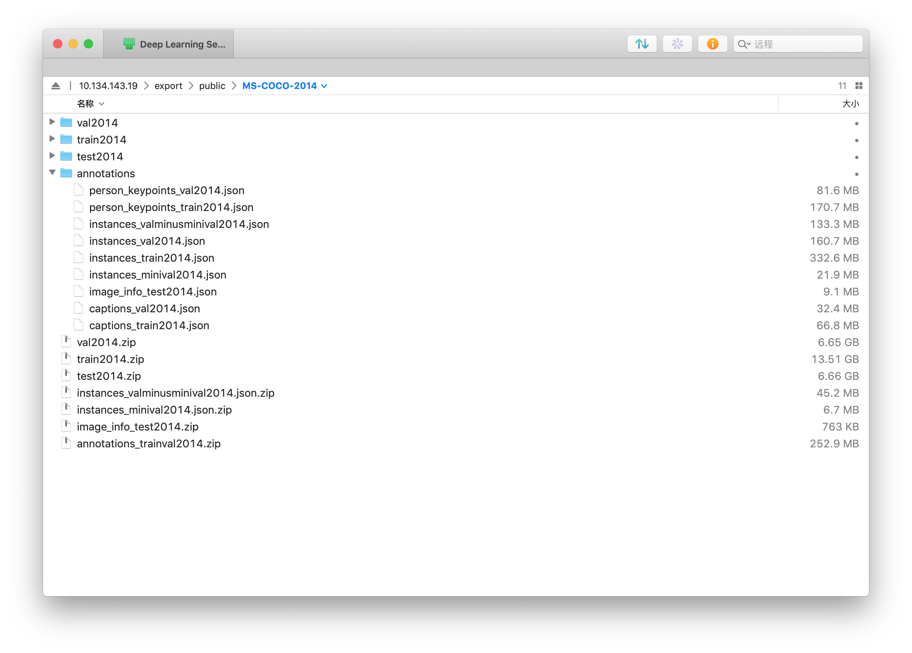
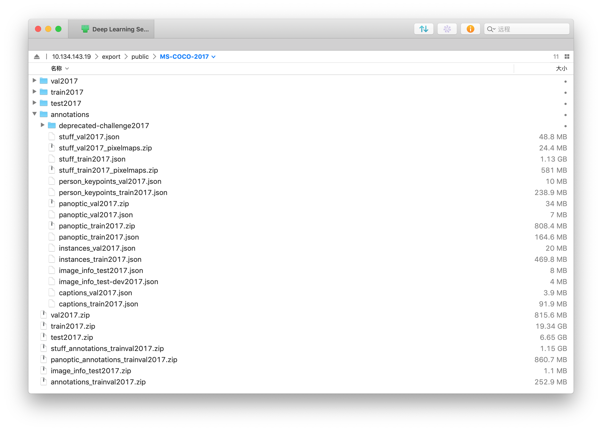
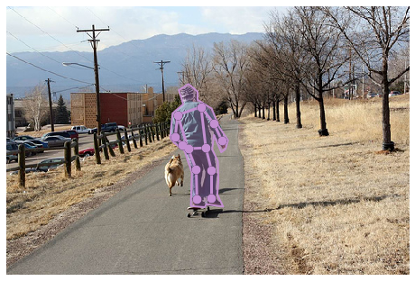
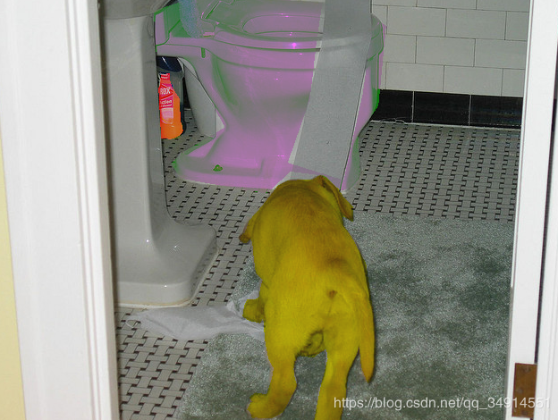
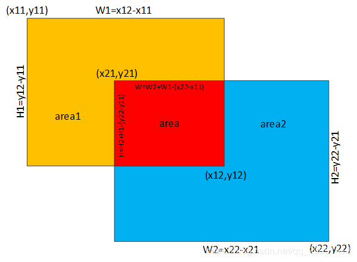
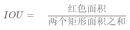
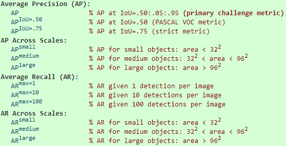

# COCO 

⌚️: 2020年8月1日

📚参考

- [COCO API的安装，COCO数据集介绍以及读取接口代码解读（PyTorch接口）](https://blog.csdn.net/qq_34914551/article/details/103793104)
- [COCO 和 CityScapes 数据集的标注格式和使用](https://tangh.github.io/articles/coco-and-cityscapes-datasets/)
- [coco数据集使用](https://www.cnblogs.com/Meumax/p/12021913.html)

---

## 1. COCO 介绍

> 官方网站：http://cocodataset.org/
> 全称：Microsoft Common Objects in Context （MS COCO）
> 支持任务：Detection、Keypoints、Stuff、Panoptic、Captions
> 说明：COCO数据集目前有三个版本，即2014、2015和2017，其中2015版只有测试集，其他两个有训练集、验证集和测试集。
>
> COCO数据集包括两大部分：Images和Annotations
> Images：“任务+版本”命名的文件夹（例如：train2014），里面为xxx.jpg的图像文件；
> Annotations：文件夹，里面为xxx.json格式的文本文件（例如：instances_train2014.json）；
> 使用COCO数据集的核心就在于xxx.json文件的读取操作，下面详细介绍annotation文件的组织结构和使用方法。

COCO(Common Objects in Context)数据集是微软发布的大型数据集，可以用来目标检测，实例分割，语义分割，关键点检测，以及场景描述。在学术界，COCO基本上被分为两个版本，2014版和2017版。2017版是在14版的基础上做得扩充。数据集分为训练集，验证集和测试集。其中测试集在官网服务器上，Ground Truth未公布。

在同一个文件夹中解压 zip 文件，得到的文件结构如下：

- COCO 2014

  

  

- COCO 2017

  

COCO做目标检测，实例分割，语义分割，采用instances开头的json文件。

## 2. COCO标注格式

COCO 官网有 [Data Format](http://cocodataset.org/#format-data) 的简介，下面逐项详细介绍。

### 2.1 通用字段

COCO有五种注释类型对应五种任务:目标检测、关键点检测、实物分割、全景分割和图像描述。注释使用JSON文件存储。每个xxx.json的内容整体为一个字典，key为“info”、“images“、”annotations“和”licenses“，如下所示：

```
1 {
2     "info"            :info,    
3     "images"          :[image],
4     "annotations"     :[annotation],
5     "licenses"        :[license],
6 }
```

　　value为对应的数据类型，其中，info是一个字典，images是一个list，annotations是一个list，licenses是一个list。除annotation外，每部分的内容定义如下：

```
 1 info{
 2     "year"            : int,    # 数据集年份号
 3     "version"         : str,    # 数据集版本
 4     "description"     : str,    # 数据集描述
 5     "contributor"     : str,    # 贡献者
 6     "url"             : str,    # 数据集官方网址
 7     "date_created"    : datetime,    # 数据集创建详细时间
 8 }
 9 
10 image{
11     "id"               : int,     # 图像id
12     "width"            : int,     # 图像宽度
13     "height"           : int,     # 图像高度
14     "file_name"        : str,     # 图像文件名
15     "license"          : int,     # 许可证
16     "flickr_url"       : str,     # flickr链接
17     "coco_url"         : str,     # coco链接
18     "date_captured"    : datetime,    # 拍摄时间
19 }
20 
21 license{
22     "id"     : int,    # license的编号，1-8
23     "name"   : str,    # 许可证名称
24     "url"    : str,    # 许可证网址
25 }
```

　　key为”annotation“的value对应不同的xxx.json略有不同，但表示内容含义是一样的，即对图片和实例的描述。同时除了annotation外，还有一个key为”categories“表示类别。以下分别对不同任务的annotation和categories进行说明。

### 2.2 非通用字段

#### 2.2.1 Object Detection（目标检测）

　　以检测任务为例，对于每一张图片，至少包含一个对象，COCO数据集对每一个对象进行描述，而不是对一张图片。每个对象都包含一系列字段，包括对象的类别id和mask码，mask码的分割格式取决于图像里的对象数目，当一张图像里就一个对象时（iscrowd=0），mask码用RLE格式，当大于一个对象时（iscrowd=1），采用polyhon格式。

```
 1 annotation{
 2     "id"            : int,    # annotation的id，每个对象对应一个annotation
 3     "image_id"      : int,     # 该annotation的对象所在图片的id
 4     "category_id"   : int,     # 类别id，每个对象对应一个类别
 5     "segmentation"  : RLE or [polygon], 
 6     "area"          : float,     # 面积
 7     "bbox"          : [x,y,width,height],     # x,y为左上角坐标
 8     "iscrowd"       : 0 or 1,    # 0时segmentation为REL，1为polygon
 9 }
10 
11 categories[{
12     "id"　　　　　　　　 : int,    # 类别id 
13     "name"            : str,     # 类别名称
14     "supercategory"　　: str,    # 类别的父类，例如：bicycle的父类是vehicle
15 }]
```


```
{
"info": {"description": "COCO 2017 Dataset",
        "url": "http://cocodataset.org",
        "version": "1.0",
        "year": 2017,
        "contributor": "COCO Consortium",
        "date_created": "2017/09/01"
        },
"licenses": [
              {"url": "http://creativecommons.org/licenses/by-nc-sa/2.0/",
              "id": 1,
              "name": "Attribution-NonCommercial-ShareAlike License"},
              {"url": "...","id": 2,"name": "..."},
            ...],
"images": [
            {"license": 4,
            "file_name": "000000397133.jpg",
            "coco_url": "http://images.cocodataset.org/val2017/000000397133.jpg",
            "height": 427,
            "width": 640,
            "date_captured": "2013-11-14 17:02:52",
            "flickr_url": "http://farm7.staticflickr.com/6116/6255196340_da26cf2c9e_z.jpg",
            "id": 397133
            },
            {"license": 1,
            "file_name": "000000037777.jpg",
            "coco_url": "http://images.cocodataset.org/val2017/000000037777.jpg",
            "height": 230,
            "width": 352,
            "date_captured": "2013-11-14 20:55:31",
            "flickr_url": "http://farm9.staticflickr.com/8429/7839199426_f6d48aa585_z.jpg",
            "id": 37777
            },
           ...],
"annotations": [
                 {"segmentation": [[510.66,423.01,511.72,420.03,510.45,416.0,510.34,413.02,510.77,410.26,510.77,407.5,510.34,405.16,511.51,402.83,511.41,400.49,510.24,398.16,509.39,397.31,504.61,399.22,502.17,399.64,500.89,401.66,500.47,402.08,499.09,401.87,495.79,401.98,490.59,401.77,488.79,401.77,485.39,398.58,483.9,397.31,481.56,396.35,478.48,395.93,476.68,396.03,475.4,396.77,473.92,398.79,473.28,399.96,473.49,401.87,474.56,403.47,473.07,405.59,473.39,407.71,476.68,409.41,479.23,409.73,481.56,410.69,480.4,411.85,481.35,414.93,479.86,418.65,477.32,420.03,476.04,422.58,479.02,422.58,480.29,423.01,483.79,419.93,486.66,416.21,490.06,415.57,492.18,416.85,491.65,420.24,492.82,422.9,493.56,424.39,496.43,424.6,498.02,423.01,498.13,421.31,497.07,420.03,497.07,415.15,496.33,414.51,501.1,411.96,502.06,411.32,503.02,415.04,503.33,418.12,501.1,420.24,498.98,421.63,500.47,424.39,505.03,423.32,506.2,421.31,507.69,419.5,506.31,423.32,510.03,423.01,510.45,423.01]],
                 "area": 702.1057499999998,
                 "iscrowd": 0,
                 "image_id": 289343,
                 "bbox": [473.07,395.93,38.65,28.67],
                 "category_id": 18,
                 "id": 1768
                 },
               ...,
                 {"segmentation": {"counts": [20736,2,453,5,452,9,447,13,444,13,443,15,442,15,442,15,443,15,442,15,443,14,444,13,446,10,448,8,451,4,108769,9,446,12,439,19,1,14,8,11,402,39,3,14,401,57,399,59,398,59,397,60,397,60,397,60,398,59,397,60,397,60,397,59,399,57,400,15,1,9,7,25,401,14,16,26,402,12,15,28,404,9,14,30,406,5,14,31,406,50,405,50,407,44,412,41,7,6,402,40,7,9,401,40,7,10,399,40,7,12,398,39,8,12,397,39,8,13,397,60,397,60,397,61,396,61,397,61,396,62,396,61,397,60,399,4,1,53,405,52,406,51,407,50,408,17,1,30,410,8,2,4,18,14,413,4,32,6,95474,8,5,14,428,11,2,17,425,33,412,1,3,41,410,4,1,43,409,48,408,50,407,51,405,52,405,47,5,1,404,28,4,8,418,25,432,24,434,22,436,12,2,6,439,5,34552],
                   "size": [457,640]
                   },
                 "area": 3074,
                 "iscrowd": 1,
                 "image_id": 49759,
                 "bbox": [45,167,519,65],
                 "category_id": 1,
                 "id": 900100049759
                 },
               ...],
"categories": [{"supercategory": "person","id": 1,"name": "person"},
                ...,
               {"supercategory": "indoor","id": 90,"name": "toothbrush"}
              ]
}
```

1. `info` 是整个数据集的描述信息，之后不会用到。
2. `licenses` 是协议的 id、网址和名称，之后每张图片的信息中都会有一个 licenses id。
3. `images` 中一般需要用到的有四个。`file_name`：图片在对应 train/val/test 文件夹中的文件名；`height/width`：图片的宽高；`id`：图片的唯一 id，在 COCO API 中会用到。
4. `annotations` 所有图片上所有物体的标注统一储存在同一个 “annotations” 中，在这里面的每一个标注都含有它对应哪张图片的信息（`img_id`），和它自己的序号（`id`）。
   `"iscrowd": 0` 的 annotation 是 Polygons 形式的，表示单个的对象，它的 “segmentation” 是二维 list，这是因为一个物体可能被遮挡部分而分隔开（少数情况），需要多个封闭的曲线才能标注。每个一维 list 里面就是一个封闭图形，值为 xyxyxy… 形式的坐标，即 `[510.66,423.01,511.72,420.03,...]` 代表图上 `(510.66,423.01), (511.72,420.03), ...` n 个点。
   `"iscrowd": 1` 的是 RLE（[Run-Length Encoding，游程编码](https://en.wikipedia.org/wiki/Run-length_encoding)） 形式的，标注一组对象（密集，无法很好地分隔成单个的标注）。由 `0` 开始，交替进行，比如 `[20736,2,453, ...]` 表示有 20736 个 `0`，接下来是 2 个 `1`，接下来是 453 个 `0` …，所以这种形式还需要一个 `size` 信息，最后把这一行 reshape 成这个形状就得到 label。
   `"area"` 为 mask 的面积。
   `"bbox"` 框的坐标，xywh 格式。都是 0-index 的，横轴为 x/w，像素的中心点为原点，即 `bbox = [0, 0, 1, 1]` 包围了（左上角）第一个像素。
5. `categories` 一个小类一个 id，被 `annotations` 中指向。一个大类下包含若干个小类。注意 COCO 总共有 80+1 类 things，而 id 是 1~90，并不是连续的。

其中，`info`、`licenses`、`images` 这三个字段的内容在不同的 task 的 JSON 文件中是一样的。不同的是 `annotation` 和 `category`。下面的只会介绍这两个字段。

#### 2.2.2 Keypoint Detection（关键点检测）

与检测任务一样，一个图像包干若干对象，一个对象对应一个keypoint注释，一个keypoint注释包含对象注释的所有数据（包括id、bbox等）和两个附加字段。

首先，key为”keypoints“的value是一个长度为3k的数组，其中k是类别定义的关键点总数（例如人体姿态关键点的k为17）.每个关键点都有一个0索引的位置x、y和可见性标志v（v=0表示未标记，此时x=y=0；v=1时表示标记，但不可见，不可见的原因在于被遮挡了；v=2时表示标记且可见），如果一个关键点落在对象段内，则认为是可见的。

```
 1 annotation{
 2     "keypoints"        : [x1,y1,v1,...], 
 3     "num_keypoints"    : int,     # v=1，2的关键点的个数，即有标记的关键点个数
 4     "[cloned]"         : ...,    
 5 }
 6 
 7 categories[{
 8     "keypoints"    : [str],     # 长度为k的关键点名字符串
 9     "skeleton"     : [edge],     # 关键点的连通性，主要是通过一组关键点边缘队列表的形式表示，用于可视化.
10     "[cloned]"     : ...,
11 }]
```

其中，[cloned]表示从上面定义的Object Detection注释中复制的字段。因为keypoint的json文件包含detection任务所需的字段。


annotations` 完全包含上面 Detection 中的内容，并且每个 anno 多出两个字段：`"keypoints": [x1,y1,v1,...], ...` 和 `"num_keypoints": <int>, ...`。
`keypoints` 是一个长度为 3×k 的数组，其中 k 是这个类中 keypoints 的总数量。每一个 keypoint 是一个长度为 3 的数组。第一和第二个元素分别是 x 和 y 坐标值，第三个元素是个标志位 v，v=0 时表示这个关键点没有标注（这种情况下 x=y=v=0），v=1 时表示这个关键点标注了但是不可见（被遮挡了），v=2 时表示这个关键点标注了同时也可见。
`num_keypoints` 表示这个目标上被标注的关键点的数量（v>0），比较小的目标上无法标注关键点。

`categories` 则只有一类 `"supercategory": "person"`，同样包含了 Instance Detection 中的所有内容，并且多出了两个字段：`"keypoints": [str]` 和 `"skeleton": [edge]`。
`keypoints` 是一个长度为k的数组，包含了每个关键点的名字。
`skeleton` 定义了各个关键点之间的连接性（比如人的左手腕和左肘就是连接的）。

```
"annotations":[
{
  "segmentation": [[125.12,539.69,140.94,522.43...]],
  "num_keypoints": 10,
  "area": 47803.27955,
  "iscrowd": 0,
  "keypoints": [0,0,0,0,0,0,0,0,0,0,0,0,0,0,0,142,309,1,177,320,2,191,398...],
  "image_id": 425226,"bbox": [73.35,206.02,300.58,372.5],"category_id": 1,
  "id": 183126
}, ...]
,

"categories":[
{
  "supercategory": "person",
  "id": 1,
  "name": "person",
  "keypoints": ["nose","left_eye","right_eye","left_ear","right_ear","left_shoulder","right_shoulder","left_elbow","right_elbow","left_wrist","right_wrist","left_hip","right_hip","left_knee","right_knee","left_ankle","right_ankle"],
  "skeleton": [[16,14],[14,12],[17,15],[15,13],[12,13],[6,12],[7,13],[6,7],[6,8],[7,9],[8,10],[9,11],[2,3],[1,2],[1,3],[2,4],[3,5],[4,6],[5,7]]
}]
```

#### 

#### 2.2.3 Stuff Segmentation（实例分割）

　　分割任务的对象注释格式与上面的Object Detection相同且完全兼容（除了iscrowd是不必要的，默认值为0），分割任务主要字段是“segmentation”。


格式字段与上面 Instance Detection 的完全相同，只是 `annotations` 中的 `iscrowd` 没有意义，默认为 `0`，且每个 `segmentation` 的值都是 encoded RLE，而不是之前的 polygons/uncompressed RLE（后面有 encoded/uncompressed 的介绍）。`categories` 的 id 为 92~183，共有 92 类。

```
{
  "segmentation": 
    {"counts": "omh51Y=0ng31PXL01O10iW10ThN1PPY2", "size": [426, 640]}, 
    "area": 11.0, "iscrowd": 0, "image_id": 139, 
    "bbox": [444.0, 226.0, 20.0, 11.0], 
    "category_id": 105, "id": 20000002
},
```


#### 2.2.4 Panoptic Segmentation（全景分割）

对于全景分割任务，每个注释结构是每个图像的注释，而不是每个对象的注释，与上面三个有区别。每个图像的注释有两个部分：1）存储与类无关的图像分割的PNG；2）存储每个图像段的语义信息的JSON结构。

1. 要将注释与图像匹配，使用image_id字段（即：annotation.image_id==image.id）；

2. 对于每个注释，每个像素段的id都存储为一个单独的PNG，PNG位于与JSON同名的文件夹中。每个分割都有唯一的id，未标记的像素为0；

3. 对于每个注释，每个语义信息都存储在annotation.segments_info. segment_info.id，该存储段存储唯一的id，并用于从PNG检索相应的掩码（ids==segment_info.id）。iscrowd表示段内包含一组对象。bbox和area字段表示附加信息。

   

```
 1 annotation{
 2     "image_id"　　　　: int, 
 3     "file_name"　　　 : str, 
 4     "segments_info"  : [segment_info],
 5 }
 6 
 7 segment_info{
 8     "id"　　　　　　: int,. 
 9     "category_id" : int, 
10     "area"　　　　  : int, 
11     "bbox"　　　　  : [x,y,width,height], 
12     "iscrowd"　　  : 0 or 1,
13 }
14 
15 categories[{
16     "id"　　　　　　　　: int, 
17     "name"　　　　　　 : str, 
18     "supercategory"  : str, 
19     "isthing"        : 0 or 1, 
20     "color"　　　　　　: [R,G,B],
21 }]
```


全景分割的 `annotations` 与之前的格式不一样，它将一张图片的所有 annos 储存在一个 dict 中，而不像之前一样所有图片所有 annos 平级共同储存。以下是 COCO 2017 的 `panoptic_val2017.json`。

```
{
  "info": {...},
  "licenses": [...],
  "images": [...],

  "annotations": [
    {
      "segments_info": [
        {
          "id": 3226956,
          "category_id": 1,
          "iscrowd": 0,
          "bbox": [413,158,53,138],
          "area": 2840
        },
        ...
        {
          "id": 6391959,
          "category_id": 200,
          "iscrowd": 0,
          "bbox": [135,359,336,67],
          "area": 12618
        }
      ],
      "file_name": "000000000139.png",
      "image_id": 139
    },
    ...
  ],

  "categories": [
    {
      "supercategory": "person",
      "isthing": 1,
      "id": 1,
      "name": "person"
    },
    ...
    {
      "supercategory": "indoor",
      "isthing": 1,
      "id": 90,
      "name": "toothbrush"
    },
    {
      "supercategory": "textile",
      "isthing": 0,
      "id": 92,
      "name": "banner"
    },
    ...
    {
      "supercategory": "window",
      "isthing": 0,
      "id": 181,
      "name": "window-other"
    },
    {
      "supercategory": "plant",
      "isthing": 0,
      "id": 184,
      "name": "tree-merged"
    },
    ...
    {
      "supercategory": "textile",
      "isthing": 0,
      "id": 200,
      "name": "rug-merged"
    }
  ]
}
```

因为 Panoptic 是 Non-Overlap 的，所以 segmentation 是用一张 PNG 图片储存：`["annotations"][i]["file_name"]`。它是 class-agnostic 的，每个 segment 的 semantic information (class) 储存在 JSON：`["annotations"][i]["segments_info"][j] ([id])`。以 RGB24 打开 PNG，如果像素值为 (0,0,0)，则表示 Unlabeled pixels (void)，其余的通过 `ids = R + G×256 + B×256^2` 即可得到 JSON 中对应的 id 值。
`i` 表示总图片数量，`j` 表示每张图中标签的数量

此外，iscrowd 只与 things 有关。thing categories 与 Detection 中的完全相同，stuff categories 与 Semantic Seg 中的有所不同。`categories` 里面多出的 `isthing` 用来区分 things 和 stuff。在 [panopticapi/panoptic_coco_categories.json](https://github.com/cocodataset/panopticapi/blob/master/panoptic_coco_categories.json) 中还会多出一个 `color: [int, int, int]` 表示这一类的在生成 PNG 时的颜色，对于 things，不同 instance 之间会在这个 base color 上[抖动一点](https://github.com/cocodataset/panopticapi/blob/master/panopticapi/utils.py#L43)，然后通过最终的 RGB 生成 JSON 里的 id。

#### 2.2.5 Image Captioning（图像字幕）

图像字幕任务的注释用于存储图像标题，每个标题描述指定的图像，每个图像至少有5个标题。

```
1 annotation{
2     "id"　　　　　　: int, 
3     "image_id"　　 : int, 
4     "caption"　　　: str,
5 }
```


没有 `categories` 字段。 `annotations` 多于 images 的个数，一张图片可以有多个描述。且只含三个信息，很简单，如下：

```
annotation{
    "id": <int>,
    "image_id": <int>,
    "caption": <str>
}

{
  "image_id": 179765,
  "id": 38,"caption": "A black Honda motorcycle parked in front of a garage."
}
```


## 3. COCO Python API

COCO提供了API读取数据，但不是直接将数据读入内存，而是读取图像的文件名，目标类别，位置等信息。如要读取图像，还是需要使用PIL或者opencv进行读取。**所以，现在的开源论文项目，都是将COCO API再加工，封装为一个适合模型训练和测试的dataset class**。

接下来，我会先介绍如何安装COCO API（在windows和Ubuntu上），然后简单的介绍一下API。最后写一个读取COCO的数据接口（PyTorch接口）。

### 3.1 安装pycocotools

安装 COCO Python API：

```
# Offical
git clone https://github.com/cocodataset/cocoapi.git
cd cocoapi/PythonAPI
python setup.py build_ext install

# Or
pip install pycocotools
```

所有的 API 可以参考 [GitHub/cocoapi-coco.py](https://github.com/cocodataset/cocoapi/blob/master/PythonAPI/pycocotools/coco.py#L20) 和 [GitHub/cocoapi-mask.py](https://github.com/cocodataset/cocoapi/blob/master/PythonAPI/pycocotools/mask.py#L30)。这里列出部分 API 使用方式。

**注意**，如果你使用的是anaconda包，pycocotools会变成包添加到site-packages里面。如果仅仅是普通的Python环境，在导入之前，需要把cocoapi/PythonAPI添加到环境变量中

```python
try:       # pycocotools 已经加入了全局环境变量中
    from pycocotools.coco import COCO
except ModuleNotFoundError:
    import sys
    # 加载 COCO API 环境
    sys.path.append('D:\API\cocoapi\PythonAPI')
    from pycocotools.coco import COCO
1234567
```


### 3.2 COCO API使用（官方例程）

安装完在site-packages文件夹可以看到pycocotools包，该包是COCO数据集的Python API，帮助加载、解析和可视化COCO中的注释。使用API的方法是直接使用API提供的函数加载注释文件和读取Python字典。API函数定义如下：

1. COCO：加载COCO注释文件并准备数据结构的COCO api类。
2. decodeMask：通过运行长度编码解码二进制掩码M。
3. encodeMask：使用运行长度编码对二进制掩码M进行编码。
4. getAnnIds：得到满足给定过滤条件的annotation的id。
5. getCatIds：获得满足给定过滤条件的category的id。
6. getImgIds：得到满足给定过滤条件的imgage的id。
7. loadAnns：使用指定的id加载annotation。
8. loadCats：使用指定的id加载category。
9. loadImgs：使用指定的id加载imgage。
10. annToMask：将注释中的segmentation转换为二进制mask。
11. showAnns：显示指定的annotation。
12. loadRes：加载算法结果并创建访问它们的API。
13. download：从mscoco.org服务器下载COCO图像。

下面展示了数据加载、解析和可视化注释等内容，步骤如下：

**1、首先导入必要的包**

```
%matplotlib inline
from pycocotools.coco import COCO
import numpy as np
import skimage.io as io
import matplotlib.pyplot as plt
import pylab
pylab.rcParams['figure.figsize'] = (8.0, 10.0)
```

**2、定义annotation文件路径（以“instances_val2014.json”为例）**

```
dataDir='..'
dataType='val2014'
annFile='{}/annotations/instances_{}.json'.format(dataDir,dataType)
```

**3、读取instances_val2014.json文件到COCO类**

```
# initialize COCO api for instance annotations
coco = COCO(annFile)
```

**输出如下：**
loading annotations into memory…
Done (t=4.19s)
creating index…
index created!

**4、COCO图像类别的读取**

```
# display COCO categories and supercategories
cats = coco.loadCats(coco.getCatIds())
nms=[cat['name'] for cat in cats]
print('COCO categories: \n{}\n'.format(' '.join(nms)))

nms = set([cat['supercategory'] for cat in cats])
print('COCO supercategories: \n{}'.format(' '.join(nms)))
```

**输出如下**：
COCO categories:
person bicycle car motorcycle airplane bus train truck boat traffic light fire hydrant stop sign parking meter bench bird cat dog horse sheep cow elephant bear zebra giraffe backpack umbrella handbag tie suitcase frisbee skis snowboard sports ball kite baseball bat baseball glove skateboard surfboard tennis racket bottle wine glass cup fork knife spoon bowl banana apple sandwich orange broccoli carrot hot dog pizza donut cake chair couch potted plant bed dining table toilet tv laptop mouse remote keyboard cell phone microwave oven toaster sink refrigerator book clock vase scissors teddy bear hair drier toothbrush

COCO supercategories:
sports furniture electronic food appliance vehicle animal kitchen outdoor indoor person accessory

**5、COCO原始图像读取**

```
  # 找到符合'person','dog','skateboard'过滤条件的category_id
  catIds = coco.getCatIds(catNms=['person','dog','skateboard']);
  # 找出符合category_id过滤条件的image_id
  imgIds = coco.getImgIds(catIds=catIds );
  # 找出imgIds中images_id为324158的image_id
  imgIds = coco.getImgIds(imgIds = [324158])
  # 加载图片，获取图片的数字矩阵
  img = coco.loadImgs(imgIds[np.random.randint(0,len(imgIds))])[0]
  # 显示图片
  I = io.imread(img['coco_url'])
  plt.axis('off')
  plt.imshow(I)
  plt.show()
```

**输出如下：**


 **6、加载并显示annotations**

```
 # load and display instance annotations
 plt.imshow(I); plt.axis('off')
 annIds = coco.getAnnIds(imgIds=img['id'], catIds=catIds, iscrowd=None)
 anns = coco.loadAnns(annIds)
 coco.showAnns(anns)
```

输出如下：


 **7、加载并显示person_keypoints_2014.json的annotations**

```
  # initialize COCO api for person keypoints annotations
  annFile = '{}/annotations/person_keypoints_{}.json'.format(dataDir,dataType)
  coco_kps=COCO(annFile)
  
  # load and display keypoints annotations
  plt.imshow(I); plt.axis('off')
  ax = plt.gca()
  annIds = coco_kps.getAnnIds(imgIds=img['id'], catIds=catIds, iscrowd=None)
  anns = coco_kps.loadAnns(annIds)
  coco_kps.showAnns(anns)
```

**输出如下：**
loading annotations into memory…
Done (t=2.08s)
creating index…
index created!



 **8、加载并显示captions_2014.json.json的annotations**

```
 # initialize COCO api for caption annotations
 annFile = '{}/annotations/captions_{}.json'.format(dataDir,dataType)
 coco_caps=COCO(annFile)
 
 # load and display caption annotations
 annIds = coco_caps.getAnnIds(imgIds=img['id']);
 anns = coco_caps.loadAnns(annIds)
 coco_caps.showAnns(anns)
 plt.imshow(I); plt.axis('off'); plt.show()
```

**输出如下：**
loading annotations into memory…
Done (t=0.41s)
creating index…
index created!
A man is skate boarding down a path and a dog is running by his side.
A man on a skateboard with a dog outside.
A person riding a skate board with a dog following beside.
This man is riding a skateboard behind a dog.
A man walking his dog on a quiet country road.


### 3.3 pycocotools几个常用API

- 构建coco对象， coco = pycocotools.coco.COCO(json_file)
- coco.getImgIds(self, imgIds=[], catIds=[]) 返回满足条件的图像id
- coco.imgs.keys() 数据集中所有样本的id号
- coco.imgToAnns.keys() 数据集中有GT对应的图像样本的id号（用来过滤没有标签的样本）
- coco.getCatIds 返回含有某一类或者几类的类别id号
- coco.loadImgs()根据id号，导入对应的图像信息
- coco.getAnnIds() 根据id号，获得该图像对应的GT的id号
- coco.loadAnns() 根据 Annotation id号，导入标签信息

基本常用的就是这些了。

```python
from pycocotools.coco import COCO

val_info = r'E:\dataset\coco\annotations\annotations_trainval2017\annotations\instances_val2017.json'
val_image = r'E:\dataset\coco\images\val2017'

coco = COCO(val_info)  # 导入验证集
all_ids = coco.imgs.keys()
print(len(all_ids))
person_id = coco.getCatIds(catNms=['person'])
print(person_id)
person_imgs_id = coco.getImgIds(catIds=person_id)
print(len(person_imgs_id))
###
'''
loading annotations into memory...
Done (t=1.45s)
creating index...
index created!
5000  # 验证集样本总数
[1]  # 人这个类的类别id
2693  # 在验证集中，包含人这个类的图像有2693张
'''
###
```

## 4. 读取COCO的PyTorch数据接口

写一个COCOdetection类继承自data.Dataset.

```python
from pycocotools.coco import COCO
import os
import os.path as osp
import sys
import torch
import torch.utils.data as data
import torchvision.transforms as transforms
import cv2
import numpy as np
from pycocotools.coco import COCO

val_info = r'E:\dataset\coco\annotations\annotations_trainval2017\annotations\instances_val2017.json'
val_image = r'E:\dataset\coco\images\val2017'
COCO_CLASSES = ('person', 'bicycle', 'car', 'motorcycle', 'airplane', 'bus',
                'train', 'truck', 'boat', 'traffic light', 'fire hydrant',
                'stop sign', 'parking meter', 'bench', 'bird', 'cat', 'dog',
                'horse', 'sheep', 'cow', 'elephant', 'bear', 'zebra', 'giraffe',
                'backpack', 'umbrella', 'handbag', 'tie', 'suitcase', 'frisbee',
                'skis', 'snowboard', 'sports ball', 'kite', 'baseball bat',
                'baseball glove', 'skateboard', 'surfboard', 'tennis racket',
                'bottle', 'wine glass', 'cup', 'fork', 'knife', 'spoon', 'bowl',
                'banana', 'apple', 'sandwich', 'orange', 'broccoli', 'carrot',
                'hot dog', 'pizza', 'donut', 'cake', 'chair', 'couch',*
                'potted plant', 'bed', 'dining table', 'toilet', 'tv', 'laptop',
                'mouse', 'remote', 'keyboard', 'cell phone', 'microwave', 'oven',
                'toaster', 'sink', 'refrigerator', 'book', 'clock', 'vase',
                'scissors', 'teddy bear', 'hair drier', 'toothbrush')

COCO_LABEL_MAP = { 1:  1,  2:  2,  3:  3,  4:  4,  5:  5,  6:  6,  7:  7,  8:  8,
                   9:  9, 10: 10, 11: 11, 13: 12, 14: 13, 15: 14, 16: 15, 17: 16,
                  18: 17, 19: 18, 20: 19, 21: 20, 22: 21, 23: 22, 24: 23, 25: 24,
                  27: 25, 28: 26, 31: 27, 32: 28, 33: 29, 34: 30, 35: 31, 36: 32,
                  37: 33, 38: 34, 39: 35, 40: 36, 41: 37, 42: 38, 43: 39, 44: 40,
                  46: 41, 47: 42, 48: 43, 49: 44, 50: 45, 51: 46, 52: 47, 53: 48,
                  54: 49, 55: 50, 56: 51, 57: 52, 58: 53, 59: 54, 60: 55, 61: 56,
                  62: 57, 63: 58, 64: 59, 65: 60, 67: 61, 70: 62, 72: 63, 73: 64,
                  74: 65, 75: 66, 76: 67, 77: 68, 78: 69, 79: 70, 80: 71, 81: 72,
                  82: 73, 84: 74, 85: 75, 86: 76, 87: 77, 88: 78, 89: 79, 90: 80}
class COCOAnnotationTransform(object):
    def __init__(self):
        self.label_map = COCO_LABEL_MAP

    def __call__(self, target, width, height):
        scale = np.array([width, height, width, height])
        res = []
        for obj in target:
            if 'bbox' in obj:
                bbox = obj['bbox']
                label_idx = self.label_map[obj['category_id']] - 1
                final_box = list(np.array([bbox[0], bbox[1], bbox[0]+bbox[2], bbox[1]+bbox[3]])/scale)
                final_box.append(label_idx)
                res += [final_box]  # [xmin, ymin, xmax, ymax, label_idx]
            else:
                print("No bbox found for object ", obj)

        return res  # [[xmin, ymin, xmax, ymax, label_idx], ... ]


class COCODetection(data.Dataset):
    def __init__(self, image_path, info_file, transform=None,
                 target_transform=None, has_gt=True):
        self.root = image_path
        self.coco = COCO(info_file)
        self.ids = list(self.coco.imgToAnns.keys())  # 标签数目 小于样本数目，说明有的图像没有标签

        if len(self.ids) == 0 or not has_gt:  # 如果没有标签或者不需要GT，则直接使用image
            self.ids = list(self.coco.imgs.keys())
        self.transform = transform
        self.target_transform = target_transform

        self.has_gt = has_gt

    def __len__(self):
        return len(self.ids)

    def __getitem__(self, index):
        im, gt, masks, h, w, num_crowds = self.pull_item(index)
        return im, (gt, masks, num_crowds)

    def pull_item(self, index):
        img_id = self.ids[index]
        if self.has_gt:
            ann_ids = self.coco.getAnnIds(imgIds=img_id)
            target = self.coco.loadAnns(ann_ids)
        else:
            target = []
        crowd = [x for x in target if ('iscrowd' in x and x['iscrowd'])]
        target = [x for x in target if not ('iscrowd' in x and x['iscrowd'])]
        num_crowds = len(crowd)

        # This is so we ensure that all crowd annotations are at the end of the array
        target += crowd
        file_name = self.coco.loadImgs(img_id)[0]['file_name']
        path = osp.join(self.root, file_name)
        img = cv2.imread(path)
        height, width, _ = img.shape
        if len(target) > 0: # 这样图像中有不是crowd的目标
            masks = [self.coco.annToMask(obj).reshape(-1) for obj in target]
            masks = np.vstack(masks)
            masks = masks.reshape(-1, height, width)
        if self.target_transform is not None and len(target) > 0:
            target = self.target_transform(target, width, height)
        return torch.from_numpy(img).permute(2, 0, 1), target, masks, height, width, num_crowds


from torch.utils.data import DataLoader
import numpy as np
if __name__=='__main__':
    dataset = COCODetection(val_image, val_info)
    loader = DataLoader(dataset)
    for img, label in loader:
        img = np.uint8(img.squeeze().numpy().transpose(1, 2, 0))
        gt, masks, num_crowds = label
        masks = masks.squeeze(0)
        for m in range(masks.size(0)):
            mask = masks[m].numpy()
            color = np.random.randint(0, 255)
            channel = np.random.randint(0, 3)
            y, x = np.where(mask == 1)
            img[y, x, channel] = color
        cv2.imshow('img', img)
        cv2.waitKey(500)

```

运行代码：




## 5. COCO数据集的评估

### 5.1 IOU值计算



　　上图所示的IOU计算如下：



### 5.2 COCO评估指标



1. 除非另有说明，否则AP和AR在多个交汇点（IoU）值上取平均值，使用0.50到0.95共10个IOU阈值下的mAP求平均，结果就是COCO数据集定义的AP，与只用一个IOU=0.50下计算的AP相比，是一个突破；
2. AP是所有类别的平均值。传统上，这被称为“平均准确度”（mAP，mean average precision）。官方没有区分AP和mAP（同样是AR和mAR），并假定从上下文中可以清楚地看出差异。
3. AP（所有10个IoU阈值和所有80个类别的平均值）将决定赢家。在考虑COCO性能时，这应该被认为是最重要的一个指标。
4. 在COCO中，比大物体相比有更多的小物体。具体地说，大约41％的物体很小（area<322），34％是中等（322 < area < 962)），24％大（area > 962）。测量的面积（area）是分割掩码（segmentation mask）中的像素数量。
5. AR是在每个图像中检测到固定数量的最大召回（recall），在类别和IoU上平均。AR与proposal evaluation中使用的同名度量相关，但是按类别计算。
6. 所有度量标准允许每个图像（在所有类别中）最多100个最高得分检测进行计算。
7. 除了IoU计算（分别在框（box）或掩码（mask）上执行）之外，用边界框和分割掩码检测的评估度量在所有方面是相同的。

### 5.3 COCO结果文件统一格式

**Object Detection**

```
1 [{
2     "image_id"        : int,    
3     "category_id"    : int, 
4     "bbox"            : [x,y,width,height],     
5     "score"            : float,    
6 }]
```

框坐标是从图像左上角测量的浮点数(并且是0索引的)。官方建议将坐标舍入到最接近十分之一像素的位置，以减少JSON文件的大小。

对于对象segments的检测(实例分割)，请使用以下格式:

```
1 [{
2     "image_id"        : int,    
3     "category_id"     : int, 
4     "segmentation"    : RLE,     
5     "score"           : float,    
6 }]
```

**Keypoint Detection**

```
1 [{
2     "image_id"      : int, 
3     "category_id"   : int,
4      "keypoints"    : [x1,y1,v1,...,xk,yk,vk], 
5      "score"        : float,
6 }]
```

关键点坐标是从左上角图像角测量的浮点数(并且是0索引的)。官方建议四舍五入坐标到最近的像素，以减少文件大小。还请注意，目前还没有使用vi的可视性标志(除了控制可视化之外)，官方建议简单地设置vi=1。

**Stuff Segmentation**

```
1 [{
2     "image_id"       : int, 
3     "category_id"    : int, 
4     "segmentation"   : RLE,
5 }]
```

除了不需要score字段外，Stuff 分割格式与Object分割格式相同。注意:官方建议用单个二进制掩码对图像中出现的每个标签进行编码。二进制掩码应该使用MaskApi函数encode()通过RLE进行编码。例如，参见cocostuffhelper.py中的segmentationToCocoResult()。为了方便，官方还提供了JSON和png格式之间的转换脚本。

**Panoptic Segmentation**

```
 1 annotation{
 2     "image_id"　　　　: int, 
 3     "file_name"　　　: str, 
 4     "segments_info" : [segment_info],
 5 }
 6 
 7 segment_info{
 8     "id"　　　　　　: int,
 9     "category_id" : int,
10 }
```

**Image Captioning**

```
1 [{
2     "image_id": int, 
3     "caption": str,
4 }]
```

### 5.4 COCOEVAL API使用（官方例程）

COCO还提供了一个计算评估指标的API，即当自己的模型按照官方定义的格式输出后，可以使用API进行快速评估模型的一系列指标。

**1、导入必要的包**

```
1 %matplotlib inline
2 import matplotlib.pyplot as plt
3 from pycocotools.coco import COCO
4 from pycocotools.cocoeval import COCOeval
5 import numpy as np
6 import skimage.io as io
7 import pylab
8 pylab.rcParams['figure.figsize'] = (10.0, 8.0)
```

**2、选择任务**

```
1 annType = ['segm','bbox','keypoints']
2 annType = annType[1]      #specify type here
3 prefix = 'person_keypoints' if annType=='keypoints' else 'instances'
4 print('Running demo for *%s* results.'%(annType))
```

**输出如下：**
Running demo for bbox results.

**3、加载json注释文件（即：Ground Truth）**

```
1 #initialize COCO ground truth api
2 dataDir='../'
3 dataType='val2014'
4 annFile = '%s/annotations/%s_%s.json'%(dataDir,prefix,dataType)
5 cocoGt=COCO(annFile)
```

**输出如下：**
loading annotations into memory…
Done (t=3.16s)
creating index…
index created!

**4、加载result文件（即：Predict）**

COCO.loadRes(resFile)返回的也是一个COCO类，与COCO(annFile)不同的是，前者加载官方规定格式的result文件，后者加载官方提供的json文件。

```
1 #initialize COCO detections api
2 resFile='%s/results/%s_%s_fake%s100_results.json'
3 resFile = resFile%(dataDir, prefix, dataType, annType)
4 cocoDt=cocoGt.loadRes(resFile)
```

**输出如下：**
Loading and preparing results…
DONE (t=0.03s)
creating index…
index created!

**5、使用测试集当中的100张图片进行评估**

```
1 imgIds=sorted(cocoGt.getImgIds())    # 把测试集的图像id按从小到达排列
2 imgIds=imgIds[0:100]    # 取出前面100个图像
3 imgId = imgIds[np.random.randint(100)]    # 顺序打乱
```

**6、执行评估**

```
1 # running evaluation
2 cocoEval = COCOeval(cocoGt,cocoDt,annType)
3 cocoEval.params.imgIds  = imgIds
4 cocoEval.evaluate()
5 cocoEval.accumulate()
6 cocoEval.summarize()
```

**输出如下：**
Running per image evaluation…
Evaluate annotation type bbox
DONE (t=0.21s).
Accumulating evaluation results…
DONE (t=0.25s).
Average Precision (AP) @[ IoU=0.50:0.95 | area= all | maxDets=100 ] = 0.505
Average Precision (AP) @[ IoU=0.50 | area= all | maxDets=100 ] = 0.697
Average Precision (AP) @[ IoU=0.75 | area= all | maxDets=100 ] = 0.573
Average Precision (AP) @[ IoU=0.50:0.95 | area= small | maxDets=100 ] = 0.586
Average Precision (AP) @[ IoU=0.50:0.95 | area=medium | maxDets=100 ] = 0.519
Average Precision (AP) @[ IoU=0.50:0.95 | area= large | maxDets=100 ] = 0.501
Average Recall (AR) @[ IoU=0.50:0.95 | area= all | maxDets= 1 ] = 0.387
Average Recall (AR) @[ IoU=0.50:0.95 | area= all | maxDets= 10 ] = 0.594
Average Recall (AR) @[ IoU=0.50:0.95 | area= all | maxDets=100 ] = 0.595
Average Recall (AR) @[ IoU=0.50:0.95 | area= small | maxDets=100 ] = 0.640
Average Recall (AR) @[ IoU=0.50:0.95 | area=medium | maxDets=100 ] = 0.566
Average Recall (AR) @[ IoU=0.50:0.95 | area= large | maxDets=100 ] = 0.564