# Feature Scaling

⌚️: 2020年8月1日

📚参考

- [为什么要做特征归一化/标准化？](https://www.cnblogs.com/shine-lee/p/11779514.html)
- [机器学习数据预处理——标准化/归一化方法](https://www.cnblogs.com/bjwu/p/8977141.html)

- [标准化和归一化，请勿混为一谈，透彻理解数据变换](https://blog.csdn.net/weixin_36604953/article/details/102652160)

---

## 1. 为什么要做Feature Scaling

Feature scaling，常见的提法有“特征归一化”、“标准化”，是数据预处理中的重要技术，有时甚至决定了算法能不能work以及work得好不好。谈到feature scaling的必要性，最常用的2个例子可能是：

- **特征间的单位（尺度）可能不同**比如身高和体重，比如摄氏度和华氏度，比如房屋面积和房间数，一个特征的变化范围可能是\[1000,10000\]，另一个特征的变化范围可能是\[−0.1,0.2\]，在进行距离有关的计算时，单位的不同会导致计算结果的不同，尺度大的特征会起决定性作用，而尺度小的特征其作用可能会被忽略，**为了消除特征间单位和尺度差异的影响，以对每维特征同等看待，需要对特征进行归一化**。

- 原始特征下，**因尺度差异，其损失函数的等高线图可能是椭圆形**，梯度方向垂直于等高线，下降会走zigzag路线，而不是指向local minimum。通过对特征进行zero-mean and unit-variance变换后，其损失函数的等高线图更接近圆形，梯度下降的方向震荡更小，收敛更快，如下图所示，图片来自Andrew Ng。

  

  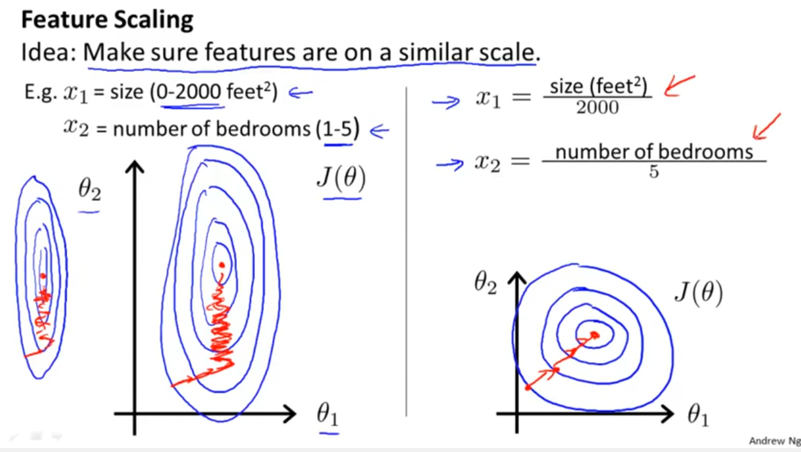

对于feature scaling中最常使用的Standardization，似乎“无脑上”就行了，本文想多探究一些为什么，

- 常用的feature scaling方法都有哪些？
- 什么情况下该使用什么feature scaling方法？有没有一些指导思想？
- 所有的机器学习算法都需要feature scaling吗？有没有例外？
- 损失函数的等高线图都是椭圆或同心圆吗？能用椭圆和圆来简单解释feature scaling的作用吗？
- 如果损失函数的等高线图很复杂，feature scaling还有其他直观解释吗？

根据查阅到的资料，本文将尝试回答上面的问题。但笔者能力有限，空有困惑，能讲到哪算哪吧（微笑）。

### Feature Scaling优点

- #### 提升模型精度

> 在机器学习算法的目标函数(例如SVM的RBF内核或线性模型的l1和l2正则化)，许多学习算法中目标函数的基础都是假设所有的特征都是零均值并且具有同一阶数上的方差。如果某个特征的方差比其他特征大几个数量级，那么它就会在学习算法中占据主导位置，导致学习器并不能像我们说期望的那样，从其他特征中学习。

举一个简单的例子，在KNN中，我们需要计算待分类点与所有实例点的距离。假设每个实例点（instance）由n个features构成。如果我们选用的距离度量为欧式距离，如果数据预先没有经过归一化，那么那些绝对值大的features在欧式距离计算的时候起了决定性作用，soga。

从经验上说，归一化是让不同维度之间的特征在数值上有一定比较性，可以大大提高分类器的准确性。

- #### 提升收敛速度

**对于线性model来说**，数据归一化后，最优解的寻优过程明显会变得平缓，更容易正确的收敛到最优解。

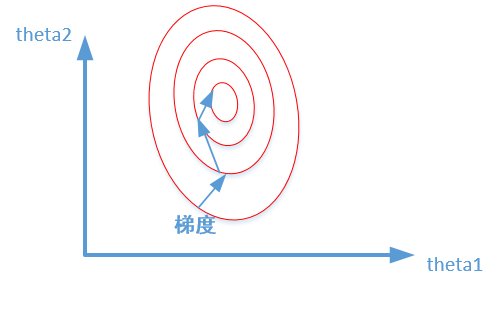
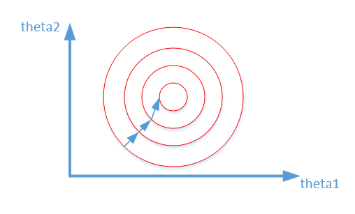

比较这两个图，前者是没有经过归一化的，在梯度下降的过程中，走的路径更加的曲折，而第二个图明显路径更加平缓，收敛速度更快。

对于神经网络模型，避免饱和是一个需要考虑的因素，通常参数的选择决定于input数据的大小范围

## 2. 常用feature scaling方法

在问为什么前，先看是什么。

给定数据集，令特征向量为𝑥，维数为D，样本数量为𝑅，可构成𝐷×𝑅的矩阵，一列为一个样本，一行为一维特征，如下图所示，图片来自[Hung-yi Lee pdf-Gradient Descent](http://speech.ee.ntu.edu.tw/~tlkagk/courses/ML_2016/Lecture/Gradient Descent (v2).pdf)：

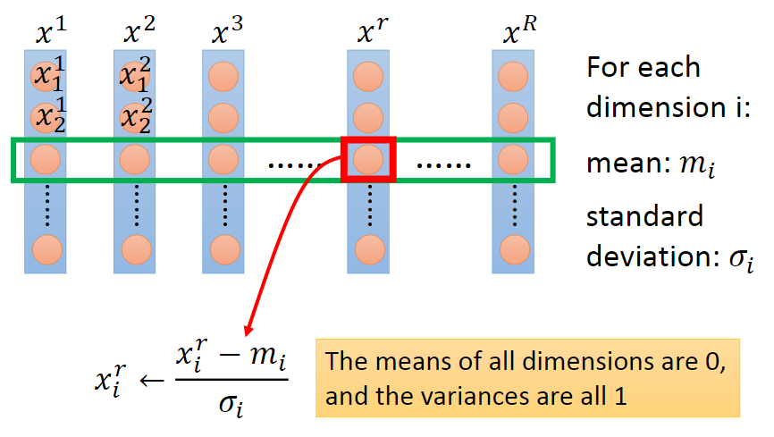

feature scaling的方法可以分成2类，逐行进行和逐列进行。逐行是对每一维特征操作，逐列是对每个样本操作，上图为逐行操作中特征标准化的示例。

具体地，常用feature scaling方法如下，来自[wiki](https://wiki2.org/en/Feature_scaling)，。 **LN、BN等还可以在不同维度上进行mean和std操作，原理是一样滴**

### 2.1 Rescaling (min-max normalization、range scaling)

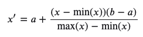

将每一维特征线性映射到目标范围\[𝑎,𝑏\]，即将最小值映射为𝑎，最大值映射为𝑏，常用目标范围为\[0,1\]和\[−1,1\]，特别地，映射到\[0,1\]计算方式为：

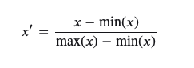

 **适用地方**

这种方法有个**缺陷**就是当有新数据加入时，可能导致max和min的变化，需要重新定义。

**敲黑板**，这种方法对于outlier非常敏感，因为outlier影响了max或min值，所以这种方法只适用于数据在一个范围内分布的情况

### 2.2 Mean normalization

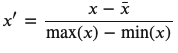

将**均值映射为0**，同时用最大值最小值的差对特征进行归一化，一种更常见的做法是用标准差进行归一化，如下。

### 2.3 Standardization (Z-score Normalization)

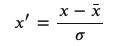

每维特征**0均值1方差（zero-mean and unit-variance）**。

**适用于地方**

**如果数据的分布本身就服从正态分布，就可以用这个方法。**

通常这种方法基本可用于有outlier的情况，但是，在计算方差和均值的时候outliers仍然会影响计算。所以，在出现outliers的情况下可能会出现转换后的数的不同feature分布完全不同的情况。

### 2.4 Scaling to unit length

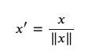

将每个样本的特征向量除以其长度，即对样本特征向量的长度进行归一化，长度的度量常使用的是L2 norm（欧氏距离），有时也会采用L1 norm，不同度量方式的一种对比可以参见论文[“CVPR2005-Histograms of Oriented Gradients for Human Detection”](https://lear.inrialpes.fr/people/triggs/pubs/Dalal-cvpr05.pdf)。

### 2.5 注意⚠️

上述4种feature scaling方式，前3种为逐行操作，最后1种为逐列操作。

**容易让人困惑的一点是指代混淆，Standardization指代比较清晰，但是单说Normalization有时会指代min-max normalization，有时会指代Standardization，有时会指代Scaling to unit length**。

### 2.6 标准化和归一化区别和联系

#### 2.6.1 定义

复述上文内容。  

归一化和标准化都是对数据做变换的方式，将原始的一列数据转换到某个范围，或者某种形态，具体的：

> 归一化(Normalization)：将一列数据变化到某个固定区间(范围)中，通常，这个区间是[0, 1]，广义的讲，可以是各种区间，比如映射到[0，1]一样可以继续映射到其他范围，图像中可能会映射到[0,255]，其他情况可能映射到[-1,1]；
>
> 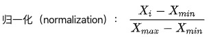
>
> 标准化(Standardization)：将数据变换为均值为0，标准差为1的分布切记，并非一定是正态的；
>
> 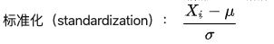
>
> 中心化：另外，还有一种处理叫做中心化，也叫零均值处理，就是将每个原始数据减去这些数据的均值。

我在这里多写一点，很多博客甚至书中说，Standardization是改变数据分布，将其变换为服从`N(0,1)`的标准正态分布，这点是**错的**，Standardization会改变数据的均值、标准差都变了(当然，严格的说，均值和标准差变了，分布也是变了，但分布种类依然没变，原来是啥类型，现在就是啥类型)，但本质上的分布并不一定是标准正态，完全取决于原始数据是什么分布。我个举例子，我生成了100万个服从beta(0.5,0.5)的样本点(你可以替换成任意非正态分布，比如卡方等等，beta(1,1)是一个服从U(0,1)的均匀分布，所以我选了beta(0.5,0.5))，称这个原始数据为b0，分布如下图所示：

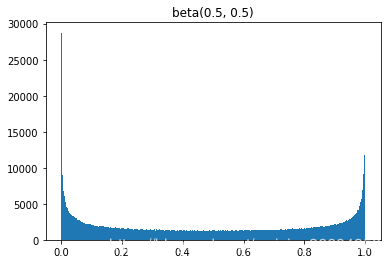

通过计算机计算，样本b0​的均值和方差分别为0.49982和0.12497(约为0.5和0.125)
对这个数据做Standardization，称这个标准化后的数据为b1，分布如下：

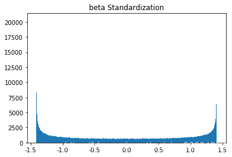

可以看到数据形态完全不是正态分布，但是数学期望和方差已经变了。beta分布的数学期望为a/(a+b)​，方差为$\frac{a+b}{(a+b)^2(a+b+1)}$​，所以E(b0)=0.5/(0.5+0.5)=1/2​，`Var(b0​)=1/8​`，这也和我们上文所计算的样本均值和方差一致，而b1​的均值和方差分别为：-1.184190523417783e-1和1，均值和方差已经不再是0.5和0.125，分布改变，但绝不是一个正态分布，你不信的话，觉得看分布图不实锤，通过qq图和检验得到的结果如下：

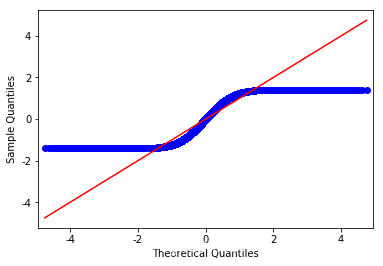

你要的qq plot 

你要的KS检验，拒绝正态性原假设。
当然，如果你原始数据就是正太的，那么做了Standardization，生成的就是标准正态的数据，切记哦，谁再和你说Standardization之后得到N(0,1)你就反驳他。之所以大家会把标准化和正态分布联系起来，是因为实际数据中大部分都是正态分布，起码近似正态，另外，我看到很多人说标准化的基本假设是对正态数据，我并没有从哪些知名度较高的课本教材中查询到依据，如果有知道的同学也可以给我普及

#### 2.6.2 联系和差异

**联系**

说完Standardization和Normalization的定义和通常的计算方式，再说说二者的联系和差异。

说道联系，Standardization和Normalization本质上都是对数据的线性变换，广义的说，你甚至可以认为他们是同一个母亲生下的双胞胎，**为何而言，因为二者都是不会改变原始数据排列顺序的线性变换**：

假设原始数据为X，令$\alpha = X_{max}-X_{min}$，令`$β_{min}$`(很明显，数据给定后α、β就是常数)，则$X_{Normalization} = \frac{X_i-\beta}{\alpha}=\frac{X_i}{alpha}=\frac{X_i}{\alpha}-c$，可见，Normalization是一个线性变换，按α进行缩放，然后平移c个单位。其实$\frac{X_i-\beta}{\alpha}$*中的β和α就像是Standardization中的μ和σ(数据给定后，μ和σ也是常数)。线性变换，必不改变原始的排位顺序。

**差异**

1. 第一点：显而易见，Normalization会严格的限定变换后数据的范围，比如按之前最大最小值处理的Normalization，它的范围严格在\[0,1\]之间；而Standardization就没有严格的区间，变换后的数据没有范围，只是其均值是0，标准差为1。
2. 第二点：归一化(Normalization)对数据的缩放比例仅仅和极值有关，就是说比如100个数，你除去极大值和极小值其他数据都更换掉，缩放比例α=Xmax−Xmin是不变的；反观，对于标准化(Standardization)而言，它的α=σ，β=μ，如果除去极大值和极小值其他数据都更换掉，那么均值和标准差大概率会改变，这时候，缩放比例自然也改变了。

#### 2.6.3 标准化、归一化的原因、用途

后面又更加详细的说明。

为何统计模型、机器学习和深度学习任务中经常涉及到数据(特征)的标准化和归一化呢，我个人总结主要有以下几点，当然可能还有一些其他的作用，大家见解不同，我说的这些是通常情况下的原因和用途。

1. 统计建模中，如回归模型，自变量*X*的量纲不一致导致了回归系数无法直接解读或者错误解读；需要将*X*都处理到统一量纲下，这样才可比；
2. 机器学习任务和统计学任务中有很多地方要用到“距离”的计算，比如PCA，比如KNN，比如kmeans等等，假使算欧式距离，不同维度量纲不同可能会导致距离的计算依赖于量纲较大的那些特征而得到不合理的结果；
3. 参数估计时使用梯度下降，在使用梯度下降的方法求解最优化问题时， 归一化/标准化后可以加快梯度下降的求解速度，即提升模型的收敛速度。

## 3. 计算方式上对比分析

前3种feature scaling的计算方式为**减一个统计量再除以一个统计量**，最后1种为**除以向量自身的长度**。

- **减一个统计量**可以看成**选哪个值作为原点，是最小值还是均值，并将整个数据集平移到这个新的原点位置**。如果特征间偏置不同对后续过程有负面影响，则该操作是有益的，可以看成是某种**偏置无关操作**；如果原始特征值有特殊意义，比如稀疏性，该操作可能会破坏其稀疏性。
- **除以一个统计量**可以看成在**坐标轴方向上对特征进行缩放**，用于**降低特征尺度的影响，可以看成是某种尺度无关操作**。缩放可以使用最大值最小值间的跨度，也可以使用标准差（到中心点的平均距离），前者对outliers敏感，outliers对后者影响与outliers数量和数据集大小有关，outliers越少数据集越大影响越小。
- **除以长度**相当于把长度归一化，**把所有样本映射到单位球上**，可以看成是某种**长度无关操作**，比如，词频特征要移除文章长度的影响，图像处理中某些特征要移除光照强度的影响，以及方便计算余弦距离或内积相似度等。

稀疏数据、outliers相关的更多数据预处理内容可以参见[scikit learn-5.3. Preprocessing data](https://scikit-learn.org/stable/modules/preprocessing.html#preprocessing-data)。

从几何上观察上述方法的作用，图片来自[CS231n-Neural Networks Part 2: Setting up the Data and the Loss](http://cs231n.github.io/neural-networks-2/)，zero-mean将数据集平移到原点，unit-variance使每维特征上的跨度相当，图中可以明显看出两维特征间存在线性相关性，Standardization操作并没有消除这种相关性。

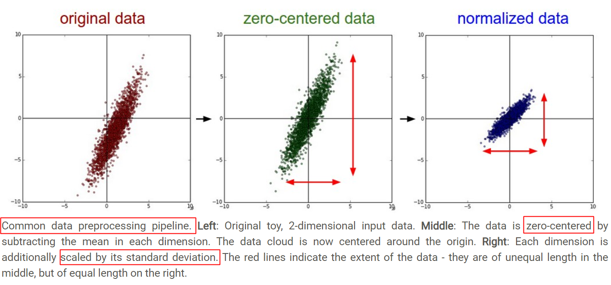

可通过PCA方法移除线性相关性（decorrelation），即引入旋转，找到新的坐标轴方向，在新坐标轴方向上用“标准差”进行缩放，如下图所示，图片来自[链接](https://www.researchgate.net/publication/221488699_Intersession_Compensation_and_Scoring_Methods_in_the_i-vectors_Space_for_Speaker_Recognition)，图中同时描述了unit length的作用——将所有样本映射到单位球上。

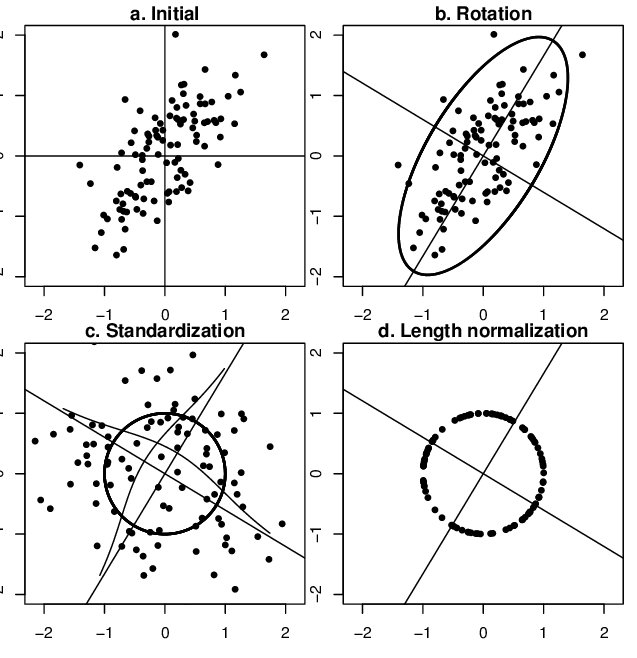

当特征维数更多时，对比如下，图片来自[youtube](https://www.youtube.com/watch?v=iYQbwgBh1aQ)，

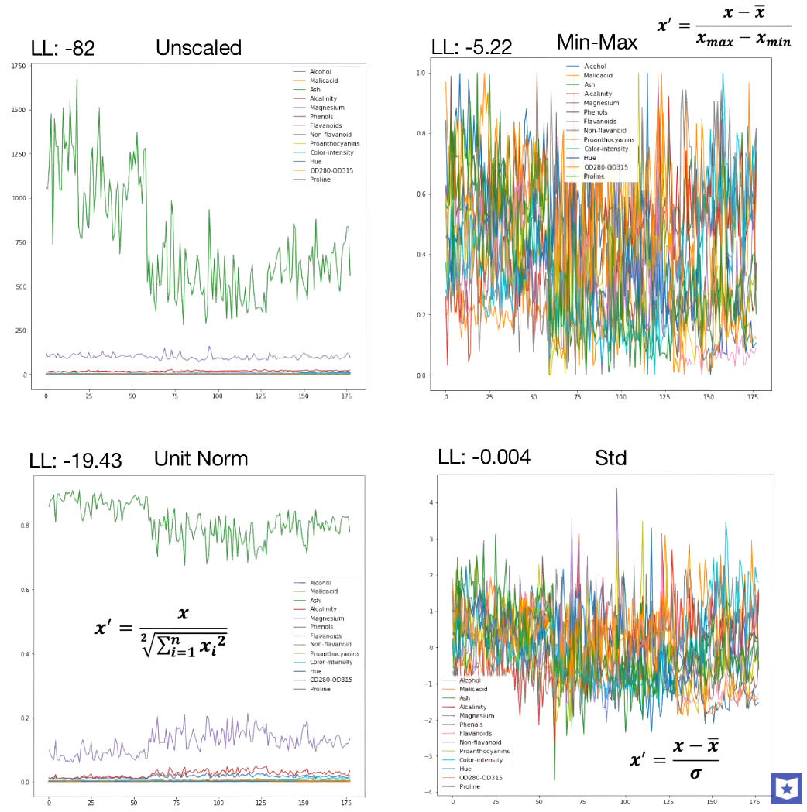

总的来说，**归一化/标准化的目的是为了获得某种“无关性”——偏置无关、尺度无关、长度无关……当归一化/标准化方法背后的物理意义和几何含义与当前问题的需要相契合时，其对解决该问题就有正向作用，反之，就会起反作用。所以，“何时选择何种方法”取决于待解决的问题，即problem-dependent。**

## 4. feature scaling 需要还是不需要

下图来自[data school-Comparing supervised learning algorithms](https://www.dataschool.io/comparing-supervised-learning-algorithms/)，对比了几个监督学习算法，最右侧两列为是否需要feature scaling。

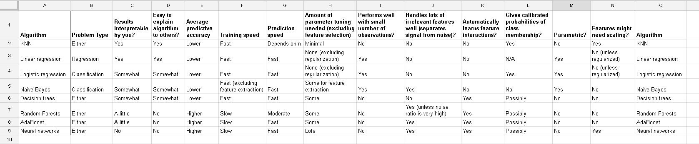

下面具体分析一下。

#### 4.1 什么时候需要feature scaling？

##### 4.1.1 涉及或隐含**距离计算**的算法

涉及或隐含**距离计算**的算法，比如K-means、KNN、PCA、SVM等，一般需要feature scaling，因为

- **zero-mean一般可以增加样本间余弦距离或者内积结果的差异**，区分力更强，假设数据集集中分布在第一象限遥远的右上角，将其平移到原点处，可以想象样本间余弦距离的差异被放大了。在模版匹配中，zero-mean可以明显提高响应结果的区分度。

- 就欧式距离而言，**增大某个特征的尺度，相当于增加了其在距离计算中的权重，如果有明确的先验知识表明某个特征很重要，那么适当增加其权重可能有正向效果，但如果没有这样的先验，或者目的就是想知道哪些特征更重要，那么就需要先feature scaling，对各维特征等而视之**。

- 增大尺度的同时也增大了该特征维度上的方差，PCA算法倾向于关注方差较大的特征所在的坐标轴方向，其他特征可能会被忽视，因此，在PCA前做Standardization效果可能更好，如下图所示，图片来自[scikit learn-Importance of Feature Scaling](https://scikit-learn.org/stable/auto_examples/preprocessing/plot_scaling_importance.html)，

  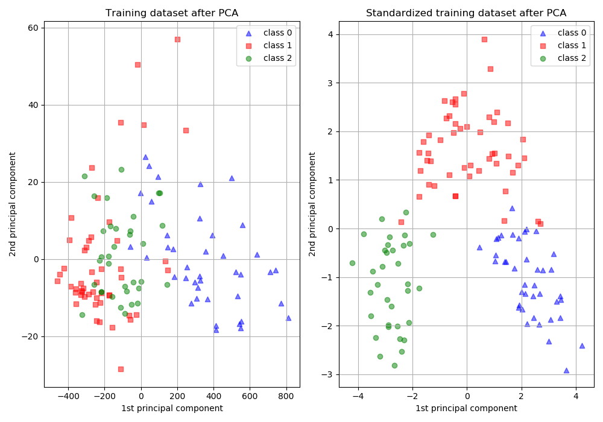

##### 4.1.2 损失函数中含有**正则项**时

损失函数中含有**正则项**时，一般需要feature scaling：对于线性模型𝑦=𝑤𝑥+𝑏而言，𝑥的任何线性变换（平移、放缩），都可以被𝑤和𝑏“吸收”掉，理论上，不会影响模型的拟合能力。但是，如果损失函数中含有正则项，如$𝜆||𝑤||^2$，λ为超参数，其对𝑤的每一个参数施加同样的惩罚，但对于某一维特征𝑥𝑖而言，其scale越大，系数𝑤𝑖越小，其在正则项中的比重就会变小，相当于对𝑤𝑖惩罚变小，即损失函数会相对忽视那些scale增大的特征，这并不合理，所以需要feature scaling，使损失函数平等看待每一维特征。

##### 4.1.3 梯度下降算法，需要feature scaling

**梯度下降算法，需要feature scaling**。梯度下降的参数更新公式如下，

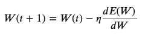

𝐸(𝑊)为损失函数，**收敛速度取决于：参数的初始位置到local minima的距离，以及学习率𝜂的大小**。一维情况下，**在local minima附近**，不同学习率对梯度下降的影响如下图所示，

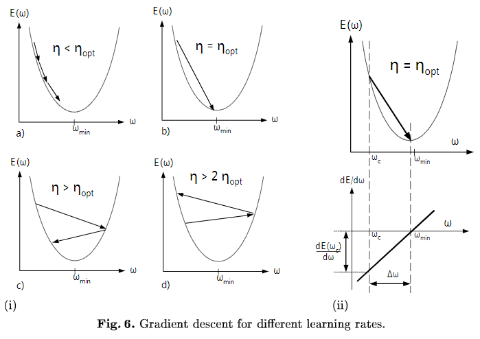

多维情况下可以分解成多个上图，每个维度上分别下降，参数𝑊为向量，但学习率只有1个，即所有参数维度共用同一个学习率（暂不考虑为每个维度都分配单独学习率的算法）。**收敛意味着在每个参数维度上都取得极小值，每个参数维度上的偏导数都为0，但是每个参数维度上的下降速度是不同的，为了每个维度上都能收敛，学习率应取所有维度在当前位置合适步长中最小的那个。**下面讨论feature scaling对gradient descent的作用，

- **zero center与参数初始化相配合，缩短初始参数位置与local minimum间的距离，加快收敛**。模型的最终参数是未知的，所以一般随机初始化，比如从0均值的均匀分布或高斯分布中采样得到，对线性模型而言，其分界面初始位置大致在原点附近，bias经常初始化为0，则分界面直接通过原点。同时，为了收敛，学习率不会很大。而每个数据集的特征分布是不一样的，如果其分布集中且距离原点较远，比如位于第一象限遥远的右上角，分界面可能需要花费很多步骤才能“爬到”数据集所在的位置。所以，无论什么数据集，先平移到原点，再配合参数初始化，可以保证分界面一定会穿过数据集。此外，**outliers常分布在数据集的外围**，与分界面从外部向内挪动相比，从中心区域开始挪动可能受outliers的影响更小。

- 对于采用均方误差损失LMS的线性模型，损失函数恰为二阶，如下图所示

  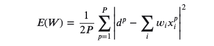

  **不同方向上的下降速度变化不同（二阶导不同，曲率不同）**，恰由输入的协方差矩阵决定，**feature scaling改变了损失函数的形状，减小不同方向上的曲率差异**。将每个维度上的下降分解来看，给定一个下降步长，如果不够小，有的维度下降的多，有的下降的少，有的还可能在上升，损失函数的整体表现可能是上升也可能是下降，就会不稳定。**scaling后不同方向上的曲率相对更接近，更容易选择到合适的学习率，使下降过程相对更稳定。**

- 另有从Hessian矩阵特征值以及condition number角度的理解，详见[Lecun paper-Efficient BackProp](http://yann.lecun.com/exdb/publis/pdf/lecun-98b.pdf)中的Convergence of Gradient Descent一节，有清晰的数学描述，同时还介绍了白化的作用——解除特征间的线性相关性，使每个维度上的梯度下降可独立看待。

- 文章开篇的椭圆形和圆形等高线图，仅在采用均方误差的线性模型上适用，其他损失函数或更复杂的模型，如深度神经网络，**损失函数的error surface可能很复杂，并不能简单地用椭圆和圆来刻画**，所以用它来解释feature scaling对所有损失函数的梯度下降的作用，似乎过于简化，见[Hinton vedio-3.2 The error surface for a linear neuron](https://www.bilibili.com/video/av9838961/?p=12)。

- 对于损失函数不是均方误差的情况，只要权重𝑤w与输入特征𝑥x间是相乘关系，损失函数对𝑤w的偏导必然含有因子𝑥x，𝑤w的梯度下降速度就会受到特征𝑥x尺度的影响。理论上为每个参数都设置上自适应的学习率，可以吸收掉𝑥x尺度的影响，但在实践中出于计算量的考虑，往往还是所有参数共用一个学习率，此时𝑥x尺度不同可能会导致不同方向上的下降速度悬殊较大，学习率不容易选择，下降过程也可能不稳定，通过scaling可对不同方向上的下降速度有所控制，使下降过程相对更稳定。

##### 4.1.4 对于传统的神经网络

对于传统的神经网络，对输入做feature scaling也很重要，因为采用sigmoid等有饱和区的激活函数，如果输入分布范围很广，参数初始化时没有适配好，很容易直接陷入饱和区，导致**梯度消失**，所以，需要对输入做Standardization或映射到\[0,1\]、\[−1,1]，配合精心设计的参数初始化方法，对值域进行控制。但自从有了Batch Normalization，每次线性变换改变特征分布后，都会重新进行Normalization，似乎可以不太需要对网络的输入进行feature scaling了？但习惯上还是会做feature scaling。

### 4.2 什么时候不需要Feature Scaling？

- 与距离计算无关的概率模型，不需要feature scaling，比如Naive Bayes；
- 与距离计算无关的基于树的模型，不需要feature scaling，比如决策树、随机森林等，树中节点的选择只关注当前特征在哪里切分对分类更好，即只在意特征内部的相对大小，而与特征间的相对大小无关。

