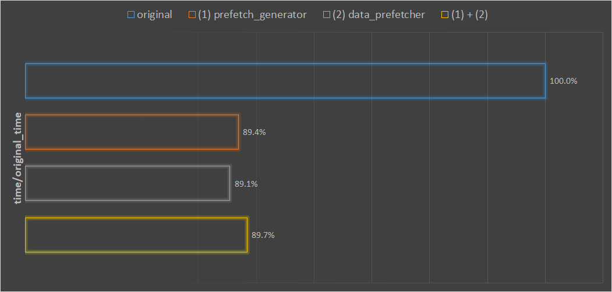
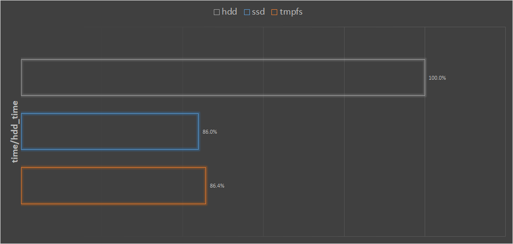
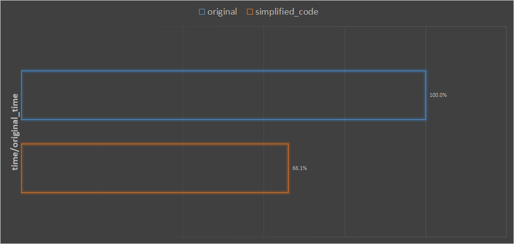

# PyTorch 加速数据读取(加速训练—提高 GPU 利用率)

⌚️: 2020年8月1日

📚参考

- [原文地址](https://tianws.github.io/skill/2019/08/27/gpu-volatile/)

---

## 1. 需求

最近在训练 coco 数据集，训练集就有 11 万张，训练一个 epoch 就要将近 100 分钟，训练 100 个 epoch，就需要 7 天！这实在是太慢了。

经过观察，发现训练时 GPU 利用率不是很稳定，每训练 5 秒，利用率都要从 100% 掉到 0% 一两秒，初步判断是数据读取那块出现了瓶颈。于是经过调研和实验，制定了下列解决方案。

## 2. 解决方案

### 2.1 prefetch_generator

使用 [prefetch_generator](https://pypi.org/project/prefetch_generator/) 库在后台加载下一 batch 的数据。

**安装：**

```
1 pip install prefetch_generator 
```

**使用：**

```
# 新建DataLoaderX类
from torch.utils.data import DataLoader 
from prefetch_generator import BackgroundGenerator 

class DataLoaderX(DataLoader):    
		def __iter__(self):        
				return BackgroundGenerator(super().__iter__()) 
```

然后用 `DataLoaderX` 替换原本的 `DataLoader`。

**提速原因：**

> 原本 PyTorch 默认的 DataLoader 会创建一些 worker 线程来预读取新的数据，但是除非这些线程的数据全部都被清空，这些线程才会读下一批数据。
>
> 使用 prefetch_generator，我们可以保证线程不会等待，每个线程都总有至少一个数据在加载。

### 2.2 data_prefetcher

使用 [data_prefetcher](https://github.com/NVIDIA/apex/blob/master/examples/imagenet/main_amp.py#L256) 新开 cuda stream 来拷贝 tensor 到 gpu。

**使用：**

```python
class data_prefetcher():
    def __init__(self, loader):
        self.loader = iter(loader)
        self.stream = torch.cuda.Stream()
        self.mean = torch.tensor([0.485 * 255, 0.456 * 255, 0.406 * 255]).cuda().view(1,3,1,1)
        self.std = torch.tensor([0.229 * 255, 0.224 * 255, 0.225 * 255]).cuda().view(1,3,1,1)
        # With Amp, it isn't necessary to manually convert data to half.
        # if args.fp16:
        #     self.mean = self.mean.half()
        #     self.std = self.std.half()
        self.preload()

    def preload(self):
        try:
            self.next_input, self.next_target = next(self.loader)
        except StopIteration:
            self.next_input = None
            self.next_target = None
            return
        # if record_stream() doesn't work, another option is to make sure device inputs are created
        # on the main stream.
        # self.next_input_gpu = torch.empty_like(self.next_input, device='cuda')
        # self.next_target_gpu = torch.empty_like(self.next_target, device='cuda')
        # Need to make sure the memory allocated for next_* is not still in use by the main stream
        # at the time we start copying to next_*:
        # self.stream.wait_stream(torch.cuda.current_stream())
        with torch.cuda.stream(self.stream):
            self.next_input = self.next_input.cuda(non_blocking=True)
            self.next_target = self.next_target.cuda(non_blocking=True)
            # more code for the alternative if record_stream() doesn't work:
            # copy_ will record the use of the pinned source tensor in this side stream.
            # self.next_input_gpu.copy_(self.next_input, non_blocking=True)
            # self.next_target_gpu.copy_(self.next_target, non_blocking=True)
            # self.next_input = self.next_input_gpu
            # self.next_target = self.next_target_gpu

            # With Amp, it isn't necessary to manually convert data to half.
            # if args.fp16:
            #     self.next_input = self.next_input.half()
            # else:
            self.next_input = self.next_input.float()
            self.next_input = self.next_input.sub_(self.mean).div_(self.std)

    def next(self):
        torch.cuda.current_stream().wait_stream(self.stream)
        input = self.next_input
        target = self.next_target
        if input is not None:
            input.record_stream(torch.cuda.current_stream())
        if target is not None:
            target.record_stream(torch.cuda.current_stream())
        self.preload()
        return input, target

```


然后对训练代码做改造：

```python
# ----改造前----
for iter_id, batch in enumerate(data_loader):
    if iter_id >= num_iters:
        break
    for k in batch:
        if k != 'meta':
            batch[k] = batch[k].to(device=opt.device, non_blocking=True)
    run_step()
    
# ----改造后----
prefetcher = DataPrefetcher(data_loader, opt)
batch = prefetcher.next()
iter_id = 0
while batch is not None:
    iter_id += 1
    if iter_id >= num_iters:
        break
    run_step()
    batch = prefetcher.next()
```

**提速原因：**

> 默认情况下，PyTorch 将所有涉及到 GPU 的操作（比如内核操作，cpu->gpu，gpu->cpu）都排入同一个 stream（default stream）中，并对同一个流的操作序列化，它们永远不会并行。要想并行，两个操作必须位于不同的 stream 中。
>
> 而前向传播位于 default stream 中，因此，要想将下一个 batch 数据的预读取（涉及 cpu->gpu）与当前 batch 的前向传播并行处理，就必须：
>
> 1. cpu 上的数据 batch 必须 pinned;
> 2. 预读取操作必须在另一个 stream 上进行
>
> 上面的 data_prefetcher 类满足这两个要求。
>
> 注意 dataloader 必须设置 pin_memory=True 来满足第一个条件。

### 2.3 把内存当硬盘

把数据放内存里，降低 io 延迟。

**使用：**

```
1 sudo mount tmpfs /path/to/your/data -t tmpfs -o size=30G 
```

然后把数据放挂载的目录下，即可。

- `size` 指定的是 tmpfs 动态大小的上限，实际大小根据实际使用情况而定；
- 数据不一定放在物理内存中，系统根据情况，有可能放在 `swap` 的页面，`swap` 一般是在系统盘；
- 重启或者断电后数据全部清空。

如果想系统启动时自动挂载，可以编辑 `/etc/fstab`，在最后添加如下内容：

```
mount tmpfs in /tmp/
tmpfs /tmp tmpfs size=30G 0 0
```

### 2.4 设置 num_worker

`DataLoader` 的 `num_worker` 如果设置太小，则不能充分利用多线程提速，如果设置太大，会造成线程阻塞，或者撑爆内存，反而导致训练变慢甚至程序崩溃。

他的大小和具体的硬件和软件都有关系，所以没有一个统一的标准，可以通过一些简单的实验来确定。

我的经验是设置成 cpu 的核心数或者 gpu 的数量比较合适。

### 2.5 优化数据预处理

主要有两个方面：

1. 尽量简化预处理的操作，使用 numpy、opencv 等优化过的库，多多利用向量化代码，提升代码运行效率；
2. 尽量缩减数据大小，不要传输无用信息。

### 2.6 其他

1. 使用 `TFRecord` 或者 `LMDB` 等，减少小文件的读写；
2. 使用 `apex.DistributedDataParallel` 替代 `torch.DataParallel`，使用 `apex` 进行加速；
3. 使用 `dali` 库，在 gpu 上直接进行数据预处理。

## 3. 实验

分别用不同的提速方法做实验，来定量地分析提速的效果。为了快速实验，采用了 5000 张的小批量训练集，确保一次 epoch 的训练时间很短。

### 3.1 **实验一：**



在 hdd 硬盘上，用同样的参数、同样的数据，分别用不同的优化方法，训练两个 epoch，记录训练的时间。

优化方法分别是：

- `original`：默认 dataloader，不优化
- `(1)prefetcher_generator`：只用 prefetcher_generator 库优化
- `(2)data_prefetcher`：只用 data_prefetcher 优化
- `(1)+(2)`：同时用 `prefetcher_generator` 和 `data_prefetcher` 优化

最后将得到的时间，除以不优化时的训练时间。

从图中可以观察到：

1. (1) 和 (2) 两种优化方法都差不多有 10% 左右的训练时间的缩短；
2. (1) (2) 同时使用，并没有进一步缩短训练时间，反而不如只使用一种优化方法。

### **3.2 实验二：**



用同样的参数、同样的数据，用默认的 dataloader，数据分别在 hdd、ssd 和 tmpfs 内存上进行训练两个 epoch，记录训练时间。

最后时间统一除以在 hdd 上的训练时间。

从图中可以观察到：

1. 将数据从 hdd 挪到 ssd 或者内存上，训练时间都有 14% 左右的缩短；
2. 在 tmpfs 上训练并不比在 ssd 上快，可能的原因是数据太大，训练时并没有放在物理内存上，而是放在 `swap` 上，而这台机器 `swap` 也是在ssd上，所以速度差不多。

### 3.3 **实验三：**



优化数据预处理代码，尽量用向量化代码，缩减数据传输大小，分别在 hdd 上，用默认 dataloader 训练。

如图，训练时间缩短了接近 34%！可见，在之前的代码中，主要是预处理部分拖慢了整体的训练速度。

## 4. 总结

以上定量地分析了各加速方法的效果，当然如果各方法都用上，最后的加速比例不是简单叠加的。

最后，我将数据放在 ssd 上、用了 (1) 或者 (2) 的优化方法、优化了数据预处理代码后，最后使得训练时间缩短了 39%！也就是说，如果原来训练一个模型需要 7 天，现在需要 4 天半，节省了 2 天半的时间。

所谓磨刀不误砍柴工，建议大家在正式训练前，花一点时间排查一下训练的瓶颈，尽量提升训练的速度，这是一劳永逸的，将在后面节省大量的时间，是非常值得的。
