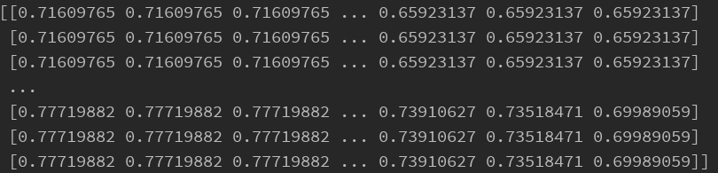
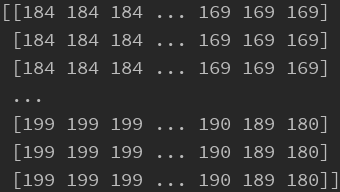

# Python读取图像的几种方法

⌚️: 2020年8月1日

📚参考

---

如何对图像进行处理是深度学习图像处理的基础，我们常常需要对图像进行读取、保存、缩放、裁剪、旋转、颜色转换等基本操作。接下来讲解如何利用opencv、PIL、 scikit-image等进行图像处理，并比较它们之间微小的差异。


## PIL

利用PIL中的Image函数，这个函数读取出来不是array格式。  这时候需要用 np.asarray(im) 或者np.array（）函数，区别是 np.array() 是深拷贝，np.asarray() 是浅拷贝

- 图像类型：RGB
- 数据类型：Image
- 元素类型：uint8
- 通道格式：H,W,C

```python
def PIL_demo():
    # 1、读取图片
    img = Image.open('images/JPEG图像 2.jpeg')

    # 2、显示图片/保存图片
    # img.show()  # 展示图片
    # img.save("images/PIL_save.jpeg")

    # 3、图片信息
    # print(img.mode)  # 图像类型
    # print(img.size)  # 图像的宽高

    # 4、图片操作

    # Image<->ndarray
    # img_arr = np.array(img)  # 转为numpy形式，(H,W,C)
    # new_img = Image.fromarray(img_arr)  # 再转换为Image形式

    # RGB->gray
    # gray = Image.open('image.jpg').convert('L')  # 灰度图
    # r, g, b = img.split()  # 通道的分离
    # img = Image.merge('RGB', (r, g, b))  # 通道的合并

    # img_copy = img.copy()  # 图像复制
    # w, h = 64, 64
    # img_resize = img.resize((w, h))  # resize
    # img_resize.show()  # 展示图片

    # 剪切
    # box = (200, 0, 500, 300)
    # print(img)
    # img2 = img.crop(box)
    # plt.imshow(img2)
    # plt.show()

    # 调整尺寸
    # img2 = img.resize((400, 400))
    # plt.imshow(img2)
    # plt.show()
    # # 左右对换。
    # img2 = img.transpose(Image.FLIP_LEFT_RIGHT)
    # plt.imshow(img2)
    # plt.show()
    # # 上下对换。
    # img2 = img.transpose(Image.FLIP_TOP_BOTTOM)
    # plt.imshow(img2)
    # plt.show()
    # # 旋转 90 度角。注意只能旋转90度的整数倍
    # img2 = img.transpose(Image.ROTATE_90)
    # plt.imshow(img2)
    # plt.show()

    # 颜色变换
    # img2 = img.convert('1')  # 将图片转化为黑白
    # plt.imshow(img2)
    # plt.show()
    # img2 = img.convert('F')  # 将图片转化为32位浮点灰色图像
    # plt.imshow(img2)
    # plt.show()
    # img2 = img.convert('P')  # 将图片转化为 使用调色板映射到其他模式
    # plt.imshow(img2)
    # plt.show()
    # img2 = img.convert('RGB')  # 将图片转化为真彩
    # plt.imshow(img2)
    # plt.show()
    # img2 = img.convert('RGBA')  # 将图片转化为 真彩+透明
    # plt.imshow(img2)
    # plt.show()
    # img2 = img.convert('CMYK')  # 将图片转化为颜色隔离
    # plt.imshow(img2)
    # plt.show()
    # img2 = img.convert('YCbCr')  # 将图片转化为彩色视频格式
    # plt.imshow(img2)
    # plt.show()
    # img2 = img.convert('I')  # 将图片转化为32位整型灰色图像
    # plt.imshow(img2)
    # plt.show()
    # img2 = img.convert('L')  # 将图片转化为黑白
    # plt.imshow(img2)
    # plt.show()

```

## Matplotlib

利用matplotlib.pyplot as plt用于显示图片，matplotlib.image as mpimg 用于读取图片，并且读取出来就是array格式

- 图像类型：RGB
- 数据类型：numpy
- 元素类型：float
- 通道格式：H,W,C

```python
    # 1、读取图片
    img = plt.imread('images/JPEG图像 2.jpeg')  # 读取图片

    # 2、显示&保存
    # plt.imshow(img)
    # plt.show()
    # plt.savefig('images/Matplotlib_save.jpg')  # 保存图片

    # 3、图片信息
    # I = mpimg.imread('images/JPEG图像 2.jpeg')
    # print(I.shape)
    # plt.imshow(I)
    # plt.show()

    # 4、图片操作
    img_r = img[:, :, 0]  # 灰度图
    plt.imshow(img_r, cmap='Greys_r')  # 显示灰度图
    plt.show()
```


## opencv-python

cv2.imread()读出来同样是array形式，但是如果是单通道的图，读出来的是三通道的

- 图像类型：BGR
- 数据类型：numpy
- 元素类型：uint8
- 通道格式：H,W,C

```python
import cv2
import numpy as np

img = cv2.imread('image.jpg')      #读取图片
cv2.imshow('the window name',img)  #显示图像
cv2.waitKey()                      
CV2.imwrite('new_image.jpg',img)   #保存图片
print(type(img))   #数据类型(numpy)
print(img.dtype)   #元素类型(uint8)
print(img.shape)  #通道格式(H,W,C)
print(img.size)   #像素点数
img = cv2.cvtColor(img,cv2.COLOR_BGR2RGB)  #BGR转RGB
gray = cv2.cvtColor(img,cv2.COLOR_BGR2GRAY)  #BGR转灰度图
gray = cv2.imread('image.jpg',cv2.IMREAD_GRAYSCALE)  #灰度图读取
image = cv2.resize(img,(100,200),interpolation=cv2.INTER_LINEAR) #resize
b,g,r = cv2.split(img)   #通道分离
merge_img = cv2.merge((b,g,r))   #通道合并
```

## scipy

图像的存取我一般喜欢用scipy这个库里的东西，读出来是矩阵形式，并且按照（H，W，C）形式保存

```python
    # 1、读取图片
    I = scipy.misc.imread('images/JPEG图像 2.jpeg')

    # 2、显示&存储
    scipy.misc.imsave('images/scipy_save.jpg', I)   # 有错误
    plt.imshow(I)
    plt.show()
```

## skimage

- 图像类型：RGB
- 数据类型：numpy
- 元素类型：uint8(三原色)，float64(resize后或者灰度图，且为0~1)
- 通道格式：H,W,C

```python
   # 1、读取图片
    img = io.imread('images/JPEG图像 2.jpeg', as_gray=True)  # 读取图片 False原图，True灰度图

    # 2、显示图片
    # plt.imshow(img)
    # plt.show()
    # io.imshow(img)
    # io.show()
    io.imsave('images/skimage_save.jpg', img)

    # 3、图片信息
    print(type(img))  # 数据类型(numpy)
    print(img.dtype)  # 元素类型(uint8)
    print(img.shape)  # 通道格式(H,W,C)

    # 4、图片操作

    # 将图片的大小变为500x500
    img1 = transform.resize(img, (500, 500))

    # 缩小为原来图片大小的0.1
    img2 = transform.rescale(img, 0.1)

    # 缩小为原来图片行数一半，列数四分之一
    img3 = transform.rescale(img, [0.5, 0.25])

    # 放大为原来图片大小的2倍
    img4 = transform.rescale(img, 2)

    # 旋转60度，不改变大小
    img5 = transform.rotate(img, 60)

    # 旋转60度，同时改变大小
    img6 = transform.rotate(img, 60, resize=True)
```


## Pytorch.ToTensor

- 接受对象：PIL Image或者numpy.ndarray
- 接受格式：输入为H*W*C
- 处理过程：自己转换为C*H*W，再转为float后每个像素除以255

## 各种库之间的转换

- Tensor转为numpy：`np.array(Tensor)`

- numpy转为Tensor：`torch.from_numpy(numpy.darray)`

- PIL.Image.Image换成numpy：`np.array(PIL.Image.Image)`

- numpy转成PIL.Image.Image：

  ```image
  注意：保证numpy.ndarray 转换成np.uint8，numpy.astype(np.uint8),像素值[0,255]；  
  灰度图像保证numpy.shape为(H,W)，不能出现channels 
  这里需要np.squeeze()。  
  彩色图象保证numpy.shape为(H,W,3)
  ```

- PIL.Image.Image转换成Tensor：

  ```kotlin
  彩色图像
  img2=Image.open('1.tif').convert('RGB')
  import torchvision.transforms as  transforms
  trans=transforms.Compose([transforms.ToTensor()])
  a=trans(img2)
  a=np.array(a)
  maxi=a.max()
  a=a/maxi*255
  a=a.transpose(1,2,0).astype(np.uint8)
  b=Image.fromarray(a)
  b
  ```

- PIL.Image转换成OpenCV

  ```swift
  import cv2  
  from PIL import Image  
  import numpy  
    
  image = Image.open("1.jpg")  
  image.show()  
  img = cv2.cvtColor(np.array(image),cv2.COLOR_RGB2BGR)  
  cv2.imshow("OpenCV",img)  
  cv2.waitKey()  
  ```

注释：cv2写图像时，灰度图像shape可以为(H,W)或（H,W,1)。彩色图像（H,W,3）
要从numpy.ndarray得到PIL.Image.Image，灰度图的shape必须为(H,W)，彩色为(H,W,3)


## **比较细节差异**

### **5.1读取方式上的不同**

我们首先从读取图片开始，PIL用open方法来读取图片，但opencv、skimage都以imread()读取图片。

### **5.2读进来内容的差异**

opencv读进来的图片已经是一个numpy矩阵了，彩色图片维度是（高度，宽度，通道数）。数据类型是uint8；

**opencv对于读进来的图片的通道排列是BGR，而不是主流的RGB！谨记！**

opencV存储的格式：BGR


PIL读进来的图像是一个对象，而不是我们所熟知的numpy 矩阵

PIL储存的格式

针对PIL读进来的图像是一个对象，那么如何才能将读进来的图片转为矩阵呢，方法如下：

```python
from PIL import Image
import numpy as np

img1 = Image.open('d:/picture/cat.jpg')
arr = np.array(img1)
```

转换后的格式

skimage读取一张图像时也是以numpy array形式读入skimage的存储格式是RGB。

skimage的存储格式RGB

**skimage有一个巨大的不同是读取灰度图时其图像的矩阵的值被归一化了，注意注意！**

我们skimage先看读取灰度图的方式，代码如下：

```python
from skimage import io

img=io.imread('d:/picture/cat.jpg',as_grey=True)
```

读取的结果如下图所示，明显看到被归一化了!



我们再看opencv和PIL读取灰度图时会不会被归一化呢？代码和对比如下：

opencv读取灰度图

```python
import cv2

img=cv2.imread('d:/picture/cat.jpg',cv2.IMREAD_GRAYSCALE) #opencv读取灰度图格式
```




PIL读取灰度图

```python
from PIL import Image

import numpy as np

img1 = Image.open('d:/picture/cat.jpg').convert('L') #PIL读取灰度图格式

arr = np.array(img1)
```


从上面的对比可以看出skimage读取灰度图时的巨大不同就是其图像的矩阵的值被归一化了！！！