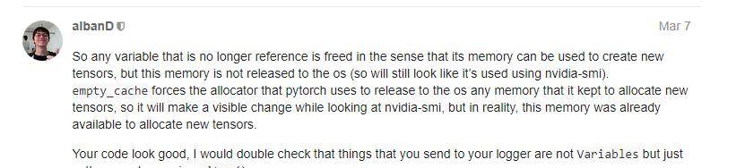

# 节约显存

⌚️: 2020年8月1日

📚参考

- [浅谈深度学习:如何计算模型以及中间变量的显存占用大小](https://oldpan.me/archives/how-to-calculate-gpu-memory)
- [如何在Pytorch中精细化利用显存](https://oldpan.me/archives/how-to-use-memory-pytorch)
- [神经网络-GPU和显存分析PPT](https://docs.google.com/presentation/d/e/2PACX-1vQVHMzd5MKrAbsYtCCsWDJ4eo9AUGGsC1tHtOY0agRfUbK0a9YCySvgNejuOLokB6tHbj0tLuohCaNP/pub?start=false&loop=false&delayms=3000&slide=id.p)
- [知乎QA](https://www.zhihu.com/question/274635237)

---

> 一般呢，神经网络显存的占用可以简单分为这**三部分**：
>
> 1. 网络模型自身参数占用的显存。
> 2. 模型计算时（包括forward/backward/optimizer）所产生的中间变量或参数也有占用显存。
> 3. 编程框架自身一些额外的开销。

## 1. 如何计算模型以及中间变量的显存占用大小

亲，显存炸了，你的显卡快冒烟了！

```python
torch.FatalError: cuda runtime error (2) : out of memory at /opt/conda/conda-bld/pytorch_1524590031827/work/aten/src/THC/generic/THCStorage.cu:58
```

想必这是所有炼丹师们最不想看到的错误，没有之一。

`OUT OF MEMORY`，显然是显存装不下你那么多的模型权重还有中间变量，然后程序奔溃了。怎么办，其实办法有很多，及时清空中间变量，优化代码，减少batch，等等等等，都能够减少显存溢出的风险。

要说的是上面这一切优化操作的基础，如何去计算我们所使用的显存。学会如何计算出来我们设计的模型以及中间变量所占显存的大小，想必知道了这一点，我们对自己显存也就会得心应手了。

### 1.1 如何计算

首先我们应该了解一下基本的数据量信息：

- 1 G = 1000 MB
- 1 M = 1000 KB
- 1 K = 1000 Byte
- 1 B = 8 bit

然后我们说一下我们平常使用的向量所占的空间大小，以Pytorch官方的数据格式为例（所有的深度学习框架数据格式都遵循同一个标准）：


我们只需要看左边的信息，在平常的训练中，我们经常使用的一般是这两种类型：

- float32 单精度浮点型
- int32 整型

一般一个8-bit的整型变量所占的空间为`1B`也就是`8bit`。而32位的float则占`4B`也就是`32bit`。而双精度浮点型double和长整型long在平常的训练中我们一般不会使用。

ps：消费级显卡对单精度计算有优化，服务器级别显卡对双精度计算有优化。

也就是说，假设有一幅RGB三通道真彩色图片，长宽分别为500 x 500，数据类型为单精度浮点型，那么这张图所占的显存的大小为：500 x 500 x 3 x 4B = 3M。

而一个(256,3,100,100)-(N,C,H,W)的FloatTensor所占的空间为256 x 3 x 100 x 100 x 4B = 31M

不多是吧，没关系，好戏才刚刚开始。

### 1.2 显存去哪儿了

看起来一张图片(3x256x256)和卷积层(256x100x100)所占的空间并不大，那为什么我们的显存依旧还是用的比较多，原因很简单，**占用显存比较多空间的并不是我们输入图像**，而是**神经网络中的中间变量**以及**使用optimizer算法时产生的巨量的中间参数**。

我们首先来简单计算一下Vgg16这个net需要占用的显存：

通常一个模型占用的显存也就是两部分：

- 模型自身的参数(params)

- 模型计算产生的中间变量(memory)

  


图片来自cs231n，这是一个典型的sequential-net，自上而下很顺畅，我们可以看到我们输入的是一张224x224x3的三通道图像，可以看到一张图像只占用`150x4k`，但上面标注的是`150k`，这是因为上图中在计算的时候默认的数据格式是8-bit而不是32-bit，所以最后的结果要乘上一个4。

我们可以看到，**左边的memory值代表：图像输入进去，图片以及所产生的中间卷积层所占的空间**。我们都知道，这些形形色色的深层卷积层也就是深度神经网络进行“思考”的过程：


图片从3通道变为64 –> 128 –> 256 –> 512 …. 这些都是卷积层，而我们的显存也主要是他们占用了。

还有上面**右边的params，这些是神经网络的权重大小**，可以看到第一层卷积是3×3，而输入图像的通道是3，输出通道是64，所以很显然，第一个卷积层权重所占的空间是 (3 x 3 x 3) x 64。

另外还有一个需要注意的是中间变量在backward的时候会翻倍！

为什么，举个例子，下面是一个计算图，输入`x`，经过中间结果`z`，然后得到最终变量`L`：


我们在backward的时候需要保存下来的中间值。输出是`L`，然后输入`x`，我们在backward的时候要求`L`对`x`的梯度，这个时候就需要在计算链`L`和`x`中间的`z`：


`dz/dx`这个中间值当然要保留下来以用于计算，所以粗略估计，`backward`的时候中间变量的占用了是`forward`的两倍！

### 1.3 优化器和动量

要注意，优化器也会占用我们的显存！

为什么,看这个式子:


上式是典型的SGD随机下降法的总体公式，权重`W`在进行更新的时候，会产生保存中间变量，也就是在优化的时候，模型中的params参数所占用的显存量会翻倍。

当然这只是SGD优化器，其他复杂的优化器如果在计算时需要的中间变量多的时候，就会占用更多的内存。

### 1.4 模型中哪些层会占用显存

有参数的层即会占用显存的层。我们一般的卷积层都会占用显存，而我们经常使用的激活层Relu没有参数就不会占用了。

占用显存的层一般是：

- 卷积层，通常的conv2d
- 全连接层，也就是Linear层
- BatchNorm层
- Embedding层

而不占用显存的则是：

- 刚才说到的激活层Relu等
- 池化层
- Dropout层

具体计算方式：

- Conv2d(Cin, Cout, K): 参数数目：Cin × Cout × K × K
- Linear(M->N): 参数数目：M×N
- BatchNorm(N): 参数数目： 2N
- Embedding(N,W): 参数数目： N × W

### 1.5 额外的显存

总结一下，我们在总体的训练中，占用显存大概分以下几类：

- 模型中的参数(卷积层或其他有参数的层)
- 模型在计算时产生的中间参数(也就是输入图像在计算时每一层产生的输入和输出)
- backward的时候产生的额外的中间参数
- 优化器在优化时产生的额外的模型参数

但其实，我们占用的显存空间为什么比我们理论计算的还要大，原因大概是因为深度学习框架一些额外的开销吧，不过如果通过上面公式，理论计算出来的显存和实际不会差太多的。


## 2. 如何在Pytorch中精细化利用显存

在上节中我们对如何计算各种变量所占显存大小进行了一些探索。而这节我们着重讲解如何利用Pytorch深度学习框架的一些特性，去查看我们当前使用的变量所占用的显存大小，以及一些优化工作。以下代码所使用的平台框架为Pytorch。

**优化显存**

在Pytorch中优化显存是我们处理大量数据时必要的做法，因为我们并不可能拥有无限的显存。显存是有限的，而数据是无限的，我们只有优化显存的使用量才能够最大化地利用我们的数据，实现多种多样的算法。

### 2.1 估测模型所占的内存

上节中说过，一个模型所占的显存无非是这两种：

- 模型权重参数
- 模型所储存的中间变量

其实权重参数一般来说并不会占用很多的显存空间，**主要占用显存空间的还是计算时产生的中间变量**，当我们定义了一个model之后，我们可以通过以下代码简单计算出这个模型权重参数所占用的数据量：

```python
import numpy as np

# model是我们在pytorch定义的神经网络层
# model.parameters()取出这个model所有的权重参数
para = sum([np.prod(list(p.size())) for p in model.parameters()])
```

假设我们有这样一个model：

```python
Sequential(
  (conv_1): Conv2d(3, 64, kernel_size=(3, 3), stride=(1, 1), padding=(1, 1))
  (relu_1): ReLU(inplace)
  (conv_2): Conv2d(64, 64, kernel_size=(3, 3), stride=(1, 1), padding=(1, 1))
  (relu_2): ReLU(inplace)
  (pool_2): MaxPool2d(kernel_size=2, stride=2, padding=0, dilation=1, ceil_mode=False)
  (conv_3): Conv2d(64, 128, kernel_size=(3, 3), stride=(1, 1), padding=(1, 1))
)
```

然后我们得到的`para`是`112576`，但是我们计算出来的仅仅是权重参数的“数量”，单位是B，我们需要转化一下：

```python
# 下面的type_size是4，因为我们的参数是float32也就是4B，4个字节
 print('Model {} : params: {:4f}M'.format(model._get_name(), para * type_size / 1000 / 1000))
```

这样就可以打印出：

```powershell
Model Sequential : params: 0.450304M
```

但是我们之前说过一个神经网络的模型，不仅仅有权重参数还要计算中间变量的大小。怎么去计算，我们可以假设一个`输入变量`，然后将这个输入变量投入这个模型中，然后我们主动提取这些计算出来的中间变量：

```python
# model是我们加载的模型
# input是实际中投入的input（Tensor）变量

# 利用clone()去复制一个input，这样不会对input造成影响
input_ = input.clone()   
# 确保不需要计算梯度，因为我们的目的只是为了计算中间变量而已
input_.requires_grad_(requires_grad=False)

mods = list(model.modules())
out_sizes = []

for i in range(1, len(mods)):
    m = mods[i]
    # 注意这里，如果relu激活函数是inplace则不用计算
    if isinstance(m, nn.ReLU):  
        if m.inplace:
            continue
    out = m(input_)
    out_sizes.append(np.array(out.size()))
    input_ = out

total_nums = 0
for i in range(len(out_sizes)):
    s = out_sizes[i]
    nums = np.prod(np.array(s))
    total_nums += nums
```

上面得到的值是模型在运行时候产生所有的中间变量的“数量”，当然我们需要换算一下：

```python
# 打印两种，只有 forward 和 foreward、backward的情况
print('Model {} : intermedite variables: {:3f} M (without backward)'
        .format(model._get_name(), total_nums * type_size / 1000 / 1000))
print('Model {} : intermedite variables: {:3f} M (with backward)'
        .format(model._get_name(), total_nums * type_size*2 / 1000 / 1000))
```

因为在`backward`的时候所有的中间变量需要保存下来再来进行计算，所以我们在计算`backward`的时候，计算出来的中间变量需要乘个2。

然后我们得出，上面这个模型的中间变量需要的占用的显存，很显然，中间变量占用的值比模型本身的权重值多多了。如果进行一次backward那么需要的就更多。

```powershell
Model Sequential : intermedite variables: 336.089600 M (without backward)
Model Sequential : intermedite variables: 672.179200 M (with backward)
```

我们总结一下之前的代码：

```python
# 模型显存占用监测函数
# model：输入的模型
# input：实际中需要输入的Tensor变量
# type_size 默认为 4 默认类型为 float32 

def modelsize(model, input, type_size=4):
    para = sum([np.prod(list(p.size())) for p in model.parameters()])
    print('Model {} : params: {:4f}M'.format(model._get_name(), para * type_size / 1000 / 1000))

    input_ = input.clone()
    input_.requires_grad_(requires_grad=False)

    mods = list(model.modules())
    out_sizes = []

    for i in range(1, len(mods)):
        m = mods[i]
        if isinstance(m, nn.ReLU):
            if m.inplace:
                continue
        out = m(input_)
        out_sizes.append(np.array(out.size()))
        input_ = out

    total_nums = 0
    for i in range(len(out_sizes)):
        s = out_sizes[i]
        nums = np.prod(np.array(s))
        total_nums += nums


    print('Model {} : intermedite variables: {:3f} M (without backward)'
          .format(model._get_name(), total_nums * type_size / 1000 / 1000))
    print('Model {} : intermedite variables: {:3f} M (with backward)'
          .format(model._get_name(), total_nums * type_size*2 / 1000 / 1000))
```

当然我们计算出来的占用显存值仅仅是做参考作用，因为Pytorch在运行的时候需要额外的显存值开销，所以实际的显存会比我们计算的稍微大一些。

### 2.2 关于`inplace=False`

我们都知道激活函数`Relu()`有一个默认参数`inplace`，默认设置为False，当设置为True时，我们在通过relu()计算时的得到的新值不会占用新的空间而是直接覆盖原来的值，这也就是为什么当inplace参数设置为True时可以节省一部分内存的缘故。


### 2.3 牺牲计算速度减少显存使用量

在`Pytorch-0.4.0`出来了一个新的功能，可以将一个计算过程分成两半，也就是如果一个模型需要占用的显存太大了，我们就可以先计算一半，保存后一半需要的中间结果，然后再计算后一半。

也就是说，新的`checkpoint`允许我们只存储反向传播所需要的部分内容。如果当中缺少一个输出(为了节省内存而导致的)，`checkpoint`将会从最近的检查点重新计算中间输出，以便减少内存使用(当然计算时间增加了)：

```python
# 输入
input = torch.rand(1, 10)
# 假设我们有一个非常深的网络
layers = [nn.Linear(10, 10) for _ in range(1000)]
model = nn.Sequential(*layers)output = model(input)
```

上面的模型需要占用很多的内存，因为计算中会产生很多的中间变量。为此`checkpoint`就可以帮助我们来节省内存的占用了。

```python
# 首先设置输入的input=>requires_grad=True
# 如果不设置可能会导致得到的gradient为0

input = torch.rand(1, 10, requires_grad=True)
layers = [nn.Linear(10, 10) for _ in range(1000)]


# 定义要计算的层函数，可以看到我们定义了两个
# 一个计算前500个层，另一个计算后500个层

def run_first_half(*args):
    x = args[0]
    for layer in layers[:500]:
        x = layer(x)
    return x

def run_second_half(*args):
    x = args[0]
    for layer in layers[500:-1]:
        x = layer(x)
    return x

# 我们引入新加的checkpoint
from torch.utils.checkpoint import checkpoint

x = checkpoint(run_first_half, input)
x = checkpoint(run_second_half, x)
# 最后一层单独调出来执行
x = layers[-1](x)
x.sum.backward()  # 这样就可以了
```

对于Sequential-model来说，因为`Sequential()`中可以包含很多的block，所以官方提供了另一个功能包：

```python
input = torch.rand(1, 10, requires_grad=True)
layers = [nn.Linear(10, 10) for _ in range(1000)]
model = nn.Sequential(*layers)

from torch.utils.checkpoint import checkpoint_sequential

# 分成两个部分
num_segments = 2
x = checkpoint_sequential(model, num_segments, input)
x.sum().backward()  # 这样就可以了
```

### 2.4 跟踪显存使用情况

显存的使用情况，在编写程序中我们可能无法精确计算，但是我们可以通过[pynvml](https://github.com/gpuopenanalytics/pynvml)这个Nvidia的Python环境库和Python的垃圾回收工具，可以实时地打印我们使用的显存以及哪些Tensor使用了我们的显存。

类似于下面的报告：

```none
# 08-Jun-18-17:56:51-gpu_mem_prof

At __main__ <module>: line 39                        Total Used Memory:399.4  Mb
At __main__ <module>: line 40                        Total Used Memory:992.5  Mb
+ __main__ <module>: line 40                         (1, 1, 682, 700)     1.82 M <class 'torch.Tensor'>
+ __main__ <module>: line 40                         (1, 3, 682, 700)     5.46 M <class 'torch.Tensor'>
At __main__ <module>: line 126                       Total Used Memory:1088.5 Mb
+ __main__ <module>: line 126                        (64, 64, 3, 3)       0.14 M <class 'torch.nn.parameter.Parameter'>
+ __main__ <module>: line 126                        (128, 64, 3, 3)      0.28 M <class 'torch.nn.parameter.Parameter'>
+ __main__ <module>: line 126                        (128, 128, 3, 3)     0.56 M <class 'torch.nn.parameter.Parameter'>
+ __main__ <module>: line 126                        (64, 3, 3, 3)        0.00 M <class 'torch.nn.parameter.Parameter'>
+ __main__ <module>: line 126                        (256, 256, 3, 3)     2.25 M <class 'torch.nn.parameter.Parameter'>
+ __main__ <module>: line 126                        (512, 256, 3, 3)     4.5 M <class 'torch.nn.parameter.Parameter'>
+ __main__ <module>: line 126                        (512, 512, 3, 3)     9.0 M <class 'torch.nn.parameter.Parameter'>
+ __main__ <module>: line 126                        (64,)                0.00 M <class 'torch.nn.parameter.Parameter'>
+ __main__ <module>: line 126                        (1, 3, 682, 700)     5.46 M <class 'torch.Tensor'>
+ __main__ <module>: line 126                        (128,)               0.00 M <class 'torch.nn.parameter.Parameter'>
+ __main__ <module>: line 126                        (256,)               0.00 M <class 'torch.nn.parameter.Parameter'>
+ __main__ <module>: line 126                        (512,)               0.00 M <class 'torch.nn.parameter.Parameter'>
+ __main__ <module>: line 126                        (3,)                 1.14 M <class 'torch.Tensor'>
+ __main__ <module>: line 126                        (256, 128, 3, 3)     1.12 M <class 'torch.nn.parameter.Parameter'>
...
```

以下是相关的代码，目前代码依然有些地方需要修改，等修改完善好我会将完整代码以及使用说明放到github上：https://github.com/Oldpan/Pytorch-Memory-Utils

```python
import datetime
import linecache
import os

import gc
import pynvml
import torch
import numpy as np


print_tensor_sizes = True
last_tensor_sizes = set()
gpu_profile_fn = f'{datetime.datetime.now():%d-%b-%y-%H:%M:%S}-gpu_mem_prof.txt'

# if 'GPU_DEBUG' in os.environ:
#     print('profiling gpu usage to ', gpu_profile_fn)

lineno = None
func_name = None
filename = None
module_name = None

# fram = inspect.currentframe()
# func_name = fram.f_code.co_name
# filename = fram.f_globals["__file__"]
# ss = os.path.dirname(os.path.abspath(filename))
# module_name = fram.f_globals["__name__"]


def gpu_profile(frame, event):
    # it is _about to_ execute (!)
    global last_tensor_sizes
    global lineno, func_name, filename, module_name

    if event == 'line':
        try:
            # about _previous_ line (!)
            if lineno is not None:
                pynvml.nvmlInit()
                # handle = pynvml.nvmlDeviceGetHandleByIndex(int(os.environ['GPU_DEBUG']))
                handle = pynvml.nvmlDeviceGetHandleByIndex(0)
                meminfo = pynvml.nvmlDeviceGetMemoryInfo(handle)
                line = linecache.getline(filename, lineno)
                where_str = module_name+' '+func_name+':'+' line '+str(lineno)

                with open(gpu_profile_fn, 'a+') as f:
                    f.write(f"At {where_str:<50}"
                            f"Total Used Memory:{meminfo.used/1024**2:<7.1f}Mb\n")

                    if print_tensor_sizes is True:
                        for tensor in get_tensors():
                            if not hasattr(tensor, 'dbg_alloc_where'):
                                tensor.dbg_alloc_where = where_str
                        new_tensor_sizes = {(type(x), tuple(x.size()), np.prod(np.array(x.size()))*4/1024**2,
                                             x.dbg_alloc_where) for x in get_tensors()}
                        for t, s, m, loc in new_tensor_sizes - last_tensor_sizes:
                            f.write(f'+ {loc:<50} {str(s):<20} {str(m)[:4]} M {str(t):<10}\n')
                        for t, s, m, loc in last_tensor_sizes - new_tensor_sizes:
                            f.write(f'- {loc:<50} {str(s):<20} {str(m)[:4]} M {str(t):<10}\n')
                        last_tensor_sizes = new_tensor_sizes
                pynvml.nvmlShutdown()

            # save details about line _to be_ executed
            lineno = None

            func_name = frame.f_code.co_name
            filename = frame.f_globals["__file__"]
            if (filename.endswith(".pyc") or
                    filename.endswith(".pyo")):
                filename = filename[:-1]
            module_name = frame.f_globals["__name__"]
            lineno = frame.f_lineno

            return gpu_profile

        except Exception as e:
            print('A exception occured: {}'.format(e))

    return gpu_profile


def get_tensors():
    for obj in gc.get_objects():
        try:
            if torch.is_tensor(obj):
                tensor = obj
            else:
                continue
            if tensor.is_cuda:
                yield tensor
        except Exception as e:
            print('A exception occured: {}'.format(e))
```

需要注意的是，linecache中的getlines只能读取缓冲过的文件，如果这个文件没有运行过则返回无效值。Python 的垃圾收集机制会在变量没有应引用的时候立马进行回收，但是为什么模型中计算的中间变量在执行结束后还会存在呢。既然都没有引用了为什么还会占用空间？

一种可能的情况是这些引用不在Python代码中，而是在神经网络层的运行中为了backward被保存为gradient，这些引用都在计算图中，我们在程序中是无法看到的：


## 3. 再次浅谈Pytorch中的显存利用问题(附完善显存跟踪代码)

在**如何计算模型以及中间变量的显存占用大小**和**如何在Pytorch中精细化利用显存**中我们已经谈论过了平时使用中显存的占用来自于哪里，以及如何在Pytorch中更好地使用显存。在这篇文章中，我们借用[Pytorch-Memory-Utils](https://github.com/Oldpan/Pytorch-Memory-Utils)这个工具来检测我们在训练过程中关于显存的变化情况，分析出我们如何正确释放多余的显存。

在深度探究前先了解下我们的输出信息，通过[Pytorch-Memory-Utils](https://github.com/Oldpan/Pytorch-Memory-Utils)工具，我们在使用显存的代码中间插入检测函数(如何使用见工具github页面和下文部分)，就可以输出类似于下面的信息，`At __main__ <module>: line 13 Total Used Memory:696.5 Mb`表示在当前行代码时所占用的显存，即在我们的代码中执行到13行的时候所占显存为695.5Mb。`At __main__ <module>: line 15 Total Used Memory:1142.0 Mb`表示程序执行到15行时所占的显存为1142.0Mb。两条数据之间表示所占显存的`tensor`变量。

```markdown
# 12-Sep-18-21:48:45-gpu_mem_track.txt

GPU Memory Track | 12-Sep-18-21:48:45 | Total Used Memory:696.5  Mb

At __main__ <module>: line 13                        Total Used Memory:696.5  Mb

+ | 7 * Size:(512, 512, 3, 3)     | Memory: 66.060 M | <class 'torch.nn.parameter.Parameter'>
+ | 1 * Size:(512, 256, 3, 3)     | Memory: 4.7185 M | <class 'torch.nn.parameter.Parameter'>
+ | 1 * Size:(64, 64, 3, 3)       | Memory: 0.1474 M | <class 'torch.nn.parameter.Parameter'>
+ | 1 * Size:(128, 64, 3, 3)      | Memory: 0.2949 M | <class 'torch.nn.parameter.Parameter'>
+ | 1 * Size:(128, 128, 3, 3)     | Memory: 0.5898 M | <class 'torch.nn.parameter.Parameter'>
+ | 8 * Size:(512,)               | Memory: 0.0163 M | <class 'torch.nn.parameter.Parameter'>
+ | 3 * Size:(256, 256, 3, 3)     | Memory: 7.0778 M | <class 'torch.nn.parameter.Parameter'>
+ | 1 * Size:(256, 128, 3, 3)     | Memory: 1.1796 M | <class 'torch.nn.parameter.Parameter'>
+ | 2 * Size:(64,)                | Memory: 0.0005 M | <class 'torch.nn.parameter.Parameter'>
+ | 4 * Size:(256,)               | Memory: 0.0040 M | <class 'torch.nn.parameter.Parameter'>
+ | 2 * Size:(128,)               | Memory: 0.0010 M | <class 'torch.nn.parameter.Parameter'>
+ | 1 * Size:(64, 3, 3, 3)        | Memory: 0.0069 M | <class 'torch.nn.parameter.Parameter'>

At __main__ <module>: line 15                        Total Used Memory:1142.0 Mb

+ | 1 * Size:(60, 3, 512, 512)    | Memory: 188.74 M | <class 'torch.Tensor'>
+ | 1 * Size:(30, 3, 512, 512)    | Memory: 94.371 M | <class 'torch.Tensor'>
+ | 1 * Size:(40, 3, 512, 512)    | Memory: 125.82 M | <class 'torch.Tensor'>

At __main__ <module>: line 21                        Total Used Memory:1550.9 Mb

+ | 1 * Size:(120, 3, 512, 512)   | Memory: 377.48 M | <class 'torch.Tensor'>
+ | 1 * Size:(80, 3, 512, 512)    | Memory: 251.65 M | <class 'torch.Tensor'>

At __main__ <module>: line 26                        Total Used Memory:2180.1 Mb

- | 1 * Size:(120, 3, 512, 512)   | Memory: 377.48 M | <class 'torch.Tensor'> 
- | 1 * Size:(40, 3, 512, 512)    | Memory: 125.82 M | <class 'torch.Tensor'> 

At __main__ <module>: line 32                        Total Used Memory:1676.8 Mb
```

使用[Pytorch-Memory-Utils](https://github.com/Oldpan/Pytorch-Memory-Utils)得到的显存跟踪结果。

### 3.1 导包

了解了[Pytorch-Memory-Utils](https://github.com/Oldpan/Pytorch-Memory-Utils)工具如何使用后，接下来我们通过若干段程序代码来演示在Pytorch训练中：

- 平时的显存是如何变化的，到底是什么占用了显存。
- 如何去释放不需要的显存。

首先，我们在下段代码中导入我们需要的库，随后开始我们的显存检测程序。

```python
import torch
import inspect

from torchvision import models
from gpu_mem_track import MemTracker  # 引用显存跟踪代码

device = torch.device('cuda:0')

frame = inspect.currentframe()     
gpu_tracker = MemTracker(frame)      # 创建显存检测对象

gpu_tracker.track()                  # 开始检测
```

### 3.2 预训练权重模型

首先我们检测一下**神经网络模型权重**所占用的显存信息，下面代码中我们尝试加载`VGG19`这个经典的网络模型，并且导入预训练好的权重。

```python
gpu_tracker.track()
cnn = models.vgg19(pretrained=True).to(device)  # 导入VGG19模型并且将数据转到显存中
gpu_tracker.track()
```

然后可以发现程序运行过程中的显存变化（第一行是载入前的显存，最后一行是载入后的显存）：

```markdown
At __main__ <module>: line 13                        Total Used Memory:472.2  Mb

+ | 1 * Size:(128, 64, 3, 3)      | Memory: 0.2949 M | <class 'torch.nn.parameter.Parameter'>
+ | 1 * Size:(256, 128, 3, 3)     | Memory: 1.1796 M | <class 'torch.nn.parameter.Parameter'>
+ | 1 * Size:(64, 64, 3, 3)       | Memory: 0.1474 M | <class 'torch.nn.parameter.Parameter'>
+ | 2 * Size:(4096,)              | Memory: 0.0327 M | <class 'torch.nn.parameter.Parameter'>
+ | 1 * Size:(512, 256, 3, 3)     | Memory: 4.7185 M | <class 'torch.nn.parameter.Parameter'>
+ | 2 * Size:(128,)               | Memory: 0.0010 M | <class 'torch.nn.parameter.Parameter'>
+ | 1 * Size:(1000, 4096)         | Memory: 16.384 M | <class 'torch.nn.parameter.Parameter'>
+ | 6 * Size:(512,)               | Memory: 0.0122 M | <class 'torch.nn.parameter.Parameter'>
+ | 1 * Size:(64, 3, 3, 3)        | Memory: 0.0069 M | <class 'torch.nn.parameter.Parameter'>
+ | 1 * Size:(4096, 25088)        | Memory: 411.04 M | <class 'torch.nn.parameter.Parameter'>
+ | 1 * Size:(4096, 4096)         | Memory: 67.108 M | <class 'torch.nn.parameter.Parameter'>
+ | 5 * Size:(512, 512, 3, 3)     | Memory: 47.185 M | <class 'torch.nn.parameter.Parameter'>
+ | 2 * Size:(64,)                | Memory: 0.0005 M | <class 'torch.nn.parameter.Parameter'>
+ | 3 * Size:(256,)               | Memory: 0.0030 M | <class 'torch.nn.parameter.Parameter'>
+ | 1 * Size:(128, 128, 3, 3)     | Memory: 0.5898 M | <class 'torch.nn.parameter.Parameter'>
+ | 2 * Size:(256, 256, 3, 3)     | Memory: 4.7185 M | <class 'torch.nn.parameter.Parameter'>
+ | 1 * Size:(1000,)              | Memory: 0.004 M | <class 'torch.nn.parameter.Parameter'>

At __main__ <module>: line 15                        Total Used Memory:1387.5 Mb
```

通过上面的报告，很容易发现一个问题。

首先我们知道VGG19所有层的权重大小加起来大约是**548M**(这个数值来源于Pytorch官方提供的VGG19权重文件大小)，我们将上面报告打印的Tensor-Memory也都加起来算下来也差不多**551.8Mb**。但是，我们算了两次打印的显存实际占用中：**1387.5 – 472.2 = 915.3 MB**。

唉，怎么多用了差不多400Mb呢？是不是报告出什么问题了。

这样，我们再加点Tensor试一下。

```python
...

gpu_tracker.track()
cnn = models.vgg19(pretrained=True).to(device)
gpu_tracker.track()
# 上方为之前的代码

# 新增加的tensor
dummy_tensor_1 = torch.randn(30, 3, 512, 512).float().to(device)  # 30*3*512*512*4/1000/1000 = 94.37M
dummy_tensor_2 = torch.randn(40, 3, 512, 512).float().to(device)  # 40*3*512*512*4/1000/1000 = 125.82M
dummy_tensor_3 = torch.randn(60, 3, 512, 512).float().to(device)  # 60*3*512*512*4/1000/1000 = 188.74M

gpu_tracker.track()   # 再次打印
```

如上面的代码，我们又加入了三个Tensor，全部放到显存中。报告如下：

```markdown
At __main__ <module>: line 15                        Total Used Memory:1387.5 Mb

+ | 1 * Size:(30, 3, 512, 512)    | Memory: 94.371 M | <class 'torch.Tensor'>
+ | 1 * Size:(40, 3, 512, 512)    | Memory: 125.82 M | <class 'torch.Tensor'>
+ | 1 * Size:(60, 3, 512, 512)    | Memory: 188.74 M | <class 'torch.Tensor'>

At __main__ <module>: line 21                        Total Used Memory:1807.0 Mb
```

上面的报告就比较正常了：**94.3 + 125.8 + 188.7 = 408.8** 约等于 **1807.0 – 1387.5 = 419.5**，误差可以忽略，因为肯定会存在一些开销使用的显存。

那之前是什么情况？是不是模型的权重信息占得显存就稍微多一点？

这样，我们将载入VGG19模型的代码注释掉，只对后面的三个Tensor进行检测。

```python
...

gpu_tracker.track()
# cnn = models.vgg19(pretrained=True).to(device)   注释掉读权重代码
gpu_tracker.track()

...
```

可以发现：

```markdown
GPU Memory Track | 15-Sep-18-13:59:03 | Total Used Memory:513.3  Mb


At __main__ <module>: line 13                        Total Used Memory:513.3  Mb


At __main__ <module>: line 15                        Total Used Memory:513.3  Mb


At __main__ <module>: line 18                        Total Used Memory:513.3  Mb

+ | 1 * Size:(60, 3, 512, 512)    | Memory: 188.74 M | <class 'torch.Tensor'>
+ | 1 * Size:(30, 3, 512, 512)    | Memory: 94.371 M | <class 'torch.Tensor'>
+ | 1 * Size:(40, 3, 512, 512)    | Memory: 125.82 M | <class 'torch.Tensor'>

At __main__ <module>: line 24                        Total Used Memory:1271.3 Mb
```

同样，显存占用比所列出来的Tensor占用大，**我们暂时将次归结为Pytorch在开始运行程序时需要额外的显存开销，这种额外的显存开销与我们实际使用的模型权重显存大小无关。**

### 3.3 Pytorch使用的显存策略

Pytorch已经可以自动回收我们“不用的”显存，类似于python的引用机制，当某一内存内的数据不再有任何变量引用时，这部分的内存便会被释放。但有一点需要注意，当我们有一部分显存不再使用的时候，这部分释放的显存通过`Nvidia-smi`命令是看不到的，举个例子：

```python
device = torch.device('cuda:0')
# 定义两个tensor
dummy_tensor_4 = torch.randn(120, 3, 512, 512).float().to(device)  # 120*3*512*512*4/1000/1000 = 377.48M
dummy_tensor_5 = torch.randn(80, 3, 512, 512).float().to(device)  # 80*3*512*512*4/1000/1000 = 251.64M

# 然后释放
dummy_tensor_4 = dummy_tensor_4.cpu()
dummy_tensor_2 = dummy_tensor_2.cpu()
# 这里虽然将上面的显存释放了，但是我们通过Nvidia-smi命令看到显存依然在占用
torch.cuda.empty_cache()
# 只有执行完上面这句，显存才会在Nvidia-smi中释放
```

Pytorch的开发者也对此进行说明了，这部分释放后的显存可以用，只不过不在Nvidia-smi中显示罢了。



### 3.4 关于模型调用

`torch.no_grad()`是Pytorch-0.4版本时候更新的功能，在此语句的作用域下，所有的tensor运算不会保存梯度值，特别适合在`inference`的时候使用，代替旧版本的`volatile`。

用一段代码演示下，这里我们根据VGG19网络构造一个特征提取器，分别提取`content_image`和`style_image`的特征图，然后将提取的特征图存在两个list中,我们使用了`with torch.no_grad()`语句(在没使用`no_grad`之前占用的显存更多，不过这里不进行展示了)：

```python
gpu_tracker.track()

layers = ['relu_1', 'relu_3', 'relu_5', 'relu_9']    # 提取的层数
layerIdx = 0

content_image = torch.randn(1, 3, 500, 500).float().to(device)
style_image = torch.randn(1, 3, 500, 500).float().to(device)
feature_extractor = nn.Sequential().to(device)           # 特征提取器
cnn = models.vgg19(pretrained=True).features.to(device)  # 采取VGG19


input_features = []      # 保存提取出的features
target_features = []     # 保存提取出的features
i = 0
# 如果不加下面这一句,那么显存的占用提升,因为保存了中间计算的梯度值
with torch.no_grad():
    for layer in cnn.children():
        if layerIdx < len(layers):
            if isinstance(layer, nn.Conv2d):
                i += 1
                name = "conv_" + str(i)
                feature_extractor.add_module(name, layer)
            elif isinstance(layer, nn.MaxPool2d):
                name = "pool_" + str(i)
                feature_extractor.add_module(name, layer)
            elif isinstance(layer, nn.ReLU):
                name = "relu_" + str(i)
                feature_extractor.add_module(name, nn.ReLU(inplace=True))
            if name == layers[layerIdx]:
                input = feature_extractor(content_image)
                gpu_tracker.track()
                target = feature_extractor(style_image)
                gpu_tracker.track()

                input_features.append(input)
                target_features.append(target)

                del input
                del target

                layerIdx += 1

gpu_tracker.track()
```

进行GPU跟踪后，观察下显存变化：

```markdown
At __main__ <module>: line 33                        Total Used Memory:1313.3 Mb

+ | 2 * Size:(64,)                | Memory: 0.0005 M | <class 'torch.nn.parameter.Parameter'>
+ | 2 * Size:(1, 3, 500, 500)     | Memory: 6.0 M | <class 'torch.Tensor'>
+ | 1 * Size:(64, 64, 3, 3)       | Memory: 0.1474 M | <class 'torch.nn.parameter.Parameter'>
+ | 1 * Size:(128, 64, 3, 3)      | Memory: 0.2949 M | <class 'torch.nn.parameter.Parameter'>
+ | 2 * Size:(128,)               | Memory: 0.0010 M | <class 'torch.nn.parameter.Parameter'>
+ | 2 * Size:(1, 256, 125, 125)   | Memory: 32.0 M | <class 'torch.Tensor'>
+ | 1 * Size:(128, 128, 3, 3)     | Memory: 0.5898 M | <class 'torch.nn.parameter.Parameter'>
+ | 7 * Size:(512, 512, 3, 3)     | Memory: 66.060 M | <class 'torch.nn.parameter.Parameter'>
+ | 3 * Size:(256, 256, 3, 3)     | Memory: 7.0778 M | <class 'torch.nn.parameter.Parameter'>
+ | 2 * Size:(1, 512, 62, 62)     | Memory: 15.745 M | <class 'torch.Tensor'>
+ | 1 * Size:(64, 3, 3, 3)        | Memory: 0.0069 M | <class 'torch.nn.parameter.Parameter'>
+ | 2 * Size:(1, 128, 250, 250)   | Memory: 64.0 M | <class 'torch.Tensor'>
+ | 8 * Size:(512,)               | Memory: 0.0163 M | <class 'torch.nn.parameter.Parameter'>
+ | 4 * Size:(256,)               | Memory: 0.0040 M | <class 'torch.nn.parameter.Parameter'>
+ | 1 * Size:(256, 128, 3, 3)     | Memory: 1.1796 M | <class 'torch.nn.parameter.Parameter'>
+ | 1 * Size:(512, 256, 3, 3)     | Memory: 4.7185 M | <class 'torch.nn.parameter.Parameter'>
+ | 2 * Size:(1, 64, 500, 500)    | Memory: 128.0 M | <class 'torch.Tensor'>

At __main__ <module>: line 76                        Total Used Memory:1932.0 Mb
```

上表中4*2个`<class 'torch.Tensor'>`是提取出的特征图，其他的`<class 'torch.nn.parameter.Parameter'>`则是模型的权重值，但是发现，所有的值加起来，与总显存变化又不同，那究竟多了哪些占用显存的东西？

其实原因很简单，除了在程序运行时的一些额外显存开销，另外一个占用显存的东西就是我们在计算时候的临时缓冲值，这些零零总总也会占用一部分显存，并且这些缓冲值通过Python的垃圾收集是收集不到的。

### 3.5 Asynchronous execution

做过并行计算或者操作系统的同学可能知道，GPU的计算方式一般是异步的。异步运算不像同步运算那样是按照顺序一步一步来，异步是同时进行的，异步计算中，两种不一样的操作可能会发生同时触发的情况，这是处理两者间的前后关系、依赖关系或者冲突关系就比较重要了。

有一个众所周知的小技巧，在执行训练程序的时候将环境变量`CUDA_LAUNCH_BLOCKING=1`设为1(强制同步)可以准确定位观察到我们显存操作的错误代码行数。


## 4. 节约显存

> 目录: 那些 0 成本节省显存的方法
>
> 1. 浮点混合运算 (节省 20% 左右) 
> 2. 优化架构代码 (节省 10% ~ 40% 不等)
> 3. 读取数据并行操作 (节省 0% ~ 50% 不等)


基本操作 check list:

- relu 用 `inplace=True`
- 用 `eval()` 和 `with torch.no_grad():`
- 每个 batch 后认真的把所有参数从 GPU 拿出来后删除 
- **虽然很多回答建议用, 但我建议不要用 `torch.cuda.empty_cache()`** , 这只是释放 GPU 缓存而使得 `nvidia-smi` 能看得见 pytorch 自动释放的内存而已. **99% 的用户不需要使用这个命令.** 并有用户反应每次用**反而会减慢 1~2s**.
- 注意: 当**每张 GPU 里面的** batch_size 太小(<8)时用 batch_norm 会导致训练不稳定, 除非你用以下所说的 APEX 来实现多 GPU `sync_bn`
- `torch.backends.cudnn.deterministic = True` 用不用对 GPU 内存占用和效率都没有什么太大的影响. 建议开着.
- 不要用 `.cpu()` 来取 GPU 里面出来的图片. 这样做的话训练时长可能翻倍. 

以下介绍进阶操作

### 4.1  浮点混合运算

**使用环境**: 所有. 对

**实现**: 使用 APEX: [https://github.com/NVIDIA/apex](https://www.readercache.com/redirect?url=https%3A//github.com/NVIDIA/apex)

安装只需要三行命令: **但有坑, 请按照此教程一步一步来**

```bash
$ git clone https://github.com/NVIDIA/apex
$ cd apex
$ pip install -v --no-cache-dir --global-option="--pyprof" --global-option="--cpp_ext" --global-option="--cuda_ext" ./
```

### 4.2 **优化架构代码**

**TL;DR**: 用 `del` 或 `replacing variables` 的方法像减少 cpu 内存占用一样减少 gpu 显存占用.

**使用环境**: 自定义或复杂的网络架构; 特别是 unet 等需要再利用 `feature_map` 的网络架构


**问题**: 如图, 大部分的显存都被 `feature_map` 占用用来 `back prop`, 说明 input 的大小和模型的大小基本上就能决定显存的占用. 但是 `forward` 计算过程中能不能偷工减料?

**原理**: 众所周知 pytorch 架构中的 forward 是实际上 tensor 在 gpu 的走法，那么 forward 中的代码就会影响 gpu 的使用.

**实现**: 研究 pytorch 官方架构就会发现大部分 forward pass 都是 `x = self.conv(x)` 的形式, 很少 introduce new variable. 所以: (1) 把不需要的变量都由 `x` 代替; (2) 变量用完后用 `del` 删除.

**例子**

```python3
def forward(self, x):
    conv2 = self.conv2(self.conv1(x)) #1/4
    del x
    conv3 = self.conv3(conv2) #1/8
    conv4 = self.conv4(conv3) #1/16
    conv5 = self.conv5(conv4) #1/32

    center_64 = self.center_conv1x1(self.center_global_pool(conv5))

    d5 = self.decoder5(self.center(conv5), conv5)
    del conv5
    d4 = self.decoder4(d5, conv4)
    del conv4
    d3 = self.decoder3(d4, conv3)
    del conv3
    d2 = self.decoder2(d3, conv2)
    del conv2

    hypercol = F.dropout2d(torch.cat((
        self.decoder1(d2),
        F.upsample(d2, scale_factor=2,mode='bilinear'),
        F.upsample(d3, scale_factor=4, mode='bilinear'),
        F.upsample(d4, scale_factor=8, mode='bilinear'),
        F.upsample(d5, scale_factor=16, mode='bilinear')),1), p=0.50)

    hypercol_add_center = self.logits_final(torch.cat((
        hypercol,
        F.upsample(center_64, scale_factor=hypercol.shape[2],mode='bilinear')),1))

    return self.center_fc(center_64.view(center_64.size(0), -1)), self.logits_no_empty(hypercol), hypercol_add_center
```

*(此方法经过单变量测试确实有效-成功放入1024x1024的图片-, 但理论尚未严格证明, 如有说错请指出. 本文只解决显存问题, 对显卡利用效率没有研究. 可能会影响 backprop 速度.)*

*Other Resources:*

[Manage memory differently on train and test time pytorch](https://stackoverflow.com/questions/55667005/manage-memory-differently-on-train-and-test-time-pytorch)

[How to Train a Very Large and Deep Model on One GPU? ](https://medium.com/syncedreview/how-to-train-a-very-large-and-deep-model-on-one-gpu-7b7edfe2d072)


### 4.3 读取数据并行操作

按照以下方式设置 pytorch 的 train_loader:

- num_workers: CPU 使用线程. 一般建议这个值填写你机器总共 CPU 的数量
- pin_memory: 是否先把数据加载到缓存再加载到GPU. 如果你用的不是你私人工作电脑, 请开启.
- drop_last: 如果是这是训练使用的 dataset, 请开启, 这样最后一个 batch 如果小于你的 batch_size, 会扔掉, 这样训练就会更稳定.

```python3
data_loader = data.DataLoader(YOUR_PYTORCH_DATASET,
                              num_workers=THE_NUMBER_OF_CPU_I_HAVE,
                              pin_memory=True,
                              drop_last=True,  # Last batch will mess up with batch norm https://github.com/pytorch/pytorch/issues/4534
                              ))
```

如果你按照上面的方法把 `pin_memory` 开启了的话, 请数据放入 GPU 的时候把 `non_blocking` 开启. 这样如果你只把数据放入 GPU 而不把数据从 GPU 拿出来再做计算的话就会加快很多 (据用户报告可加速 50%). 就算你把 GPU 中数据拿出来 (ie. 用了 `.cpu()` 命令, 最坏的结果也是与 `non_blocking=False` 相当:

```python3
"""Sync Point"""
image = image.cuda(non_blocking=True)
labels = labels.cuda(non_blocking=True).float()

"""Async Point"""
prediction = net(image)
```


## 5. 节省显存小技巧

### 5.1 [Training Deep Nets with Sublinear Memory Cost](https://link.zhihu.com/?target=https%3A//arxiv.org/abs/1604.06174) 

咦，大家都没看过陈天奇的 [Training Deep Nets with Sublinear Memory Cost](https://link.zhihu.com/?target=https%3A//arxiv.org/abs/1604.06174) 吗？

训练 CNN 时，Memory 主要的开销来自于储存用于计算 backward 的 activation，一般的 workflow 是这样的 


Vanilla backprop


对于一个长度为 N 的 CNN，需要 O(N) 的内存。这篇论文给出了一个思路，每隔 sqrt(N) 个 node 存一个 activation，中需要的时候再算，这样显存就从 O(N) 降到了 O(sqrt(N))。


Checkpointed backprop


对于越深的模型，这个方法省的显存就越多，且速度不会明显变慢。


PyTorch 我实现了一版，有兴趣的同学可以来[试试]( https://github.com/TD-4/pytorch-memonger)

### 5.2 inplace=True

 尽可能使用inplace操作， 比如relu 可以使用 inplace=True 。一个简单的使用方法，如下：

```text
def inplace_relu(m):
    classname = m.__class__.__name__
    if classname.find('ReLU') != -1:
        m.inplace=True

model.apply(inplace_relu)
```

作者：郑哲东
链接：https://www.zhihu.com/question/274635237/answer/573633662
来源：知乎
著作权归作者所有。商业转载请联系作者获得授权，非商业转载请注明出处。


### 5.3 将batchnorm和relu打包成inplace

进一步，比如ResNet 和 DenseNet 可以将 batchnorm 和relu打包成inplace，在bp时再重新计算。使用到了pytorch新的checkpoint特性，有以下两个代码。由于需要重新计算bn后的结果，所以会慢一些。

- [gpleiss/efficient_densenet_pytorch](https://link.zhihu.com/?target=https%3A//github.com/gpleiss/efficient_densenet_pytorch)
- [mapillary/inplace_abn](https://link.zhihu.com/?target=https%3A//github.com/mapillary/inplace_abn)


### 5.4 混合精度

 使用float16精度混合计算。我用过 NVIDIA 的apex。

### 5.5 使用torch.no_grad

对于不需要bp的forward，如validation 请使用 torch.no_grad , 注意model.eval() 不等于 torch.no_grad() 请看如下[讨论](https://discuss.pytorch.org/t/model-eval-vs-with-torch-no-grad/19615)。

> These two have different goals:
>
> - `model.eval()` will notify all your layers that you are in eval mode, that way, batchnorm or dropout layers will work in eval mode instead of training mode.
> - `torch.no_grad()` impacts the autograd engine and deactivate it. It will reduce memory usage and speed up computations but you won’t be able to backprop (which you don’t want in an eval script).

### 5.6 torch.cuda.empty_cache() 

这是del的进阶版，使用nvidia-smi 会发现显存有明显的变化。但是训练时最大的显存占用似乎没变。

[How can we release GPU memory cache?](https://link.zhihu.com/?target=https%3A//discuss.pytorch.org/t/how-can-we-release-gpu-memory-cache/14530)


### 5.7 torch.backends.cudnn.benchmark = True

设置torch.backends.cudnn.benchmark = True

使用benchmark以启动CUDNN_FIND自动寻找最快的操作，当计算图不会改变的时候（每次输入形状相同，模型不改变）的情况下可以提高性能，反之则降低性能

默认这个选项是关闭的，对于我们大多数的任务来说，在开启的时候cudnn可以根据当前的设置来选择最优算法来加快训练速度。但是如果我们的输入在每一次的iterate的时候都进行变化，那么benchmark就会在每次iterate的时候重新选择最优算法，当选选择是需要花费时间的，反而速度会变慢，也就是说，如果我们每次训练的输入数据的size不变，那么开启这个就会加快我们的训练速度：

### 5.8 torch.backends.cudnn.deterministic

还可以采用确定性卷积：（相当于把所有操作的seed=0，以便重现，会变慢）

torch.backends.cudnn.deterministic
