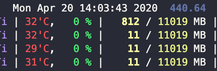
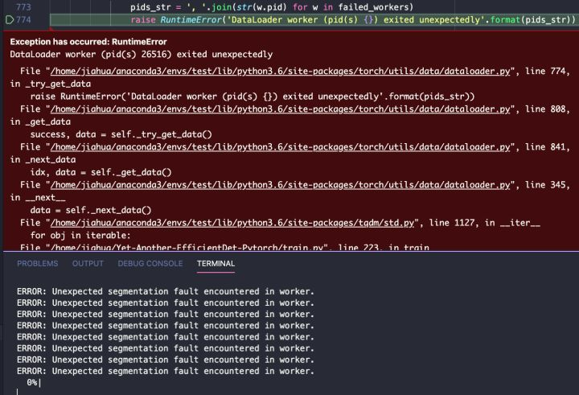

# 使用Pytorch dataloader时卡住 报错的解决方法

⌚️: 2021年4月22日

📚参考

---

## 问题1

**Pytorch dataloader 中使用 多线程 调试 / 运行 时(设置 num_worker )出现segmentation fault, 程序卡死 (线程阻塞) 等问题**

刚准备好数据集开始测试，等了半天还没有开始训练，一看gpustat发现竟然卡住了，分批加载而且数据集也没那么大。

那就F5调试看看到底卡在哪了，结果直接一通开幕雷击：

既然是dataloader worker报的问题，那就禁用多线程num_worker=0，运行就正常了。后果就是GPU利用率极低，几乎都在等图片加载。又只能开启多线程继续调试。

Debug了半天只能找出是opencv导致的问题，查了一番才发现，opencv 的一些操作如cv2.resize使用了多线程，多线程里又套多线程，就有可能导致死锁。

**原来可以在import cv2之后加上cv2.setNumThreads(0) 来避免卡死。**

> Ref: Seems like OpenCV tries to multithread and somewhere something goes into a deadlock. [stackoverflow.com/questions/54013846](https://link.zhihu.com/?target=http%3A//stackoverflow.com/questions/54013846)

如果没用cv但也遇到类似问题，可以尝试检查自定义数据集中 是否引入了其他 使用多线程的 模块 来处理数据。

------

解决这bug中途，脑子一热，把cv全替换成基于PIL的 torchvision.transforms 方法，就顺便看了下transforms里例如resize, pad, filp等，发现其中产生随机数使用的是python bulitin的random，而不是numpy.random。

原来Python中生成随机数：random.random()和numpy.random.rand()是有区别的。除了numpy随机数方法比前者能接受更多参数外，**numpy.random.seed()是线程不安全的**。如果要使用多线程并设置种子，更推荐使用bulitin的方法random.seed()

> Ref: For numpy.random.seed(), the main difficulty is that it is not thread-safe - that is, it's not safe to use if you have [many different threads of execution](https://link.zhihu.com/?target=http%3A//www.prasannatech.net/2008/08/introduction-to-thread-programming.html), because it's not guaranteed to work if two different threads are executing the function at the same time. [stackoverflow.com/questions/7029993](https://link.zhihu.com/?target=http%3A//stackoverflow.com/questions/7029993)

然后才想起来，找到了禁用opencv多线程的答案，白忙活了。而且用PIL来预处理，效率比opencv差多了。

------

## 问题2

 Ctrl+C之后呈现的信息表明，这个bug是和多线程有关系。

    经过笔者实验，目前有三种可靠的解决方式
    
    1）.Dataloader里面不用cv2.imread进行读取图片，用cv2.imread还会带来一系列的不方便，比如不能结合torchvision进行数据增强，所以最好用PIL 里面的Image.open来读图片
    
    2）.将DataLoader 里面的参变量num_workers设置为0，但会导致数据的读取很慢，拖慢整个模型的训练
    
    3）.如果用了cv2.imread，也懒得改了，那就加两条语句，来关闭Opencv的多线程：cv2.setNumThreads(0)和cv2.ocl.setUseOpenCL(False)。加了这两条语句之后，并不影响模型的训练速度，根据笔者观察，速度相反还变快了，真神奇呀。
    
    综上所述：如果遇到此问题，建议选择方法1和方法3来解决这个问题，因为不影响模型训练速度。