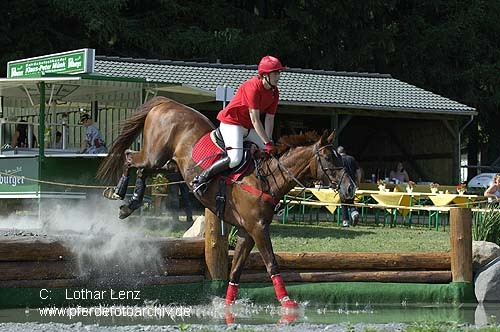

# PASCAL VOC 

⌚️: 2020年8月1日

📚参考

- [PASCAL VOC 数据集简介](https://blog.csdn.net/mzpmzk/article/details/88065416)

---

## 1. 简介

PASCAL VOC 挑战赛主要有`Object Classification `、`Object Detection`、`Object Segmentation`、`Human Layout`、`Action Classification`这几类子任务

- [PASCAL 主页](http://host.robots.ox.ac.uk/pascal/VOC/) 与 [排行榜](http://host.robots.ox.ac.uk:8080/leaderboard/main_bootstrap.php)
- [PASCAL VOC 2007 挑战赛主页](http://host.robots.ox.ac.uk/pascal/VOC/voc2007/) 、[PASCAL VOC 2012 挑战赛主页](http://host.robots.ox.ac.uk/pascal/VOC/voc2012/) 、[PASCAL VOC Evaluation Server](http://host.robots.ox.ac.uk:8080/)


PASCAL VOC 2007 和 2012 数据集总共分 **4 个大类**：vehicle、household、animal、person，总共 **20 个小类（加背景 21 类）**，预测的时候是只输出下图中**黑色粗体的类别**


### 1.1 Object相关目录介绍

PASCAL VOC为图像识别和分类提供了一整套标准化的优秀的数据集，从2005年到2012年每年都会举行一场图像识别challenge。

本文主要分析PASCAL VOC数据集中和图像中物体识别相关的内容。

在这里采用PASCAL VOC2012作为例子。下载地址为：[点击打开链接](http://host.robots.ox.ac.uk/pascal/VOC/voc2012/VOCtrainval_11-May-2012.tar)。（本文中的系统环境为ubuntu14.04）

下载完之后解压，可以在VOCdevkit目录下的VOC2012中看到如下的文件：


其中在图像物体识别上着重需要了解的是Annotations、ImageSets和JPEGImages。

**①JPEGImages**

JPEGImages文件夹中包含了PASCAL VOC所提供的所有的图片信息，包括了训练图片和测试图片。


这些图像都是以“年份_编号.jpg”格式命名的。

图片的像素尺寸大小不一，但是横向图的尺寸大约在500 * 375左右，纵向图的尺寸大约在375 * 500左右，基本不会偏差超过100。（在之后的训练中，第一步就是将这些图片都resize到300 * 300或是500 * 500，所有原始图片不能离这个标准过远。）

这些图像就是用来进行训练和测试验证的图像数据。

**②Annotations**

Annotations文件夹中存放的是xml格式的标签文件，每一个xml文件都对应于JPEGImages文件夹中的一张图片。


xml文件的具体格式如下：（对于2007_000392.jpg）


```html
<annotation>
	<folder>VOC2012</folder>                           
	<filename>2007_000392.jpg</filename>                               //文件名
	<source>                                                           //图像来源（不重要）
		<database>The VOC2007 Database</database>
		<annotation>PASCAL VOC2007</annotation>
		<image>flickr</image>
	</source>
	<size>					                           //图像尺寸（长宽以及通道数）						
		<width>500</width>
		<height>332</height>
		<depth>3</depth>
	</size>
	<segmented>1</segmented>		                           //是否用于分割（在图像物体识别中01无所谓）
	<object>                                                           //检测到的物体
		<name>horse</name>                                         //物体类别
		<pose>Right</pose>                                         //拍摄角度
		<truncated>0</truncated>                                   //是否被截断（0表示完整）
		<difficult>0</difficult>                                   //目标是否难以识别（0表示容易识别）
		<bndbox>                                                   //bounding-box（包含左下角和右上角xy坐标）
			<xmin>100</xmin>
			<ymin>96</ymin>
			<xmax>355</xmax>
			<ymax>324</ymax>
		</bndbox>
	</object>
	<object>                                                           //检测到多个物体
		<name>person</name>
		<pose>Unspecified</pose>
		<truncated>0</truncated>
		<difficult>0</difficult>
		<bndbox>
			<xmin>198</xmin>
			<ymin>58</ymin>
			<xmax>286</xmax>
			<ymax>197</ymax>
		</bndbox>
	</object>
</annotation>


```

对应的图片为：



**③ImageSets**

ImageSets存放的是每一种类型的challenge对应的图像数据。

在ImageSets下有四个文件夹：


其中Action下存放的是人的动作（例如running、jumping等等，这也是VOC challenge的一部分）

Layout下存放的是具有人体部位的数据（人的head、hand、feet等等，这也是VOC challenge的一部分）

Main下存放的是图像物体识别的数据，总共分为20类。

Segmentation下存放的是可用于分割的数据。

在这里主要考察Main文件夹。


Main文件夹下包含了20个分类的\*_train.txt、\*_val.txt和\*_trainval.txt。

这些txt中的内容都差不多如下：


前面的表示图像的name，后面的1代表正样本，-1代表负样本。

_train中存放的是训练使用的数据，每一个class的train数据都有5717个。

_val中存放的是验证结果使用的数据，每一个class的val数据都有5823个。

_trainval将上面两个进行了合并，每一个class有11540个。

需要保证的是train和val两者没有交集，也就是训练数据和验证数据不能有重复，在选取训练数据的时候 ，也应该是随机产生的。


## 2. VOC 常用组合、数据量统计及组织结构

[VOC2007 train_val_test & VOC2012 train_val 百度云下载链接，提取码: ive5](https://pan.baidu.com/s/19ZNwcSWUY2XezfcQn_-cGw )


目前目标检测常用的是 VOC2007 和 VOC2012 数据集，因为二者是互斥的，论文中的**常用组合**有以下几种：

- **`07+12：`** 使用 VOC2007 和 VOC2012 的 `train+val（16551）` 上训练，然后使用 VOC2007 的 test（4952） 测试
- **`07++12：`** 使用 VOC2007 的 `train+val+test（9963）` 和 VOC2012的 `train+val（11540）` 训练，然后使用 VOC2012 的 test 测试，这种方法需提交到 [PASCAL VOC Evaluation Server](http://host.robots.ox.ac.uk:8080/) 上评估结果，因为 VOC2012 test 没有公布
- **`07+12+COCO：`** 先在 MS COCO 的 trainval 上 **预训练**，再使用 VOC2007 和 VOC2012 的 `train+val` **微调训练**，然后使用 VOC2007 的 test 测试
- **`07++12+COCO：`** 先在 MS COCO 的 trainval 上**预训练**，再使用 VOC2007 的 `train+val+test` 和 VOC2012 的 `train+val`**微调训练**，然后使用 VOC2012 的 test 测试 ，这种方法需提交到 [PASCAL VOC Evaluation Server](http://host.robots.ox.ac.uk:8080/)上评估结果，因为VOC2012 test 没有公布

VOC2007 和 VOC2012 目标检测任务中的训练、验证和测试数据统计如下表所示，具体每一类的数据分布见 [PASCAL VOC2007 Database Statistics](http://host.robots.ox.ac.uk/pascal/VOC/voc2007/dbstats.html) 和 [PASCAL VOC2012 Database Statistics](http://host.robots.ox.ac.uk/pascal/VOC/voc2012/dbstats.html)


**组织结构：** 以 VOC 2007 为例，解压后的文件为：

```shell
.
├── Annotations 进行 detection 任务时的标签文件，xml 形式，文件名与图片名一一对应
├── ImageSets 包含三个子文件夹 Layout、Main、Segmentation，其中 Main 存放的是分类和检测的数据集分割文件
├── JPEGImages 存放 .jpg 格式的图片文件
├── SegmentationClass 存放按照 class 分割的图片
└── SegmentationObject 存放按照 object 分割的图片

├── Main
│   ├── train.txt 写着用于训练的图片名称， 共 2501 个
│   ├── val.txt 写着用于验证的图片名称，共 2510 个
│   ├── trainval.txt train与val的合集。共 5011 个
│   ├── test.txt 写着用于测试的图片名称，共 4952 个
```

------

## 3. 标注标准及 XML 解析

**标注标准：**[VOC2011 Annotation Guidelines ](http://host.robots.ox.ac.uk/pascal/VOC/voc2012/guidelines.html)

标注信息是用 xml 文件组织的如下：

```xml
<annotation>
	<folder>VOC2007</folder>
	<filename>000001.jpg</filename>  # 文件名 
	<source>
		<database>The VOC2007 Database</database>
		<annotation>PASCAL VOC2007</annotation>
		<image>flickr</image>
		<flickrid>341012865</flickrid>
	</source>
	<owner>
		<flickrid>Fried Camels</flickrid>
		<name>Jinky the Fruit Bat</name>
	</owner>
	<size>  # 图像尺寸, 用于对 bbox 左上和右下坐标点做归一化操作
		<width>353</width>
		<height>500</height>
		<depth>3</depth>
	</size>
	<segmented>0</segmented>  # 是否用于分割
	<object>
		<name>dog</name>  # 物体类别
		<pose>Left</pose>  # 拍摄角度：front, rear, left, right, unspecified 
		<truncated>1</truncated>  # 目标是否被截断（比如在图片之外），或者被遮挡（超过15%）
		<difficult>0</difficult>  # 检测难易程度，这个主要是根据目标的大小，光照变化，图片质量来判断
		<bndbox>
			<xmin>48</xmin>
			<ymin>240</ymin>
			<xmax>195</xmax>
			<ymax>371</ymax>
		</bndbox>
	</object>
	<object>
		<name>person</name>
		<pose>Left</pose>
		<truncated>1</truncated>
		<difficult>0</difficult>
		<bndbox>
			<xmin>8</xmin>
			<ymin>12</ymin>
			<xmax>352</xmax>
			<ymax>498</ymax>
		</bndbox>
	</object>
</annotation>
```

------

## 4. 提交格式

### 4.1 Classification Task

每一类都有一个 txt 文件，里面每一行都是测试集中的一张图片，前面一列是**图片名称**，后面一列是**预测的分数**。

```python
# comp1_cls_test_car.txt, 内容如下

000004 0.702732
000006 0.870849
000008 0.532489
000018 0.477167
000019 0.112426
```

### 4.2 Detection Task

每一类都有一个 txt 文件，里面每一行都是测试集中的一张图片，每行的格式为：`<image identifier> <confidence> <left> <top> <right> <bottom>`，confidence 用来计算 `mAP`

```python
# comp3_det_test_car.txt，内容如下
# comp3：只允许用所给训练数据，comp4：允许使用外部数据

000004 0.702732 89 112 516 466
000006 0.870849 373 168 488 229
000006 0.852346 407 157 500 213
000006 0.914587 2 161 55 221
000008 0.532489 175 184 232 201
```

------

## 5. 评估标准

PASCAL的评估标准是 mAP(mean average precision)，关于 mAP 可参考以下资料：

- [average precision](https://sanchom.wordpress.com/tag/average-precision/)
- [性能指标（模型评估）之mAP](https://blog.csdn.net/u014203453/article/details/77598997)
- [多标签图像分类任务的评价方法-mAP](http://blog.sina.com.cn/s/blog_9db078090102whzw.html)
- 周志华老师 《机器学习》 模型评估标准一节
- PASCAL官方给了 MATLAB 版的 mAP 评估脚本和示例代码 [development kit code and documentation](http://host.robots.ox.ac.uk/pascal/VOC/voc2012/VOCdevkit_18-May-2011.tar)

eg：下面是一个二分类的 P-R 曲线（`precision-recall curve`），对于 PASCAL 来说，`每一类`都有一个这样的 P-R曲线，P-R 曲线下面与 x 轴围成的面积称为 `average precision`，每个类别都有一个 AP，**`20个类别的 AP 取平均值`** 就是 mAP。


