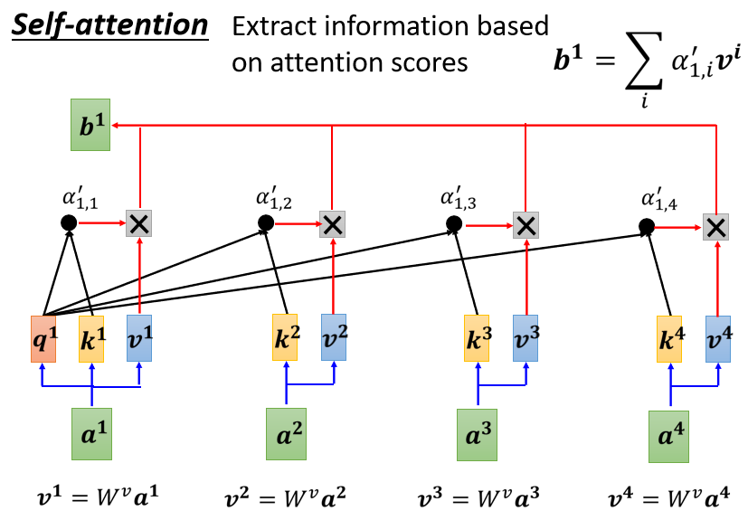
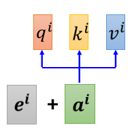
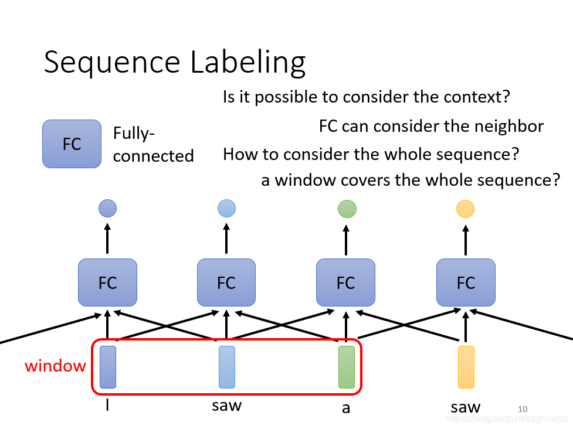

## 李宏毅机器学习2021笔记—self-attention

⌚️: 2021-07-21

📚参考

- https://blog.csdn.net/zghnwsc/article/details/115982794
- https://blog.csdn.net/zghnwsc/article/details/115985091
- 视频：https://www.bilibili.com/video/BV1G64y1D78j?p=10
- https://www.cnblogs.com/sykline/p/14730088.html
- [必看](https://www.bilibili.com/video/BV1a5411j7Sw/?spm_id_from=333.788.recommend_more_video.1)

---

> 本文为李宏毅老师机器学习2021的self attention一节的学习笔记，接在CNN之后。学习本节之前，需要有一定的基础知识。

## 一、整理内容

本文作为自己学习李宏毅老师2021春机器学习课程所做笔记，记录自己身为入门阶段小白的学习理解，如果错漏、建议，还请各位博友不吝指教，感谢！！

------

全连接网络的输入是一个向量，但是**当输入是一个变长的向量序列时**，就不能再使用全连接网络了。这种情况**通常可以使用卷积网络或循环网络进行编码来得到一个相同长度的输出向量序列**。

基于卷积或循环网络的序列编码都是一种局部的编码方式，**只建模了输入信息的局部依赖关系**。虽然循环网络理论上可以建立长距离依赖关系，但是由于**信息传递的容量以及梯度消失问题**，实际上也只能建立短距离依赖关系。

要建立输入序列之间的长距离依赖关系，可以通过如下两种方法：

1. 增加网络的层数，通过一个深层网络来获取远距离的信息交互；
2. 使用全连接网络。

全连接网络是一种非常直接的建模远距离依赖的模型，但是如上边所说无法处理变长的输入序列。不同的输入长度（**此处指的是向量序列的长度**），其连接权重的大小也是不同的。这种情况我们就可以利用注意力机制来“动态”地生成不同连接地权重，即**自注意力模型（Self-Attention Model）**。

------

### 输入/输出

1. **自注意力模型输入**：如下图所示，左侧的变长的输入序列即是自注意力模型的输入数据，**注意这个向量序列的长度不是固定的**。

1. **自注意力模型输出**：自注意力模型的输出有三种情况：

- 输出序列长度和输入序列长度一样，这种情况下，输入序列中的向量和结果序列中的元素一一对应，也就是为每一个输入序列中的向量给出一个label。如下图所示：

- 输出序列的长度为1,此时相当于一个分类人物，比如像对正面/负面评论的分析。如下图所示：

- 输出序列的长度是不定的，这种情况其实也就是Seq2Seq模型，比如机器翻译。如下图所示：

------

### Attention函数

因为要建立输入向量序列的长依赖关系，所以模型要考虑**整个向量序列**的信息。如下图所示，**Self-Attention的输出序列长度是和输入序列的长度一样的，对应的输出向量考虑了整个输入序列的信息**。然后将输出向量输入到Fully-Connected网络中，做后续处理。

当然Self-Attention可以和Fully-Connected交替使用多次以提高网络的性能，如下图所示。

上边我们提到，Self-Attention可以使用多次，那么输入可能是整个网络的输入，也可能是前一个隐藏层的输出，这里我们使用[𝑎1,𝑎2,𝑎3,𝑎4][a1,a2,a3,a4]来表示输入，使用𝑏1b1表示输出为例。

首先Self-Attention会计算𝑎1a1分别与[𝑎1,𝑎2,𝑎3,𝑎4][a1,a2,a3,a4]的相关性[𝛼1,1,𝛼1,2,𝛼1,3,𝛼1,4][α1,1,α1,2,α1,3,α1,4]。相关性表示了输入[𝑎1,𝑎2,𝑎3,𝑎4][a1,a2,a3,a4]对𝑎1a1是哪一个label的影响大小。而相关性𝛼α的计算方式共有Dot-product和Additive两种。

### Dot-product

在Dot-product中，输入的两个向量，左边的向量乘上矩阵𝑊𝑞Wq得到矩阵𝑞q，右边的向量乘上矩阵𝑊𝑘Wk得到矩阵𝑘k，然后将矩阵𝑞q和矩阵𝑘k对应元素相乘并求和得到相关性𝛼α。

### Additive

在Additive中同样也是先将两个输入向量与矩阵𝑊𝑞Wq和矩阵𝑊𝑘Wk相乘得到矩阵𝑞q和𝑘k。然后将矩阵𝑞q和𝑘k串起来输入到一个激活函数（tanh）中，在经过Transform得到相关性𝛼α。

------

### Self-Attention计算过程

为了提高模型能力，自注意力模型经常采用查询-键-值（Query-Key-Value，QKV）模型，其计算过程如下所示：

1. 首先计算𝑎1a1与[𝑎2,𝑎3,𝑎4][a2,a3,a4]的关联性𝛼α（实践时一般也会计算与𝑎1a1自己的相关性）。以Dot-product为例，我们分别将[𝑎1,𝑎2][a1,a2],[𝑎1,𝑎3][a1,a3],[𝑎1,𝑎4][a1,a4]作为Dot-product的输入，求得对应的相关性[𝛼1,2,𝛼1,3,𝛼1,4][α1,2,α1,3,α1,4]，如下图所示：

1. 计算出𝑎1a1跟每一个向量的关联性之后，将得到的关联性输入的softmax中，这个softmax和分类使用的softmax时一样的，得到对应数量的𝛼′α′。（当然这里使用ReLU或其他激活函数代替softmax也是可以的，根据实际效果来）

1. 先将[𝑎1,𝑎2,𝑎3,𝑎4][a1,a2,a3,a4]每一个向量分别乘上矩阵𝑊𝑣Wv得到新的向量𝑣1,𝑣2,𝑣3,𝑣4v1,v2,v3,v4，然后把𝑣1,𝑣2,𝑣3,𝑣4v1,v2,v3,v4都乘上Attention的分数𝛼′α′，然后相加得到𝑏1=∑𝑖𝛼′1,𝑖𝑣𝑖b1=∑iα1,i′vi

假设𝑎1a1和𝑎2a2的关联性很强，则由这两个向量计算得到的𝛼′1,2α1,2′的值就很大，最后求得的𝑏1b1的值，就可能会比较接近𝑣2v2。所以哪一个向量的Attention的分数最大，那一个向量的𝑣v就会主导最后计算出来的结果𝑏b。

------

### Self-Attention计算矩阵

由上边计算过程可知，每个输入𝑎a都会产生𝑞q、𝑘k和𝑣v三个矩阵。这里还是以[𝑎1,𝑎2,𝑎3,𝑎4][a1,a2,a3,a4]为输入为例：

1. 我们将[𝑎1,𝑎2,𝑎3,𝑎4][a1,a2,a3,a4]按照公式𝑞𝑖=𝑊𝑞𝑎𝑖qi=Wqai依次乘以矩阵𝑊𝑞Wq得到[𝑞1,𝑞2,𝑞3,𝑞4][q1,q2,q3,q4]，那我们将[𝑎1,𝑎2,𝑎3,𝑎4][a1,a2,a3,a4]作为4列拼成一个矩阵𝐼I，将[𝑞1,𝑞2,𝑞3,𝑞4][q1,q2,q3,q4]作为4列拼成一个矩阵𝑄Q得到计算矩阵如下：（矩阵𝑘k和𝑣v的计算方式一样）

1. 我们得到𝑄Q、𝐾K和𝑉V三个矩阵之后，下一步就是由矩阵𝑄Q和𝐾K计算关联性𝛼α，先以计算𝑞1q1的关联性为例，将矩阵𝑞1q1分别与矩阵[𝑘1,𝑘2,𝑘3,𝑘4][k1,k2,k3,k4]相乘得到[𝛼1,1,𝛼1,2,𝛼1,3,𝛼1,4][α1,1,α1,2,α1,3,α1,4](我们现在是看作矩阵运算，为了方便计算，我们先对矩阵𝑘𝑖ki进行转置，在和矩阵𝑞1q1相乘)：

1. 我们将第一步中得到的矩阵𝐾K整体转置，与矩阵𝑄Q相乘，得到所有的相关性矩阵𝐴A；然后对attention分数（相关性）做normalization，即每次对𝐴A中的一列（**每列对应着一个𝑞𝑖qi**）做softmax(也可以是其他激活函数)，让每一列的值相加为1，得到矩阵𝐴′A′，如下图所示：

1. 我们将矩阵𝑉V依次乘以矩阵𝐴′A′中的每一列得到输出[𝑏1,𝑏2,𝑏3,𝑏4][b1,b2,b3,b4]，如下图所示：

综上所述，矩阵计算公式如下：

------

### Multi-head Self-Attention

Self-Attention有一个使用非常广泛的的进阶版Multi-head Self-Attention，具体使用多少个head，是一个需要我们自己调节的超参数（hyper parameter）。

在Self-Attention中，我们是使用𝑞q去寻找与之相关的𝑘k，但是**这个相关性并不一定有一种**。那**多种相关性体现到计算方式上就是有多个矩阵𝑞q，不同的𝑞q负责代表不同的相关性**。我们以2 heads为例，先使用𝑎a计算得到𝑞q，然后让𝑞q乘以两个矩阵𝑊𝑞,1Wq,1和𝑊𝑞,2Wq,2得到𝑞𝑖,1qi,1和𝑞𝑖,2qi,2，代表2 heads，以同样的方式处理𝑘k和𝑣v，如下图所示：

在后续的计算中，我们只将属于相同相关性的矩阵进行运算，如下图所示：

1. 𝑞𝑖,1qi,1分别与𝑘𝑖,1ki,1和𝑘𝑗,1kj,1计算得到𝛼11,1α1,11和𝛼11,2α1,21。
2. 然后将𝛼11,1α1,11和𝛼11,2α1,21分别与𝑣𝑖,1vi,1和𝑣𝑗,1vj,1相乘得到𝑏𝑖,1bi,1。
3. 我们以同样的方式，得到矩阵𝑏𝑖,2bi,2，将𝑏𝑖,1bi,1和𝑏𝑖,2bi,2拼起来乘以一个矩阵𝑊𝑂WO得到最后的输入𝑏𝑖bi。

------

### Positional Encoding

通过前边的了解，可以发现对于每一个input是出现在sequence的最前面，还是最后面这样的**位置信息，Self-Attention是无法获取到的**。这样子可能会出现一些问题，比如在做词性标记（POS tagging）的时候，像动词一般不会出现在句首的位置这样的位置信息还是非常重要的。

我们可以使用positional encoding的技术，将位置信息加入到Self-Attention中。

如上图所示，我们可以为每个位置设定一个专属的positional vector，用𝑒𝑖ei表示，上标𝑖i代表位置。我们先将𝑒𝑖ei和𝑎𝑖ai相加，然后再进行后续的计算就可以了。𝑒𝑖ei向量既可以人工设置，也可以通过某些function或model来生成，具体可以查阅相关论文。

## 二、原生内容

### 1. **self attention解决的问题**

接下来按PPT顺序列出讲课内容

到目前为止，我们network的input都是一个向量，输入可能是一个数值或者一个类别。但是假设我们需要输入的是一排向量，并且向量的个数可能会发生改变，这个时候要怎么处理。

**比如文字处理的时候：**

比如我们输入词汇，每个词汇都相当于一个向量，我们可以用很长的一个向量，来表示世界上所有的东西，但是这里有一个问题，就是它假设所有的词汇都是没有关系的，比如猫和狗，都是动物，但是这样没有办法把它分类在一起，没有语义的资讯。
有一个叫word embedding的方法，可以把一些东西分类，比如猫狗分类成动物，树、花分类到植物里面去。**又比如：一个图，也可以看成是一堆向量。**

---

一个social network，一个graph，也可以看成是一堆向量表示的，里面的一个节点，可以看成是一个向量。输出是什么

---

第一种类型，输入是几个向量，输出就是几个lable，它可能是一个数值，就是一个regression的问题，输出也可能是一个分类，就是一个classification的问题。这里输入4个向量就是输出4个向量。

比如输入一个句子，I saw a saw，这里每一个输入的词汇就有一个对应的lable。

又比如一个social network，比如给一个图片，机器要决定每一个节点，比如说这个人会不会买某一个商品。

第二种类型，就是一整个sequence，只需要输出一个lable就可以了。

比如给机器一句话，它判断这个句子是正面的还是负面的。

第三种可类型，就是输入n个向量，输出的几个lable是机器自己决定的。
（seq2seq就是sequence to sequence，比如这一种翻译的例子，就是seq2seq的任务，后面还会讲到）**sequence labeling**

输入和输出一样多的情况，也叫做sequence labeling。
我们可以用fully conneted network解决这个问题，但是这样会有瑕疵，比如输入I saw a saw，这两个saw，对于FC（fully conneted network，全连接网络，下同）来说，是一模一样的，但是实际上它们一个是动词，一个是名字，还是有区别的。
或者我们可以直接把这几个向量前后串联起来，然后一起丢到FC里面。
但是这样不能解决所有的问题，我们输入的sequence是有长有短的，如果开一个大的Window，那FC就需要非常多的参数，不止是很难训练，而且很容易过拟合。
这里我们就需要一个self-attention的技术。**self-attention**

self-attention会把一整个sequence的资讯都吃进去，然后你输入几个向量，它就输出几个向量，比如图上，输入不同颜色的向量，就会输出不同颜色的向量，这里用黑色的框框，表示它不是普通的向量，是用来表示考虑了一整个sequence的向量。
self-attention也可以和FC交替使用，用self-attention来处理整个sequence的资讯，FC来专注处理某一个位置的资讯。

**self-attention是怎么运作的呢?**
self-attention的inpu就是一串的向量，这个向量可能是整个网络的input，也可能是中间某一层的output，所以我们用a来表示它，代表它可能做过一些处理。
这里的每一个b都是考虑了所有的a产生的，比如b1是考虑a1~a4产生的，b2是考虑a1 ~ a4产生的。
那么怎么产生b1这个向量呢？
第一个步骤：根据a1找出这个sequence里面和a1相关的其他向量

每一个向量和a1关联的程度，我们用一个数值α来表示。
那么这个α是怎么产生的呢？
就是给一个a1和a4，怎么去决定它们之间的关联程度α是怎么样的呢？

那我们就需要一个计算attention的模组。
这个模组，就是拿两个向量a1和a4作为输入，然后输出的是一个α。
怎么计算这个数值，有各种不同的做法，比较常见的有dot-product。
这里就是左边这个向量乘以一个Wq，右边这个向量乘以一个Wk，得到q和k，再把他们做element-wise（就是对应数值相乘，这里听了好几遍哈哈，要不是以前听过一遍课绝对听不出来），然后再全部加起来，得到一个scalar，这个scalar就是α。
这是一种计算的方式，还有其他的方式，比如additive，就是把他们分别乘以一个矩阵，再加起来，再经过一个激活函数，最后经过一个transfor，最后得到一个α。

**那么怎么把它套用在self-attention里面呢？**
这里就是把a1和a2、a3、a4分别去计算他们之间的关联性。
就是把a1乘上Wq得到q1，叫做query。
a2、a3、a4都乘以一个Wk得到一个k2，叫做key。
再把q1和k2算inner-product得到α。α1，2就表示，query是1提供的，key是2提供的，就表示1和2之间的关联性。
α1,2也叫做attention score，就是attention的分数。
接下来就以此类推，和a3、a4计算，得到α1,3,和α1,4。
（实际操作中，a1也会计算和自己的关联性，就是算出来一个α1,1）

算完关联性之后，会做一个soft-max。跟前面的分类的soft-max是一模一样的。
（softmax就是把多个数值标准化到0~1之间，分类问题里面是根据这个可能更好的看出最后是分到哪一类里面，相当于增强最大可能的项）
（也可以用别的，不一定非要用soft-max）

接下来我们要根据这个关联性，来抽取重要的资讯。
我们会把a1~a4这里面每一个向量，乘上Wv得到一个新的向量，用v1、v2、v3、v4表示。
接下来，把v1~v4每一个都乘上α’，然后加起来得到b。这里就是如果某一个关联性很强，比如得到的v2的值很大，那么加起来之后，这个值可能就会更加接近v2**总结：所以这里我们就讲了，怎么从一整个sequence得到一个b1.**

### 2. 矩阵表示

之前我们已经介绍了，怎么根据input的一排a，得到一个b1.
这里需要强调一点，b1到b4，并不需要按顺序。
（这里就不再赘述怎么得到b1了）
这里我们从矩阵乘法的角度再来看一遍b是怎么产生的。每一个a，都分别要产生不同的q，k，v。
要用矩阵运算表示的话，就是每一个a都要乘上一个wq，这里我们可以把它们合起来看成是一个矩阵。就相当于矩阵I乘上一个Wq得到一个矩阵Q。（线性代数内容，很简单）
k和v以此类推，只是现在把它写成了矩阵的形式。下一步：
就是k1和q1做inner-product，得到α1,1，同理得到α1,2和α1,3……
这几步的操作，可以看做是一个矩阵的相乘。写成右上角的形式。

然后这几步的操作是一模一样的，矩阵相乘，行乘以列，线性代数内容。
然后我们把A做一个normalization，比如做一个softmax，让每一个column里面的值，相加得1，得到一个A'。

b就是把v拼起来，乘以一个A'，两个矩阵相乘。

其实这一连串的操作，就是矩阵的乘法。
O就是这层的输出。
这里只有Wq和Wk和Wv是未知的，是需要通过我们的训练资料找出来的。

### 3. Multi-head self-attention

这里有一个进阶的版本，叫做multi-head self-attention相关，有很多种不同的定义，有很多不同的形式。
我们先得到q再乘以不同的东西，得到两个不同的q，这就是产生了多个"头"。
接下来做self-attention，就是把1这类一起做，把2这类一起做，得到bi，1
然后得到不同的bi1和bi2，再乘以一个矩阵W0，最后得到一个bi。
但是这样的话，每一个input，它的位置的信息是没有的，对于输入而言，每一个操作都是一模一样的。但是在实际上，有一些位置的信息是很重要的，比如动词不容易放在句首。

这里用到一个叫做positional encoding的技术：
为每一个位置设定一个向量，叫做位置向量，每一个不同的位置，有一个不同的向量ei，然后把ei加到ai上面。
最早的transformer用的ei，就像涂上，每一个颜色，都代表一个向量，把向量分别在不同的位置相加得到，每一个位置都有一个专属的e。
这样的位置向量，是人为设定的，但是它会产生很多问题。比如我定义向量的时候它的长度只有128，但是sequence有129怎么办呢？
这个位置向量，是一个仍然待研究的问题。有各种各样不同的人为设定的位置向量，还可以让机器根据资料去自己学习出来。
这个图上面就是各种各样不同的位置向量。
下面就是self-attention在不同领域的应用。**以图像领域为例**：

我们之前所讲的，self-attention是在输入一排向量的时候，比较适用。
图像就可以看做是一个向量集合，就是把每一个位置的像素，看成是一个向量，这样的话我们就可以把图片看成一个向量集合。

这里有两个把self-attention用在图像处理上的例子。
那么用self-attention和用CNN处理图片有什么区别和联系呢？

如果我们用self-attention来处理图片，其中一个1产生query，用其他的像素产生key，那我们在做内积的时候，是考虑到整张图片的。但是如果我们是用卷积核，filter的话，就是我们只会考虑这里面的一部分信息，那么CNN就相当于是一种简化版的self-attention。
对于CNN来说，我要划定感受野，它的范围的大小，是人为决定的。
对于self-attention来说，它是机器自动学出来的。
有这么一篇论文，19年1月发的，它会用数学关系严格的证明，CNN就是简化版的self-attention。self-attention只要设定一定的参数，可以做到和CNN一模一样的事情。

我们在讲overfiting的时候说，比较灵活的模型，它需要更多的数据，如果数据集不够，它效果可能不好。
上面这张图片，就是谷歌发的一篇论文，
把一张图片拆成16x16的patch，然后它就把每一个patch看成是一个word，（因为transformer一开始是用在NLP上面的），取了一个名字，叫做一张图价值16x16个文字。
横轴是训练的图片的量，10M就是一千万，比较了self-attention是浅蓝色这条线，CNN是深灰色这条线。随着资料量越来越多，self-attention的结果越来越好，但是在数据集小的时候，CNN的结果是要比self-attention要好的。至于RNN，RNN已经基本上被self-attention取代了。
RNN之前博主也看过，就是一个记忆机制，也是，在考虑一个向量的信息的时候 ，加入其它向量的位置信息，可以看成是self-attention的一种特殊情况。

self-attention也可以用在GNN上面，在做attention matrix的时候，只需要计算有edge相连的node就好。

self-attention有非常多的变形。
它的一个问题就是，运算量会非常大（肯定的嘛，CNN就相当于是全连接去掉一些权重，把CNN进行简化)，然后它会有各种各样的变形 ，最早的transformer，用的就是这个 ，广义的transformer就是指的self-attention。
我们可以看到，很多新的former，横轴表示比原来的transformer运算速度快 ，但是纵轴表示效果变差。