# RNN介绍

⌚️: 2021-07-21

📚参考

- [什么是transformer？【知多少】](https://www.bilibili.com/video/BV1Zz4y127h1)

- [什么是循环神经网络RNN？【知多少】](https://www.bilibili.com/video/BV1Zi4y1L7LL/?spm_id_from=333.788.recommend_more_video.-1)
- [什么是长短时记忆网络LSTM？【知多少】](https://www.bilibili.com/video/BV1gy4y1q7M5/?spm_id_from=333.788.recommend_more_video.0)
- [什么是 BERT？【知多少】](https://www.bilibili.com/video/BV11N41197nq/?spm_id_from=trigger_reload)
- [什么是 GPT？【知多少】](https://www.bilibili.com/video/BV1Jv411a7RB/?spm_id_from=trigger_reload)
- [什么是 Attention（注意力机制）？【知多少】](https://www.bilibili.com/video/BV1G64y1S7bc)

---

## 0、NLP-学习路线

#### （1）什么是循环神经网络RNN？

在识别图像时，输入的每张图片都是孤立的，认出这张图片是苹果，并不会对认出下一张图片是梨造成影响。

但对于语言来说，顺序是十分重要的，[我吃苹果]和[苹果吃我]，词语顺序的改变表达了完全不同的意义，顺序也提供了一定的信息，比如[吃]后面，大概率是代表食物的名词。

为了捕捉数据的这种关联，人们找到了RNN，一个高度重视序列信息的网络，序列就是数据的前后关系。

RNN的基础仍然是神经网络，只不过它多了一个小盒子，用来记录数据输入时网络的状态，在下一次输入数据时，网络必须要考虑小盒子中保存的信息，随着数据的一次次输入，存储的信息也在不断更新，盒子中的信息被称为隐状态。

和开始举出的例子一样，RNN最常见的领域就是自然语言处理，机器翻译是寻找相同的意义序列在不同语言中的表达，诗歌生成是基于一个主题，按照一定的规则输出有逻辑的词语序列，改变两端的数据类型，输入图片输出句子，就是看图说话，语音同样可以看做声音信号按时间顺序组成的序列，语音识别和语音生成同样在RNN的能力范围内，股票价格也可以看做一个受时间影响的序列，很多量化交易模型的建立，就是基于这样的认知。

不过RNN仍有不可忽视的缺陷，数据输入的越早，在隐状态中占据的影响越小，也就是说一个句子如果很长，RNN就会忘记开始时说了什么，于是就有了RNN的改良版，LSTM长短时记忆模型。

#### （2）什么是长短时记忆网络LSTM？

RNN具有一定的记忆能力，不幸的是它只能保留短期记忆，在各类任务上表现并不好，那该怎么办？

人们将目光投向了自己，人类的记忆是有取舍的，我们不会记住每时每刻发生的所有事，会有选择的留下[重要的]，丢掉[不重要的]，参考这种记忆机制，人们改造了小盒子，并找到了"门"这种机制。

门是用来决定信息如何保留的小开关，它的数值在0到1之间，1是完全保留，0是完全舍弃，新的小盒子上还有三个门，其中遗忘门决定了小盒子里要保留多少原有信息，也就是丢掉哪些不重要的记忆，输入门决定当前网络信息有多少要被保留到小盒子里，也就是记住哪些新东西，输出门决定了多大程度地输出小盒子中的信息，经过改造的小盒子，既能通过输入门对当前网络的状态有所了解，又能利用遗忘门留下过往的重要信息，这就是LSTM，长短时记忆模型。

通过改变小盒子的结构，LSTM还有很多变体如MGU,SRU，不过最受欢迎的还是门控循环单元GRU，GRU只有两个门，更新门是输入门合入遗忘门的结合体，决定丢弃哪些旧信息，添加哪些新信息，重置门决定写入多少上一时刻网络的状态，用来捕捉短期记忆，结构更简洁，计算更高效，效果又与LSTM不相上下，GRU正变得越来越流行。

#### （3）什么是seq2seq？什么是attension、self-attention？什么是Transformer？

处理机器翻译任务时，用什么模型比较好？RNN是个不错的选择，单词的先后顺序会影响句子的意义，擅长捕捉序列关系的它非常合适，但是对于翻译来说，句子间的单词数量并非是一一对应的，受限于结构，RNN只能实现N to N，1 to N或者 N to 1，对于这种N to M的问题很是头疼(?why?)

那该怎么办，人们找到了Seq2Seq，一个拥有编码器(Encoder)和解码器(Decoder)的模型，Encoder和Decoder依然是RNN网络，不过这次先由Encoder提取原始句子的意义，再由Decoder将意义转换成对应的语言，依靠意义这一[中介]，Seq2Seq成功解决了两端单词数不对等的状况，

新的问题又出现了，意义单元能够存储的信息是有限的，如果一个句子太长，翻译精度就会随之下降，于是人们找到了Attention，注意力机制，在Seq2Seq的基础结构上，生成每个单词时，都有意识地从原始句子提取生成该单词最重要的信息，成功摆脱了输入序列的长度限制。

接下来的问题是，这样的计算方式太慢了，RNN需要逐个看过句子中的单词，才能给出输出，既然Attention这么好用，人们就进一步找到了Self-Attention，自注意机制，先提取每个单词的意义，再依据生成顺序选取所需要的信息，这样的结构不止支持并行计算，效率更高，也很接近人类的翻译方式，效果好到没话说。

到这里，模型以及脱离了最初的RNN，成为了一个完全基于自注意力机制的拥有Encoder和Decoder的结构，这就是Transformer，不止是机器翻译，Transformer横扫自然语言处理领域。

#### （4）什么是BERT？

TODO

#### （5）什么是GPT？

TODO

## 1、RNN

### 1.1 RNN网络结构

在前面讲到的DNN和CNN中，训练样本的输入和输出是比较的确定的。但是有一类问题DNN和CNN不好解决，就是训练样本输入是连续的序列,且序列的长短不一，比如基于时间的序列：一段段连续的语音，一段段连续的手写文字。这些序列比较长，且长度不一，比较难直接的拆分成一个个独立的样本来通过DNN/CNN进行训练。

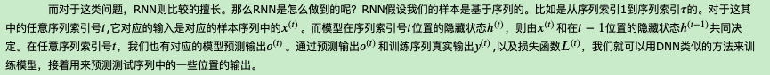

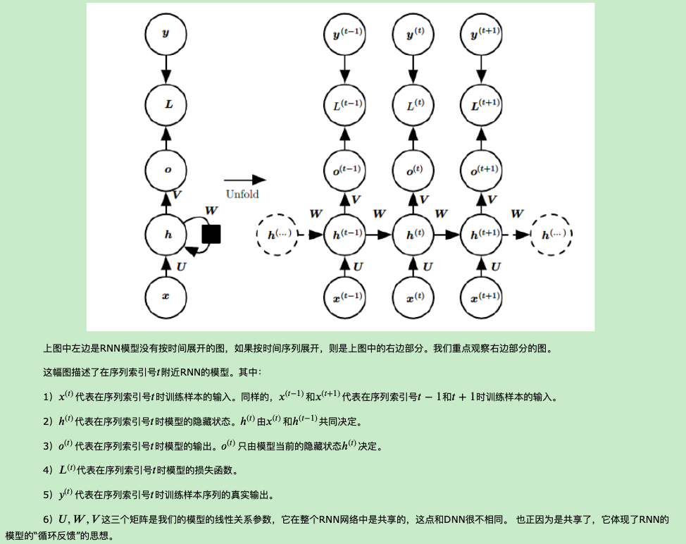

### 1.2 RNN前向传播算法

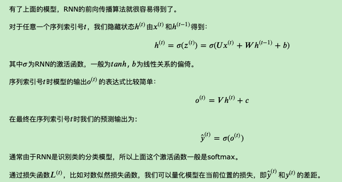

### 1.3 RNN反向传播算法推导

有了RNN前向传播算法的基础，就容易推导出RNN反向传播算法的流程了。RNN反向传播算法的思路和DNN是一样的，即通过梯度下降法一轮轮的迭代，得到合适的RNN模型参数`𝑈,𝑊,𝑉,𝑏,𝑐U,W,V,b,c`。由于我们是基于时间反向传播，所以RNN的反向传播有时也叫做BPTT(back-propagation through time)。当然这里的BPTT和DNN也有很大的不同点，即这里所有的𝑈,𝑊,𝑉,𝑏,𝑐U,W,V,b,c在序列的各个位置是共享的，反向传播时我们更新的是相同的参数。

为了简化描述，这里的损失函数我们为交叉熵损失函数，输出的激活函数为softmax函数，隐藏层的激活函数为tanh函数。

对于RNN，由于我们在序列的每个位置都有损失函数，因此最终的损失𝐿为：

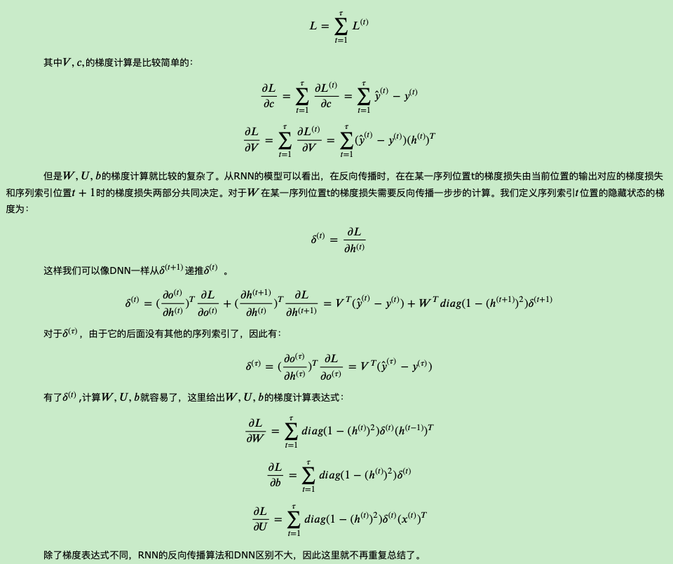

### 1.4 RNN小结

　　　　上面总结了通用的RNN模型和前向反向传播算法。当然，有些RNN模型会有些不同，自然前向反向传播的公式会有些不一样，但是原理基本类似。

　　　　RNN虽然理论上可以很漂亮的解决序列数据的训练，但是它也像DNN一样有梯度消失时的问题，当序列很长的时候问题尤其严重。因此，上面的RNN模型一般不能直接用于应用领域。在语音识别，手写书别以及机器翻译等NLP领域实际应用比较广泛的是基于RNN模型的一个特例LSTM，下一篇我们就来讨论LSTM模型。

这里所有的U,W,V,b,c在序列的各个位置是共享的，所以反向传播时我们更新的是相同的参数，可以利用梯度下降法不断更新参数

当然，这里所说的参数共享是指对于每一个神经元的参数。对于不同的神经元的参数，之间是相互独立的。

可以看出在整个过程中只有隐藏层状态h在不断的从前向后传，不断的继承前面的信息。

那么，由于在不断循环的过程中，隐藏状态h会不断的和参数矩阵W相乘，那就必然会面临梯度消失和梯度爆炸的问题。梯度消失很容易理解，可以看做是越早的信息对当前的贡献越小。所以RNN无法记住很多信息。特别是时间距离较远的信息。

## 2、LSTM

梯度消失和梯度爆炸是困扰RNN模型训练的关键原因之一，产生梯度消失和梯度爆炸是由于RNN的权值矩阵循环相乘导致的，相同函数的多次组合会导致极端的非线性行为。梯度消失和梯度爆炸主要存在RNN中，因为RNN中每个时间片使用相同的权值矩阵。对于一个DNN，虽然也涉及多个矩阵的相乘，但是通过精心设计权值的比例可以避免梯度消失和梯度爆炸的问题 .

处理梯度爆炸可以采用梯度截断的方法。所谓梯度截断是指将梯度值超过阈值 ![[公式]](https://www.zhihu.com/equation?tex=%5Ctheta) 的梯度手动降到 ![[公式]](https://www.zhihu.com/equation?tex=%5Ctheta) 。虽然梯度截断会一定程度上改变梯度的方向，但梯度截断的方向依旧是朝向损失函数减小的方向。

对比梯度爆炸，梯度消失不能简单的通过类似梯度截断的阈值式方法来解决，因为长期依赖的现象也会产生很小的梯度。

为了解决梯度消失的问题，大佬们改进了RNN设计了LSTM模型结构

> LSTM的全称是Long Short Term Memory，顾名思义，它具有记忆长短期信息的能力的神经网络。LSTM首先在1997年由Hochreiter & Schmidhuber [1] 提出，由于深度学习在2012年的兴起，LSTM又经过了若干代大牛(Felix Gers, Fred Cummins, Santiago Fernandez, Justin Bayer, Daan Wierstra, Julian Togelius, Faustino Gomez, Matteo Gagliolo, and Alex Gloves)的发展，由此便形成了比较系统且完整的LSTM框架，并且在很多领域得到了广泛的应用。
>

LSTM提出的动机是为了解决长期依赖问题。传统的RNN节点输出仅由权值，偏置以及激活函数决定。RNN是一个链式结构，每个时间片使用的是相同的参数。

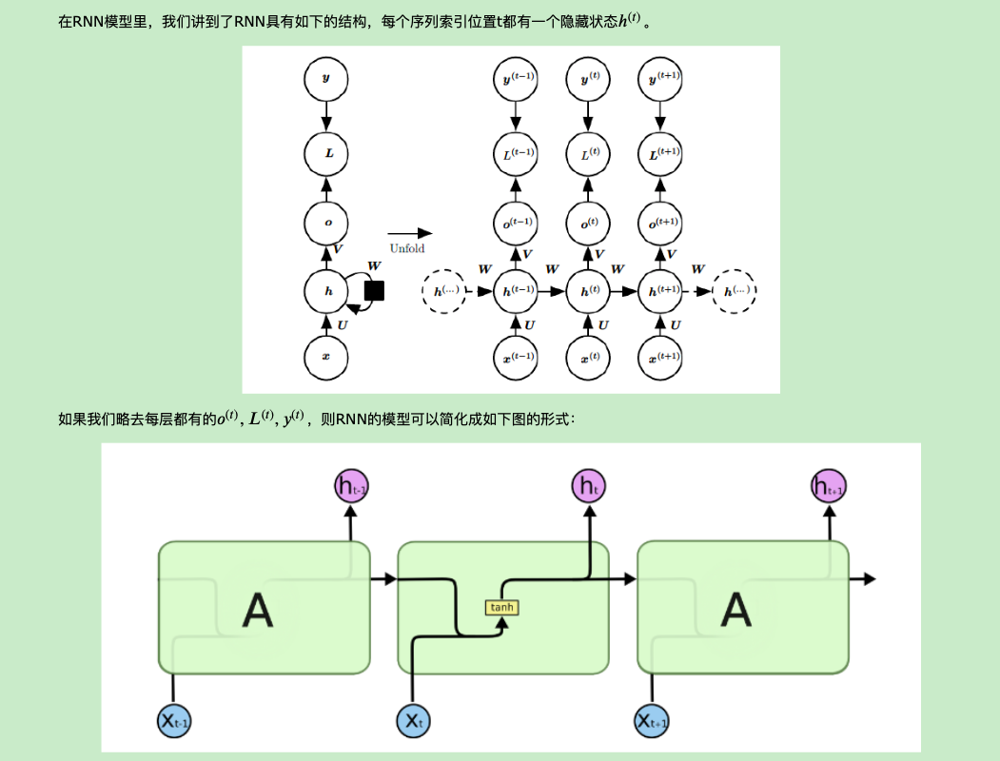

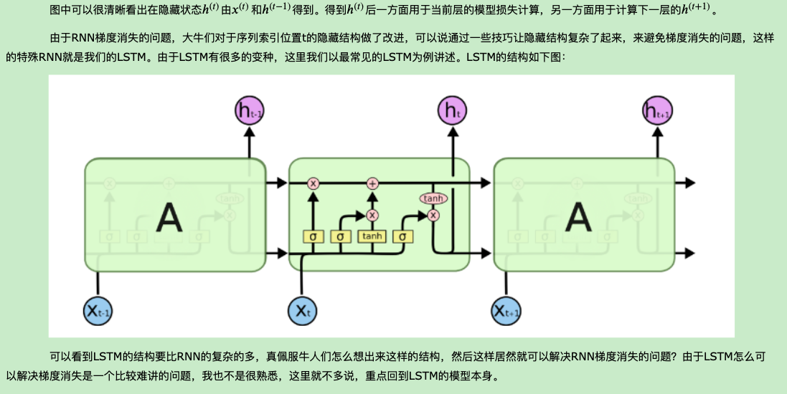

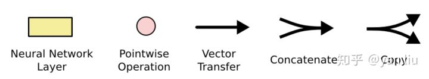

### 2.1 LSTM模型结构剖析

　　　　上面我们给出了LSTM的模型结构，下面我们就一点点的剖析LSTM模型在每个序列索引位置t时刻的内部结构。

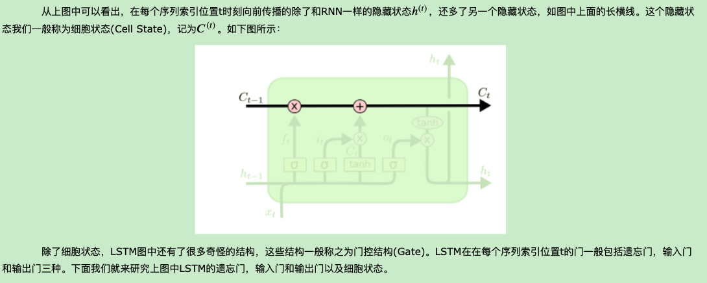

#### 2.1.1 LSTM之遗忘门

　　　　遗忘门（forget gate）顾名思义，是控制是否遗忘的，在LSTM中即以一定的概率控制是否遗忘上一层的隐藏细胞状态。遗忘门子结构如下图所示：

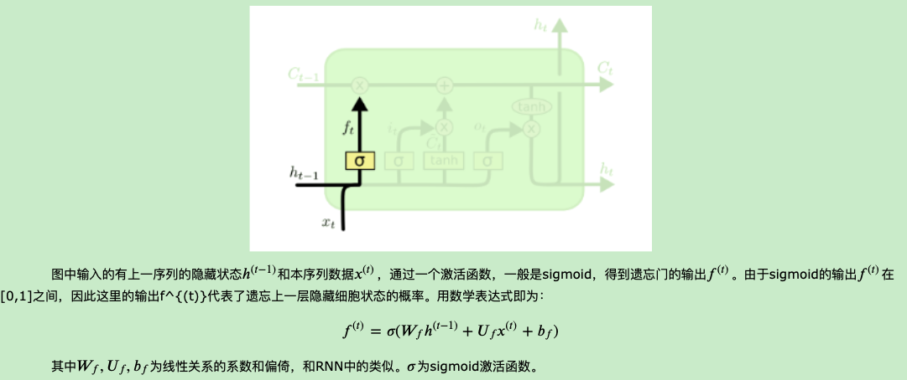

![[公式]](https://www.zhihu.com/equation?tex=C_t+%3D+f_t+%5Ctimes+C_%7Bt-1%7D+%2B+i_t+%5Ctimes+%5Ctilde%7BC%7D_t+%5Ctag%7B3%7D)

其中 ![[公式]](https://www.zhihu.com/equation?tex=f_t) 叫做遗忘门，表示 ![[公式]](https://www.zhihu.com/equation?tex=C_%7Bt-1%7D) 的哪些特征被用于计算 ![[公式]](https://www.zhihu.com/equation?tex=C_t) 。 ![[公式]](https://www.zhihu.com/equation?tex=f_t) 是一个向量，向量的每个元素均位于 ![[公式]](https://www.zhihu.com/equation?tex=%5B0%2C1%5D) 范围内。通常我们使用 ![[公式]](https://www.zhihu.com/equation?tex=sigmoid) 作为激活函数， ![[公式]](https://www.zhihu.com/equation?tex=sigmoid) 的输出是一个介于 ![[公式]](https://www.zhihu.com/equation?tex=%5B0%2C+1%5D) 区间内的值，但是当你观察一个训练好的LSTM时，你会发现门的值绝大多数都非常接近0或者1，其余的值少之又少。其中 ![[公式]](https://www.zhihu.com/equation?tex=%5Cotimes) 是LSTM最重要的门机制，表示 ![[公式]](https://www.zhihu.com/equation?tex=f_t) 和 ![[公式]](https://www.zhihu.com/equation?tex=C_%7Bt-1%7D) 之间的单位乘的关系。

#### 2.1.2 LSTM之输入门

　　　　输入门（input gate）负责处理当前序列位置的输入，它的子结构如下图：

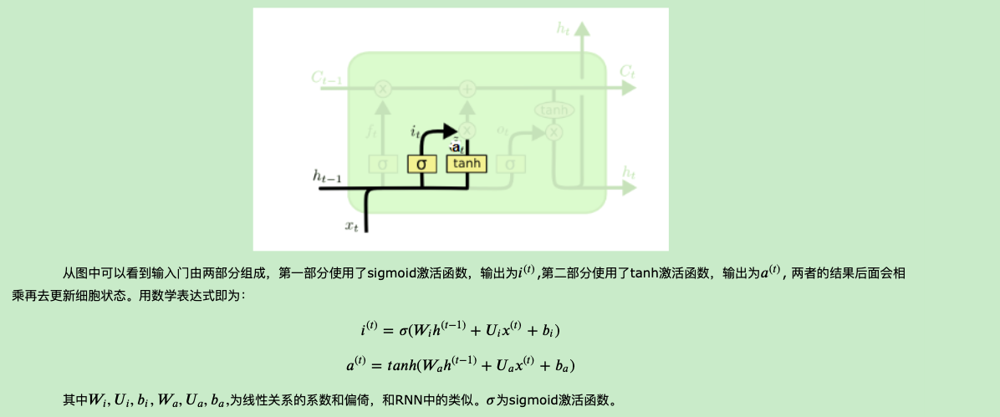

![[公式]](https://www.zhihu.com/equation?tex=%5Ctilde%7BC%7D_t) *表示单元状态更新值，由输入数据* ![[公式]](https://www.zhihu.com/equation?tex=x_t) *和隐节点* ![[公式]](https://www.zhihu.com/equation?tex=h_%7Bt-1%7D) 经由一个神经网络层得到，单元状态更新值的激活函数通常使用 ![[公式]](https://www.zhihu.com/equation?tex=tanh) 。 ![[公式]](https://www.zhihu.com/equation?tex=i_t) 叫做输入门，同 ![[公式]](https://www.zhihu.com/equation?tex=f_t) 一样也是一个元素介于 ![[公式]](https://www.zhihu.com/equation?tex=%5B0%2C+1%5D) 区间内的向量，同样由 ![[公式]](https://www.zhihu.com/equation?tex=x_t) 和 ![[公式]](https://www.zhihu.com/equation?tex=h_%7Bt-1%7D) 经由 ![[公式]](https://www.zhihu.com/equation?tex=sigmoid) 激活函数计算而成。

#### 2.1.3 LSTM之细胞状态更新

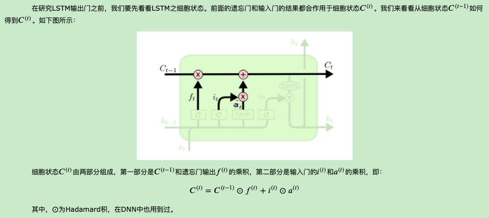

![[公式]](https://www.zhihu.com/equation?tex=i_t) 用于控制 ![[公式]](https://www.zhihu.com/equation?tex=%5Ctilde%7BC%7D_t) 的哪些特征用于更新 ![[公式]](https://www.zhihu.com/equation?tex=C_t)

#### 2.1.4 LSTM之输出门

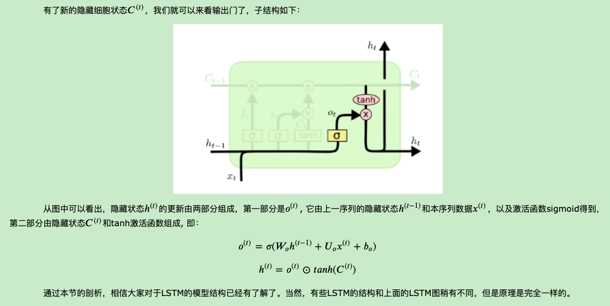

![[公式]](https://www.zhihu.com/equation?tex=h_t) 由输出门 ![[公式]](https://www.zhihu.com/equation?tex=o_t) 和单元状态 ![[公式]](https://www.zhihu.com/equation?tex=C_t) 得到，其中 ![[公式]](https://www.zhihu.com/equation?tex=o_t) 的计算方式和 ![[公式]](https://www.zhihu.com/equation?tex=f_t) 以及 ![[公式]](https://www.zhihu.com/equation?tex=i_t) 相同。在[3]的论文中指出，通过将 ![[公式]](https://www.zhihu.com/equation?tex=b_o) 的均值初始化为 ![[公式]](https://www.zhihu.com/equation?tex=1) ，可以使LSTM达到同GRU近似的效果。

### 2.2 LSTM前向传播算法

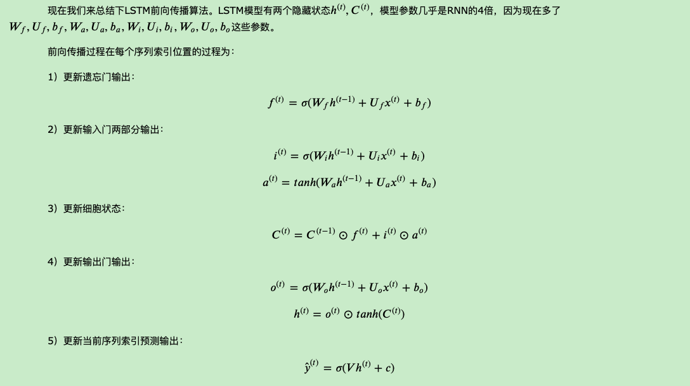

### 2.3  LSTM反向传播算法推导关键点

　　　　有了LSTM前向传播算法，推导反向传播算法就很容易了， 思路和RNN的反向传播算法思路一致，也是通过梯度下降法迭代更新我们所有的参数，关键点在于计算所有参数基于损失函数的偏导数。

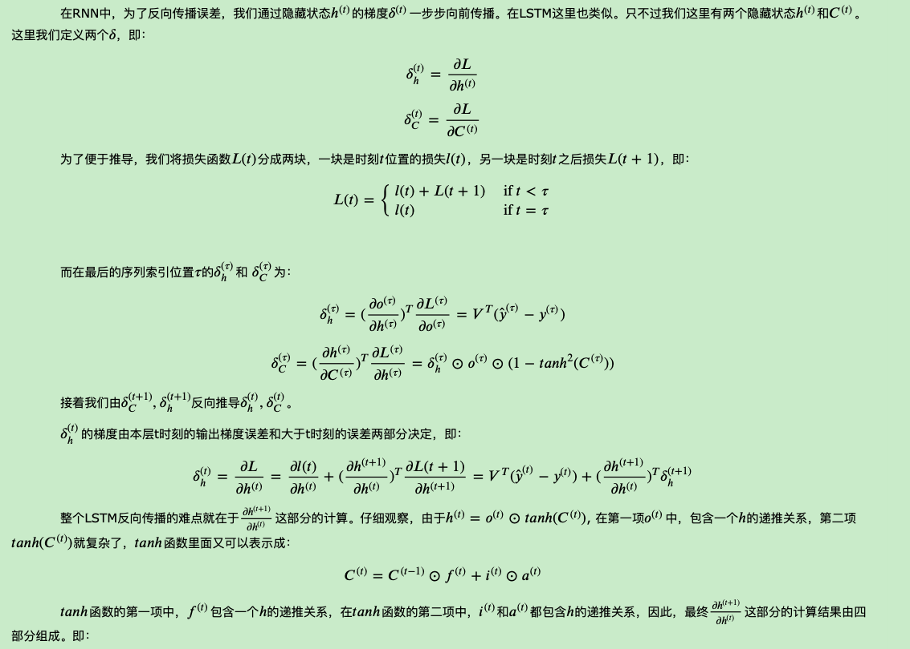

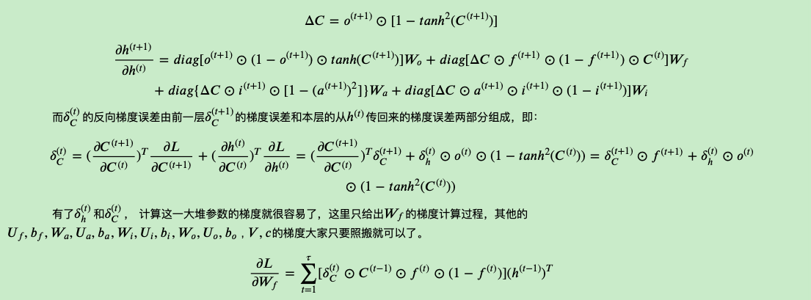

### 2.4 LSTM小结

　　　　LSTM虽然结构复杂，但是只要理顺了里面的各个部分和之间的关系，进而理解前向反向传播算法是不难的。当然实际应用中LSTM的难点不在前向反向传播算法，这些有算法库帮你搞定，模型结构和一大堆参数的调参才是让人头痛的问题。不过，理解LSTM模型结构仍然是高效使用的前提。

## 3. GRU

 知道了 LSTM 的工作原理之后，来了解一下 GRU。GRU 是新一代的循环神经网络，与 LSTM 非常相似。与 LSTM 相比，GRU 去除掉了细胞状态，使用隐藏状态来进行信息的传递。它只包含两个门：更新门和重置门。

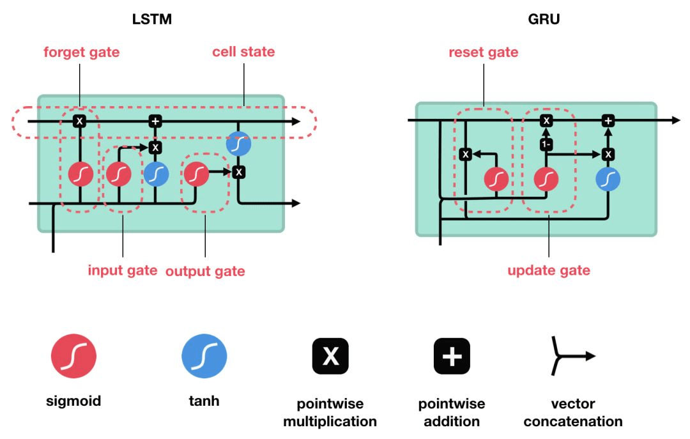

### 3.1 GRU网络结构

**重置门**：用于决定遗忘先前信息的程度。

**更新门**：类似于LSTM中的遗忘门和输入门，决定了要忘记那些信息以及那些信息需要被添加。

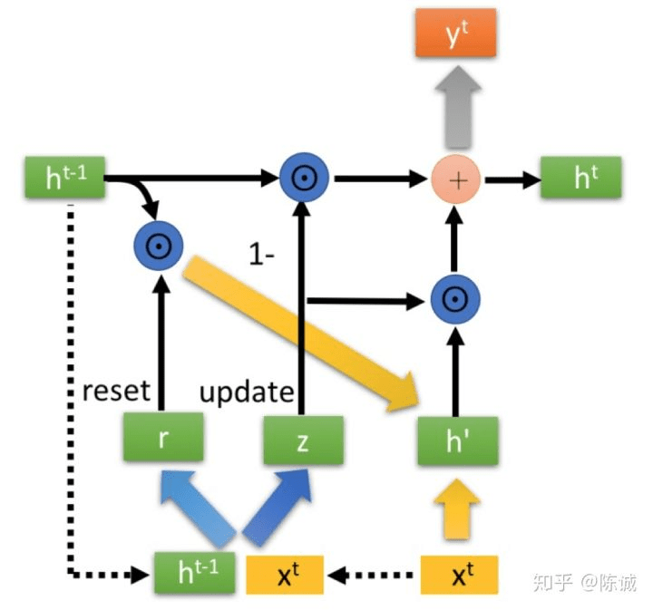

相比于RNN，我们只是中间隐藏层的结构发生了变化。

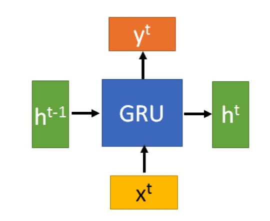

σ为sigmoid函数，通过这个函数可以将数据变换为0-1范围内的数值，从而来充当门控信号

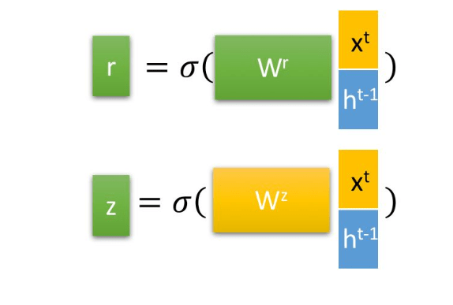

得到门控信号之后，首先使用重置门来控制“重置”之后的数据$h^{t-1'}=h^{t-1}\odot r$, 再将$h^{t-1'}$ 与输入$x^t$ 进行拼接，再通过一个tanh激活函数来将数据缩放到-1～1的范围内， 得到h'。

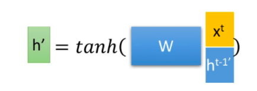

这里的h'主要是包含了当前输入的$x^t$ 数据。有针对性地对h'添加到当前的隐藏状态，相当于“记忆了当前时刻的状态”。类似于LSTM的选择记忆阶段。

最后介绍GRU最关键的一个步骤，我们可以称之为“更新记忆”阶段。在这个阶段，我们同时进行了遗忘记忆两个步骤。我们使用了先前得到的更新门控z(update gate)。

更新表达式：$h^t = (1 - z) \odot h^{t-1} + z \odot h'$

GRU很聪明的一点就在于， **使用了同一个门控z 就同时可以进行遗忘和选择记忆（LSTM则要使用多个门控）。**

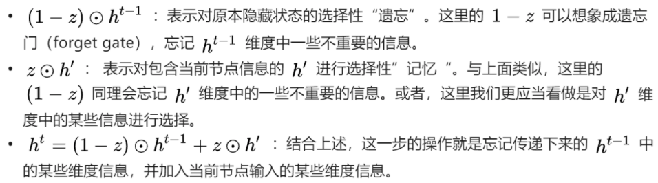

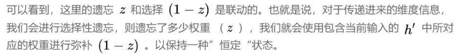

### **3.2 总结**

GRU输入输出的结构与普通的RNN相似，其中的内部思想与LSTM相似。

与LSTM相比，GRU内部少了一个”门控“，参数比LSTM少，但是却也能够达到与LSTM相当的功能。考虑到硬件的计算能力和时间成本，因而很多时候我们也就会选择更加”实用“的GRU啦。

## 4. CNN、RNN、LSTM、GRU

- CNN:输入是静态的，不随着时间而改变。用的方法是卷积。模型结构特点是：输入层---若干个（卷积层-激活函数---池化层）---全连接层-激活函数
- RNN：输入是时间连续的，方法是矩阵相乘。结构特点是不断循环传递上一时刻的隐藏层状态。模型结构：输入层---隐藏层---输出层。用损失函数L不断迭代更新参数。时间距离越远的信息，对当前时刻的贡献越小。
- LSTM：在RNN结构上做了改进，能够选择是否遗忘掉上一个时刻的隐藏层状态。能够避免梯度消失，能够更好地利用之前的信息。
- GRU除在语言模型的场景中表现均超过LSTM
- LSTM的输出门的偏置的均值初始化为1时，LSTM的性能接近GRU；
- 在LSTM中，门的重要性排序是遗忘门 > 输入门 > 输出门

