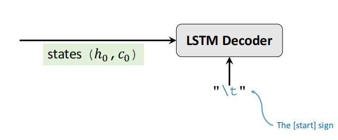

# NLP学习路线

⌚️: 2021-07-21

📚参考

- [NLP项目流程](https://github.com/TD-4/DeepLearning)【主要】
- [巩固知识的博客-1](https://codeantenna.com/a/t1gY0liLBh)
- [巩固知识的博客-2](https://zhuanlan.zhihu.com/p/346191907)
- [巩固知识的博客-3](https://www.cnblogs.com/jiangxinyang/p/11114993.html)
- [巩固知识的博客-4](https://blog.csdn.net/golfbears/article/details/109074901)
- [巩固知识的博客-5](https://zhuanlan.zhihu.com/p/54743941)
- [Transformer & CNN](https://www.163.com/dy/article/FVTM8E540511ABV6.html)
- [Word Embedding->ELMO->GPT->Bert](https://zhuanlan.zhihu.com/p/49271699)

---

NLP学习路线是参考[王树森视频](https://github.com/TD-4/DeepLearning)整理的，以NLP(Natural Language Processing)为例，介绍了从RNN->LSTM->Attention->Self-Attention->Transformer->BERT、GPT、...等内容，然后再简单介绍ViT(Vision Transformer).

## 1. 数据处理

参考[NLP项目流程](https://github.com/TD-4/DeepLearning)中的课时1和课时2.

1. Tokenization(分词)
2. Build Dictionary（建立字典）
3. One-hot encoding（热编码）
4. Word Embedding（嵌入式编码）

## 2. RNN

有很多text, speech, time series的数据，无法使用FC， CNN（当时）来处理，所以人们设计出RNN来处理时间序列数据。

但是RNN不能记忆长时间内容。

## 3. LSTM

RNN不能记忆长时间内容，所以有了LSTM模型，但是LSTM只是长短记忆模型，，太长的序列时间也是不可以的。

## 3. Effective RNNs

为了提高RNN的性能，人们提出了很改进方法。

### 3.1 Stacked RNN

### 3.2 Bidirectional RNN

Yt会遗忘X1的内容，所以有了双向RNN，Y1会遗忘Xt内容，两者互补，效果会好很多。

## 4. Text Generation

## 5. Seq2Seq

如何提高Seq2Seq的性能

- **Bi-LSTM instead of LSTM** **(Encoder only!)**
-  **Word-Level Tokenization**
- **Multi-Task Learning**
- Attention!	(Next lecture.)

Seq2Seq的缺点：

- 最后的状态不能记忆长时间内容

## 6. Attention

[我认为Attention机制实际上是一种相当普适的方法，它能够直接嵌入原网络中加强对中心特征的选择。](https://zhuanlan.zhihu.com/p/346191907)

### 6.1 Seq2Seq Model with **Attention**

- • Attention tremendously improves Seq2Seq model.
- • With attention, Seq2Seq model does not forget source input.
- • With attention, the decoder knows where to focus.
- • Downside: much more computation.

### 6.2 Self-Attention

其中，h0是全0向量。

## 7. Transformer

## 8. BERT

Bidirectional Encoder Representations from Transformers.用来预训练Transformer中的Encoder模型。

## 9. GPT

[ELMO, Bert, GPT李宏毅视频](https://www.youtube.com/watch?v=UYPa347-DdE)

## 10. ViT

[王树森ViT视频](https://www.youtube.com/watch?v=BbzOZ9THriY)