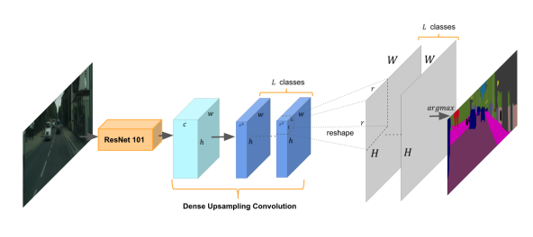
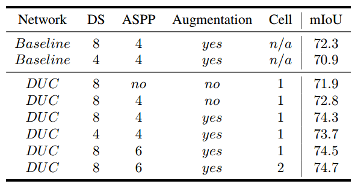
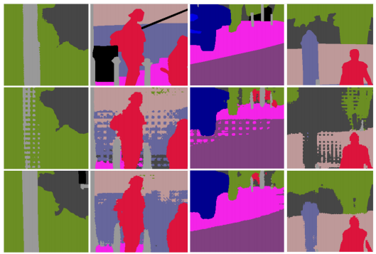
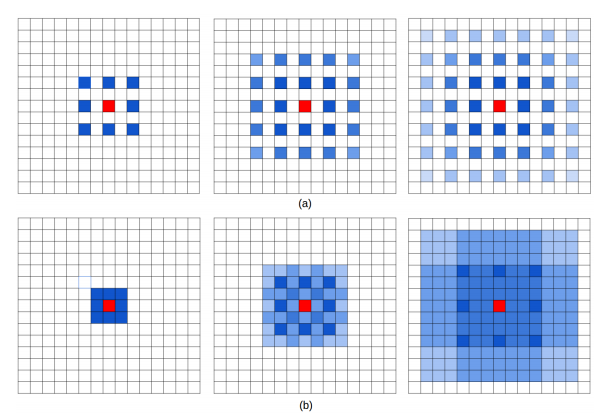
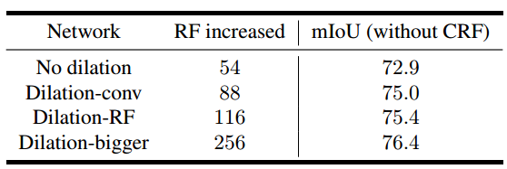

# Understanding Convolution for Semantic Segmentation

⌚️: 2021-07-21

📚参考

- 论文地址：https://arxiv.org/pdf/1702.08502.pdf

---

本篇论文主要有两个创新点，DUC(dense upsampling convolution)和HDC(hybrid dilated convolution)，分别针对上采样和dilated convolution问题进行改进。

**我用pytorch实现了DUC功能，代码放在我的[github](https://link.zhihu.com/?target=https%3A//github.com/ycszen/pytorch-ss)上了，欢迎star，欢迎讨论。**

## **DUC**

语义分割任务下的网络基本都具有encoding和decoding的过程，而大多数网络在decoding时使用的是双线性插值。而双线性插值是不能学习的，且会丢失细节信息。所以，文章中提出了一种方法：dense updampling convolution——通过学习一些系列的放大的过滤器来放大降采样的feature map到最终想要的尺寸。具体结构如下：

整个想法很清晰，就是将长宽尺寸上的损失通过通道维度来弥补。假设原图大小为![[公式]](https://www.zhihu.com/equation?tex=H%5Ctimes+W)，经过ResNet后维度变为![[公式]](https://www.zhihu.com/equation?tex=h%5Ctimes+w%5Ctimes+c)（其中![[公式]](https://www.zhihu.com/equation?tex=h+%3D+H+%2F+r+)， ![[公式]](https://www.zhihu.com/equation?tex=+w+%3D+W%2Fr)），通过卷积后输出feature map维度为![[公式]](https://www.zhihu.com/equation?tex=h%5Ctimes+w+%5Ctimes+%28r%5E2+%5Ctimes+L%29)，其中![[公式]](https://www.zhihu.com/equation?tex=L)是语义分割的类别数。最后通过reshape到![[公式]](https://www.zhihu.com/equation?tex=H%5Ctimes+W%5Ctimes+L)尺寸就可以了。不难看出，DUC的主要思想就是将整个label map划分成与输入的feature map等尺寸的子部分。所有的子部分被叠加![[公式]](https://www.zhihu.com/equation?tex=r%5E2)次就可以产生整个label map了。这种变化允许我们直接作用在输出的feature map上而不用像deconvolution和unpooling那样还需要一些额外的信息。

实验对比如下：

其中，DS：Downsampling rate of the network. Cell：neighborhood region that one predicted pixel represents.

## **HDC**

HDC主要是为了解决使用dilated convolution会产生的“gridding issue”。

当dilated convolution在高层使用的rate变大时，对输入的采样将变得很稀疏，将不利于学习——因为一些局部信息完全丢失了，而长距离上的一些信息可能并不相关；并且gridding效应可能会打断局部信息之间的连续性。

第一行是ground truth，第二行是gridding现象，第三行是使用HDC后的输出

所以，文章提出了HDC——使用一系列的dilation rates而不是只用相同的rate，并且使用ResNet-101中blocks的方式连接它们。具体展示如下：

a：所有的卷积层都使用dilation rate ![[公式]](https://www.zhihu.com/equation?tex=r+%3D+2)

b：连续的卷积层使用dilation rates ![[公式]](https://www.zhihu.com/equation?tex=r+%3D+1%2C+2%2C+3)

从这也可看出，HDC还有一个好处，可以增大网络的感受野。

实验对比如下：

RF是使用了HDC结构的，bigger是指HDC中使用的rates更大

