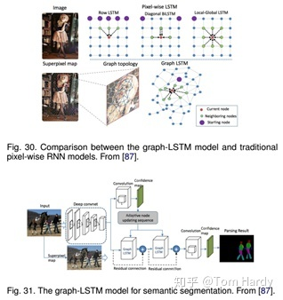

# 基于深度学习的图像分割综述

⌚️: 2021-07-21

📚参考

- 原文：https://zhuanlan.zhihu.com/p/141352661

- Paper链接：https://arxiv.org/abs/2001.05566

---

## 摘要

图像分割是图像处理和计算机视觉领域的一个重要课题，在场景理解、医学图像分析、机器人感知、视频监控、增强现实、图像压缩等领域有着广泛的应用。近年来，由于深度学习模型在视觉应用中的成功，已有大量的工作致力于利用深度学习模型开发图像分割方法。本文全面回顾了撰写本文时的文献，涵盖了语义和实例级分割的大量开创性工作，包括完全卷积像素标记网络、编码器-解码器架构、多尺度和基于金字塔的方法、递归网络，视觉attention模型，以及生成对抗模型。论文研究了这些深度学习模型的相似性、优势和挑战，研究了最广泛使用的数据集、报告性能，并讨论了这一领域未来有希望的研究方向。

## 背景介绍

图像分割是许多视觉理解系统的重要组成部分。它包括将图像（或视频帧）分割成多个片段或对象。分割在医学图像分析(例如，肿瘤边界提取和组织体积测量），自主载体(例如，可导航表面和行人检测），视频监控，和增强现实起到了非常重要的作用。文献中已经开发了许多图像分割算法，从最早的方法，如阈值化、基于直方图的方法、区域划分、k-均值聚类、分水岭，到更先进的算法，如活动轮廓、基于Graph的分割、马尔可夫随机场和稀疏方法。然而，在过去的几年里，深度学习网络已经产生了新一代的图像分割模型，其性能得到了显著的提高通常在流行的基准上达到了最高的准确率，这导致了许多人认为是该领域的范式转变。

图像分割可以表述为带有语义标签的像素分类问题（语义分割）或单个对象分割问题（实例分割）。语义分割对所有图像像素使用一组对象类别（如人、车、树、天空）进行像素级标记，因此通常比预测整个图像的单个标签的图像分类困难。实例分割通过检测和描绘图像中的每个感兴趣对象（例如，个体的分割），进一步扩展了语义分割的范围。论文调查涵盖了图像分割的最新文献，讨论了到2019年为止提出的100多种基于深度学习的分割方法。本文对这些方法的不同方面提供了全面的了解和认识，包括训练数据、网络架构的选择、损失函数、训练策略及其主要贡献。我们比较总结了这些方法的性能，并讨论了基于深度学习的图像分割模型面临的挑战和未来的发展方向。根据其主要技术贡献，将基于深度学习的作品分为以下几类：

- 1) Fully convolutional networks
- 2) Convolutional models with graphical models
- 3) Encoder-decoder based models
- 4) Multi-scale and pyramid network based models
- 5) R-CNN based models (for instance segmentation)
- 6) Dilated convolutional models and DeepLab family
- 7) Recurrent neural network based models
- 8) Attention-based models
- 9) Generative models and adversarial training
- 10) Convolutional models with active contour models
- 11) Other models

本文的一些主要贡献可以总结如下： 本次调查涵盖了截至2019年提出的100多种算法，分为10类。通过深入学习，对分割算法的不同方面提供了全面的了解和具体的分析，包括训练数据、网络结构的选择、损失函数、训练策略及其关键贡献。除此之外，还提供了大约20个流行的图像分割数据集的概述，这些数据集分为2D、2.5D（RGBD）和3D图像。在流行的基准上提供了一个比较性总结，说明了用于分割目的的已审查方法的性质和性能，并为基于深度学习的图像分割提供了若干挑战和潜在的发展方向。

## 基于深度学习的图像分割模型

回顾了截至2019年提出的100多种基于深度学习的分割方法，共分为10类。值得一提的是，在这些作品中，有一些是常见的，例如具有编码器和解码器部分、skip连接、多尺度分析，以及最近使用的dilated卷积。因此，很难提及每个算法的独特贡献，但更容易根据其在结构方面的贡献将其归类。

### 1、Fully Convolutional Networks

这项工作被认为是图像分割中的一个里程碑，证明了可以在可变大小的图像上以端到端的方式训练深层网络进行语义分割。然而，传统的FCN模型虽然具有普遍性和有效性，但也存在一定的局限性，它不能快速地进行实时推理，不能有效地考虑全局上下文信息，也不容易转换为3D图像。有几项努力试图克服FCN的一些局限性。例如，Liu等人提出了一个名为ParseNet的模型，以解决FCN忽略全局context information的问题. ParseNet通过使用层的平均特征来增加每个位置的特征，将全局context information添加到FCN。

FCNs已经应用于多种分割问题，如脑肿瘤分割[34]、实例感知语义分割、皮肤损伤分割和虹膜分割。

### 2、Convolutional Models With Graphical Models

Chen等人提出了一种基于CNN和全连接CRF组合的语义分割算法。他们表明，对于精确的目标分割来说，来自深层CNN最终层的响应并没有得到足够的定位（因为CNN的不变性使得它适合于高层次的任务，比如分类）。为了克服深CNN定位性能差的问题，他们将最终CNN层的响应与全连接的CRF相结合，论文表明，模型能够以比以前的方法更高的准确率定位。

Schwing和Urtasun提出了一种用于图像分割的全连通深结构网络。他们提出了一种联合训练CNNs和全连接CRF进行语义图像分割的方法，并在PASCAL VOC 2012数据集上取得了令人鼓舞的结果。Zheng等人提出了一种结合CRF和CNN的相似语义分割方法。在另一项相关工作中，Lin等人提出了一种基于上下文深度CRF的高效语义分割算法。Liuatal提出了一种将丰富的信息集成到MRF中的语义分类算法，包括高阶关系和混合标签文本。与以往使用迭代算法优化MRF的工作不同，他们提出了一种CNN模型，即一个解析网络，它可以在一次转发过程中实现确定性的端到端计算。

### 3、Encoder-Decoder Based Models

另一个流行的用于图像分割的深度模型家族是基于卷积编码器-解码器体系结构的。大多数基于DL的分割工作都使用某种编码-解码模型。论文将这些工作分为两类，用于一般分割的编码器-解码器模型和用于医学图像分割的编码器-解码器模型（以更好地区分应用程序）。

Badrinarayanan等人提出了一种用于图像分割的卷积编码器架构，SegNet的核心由一个编码器网络（在拓扑上与VGG16网络中的13个卷积层相同）和一个对应的解码器网络以及一个像素级分类层组成。SegNet的主要新颖之处在于解码器对其低分辨率输入特征映射进行上采样；具体来说，它使用在相应编码器的最大池步骤中计算的池索引来执行非线性上采样。这消除了学习向上采样的必要性。然后（稀疏的）上采样地图与可训练滤波器卷积以产生密集的特征图。SegNet在可训练参数的数量上也比其他结构小得多。同一作者还提出了SegNet的Bayesian版本，用于建模场景分割的卷积编码器-解码器网络固有的不确定性。这一类中另一个流行的模型是最近的一些分割网络，高分辨率网络（HRNet）。除了像在DeConvNet、SegNet、U-Net和V-Net中那样恢复高分辨率表示之外，HRNet通过并行连接高分辨率和低分辨率卷积流并在多个分辨率之间重复交换信息来通过编码过程保持高分辨率表示。

近年来，许多关于语义分割的研究都是以HRNet为骨干，利用上下文模型，如self-attention及其扩展等。其他一些工作采用转置卷积或编码器-解码器进行图像分割，如堆叠反卷积网络（SDN）、Linknet、W-Net和局部敏感反卷积网络进行RGBD分割。

在FCNs和编解码模型的启发下，医学/生物医学图像分割初步发展了几种模型。U-Net和V-Net是两种著名的此类架构，它们现在也被用于医疗领域之外。

Ronnebergeretal提出了用于分割生物显微镜图像的U-Net。他们的网络和训练策略依赖于使用数据增强来更有效地从可用的注释图像中学习。V-Net是另一个著名的基于FCN的模型，由Milletari等人提出，用于三维医学图像分割。对于模型训练，他们引入了一个新目标函数，使模型能够处理前景和背景中体素数量之间存在严重不平衡的情况。该网络在描述前列腺的MRI体积上进行端到端的训练，并学习同时预测整个体积的分割。医学图像分割的其他相关工作包括渐进密集V-net（PDV-net）等。用于从胸部CT图像中快速自动分割肺叶，以及用于病变分割的3D-CNN编码器。

### 4、Multi-Scale and Pyramid Network Based Models

多尺度分析（Multi-scale analysis，Multi-scaleanalysis）是图像处理中的一个古老的思想，已经被广泛应用于各种神经网络结构中。其中最突出的一种模型是Lin等人提出的特征金字塔网络（FPN）。虽然主要用于目标检测，但也应用于分割，利用深CNNs的内在多尺度金字塔层次结构构造具有边际额外成本的特征金字塔。为了融合低分辨率和高分辨率特征，FPN由自下而上的路径、自上而下的路径和横向连接组成。然后，通过3×3卷积处理连接的特征映射，以产生每个阶段的输出。最后，自上而下路径的每个阶段都生成一个预测来检测对象。对于图像分割，作者使用两个多层感知器（MLPs）来生成掩模。

Zhao等人开发了金字塔场景解析网络（PSPN），这是一个多尺度网络，可以更好地学习场景的全局上下文表示。使用残差网络（ResNet）作为特征提取器，通过扩展网络从输入图像中提取不同的模式。然后将这些特征映射输入金字塔池模块，以区分不同尺度的模式。它们在四个不同的尺度上集合，每个尺度对应一个金字塔层，并由1×1卷积层处理以减小它们的维数。金字塔层的输出被上采样，并与初始特征映射连接，以捕获本地和全局上下文信息。最后，使用卷积层来产生逐像素预测。

Ghiasi和Fowlkes开发了一种基于拉普拉斯金字塔的多分辨率重建体系结构，该结构使用高分辨率特征映射的跳跃连接和乘法选通来连续重建低分辨率映射的细分边界。研究表明，卷积特征映射的空间分辨率较低，但高维特征表示包含了大量的亚像素定位信息。还有其他使用多尺度分析进行分割的模型，如DM-Net（动态多尺度滤波器网络）、上下文对比网络和门控多尺度聚集（CCN）、APC-Net、MSCI和显著对象分割。

### 5、R-CNN Based Models (实例分割)

何凯明提出了一个用于对象实例分割的Mask R-CNN，它在许多COCO挑战上超过了所有先前的基准。该模型在为每个实例生成高质量分段掩码的同时，有效地检测图像中的对象。

Hu等人提出了一种新的部分监督训练范式和一种新的权值转移函数，该范式使约束状态分类模型成为一个大类别集，所有类别都有框注释，但只有一小部分类别有掩码注释。Chen等人开发了一个实例分割模型MaskLab，该模型基于更快的R-CNN，具有语义和方向特征。另一个有趣的模型是Tensormask，由Chen等人提出，基于密集滑动窗口实例分割。他们将密集实例分割作为4D张量上的预测任务，并提出了一个通用框架，使4D张量上的新算子成为可能。他们证明了张量视图比基线有更大的增益，产生的结果与掩模R-CNN相当。TensorMask在密集对象分割方面取得了很有希望的结果（许多其他的实例分割模型是基于R-CNN开发的，例如那些为掩码建议开发的模型，包括R-FCN、DeepMask、SharpMask、PolarMask和边界感知实例分割。值得注意的是，还有一个很有前途的研究方向是尝试通过学习用于自底向上分割的分组线索来解决实例分割问题，例如深分水岭变换和通过深度量学习进行语义实例分割。

### 6、Dilated Convolutional Models and DeepLab Family

扩张/膨胀卷积为卷积层引入了另一个参数，即膨胀率。它可以在在不增加计算成本的情况下扩大了感受野。膨胀卷积在实际时间段中已被广泛应用，其中一些最重要的包括DeepLab家族、多尺度Context Aggregation、密集上采样卷积和混合扩张卷积（DUC-HDC）、Densespp和ENet。

DeepLabv1和DeepLabv2是Chenetal开发的最流行的图像分割方法之一，后者有三个关键特性：第一，使用扩展卷积来解决网络中分辨率降低的问题（由max pooling和striding引起）。第二种是atrus空间金字塔池（ASPP），它在多个采样率下使用滤波器探测传入的卷积特征层，从而在多个尺度上捕获对象和图像上下文，以在多个尺度上可靠地分割对象。第三种是结合深CNNs和概率图形模型的方法改进目标边界的定位。最佳的DeepLab（使用ResNet-101作为主干）在2012年pascal VOC挑战赛中达到79.7%的mIoU分数，在cityscape挑战赛中达到70.4%的mIoU分数。

随后，Chen等人提出了DeepLabv3，它结合了级联和并行的扩展卷积模块。并行卷积模块分组在ASPP中。在ASPP中加入了1×1卷积和批量正态化。2018年，Chen等人发布的Deeplabv3+，它使用编码器-解码器架构，包括Atrus separable convolution、每个输入通道的空间卷积和点卷积。他们使用DeepLabv3框架作为编码器。在COCO和JFT数据集上预训练的最佳DeepLabv3+在2012年pascal VOC挑战赛中获得89.0%的mIoU分数。

### 7、Recurrent Neural Network Based Models

虽然CNN是解决计算机视觉问题的一种天然手段，但它并不是唯一的可能性。RNNs在建立像素间的短期/长期依赖关系模型以（潜在地）改善分割图的估计方面非常有用。使用RNNs，像素可以被连接在一起并按顺序处理，以建模全局信息进行语义分割。

主要工作包括：

\1. Scene labeling with lstm recurrent neural networks

\2. Semantic object parsing with graph lstm

\3. Da-rnn: Semantic mapping with data associated recurrent neural networks

\4. Segmentation from natural language expressions

### 8、Attention-Based Models

多年来，注意机制一直在计算机视觉中被不断探索，因此，发现将这种机制应用于语义分割的出版物也就不足为奇了。Chen等人提出了一种attention机制，学习在每个像素位置对多尺度特征进行软加权。它们采用了一个强大的语义分割模型，并与多尺度图像和attention模型联合训练。attention机制的性能优于平均值和最大值池，使模型能够在不同的位置和尺度上评估特征的重要性。

与其他作品不同，在这些作品中，卷积分类学被训练来学习标记对象的典型语义特征，Huang等人提出了一种基于反向attention机制的语义分割方法。他们的反向attention网络（RAN）架构也训练模型捕捉相反的概念（即，与目标类无关的特征）。

RAN是一个同时执行直接和反向attention学习过程的三分支网络。Li等人开发了一个用于语义分割的金字塔attention网络。该模型充分利用了全局上下文信息对语义分割的影响。他们将注意力机制和空间金字塔结合起来，提取精确的密集特征用于像素标记，而不是复杂的扩展卷积和精心设计的解码网络。最近，Fu等人提出了一种用于场景分割的双attention网络，该网络能够基于自注意机制捕获丰富的上下文依赖关系。

其他许多研究探索了语义切分的注意机制，如OCNet提出了一种受自我注意机制启发的对象上下文池、期望最大化attention（EMANet）、Criss交叉attention网络（CCNet）、具有重复attention的端到端实例切分，用于场景分析的点式空间attention网络和判别特征网络（DFN）。

### 9、Generative Models and Adversarial Training

GANs自提出以来，已被广泛应用于计算机视觉领域，并被用于图像分割。Luc等人提出了一种对抗性的语义分割训练方法。他们训练了一个卷积式语义分割网络，以及一个对抗性网络，该网络将地面真值分割图与分割网络生成的真值分割图区分开来。他们展示了这种差异训练方法提高了在PASCAL VOC 2012数据集上的准确性。

苏利等人提出了使用Gans的半弱监督语义分类。它包括代理网络，为多类分类器提供额外的训练示例，在GAN框架中充当鉴别器，从K个可能类中分配样本标签y或将其标记为假样本（额外类）。在另一部作品中，Hung等人开发了一个使用对抗性网络的半监督语义分割框架。他们设计了一个FCN鉴别器，在考虑空间分辨率的情况下，将预测概率图与地面真值分割分布区分开来。该模型考虑的损失函数包括三个项：分割地面真实性的交叉熵损失、鉴别网络的对抗性损失和基于置信图的半监督损失，即鉴别器的输出。

薛等人提出了一种多尺度L1损失的对抗性医学图像分割网络。他们使用分段或生成率分段标签映射，并提出了一个具有多尺度L1损失函数的网络，以强制批评者和分段者学习捕获像素之间长距离和短距离空间关系的全局和局部特征。

### 10、CNN Models With Active Contour Models

FCNs和活动轮廓模型（ACMs）之间协同作用的探索最近引起了研究兴趣。一种方法是根据ACM原理建立新的损失函数。例如Chen等人提出了一个有监督的丢失层，该层在FCN训练过程中包含了预测掩模的面积和大小信息，解决了心脏MRI中心室分割的问题。同样，Gur等人提出了一种基于无边缘形态学活动轮廓的无监督损失函数，用于微血管图像分割。一种不同的方法最初试图将ACM仅仅用作FCN输出的后处理程序，一些努力试图通过对FCN进行预训练来实现适度的共同学习。Le等人的工作是一个用于自然图像语义分割的ACM后处理器的例子。Hatamizadeh等人提出了一个集成的深部活动损伤（DALS）模型，用于训练背根骨预测新的局部参数化水平集能函数的参数函数。在其他相关工作中，Marcos等人提出了深结构活动轮廓（DSAC），它将ACMs和预先训练的FCNs结合在一个结构化的预测框架中，用于在航空图像中建立实例分割（尽管需要手动初始化）。对于相同的应用程序，Cheng等人提出了与DSAC相似的深度主动射线网络（DarNet），但采用了基于极坐标的不同显式ACM公式来防止轮廓自相交。Hatamizadeh等人最近推出了一种真正的端到端反向传播可训练、完全集成的FCN-ACM组合被称为深卷积活动轮廓（DCAC）。

## 图像分割数据集

### 1、2D datasets

\1. PASCAL Visual Object Classes (VOC)

\2. PASCAL Context

\3. Microsoft Common Objects in Context (MS COCO)

\4. Cityscapes

\5. ADE20K/MIT Scene Parsing (SceneParse150)

\6. SiftFlow

\7. Stanford background

\8. Berkeley Segmentation Dataset (BSD)

\9. Youtube-Objects

\10. KITTI

\11. Semantic Boundaries Dataset (SBD)

\12. SYNTHIA

\13. Adobes Portrait Segmentation

### 2、2.5D datasets

\1. NYU-D V2

\2. SUN-3D

\3. SUN RGB-D

\4. ScanNet

\5. UW RGB-D Object Dataset

### 3、3D Datasets

\1. Stanford 2D-3D

\2. ShapeNet Core

\3. Sydney Urban Objects Dataset

