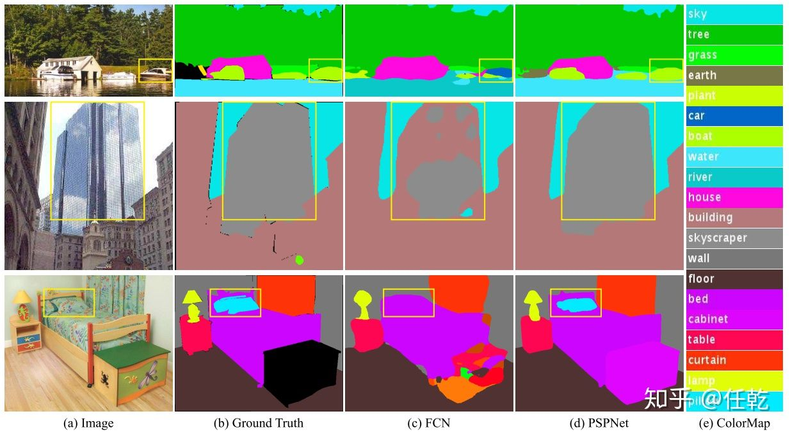
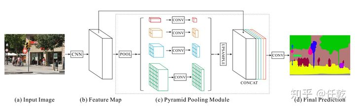
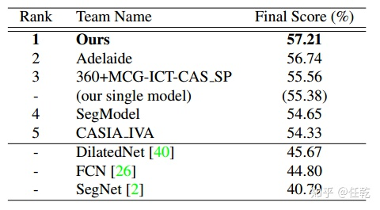

# PSPNet

⌚️: 2021年4月19日

📚参考

---

## 1. 动机和思路

之前的语义分割网络实际已经取得不错的效果，但仍然有一些缺点需要去弥补，这也是本文的动机。本文作者主要想解决的地方主要包括以下几方面：

1）Mismatched Relationship：上下文关系匹配对理解复杂场景很重要，例如在上图第一行，在水面上的大很可能是“boat”，而不是“car”。虽然“boat和“car”很像。FCN缺乏依据上下文推断的能力。

2）Confusion Categories： 许多标签之间存在关联，可以通过标签之间的关系弥补。上图第二行，把摩天大厦的一部分识别为建筑物，这应该只是其中一个，而不是二者。这可以通过类别之间的关系弥补。

3）Inconspicuous Classes：模型可能会忽略小的东西，而大的东西可能会超过FCN接收范围，从而导致不连续的预测。如上图第三行，枕头与被子材质一致，被识别成到一起了。为了提高不显眼东西的分割效果，应该注重小面积物体。

以上三个方面的问题，作者提供了一张图，以解释得更清楚。

针对以上几个问题，作者在论文里提供了相应的解决思路，也就是本文的主要贡献，包括：

1）提出了一个金字塔场景解析网络，能够将难解析的场景信息特征嵌入基于FCN预测框架中

2）在基于深度监督损失ResNet上制定有效的优化策略

3）构建了一个实用的系统，用于场景解析和语义分割，并包含了实施细节

## 2. 实现方法

本文的主要贡献，也就是对提高效果作用最大的一点是提出了一种PSP网络，也就是金字塔场景解析网络。至于其他的，不能说没有作用，只能说是作用有限，甚至有可能是为了撑起一篇论文，强行找的点。所以我们就完全围绕PSP模块来学习。

添加了PSP模块的分割网络结构如下图所示，其中虚线框中的部分即为PSP模块。

其实这张图画的很清晰，看到这张图，也就大致明白作者啥意思了，就是使用不同尺度的模型，从而得到不同层次的特征。该模块融合了4种不同金字塔尺度的特征，第一行红色是最粗糙的特征–全局池化生成单个bin输出，后面三行是不同尺度的池化特征。为了保证全局特征的权重，如果金字塔共有N个级别，则在每个级别后使用1×1的卷积将对于级别通道降为原本的1/N。再通过双线性插值获得未池化前的大小，最终concat到一起。金字塔等级的池化核大小是可以设定的，这与送到金字塔的输入有关。论文中使用的4个等级，核大小分别为1×1，2×2，3×3，6×6 。

## 3. 实验结果

作者提供了网络在ImageNet 2016上的效果，同时与其他网络做了对比，结果如下表

从表中可以看出，自然是state-of-art了。