# 研习U-Net

⌚️: 2021年4月19日

📚参考

- [研习U-Net](https://zhuanlan.zhihu.com/p/44958351)

------

## 0. 说在前面

大家好，我叫周纵苇，现在是一个在读二年级的博士，目前在亚利桑那州立大学念生物信息学。主要的侧重点是计算机视觉，应用的领域大多在医学影像，当然我也是每年有在关注CVPR这样的顶会。另外，我们也会关注医学图像方面的顶会MICCAI，今天分享题目中的U-Net最早就是出自2015年的MICCAI。今年的MICCAI正在西班牙召开，我由于签证的关系没有参加，不过英文版的20分钟发言会更新YouTube和我的[微博](https://link.zhihu.com/?target=http%3A//weibo.com/u/1060010800)上，当然，我更习惯用中文的，所以非常感谢雷锋网的邀请，我可以就借次机会用中文讲一讲我们刚刚发表的工作。


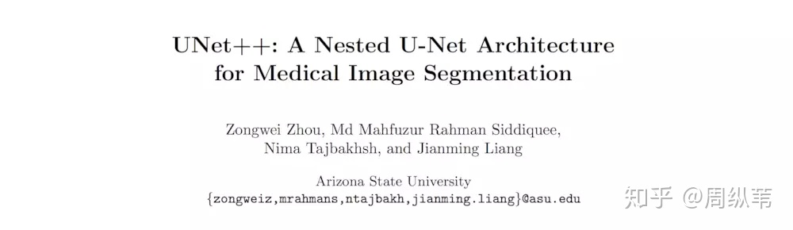


因为这个是一个可以回看的直播，所以中途我会在很多地方给出一些的问题，建议大家在回看的时候可以时不时的暂停一下，想一想如果问题给你，你会怎么去回答。对于在线的同学们，十分感谢你能抽时间来听我絮絮念，希望我们可以顺着思路和逻辑一步一步递进，也欢迎在留言中和我交流。

------

## 1. 铺垫

在计算机视觉领域，全卷积网络（FCN）是比较有名的图像分割网络，医学图像处理方向，U-Net可以说是一个更加炙手可热的网络，基本上所有的分割问题，我们都会拿U-Net先看一下基本的结果，然后进行“魔改”。


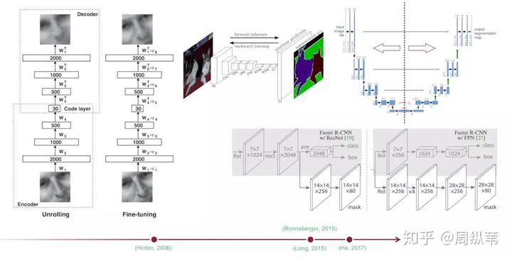


U-Net和FCN非常的相似，U-Net比FCN稍晚提出来，但都发表在2015年，和FCN相比，U-Net的第一个特点是完全对称，也就是左边和右边是很类似的，而FCN的decoder相对简单，只用了一个deconvolution的操作，之后并没有跟上卷积结构。第二个区别就是skip connection，FCN用的是加操作（summation），U-Net用的是叠操作（concatenation）。这些都是细节，重点是它们的结构用了一个比较经典的思路，也就是编码和解码（encoder-decoder），早在2006年就被Hinton大神提出来发表在了nature上.

当时这个结构提出的主要作用并不是分割，而是压缩图像和去噪声。输入是一幅图，经过下采样的编码，得到一串比原先图像更小的特征，相当于压缩，然后再经过一个解码，理想状况就是能还原到原来的图像。这样的话我们存一幅图的时候就只需要存一个特征和一个解码器即可。这个想法我个人认为是很漂亮了。同理，这个思路也可以用在原图像去噪，做法就是在训练的阶段在原图人为的加上噪声，然后放到这个编码解码器中，目标是可以还原得到原图。

后来把这个思路被用在了图像分割的问题上，也就是现在我们看到的U-Net结构，在它被提出的三年中，有很多很多的论文去讲如何改进U-Net或者FCN，不过这个分割网络的本质的拓扑结构是没有改动的。举例来说，去年ICCV上凯明大神提出的Mask RCNN. 相当于一个检测，分类，分割的集大成者，我们仔细去看它的分割部分，其实使用的也就是这个简单的FCN结构。说明了这种“U形”的编码解码结构确实非常的简洁，并且最关键的一点是好用。

简单的过一下这个网红结构，我们先提取出它的拓扑结构，这样会比较容易分析它的实质，排除很多细节的干扰。

输入是一幅图，输出是目标的分割结果。继续简化就是，一幅图，编码，或者说降采样，然后解码，也就是升采样，然后输出一个分割结果。根据结果和真实分割的差异，反向传播来训练这个分割网络。我们可以说，U-Net里面最精彩的部分就是这三部分：

- 下采样
- 上采样
- skip connection

这就是在我眼中的大部分分割网络的拓扑结构。


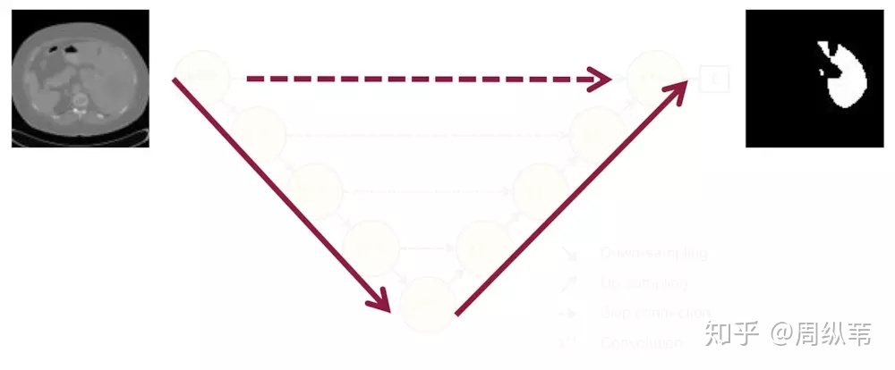

------

## 2. 展开

基本的铺垫都已经完成了，看着这个拓扑结构，一个非常广义的问题就是：

```
**这个三年不动的拓扑结构真的一点儿毛病都没有吗？**
```

在这三年中，U-Net得到的超过2500次的引用，FCN接近6000次的引用，大家都在做什么样的改进呢？如果让你在这个经典的结构基础上改进，你会去关注哪些点呢？

首先一个问题是：`**要多深合适？**`

这里我想强调的一点是，很多论文给出了他们建议的网络结构，其中包括非常多的细节，比如用什么卷积，用几层，怎么降采样，学习率多少，优化器用什么，这些都是比较直观的参数，其实这些在论文中给出参数并不见得是最好的，所以关注这些的意义不大，一个网络结构，我们真正值得关注的是它的设计传达了什么信息。就拿U-Net来说，原论文给出的结构是原图经过四次降采样，四次上采样，得到分割结果，实际呢，为什么四次？就是作者喜欢呗，或者说当时作者使用的数据集，四次降采样的效果好，我们也可以更再专业一点，四次降采样的接受域或者感受野大小正合适处理图像。或者四次降采样比较适合输入图像的尺寸等等，理由一堆，但是你们真的相信吗？不见得吧。

我先给一个2017年在CVPR上发表的一个名叫[PSPNet](https://link.zhihu.com/?target=https%3A//arxiv.org/abs/1612.01105)的分割网络，你会发现，好像整体的架构和U-Net还是像的，只是降采样的数目减小了，当然，他们也针对性的增强了中间的特征抓取环节的复杂性。


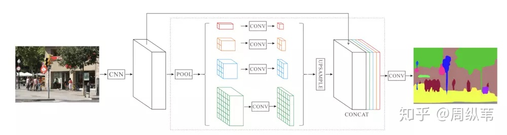


要是你觉得这个工作还不够说明4次降采样不是必须的话，我们再来看看Yoshua Bengio组最近的关于图像分割的论文，这是他们提出的结构，名叫[提拉米苏](https://link.zhihu.com/?target=https%3A//arxiv.org/abs/1611.09326)。


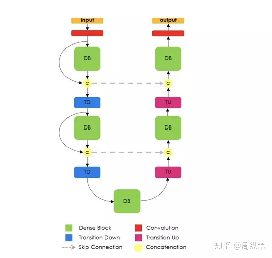


也是U形结构，但你会发现，他们就只用了三次降采样。所以到底要多深，是不是越深越好？还是一个open quesion。

我想分享的第一个信息就是：关注论文所传递的大方向，不要被论文中的细节局限了创造力。像这种细节参数的调整是属于比较朴素的深度学习方法论，很容易花费你很多时间，而最终并没有自身科研水平的提升。

好，我们回来继续讨论到底需要多深的问题。其实这个是非常灵活的，涉及到的一个点就是特征提取器，U-Net和FCN为什么成功，因为它相当于给了一个网络的框架，具体用什么特征提取器，随便。这个时候，高引就出现了，各种在encoder上的微创新络绎不绝，最直接的就是用ImageNet里面的明星结构来套嘛，前几年的BottleNeck，Residual，还有去年的DenseNet，就比谁出文章快。这一类的论文就相当于从1到10的递进，而U-Net这个低层结构的提出却是从0到1。说句题外话，像这种从1到10的论文，引用往往不会比从0到1的论文高，因为它不自觉的局限了自己的扩展空间，比如我说，我写一篇论文，说特征提取器就必须是dense block，或者必须是residual block效果好，然后名字也就是DenseUNet或者ResUNet，就这样结束了。所以关于backbone到底用什么的问题，并不是我这次要讲的重点。


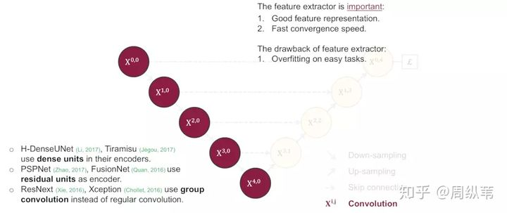


关于到底要多深这个问题，还有一个引申的问题就是，`降采样对于分割网络到底是不是必须的？`问这个问题的原因就是，既然输入和输出都是相同大小的图，为什么要折腾去降采样一下再升采样呢？

比较直接的回答当然是降采样的理论意义，我简单朗读一下，它可以增加对输入图像的一些小扰动的鲁棒性，比如图像平移，旋转等，减少过拟合的风险，降低运算量，和增加感受野的大小。升采样的最大的作用其实就是把抽象的特征再还原解码到原图的尺寸，最终得到分割结果。


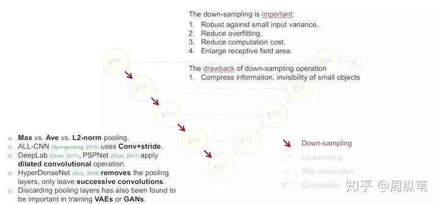


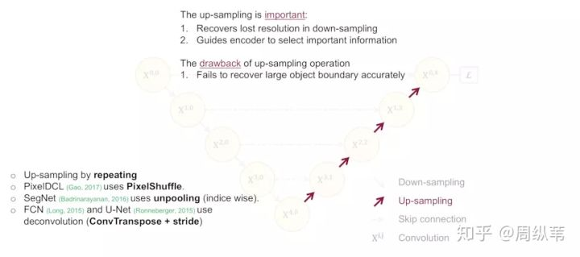


这些理论的解释都是有道理的，在我的理解中，对于特征提取阶段，浅层结构可以抓取图像的一些简单的特征，比如边界，颜色，而深层结构因为感受野大了，而且经过的卷积操作多了，能抓取到图像的一些说不清道不明的抽象特征，讲的越来越玄学了，总之，浅有浅的侧重，深有深的优势。那我就要问一个比较犀利的问题了，既然浅层特征和深层特征都很重要，U-Net为什么只在4层以后才返回去，也就是只去抓深层特征。我不知道有没有说明白这个问题本身。问题实际是这样的，看这个图，**`既然`** **![[公式]](https://www.zhihu.com/equation?tex=X%5E%7B1%2C0%7D)** **`，`** **![[公式]](https://www.zhihu.com/equation?tex=X%5E%7B2%2C0%7D)** **`，`** **![[公式]](https://www.zhihu.com/equation?tex=X%5E%7B3%2C0%7D)** **`，`** **![[公式]](https://www.zhihu.com/equation?tex=X%5E%7B4%2C0%7D)** **`所抓取的特征都很重要，为什么我非要降到`** **![[公式]](https://www.zhihu.com/equation?tex=X%5E%7B4%2C0%7D)** **`层了才开始上采样回去呢？`**


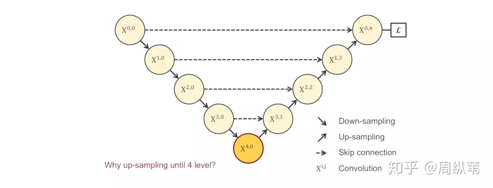


------

## 3. 主体

沿着这个逻辑往下捋，不知道大家能否猜到我的下一页会放什么？此处可以摁个暂停。有没有呼之欲出了？如果排除一切其他干扰，既然我们不知道需要多深，是不是会衍生出一系列像这样子的U-Net，它们的深度不一。这个不难理解吧。为了搞清楚是不是越深越好，我们应该对它们做一下实验，看看它们各自的分割表现：


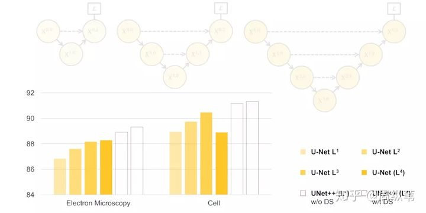


先不要看后两个UNet++，就看这个不同深度的U-Net的表现，我们可以看出，不是越深越好吧，它背后的传达的信息就是，不同层次特征的重要性对于不同的数据集是不一样的，并不是说我设计一个4层的U-Net，就像原论文给出的那个结构，就一定对所有数据集的分割问题都最优。

那么接下来是关键，我们心中的目标很明确了，**就是使用浅层和深层的特征！**但是总不能训练这些个U-Net吧，未免也太多了。好，这里可以暂停一下，想一想，要你来，你怎么来利用这些不同深度的，各自能抓取不同层次的特征的U-Net。


我把图打出来就很简单了。


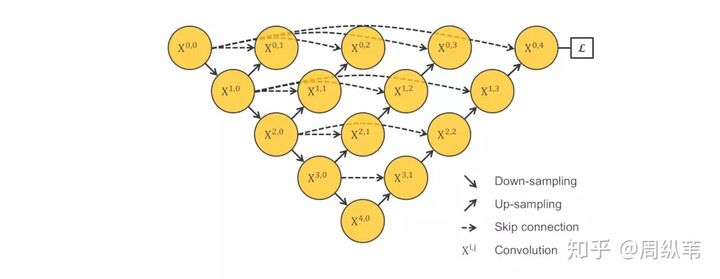


我们来看一看，这样是不是把1～4层的U-Net全给连一起了。我们来看它们的子集，包含1层U-Net，2层U-Net，以此类推。这个结构的好处就是我不管你哪个深度的特征有效，我干脆都给你用上，让网络自己去学习不同深度的特征的重要性。第二个好处是它共享了一个特征提取器，也就是你不需要训练一堆U-Net，而是只训练一个encoder，它的不同层次的特征由不同的decoder路径来还原。这个encoder依旧可以灵活的用各种不同的backbone来代替。

可惜的是，这个网络结构是不能被训练的，原因在于，不会由任何梯度会经过这个红色区域，因为它和算loss function的地方是在反向传播时是断开的。我停顿一下，大家想一想是不是这么回事。


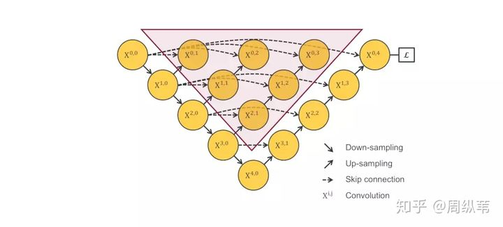


请问，如果是你，`**如何去解决这个问题？**`

其实既然已经把结构盘成这样了，还是很自然能想到的吧，我这里提供有两个候选的解决方案。

- 第一个是用deep supervision，强行加梯度是吧，关于这个，我待会儿展开来说。
- 第二个解决方案是把结构改成这样子：


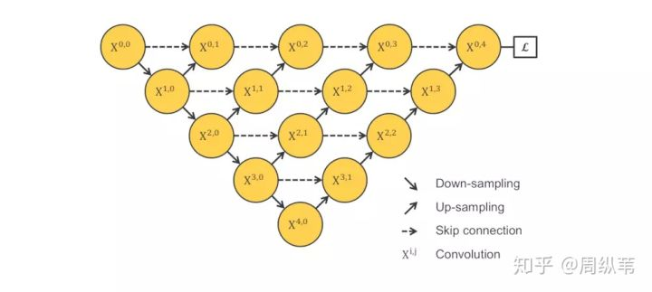


如果没有我上面说的那一堆话来盘逻辑，这个结构可能不那么容易想到，但是如果顺着思路一步一步的走，这个结构虽然不能说是显而易见，也算是顺理成章的。我的故事还没有讲完，但是我提一句，这个结构由UC Berkeley的团队提出，发表在今年的CVPR上，是一个oral的论文，题目是"[Deep Layer Aggregation](https://link.zhihu.com/?target=http%3A//openaccess.thecvf.com/content_cvpr_2018/papers/Yu_Deep_Layer_Aggregation_CVPR_2018_paper.pdf)"。

可能就有小伙伴惊呆了，就这样吗，就发了CVPR！？是，也不是。。。这只是他们在论文中给出的关于分割网络结构的改进，他们还做了其他的工作，包括分类，和边缘检测。但是主要的思路就是刚刚盘的那些，目标就是取整合各个不同层次的特征。

这只是一个题外话哦，我们继续来看这个结构，请问，`**你觉得有什么问题？**`

为了回答这个问题，现在我们和上面那个结构对比一下，不难发现这个结构强行去掉了U-Net本身自带的长连接。取而代之的是一系列的短连接。那么我们来看看U-Net引以为傲的长连接到底有什么优点。


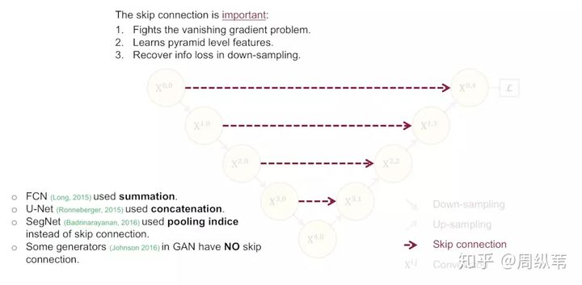


我们认为，U-Net中的长连接是有必要的，它联系了输入图像的很多信息，有助于还原降采样所带来的信息损失，在一定程度上，我觉得它和残差的操作非常类似，也就是residual操作，x+f(x)。我不知道大家是否同意这一个观点。因此，我的建议是最好给出一个综合长连接和短连接的方案。请问，这个方案在你的脑海中是什么样的呢？此处可暂停。


基本上就是这样一个结构没跑了是么。我们来对比一下一开始的U-Net，它其实是这个结构的一个子集。这个结构，就是我们在MICCAI中发表的UNet++。热心的网友可能会问哦，你的UNet++和刚刚说的那个CVPR的论文结构也太像了吧，我说一下这个工作和UC Berkeley的研究是完全两个独立的工作，也算是一个美丽的巧合。UNet++在今年年初时思路就已经成型了，CVPR那篇是我们今年七月份开会的时候看到的，当时UNet++已经被录用了，所以相当于同时提出。另外，和CVPR的那篇论文相比，我还有一个更精彩的点埋在后面说，刚刚也留了一个伏笔。

好，当你现在盯着UNet++的时候，不知道会不会冷不丁会冒出来一个问题：

```
**这个网络比U-Net效果好，但是这个网络增加了多少的参数，加粗的参数可都是比U-Net多出来的啊？**
```

这个问题非常的尖锐，实际上是需要设计实验来回答的，如何设计这个实验呢？我们的做法是强行增加U-Net里面的参数量，让它变宽，也就是增加它每个层的卷积核个数。由此，我们设计了一个叫wide U-Net的参考结构，先来看看UNet++的参数数量是9.04M，而U-Net是7.76M，多了差不多16%的参数，所以wide U-Net我们在设计时就让它的参数比UNet++差不多，并且还稍微多一点点，来证明并不是无脑增加参数量，模型效果就会好。


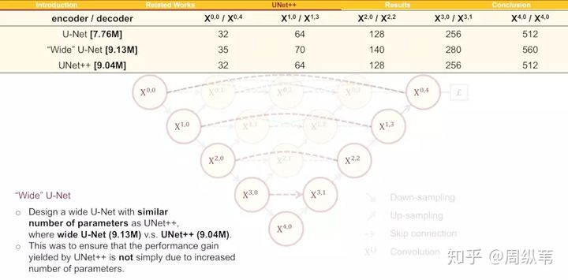


我本人是认为这个回击力度并不大，因为这样增加参数说心里话有点敷衍，应该能找到更好的对比方法。尽管有不足，我们先来看看结果。


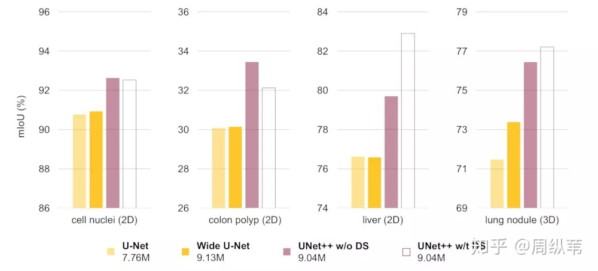


根据现有的结果，我的总结是，单纯的把网络变宽，把参数提上去对效果的提升并不大，如何能把参数用在刀刃上是很重要的。那么UNet++这种设计就是将参数用在刀刃上的一个方案。


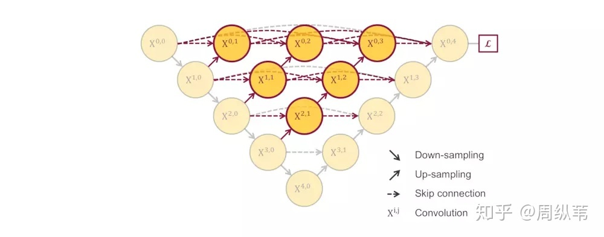


我们在回来看这个UNet++，对于这个主体结构，我们在论文中给出了一些点评，说白了就是把原来空心的U-Net填满了，优势是可以抓取不同层次的特征，将它们通过特征叠加的方式整合，不同层次的特征，或者说不同大小的感受野，对于大小不一的目标对象的敏感度是不同的，比如，感受野大的特征，可以很容易的识别出大物体的，但是在实际分割中，大物体边缘信息和小物体本身是很容易被深层网络一次次的降采样和一次次升采样给弄丢的，这个时候就可能需要感受野小的特征来帮助。另一个解读就是如果你横着看其中一层的特征叠加过程，就像一个去年很火的DenseNet的结构，非常的巧合，原先的U-Net，横着看就很像是Residual的结构，这个就很有意思了，UNet++对于U-Net分割效果提升可能和DenseNet对于ResNet分类效果的提升，原因如出一辙，因此，在解读中我们也参考了Dense Connection的一些优势，比方说特征的再利用等等。

这些解读都是很直观的认识，其实在深度学习里面，某某结构效果优于某某结构的理由，或者你加这个操作比不加操作要好，很多时候是有玄学的味道在里头，也有大量的工作也在探索深度网络的可解释性。关于UNet++的主体结构，我不想花时间赘述了。

------

## 4. 高潮

接下来我要说的这部分，非常的有意思，如果这次分享就给我三分钟，我可能就会花两分半钟在这里。刚刚在讲这里的时候留了一个伏笔，说这个结构在反向传播的时候中间部分会收不到过来的梯度，如果只用最右边的一个loss来做的话。

刚才说了，一个非常直接的解决方案就是深监督，也就是deep supervision。这个概念不是新的，有很多对U-Net对改进论文中也有用到，具体的实现操作就是在图中 ![[公式]](https://www.zhihu.com/equation?tex=X%5E%7B0%2C1%7D) , ![[公式]](https://www.zhihu.com/equation?tex=X%5E%7B0%2C2%7D) , ![[公式]](https://www.zhihu.com/equation?tex=X%5E%7B0%2C3%7D) , ![[公式]](https://www.zhihu.com/equation?tex=X%5E%7B0%2C4%7D) 后面加一个1x1的卷积核，相当于去监督每个level，或者每个分支的U-Net的输出。

我给大家提供三个用Deep Supervision的结构来比较，一个就是这个，第二个是加在UC Berkeley提出的结构上，最后一个是加在UNet++上，`**请问是你认为哪个会更棒？**`这是一个开放问题，我这里不做展开讨论，我们论文中使用的是最后一个。

因为deep supervision具体应该套在哪个结构上面不是我想说的重点，deep supervision的优点也在很多论文中有讲解，我这里想着重讨论的是当它配合上这样一个填满的U-Net结构时，带来其中一个非常棒的优势。此处强烈建议暂停，想一想，`**如果我在训练过程中在各个level的子网络中加了这种深监督，可以带来怎样的好处呢？**`


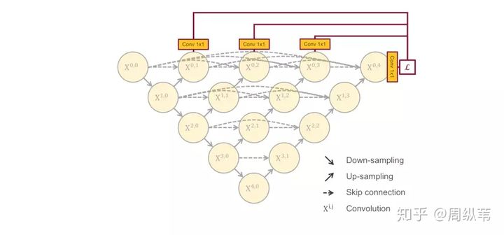


**两个字：剪枝。**

同时引出三个问题：

- `**为什么UNet++可以被剪枝**`
- `**如何剪枝**`
- `**好处在哪里**`


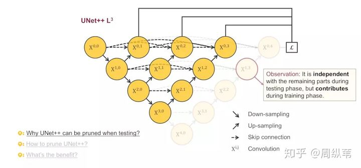


我们来看看为什么可以剪枝，这张图特别的精彩。关注被剪掉的这部分，你会发现，在测试的阶段，由于输入的图像只会前向传播，扔掉这部分对前面的输出完全没有影响的，而在训练阶段，因为既有前向，又有反向传播，被剪掉的部分是会帮助其他部分做权重更新的。这两句话同样重要，我再重复一遍，测试时，剪掉部分对剩余结构不做影响，训练时，剪掉部分对剩余部分有影响。这意味什么？

因为在深监督的过程中，每个子网络的输出都其实已经是图像的分割结果了，所以如果小的子网络的输出结果已经足够好了，我们可以随意的剪掉那些多余的部分了。

来看一下这个动图，为了定义的方便起见，我们把每个剪完剩下的子网络根据它们的深度命名为UNet++ L1，L2，L3，L4，后面会简称为L1～L4。最理想的状态是什么？当然是L1喽，如果L1的输出结果足够好，剪完以后的分割网络会变得非常的小。

这里我想问两个问题：

- `**为什么要在测试的时候剪枝，而不是直接拿剪完的L1，L2，L3训练？**`
- `**怎么去决定剪多少？**`

对于为什么要在测试的时候剪枝，而不是直接拿剪完的L1，L2，L3训练，我们的解释其实上一页ppt上面写了，剪掉的部分在训练时的反向传播中是有贡献的，如果直接拿L1，L2，L3训练，就相当于只训练了不同深度的U-Net，最后的结果会很差。

第二个问题，如何去决定剪多少，还是比较好回答的。因为在训练模型的时候会把数据分为训练集，验证集和测试集，训练集上是一定拟合的很好的，测试集是我们不能碰的，所以我们会根据子网络在验证集的结果来决定剪多少。所谓的验证集就是一开始从训练集中分出来的数据，用来监测训练过程用的。

好，讲完了思路，我们来看结果。


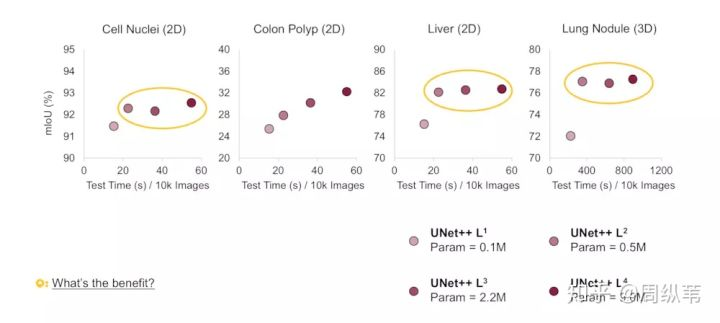


先看看L1～L4的网络参数量，差了好多，L1只有0.1M，而L4有9M，也就是理论上如果L1的结果我是满意的，那么模型可以被剪掉的参数达到98.8%。不过根据我们的四个数据集，L1的效果并不会那么好，因为太浅了嘛。但是其中有三个数据集显示L2的结果和L4已经非常接近了，也就是说对于这三个数据集，在测试阶段，我们不需要用9M的网络，用半M的网络足够了。

回想一下一开始我提出的问题，网络需要多深合适，这幅图是不是就一目了然。网络的深度和数据集的难度是有关系的，这四个数据集当中，第二个，也就是息肉分割是最难的，大家可以看到纵坐标，它代表分割的评价指标，越大越好，其他都能达到挺高的，但是唯独息肉分割只有在30左右，对于比较难的数据集，可以看到网络越深，它的分割结果是在不断上升的。对于大多数比较简单的分割问题，其实并不需要非常深，非常大的网络就可以达到很不错的精度了。

横坐标代表的是在测试阶段，单显卡12G的TITAN X (Pascal)下，分割一万张图需要的时间。我们可以看到不同的模型大小，测试的时间差好多。如果比较L2和L4的话，就差了三倍之多。


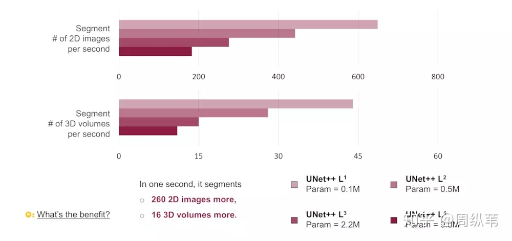


对于测试的速度，用这一幅图会更清晰。我们统计了用不同的模型，1秒钟可以分割多少的图。如果用L2来代替L4的话，速度确实能提升三倍。

剪枝应用最多的就是在移动手机端了，根据模型的参数量，如果L2得到的效果和L4相近，模型的内存可以省18倍。还是非常可观的数目。

关于剪枝的这部分我认为是对原先的U-Net的一个很大的改观，原来的结构过于刻板，并且没有很好的利用不用层级的特征。

简单的总结一下，UNet++的第一个优势就是精度的提升，这个应该它整合了不同层次的特征所带来的，第二个是灵活的网络结构配合深监督，让参数量巨大的深度网络在可接受的精度范围内大幅度的缩减参数量。

------

## 5. 说在后面

再次放上我们的UNet++结构


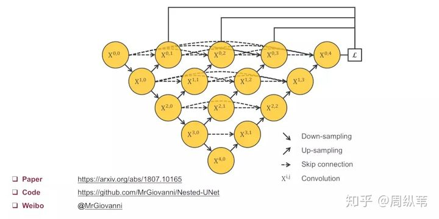


回顾一下这次分享，我问了好多问题，也提供了其中一些我个人给出的解释。

一顿听下来，热心的网友可能会懵了，就这么个分割网络，都能说这么久，要我说就放个结构图，说这个网络很牛逼，再告知一下代码在哪儿，谢谢大家就完事儿了。

其实搞学术做研究不是这样子的，UNet++肯定马上就会被更强的结构所代替，但是要设计出更强的结构，你得首先明白这个结构，甚至它的原型U-Net设计背后的心路历程。与其和大家分享一个苍白的分割网络，我更愿意分享的是这个项目背后从开始认识U-Net，到分析它的组成，到批判性的解读，再到改进思路的形成，实验设计，像刚刚分享过程中一次次尴尬的自问自答，中间那些非常饱满的心路历程。这也是我在博士的两年中学到的做研究的范式。

说句题外话，就跟玩狼人杀一样，你一上来就说自己预言家，验了谁谁谁，那没人信的呀，你得说清楚为什么要验他，警徽怎么留，把这些心路历程都盘盘清楚，身份才能做实。

我在微博上也看到有人说，也想到了非常类似的结构，实验也快做完了，看到了我这篇论文心就凉了。其实网络结构怎么样真的不重要，重要的是你怎么能把故事给讲清楚，要是讲完以后还能够引起更多的思考和讨论那就更好了。我在分享中提到了很多我们论文中的不足之处，也非常欢迎大家可以批评指正。