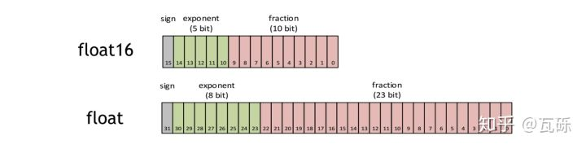
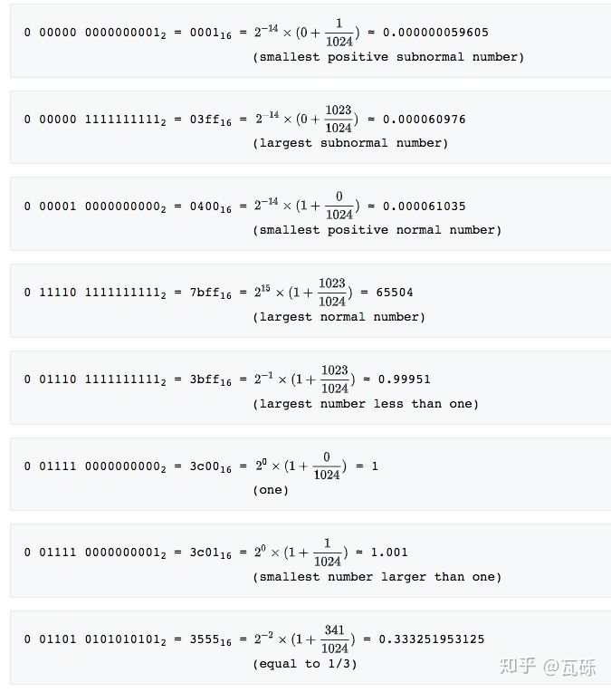
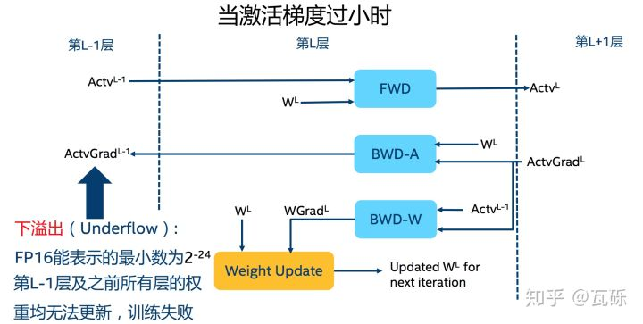
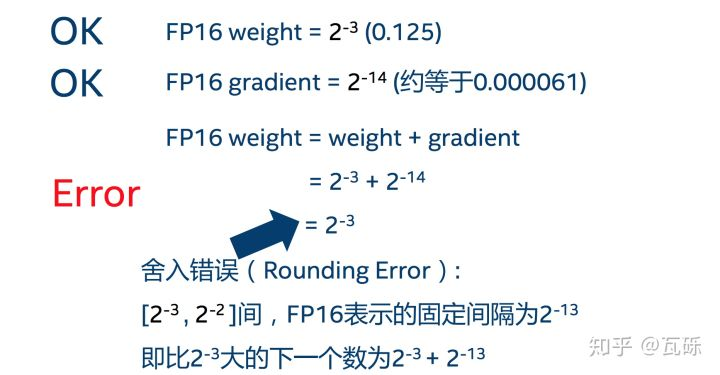
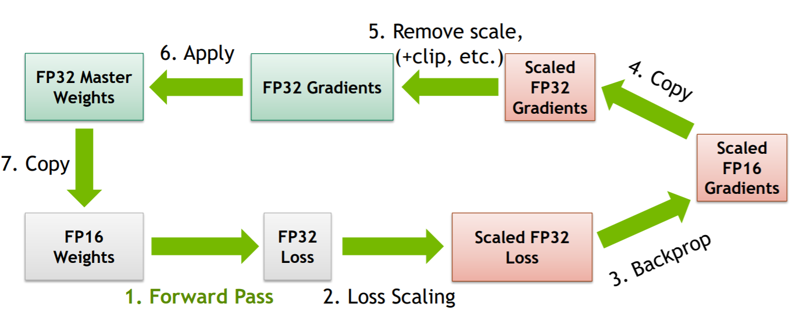
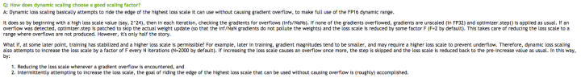

# PyTorch--基于Apex的混合精度加速

⌚️: 2020年10月21日

📚参考

- Paper: [Mixed Precision Training](https://paperswithcode.com/paper/mixed-precision-training)
- [apex github](https://github.com/nvidia/apex)
- [apex API](https://nvidia.github.io/apex/index.html)
- [nvidia apex介绍，最官方的](https://docs.nvidia.com/deeplearning/performance/mixed-precision-training/index.html)
- ————
- [原文1](https://zhuanlan.zhihu.com/p/79887894)
- [原文2](https://zhpmatrix.github.io/2019/07/01/model-mix-precision-acceleration/)
- [原文3](https://bindog.github.io/blog/2020/04/12/model-parallel-with-apex/)

---

你想获得双倍训练速度的快感吗？

你想让你的显存空间瞬间翻倍吗？ 

如果我告诉你只需要三行代码即可实现，你信不？

在这篇博客里会详解一下混合精度计算（Mixed Precision），并介绍一款Nvidia开发的基于PyTorch的混合精度训练加速神器--Apex，最近Apex更新了API，可以用短短三行代码就能实现不同程度的**混合精度加速**，训练时间直接缩小一半。

话不多说，直接先教你怎么用。

**PyTorch实现**

```python
from apex import amp
model, optimizer = amp.initialize(model, optimizer, opt_level="O1") # 这里是“欧一”，不是“零一”
with amp.scale_loss(loss, optimizer) as scaled_loss:
    scaled_loss.backward()
```

对，就是这么简单，如果你不愿意花时间深入了解，读到这基本就可以直接使用起来了。

但是如果你希望对FP16和Apex有更深入的了解，或是在使用中遇到了各种不明所以的“Nan”的同学，可以接着读下去，后面会有一些有趣的理论知识和瓦砾最近一个月使用Apex遇到的各种bug，不过当你深入理解并解决掉这些bug后，你就可以彻底摆脱“慢吞吞”的FP32啦。

## 1. 理论部分

为了充分理解混合精度的原理，以及API的使用，先补充一点基础的理论知识。

### 1.1 什么是FP16？

**半精度浮点数**是一种计算机使用的二进制浮点数数据类型，使用2字节（16位）存储。



FP16的组成

其中，`sign`位表示正负，`exponent`位表示指数（ ![[公式]](https://www.zhihu.com/equation?tex=2%5E%7Bn-15%2B%7B1%7D%28n%3D0%29%7D) ），`fraction`位表示的是分数（ ![[公式]](https://www.zhihu.com/equation?tex=%5Cfrac%7Bm%7D%7B1024%7D%E2%80%8B) ）。其中当指数为零的时候，下图加号左边为0，其他情况为1。



fp16的样例

### 1.2 为什么需要FP16？

在使用FP16之前，我想再赘述一下为什么我们使用FP16。 

1. **减少显存占用** 现在模型越来越大，当你使用Bert这一类的预训练模型时，往往显存就被模型及模型计算占去大半，当想要使用更大的Batch Size的时候会显得捉襟见肘。由于FP16的内存占用只有FP32的一半，自然地就可以帮助训练过程节省一半的显存空间。
2. **加快训练和推断的计算** 与普通的空间时间Trade-off的加速方法不同，FP16除了能节约内存，还能同时节省模型的训练时间。在大部分的测试中，基于FP16的加速方法能够给模型训练带来多一倍的加速体验（爽感类似于两倍速看肥皂剧）。
3. **张量核心的普及** 硬件的发展同样也推动着模型计算的加速，随着Nvidia张量核心（Tensor Core）的普及，16bit计算也一步步走向成熟，低精度计算也是未来深度学习的一个重要趋势，再不学习就out啦。

### 1.3 FP16带来的问题：量化误差

这个部分是整个博客最重要的**理论核心**。 讲了这么多FP16的好处，那么使用FP16的时候有没有什么问题呢？当然有。FP16带来的问题主要有两个：**1. 溢出错误；2. 舍入误差**。

#### **1.3.1 溢出错误（Grad Overflow / Underflow）**

 由于FP16的动态范围（ ![[公式]](https://www.zhihu.com/equation?tex=6+%5Ctimes+10%5E%7B-8%7D+%5Csim+65504) ）比FP32的动态范围（ ![[公式]](https://www.zhihu.com/equation?tex=1.4+%5Ctimes+10%5E%7B-45%7D+%5Csim+1.7+%5Ctimes+10%5E%7B38%7D) ）要狭窄很多，因此在计算过程中很容易出现上溢出（Overflow， ![[公式]](https://www.zhihu.com/equation?tex=g%3E65504) ）和下溢出（Underflow， ![[公式]](https://www.zhihu.com/equation?tex=g%3C6%5Ctimes10%5E%7B-8%7D) ）的错误，溢出之后就会出现“Nan”的问题。在深度学习中，由于激活函数的的梯度往往要比权重梯度小，更易出现下溢出的情况。



下溢出

#### **1.3.2 舍入误差（Rounding Error）** 

舍入误差指的是当梯度过小，小于当前区间内的最小间隔时，该次梯度更新可能会失败，用一张图清晰地表示：




舍入误差

### 1.4. 解决问题的办法：混合精度训练+动态损失放大

1. **混合精度训练（Mixed Precision）** 混合精度训练的精髓在于“在内存中用FP16做储存和乘法从而加速计算，用FP32做累加避免舍入误差”。混合精度训练的策略有效地缓解了舍入误差的问题。

2. **损失放大（Loss Scaling）** 即使用了混合精度训练，还是会存在无法收敛的情况，原因是激活梯度的值太小，造成了下溢出（Underflow）。损失放大的思路是：

   - ​	反向传播前，将损失变化（dLoss）手动增大 ![[公式]](https://www.zhihu.com/equation?tex=2%5Ek) 倍，因此反向传播时得到的中间变量（激活函数梯度)则不会溢出；

   - ​    反向传播后，将权重梯度缩 ![[公式]](https://www.zhihu.com/equation?tex=2%5Ek%E2%80%8B) 倍，恢复正常值。




## 2. Apex的新API：Automatic Mixed Precision (AMP)

曾经的Apex混合精度训练的api仍然需要手动half模型以及输入的数据，比较麻烦，现在新的api只需要三行代码即可无痛使用：

```python
from apex import amp
model, optimizer = amp.initialize(model, optimizer, opt_level="O1") # 这里是“欧一”，不是“零一”
with amp.scale_loss(loss, optimizer) as scaled_loss:
    scaled_loss.backward()
```

### **2.1 opt_level**

其中只有一个`opt_level`需要用户自行配置：

- `O0`：纯FP32训练，可以作为accuracy的baseline；
- `O1`：混合精度训练（推荐使用），根据黑白名单自动决定使用FP16（GEMM, 卷积）还是FP32（Softmax）进行计算。
- `O2`：“几乎FP16”混合精度训练，不存在黑白名单，除了Batch norm，几乎都是用FP16计算。
- `O3`：纯FP16训练，很不稳定，但是可以作为speed的baseline；

### **2.2 动态损失放大（Dynamic Loss Scaling）**

AMP默认使用动态损失放大，为了充分利用FP16的范围，缓解舍入误差，尽量使用最高的放大倍数（ ![[公式]](https://www.zhihu.com/equation?tex=2%5E%7B24%7D) ），如果产生了上溢出（Overflow），则跳过参数更新，缩小放大倍数使其不溢出，在一定步数后（比如2000步）会再尝试使用大的scale来充分利用FP16的范围：



Nvidia关于动态损失放大的解释

## 3. 干货：踩过的那些坑

这一部分是整篇博客最干货的部分，是瓦砾在最近在apex使用中的踩过的所有的坑，由于apex报错并不明显，常常debug得让人很沮丧，但只要注意到以下的点，95%的情况都可以畅通无阻了：

1. 判断你的GPU是否支持FP16：支持的有拥有Tensor Core的GPU（2080Ti、Titan、Tesla等），不支持的（Pascal系列）就不建议折腾了。

2. 常数的范围：为了保证计算不溢出，首先要保证人为设定的常数（包括调用的源码中的）不溢出，如各种epsilon，INF（根据

   [@哟林小平](https://www.zhihu.com/people/b642a3cbd3632ff3ca17563cdaa6d7b4)同学的反馈，改成-float('inf')就可以啦）等。

3. Dimension最好是8的倍数：[Nvidia官方的文档的2.2条](https://link.zhihu.com/?target=https%3A//docs.nvidia.com/deeplearning/sdk/mixed-precision-training/index.html)表示，维度都是8的倍数的时候，性能最好。

4. 涉及到sum的操作要小心，很容易溢出，类似Softmax的操作建议用官方API，并定义成layer写在模型初始化里。

5. 模型书写要规范：自定义的Layer写在模型初始化函数里，graph计算写在forward里。

6. 某些不常用的函数，在使用前需要注册：`amp.register_float_function(torch, 'sigmoid')`

7. [某些函数（如einsum）暂不支持FP16加速，建议不要用的太heavy，[xlnet的实现改FP16](https://link.zhihu.com/?target=https%3A//github.com/huggingface/pytorch-transformers/issues/802)困扰了我很久。]大误，参考[issue 802 slayton58](https://link.zhihu.com/?target=https%3A//github.com/huggingface/transformers/issues/802)的说法，注册好就可以强制加速了。 

8. 需要操作模型参数的模块（类似EMA），要使用AMP封装后的model。

9. 需要操作梯度的模块必须在optimizer的step里，不然AMP不能判断grad是否为Nan。

10. 欢迎补充。。。

## 4. 总结

这篇从理论到实践地介绍了混合精度计算以及Apex新API（AMP）的使用方法。瓦砾现在在做深度学习模型的时候，几乎都会第一时间把代码改成混合精度训练的了，速度快，精度还不减，确实是调参炼丹必备神器。目前网上还并没有看到关于AMP以及使用时会遇到的坑的中文博客，所以这一篇也是希望大家在使用的时候可以少花一点时间debug。当然，如果读者们有发现新的坑欢迎交流，我会补充在博客中。

