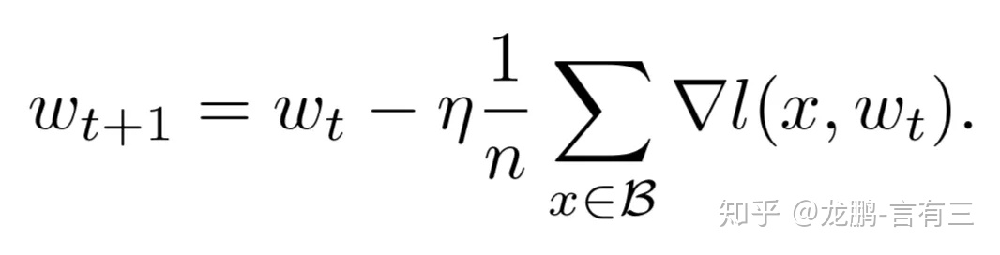
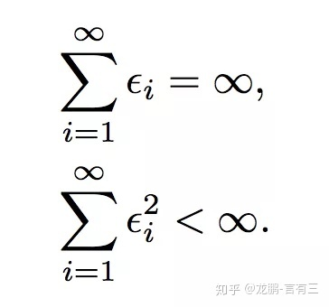
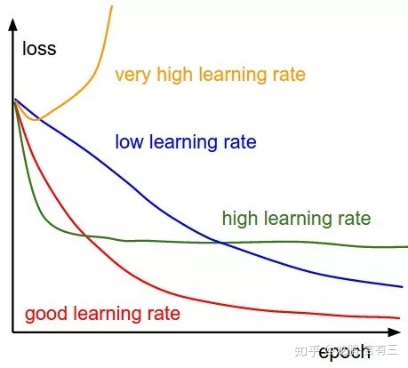
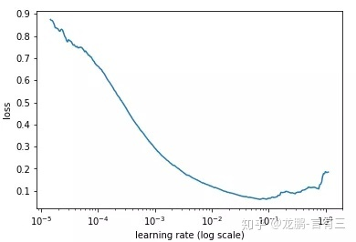
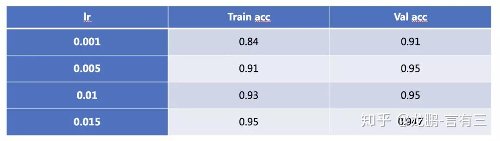
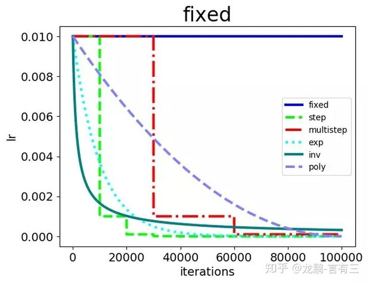
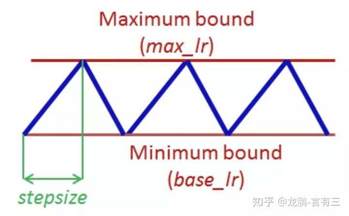
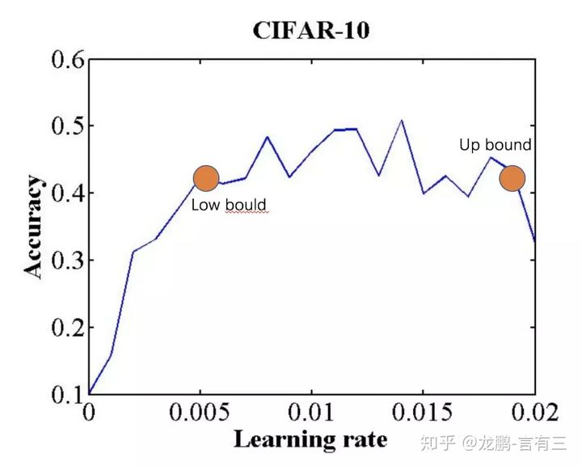
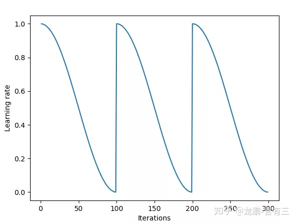
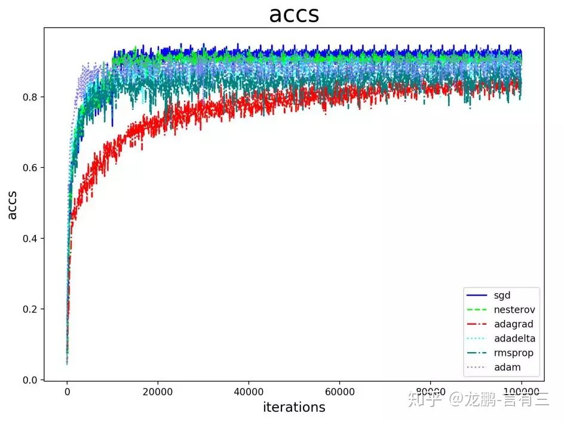

# 【AI不惑境】学习率和batchsize如何影响模型的性能？

⌚️: 2021年08月03日

📚参考

- [AI不惑境](https://zhuanlan.zhihu.com/p/64864995)
- https://blog.csdn.net/xys430381_1/article/details/107346105

---

 

- [上张图片参考:One weird trick for parallelizing convolutional neural networks](https://arxiv.org/pdf/1404.5997.pdf)

> 大家好，这是专栏**《AI不惑境》**的第四篇文章，讲述学习率以及batchsize与模型性能的关系。
>
> 进入到不惑境界，就是向高手迈进的开始了，在这个境界需要自己独立思考。如果说学习是一个从模仿，到追随，到创造的过程，那么到这个阶段，应该跃过了模仿和追随的阶段，进入了创造的阶段。从这个境界开始，讲述的问题可能不再有答案，更多的是激发大家一起来思考。

前几期我们讲述了数据，模型的深度，宽度对深度学习模型性能的影响，这一次我们讲述**学习率和batchsize对模型性能的影响，在实践中这两个参数往往一起调整**。

## **1 为什么说学习率和batchsize** 

目前深度学习模型多采用批量随机梯度下降算法进行优化，随机梯度下降算法的原理如下，

n是批量大小(batchsize)，η是学习率(learning rate)。可知道除了梯度本身，**这两个因子直接决定了模型的权重更新**，从优化本身来看它们是影响模型性能收敛最重要的参数。

**学习率直接影响模型的收敛状态，batchsize则影响模型的泛化性能**，两者又是分子分母的直接关系，相互也可影响，因此这一次来详述它们对模型性能的影响。

## **2 学习率如何影响模型性能？**

通常我们都需要合适的学习率才能进行学习，要达到一个强的凸函数的最小值，学习率的调整应该满足下面的条件，i代表第i次更新。

第一个式子决定了不管初始状态离最优状态多远，总是可以收敛。第二个式子约束了学习率随着训练进行有效地降低，保证收敛稳定性，各种自适应学习率算法本质上就是不断在调整各个时刻的学习率。

学习率决定了权重迭代的步长，因此是一个非常敏感的参数，它对模型性能的影响体现在两个方面，**第一个是初始学习率的大小，第二个是学习率的变换方案。**

### **2.1、初始学习率大小对模型性能的影响**

初始的学习率肯定是有一个最优值的，过大则导致模型不收敛，过小则导致模型收敛特别慢或者无法学习，下图展示了不同大小的学习率下模型收敛情况的可能性，图来自于cs231n。

那么在不考虑具体的优化方法的差异的情况下，怎样确定最佳的初始学习率呢？

通常可以采用最简单的搜索法，即从小到大开始训练模型，然后记录损失的变化，通常会记录到这样的曲线。

随着学习率的增加，损失会慢慢变小，而后增加，而最佳的学习率就可以从其中损失最小的区域选择。

有经验的工程人员常常根据自己的经验进行选择，比如0.1，0.01等。

随着学习率的增加，模型也可能会从欠拟合过度到过拟合状态，在大型数据集上的表现尤其明显，笔者之前在Place365上使用DPN92层的模型进行过实验。随着学习率的增强，模型的训练精度增加，直到超过验证集。

### **2.2、学习率变换策略对模型性能的影响**

学习率在模型的训练过程中很少有不变的，通常会有两种方式对学习率进行更改，一种是**预设规则学习率变化法**，一种是**自适应学习率变换方法**。

#### **2.2.1 预设规则学习率变化法**

常见的策略包括fixed，step，exp，inv，multistep，poly，sigmoid等，集中展示如下：

笔者之前做过一个实验来观察在SGD算法下，各种学习率变更策略对模型性能的影响，具体的结果如下：

从结果来看：

- step，multistep方法的收敛效果最好，这也是我们平常用它们最多的原因。虽然学习率的变化是最离散的，但是并不影响模型收敛到比较好的结果。
- 其次是exp，poly。它们能取得与step，multistep相当的结果，也是因为学习率以比较好的速率下降，虽然变化更加平滑，但是结果也未必能胜过step和multistep方法，在这很多的研究中都得到过验证，离散的学习率变更策略不影响模型的学习。
- inv和fixed的收敛结果最差。这是比较好解释的，因为fixed方法始终使用了较大的学习率，而inv方法的学习率下降过程太快。

关于以上内容的完整分析结果，可以查看往期文章：

**[【模型训练】如何选择最适合你的学习率变更策略](https://link.zhihu.com/?target=http%3A//mp.weixin.qq.com/s%3F__biz%3DMzA3NDIyMjM1NA%3D%3D%26mid%3D2649030692%26idx%3D1%26sn%3D6322e8eec12d8a8b60f578a9ebb4b42c%26chksm%3D8712be59b065374f00dc9b3715e6453e2de5d05262ee4eac47ef5efe6d167703af67f5882029%26scene%3D21%23wechat_redirect)**

从上面的结果可以看出，对于采用非自适应学习率变换的方法，学习率的绝对值对模型的性能有较大影响，研究者常使用step变化策略。

目前学术界也在探索一些最新的研究方法，比如cyclical learning rate，示意图如下：

**实验证明通过设置上下界，让学习率在其中进行变化，可以在模型迭代的后期更有利于克服因为学习率不够而无法跳出鞍点的情况。**

确定学习率上下界的方法则可以使用LR range test方法，即使用不同的学习率得到精度曲线，然后获得精度升高和下降的两个拐点，或者将精度最高点设置为上界，下界设置为它的1/3大小。

SGDR方法则是比cyclical learning rate变换更加平缓的周期性变化方法，如下图，效果与cyclical learning rate类似。

#### **2.2.2 自适应学习率变化法**

自适应学习率策略以Adagrad，Adam等为代表，我们在公众号已经说得非常多了，这里就不再做原理上的讲述，可以查看往期介绍：

**[【AI初识境】为了围剿SGD大家这些年想过的那十几招](https://link.zhihu.com/?target=http%3A//mp.weixin.qq.com/s%3F__biz%3DMzA3NDIyMjM1NA%3D%3D%26mid%3D2649031658%26idx%3D1%26sn%3Dfd1b54b24b607a9d28dc4e83ecc480fb%26chksm%3D8712bd97b065348132d8261907c56ce14077646dfc9c7531a4c3f1ecf6da1a488450428e4580%26scene%3D21%23wechat_redirect)**

原理上各种改进的自适应学习率算法都比SGD算法更有利于性能的提升，但实际上精细调优过的SGD算法可能取得更好的结果，在很多的论文[3-4]中都得到过验证，我们在实验中也多次证明过这一点，如下图。

### **2.3、小结**

不考虑其他任何因素，学习率的大小和迭代方法本身就是一个非常敏感的参数。如果经验不够，还是考虑从Adam系列方法的默认参数开始，如果经验丰富，可以尝试更多的实验配置。

## **3 Batchsize如何影响模型性能？**

模型性能对batchsize虽然没有学习率那么敏感，但是在进一步提升模型性能时，batchsize就会成为一个非常关键的参数。

### **3.1 大的batchsize减少训练时间，提高稳定性**

这是肯定的，同样的epoch数目，大的batchsize需要的batch数目减少了，所以可以减少训练时间，目前已经有多篇公开论文在1小时内训练完ImageNet数据集。另一方面，大的batch size梯度的计算更加稳定，因为模型训练曲线会更加平滑。在微调的时候，大的batch size可能会取得更好的结果。

### **3.2 大的batchsize导致模型泛化能力下降**

在一定范围内，增加batchsize有助于收敛的稳定性，但是随着batchsize的增加，模型的性能会下降，如下图，来自于文[5]。

这是研究者们普遍观测到的规律，虽然可以通过一些技术缓解。这个导致性能下降的batch size在上图就是8000左右。

那么这是为什么呢？

**研究[6]表明大的batchsize收敛到sharp minimum，而小的batchsize收敛到flat minimum，后者具有更好的泛化能力。**两者的区别就在于变化的趋势，一个快一个慢，如下图，造成这个现象的主要原因是小的batchsize带来的噪声有助于逃离sharp minimum。

Hoffer[7]等人的研究表明，**大的batchsize性能下降是因为训练时间不够长，本质上并不少batchsize的问题**，在同样的epochs下的参数更新变少了，因此需要更长的迭代次数。

### **3.3 小结**

batchsize在变得很大(超过一个临界点)时，会降低模型的泛化能力。在此临界点之下，模型的性能变换随batch size通常没有学习率敏感。

## **4 学习率和batchsize的关系**

**通常当我们增加batchsize为原来的N倍时，要保证经过同样的样本后更新的权重相等，按照线性缩放规则，学习率应该增加为原来的N倍[5]。但是如果要保证权重的方差不变，则学习率应该增加为原来的sqrt(N)倍[7]，目前这两种策略都被研究过，使用前者的明显居多。**

从两种常见的调整策略来看，学习率和batchsize都是同时增加的。学习率是一个非常敏感的因子，不可能太大，否则模型会不收敛。同样batchsize也会影响模型性能，那实际使用中都如何调整这两个参数呢？

研究[8]表明，**衰减学习率可以通过增加batchsize来实现类似的效果**，这实际上从SGD的权重更新式子就可以看出来两者确实是等价的，文中通过充分的实验验证了这一点。

研究[9]表明，**对于一个固定的学习率，存在一个最优的batchsize能够最大化测试精度**，这个batchsize和学习率以及训练集的大小正相关。

对此实际上是有两个建议：

- **如果增加了学习率，那么batch size最好也跟着增加，这样收敛更稳定。**
- **尽量使用大的学习率，因为很多研究都表明更大的学习率有利于提高泛化能力。**如果真的要衰减，可以尝试其他办法，比如增加batch size，学习率对模型的收敛影响真的很大，慎重调整。

关于学习率和batch size这次就说这么多，感兴趣可以自行拓展阅读。

参考文献

> [1] Smith L N. Cyclical learning rates for training neural networks[C]//2017 IEEE Winter Conference on Applications of Computer Vision (WACV). IEEE, 2017: 464-472.
>
> [2] Loshchilov I, Hutter F. Sgdr: Stochastic gradient descent with warm restarts[J]. arXiv preprint arXiv:1608.03983, 2016.
>
> [3] Reddi S J, Kale S, Kumar S. On the convergence of adam and beyond[J]. 2018.
>
> [4] Keskar N S, Socher R. Improving generalization performance by switching from adam to sgd[J]. arXiv preprint arXiv:1712.07628, 2017.
>
> [5] Goyal P, Dollar P, Girshick R B, et al. Accurate, Large Minibatch SGD: Training ImageNet in 1 Hour.[J]. arXiv: Computer Vision and Pattern Recognition, 2017.
>
> [6] Keskar N S, Mudigere D, Nocedal J, et al. On large-batch training for deep learning: Generalization gap and sharp minima[J]. arXiv preprint arXiv:1609.04836, 2016.
>
> [7] Hoffer E, Hubara I, Soudry D. Train longer, generalize better: closing the generalization gap in large batch training of neural networks[C]//Advances in Neural Information Processing Systems. 2017: 1731-1741.
>
> [8] Smith S L, Kindermans P J, Ying C, et al. Don't decay the learning rate, increase the batch size[J]. arXiv preprint arXiv:1711.00489, 2017.
>
> [9] Smith S L, Le Q V. A bayesian perspective on generalization and stochastic gradient descent[J]. arXiv preprint arXiv:1710.06451, 2017.

## 5. 总结

学习率和batchsize是影响模型性能极其重要的两个参数，我们应该非常谨慎地对待。

对于学习率算法，可以选择Adam等自适应学习率策略先训练模型看看收敛结果，再考虑使用SGD等算法进一步提升性能。对于Batchsize，大部分人并不会使用几千上万的batchsize，因此也不用担心模型性能的下降，用大一点(比如128)的batchsize吧，这样需要的迭代次数更少，结果也更加稳定。

## 6. 分布式情况

在分布式训练中，batch size 随着数据并行的worker增加而增大，假设baseline的batch size为B，learning rate为lr，训练epoch数为N。
如果保持baseline（小batchsize）的learning rate，一般不会有较好的收敛速度和精度。

原因如下：

- 对于收敛速度，假设k个worker，每次过的sample数量为kB，因此一个epoch下的更新次数为baseline的1/k，而每次更新的lr不变，所以要达到baseline相同的更新次数，则需要增加epoch数量，最大需要增加k*N个epoch，因此收敛加速倍数会远远低于k。

- 对于收敛精度，由于增大了batch size使梯度估计相较于badeline的梯度更加准确，噪音减少，更容易收敛到附近的local minima，类似于GD的效果。

  

batch size增大K倍，相当于将梯度的方差减少K倍，因此梯度更加准确。

如果要保持方差和原来SGD一样，相当于给定了这么大的方差带宽容量，那么就可以增大lr，充分利用这个方差容量。
因此可将lr增加sqrt(K)倍，以提高训练速度，这也是在linear scaling rule之前很多人常用的增大lr的方式。但在实际中，发现直接将lr增大K倍的效果较好。