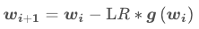
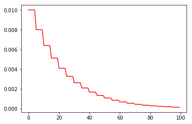
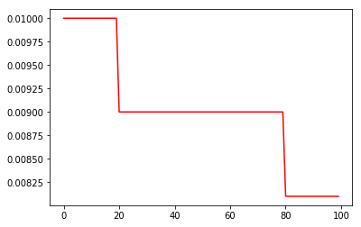
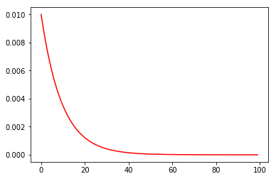
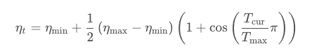
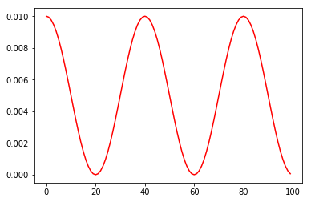
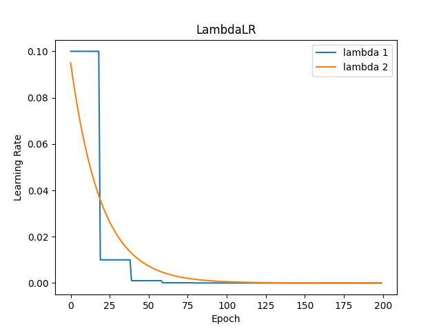
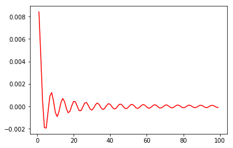

# 学习率调整策略

⌚️: 2020年7月30日

📚参考

- [如何设置PyTorch的动态学习率](https://yichengsu.github.io/2019/08/how-to-set-lr-in-pytorch/)
- [PyTorch学习之六个学习率调整策略](https://blog.csdn.net/shanglianlm/article/details/85143614)

- [pytorch 动态调整学习率](http://www.spytensor.com/index.php/archives/32/)

- [【PyTorch】优化器 torch.optim.Optimizer](https://zhuanlan.zhihu.com/p/87209990)

----

## 1. 使用定义方法（Optimizer）

PyTorch提供了`torch.optim.lr_scheduler`来帮助用户改变学习率，下边将从`Optimizer`入手，看一下这个类是如何工作的。

为什么从Optimizer入手，因为无论是Adam还是SGD，都是继承的这个类。同时，scheduler也是给所有的Optimizer服务的，所以需要用的方法都会定义在这个基类里，直接看一下这个类的属性即可。给出Doc中的代码[链接](https://pytorch.org/docs/1.1.0/_modules/torch/optim/optimizer.html#Optimizer)。

首先是初始化方法`def __init__(self, params, defaults)`，这个方法的params参数，就是我们在初始化优化器的时候传入的网络的参数，如`Alexnet.parameters()`，而后边所有的参数都将合并成dict参数作为这个方法的defaults。

看一下`Alexnet.parameters()`中存的都是什么：

```
for alex in Alexnet.parameters():
    print(alex.shape)
```

可以看到，这里边存的就是整个网络的参数。


有两种定义optimizer的方法：

```
optimizer = optim.SGD(model.parameters(), lr=0.01, momentum=0.9)
optimizer = optim.SGD([
    {'params': model.base.parameters()},
    {'params': model.classifier.parameters(), 'lr': 1e-3}
], lr=1e-2, momentum=0.9)
```

如果是**第一种**定义的方法：在这个初始化方法中，会把这些参数先改造成`[{'params': Alexnet.parameters()}]`这样的一个长度为1的list。然后对这个list进行加工，添加上defaults中的参数，如果我们使用Alexnet来做一个例子的话，就是下边这个样子：

```
optimizer = torch.optim.Adam(Alexnet.parameters(), lr=0.001)
print([group.keys() for group in optimizer.param_groups])
# [dict_keys(['params', 'lr', 'betas', 'eps', 'weight_decay', 'amsgrad'])]
```


如果是**第二种**定义的方法：因为传入的本身就是dict的形式，所以会继续对他进行加工，添加上后边的参数，我们直接看疗效：

```
optimizer = torch.optim.SGD([
    {'params': Alexnet.features.parameters()},
    {'params': Alexnet.classifier.parameters(), 'lr': 1e-3}
], lr=1e-2, momentum=0.9)
print([group.keys() for group in optimizer.param_groups])
# [dict_keys(['params', 'lr', 'momentum', 'dampening', 'weight_decay', 'nesterov']), dict_keys(['params', 'lr', 'momentum', 'dampening', 'weight_decay', 'nesterov'])]
```


这次的list变成了两个元素，而且每个元素的组成和使用Adam也不一样了，这很明显，因为不同的优化器需要的参数不同嘛~(关于不同层的lr不同的设置这里给出官网链接)

但是两者是相似的，就是每个元素都有params和lr，这就够了。

### 1.1 自定义根据 epoch 改变学习率。

这种方法在开源代码中常见，此处引用 pytorch 官方实例中的代码 [adjust_lr](https://github.com/pytorch/examples/blob/95d5fddfb578674e01802f1db1820d8ac1015f67/imagenet/main.py#L314)

```python
def adjust_learning_rate(optimizer, epoch):
    """Sets the learning rate to the initial LR decayed by 10 every 30 epochs"""
    lr = args.lr * (0.1 ** (epoch // 30))
    for param_group in optimizer.param_groups:
        param_group['lr'] = lr
```

注释：在调用此函数时需要输入所用的 optimizer 以及对应的 epoch ，并且 args.lr 作为初始化的学习率也需要给出。

使用代码示例:

```python
optimizer = torch.optim.SGD(model.parameters(),lr = args.lr,momentum = 0.9)

for epoch in range(10):
    adjust_learning_rate(optimizer,epoch)
    train(...)
    validate(...)
```

### 1.2  针对模型的不同层设置不同的学习率

当我们在使用预训练的模型时，需要对分类层进行单独修改并进行初始化，其他层的参数采用预训练的模型参数进行初始化，这个时候我们希望在进行训练过程中，除分类层以外的层只进行微调，不需要过多改变参数，因此需要设置较小的学习率。而改正后的分类层则需要以较大的步子去收敛，学习率往往要设置大一点以 resnet101 为例，分层设置学习率。

```python
model = torchvision.models.resnet101(pretrained=True)

large_lr_layers = list(map(id,model.fc.parameters()))
small_lr_layers = filter(lambda p:id(p) not in large_lr_layers,model.parameters())

optimizer = torch.optim.SGD([
            {"params":large_lr_layers},
            {"params":small_lr_layers,"lr":1e-4}
            ],lr = 1e-2,momenum=0.9)
```

注：large_lr_layers 学习率为 1e-2，small_lr_layers 学习率为 1e-4，两部分参数共用一个 momenum


### 1.3  根据具体需要改变 lr

以前使用 keras 的时候比较喜欢 ReduceLROnPlateau 可以根据 损失或者 准确度的变化来改变 lr。最近发现 pytorch 也实现了这一个功能。

```python
class torch.optim.lr_scheduler.ReduceLROnPlateau(optimizer, mode='min', factor=0.1, patience=10, verbose=False, threshold=0.0001, threshold_mode='rel', cooldown=0, min_lr=0, eps=1e-08)
```

以 acc 为例，当 mode 设置为 “max” 时，如果 acc 在给定 patience 内没有提升，则以 factor 的倍率降低 lr。

使用方法示例：

```python
optimizer = torch.optim.SGD(model.parameters(), lr=0.1, momentum=0.9)

scheduler = ReduceLROnPlateau(optimizer, 'max',verbose=1,patience=3)

for epoch in range(10):
    train(...)
    val_acc = validate(...)
    # 降低学习率需要在给出 val_acc 之后
    scheduler.step(val_acc)
```


### 1.4  手动设置 lr 衰减区间

使用方法示例

```
def adjust_learning_rate(optimizer, lr):
    for param_group in optimizer.param_groups:
        param_group['lr'] = lr

for epoch in range(60):        
    lr = 30e-5
    if epoch > 25:
        lr = 15e-5
    if epoch > 30:
        lr = 7.5e-5
    if epoch > 35:
        lr = 3e-5
    if epoch > 40:
        lr = 1e-5
    adjust_learning_rate(optimizer, lr)
```


### 1.5  余弦退火

论文: [SGDR: Stochastic Gradient Descent with Warm Restarts](https://arxiv.org/abs/1608.03983)

使用方法示例

```
epochs = 60

optimizer = optim.SGD(model.parameters(),lr = config.lr,momentum=0.9,weight_decay=1e-4) 

scheduler = lr_scheduler.CosineAnnealingLR(optimizer,T_max = (epochs // 9) + 1)

for epoch in range(epochs):

    scheduler.step(epoch)
```

目前最常用的也就这么多了，当然也有很多其他类别，详情见 [how-to-adjust-learning-rate](https://pytorch.org/docs/stable/optim.html#how-to-adjust-learning-rate)


## 2. 使用类（_LRScheduler）

> 利用lr_scheduler()提供的几种衰减函数

### 基础知识

梯度下降算法中的学习率的作用是：




可见学习率LR控制了更新的步伐，训练开始时学习率会大，后面学习率会减小。因为一开始的学习率大是为了快速接近最优值，但如果后面还是不减小的话，就很有可能更新超过最优值点或者在最优点附近震荡，因此调整学习率是使得算法在保证精确度的前提下更快的途径。

pytorch中给出了学习率如何进行调整的方法，所有的学习率调整策略都会继承_LRScheduler这个类，这个父类的构造函数内容如下。

**主要属性**：

- optimizer：关联的优化器。优化器存放学习率，而_LRScheduler改动学习率
- last_epoch：记录epoch数
- base_lrs：记录初始学习率，列表形式


上面的base_lrs是一个列表的形式，当优化器中有多个参数组的时候，base_lrs里面就会存放多个学习率，具体通过构造函数里面的三句话即可实现：

```
for group in optimizer.param_groups:
	group.setdefault('initial_lr', group['lr'])

self.base_lrs = list(map(lambda group: group['initial_lr'], optimizer.param_groups))
```


**主要方法**：

- step()：更新下一个epoch的学习率
- get_lr()：虚函数，计算下一个epoch的学习率。这是要通过子类重写的。

这里step函数的内容如下：

```
def step(self, epoch=None):
    if epoch is None:
        epoch = self.last_epoch + 1
    self.last_epoch = epoch
    for param_group, lr in zip(self.optimizer.param_groups, self.get_lr()):
        param_group['lr'] = lr
```

这里注意：执行step的步骤千万不要放在iteration的for循环当中，也就是说不可以和optimizer的step在同一个循环内，而是要放在epoch的那个循环中。否则学习率将会快速降低。

step里面最关键的部分就是上面代码中那个for循环，这部分将会对学习率做出更改。主要是通过get_lr函数实现lr的计算，再把计算好的lr放到参数组中。


所有的动态修改lr的类，都是继承的这个类，所以我们看一下这个类包含什么方法。源码[链接](https://pytorch.org/docs/1.1.0/_modules/torch/optim/lr_scheduler.html#ExponentialLR)。

在初始化方法中`def __init__(self, optimizer, last_epoch=-1)`，包含两个参数，第一个参数就是我们上边提到的optimizer的任何一个子类。第二个参数的意思是**当前执行到了哪个epoch**。我们不指定它的时候，虽然默认是-1，但是init中会调用一次step并设置为0。

一定要注意PyTorch的版本！我的windows上用的是1.0.1，服务器用的是1.1.0，就闹了很多问题。就拿这个类来说，在1.0.1中是先`setp()`再训练，而1.1.0进行了更新，先训练，然后再`step()`。

当我们调用了初始化后，会给optimizer增加一个字段，看一下：

```
scheduler = torch.optim.lr_scheduler.StepLR(optimizer, step_size=5, gamma=0.1)
print([group.keys() for group in optimizer.param_groups])
# [dict_keys(['params', 'lr', 'betas', 'eps', 'weight_decay', 'amsgrad', 'initial_lr'])]
```

新增加的`initial_lr`字段就是原始的lr。

在`def step(self, epoch=None)`方法中，通常情况下我们**不需要**指定这个参数epoch，因为每次调用他都会增加1。在这个函数中会调用一个需要重载的方法`get_lr()`，每次调用都会从这个方法中提取改变后的lr，赋值给optimizer。

这里其实我一直有个疑问的，就是scheduler的step和optimizer的step是一个什么关系，其实通过源码，看到这里，这俩函数没啥关系！scheduler的step只会修改lr，两者都需要执行！

下边看一下两个scheduler的`get_lr()`对比一下。先看一下SetpLR：

```
def get_lr(self):
    if (self.last_epoch == 0) or (self.last_epoch % self.step_size != 0):
        return [group['lr'] for group in self.optimizer.param_groups]
    return [group['lr'] * self.gamma
            for group in self.optimizer.param_groups]
```


这个会在设置的步长的整倍数的时候将lr*gamma。
而ExponentialLR则会在每轮结束的时候都进行乘gamma的操作，这个减小也真的是指数倍的。

```
def get_lr(self):
    if self.last_epoch == 0:
        return self.base_lrs
    return [group['lr'] * self.gamma
            for group in self.optimizer.param_groups]
```

### Demo

```
scheduler = StepLR(optimizer, step_size=30, gamma=0.1)
train_loader = Data.DataLoader(
        dataset=train_dataset, batch_size=BATCH_SIZE, shuffle=True, pin_memory=True)
for epoch in range(100):
    for X, y in train_loader:
        ...
        optimizer.zero_grad()
        loss.backward()
        optimizer.step()
    scheduler.step()
```

PyTorch学习率调整策略通过torch.optim.lr_scheduler接口实现。PyTorch提供的学习率调整策略分为三大类，分别是

> a. 有序调整：等间隔调整(Step)，按需调整学习率(MultiStep)，指数衰减调整(Exponential)和 余弦退火CosineAnnealing。
> b. 自适应调整：自适应调整学习率 ReduceLROnPlateau。
> c. 自定义调整：自定义调整学习率 LambdaLR。


下面的6种学习率调整策略都会有代码实例来直观感受其作用，为避免重复，在开头我们先统一构造一个输入数据以供后续使用。数据构造如下：

```
LR = 0.1
iteration = 10
max_epoch = 200

weights = torch.randn((1), requires_grad=True)
target = torch.zeros((1))

optimizer = optim.SGD([weights], lr=LR, momentum=0.9)
```


### 等间隔调整学习率 StepLR

**数学原理**

具体调用是通过torch.optim.lr_scheduler.StepLR()，其功能是等间隔调整学习率。

主要参数：

- step_size：调整间隔数
- gamma：调整系数，常用的是0.1或者0.5，就是缩小10倍或者2倍

也就是说每隔step_size个epoch调整一次学习率，调整方式为`lr=lr∗gamma`

**代码实例**

通过如下代码观察学习率随epoch的变化情况：

```
scheduler_lr = optim.lr_scheduler.StepLR(optimizer, step_size=50, gamma=0.1)  # 设置学习率下降策略
lr_list, epoch_list = list(), list()
for epoch in range(max_epoch):

    lr_list.append(scheduler_lr.get_lr())
    epoch_list.append(epoch)

    for i in range(iteration):

        loss = torch.pow((weights - target), 2)
        loss.backward()

        optimizer.step()
        optimizer.zero_grad()

    scheduler_lr.step()

plt.plot(epoch_list, lr_list, label="Step LR Scheduler")
plt.xlabel("Epoch")
plt.ylabel("Learning rate")
plt.legend()
plt.show()

```


> 等间隔调整学习率，调整倍数为 gamma 倍，调整间隔为 step_size。间隔单位是step。需要注意的是， step 通常是指 epoch，不要弄成 iteration 了。
>
> ```
> torch.optim.lr_scheduler.StepLR(optimizer, step_size, gamma=0.1, last_epoch=-1)
> ```
>
> **参数：**
>
> > step_size(int)- 学习率下降间隔数，若为 30，则会在 30、 60、 90…个 step 时，将学习率调整为 lr*gamma。
> > gamma(float)- 学习率调整倍数，默认为 0.1 倍，即下降 10 倍。
> > last_epoch(int)- 上一个 epoch 数，这个变量用来指示学习率是否需要调整。当last_epoch 符合设定的间隔时，就会对学习率进行调整。当为-1 时，学习率设置为初始值。
>
> ```
> lr_list = []model = net()LR = 0.01optimizer = Adam(model.parameters(),lr = LR)scheduler = lr_scheduler.StepLR(optimizer,step_size=5,gamma = 0.8)for epoch in range(100):    scheduler.step()    lr_list.append(optimizer.state_dict()['param_groups'][0]['lr'])plt.plot(range(100),lr_list,color = 'r')
> ```
>
> 
>
> StepLR阶梯式衰减

### 按需调整学习率 MultiStepLR

**数学原理**

具体调用是通过torch.optim.lr_scheduler.MultiStepLR()，其**功能**是按给定间隔调整学习率。
主要参数：

- **milestones**：设定调整时刻数。是一个list的形式。
- **gamma**：调整系数

调整方式为`lr=lr∗gamma`


**代码实例**

通过如下代码观察学习率随epoch的变化情况：

```
milestones = [50, 125, 160]
scheduler_lr = optim.lr_scheduler.MultiStepLR(optimizer, milestones=milestones, gamma=0.1)

lr_list, epoch_list = list(), list()
for epoch in range(max_epoch):

    lr_list.append(scheduler_lr.get_lr())
    epoch_list.append(epoch)

    for i in range(iteration):

        loss = torch.pow((weights - target), 2)
        loss.backward()

        optimizer.step()
        optimizer.zero_grad()

    scheduler_lr.step()

plt.plot(epoch_list, lr_list, label="Multi Step LR Scheduler\nmilestones:{}".format(milestones))
plt.xlabel("Epoch")
plt.ylabel("Learning rate")
plt.legend()
plt.show()

```


> 按设定的间隔调整学习率。这个方法适合后期调试使用，观察 loss 曲线，为每个实验定制学习率调整时机。
>
> ```
> torch.optim.lr_scheduler.MultiStepLR(optimizer, milestones, gamma=0.1, last_epoch=-1)
> ```
>
> **参数：**
>
> > milestones(list)- 一个 list，每一个元素代表何时调整学习率， list 元素必须是递增的。如 milestones=[30,80,120]
> > gamma(float)- 学习率调整倍数，默认为 0.1 倍，即下降 10 倍。
>
> ```python
> lr_list = []model = net()LR = 0.01optimizer = Adam(model.parameters(),lr = LR)scheduler = lr_scheduler.MultiStepLR(optimizer,milestones=[20,80],gamma = 0.9)for epoch in range(100):    scheduler.step()    lr_list.append(optimizer.state_dict()['param_groups'][0]['lr'])plt.plot(range(100),lr_list,color = 'r')
> ```
>
> 
>
> 三段式衰减

### 指数衰减调整学习率 ExponentialLR

**数学原理**

具体调用是通过torch.optim.lr_scheduler.ExponentialLR()，其功能是按指数衰减调整学习率。

主要参数

- gamma：指数的底，通常设置成一个接近于1的数，例如0.95

调整方式为$lr=lr∗gamma^{epoch}$

**代码实例**
通过如下代码观察学习率随epoch的变化情况：

```
gamma = 0.95scheduler_lr = optim.lr_scheduler.ExponentialLR(optimizer, gamma=gamma)lr_list, epoch_list = list(), list()for epoch in range(max_epoch):    lr_list.append(scheduler_lr.get_lr())    epoch_list.append(epoch)    for i in range(iteration):        loss = torch.pow((weights - target), 2)        loss.backward()        optimizer.step()        optimizer.zero_grad()    scheduler_lr.step()plt.plot(epoch_list, lr_list, label="Exponential LR Scheduler\ngamma:{}".format(gamma))plt.xlabel("Epoch")plt.ylabel("Learning rate")plt.legend()plt.show()
```

> 
>
> 按指数衰减调整学习率，调整公式: lr=lr∗gamma∗∗epoch
>
> ```
> torch.optim.lr_scheduler.ExponentialLR(optimizer, gamma, last_epoch=-1)
> ```
>
> **参数：**
>
> > gamma- 学习率调整倍数的底，指数为 epoch，即 gamma**epoch
>
> ```python
> lr_list = []
> model = net()
> LR = 0.01
> optimizer = Adam(model.parameters(),lr = LR)
> scheduler = lr_scheduler.ExponentialLR(optimizer, gamma=0.9)
> for epoch in range(100):
>     scheduler.step()
>     lr_list.append(optimizer.state_dict()['param_groups'][0]['lr'])
> plt.plot(range(100),lr_list,color = 'r')
> ```
>
> 
>
> 连续衰减

### 余弦退火调整学习率 CosineAnnealingLR

**数学原理**

具体调用是通过torch.optim.lr_scheduler.CosineAnnealingLR()，其**功能**是按余弦周期调整学习率。

主要参数

- **T_max**：下降周期，也就是经过T_max个epoch，学习率从最大下降至最低
- **eta_min**：学习率下限

调整方式为



**代码实例**

通过如下代码观察学习率随epoch的变化情况

```
t_max = 50
scheduler_lr = optim.lr_scheduler.CosineAnnealingLR(optimizer, T_max=t_max, eta_min=0.)

lr_list, epoch_list = list(), list()
for epoch in range(max_epoch):

    lr_list.append(scheduler_lr.get_lr())
    epoch_list.append(epoch)

    for i in range(iteration):

        loss = torch.pow((weights - target), 2)
        loss.backward()

        optimizer.step()
        optimizer.zero_grad()

    scheduler_lr.step()

plt.plot(epoch_list, lr_list, label="CosineAnnealingLR Scheduler\nT_max:{}".format(t_max))
plt.xlabel("Epoch")
plt.ylabel("Learning rate")
plt.legend()
plt.show()

```


> 以余弦函数为周期，并在每个周期最大值时重新设置学习率。以初始学习率为最大学习率，以 2∗Tmax2∗*T**m**a**x* 为周期，在一个周期内先下降，后上升。
>
> ```
> torch.optim.lr_scheduler.CosineAnnealingLR(optimizer, T_max, eta_min=0, last_epoch=-1)
> ```
>
> **参数：**
>
> > T_max(int)- 一次学习率周期的迭代次数，即 T_max 个 epoch 之后重新设置学习率。
> > eta_min(float)- 最小学习率，即在一个周期中，学习率最小会下降到 eta_min，默认值为 0。
>
> ```python
> lr_list = []
> model = net()
> LR = 0.01
> optimizer = Adam(model.parameters(),lr = LR)
> scheduler = lr_scheduler.CosineAnnealingLR(optimizer, T_max = 20)
> for epoch in range(100):
>     scheduler.step()
>     lr_list.append(optimizer.state_dict()['param_groups'][0]['lr'])
> plt.plot(range(100),lr_list,color = 'r')
> ```
>
> 
>
> 余弦式调整

### 自适应调整学习率 ReduceLROnPlateau

**数学原理**

具体调用是通过torch.optim.lr_scheduler.ReduceLRonPlateau()，其功能为监控指标，当指标不再变化则进行调整。例如当loss值不再下降的时候，就调整学习率。

主要参数

- mode：min/max 两种模式，在min模式下，如果监控的指标不下降，那就进行调整学习率操作，在max模式下，如果监控的指标不上升，那就进行调整学习率操作
- factor：调整系数，类似上面部分的gamma
- patience：监控的这个指标可以接受连续多少次不发生变化，默认值是10
- cooldown：冷却时间，调整完之后停止监控一段时间。之后再继续监控
- verbose：控制是否打印日志，如果是True，那么就在学习率变更的时候打印
- min_lr：设置学习率下限
- eps：学习率衰减最小值

**代码实例**

通过如下代码观察学习率随epoch的变化情况，注意在scheduler_lr.step()的时候要把监控的变量输入进去：

```
loss_value = 0.5
accuray = 0.9

factor = 0.1
mode = "min"
patience = 10
cooldown = 10
min_lr = 1e-4
verbose = True

scheduler_lr = optim.lr_scheduler.ReduceLROnPlateau(optimizer, factor=factor, mode=mode, patience=patience,
                                                        cooldown=cooldown, min_lr=min_lr, verbose=verbose)

for epoch in range(max_epoch):
    for i in range(iteration):

        optimizer.step()
        optimizer.zero_grad()

    if epoch == 5:
        loss_value = 0.4

    scheduler_lr.step(loss_value)

```


> 当某指标不再变化（下降或升高），调整学习率，这是非常实用的学习率调整策略。
> 例如，当验证集的 loss 不再下降时，进行学习率调整；或者监测验证集的 accuracy，当accuracy 不再上升时，则调整学习率。
>
> ```
> torch.optim.lr_scheduler.ReduceLROnPlateau(optimizer, mode='min', factor=0.1, patience=10, verbose=False, threshold=0.0001, threshold_mode='rel', cooldown=0, min_lr=0, eps=1e-08)
> ```
>
> **参数：**
>
> > mode(str)- 模式选择，有 min 和 max 两种模式， min 表示当指标不再降低(如监测loss)， max 表示当指标不再升高(如监测 accuracy)。
> > factor(float)- 学习率调整倍数(等同于其它方法的 gamma)，即学习率更新为 lr = lr * factor
> > patience(int)- 忍受该指标多少个 step 不变化，当忍无可忍时，调整学习率。
> > verbose(bool)- 是否打印学习率信息， print(‘Epoch {:5d}: reducing learning rate of group {} to {:.4e}.’.format(epoch, i, new_lr))
> > threshold_mode(str)- 选择判断指标是否达最优的模式，有两种模式， rel 和 abs。
> > *当 threshold_mode == rel，并且 mode == max 时， dynamic_threshold = best \* ( 1 +threshold )；
> > 当 threshold_mode == rel，并且 mode == min 时， dynamic_threshold = best \* ( 1 -threshold )；
> > 当 threshold_mode == abs，并且 mode== max 时， dynamic_threshold = best + threshold ；
> > 当 threshold_mode == rel，并且 mode == max 时， dynamic_threshold = best - threshold；*
> > threshold(float)- 配合 threshold_mode 使用。
> > cooldown(int)- “冷却时间“，当调整学习率之后，让学习率调整策略冷静一下，让模型再训练一段时间，再重启监测模式。
> > min_lr(float or list)- 学习率下限，可为 float，或者 list，当有多个参数组时，可用 list 进行设置。
> > eps(float)- 学习率衰减的最小值，当学习率变化小于 eps 时，则不调整学习率。

### 2.7  自定义调整学习率 LambdaLR

**数学原理**

具体调用是通过torch.optim.lr_scheduler.LambdaLR()，其功能为自定义调整策略。
主要参数

- lr_lambda：这个变量可以是函数或者列表，是列表的情况下，列表中的每一个元素也必须是一个函数

此外，LambdaLR还可以根据不同的参数组设置不同的学习率调整策略。

**代码实例**

通过如下代码观察学习率随epoch的变化情况：

```
lr_init = 0.1

weights_1 = torch.randn((6, 3, 5, 5))
weights_2 = torch.ones((5, 5))

optimizer = optim.SGD([
    {'params': [weights_1]},
    {'params': [weights_2]}], lr=lr_init)

lambda1 = lambda epoch: 0.1 ** (epoch // 20)  # 每到20次乘0.1
lambda2 = lambda epoch: 0.95 ** epoch  # 每次乘0.95

scheduler = torch.optim.lr_scheduler.LambdaLR(optimizer, lr_lambda=[lambda1, lambda2])

lr_list, epoch_list = list(), list()
for epoch in range(max_epoch):
    for i in range(iteration):

        optimizer.step()
        optimizer.zero_grad()

    scheduler.step()

    lr_list.append(scheduler.get_lr())
    epoch_list.append(epoch)

    print('epoch:{:5d}, lr:{}'.format(epoch, scheduler.get_lr()))

plt.plot(epoch_list, [i[0] for i in lr_list], label="lambda 1")
plt.plot(epoch_list, [i[1] for i in lr_list], label="lambda 2")
plt.xlabel("Epoch")
plt.ylabel("Learning Rate")
plt.title("LambdaLR")
plt.legend()
plt.show()

```

这里需要注意的一点是，在LambdaLR的get_lr()函数中是这样写的：

```
return [base_lr * lmbda(self.last_epoch)
        for lmbda, base_lr in zip(self.lr_lambdas, self.base_lrs)]
```


这里就会调用到上面定义的函数，而函数的唯一输入值就是上一个epoch的值，**所以学习率调整策略的本质就是学习率是关于epoch的一元函数。**

结果示意图为：




> 
>
> 为不同参数组设定不同学习率调整策略。调整规则为，
>
> lr=base_lr∗lmbda(self.last_epoch)*l**r*=*b**a**s**e*_*l**r*∗*l**m**b**d**a*(*s**e**l**f*.*l**a**s**t*_*e**p**o**c**h*)
>
> fine-tune 中十分有用，我们不仅可为不同的层设定不同的学习率，还可以为其设定不同的学习率调整策略。
>
> ```
> torch.optim.lr_scheduler.LambdaLR(optimizer, lr_lambda, last_epoch=-1)
> ```
>
> **参数：**
>
> > lr_lambda(function or list)- 一个计算学习率调整倍数的函数，输入通常为 step，当有多个参数组时，设为 list。
>
> ```python
> import numpy as np 
> lr_list = []
> model = net()
> LR = 0.01
> optimizer = Adam(model.parameters(),lr = LR)
> lambda1 = lambda epoch:np.sin(epoch) / epoch
> scheduler = lr_scheduler.LambdaLR(optimizer,lr_lambda = lambda1)
> for epoch in range(100):
>     scheduler.step()
>     lr_list.append(optimizer.state_dict()['param_groups'][0]['lr'])
> plt.plot(range(100),lr_list,color = 'r')
> ```
>
> 
>
> lambda自定义衰减

### 总结

学习率初始值一般设置较小的数，例如0.01、0.001、0.0001等等，当模型finetune的时候一般设置最小的情况，例如0.0001，当随机初始化直接训练的时候一般设置较大的数，例如0.01。
最大的学习率要怎么找呢？有关如何搜索最大学习率的问题，这篇文章给出了解答《Cyclical Learning Rates for Training Neural Networks》
