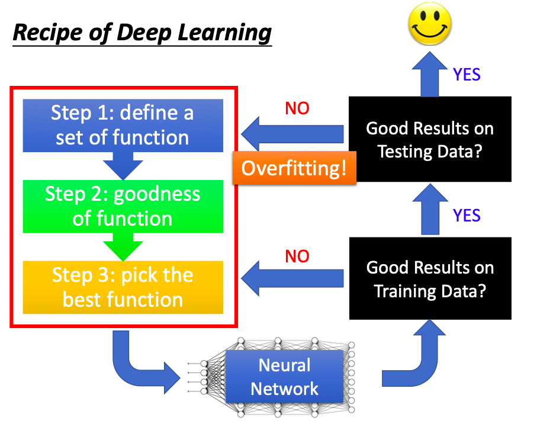
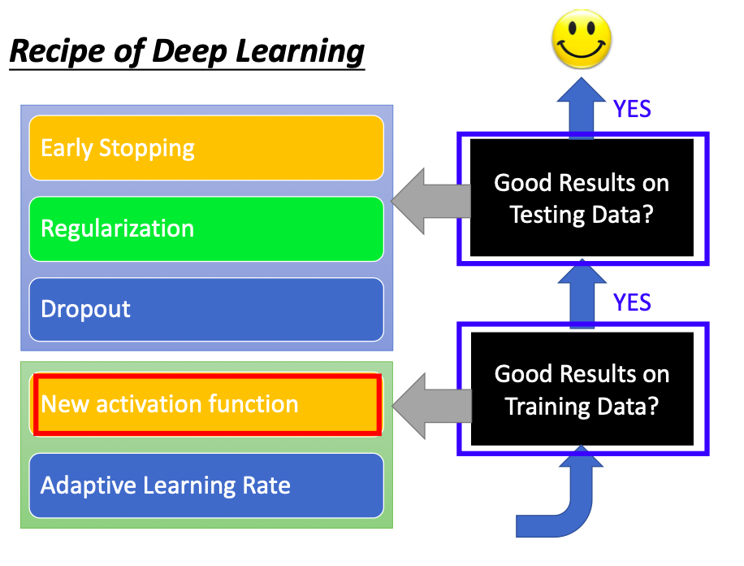
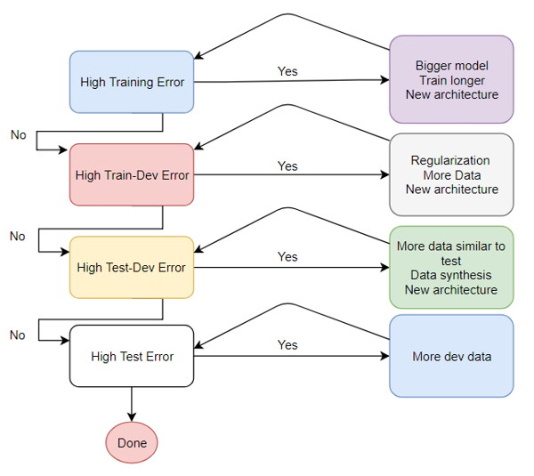

# **训练神经网络的流程**

⌚️: 2020年7月30日

📚参考

---

## **1. 好好检查数据**

训练神经网络的第一步是完全不接触任何神经网络代码，而是从彻底检查数据开始。此步骤至关重要。花时间去检查数据是一件比较重要的工作。因为数据中往往可能存在异常值，而且了解它们的分布可以有利于我们找到一个更好的模型。

## **2. 评估框架并得到一个并不完美的baseline**

此阶段的提示和技巧：

- **固定随机种子**：始终使用固定的随机种子来确保两次运行代码时您将获得相同的结果。
- 简化：在此阶段，请务必关闭任何数据扩充功能。数据扩充是我们稍后可能会采用的一种正则化策略，但是目前这只是引入一种错误的尝试。
- 验证损失：验证您的损失是否从正确的损失值开始。
- 设定一个好的初始化
- 人类基线：监控除损失之外的指标，这些指标是人类可以解释和检查的（例如准确性）。尽可能评估自己（人类）的准确性并与之进行比较。
- 可视化预测动态。我喜欢在train过程中可视化固定测试批次上的模型预测。这些预测如何运动的“动力”将使您对培训的进行方式有非常好的直觉。如果网络以某种方式过度摆动，可能会感觉网络“努力”以适应您的数据，这表明不稳定。抖动量也很容易注意到非常低或非常高的学习率。

## **3. 过度拟合**

找到一个好的模型的方法有两个阶段：首先获得一个足够大的模型以使其可以过度拟合（即专注于训练损失），然后适当地对其进行正则化（放弃一些训练损失以提高验证损失）。

此阶段的一些提示和技巧：

- 选择模型：为了减少训练损失，您需要为数据选择合适的体系结构。
- Adam是安全的。在设定基准的早期阶段，我喜欢以3e-4的学习率使用Adam 。以我的经验，亚当更宽容超参数，包括不良的学习速度。对于ConvNets，调整良好的SGD几乎总是比Adam稍胜一筹，但是最佳学习率区域要狭窄得多且针对特定问题。
- 一次只使一个复杂化。如果您有多个信号要插入您的分类器，我建议您将它们一个接一个地插入，并每次确保获得预期的性能提升。
- 不要相信学习率衰减的默认值。如果您要重新使用其他领域的代码，请务必小心学习率。

## **4. 正则化**

此阶段的一些提示和技巧：

- 获取更多数据
- 数据扩充
- 创意增强：如果半假数据没有做到这一点，伪造数据也可能会有所作为。人们正在寻找扩展数据集的创新方法。例如，领域随机化，模拟的使用，巧妙的混合，例如将（潜在模拟的）数据插入场景，甚至GAN。
- 使用预训练网络
- 坚持监督学习
- 减小输入维数
- 减小模型尺寸
- 减小批量大小
- Dropout
- 提早停止训练。根据您测得的验证损失提前停止训练，以在模型快要过拟合的时候捕获模型。
- 尝试更大的模型。大型模型大多数最终会过拟合，但是它们的“早期停止”性能通常会比小型模型好得多。

## **5. 微调**

此阶段的一些提示和技巧：

- 随机网格搜索
- 超参数优化

## **6. 进一步提高精确率**

- 模型集成

- 构造训练集和验证集；

- 每轮进行训练和验证，并根据最优验证集精度保存模型。

  

## 7. 模型调参

深度学习原理少但实践性非常强，基本上很多的模型的验证只能通过训练来完成。同时深度学习有众多的网络结构和超参数，因此需要反复尝试。训练深度学习模型需要GPU的硬件支持，也需要较多的训练时间，如何有效的训练深度学习模型逐渐成为了一门学问。

深度学习有众多的训练技巧，本节挑选了常见的一些技巧来讲解，并针对本次赛题进行具体分析。与传统的机器学习模型不同，深度学习模型的精度与模型的复杂度、数据量、正则化、数据扩增等因素直接相关。所以当深度学习模型处于不同的阶段（欠拟合、过拟合和完美拟合）的情况下，大家可以知道可以什么角度来继续优化模型。在参加本次比赛的过程中建议大家以如下逻辑完成：

1. 初步构建简单的CNN模型，不用特别复杂，跑通训练、验证和预测的流程。
2. 简单CNN模型的损失会比较大，尝试增加模型复杂度，并观察验证集精度。
3. 在增加模型复杂度的同时增加数据扩增方法，直至验证集精度不变。

