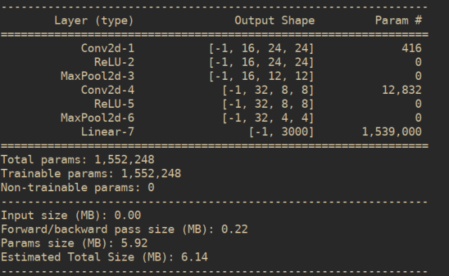
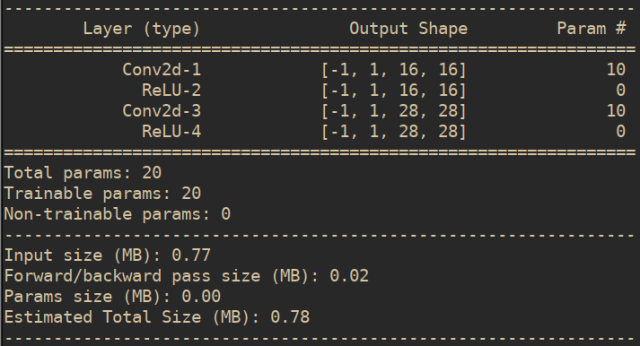

# 使用 torchsummary 將模型視覺化

⌚️: 2021年4月1日

📚参考

---

```
#summary[m_key]["input_shape"] = list(input[0].size())
# summary[m_key]["input_shape"] = list(input[0].size())
if isinstance(input[0], torch.Tensor):
	summary[m_key]["input_shape"] = list(input[0].size())
elif isinstance(input[0], list):
	summary[m_key]["input_shape"] = list(np.array(input[0]).shape)
summary[m_key]["input_shape"][0] = batch_size

```

报错解决：https://blog.csdn.net/huanjin_w/article/details/110858744

## 前言

在我們使用 PyTorch 這個著名的 Python 深度學習框架時，若能夠將我們建構的模型視覺化呈現出來，那就再好不過了。

- 一來我們能確認我們模型的架構、輸出的 Shape，防止我們的模型層 Mismatch。
- 二來若是我們有要對他人解說、報告，那麼能夠比較好地去視覺化我們的模型，想必會有比較好的效果。


當然，PyTorch 原本就有著『**印出模型**』的功能，不過可惜的是，PyTorch 本身印出的模型構造並不是照著 forward() 在跑，而是僅僅只有定義的模型層。

今天我想要紀錄的 **torchsummary** 就是一款專門用於視覺化 PyTorch 模型中 forward() 結構的套件。不過雖然說是視覺化，其實目前也僅僅只是使用命令列的文字顯示模型結構，若要像流程圖一般的視覺化模型，可能還是得研究 **TensorBoard** 了。

以下，就來示範一下該如何使用 torchsummary 吧！

## 1. PyTorch 原本印出模型的方法

首先，先以我之前寫過的 CNN 分類模型來示範 PyTorch 原本印出模型的效果。

```
# -*- coding: utf-8 -*-
"""
Defined CNN model
"""
import torch
import torch.nn as nn
import torch.nn.functional as F


# Model
class CNN(nn.Module):
     def __init__(self, classes):
         super(CNN, self).__init__()
         self.conv_1 = nn.Conv2d(in_channels=1,
                               out_channels=16,
                               kernel_size=5,
                               stride=1,
                               padding=0)

         self.conv_2 = nn.Conv2d(in_channels=16,
                                 out_channels=32,
                                 kernel_size=5,
                                 stride=1,
                                 padding=0)
         self.relu = nn.ReLU()
         self.max_pool = nn.MaxPool2d(kernel_size=2)
         self.fc = nn.Linear(32*4*4, classes)

     def forward(self, x):
         x = self.conv_1(x)
         x = self.relu(x)
         x = self.max_pool(x)
         x = self.conv_2(x)
         x = self.relu(x)
         x = self.max_pool(x)
         x = x.view(x.size(0), -1)
         x = self.fc(x)
         return x


if __name__ == '__main__':
     cnn = CNN(3000).cuda()
     print(cnn)
```

Output:

```
CNN(
   (conv_1): Conv2d(1, 16, kernel_size=(5, 5), stride=(1, 1))
   (conv_2): Conv2d(16, 32, kernel_size=(5, 5), stride=(1, 1))
   (relu): ReLU()
   (max_pool): MaxPool2d(kernel_size=2, stride=2, padding=0, dilation=1, ceil_mode=False)
   (fc): Linear(in_features=512, out_features=3000, bias=True)
)
```

我想從這邊就看得出來 PyTorch 直接印出模型結構的問題了：

**ReLU() 跟 MaxPool 我都使用了兩次，可是顯示出的模型結構就僅僅只是按照初始化的模型層印出來而已。**

而我希望看到的，是按照 forward() 部份印出的模型。

## 2. torchsummary 的使用方法

若是第一次使用，我們需要先以以下指令安裝：

```
sudo pip3 install torchsummary
```

使用方法則非常簡單，基本如下：

```
# -*- coding: utf-8 -*-
"""
Defined CNN model
"""
import torch
import torch.nn as nn
import torch.nn.functional as F
from torchsummary import summary


# Model
class CNN(nn.Module):
     def __init__(self, classes):
         super(CNN, self).__init__()
         self.conv_1 = nn.Conv2d(in_channels=1,
                               out_channels=16,
                               kernel_size=5,
                               stride=1,
                               padding=0)

         self.conv_2 = nn.Conv2d(in_channels=16,
                                 out_channels=32,
                                 kernel_size=5,
                                 stride=1,
                                 padding=0)
         self.relu = nn.ReLU()
         self.max_pool = nn.MaxPool2d(kernel_size=2)
         self.fc = nn.Linear(32*4*4, classes)

     def forward(self, x):
         x = self.conv_1(x)
         x = self.relu(x)
         x = self.max_pool(x)
         x = self.conv_2(x)
         x = self.relu(x)
         x = self.max_pool(x)
         x = x.view(x.size(0), -1)
         x = self.fc(x)
         return x


if __name__ == '__main__':
     cnn = CNN(3000).cuda()
     summary(cnn, (1, 28, 28))
```

Output:




可以看到，這就是我想要的效果。

不僅有按照 Input 通過的模型層印出，也有通過模型層時的 Shape，這正是我想要的效果。

要注意的是，我們在使用 summary() 函式的時候要一併輸入我們 Tensor 的 Shape、並且將模型使用 cuda() 移動至 GPU 上運算，這樣 torchsummary 才會正常運作。

也要提醒：如果輸入了錯誤的 Shape，可是會直接報錯的哦！

## 3. 模型複數輸入的情況

torchsummary 不僅僅能處理單個輸入的情況。事實上，當我們的模型分成兩類，有著不同的輸入、最後才連結在一起的情況，torchsummary 同樣可以處理，只是就稍嫌不夠直覺。

以下是一個 Github 上的範例。 (連結於文末)

```
import torch
import torch.nn as nn
from torchsummary import summary

class SimpleConv(nn.Module):
     def __init__(self):
         super(SimpleConv, self).__init__()
         self.features = nn.Sequential(
             nn.Conv2d(1, 1, kernel_size=3, stride=1, padding=1),
             nn.ReLU(),
         )

     def forward(self, x, y):
         x1 = self.features(x)
         x2 = self.features(y)
         return x1, x2
     
device = torch.device("cuda" if torch.cuda.is_available() else "cpu")
model = SimpleConv().to(device)

summary(model, [(1, 16, 16), (1, 28, 28)])
```

Output:



------

## 4. 使用心得

這就是我一直以來在尋找的東西，確實就是我想要的功能。不過人心總是不足，發現了這個工具之後，又希望可以像流程圖一樣視覺化。本來想說也許可以自己刻刻看視覺化的程式，但是看到多個輸入的產生結果後又發覺事情沒有自己想得那麼簡單。

而且在自己動手做以前，最好再查查看有沒有大神已經製作出來了。一般來講大神製作的套件總是穩定、再者，自己若是重複造輪子卻又沒有發揮餘地，那就有點浪費時間了。

更甚者，其實使用 TensorBoard 就可以產生類似我想要的那種視覺化模型結構圖了。可能真的沒必要為了省這麼一點時間 (連結上 TensorBoard 的時間) 而嘗試撰寫模型流程圖。

總之，torchsummary 是個相當棒的套件，推薦給大家。

